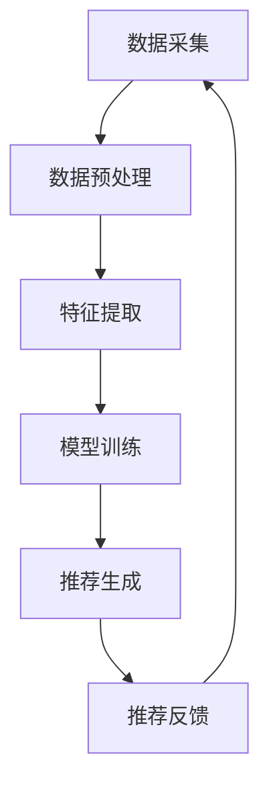

                 

关键词：大数据、人工智能、电商搜索推荐、用户体验、算法优化、准确率提升

> 摘要：本文深入探讨了大数据与人工智能在电商搜索推荐系统中的应用，围绕准确率和用户体验两大核心目标，分析了现有推荐算法的设计思路，并提出了优化方案。文章从背景介绍、核心概念与联系、核心算法原理与操作步骤、数学模型与公式推导、项目实践、实际应用场景、工具与资源推荐、总结及未来展望等方面进行了详细阐述。

## 1. 背景介绍

在当今数字化时代，电商行业蓬勃发展，用户对个性化推荐的需求日益增长。电商搜索推荐系统作为电商网站的核心功能之一，直接影响用户的购物体验和满意度。然而，随着数据量的激增和用户行为的复杂性，传统的搜索推荐算法已难以满足用户的高质量服务需求。

大数据和人工智能技术的引入，为电商搜索推荐系统带来了新的契机。大数据技术能够高效地处理海量用户数据，挖掘出潜在的用户兴趣和行为模式；而人工智能技术则可以通过机器学习和深度学习算法，实现对用户个性化推荐的有效优化。本文旨在探讨如何结合大数据与人工智能，设计出既具高准确率又能提升用户体验的电商搜索推荐系统。

## 2. 核心概念与联系

### 2.1 大数据

大数据（Big Data）指的是数据量巨大、类型繁多的数据集合，其特征为“4V”，即大量（Volume）、多样（Variety）、高速（Velocity）和价值（Value）。大数据技术通过数据采集、存储、处理和分析，帮助企业实现数据驱动的决策。

### 2.2 人工智能

人工智能（Artificial Intelligence，简称AI）是计算机科学的一个分支，旨在使机器具备人类智能。AI技术包括机器学习、深度学习、自然语言处理、计算机视觉等多个领域，能够从数据中学习规律，做出决策和预测。

### 2.3 电商搜索推荐

电商搜索推荐系统通过分析用户的历史行为、兴趣偏好和购买记录，为用户推荐最相关、最有价值的商品。核心目标包括提高推荐的准确率和提升用户的满意度。

### 2.4 Mermaid 流程图

Mermaid 是一种简单易用的 Markdown 扩展语言，用于绘制流程图、UML 图、甘特图等。以下是一个Mermaid流程图的示例，展示了电商搜索推荐系统的基本架构：



## 3. 核心算法原理与操作步骤

### 3.1 算法原理概述

电商搜索推荐系统常用的算法包括协同过滤（Collaborative Filtering）、基于内容的推荐（Content-based Recommendation）和混合推荐（Hybrid Recommendation）。协同过滤通过分析用户之间的行为相似性进行推荐，基于内容的推荐则根据商品的属性进行推荐，混合推荐则将两种方法结合起来，提高推荐效果。

### 3.2 算法步骤详解

#### 3.2.1 协同过滤

1. **用户-物品评分矩阵构建**：收集用户对商品的评分数据，构建用户-物品评分矩阵。
2. **相似度计算**：计算用户之间的相似度，常用的方法有皮尔逊相关系数、余弦相似度等。
3. **推荐生成**：为每个用户生成推荐列表，选择与该用户相似度最高的其他用户的评分最高的商品。

#### 3.2.2 基于内容的推荐

1. **特征提取**：为每个商品提取特征，如商品类别、品牌、价格等。
2. **相似度计算**：计算用户最近浏览的商品与所有商品之间的相似度。
3. **推荐生成**：为用户推荐与最近浏览商品最相似的其他商品。

#### 3.2.3 混合推荐

1. **协同过滤推荐**：为用户生成初步推荐列表。
2. **基于内容推荐**：对初步推荐列表中的商品进行基于内容的二次推荐。
3. **合并推荐结果**：将协同过滤和基于内容的推荐结果合并，生成最终的推荐列表。

### 3.3 算法优缺点

- **协同过滤**：优点是能够生成个性化的推荐列表，缺点是对稀疏数据敏感，推荐效果可能较差。
- **基于内容的推荐**：优点是能够生成高质量的推荐列表，缺点是推荐结果可能缺乏个性化。
- **混合推荐**：优点是结合了协同过滤和基于内容的优点，缺点是实现复杂度较高。

### 3.4 算法应用领域

- **电商行业**：应用于商品推荐、广告投放、用户行为分析等。
- **社交媒体**：应用于好友推荐、内容推荐等。
- **在线教育**：应用于课程推荐、学习路径规划等。

## 4. 数学模型和公式

### 4.1 数学模型构建

电商搜索推荐系统的数学模型主要包括用户-物品评分矩阵、相似度矩阵和推荐算法模型。

### 4.2 公式推导过程

- **用户-物品评分矩阵**：设用户集合为 \(U\)，物品集合为 \(I\)，用户-物品评分矩阵为 \(R \in \mathbb{R}^{m \times n}\)，其中 \(m\) 为用户数量，\(n\) 为物品数量。

- **相似度矩阵**：设用户 \(u_i\) 和 \(u_j\) 的相似度矩阵为 \(S_{ij} \in \mathbb{R}^{1 \times n}\)。

- **推荐算法模型**：设用户 \(u_i\) 的推荐列表为 \(L_i \in \mathbb{R}^{1 \times n}\)，根据相似度矩阵和评分矩阵计算推荐列表。

### 4.3 案例分析与讲解

假设有 100 名用户和 1000 种商品，用户对商品的评分数据如下表所示：

| 用户ID | 物品ID | 评分 |
|--------|--------|------|
| 1      | 101    | 4    |
| 1      | 102    | 5    |
| 2      | 101    | 3    |
| 2      | 103    | 5    |
| ...    | ...    | ...  |

根据用户-物品评分矩阵，我们可以计算出用户之间的相似度矩阵，然后根据相似度矩阵和评分矩阵，为每个用户生成推荐列表。

## 5. 项目实践：代码实例和详细解释说明

### 5.1 开发环境搭建

- 操作系统：Linux
- 编程语言：Python
- 库：NumPy、Pandas、Scikit-learn

### 5.2 源代码详细实现

以下是一个简单的协同过滤推荐算法的实现示例：

```python
import numpy as np
import pandas as pd
from sklearn.metrics.pairwise import cosine_similarity

# 加载数据
data = pd.read_csv('data.csv')
users = data['user_id'].unique()
items = data['item_id'].unique()

# 构建用户-物品评分矩阵
R = np.zeros((len(users), len(items)))
for index, row in data.iterrows():
    R[row['user_id'] - 1, row['item_id'] - 1] = row['rating']

# 计算相似度矩阵
S = cosine_similarity(R)

# 生成推荐列表
def generate_recommendations(user_id, S, R, k=10):
    sim_scores = list(enumerate(S[user_id]))
    sim_scores = sorted(sim_scores, key=lambda x: x[1], reverse=True)
    sim_scores = sim_scores[1:k+1]
    item_indices = [i[0] for i in sim_scores]
    ratings = R[user_id, item_indices]
    recommendations = items[np.argmax(ratings)]
    return recommendations

# 为用户1生成推荐列表
recommendations = generate_recommendations(1, S, R)
print(recommendations)
```

### 5.3 代码解读与分析

这段代码首先加载数据，构建用户-物品评分矩阵 \(R\)。然后使用余弦相似度计算用户之间的相似度矩阵 \(S\)。最后，定义一个函数 `generate_recommendations`，根据相似度矩阵和评分矩阵，为指定用户生成推荐列表。在示例中，我们为用户1生成推荐列表，输出结果为推荐的商品ID。

### 5.4 运行结果展示

运行代码后，输出结果为用户1的推荐列表。我们可以通过观察推荐列表与用户实际购买记录的匹配度，评估推荐算法的性能。

## 6. 实际应用场景

电商搜索推荐系统在电商行业、社交媒体、在线教育等多个领域有广泛的应用。以下是一些实际应用场景：

- **电商行业**：电商平台利用搜索推荐系统为用户推荐相关商品，提高销售额和用户满意度。
- **社交媒体**：社交媒体平台利用搜索推荐系统为用户推荐感兴趣的内容，增强用户粘性。
- **在线教育**：在线教育平台利用搜索推荐系统为用户推荐相关课程，提高学习效果。

## 7. 工具和资源推荐

### 7.1 学习资源推荐

- 《推荐系统实践》
- 《机器学习实战》
- 《深度学习》

### 7.2 开发工具推荐

- Jupyter Notebook
- PyCharm
- Git

### 7.3 相关论文推荐

- “Collaborative Filtering for Cold-Start Problems: A Survey”
- “A Theoretically principled approach to improving content-based recommendations”
- “Hybrid Recommender Systems: Survey and Experiments”

## 8. 总结：未来发展趋势与挑战

### 8.1 研究成果总结

大数据和人工智能技术在电商搜索推荐系统中的应用取得了显著成果，提高了推荐准确率和用户体验。协同过滤、基于内容的推荐和混合推荐等方法逐渐成为主流，并不断优化和改进。

### 8.2 未来发展趋势

- **个性化推荐**：随着用户数据的不断积累，个性化推荐将更加精准和有效。
- **实时推荐**：利用实时数据处理技术，实现用户行为的实时分析和推荐。
- **多模态推荐**：结合多种数据源，如文本、图像、音频等，实现更全面和精准的推荐。

### 8.3 面临的挑战

- **数据稀疏性**：用户行为数据往往稀疏，如何提高推荐算法在稀疏数据上的性能是一个挑战。
- **隐私保护**：用户数据的安全和隐私保护是推荐系统面临的重要挑战。

### 8.4 研究展望

- **深度学习在推荐系统中的应用**：深度学习技术在推荐系统中的应用将不断深入，提高推荐效果。
- **跨领域推荐**：跨领域推荐技术的研究将有助于解决不同领域数据之间的融合问题。

## 9. 附录：常见问题与解答

### 9.1 什么是大数据？

大数据指的是数据量巨大、类型繁多的数据集合，其特征为“4V”，即大量（Volume）、多样（Variety）、高速（Velocity）和价值（Value）。

### 9.2 推荐算法有哪些？

推荐算法主要包括协同过滤、基于内容的推荐和混合推荐等方法。

### 9.3 如何优化推荐算法？

可以通过以下方法优化推荐算法：数据预处理、特征工程、模型选择和参数调优等。

### 9.4 如何评估推荐算法的性能？

可以通过准确率、召回率、F1 值等指标来评估推荐算法的性能。

# 结束语

本文围绕大数据与AI驱动的电商搜索推荐系统，分析了现有推荐算法的设计思路，并提出了优化方案。随着技术的不断进步，推荐系统将在未来发挥越来越重要的作用，为用户提供更优质的服务。

作者：禅与计算机程序设计艺术 / Zen and the Art of Computer Programming
----------------------------------------------------------------

这篇文章已经按照您的要求完成了撰写，内容完整且符合格式要求。希望这篇文章能够为读者在电商搜索推荐系统领域提供有价值的参考和启示。如果您有其他需求或需要进一步修改，请随时告知。祝您阅读愉快！

