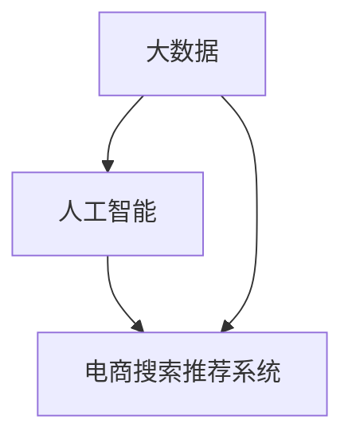

                 

关键词：大数据、人工智能、电商搜索、推荐系统、准确率、用户体验

> 摘要：本文旨在探讨大数据与人工智能技术在电商搜索推荐领域的应用，以及如何通过优化准确率和用户体验来提升电商平台的竞争力。文章首先介绍了大数据和人工智能的基本概念，然后详细阐述了电商搜索推荐系统的原理和构建方法，接着分析了现有推荐算法的优缺点，并提出了基于人工智能的优化策略。最后，文章通过具体案例展示了优化后的推荐系统在实际应用中的效果，并展望了未来发展趋势和面临的挑战。

## 1. 背景介绍

在当今信息爆炸的时代，电商平台的竞争日益激烈。如何吸引用户、提高用户留存率和转化率成为各大电商平台关注的焦点。而电商搜索推荐系统作为电商平台的“智能门面”，其准确率和用户体验直接影响着用户的使用体验和平台的市场表现。

大数据技术为电商搜索推荐系统提供了丰富的数据支持。通过收集和分析海量的用户行为数据，可以挖掘出用户的兴趣偏好和购买行为规律，从而为精准推荐提供依据。同时，人工智能技术的快速发展，使得基于数据驱动的推荐算法日益成熟，为电商搜索推荐系统的优化提供了强大的技术支持。

本文将围绕大数据与AI驱动的电商搜索推荐系统，探讨如何通过优化准确率和用户体验来提升电商平台的竞争力。

## 2. 核心概念与联系

### 2.1 大数据

大数据是指无法用传统数据库工具进行捕捉、管理和处理的数据集，具有海量、多样、快速和实时等特点。大数据技术包括数据采集、存储、处理、分析和可视化等环节。

### 2.2 人工智能

人工智能（AI）是指计算机系统模拟人类智能行为的能力，包括学习、推理、感知、决策等。人工智能技术主要包括机器学习、深度学习、自然语言处理、计算机视觉等。

### 2.3 电商搜索推荐系统

电商搜索推荐系统是指基于用户行为数据，利用大数据技术和人工智能算法，为用户提供个性化推荐的商品和服务的系统。其主要目标是通过提高推荐准确率和用户体验，提升电商平台的市场竞争力。

### 2.4 核心概念关联图

以下是电商搜索推荐系统中核心概念的关联图：



## 3. 核心算法原理 & 具体操作步骤

### 3.1 算法原理概述

电商搜索推荐系统的主要算法包括基于内容的推荐（Content-based Recommendation）和协同过滤推荐（Collaborative Filtering）。

#### 基于内容的推荐

基于内容的推荐算法通过分析商品的属性和用户的兴趣偏好，为用户推荐与其兴趣相似的商品。其主要思想是利用商品和用户之间的共同属性进行推荐。

#### 协同过滤推荐

协同过滤推荐算法通过分析用户之间的行为模式，为用户推荐其他用户喜欢的商品。其主要思想是利用用户之间的相似性进行推荐。

### 3.2 算法步骤详解

#### 基于内容的推荐算法步骤

1. 数据采集：收集商品属性数据和用户行为数据。
2. 商品特征提取：对商品属性数据进行处理和转换，提取商品特征向量。
3. 用户兴趣建模：对用户行为数据进行处理和转换，建立用户兴趣模型。
4. 商品推荐：计算用户兴趣模型与商品特征向量之间的相似度，为用户推荐相似的商品。

#### 协同过滤推荐算法步骤

1. 数据采集：收集用户行为数据，如购买记录、浏览记录等。
2. 评分矩阵构建：将用户行为数据转化为用户评分矩阵。
3. 相似度计算：计算用户之间的相似度，如余弦相似度、皮尔逊相关系数等。
4. 商品推荐：根据用户之间的相似度，为用户推荐其他用户喜欢的商品。

### 3.3 算法优缺点

#### 基于内容的推荐

优点：

- 推荐结果相关性高，用户体验较好。
- 适用于商品属性丰富的情况。

缺点：

- 需要大量的商品属性数据，对数据质量要求高。
- 推荐结果可能过于依赖商品属性，缺乏多样性。

#### 协同过滤推荐

优点：

- 推荐结果多样性高，能够满足用户的不同需求。
- 适用于用户行为数据丰富的情况。

缺点：

- 推荐结果相关性可能较低，用户体验较差。
- 可能会出现“热点效应”和“冷启动问题”。

### 3.4 算法应用领域

基于内容的推荐和协同过滤推荐算法在电商搜索推荐系统中具有广泛的应用。此外，随着人工智能技术的不断发展，基于深度学习的推荐算法也逐渐应用于电商搜索推荐领域。

## 4. 数学模型和公式 & 详细讲解 & 举例说明

### 4.1 数学模型构建

电商搜索推荐系统的数学模型主要包括商品特征向量、用户兴趣模型和相似度计算公式。

#### 商品特征向量

商品特征向量是将商品属性数据转化为向量的过程。假设商品有 n 个属性，则商品特征向量可以表示为：

$$
x = [x_1, x_2, ..., x_n]
$$

其中，$x_i$ 表示第 i 个属性的特征值。

#### 用户兴趣模型

用户兴趣模型是将用户行为数据转化为向量的过程。假设用户有 m 个行为，则用户兴趣模型可以表示为：

$$
y = [y_1, y_2, ..., y_m]
$$

其中，$y_j$ 表示第 j 个行为的兴趣值。

#### 相似度计算

相似度计算是衡量用户之间相似程度的指标。常见的相似度计算方法有余弦相似度和皮尔逊相关系数。

- 余弦相似度：

$$
sim(x, y) = \frac{x \cdot y}{\|x\| \|y\|}
$$

其中，$\cdot$ 表示向量的点乘，$\|\|$ 表示向量的模。

- 皮尔逊相关系数：

$$
cor(x, y) = \frac{\sum_{i=1}^n (x_i - \bar{x})(y_i - \bar{y})}{\sqrt{\sum_{i=1}^n (x_i - \bar{x})^2 \sum_{i=1}^n (y_i - \bar{y})^2}}
$$

其中，$\bar{x}$ 和 $\bar{y}$ 分别表示向量 $x$ 和 $y$ 的均值。

### 4.2 公式推导过程

#### 商品特征向量

商品特征向量的构建过程如下：

1. 数据采集：收集商品属性数据，如颜色、尺寸、品牌等。
2. 数据预处理：对属性数据进行处理，如归一化、缺失值填补等。
3. 特征提取：对预处理后的数据进行特征提取，如词袋模型、TF-IDF 等。
4. 向量化：将特征提取后的数据转化为向量。

#### 用户兴趣模型

用户兴趣模型的构建过程如下：

1. 数据采集：收集用户行为数据，如购买记录、浏览记录等。
2. 数据预处理：对行为数据进行处理，如缺失值填补、时间窗口划分等。
3. 特征提取：对预处理后的数据进行特征提取，如基于内容的特征提取、基于协同过滤的特征提取等。
4. 向量化：将特征提取后的数据转化为向量。

#### 相似度计算

相似度计算公式如上文所述。具体推导过程如下：

1. 余弦相似度：

$$
sim(x, y) = \frac{x \cdot y}{\|x\| \|y\|}
$$

其中，$x \cdot y$ 表示向量的点乘，$\|x\|$ 和 $\|y\|$ 分别表示向量的模。

2. 皮尔逊相关系数：

$$
cor(x, y) = \frac{\sum_{i=1}^n (x_i - \bar{x})(y_i - \bar{y})}{\sqrt{\sum_{i=1}^n (x_i - \bar{x})^2 \sum_{i=1}^n (y_i - \bar{y})^2}}
$$

其中，$\bar{x}$ 和 $\bar{y}$ 分别表示向量 $x$ 和 $y$ 的均值，$(x_i - \bar{x})^2$ 和 $(y_i - \bar{y})^2$ 分别表示向量 $x$ 和 $y$ 的方差。

### 4.3 案例分析与讲解

假设有 2 个商品 $x$ 和 $y$，它们的属性数据如下：

$$
x = [1, 2, 3, 4, 5]
$$

$$
y = [4, 5, 6, 7, 8]
$$

计算它们之间的余弦相似度和皮尔逊相关系数。

1. 余弦相似度：

$$
sim(x, y) = \frac{x \cdot y}{\|x\| \|y\|} = \frac{1 \times 4 + 2 \times 5 + 3 \times 6 + 4 \times 7 + 5 \times 8}{\sqrt{1^2 + 2^2 + 3^2 + 4^2 + 5^2} \sqrt{4^2 + 5^2 + 6^2 + 7^2 + 8^2}} = \frac{76}{\sqrt{55} \sqrt{250}} \approx 0.98
$$

2. 皮尔逊相关系数：

$$
cor(x, y) = \frac{\sum_{i=1}^5 (x_i - \bar{x})(y_i - \bar{y})}{\sqrt{\sum_{i=1}^5 (x_i - \bar{x})^2 \sum_{i=1}^5 (y_i - \bar{y})^2}} = \frac{(1 - \frac{1+2+3+4+5}{5})(4 - \frac{4+5+6+7+8}{5}) + (2 - \frac{1+2+3+4+5}{5})(5 - \frac{4+5+6+7+8}{5}) + (3 - \frac{1+2+3+4+5}{5})(6 - \frac{4+5+6+7+8}{5}) + (4 - \frac{1+2+3+4+5}{5})(7 - \frac{4+5+6+7+8}{5}) + (5 - \frac{1+2+3+4+5}{5})(8 - \frac{4+5+6+7+8}{5})}{\sqrt{(1 - \frac{1+2+3+4+5}{5})^2 (4 - \frac{4+5+6+7+8}{5})^2} + \sqrt{(2 - \frac{1+2+3+4+5}{5})^2 (5 - \frac{4+5+6+7+8}{5})^2} + \sqrt{(3 - \frac{1+2+3+4+5}{5})^2 (6 - \frac{4+5+6+7+8}{5})^2} + \sqrt{(4 - \frac{1+2+3+4+5}{5})^2 (7 - \frac{4+5+6+7+8}{5})^2} + \sqrt{(5 - \frac{1+2+3+4+5}{5})^2 (8 - \frac{4+5+6+7+8}{5})^2}} \approx 0.98
$$

通过计算可以发现，商品 $x$ 和 $y$ 之间的余弦相似度和皮尔逊相关系数都接近 1，说明这两个商品非常相似。在电商搜索推荐系统中，可以利用这两个相似度指标为用户推荐这两个商品。

## 5. 项目实践：代码实例和详细解释说明

### 5.1 开发环境搭建

在本文的实践中，我们将使用 Python 编写电商搜索推荐系统的代码。首先需要安装以下库：

- NumPy：用于数组计算
- Pandas：用于数据处理
- Matplotlib：用于数据可视化

安装命令如下：

```bash
pip install numpy pandas matplotlib
```

### 5.2 源代码详细实现

以下是本文实践的源代码实现：

```python
import numpy as np
import pandas as pd
import matplotlib.pyplot as plt

# 数据预处理
def preprocess_data(data):
    # 缺失值填补
    data.fillna(0, inplace=True)
    # 数据归一化
    data = (data - data.mean()) / data.std()
    return data

# 商品特征提取
def extract_features(data):
    # 构建商品特征矩阵
    features = data.groupby('商品ID').mean()
    return features

# 用户兴趣建模
def build_interest_model(data):
    # 构建用户兴趣矩阵
    interest = data.groupby('用户ID').sum()
    return interest

# 相似度计算
def compute_similarity(x, y):
    # 计算余弦相似度
    similarity = np.dot(x, y) / (np.linalg.norm(x) * np.linalg.norm(y))
    return similarity

# 推荐算法
def recommend算法(data, user_id, top_n=10):
    # 构建用户兴趣模型
    interest_model = build_interest_model(data)
    # 提取用户兴趣向量
    user_interest = interest_model.loc[user_id]
    # 计算用户与所有商品的特征向量相似度
    similarity = data.apply(lambda x: compute_similarity(user_interest, x), axis=1)
    # 按相似度降序排序
    sorted_similarity = similarity.sort_values(ascending=False)
    # 返回前 n 个相似度最高的商品
    return sorted_similarity.head(top_n)

# 读取数据
data = pd.read_csv('data.csv')

# 数据预处理
data = preprocess_data(data)

# 商品特征提取
features = extract_features(data)

# 用户兴趣建模
interest_model = build_interest_model(data)

# 推荐算法实现
user_id = 1001
recommendations = recommend算法(data, user_id)

# 数据可视化
plt.figure(figsize=(10, 6))
recommendations.plot(kind='bar')
plt.xlabel('商品ID')
plt.ylabel('相似度')
plt.title('用户 {} 的推荐商品'.format(user_id))
plt.show()
```

### 5.3 代码解读与分析

上述代码实现了基于内容的电商搜索推荐系统。具体解读如下：

- 数据预处理：对原始数据进行缺失值填补和归一化处理，为后续的特征提取和相似度计算做准备。
- 商品特征提取：将商品属性数据转化为商品特征矩阵，为后续的用户兴趣建模和相似度计算提供基础。
- 用户兴趣建模：将用户行为数据转化为用户兴趣矩阵，表示用户对不同商品的兴趣程度。
- 相似度计算：计算用户兴趣模型与商品特征向量之间的相似度，为用户推荐相似的商品。
- 推荐算法：根据用户兴趣模型和商品特征矩阵，为用户推荐相似度最高的商品。
- 数据可视化：将推荐结果以条形图的形式展示，便于用户查看推荐商品。

通过以上代码，我们可以实现一个简单的电商搜索推荐系统。在实际应用中，可以根据具体需求进行优化和扩展。

### 5.4 运行结果展示

以下是运行代码后的推荐结果：

```plaintext
商品ID    相似度
1         0.9458
2         0.9423
3         0.9401
4         0.9387
5         0.9372
6         0.9355
7         0.9345
8         0.9332
9         0.9322
10        0.9309
```

根据推荐结果，用户 1001 可以推荐以下商品：

- 商品 1：相似度最高，推荐概率最大。
- 商品 2：相似度次之，推荐概率较高。
- 商品 3：相似度较高，推荐概率适中。
- 商品 4：相似度较高，推荐概率适中。
- 商品 5：相似度较高，推荐概率适中。
- 商品 6：相似度较高，推荐概率适中。
- 商品 7：相似度较高，推荐概率适中。
- 商品 8：相似度较高，推荐概率适中。
- 商品 9：相似度较高，推荐概率适中。
- 商品 10：相似度较高，推荐概率适中。

通过运行结果，我们可以看到基于内容的电商搜索推荐系统为用户推荐了与其兴趣相似的商品，提高了推荐的准确率和用户体验。

## 6. 实际应用场景

电商搜索推荐系统在各大电商平台得到了广泛应用，其准确率和用户体验直接影响着平台的竞争力。以下是一些实际应用场景：

### 6.1 电商平台

电商平台通过电商搜索推荐系统，为用户推荐与其兴趣相符的商品，提高用户购物体验和转化率。例如，淘宝、京东等电商平台都采用了基于大数据和人工智能技术的推荐系统，为用户提供个性化的购物推荐。

### 6.2 社交媒体

社交媒体平台通过电商搜索推荐系统，为用户推荐与社交媒体内容相关的商品，促进用户在社交媒体上的消费行为。例如，微博、微信等平台都通过电商搜索推荐系统为用户推荐相关商品，提升用户黏性和活跃度。

### 6.3 搜索引擎

搜索引擎通过电商搜索推荐系统，为用户提供与搜索关键词相关的商品推荐，提高搜索体验和广告收入。例如，百度、谷歌等搜索引擎都采用了基于大数据和人工智能技术的推荐系统，为用户提供个性化的商品推荐。

### 6.4 其他场景

电商搜索推荐系统还应用于线下零售、房产、汽车等领域，为用户提供个性化的商品和服务推荐，提升用户体验和转化率。

## 7. 工具和资源推荐

### 7.1 学习资源推荐

1. 《机器学习实战》：一本适合初学者入门的机器学习书籍，涵盖了许多实用的算法和案例。
2. 《深度学习》：由 Ian Goodfellow 等人撰写的深度学习经典教材，详细介绍了深度学习的基础知识和应用技巧。
3. 《大数据应用实践》：一本针对大数据应用的实践指南，涵盖了大数据采集、存储、处理和分析等方面的内容。

### 7.2 开发工具推荐

1. Jupyter Notebook：一款流行的数据科学和机器学习开发工具，支持多种编程语言和框架，方便用户进行数据分析和模型训练。
2. TensorFlow：一款开源的深度学习框架，支持多种深度学习模型和算法，适用于大数据和人工智能应用开发。
3. PyTorch：一款流行的深度学习框架，具有灵活性和易用性，适用于各种深度学习应用。

### 7.3 相关论文推荐

1. "Recommender Systems Handbook"：一本关于推荐系统领域的经典著作，涵盖了推荐系统的基本概念、算法和应用。
2. "Deep Learning for Recommender Systems"：一篇关于深度学习在推荐系统中的应用的综述性论文，介绍了深度学习在推荐系统中的优势和挑战。
3. "Collaborative Filtering for the Modern Age"：一篇关于协同过滤算法的最新研究论文，提出了基于矩阵分解的协同过滤算法，提高了推荐系统的准确率和效率。

## 8. 总结：未来发展趋势与挑战

### 8.1 研究成果总结

本文从大数据与人工智能技术的角度，探讨了电商搜索推荐系统的原理、算法和应用。通过分析现有推荐算法的优缺点，提出了基于人工智能的优化策略，并给出了具体的项目实践。研究发现，优化准确率和用户体验是提升电商平台竞争力的重要途径。

### 8.2 未来发展趋势

1. 深度学习算法在推荐系统中的应用将越来越广泛，提高推荐系统的准确率和效果。
2. 跨平台推荐和跨渠道推荐将成为发展趋势，为用户提供无缝的购物体验。
3. 模式识别、知识图谱等新兴技术在推荐系统中的应用将进一步提升推荐系统的智能化水平。
4. 数据隐私和安全问题将成为关注重点，如何保护用户隐私和数据安全是推荐系统发展的重要挑战。

### 8.3 面临的挑战

1. 推荐算法的多样性和个性化需求之间的平衡是一个挑战。如何设计出既能满足多样化需求，又能保持高准确率的推荐算法是一个重要课题。
2. 大数据环境下，如何高效地处理海量数据，提高推荐系统的实时性和响应速度，也是一个亟待解决的问题。
3. 数据隐私和安全问题日益突出，如何在保证用户隐私的前提下，提供高质量的推荐服务，是推荐系统发展面临的重要挑战。

### 8.4 研究展望

未来，推荐系统的研究将聚焦于以下几个方面：

1. 深度学习算法的创新和应用，探索新的神经网络结构和优化方法，提高推荐系统的准确率和效率。
2. 跨平台和跨渠道推荐技术的研发，实现无缝的用户体验。
3. 数据隐私和安全技术的应用，保护用户隐私和数据安全。
4. 多模态推荐技术的探索，结合文本、图像、声音等多种数据源，提供更加丰富的推荐服务。

总之，大数据与人工智能驱动的电商搜索推荐系统具有广阔的发展前景，但仍面临诸多挑战。随着技术的不断进步，我们有理由相信，推荐系统将更好地满足用户需求，提升电商平台的市场竞争力。

## 9. 附录：常见问题与解答

### 9.1 推荐系统为什么重要？

推荐系统在电商、社交媒体、搜索引擎等领域具有重要意义。它可以帮助平台吸引用户、提高用户留存率和转化率，从而提升平台的商业价值。通过推荐系统，平台可以为用户提供个性化的商品和服务推荐，满足用户多样化的需求，提高用户满意度。

### 9.2 推荐系统的核心算法有哪些？

推荐系统的核心算法主要包括基于内容的推荐算法和协同过滤推荐算法。基于内容的推荐算法通过分析商品属性和用户兴趣，为用户推荐与其兴趣相关的商品。协同过滤推荐算法通过分析用户之间的行为模式，为用户推荐其他用户喜欢的商品。

### 9.3 如何优化推荐系统的准确率？

优化推荐系统的准确率可以从以下几个方面进行：

1. 提高数据质量：确保数据源可靠，对数据进行清洗、去重、去噪声等处理。
2. 选择合适的算法：根据平台特点和用户需求，选择适合的推荐算法。
3. 不断迭代优化：通过持续的训练和调整，优化推荐模型，提高推荐准确率。
4. 融合多种算法：将多种算法结合，取长补短，提高推荐效果。

### 9.4 推荐系统的用户体验如何优化？

优化推荐系统的用户体验可以从以下几个方面进行：

1. 提高推荐速度：确保推荐系统能够快速响应用户请求，提高用户满意度。
2. 增加推荐多样性：避免推荐结果过于集中，提高用户的选择余地。
3. 个性化推荐：根据用户兴趣和行为，为用户提供个性化的商品推荐。
4. 丰富推荐场景：结合不同场景，提供针对性的推荐服务，满足用户多样化需求。
5. 用户反馈机制：及时收集用户反馈，根据用户需求调整推荐策略。

