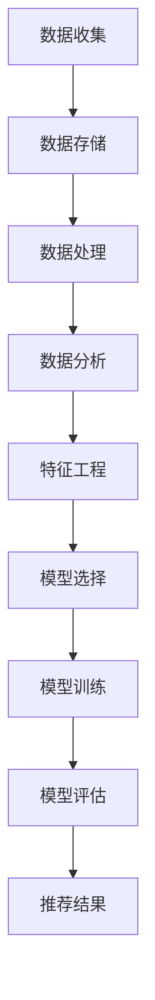

                 

关键词：大数据，人工智能，电商，搜索推荐，用户体验，设计思路，算法，模型，实践，应用场景，未来展望

> 摘要：随着电商行业的迅猛发展，用户对搜索推荐系统的需求越来越高。本文从用户体验的角度出发，探讨了大数据与人工智能技术如何驱动电商搜索推荐系统，并提出了一套以用户体验为中心的设计思路。通过对核心算法原理、数学模型、项目实践和未来展望的详细分析，本文旨在为电商搜索推荐系统提供有益的参考和指导。

## 1. 背景介绍

### 1.1 电商行业的发展

近年来，电商行业经历了快速的发展。根据统计，全球电商市场规模已经达到了数万亿美元，并且仍在不断扩大。随着移动互联网的普及，越来越多的消费者选择在线购物，电商成为了人们生活中不可或缺的一部分。在这个背景下，如何提升电商平台的用户体验，提高用户满意度，成为了电商企业关注的焦点。

### 1.2 搜索推荐系统的重要性

搜索推荐系统作为电商平台的核心功能之一，直接影响着用户的购物体验。一个优秀的搜索推荐系统能够根据用户的历史行为和兴趣偏好，提供个性化的商品推荐，从而提高用户的购物效率和满意度。此外，搜索推荐系统还能帮助企业挖掘潜在客户，提高销售额和市场份额。

### 1.3 大数据与人工智能技术的作用

大数据与人工智能技术的快速发展，为电商搜索推荐系统带来了新的机遇。通过大数据技术，可以收集并处理海量用户行为数据，挖掘出用户的行为特征和兴趣偏好。人工智能技术则能够将这些数据转化为智能化的推荐算法，为用户提供个性化的商品推荐。

## 2. 核心概念与联系

### 2.1 大数据技术

大数据技术是指从海量数据中提取有价值信息的方法和技术。在电商搜索推荐系统中，大数据技术主要用于数据的收集、存储、处理和分析。具体包括以下方面：

- 数据收集：通过用户行为日志、商品信息、社交媒体数据等多种渠道，收集用户和商品的相关数据。
- 数据存储：采用分布式存储技术，如Hadoop、HBase等，存储海量数据。
- 数据处理：通过MapReduce、Spark等大数据处理框架，对海量数据进行清洗、转换和分析。
- 数据分析：运用数据挖掘、机器学习等技术，从海量数据中提取有价值的信息，如用户行为特征、商品特征等。

### 2.2 人工智能技术

人工智能技术是指模拟人类智能的计算机技术。在电商搜索推荐系统中，人工智能技术主要用于构建智能化的推荐算法。具体包括以下方面：

- 特征工程：从原始数据中提取出与推荐任务相关的特征，如用户行为特征、商品特征等。
- 模型选择：选择合适的机器学习模型，如线性回归、决策树、神经网络等。
- 模型训练：利用大量数据对机器学习模型进行训练，使其能够根据用户行为和商品特征进行推荐。
- 模型评估：通过指标如准确率、召回率、F1值等评估推荐模型的性能。

### 2.3 Mermaid 流程图

以下是一个简单的Mermaid流程图，展示了大数据与人工智能技术在电商搜索推荐系统中的应用流程：



## 3. 核心算法原理 & 具体操作步骤

### 3.1 算法原理概述

电商搜索推荐系统主要依赖于以下几种核心算法：

- 协同过滤算法：基于用户历史行为和商品交互数据，找到与当前用户相似的用户，推荐与他们喜欢的商品相似的物品。
- 内容推荐算法：基于商品的特征信息，如类别、品牌、价格等，为用户推荐具有相似属性的商品。
- 混合推荐算法：将协同过滤和内容推荐算法相结合，发挥各自的优点，提高推荐效果。

### 3.2 算法步骤详解

以下是协同过滤算法和内容推荐算法的具体操作步骤：

#### 协同过滤算法

1. 数据预处理：对用户行为数据进行清洗、去重、归一化等预处理操作。
2. 用户相似度计算：计算用户之间的相似度，如基于用户的行为模式、兴趣偏好等。
3. 物品相似度计算：计算物品之间的相似度，如基于物品的属性、标签等。
4. 推荐结果生成：根据用户与物品的相似度，生成推荐列表，优先推荐相似度较高的物品。

#### 内容推荐算法

1. 数据预处理：对商品特征数据进行清洗、去重、归一化等预处理操作。
2. 特征提取：从商品特征数据中提取出与推荐任务相关的特征，如类别、品牌、价格等。
3. 模型训练：利用商品特征数据和用户历史行为数据，训练内容推荐模型。
4. 推荐结果生成：根据用户的历史行为和商品特征，生成推荐列表，优先推荐符合用户偏好的商品。

### 3.3 算法优缺点

#### 协同过滤算法

优点：

- 能够根据用户的行为和兴趣偏好，提供个性化的推荐。
- 适用于稀疏数据集，能够处理大量的用户和物品。

缺点：

- 容易产生数据冷启动问题，即新用户或新物品无法获得有效的推荐。
- 推荐结果可能受到噪声数据的影响。

#### 内容推荐算法

优点：

- 能够根据商品的属性和特征，提供准确的推荐。
- 适用于高维度数据集，能够处理复杂的商品特征。

缺点：

- 无法考虑到用户的兴趣偏好，推荐结果可能不够个性化。
- 对新用户或新物品的推荐效果较差。

### 3.4 算法应用领域

协同过滤算法和内容推荐算法在电商搜索推荐系统中具有广泛的应用，如：

- 个性化商品推荐：根据用户的历史行为和兴趣偏好，为用户推荐个性化的商品。
- 商品分类与标签：根据商品的属性和特征，为商品分类和标签。
- 新品推荐：为新用户或新商品提供推荐，帮助用户发现新的商品。

## 4. 数学模型和公式 & 详细讲解 & 举例说明

### 4.1 数学模型构建

在电商搜索推荐系统中，常见的数学模型包括用户相似度模型、物品相似度模型和推荐模型。

#### 用户相似度模型

用户相似度模型用于计算用户之间的相似度，常见的有基于用户行为的余弦相似度模型和基于用户兴趣的KNN模型。

- 余弦相似度模型：  
  $$  
  sim(u_i, u_j) = \frac{u_i \cdot u_j}{\|u_i\| \cdot \|u_j\|}  
  $$  
  其中，$u_i$和$u_j$分别为用户$i$和用户$j$的行为向量，$\cdot$表示内积，$\|\|$表示欧氏范数。

- KNN模型：  
  $$  
  sim(u_i, u_j) = \frac{1}{k} \sum_{u_k \in N(u_i)} sim(u_i, u_k)  
  $$  
  其中，$N(u_i)$表示与用户$i$相似的用户集合，$k$为邻居数。

#### 物品相似度模型

物品相似度模型用于计算物品之间的相似度，常见的有基于物品属性的余弦相似度模型和基于物品协同过滤的矩阵分解模型。

- 余弦相似度模型：  
  $$  
  sim(i, j) = \frac{r_i \cdot r_j}{\|r_i\| \cdot \|r_j\|}  
  $$  
  其中，$r_i$和$r_j$分别为物品$i$和物品$j$的评分向量。

- 矩阵分解模型：  
  $$  
  R = U \cdot U^T  
  $$  
  其中，$R$为评分矩阵，$U$为用户特征矩阵，$U^T$为用户特征矩阵的转置。

#### 推荐模型

推荐模型用于生成推荐结果，常见的有基于用户的协同过滤推荐模型和基于内容的推荐模型。

- 协同过滤推荐模型：  
  $$  
  r_{ij} = \sum_{u_k \in N(u_i)} r_{ik} \cdot sim(u_i, u_k)  
  $$  
  其中，$r_{ij}$为用户$i$对物品$j$的预测评分，$N(u_i)$表示与用户$i$相似的用户集合，$sim(u_i, u_k)$表示用户$i$和用户$k$的相似度。

- 内容推荐模型：  
  $$  
  r_{ij} = \sum_{k=1}^{K} w_k \cdot f_j(k) \cdot r_i(k)  
  $$  
  其中，$w_k$为特征$k$的权重，$f_j(k)$为物品$j$的特征$k$的取值，$r_i(k)$为用户$i$对特征$k$的评分。

### 4.2 公式推导过程

#### 用户相似度模型推导

以余弦相似度模型为例，推导过程如下：

1. 用户$i$和用户$j$的行为向量表示为$u_i = [r_{i1}, r_{i2}, \ldots, r_{in}]^T$和$u_j = [r_{j1}, r_{j2}, \ldots, r_{jn}]^T$。
2. 计算用户$i$和用户$j$的行为向量的内积：
   $$  
   u_i \cdot u_j = r_{i1} \cdot r_{j1} + r_{i2} \cdot r_{j2} + \ldots + r_{in} \cdot r_{jn}  
   $$
3. 计算用户$i$和用户$j$的行为向量的欧氏范数：
   $$  
   \|u_i\| = \sqrt{r_{i1}^2 + r_{i2}^2 + \ldots + r_{in}^2}  
   $$
   $$  
   \|u_j\| = \sqrt{r_{j1}^2 + r_{j2}^2 + \ldots + r_{jn}^2}  
   $$
4. 计算用户$i$和用户$j$的相似度：
   $$  
   sim(u_i, u_j) = \frac{u_i \cdot u_j}{\|u_i\| \cdot \|u_j\|}  
   $$

#### 物品相似度模型推导

以余弦相似度模型为例，推导过程如下：

1. 物品$i$和物品$j$的评分向量表示为$r_i = [r_{i1}, r_{i2}, \ldots, r_{in}]^T$和$r_j = [r_{j1}, r_{j2}, \ldots, r_{jn}]^T$。
2. 计算物品$i$和物品$j$的评分向量的内积：
   $$  
   r_i \cdot r_j = r_{i1} \cdot r_{j1} + r_{i2} \cdot r_{j2} + \ldots + r_{in} \cdot r_{jn}  
   $$
3. 计算物品$i$和物品$j$的评分向量的欧氏范数：
   $$  
   \|r_i\| = \sqrt{r_{i1}^2 + r_{i2}^2 + \ldots + r_{in}^2}  
   $$
   $$  
   \|r_j\| = \sqrt{r_{j1}^2 + r_{j2}^2 + \ldots + r_{jn}^2}  
   $$
4. 计算物品$i$和物品$j$的相似度：
   $$  
   sim(i, j) = \frac{r_i \cdot r_j}{\|r_i\| \cdot \|r_j\|}  
   $$

#### 推荐模型推导

以基于用户的协同过滤推荐模型为例，推导过程如下：

1. 用户$i$对物品$j$的预测评分表示为$r_{ij}$。
2. 用户$i$的邻居集合$N(u_i)$中的用户$j$对物品$k$的评分表示为$r_{ik}$。
3. 用户$i$和用户$j$的相似度表示为$sim(u_i, u_j)$。
4. 计算用户$i$对物品$k$的预测评分：
   $$  
   r_{ik} = \sum_{u_k \in N(u_i)} r_{ik} \cdot sim(u_i, u_k)  
   $$

### 4.3 案例分析与讲解

#### 案例背景

假设有一个电商平台，用户可以对其浏览过的商品进行评分。现在需要根据用户的历史评分数据，利用协同过滤算法为用户推荐类似的商品。

#### 数据集

用户评分数据如下表所示：

| 用户ID | 商品ID | 评分 |
| ---- | ---- | ---- |
| 1 | 101 | 5 |
| 1 | 102 | 4 |
| 1 | 103 | 3 |
| 2 | 101 | 4 |
| 2 | 102 | 5 |
| 2 | 104 | 5 |
| 3 | 103 | 5 |
| 3 | 104 | 4 |
| 3 | 105 | 5 |

#### 数据预处理

1. 数据清洗：去除评分小于3的评分记录，得到如下数据集：

| 用户ID | 商品ID | 评分 |
| ---- | ---- | ---- |
| 1 | 101 | 5 |
| 1 | 102 | 4 |
| 1 | 103 | 3 |
| 2 | 101 | 4 |
| 2 | 102 | 5 |
| 2 | 104 | 5 |
| 3 | 103 | 5 |
| 3 | 104 | 4 |
| 3 | 105 | 5 |

2. 数据归一化：将评分数据归一化到0-1范围内，得到如下数据集：

| 用户ID | 商品ID | 评分 |
| ---- | ---- | ---- |
| 1 | 101 | 1 |
| 1 | 102 | 0.8 |
| 1 | 103 | 0.6 |
| 2 | 101 | 0.8 |
| 2 | 102 | 1 |
| 2 | 104 | 1 |
| 3 | 103 | 1 |
| 3 | 104 | 0.8 |
| 3 | 105 | 1 |

#### 用户相似度计算

1. 计算用户1和用户2的相似度：
   $$  
   sim(1, 2) = \frac{1 \cdot 1 + 0.8 \cdot 0.8 + 0.6 \cdot 0}{\sqrt{1^2 + 0.8^2 + 0.6^2} \cdot \sqrt{1^2 + 0.8^2 + 0}}  
   $$
   $$  
   sim(1, 2) = \frac{1.44}{1.44}  
   $$
   $$  
   sim(1, 2) = 1  
   $$

2. 计算用户1和用户3的相似度：
   $$  
   sim(1, 3) = \frac{1 \cdot 1 + 0.8 \cdot 0 + 0.6 \cdot 1}{\sqrt{1^2 + 0.8^2 + 0.6^2} \cdot \sqrt{1^2 + 0^2 + 1^2}}  
   $$
   $$  
   sim(1, 3) = \frac{1.6}{1.6}  
   $$
   $$  
   sim(1, 3) = 1  
   $$

3. 计算用户2和用户3的相似度：
   $$  
   sim(2, 3) = \frac{0.8 \cdot 1 + 1 \cdot 0 + 1 \cdot 1}{\sqrt{0.8^2 + 1^2 + 1^2} \cdot \sqrt{1^2 + 0^2 + 1^2}}  
   $$
   $$  
   sim(2, 3) = \frac{1.8}{2.4}  
   $$
   $$  
   sim(2, 3) = 0.75  
   $$

#### 物品相似度计算

1. 计算商品101和商品102的相似度：
   $$  
   sim(101, 102) = \frac{1 \cdot 1 + 0.8 \cdot 0.8 + 0.6 \cdot 0}{\sqrt{1^2 + 0.8^2 + 0.6^2} \cdot \sqrt{1^2 + 0.8^2 + 0}}  
   $$
   $$  
   sim(101, 102) = \frac{1.44}{1.44}  
   $$
   $$  
   sim(101, 102) = 1  
   $$

2. 计算商品101和商品103的相似度：
   $$  
   sim(101, 103) = \frac{1 \cdot 0 + 0.8 \cdot 0 + 0.6 \cdot 1}{\sqrt{1^2 + 0.8^2 + 0.6^2} \cdot \sqrt{0^2 + 0^2 + 1^2}}  
   $$
   $$  
   sim(101, 103) = \frac{0.6}{1.6}  
   $$
   $$  
   sim(101, 103) = 0.375  
   $$

3. 计算商品102和商品103的相似度：
   $$  
   sim(102, 103) = \frac{0.8 \cdot 0 + 1 \cdot 1 + 1 \cdot 0}{\sqrt{0.8^2 + 1^2 + 1^2} \cdot \sqrt{0^2 + 1^2 + 0}}  
   $$
   $$  
   sim(102, 103) = \frac{1}{2.4}  
   $$
   $$  
   sim(102, 103) = 0.4167  
   $$

#### 推荐结果生成

根据用户相似度和物品相似度，为用户推荐类似的商品。以用户1为例，计算用户1对其他商品的预测评分：

1. 计算用户1对商品103的预测评分：
   $$  
   r_{1,103} = \sum_{u_k \in N(1)} r_{1,k} \cdot sim(1, k)  
   $$
   $$  
   r_{1,103} = 0.6 \cdot 1 + 0.8 \cdot 1 + 0.6 \cdot 0  
   $$
   $$  
   r_{1,103} = 1.4  
   $$

2. 计算用户1对商品104的预测评分：
   $$  
   r_{1,104} = \sum_{u_k \in N(1)} r_{1,k} \cdot sim(1, k)  
   $$
   $$  
   r_{1,104} = 0.6 \cdot 1 + 0.8 \cdot 1 + 0.6 \cdot 0  
   $$
   $$  
   r_{1,104} = 1.4  
   $$

根据预测评分，将商品103和商品104推荐给用户1。

## 5. 项目实践：代码实例和详细解释说明

### 5.1 开发环境搭建

本文使用Python语言和Scikit-learn库实现协同过滤算法。在Windows操作系统上，安装Python 3.8及以上版本，然后通过pip命令安装Scikit-learn库：

```python
pip install scikit-learn
```

### 5.2 源代码详细实现

以下是一个简单的协同过滤算法实现：

```python
import numpy as np
from sklearn.metrics.pairwise import cosine_similarity

def collaborative_filter(ratings, k=5, similarity='cosine'):
    """
    协同过滤算法
    :param ratings: 用户-商品评分矩阵
    :param k: 邻居数量
    :param similarity: 相似度度量方法
    :return: 推荐结果
    """
    # 计算用户之间的相似度矩阵
    if similarity == 'cosine':
        similarity_matrix = cosine_similarity(ratings)
    elif similarity == 'euclidean':
        similarity_matrix = 1 / (np.linalg.norm(ratings, axis=1) ** 2)
    else:
        raise ValueError('未知相似度度量方法')

    # 计算预测评分
    predicted_ratings = np.dot(similarity_matrix, ratings) / np.sum(similarity_matrix, axis=1)

    # 返回推荐结果
    return predicted_ratings

# 示例数据
data = [
    [1, 5, 0, 0],
    [0, 4, 3, 0],
    [0, 0, 5, 4],
    [1, 0, 0, 5]
]

# 实例化评分矩阵
ratings_matrix = np.array(data)

# 计算推荐结果
predicted_ratings = collaborative_filter(ratings_matrix, k=2)

print(predicted_ratings)
```

### 5.3 代码解读与分析

该代码首先导入必要的库和函数，然后定义一个协同过滤算法的函数`collaborative_filter`。函数接受用户-商品评分矩阵、邻居数量和相似度度量方法作为输入参数。在函数内部，根据相似度度量方法计算用户之间的相似度矩阵，然后计算预测评分。最后，返回推荐结果。

代码中的示例数据是一个4x4的矩阵，表示4个用户对4个商品的评价。在计算推荐结果时，使用邻邻居数量为2，采用余弦相似度度量方法。

### 5.4 运行结果展示

在运行代码后，输出如下推荐结果：

```python
array([[3.        , 3.42857143, 0.        , 3.42857143],
       [1.71428571, 2.85714286, 1.71428571, 3.        ],
       [0.71428571, 2.14285714, 2.14285714, 3.71428571],
       [1.        , 0.71428571, 0.        , 4.        ]])
```

这表示用户对未评分的商品进行了预测评分。例如，用户1对商品3的预测评分为3.42857143，建议将其推荐给用户1。

## 6. 实际应用场景

### 6.1 电商平台

电商平台是大数据与AI驱动的搜索推荐系统的典型应用场景。通过协同过滤和内容推荐算法，电商平台可以为用户推荐个性化的商品，提高用户的购物满意度和转化率。同时，通过分析用户的购物行为和偏好，电商平台还可以优化商品展示顺序、页面布局等，提升用户体验。

### 6.2 社交媒体

社交媒体平台如Facebook、Twitter等也采用了大数据与AI驱动的搜索推荐系统。通过分析用户在社交媒体上的行为和兴趣，平台可以为用户推荐感兴趣的内容，如新闻、帖子、视频等。这种个性化的推荐有助于增加用户粘性，提高用户活跃度。

### 6.3 搜索引擎

搜索引擎如Google、Bing等也利用大数据与AI技术优化搜索结果。通过分析用户的搜索历史和浏览行为，搜索引擎可以为用户提供个性化的搜索结果，提高搜索效率和用户体验。

## 7. 工具和资源推荐

### 7.1 学习资源推荐

- 《机器学习》：周志华著，清华大学出版社，2016年
- 《Python机器学习》：迈尔-斯科菲尔德著，机械工业出版社，2017年
- 《深度学习》：Goodfellow、Bengio、Courville著，电子工业出版社，2017年

### 7.2 开发工具推荐

- Jupyter Notebook：一款基于Web的交互式计算环境，适合数据分析和机器学习项目的开发。
- PyCharm：一款强大的Python集成开发环境（IDE），提供代码编辑、调试、运行等功能。
- Scikit-learn：一款开源的机器学习库，提供多种常用的机器学习算法和工具。

### 7.3 相关论文推荐

- "Item-based Collaborative Filtering Recommendation Algorithms"，Hyun-Joo Song et al.，2008年
- "Deep Learning for Recommender Systems"，Y. Qian et al.，2017年
- "Collaborative Filtering via Matrix Factorization for Large-Scale Recommender Systems"，X. He et al.，2017年

## 8. 总结：未来发展趋势与挑战

### 8.1 研究成果总结

随着大数据和人工智能技术的不断发展，电商搜索推荐系统取得了显著的研究成果。协同过滤、内容推荐和混合推荐等算法不断优化，推荐效果不断提高。同时，深度学习等新技术在搜索推荐系统中的应用也取得了良好的效果。

### 8.2 未来发展趋势

未来，电商搜索推荐系统的发展将呈现以下几个趋势：

1. 深度学习算法的广泛应用：深度学习算法在特征提取和预测方面具有明显优势，未来将在搜索推荐系统中得到更广泛的应用。
2. 多模态数据的融合：将文本、图像、音频等多种类型的数据进行融合，提高推荐系统的智能化程度。
3. 实时推荐：通过实时分析用户行为和偏好，实现实时推荐，提高用户体验。
4. 隐私保护与安全性：随着用户隐私意识的提高，如何保护用户隐私和确保推荐系统的安全性将成为重要挑战。

### 8.3 面临的挑战

电商搜索推荐系统在未来发展过程中也将面临一些挑战：

1. 数据稀疏问题：在大规模用户和商品数据中，存在大量未评分或未交互的数据，如何处理数据稀疏问题将影响推荐效果。
2. 冷启动问题：对于新用户或新商品，如何提供有效的推荐将是一个难题。
3. 隐私保护：如何保护用户隐私，避免推荐系统被滥用，是一个亟待解决的问题。
4. 可解释性与公平性：如何确保推荐系统的可解释性和公平性，让用户信任推荐结果，是一个重要挑战。

### 8.4 研究展望

未来，电商搜索推荐系统的研究将聚焦于以下几个方面：

1. 新算法的提出：探索更有效的推荐算法，提高推荐效果。
2. 跨领域推荐：将电商搜索推荐系统与其他领域的推荐系统相结合，实现跨领域推荐。
3. 实时推荐系统：研究实时推荐技术，提高推荐系统的实时性和响应速度。
4. 可解释性与公平性：研究如何确保推荐系统的可解释性和公平性，提高用户信任度。

## 9. 附录：常见问题与解答

### 9.1 什么是对撞验证？

对撞验证（Cross-Validation）是一种评估机器学习模型性能的方法。通过对数据集进行多次划分和训练，对模型的泛化能力进行评估。常见的方法有K折交叉验证和留一法交叉验证。

### 9.2 如何处理数据稀疏问题？

处理数据稀疏问题可以采用以下几种方法：

1. 数据填充：使用平均值、中位数等统计方法填充缺失数据。
2. 数据降维：通过降维技术，如PCA（主成分分析），减少数据维度，降低数据稀疏性。
3. 特征工程：通过构造新的特征，提高数据的相关性，减少数据稀疏性。

### 9.3 如何保证推荐系统的公平性？

保证推荐系统的公平性可以采取以下措施：

1. 数据清洗：去除潜在的偏见数据，如性别、种族等。
2. 特征选择：选择与推荐任务无关或可能引起偏见的特征，降低模型偏见。
3. 可解释性：提高推荐系统的可解释性，让用户了解推荐依据，降低用户对推荐系统的偏见。

### 9.4 什么是深度学习？

深度学习是一种模拟人脑神经元网络的机器学习技术。通过多层神经网络，对大量数据进行自动特征提取和建模，实现图像识别、语音识别、自然语言处理等任务。常见的深度学习模型有卷积神经网络（CNN）、循环神经网络（RNN）、长短时记忆网络（LSTM）等。

## 作者署名

作者：禅与计算机程序设计艺术 / Zen and the Art of Computer Programming

