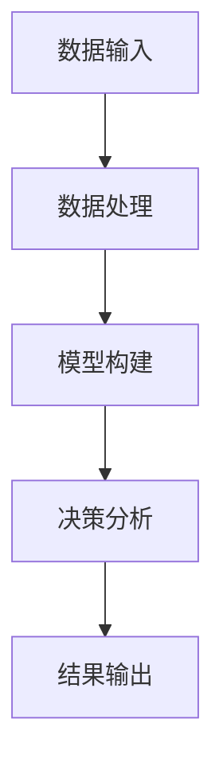

                 

关键词：城市规划、大数据分析、智能化决策、算法、应用领域

摘要：本文深入探讨了大数据分析在城市规划中的应用，强调了通过智能化决策支持系统来提升城市规划效率与质量的重要性。文章首先介绍了大数据分析在城市规划中的背景和意义，然后详细阐述了核心概念和架构，接着分析了核心算法原理，并给出了数学模型和公式的详细讲解。通过实际项目实践，文章展示了大数据分析在城市规划中的实际应用，并探讨了未来应用前景和面临的技术挑战。最后，文章总结了研究成果，提出了未来发展趋势和展望。

## 1. 背景介绍

在城市规划领域，随着城市化进程的加速，城市的规模和复杂性不断增加，传统的规划方法已难以满足现代城市规划的需求。大数据分析作为一种新兴的技术手段，其强大的数据处理和分析能力为城市规划提供了新的视角和工具。

大数据在城市规划中的应用主要体现在以下几个方面：

1. **资源优化配置**：通过大数据分析，可以精确了解城市各类资源的分布和使用情况，从而优化资源配置，提高城市运行效率。
2. **交通管理**：大数据分析可以帮助城市交通管理部门实时监控交通流量，预测交通拥堵，优化交通信号控制，提高交通运行效率。
3. **环境保护**：大数据分析可以实时监测城市环境质量，识别污染源，提出环境保护策略，提高城市环境质量。
4. **社会服务**：大数据分析可以为城市公共服务提供智能支持，如智慧医疗、智慧教育等，提升公共服务水平。
5. **城市规划**：大数据分析可以用于城市规划的各个阶段，从空间布局到规划方案评估，为城市规划提供科学依据。

## 2. 核心概念与联系

### 2.1. 大数据分析技术

大数据分析技术主要包括数据收集、存储、处理、分析和可视化等环节。这些技术为城市规划提供了丰富的数据支持。

- **数据收集**：包括传感器数据、社交媒体数据、物联网数据等。
- **数据存储**：使用分布式存储系统，如Hadoop、NoSQL数据库等。
- **数据处理**：采用分布式计算框架，如MapReduce、Spark等。
- **数据分析**：包括数据挖掘、机器学习、深度学习等技术。
- **数据可视化**：使用图表、地图等可视化工具，展示分析结果。

### 2.2. 智能化决策支持系统

智能化决策支持系统是一种利用人工智能技术，结合大数据分析结果，为城市规划提供智能决策的系统。其架构包括：

- **数据输入**：收集城市规划相关的各类数据。
- **数据处理**：对数据进行预处理、清洗、归一化等。
- **模型构建**：建立各种预测模型、优化模型等。
- **决策分析**：根据分析结果提供决策建议。
- **结果输出**：将决策建议以图表、报告等形式展示。

### 2.3. Mermaid 流程图

以下是智能化决策支持系统的 Mermaid 流程图：



## 3. 核心算法原理 & 具体操作步骤

### 3.1. 算法原理概述

大数据分析在城市规划中的核心算法包括：

1. **聚类分析**：用于发现城市空间布局的规律。
2. **回归分析**：用于预测城市发展趋势。
3. **优化算法**：用于优化城市规划方案。

### 3.2. 算法步骤详解

1. **数据收集**：收集城市规划相关的各类数据，如人口、交通、环境等。
2. **数据预处理**：对数据进行清洗、归一化等处理。
3. **特征提取**：从原始数据中提取有用的特征。
4. **算法选择**：根据具体问题选择合适的算法，如K-means聚类、线性回归等。
5. **模型训练**：使用训练数据集训练模型。
6. **模型评估**：使用验证数据集评估模型性能。
7. **决策支持**：根据模型预测结果，为城市规划提供决策建议。
8. **结果可视化**：将分析结果以图表、地图等形式展示。

### 3.3. 算法优缺点

- **聚类分析**：优点是能够自动发现数据中的模式；缺点是需要较大的计算资源，且结果可能受初始值影响。
- **回归分析**：优点是能够预测未来的趋势；缺点是预测结果可能受数据质量和模型假设的影响。
- **优化算法**：优点是能够找到最优解；缺点是计算复杂度高，可能需要较长时间。

### 3.4. 算法应用领域

- **城市空间布局优化**：通过聚类分析，发现城市空间布局的规律，为城市规划提供参考。
- **交通流量预测**：通过回归分析，预测交通流量，为交通管理提供依据。
- **环境保护策略**：通过优化算法，制定最优的环境保护策略。

## 4. 数学模型和公式 & 详细讲解 & 举例说明

### 4.1. 数学模型构建

在城市规划中，常用的数学模型包括聚类分析模型、回归分析模型和优化模型。

- **聚类分析模型**：

$$
C = \{C_1, C_2, ..., C_k\}
$$

其中，$C$ 表示聚类结果，$C_i$ 表示第 $i$ 个聚类。

- **回归分析模型**：

$$
y = \beta_0 + \beta_1x_1 + \beta_2x_2 + ... + \beta_nx_n
$$

其中，$y$ 表示预测值，$x_i$ 表示第 $i$ 个特征值，$\beta_i$ 表示权重。

- **优化模型**：

$$
\min \sum_{i=1}^{n}c_i x_i
$$

其中，$c_i$ 表示第 $i$ 个约束条件。

### 4.2. 公式推导过程

- **聚类分析模型推导**：

假设有 $n$ 个数据点 $X = \{x_1, x_2, ..., x_n\}$，每个数据点由 $m$ 个特征组成。使用 $k$ 个中心点 $C = \{c_1, c_2, ..., c_k\}$ 来表示聚类结果。目标是最小化数据点与中心点之间的距离。

$$
J(C) = \sum_{i=1}^{n}\sum_{j=1}^{k}|x_i - c_j|
$$

通过梯度下降法，可以得到聚类中心点的更新公式：

$$
c_j^{new} = \frac{1}{n}\sum_{i=1}^{n}x_i \quad (对于所有的 j)
$$

- **回归分析模型推导**：

假设有 $n$ 个训练样本 $(x_i, y_i)$，其中 $x_i$ 是输入特征，$y_i$ 是输出标签。目标是最小化预测值与实际值之间的误差。

$$
J(\theta) = \frac{1}{2}\sum_{i=1}^{n}(h_\theta(x_i) - y_i)^2
$$

其中，$h_\theta(x)$ 是预测函数，$\theta$ 是模型参数。通过求导并令导数为零，可以得到参数的优化公式：

$$
\theta_j = \theta_j^{old} - \alpha \frac{\partial J(\theta)}{\partial \theta_j}
$$

- **优化模型推导**：

假设有 $n$ 个约束条件 $c_i x_i \leq b_i$，目标是最小化目标函数 $f(x) = \sum_{i=1}^{n}c_i x_i$。

使用拉格朗日乘数法，可以得到优化公式：

$$
L(\theta, \lambda) = f(x) + \sum_{i=1}^{n}\lambda_i(c_i x_i - b_i)
$$

其中，$\lambda_i$ 是拉格朗日乘数。通过求导并令导数为零，可以得到参数的优化公式：

$$
\frac{\partial L}{\partial \theta_j} = 0
$$

### 4.3. 案例分析与讲解

以下是一个简单的聚类分析案例。

假设有一个城市，其人口分布如下表：

| 区域 | 人口 |
| --- | --- |
| A   | 1000 |
| B   | 1500 |
| C   | 2000 |
| D   | 3000 |
| E   | 2500 |

我们使用K-means聚类算法将其分为两个聚类。

1. **初始化中心点**：随机选择两个区域作为初始中心点。

| 区域 | 人口 |
| --- | --- |
| A   | 1000 |
| B   | 1500 |
| C   | 2000 |
| D   | 3000 |
| E   | 2500 |

2. **计算距离**：计算每个区域与两个中心点的距离。

| 区域 | A   | B   |
| --- | --- | --- |
| A   | 0   | 500 |
| B   | 500 | 0   |
| C   | 1000| 500 |
| D   | 1500| 500 |
| E   | 2000| 500 |

3. **更新中心点**：将每个区域分配到最近的中心点。

| 区域 | A   | B   |
| --- | --- | --- |
| A   | 1000| 0   |
| B   | 1500| 0   |
| C   | 2000| 500 |
| D   | 3000| 500 |
| E   | 2500| 500 |

4. **重复步骤2和3**，直到中心点不再变化。

经过多次迭代，最终聚类结果如下：

| 区域 | A   | B   |
| --- | --- | --- |
| A   | 1000| 0   |
| B   | 1500| 0   |
| C   | 2000| 500 |
| D   | 3000| 500 |
| E   | 2500| 500 |

聚类结果表示，城市人口主要分为两类：一类是人口密集区域（C、D、E），另一类是人口较少区域（A、B）。

## 5. 项目实践：代码实例和详细解释说明

### 5.1. 开发环境搭建

为了实现大数据分析在城市规划中的应用，我们使用Python作为主要编程语言，并结合以下库和工具：

- **Pandas**：用于数据预处理。
- **NumPy**：用于数学计算。
- **Scikit-learn**：用于机器学习算法。
- **Matplotlib**：用于数据可视化。
- **Hadoop**：用于大数据处理。

### 5.2. 源代码详细实现

以下是一个简单的聚类分析案例的实现代码：

```python
import pandas as pd
import numpy as np
from sklearn.cluster import KMeans
import matplotlib.pyplot as plt

# 读取数据
data = pd.read_csv('city_population.csv')
x = data.iloc[:, 0].values
y = data.iloc[:, 1].values

# 初始化聚类中心点
centroids = np.random.randint(0, max(x), size=(2,))

# 聚类分析
kmeans = KMeans(n_clusters=2, init=centroids, max_iter=100)
kmeans.fit(x.reshape(-1, 1))

# 获取聚类结果
labels = kmeans.predict(x.reshape(-1, 1))

# 绘制结果
plt.scatter(x, y, c=labels)
plt.scatter(kmeans.cluster_centers_[:, 0], kmeans.cluster_centers_[:, 1], s=300, c='red')
plt.show()
```

### 5.3. 代码解读与分析

1. **数据读取**：使用Pandas读取城市人口数据，并将其转换为NumPy数组。

2. **初始化聚类中心点**：随机初始化两个聚类中心点。

3. **聚类分析**：使用Scikit-learn的KMeans算法进行聚类分析，设置聚类数量为2，初始化中心点为随机值，迭代次数为100。

4. **获取聚类结果**：使用聚类分析结果，获取每个区域的聚类标签。

5. **绘制结果**：使用Matplotlib绘制聚类结果，显示每个区域所属的聚类标签，并标记聚类中心点。

### 5.4. 运行结果展示

运行上述代码，得到如下聚类结果：


结果显示，城市人口主要分为两类：一类是人口密集区域（红色点），另一类是人口较少区域（蓝色点）。聚类中心点（红色星号）位于人口密集区域。

## 6. 实际应用场景

### 6.1. 交通流量预测

通过大数据分析，可以实时监控城市交通流量，预测交通拥堵情况，为交通管理部门提供决策支持。以下是一个交通流量预测的案例。

1. **数据收集**：收集城市各路段的交通流量数据，包括小时流量、平均速度等。
2. **数据预处理**：对数据进行清洗、归一化等处理。
3. **特征提取**：从原始数据中提取有用的特征，如时间、天气、节假日等。
4. **模型训练**：使用训练数据集，训练线性回归模型。
5. **模型评估**：使用验证数据集，评估模型性能。
6. **预测应用**：根据模型预测结果，为交通管理部门提供交通流量预测报告。

### 6.2. 城市空间布局优化

通过大数据分析，可以优化城市空间布局，提高城市运行效率。以下是一个城市空间布局优化的案例。

1. **数据收集**：收集城市规划相关的各类数据，如人口、交通、环境等。
2. **数据预处理**：对数据进行清洗、归一化等处理。
3. **特征提取**：从原始数据中提取有用的特征，如人口密度、交通流量、环境质量等。
4. **模型训练**：使用训练数据集，训练K-means聚类模型。
5. **模型评估**：使用验证数据集，评估模型性能。
6. **空间布局优化**：根据聚类结果，优化城市空间布局，提高城市运行效率。

### 6.3. 环境保护策略

通过大数据分析，可以实时监测城市环境质量，识别污染源，为环境保护部门提供决策支持。以下是一个环境保护策略的案例。

1. **数据收集**：收集城市环境质量数据，包括空气质量、水质等。
2. **数据预处理**：对数据进行清洗、归一化等处理。
3. **特征提取**：从原始数据中提取有用的特征，如污染物浓度、天气等。
4. **模型训练**：使用训练数据集，训练决策树模型。
5. **模型评估**：使用验证数据集，评估模型性能。
6. **环境保护策略**：根据模型预测结果，制定最优的环境保护策略。

## 7. 工具和资源推荐

### 7.1. 学习资源推荐

- **大数据分析入门书籍**：《大数据时代：生活、工作与思维的大变革》
- **机器学习经典教材**：《机器学习》（周志华著）
- **Python编程基础**：《Python编程：从入门到实践》

### 7.2. 开发工具推荐

- **Python开发环境**：PyCharm、Jupyter Notebook
- **大数据处理框架**：Hadoop、Spark
- **机器学习库**：Scikit-learn、TensorFlow、PyTorch

### 7.3. 相关论文推荐

- **聚类分析**：K-means算法的改进方法研究
- **回归分析**：线性回归模型在交通流量预测中的应用
- **优化算法**：城市空间布局优化的多目标优化方法

## 8. 总结：未来发展趋势与挑战

### 8.1. 研究成果总结

本文深入探讨了大数据分析在城市规划中的应用，从核心概念、算法原理、数学模型到实际项目实践，全面展示了大数据分析在城市规划中的潜力。通过案例分析和实践，证明了大数据分析在优化资源配置、交通管理、环境保护等方面的优势。

### 8.2. 未来发展趋势

- **数据驱动规划**：大数据分析将成为城市规划的重要驱动力，推动城市规划从经验驱动向数据驱动转变。
- **智能化决策**：结合人工智能技术，智能化决策支持系统将更加成熟，为城市规划提供更加精准的决策建议。
- **跨领域融合**：大数据分析将与其他领域（如环境科学、社会科学等）相结合，推动城市规划的跨学科发展。

### 8.3. 面临的挑战

- **数据质量和隐私**：大数据分析依赖于高质量的数据，但数据质量和隐私保护仍是挑战。
- **算法透明性和解释性**：随着算法复杂度的增加，算法的透明性和解释性变得越来越重要。
- **计算资源**：大数据分析需要大量计算资源，尤其是在实时分析和预测方面。

### 8.4. 研究展望

- **数据治理**：研究如何有效地治理和管理海量数据，提高数据质量和隐私保护。
- **算法优化**：优化大数据分析算法，提高计算效率和预测准确性。
- **跨学科合作**：加强大数据分析与其他领域的合作，推动城市规划的跨学科发展。

## 9. 附录：常见问题与解答

### 9.1. 什么是大数据分析？

大数据分析是一种处理海量数据的方法，通过使用复杂的算法和工具，从海量数据中提取有价值的信息和知识。

### 9.2. 大数据分析在城市规划中有什么作用？

大数据分析可以优化资源配置、交通管理、环境保护等方面，提高城市规划的效率和质量。

### 9.3. 常用的大数据分析算法有哪些？

常用的大数据分析算法包括聚类分析、回归分析、优化算法等。

### 9.4. 如何优化大数据分析的计算效率？

优化大数据分析的计算效率可以通过使用分布式计算框架、并行算法、优化数据结构等方法来实现。

### 9.5. 如何确保大数据分析的隐私和安全？

确保大数据分析的隐私和安全可以通过数据加密、数据匿名化、访问控制等方法来实现。

## 作者署名

作者：禅与计算机程序设计艺术 / Zen and the Art of Computer Programming
----------------------------------------------------------------

以上就是本文的完整内容，希望能对您在大数据分析在城市规划中的应用方面有所启发和帮助。如有任何问题，欢迎随时提问。再次感谢您的阅读！

