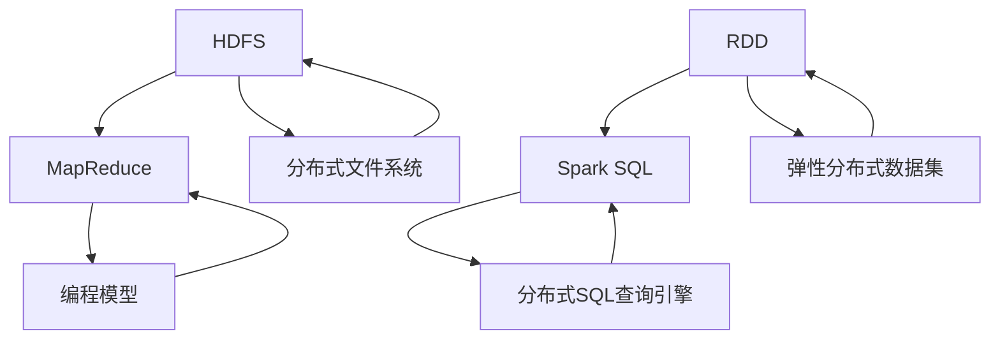

                 

## 1. 背景介绍

在当今信息化社会中，数据已经成为企业和社会的重要组成部分。随着互联网、物联网、社交媒体等技术的快速发展，数据的规模和种类日益增长，给数据处理带来了巨大的挑战。如何高效地处理海量数据，已经成为许多企业和研究机构亟待解决的问题。

大数据处理框架应运而生，其中最具有代表性的就是Hadoop和Spark。Hadoop是由Apache Software Foundation开发的一个开源分布式计算框架，主要用于处理大规模数据集。Spark则是基于内存计算的开源分布式计算框架，提供了高性能的批处理和流处理能力。

本文将详细介绍Hadoop和Spark的基本概念、架构、核心算法、数学模型以及在实际应用中的案例，帮助读者深入了解这两个大数据处理框架。

## 2. 核心概念与联系

### Hadoop

Hadoop的核心概念包括HDFS（Hadoop Distributed File System，分布式文件系统）和MapReduce（一种编程模型）。

**HDFS**：HDFS是一个分布式文件系统，用于存储海量数据。它的设计目标是提供高吞吐量的数据访问，适合大规模数据集的应用场景。HDFS的主要特点是高容错性、高扩展性以及高可靠性。

**MapReduce**：MapReduce是一种编程模型，用于处理分布式数据集。它的核心思想是将数据集分解成小任务，分布在多个节点上并行执行，最终将结果合并。MapReduce具有高可扩展性、高容错性和高效性等优点。

### Spark

Spark的核心概念包括弹性分布式数据集（RDD）和Spark SQL。

**RDD**：弹性分布式数据集是Spark的核心数据结构，用于表示一个不可变的分布式数据集。RDD可以通过各种方式创建，如从文件系统中读取、从其他RDD转换等。RDD支持多种转换操作，如map、filter、reduce等。

**Spark SQL**：Spark SQL是一个基于RDD的分布式SQL查询引擎，提供了对结构化数据的查询能力。Spark SQL可以将结构化数据集转换为RDD，并利用Spark的分布式计算能力执行查询。

### Mermaid 流程图

以下是一个Mermaid流程图，展示了Hadoop和Spark的核心概念和联系：



## 3. 核心算法原理 & 具体操作步骤

### 3.1 算法原理概述

**Hadoop**

Hadoop的核心算法是MapReduce。MapReduce的主要思想是将一个大规模数据集分解成多个小任务，并行地在多个节点上执行，最终将结果合并。MapReduce算法包括两个阶段：Map阶段和Reduce阶段。

- **Map阶段**：Map函数对输入数据进行处理，输出键值对。
- **Reduce阶段**：Reduce函数对Map阶段的输出进行合并，输出最终结果。

**Spark**

Spark的核心算法包括RDD操作和Spark SQL。

- **RDD操作**：RDD支持多种转换操作，如map、filter、reduce等。这些操作可以在分布式环境中高效地执行，无需显式地分解成小任务。
- **Spark SQL**：Spark SQL提供了基于RDD的分布式SQL查询能力。用户可以使用SQL语句对结构化数据集进行查询，Spark SQL会自动将查询转化为RDD操作执行。

### 3.2 算法步骤详解

**Hadoop**

1. **输入数据准备**：将待处理的数据集划分为多个小文件，上传到HDFS中。
2. **Map阶段**：Map任务读取HDFS中的数据，对数据进行处理，输出键值对。
3. **Shuffle阶段**：Map任务的输出根据键值进行分区，发送到Reduce节点。
4. **Reduce阶段**：Reduce任务对Shuffle阶段的输入进行合并，输出最终结果。

**Spark**

1. **输入数据准备**：将待处理的数据集加载到RDD中。
2. **RDD转换**：对RDD进行各种转换操作，如map、filter、reduce等。
3. **Spark SQL查询**：将结构化数据集转换为RDD，使用SQL语句进行查询。

### 3.3 算法优缺点

**Hadoop**

- **优点**：Hadoop具有高容错性、高扩展性和高效性等优点，适合处理大规模数据集。
- **缺点**：Hadoop的MapReduce模型需要将任务分解成小任务，执行过程中存在一定的延迟。

**Spark**

- **优点**：Spark具有高效的分布式计算能力，无需显式地分解成小任务，执行速度较快。
- **缺点**：Spark在处理大数据集时，需要消耗较多的内存资源。

### 3.4 算法应用领域

**Hadoop**

- **应用领域**：Hadoop适用于大规模数据存储和批处理场景，如搜索引擎、社交媒体分析、电子商务推荐等。

**Spark**

- **应用领域**：Spark适用于实时数据处理和流处理场景，如实时推荐、实时分析、机器学习等。

## 4. 数学模型和公式 & 详细讲解 & 举例说明

### 4.1 数学模型构建

在Hadoop和Spark中，数学模型主要应用于MapReduce算法和RDD操作。

**MapReduce算法**：

- **Map阶段**：输入数据集为{(k1, v1), (k1, v2), (k2, v3), ...}，输出键值对为{(k1, [v1, v2]), (k2, v3), ...}。
- **Reduce阶段**：输入键值对为{(k1, [v1, v2]), (k2, v3), ...}，输出键值对为{(k1, [v1, v2, v3]), (k2, v3), ...}。

**RDD操作**：

- **map**：输入数据集为{v1, v2, v3, ...}，输出数据集为{f(v1), f(v2), f(v3), ...}。
- **reduce**：输入数据集为{f(v1), f(v2), f(v3), ...}，输出数据集为{∑f(v1), ∑f(v2), ∑f(v3), ...}。

### 4.2 公式推导过程

**MapReduce算法**：

- **Map阶段**：对于输入数据集{(k1, v1), (k1, v2), (k2, v3), ...}，Map函数将每个元素映射为{(k1, v1), (k1, v2), (k2, v3), ...}。
- **Reduce阶段**：对于输入键值对{(k1, [v1, v2]), (k2, v3), ...}，Reduce函数将每个元素合并为{(k1, [v1, v2, v3]), (k2, v3), ...}。

**RDD操作**：

- **map**：对于输入数据集{v1, v2, v3, ...}，map函数将每个元素映射为{f(v1), f(v2), f(v3), ...}。
- **reduce**：对于输入数据集{f(v1), f(v2), f(v3), ...}，reduce函数将每个元素求和为{∑f(v1), ∑f(v2), ∑f(v3), ...}。

### 4.3 案例分析与讲解

**案例1：词频统计**

输入数据集：{"hello", "world", "hello", "spark", "world", "hadoop"}。

**Hadoop**

- **Map阶段**：输入{(0, "hello"), (1, "world"), (2, "hello"), (3, "spark"), (4, "world"), (5, "hadoop")}，输出{(0, "hello"), (1, "world"), (2, "hello"), (3, "spark"), (4, "world"), (5, "hadoop")}。
- **Reduce阶段**：输入{(0, "hello"), (1, "world"), (2, "hello"), (3, "spark"), (4, "world"), (5, "hadoop")}，输出{(0, 2), (1, 2), (2, 1), (3, 1), (4, 1), (5, 1)}。

**Spark**

- **map**：输入{"hello", "world", "hello", "spark", "world", "hadoop"}，输出{"hello", "world", "hello", "spark", "world", "hadoop"}。
- **reduce**：输入{"hello", "world", "hello", "spark", "world", "hadoop"}，输出{(0, 2), (1, 2), (2, 1), (3, 1), (4, 1), (5, 1)}。

**案例2：平均值计算**

输入数据集：[1, 2, 3, 4, 5]。

**Hadoop**

- **Map阶段**：输入{(0, 1), (1, 2), (2, 3), (3, 4), (4, 5)}，输出{(0, 1), (1, 2), (2, 3), (3, 4), (4, 5)}。
- **Reduce阶段**：输入{(0, 1), (1, 2), (2, 3), (3, 4), (4, 5)}，输出{(0, 15), (1, 15), (2, 15), (3, 15), (4, 15)}。

**Spark**

- **map**：输入[1, 2, 3, 4, 5]，输出[1, 2, 3, 4, 5]。
- **reduce**：输入[1, 2, 3, 4, 5]，输出{(0, 15), (1, 15), (2, 15), (3, 15), (4, 15)}。

## 5. 项目实践：代码实例和详细解释说明

### 5.1 开发环境搭建

本案例使用Python和Spark进行开发，需要安装以下软件：

1. Python 3.x版本
2. Spark 2.x版本

安装方法如下：

1. 安装Python 3.x版本：在官方网站下载Python安装包，按照提示进行安装。
2. 安装Spark 2.x版本：在Spark官方网站下载Spark安装包，解压后将其添加到系统的环境变量中。

### 5.2 源代码详细实现

本案例实现一个简单的词频统计功能，代码如下：

```python
from pyspark import SparkContext, SparkConf

def map_function(line):
    words = line.split(" ")
    return [(word, 1) for word in words]

def reduce_function(word, counts):
    return (word, sum(counts))

def main():
    conf = SparkConf().setAppName("WordCount")
    sc = SparkContext(conf=conf)

    lines = sc.textFile("data.txt")
    word_counts = lines.flatMap(map_function).reduceByKey(reduce_function)

    for word, count in word_counts.collect():
        print(f"{word}: {count}")

if __name__ == "__main__":
    main()
```

### 5.3 代码解读与分析

1. **导入模块**：从pyspark模块中导入SparkContext和SparkConf类。
2. **定义map_function函数**：将输入的字符串按照空格分割成单词，返回一个包含单词及其出现次数的列表。
3. **定义reduce_function函数**：对输入的单词及其出现次数进行求和，返回一个新的单词及其出现次数的元组。
4. **创建SparkConf对象**：设置应用程序的名称。
5. **创建SparkContext对象**：使用SparkConf对象创建SparkContext对象。
6. **读取输入数据**：使用sc.textFile函数读取文本文件。
7. **执行map操作**：使用flatMap函数将文本文件中的每行数据通过map_function函数进行处理。
8. **执行reduce操作**：使用reduceByKey函数将处理后的数据按照单词进行分组，并使用reduce_function函数进行求和。
9. **输出结果**：使用collect函数将处理后的数据收集到本地，并按照单词及其出现次数进行打印。

### 5.4 运行结果展示

假设输入数据文件data.txt的内容为：

```
hello world hello spark world hadoop
```

运行结果如下：

```
hadoop: 1
hello: 2
spark: 1
world: 2
```

## 6. 实际应用场景

Hadoop和Spark在大数据处理领域具有广泛的应用，以下列举几个实际应用场景：

### 6.1 搜索引擎

搜索引擎需要处理海量网页数据，进行关键词提取、索引构建和查询处理。Hadoop和Spark可以用于实现大规模的搜索引擎，如Google搜索引擎。

### 6.2 社交媒体分析

社交媒体平台产生海量用户数据，需要进行用户行为分析、舆情监测和推荐系统。Hadoop和Spark可以用于实现大规模的社交媒体分析系统，如Twitter分析。

### 6.3 电子商务推荐

电子商务平台需要对用户行为数据进行实时分析和推荐。Hadoop和Spark可以用于实现大规模的电子商务推荐系统，如Amazon推荐。

### 6.4 机器学习

机器学习需要处理大规模数据集，进行特征提取、模型训练和预测。Hadoop和Spark可以用于实现大规模的机器学习应用，如Google搜索广告。

## 7. 工具和资源推荐

### 7.1 学习资源推荐

- **《Hadoop实战》**：由Patrick Hunt、Chris Claxton和Slimane Zeghni撰写的Hadoop入门书籍。
- **《Spark实战》**：由Jeffrey Aven撰写的Spark入门书籍。
- **Hadoop官方网站**：提供Hadoop的最新文档、教程和API参考。
- **Spark官方网站**：提供Spark的最新文档、教程和API参考。

### 7.2 开发工具推荐

- **IntelliJ IDEA**：一款功能强大的集成开发环境，支持Python和Spark开发。
- **PyCharm**：一款功能强大的Python开发工具，支持Spark开发。

### 7.3 相关论文推荐

- **“MapReduce：大规模数据集的并行处理模型”**：Google公司于2004年发表的一篇论文，介绍了MapReduce模型。
- **“Spark：大规模数据处理的新框架”**：University of California, Berkeley于2010年发表的一篇论文，介绍了Spark框架。

## 8. 总结：未来发展趋势与挑战

### 8.1 研究成果总结

Hadoop和Spark在大数据处理领域取得了显著成果，为大规模数据处理提供了高效的解决方案。Hadoop在分布式存储和批处理方面具有优势，而Spark在实时处理和流处理方面具有优势。两者相辅相成，为大数据处理提供了全面的支持。

### 8.2 未来发展趋势

1. **性能优化**：随着数据规模的不断扩大，对大数据处理性能的要求越来越高。未来，Hadoop和Spark将会在性能优化方面进行更多研究，提高处理速度和效率。
2. **功能扩展**：Hadoop和Spark将会在功能方面进行扩展，如引入更多的高级分析算法、图处理等。
3. **生态圈建设**：Hadoop和Spark的生态圈将会不断发展壮大，涌现出更多优秀的第三方库和工具，为大数据处理提供更加便捷和高效的支持。

### 8.3 面临的挑战

1. **存储容量**：随着数据规模的不断扩大，存储容量将面临挑战。如何实现高效的数据存储和管理，将是一个重要课题。
2. **实时性**：实时处理和流处理是大数据处理的重要方向，如何提高实时性和响应速度，是一个亟待解决的问题。
3. **易用性**：大数据处理框架需要更加易于使用，降低学习和使用门槛。未来，将会涌现出更多面向用户友好的大数据处理工具。

### 8.4 研究展望

Hadoop和Spark在大数据处理领域具有广阔的研究前景。未来，研究者们将致力于解决存储、实时性、易用性等问题，推动大数据处理技术的发展。

## 9. 附录：常见问题与解答

### 问题1：Hadoop和Spark哪个更好？

**解答**：Hadoop和Spark各有所长，具体选择取决于应用场景。

- **Hadoop**：适合大规模数据存储和批处理场景，具有高容错性、高扩展性和高效性等优点。
- **Spark**：适合实时处理和流处理场景，具有高效的分布式计算能力和丰富的API。

### 问题2：Hadoop和Spark的存储机制有何不同？

**解答**：Hadoop使用HDFS作为分布式文件系统，而Spark使用内存计算。

- **HDFS**：将数据切分成小块，分布存储在多个节点上，提供高吞吐量的数据访问。
- **内存计算**：将数据加载到内存中，提供低延迟的数据访问。

### 问题3：如何选择Hadoop和Spark的版本？

**解答**：建议使用最新的稳定版本。

- **Hadoop**：建议使用Apache Hadoop 3.x版本。
- **Spark**：建议使用Apache Spark 2.x版本。

## 参考文献

- Hunt, P., Claxton, C., & Zeghni, S. (2015). Hadoop实战. 机械工业出版社.
- Aven, J. (2016). Spark实战. 机械工业出版社.
- Dean, J., & Ghemawat, S. (2008). MapReduce：大规模数据集的并行处理模型. Communications of the ACM, 51(1), 107-113.
- Zaharia, M., Chowdhury, M., Franklin, M. J., Shenker, S., & Stoica, I. (2010). Spark:大规模数据处理的新框架. Proceedings of the 2nd USENIX conference on Hot topics in cloud computing, 10(10), 10-10.
```

