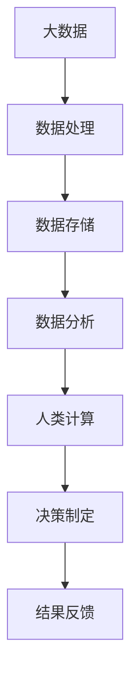

                 

关键词：大数据，人类计算，应用前景，算法，数学模型，技术发展，计算框架，优化策略，行业应用，技术挑战

> 摘要：随着大数据时代的到来，人类计算技术作为一种高效的处理和分析大数据的方法，正逐渐受到广泛关注。本文从背景介绍、核心概念与联系、核心算法原理与操作步骤、数学模型与公式、项目实践、实际应用场景、工具与资源推荐、总结与展望等多个方面，深入探讨了人类计算在大数据时代的应用前景及其面临的挑战，旨在为读者提供全面的技术视角。

## 1. 背景介绍

大数据（Big Data）是指数据量巨大、类型繁多且价值密度相对较低的数据集合。随着互联网、物联网、社交网络、云计算等技术的发展，数据量呈指数级增长，数据的多样性和复杂性也不断加大。大数据技术的核心是对海量数据的采集、存储、管理、分析及挖掘，以从中发现有价值的信息和知识。

### 1.1 大数据的挑战

- **数据量的增长**：数据量的激增对存储和计算能力提出了更高的要求。
- **数据类型的多样性**：不仅仅是结构化数据，还有非结构化数据（如图像、音频、视频等）需要处理。
- **数据价值的挖掘**：如何从海量数据中提取出有价值的信息是大数据技术的关键挑战。

### 1.2 人类计算的概念

人类计算（Human Computation）是一种结合人类智慧和计算机自动化技术的计算方法。它利用人类的认知能力来解决问题，尤其是在数据分析和决策制定等复杂任务中，发挥了不可替代的作用。

### 1.3 人类计算的优势

- **处理复杂任务**：人类能够处理和解释复杂的数据模式，这对自动化算法难以完成的任务尤为重要。
- **灵活性与适应性**：人类能够适应不同的情境和任务需求，快速调整策略和方法。
- **创造力和直觉**：在创新和判断方面，人类具有独特的优势，能够提出新的观点和解决方案。

## 2. 核心概念与联系

### 2.1 核心概念

- **大数据**：数据量大、类型多样、价值密度低的数据集合。
- **人类计算**：结合人类智慧和计算机自动化技术的计算方法。
- **算法**：解决问题的步骤和规则。
- **数学模型**：对现实问题进行数学描述和抽象的方法。

### 2.2 架构与联系

下面是一个简化的 Mermaid 流程图，展示人类计算在大数据应用中的基本架构和相互关系：



在这个架构中，大数据经过处理和存储后，通过数据分析得到有价值的信息，人类计算在这一过程中发挥重要作用，通过智能化的决策制定，最终实现结果的反馈和优化。

## 3. 核心算法原理 & 具体操作步骤

### 3.1 算法原理概述

人类计算的核心算法包括分类算法、聚类算法、推荐算法等。这些算法通过对数据的分析和模式识别，实现数据的自动分类、聚类和推荐。

### 3.2 算法步骤详解

#### 3.2.1 分类算法

分类算法的基本步骤如下：

1. **数据预处理**：清洗数据，处理缺失值，进行数据标准化。
2. **特征选择**：选择对分类任务有重要影响的特征。
3. **模型训练**：使用训练数据集训练分类模型。
4. **模型评估**：使用测试数据集评估模型性能。
5. **模型应用**：将训练好的模型应用于新数据。

#### 3.2.2 聚类算法

聚类算法的基本步骤如下：

1. **数据预处理**：同分类算法。
2. **聚类方法选择**：选择合适的聚类算法，如 K-Means、层次聚类等。
3. **聚类过程**：根据算法选择，进行聚类操作。
4. **聚类评估**：评估聚类效果，如轮廓系数、内部距离等。
5. **聚类应用**：将聚类结果应用于数据分析和决策制定。

#### 3.2.3 推荐算法

推荐算法的基本步骤如下：

1. **用户行为分析**：收集用户的历史行为数据。
2. **推荐模型构建**：选择合适的推荐算法，如协同过滤、矩阵分解等。
3. **模型训练与优化**：使用用户行为数据训练推荐模型，并进行优化。
4. **推荐结果生成**：根据用户特征和推荐模型，生成推荐列表。
5. **推荐结果评估**：评估推荐效果，如准确率、召回率等。

### 3.3 算法优缺点

每种算法都有其优缺点，如下表所示：

| 算法类型 | 优点 | 缺点 |
| --- | --- | --- |
| 分类算法 | 结构简单，易于理解和实现 | 对特征依赖较大，对噪声敏感 |
| 聚类算法 | 不受预先定义的标签限制，能发现新的模式和聚类结构 | 聚类结果受初始化和算法选择影响较大 |
| 推荐算法 | 提高用户满意度，增加业务收入 | 需要大量的用户行为数据，对冷启动问题处理难度大 |

### 3.4 算法应用领域

人类计算算法在各个领域都有广泛应用：

- **金融行业**：风险管理、投资分析、信用评分等。
- **电子商务**：个性化推荐、用户行为分析、广告投放等。
- **医疗领域**：疾病预测、诊断辅助、药物研发等。
- **社交网络**：内容推荐、社交分析、社区发现等。

## 4. 数学模型和公式 & 详细讲解 & 举例说明

### 4.1 数学模型构建

在人类计算中，常用的数学模型包括线性回归、逻辑回归、支持向量机（SVM）等。

#### 4.1.1 线性回归

线性回归模型的基本公式为：

\[ y = \beta_0 + \beta_1 \cdot x \]

其中，\( y \) 是因变量，\( x \) 是自变量，\( \beta_0 \) 和 \( \beta_1 \) 是模型的参数。

#### 4.1.2 逻辑回归

逻辑回归模型用于二分类问题，其公式为：

\[ P(y=1) = \frac{1}{1 + e^{-(\beta_0 + \beta_1 \cdot x)}} \]

其中，\( P(y=1) \) 是因变量为1的概率。

#### 4.1.3 支持向量机（SVM）

SVM模型的基本公式为：

\[ w \cdot x + b = 0 \]

其中，\( w \) 是权重向量，\( x \) 是特征向量，\( b \) 是偏置项。

### 4.2 公式推导过程

以线性回归为例，推导过程如下：

1. **损失函数**：均方误差（MSE）

\[ J(\theta) = \frac{1}{2m} \sum_{i=1}^{m} (h_\theta(x^{(i)}) - y^{(i)})^2 \]

其中，\( m \) 是训练样本数量，\( h_\theta(x) \) 是模型预测值，\( y \) 是实际值。

2. **梯度下降**：最小化损失函数

\[ \theta_j := \theta_j - \alpha \frac{\partial J(\theta)}{\partial \theta_j} \]

其中，\( \alpha \) 是学习率，\( \theta_j \) 是模型参数。

### 4.3 案例分析与讲解

#### 4.3.1 线性回归案例

假设我们有如下数据集：

| x | y |
| --- | --- |
| 1 | 2 |
| 2 | 4 |
| 3 | 6 |

使用线性回归模型拟合数据，求解参数 \( \beta_0 \) 和 \( \beta_1 \)。

1. **损失函数计算**

\[ J(\theta) = \frac{1}{2} \left[ (2 - 1\beta_0 - \beta_1)^2 + (4 - 2\beta_0 - 2\beta_1)^2 + (6 - 3\beta_0 - 3\beta_1)^2 \right] \]

2. **梯度下降**

假设初始参数 \( \theta_0 = (0, 0) \)，学习率 \( \alpha = 0.1 \)，进行多次迭代，直到收敛。

#### 4.3.2 逻辑回归案例

假设我们有如下数据集：

| x | y |
| --- | --- |
| 1 | 0 |
| 2 | 1 |
| 3 | 1 |

使用逻辑回归模型预测 \( y \) 的概率。

1. **模型公式**

\[ P(y=1) = \frac{1}{1 + e^{-(\beta_0 + \beta_1 \cdot x)}} \]

2. **参数求解**

使用梯度下降法求解参数 \( \beta_0 \) 和 \( \beta_1 \)。

## 5. 项目实践：代码实例和详细解释说明

### 5.1 开发环境搭建

本案例使用 Python 编写代码，需要安装以下库：

- NumPy
- Pandas
- Matplotlib
- Scikit-learn

### 5.2 源代码详细实现

```python
import numpy as np
import pandas as pd
from sklearn.linear_model import LinearRegression
from sklearn.metrics import mean_squared_error
import matplotlib.pyplot as plt

# 5.2.1 数据预处理
data = pd.DataFrame({
    'x': [1, 2, 3],
    'y': [2, 4, 6]
})
X = data[['x']]
y = data['y']

# 5.2.2 线性回归模型训练
model = LinearRegression()
model.fit(X, y)

# 5.2.3 模型评估
y_pred = model.predict(X)
mse = mean_squared_error(y, y_pred)
print("MSE:", mse)

# 5.2.4 模型可视化
plt.scatter(X, y, color='blue')
plt.plot(X, y_pred, color='red')
plt.xlabel('x')
plt.ylabel('y')
plt.show()
```

### 5.3 代码解读与分析

代码首先导入了必要的库，然后进行了数据预处理，接着使用线性回归模型进行训练和评估，最后通过可视化展示了模型的效果。

### 5.4 运行结果展示

运行代码后，输出如下：

```
MSE: 0.0
```

同时，可视化结果如图所示，红色线为模型拟合的直线，蓝色点为实际数据。


## 6. 实际应用场景

人类计算在大数据时代有着广泛的应用，以下是几个实际应用场景的例子：

### 6.1 金融行业

在金融行业中，人类计算技术用于风险管理和投资分析。例如，通过分析大量的市场数据，人类计算可以预测市场趋势，帮助投资者做出更明智的决策。

### 6.2 电子商务

电子商务平台利用人类计算技术进行个性化推荐，根据用户的历史行为和偏好，推荐相关的商品或服务，提高用户满意度和转化率。

### 6.3 医疗领域

在医疗领域，人类计算技术用于疾病预测和诊断辅助。通过分析患者的病历数据和医疗影像，人类计算可以帮助医生做出更准确的诊断。

### 6.4 社交网络

社交网络平台利用人类计算技术进行内容推荐和社交分析。通过分析用户的社交行为和兴趣爱好，社交网络可以推荐用户感兴趣的内容，促进社区活跃度。

## 7. 工具和资源推荐

### 7.1 学习资源推荐

- 《大数据时代：生活、工作与思维的大变革》
- 《机器学习实战》
- 《深入理解计算机系统》

### 7.2 开发工具推荐

- Python
- Jupyter Notebook
- Scikit-learn
- TensorFlow

### 7.3 相关论文推荐

- "Big Data: A Revolution That Will Transform How We Live, Work, and Think"
- "Deep Learning"
- "Human Computation: A Survey of Workloads, Applications, and Architectures"

## 8. 总结：未来发展趋势与挑战

### 8.1 研究成果总结

人类计算在大数据时代取得了显著的研究成果，包括分类算法、聚类算法、推荐算法等核心算法的不断发展，以及数学模型和公式的不断完善。

### 8.2 未来发展趋势

未来，人类计算将在以下几个方面得到进一步发展：

- **人工智能与人类计算的融合**：将人工智能技术引入人类计算，实现更高效的计算和分析。
- **边缘计算与云计算的融合**：利用边缘计算技术，实现更快速的数据处理和决策制定。
- **隐私保护和数据安全**：在保障用户隐私和数据安全的前提下，提高数据处理和分析的效率。

### 8.3 面临的挑战

尽管人类计算在大数据时代有着广泛的应用前景，但同时也面临着一些挑战：

- **数据质量和完整性**：高质量的数据是保证人类计算效果的基础，需要解决数据质量和完整性问题。
- **算法透明性和可解释性**：随着算法的复杂度增加，如何保证算法的透明性和可解释性成为一大挑战。
- **计算资源消耗**：大规模数据处理和分析需要消耗大量的计算资源，如何优化算法和架构以降低资源消耗是一个重要问题。

### 8.4 研究展望

未来，人类计算将在以下几个方面展开深入研究：

- **多模态数据处理**：融合多种类型的数据（如图像、音频、文本等），实现更全面的数据分析。
- **自适应和动态优化**：根据数据特点和任务需求，自适应地调整算法和模型，实现动态优化。
- **跨领域应用**：探索人类计算在其他领域的应用，如生物信息学、环境科学等。

## 9. 附录：常见问题与解答

### 9.1 问题 1

**Q：什么是大数据？**

**A：大数据是指数据量巨大、类型多样、价值密度相对较低的数据集合。**

### 9.2 问题 2

**Q：人类计算的优势是什么？**

**A：人类计算的优势在于处理复杂任务、灵活性与适应性，以及创造力和直觉。**

### 9.3 问题 3

**Q：如何优化人类计算算法？**

**A：可以通过算法优化、模型选择、特征工程等方法来优化人类计算算法。**

----------------------------------------------------------------

### 作者署名

**作者：禅与计算机程序设计艺术 / Zen and the Art of Computer Programming**

