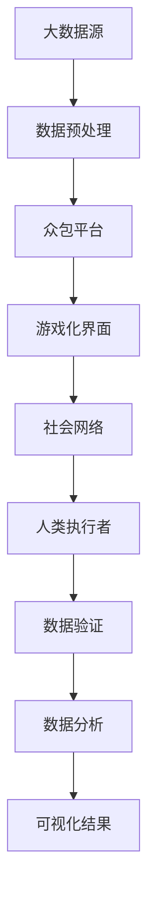

                 

在当今时代，大数据的重要性不言而喻。随着技术的进步和数据的爆炸性增长，人类计算作为一种高效处理和分析海量数据的方法，正在成为大数据时代的利器。本文将深入探讨人类计算的概念、原理和应用前景，旨在为读者提供一幅清晰而全面的应用图景。

## 关键词

- 大数据
- 人类计算
- 数据处理
- 数据分析
- 应用前景

## 摘要

本文首先介绍了大数据时代的背景和特点，随后详细阐述了人类计算的概念及其在数据处理和分析中的作用。通过核心算法原理的解析，本文展示了人类计算在各个领域的应用实例，并探讨了其数学模型和公式。同时，通过实际代码实例的分析，读者可以深入了解人类计算的具体实现方法。文章的最后部分讨论了人类计算在实际应用场景中的挑战和未来展望，为读者提供了宝贵的研究方向和资源推荐。

## 1. 背景介绍

### 大数据的崛起

随着互联网、物联网和移动设备的普及，数据量呈现出爆炸性增长。大数据（Big Data）指的是规模巨大、类型多样且增长迅速的数据集合，它超出了传统数据处理工具的处理能力。大数据的四个主要特点，即“4V”，包括：

- **Volume（大量）**：数据量的庞大，从GB、TB到PB、EB级别。
- **Velocity（高速）**：数据生成和处理的实时性需求。
- **Variety（多样性）**：数据类型的多样性，包括结构化、半结构化和非结构化数据。
- **Veracity（真实性）**：数据的真实性和可靠性问题。

这种数据环境的变革不仅改变了企业和组织的数据管理方式，也对技术创新和商业决策产生了深远影响。

### 数据处理与分析的挑战

大数据带来的挑战不仅仅是存储和传输的问题，更重要的是如何有效地进行数据分析和处理。以下是大数据时代数据处理和分析面临的几个主要挑战：

- **数据量的增长**：处理和分析海量数据需要更高的计算能力和存储资源。
- **数据类型的多样性**：不同类型的数据需要不同的处理方法，增加了复杂度。
- **数据质量的保障**：数据的质量直接影响到分析结果的准确性，需要数据清洗和预处理。
- **实时性的需求**：许多应用场景要求实时处理和分析数据，这对系统的响应速度提出了更高的要求。

### 人类计算的崛起

人类计算（Human Computation）是一种结合人类认知能力和计算机计算能力的方法，它通过将人类认知任务与计算任务相结合，利用人类在感知、推理和决策方面的优势，来解决计算机难以处理的问题。人类计算的核心思想是利用众包、游戏化、社交网络等技术手段，将复杂的问题分解为多个简单任务，分配给大量人类执行。

人类计算在数据处理和分析中的优势包括：

- **处理多样性和复杂性**：人类能够处理多种类型的数据，包括文本、图像、音频等，且能够应对复杂的问题。
- **实时性和灵活性**：人类计算可以快速响应实时数据变化，同时具有很高的灵活性。
- **数据质量**：人类能够进行数据验证和纠正，提高数据分析的准确性。

## 2. 核心概念与联系

### 人类计算的基本原理

人类计算基于以下核心概念：

- **众包（Crowdsourcing）**：通过互联网平台将任务分配给广大志愿者，利用众包方式处理大量数据。
- **游戏化（Gamification）**：将游戏元素引入非游戏场景，激励人们参与任务，提高数据处理的效率。
- **社会计算（Social Computing）**：利用社交网络和协作机制，促进数据共享和协作。

以下是人类计算的核心架构示意图：



### 人类计算的应用场景

人类计算的应用场景广泛，包括但不限于以下领域：

- **图像识别与分类**：利用人类视觉判断，对大量图像进行标注和分类。
- **自然语言处理**：通过众包方式收集标注数据，训练机器学习模型，提高语言理解和处理能力。
- **数据验证与清洗**：人类能够识别错误和不一致的数据，进行数据清洗和验证。
- **知识图谱构建**：通过众包和社交网络，收集和整合大量的知识信息，构建知识图谱。

## 3. 核心算法原理 & 具体操作步骤

### 3.1 算法原理概述

人类计算的核心算法主要包括以下几种：

- **分类算法（Classification）**：通过训练模型，对数据进行分类。
- **聚类算法（Clustering）**：将数据分为不同的簇，以发现数据中的模式和关联性。
- **回归算法（Regression）**：预测数据的趋势和变化。
- **强化学习（Reinforcement Learning）**：通过试错学习，优化决策过程。

这些算法的基本原理如下：

- **分类算法**：通过特征提取和模型训练，将数据映射到不同的类别。
- **聚类算法**：基于距离或相似度，将数据划分为不同的簇。
- **回归算法**：通过拟合函数，预测数据的值。
- **强化学习**：通过奖励机制，学习最优策略。

### 3.2 算法步骤详解

以下以分类算法为例，详细描述其操作步骤：

1. **数据收集**：收集包含标签的数据集。
2. **数据预处理**：清洗数据，处理缺失值和异常值。
3. **特征提取**：提取数据的主要特征，用于训练模型。
4. **模型训练**：使用分类算法，如支持向量机（SVM）、决策树（DT）或神经网络（NN），训练模型。
5. **模型评估**：使用交叉验证等方法，评估模型的准确性和泛化能力。
6. **模型应用**：使用训练好的模型，对新的数据进行分类。

### 3.3 算法优缺点

每种算法都有其独特的优点和缺点：

- **分类算法**：优点是模型简单，易于理解和实现；缺点是对大规模数据集的处理能力有限。
- **聚类算法**：优点是无需预先定义类别，能够发现新的模式；缺点是聚类结果可能不稳定，且难以解释。
- **回归算法**：优点是能够预测数值结果；缺点是对异常值敏感。
- **强化学习**：优点是能够自适应学习，优化决策过程；缺点是训练时间较长，对奖励机制的设计要求高。

### 3.4 算法应用领域

人类计算算法广泛应用于以下领域：

- **图像识别与处理**：用于图像分类、目标检测和图像增强等。
- **自然语言处理**：用于文本分类、情感分析和机器翻译等。
- **数据挖掘**：用于发现数据中的模式和关联性，支持决策制定。
- **智能推荐系统**：用于个性化推荐，提高用户满意度。

## 4. 数学模型和公式 & 详细讲解 & 举例说明

### 4.1 数学模型构建

在人类计算中，常用的数学模型包括概率模型、统计学模型和机器学习模型。以下是几个典型的数学模型：

- **概率模型**：用于描述不确定性和随机性，如贝叶斯定理。
- **统计学模型**：用于数据分析和推断，如线性回归、聚类分析。
- **机器学习模型**：用于从数据中自动学习规律和模式，如支持向量机、决策树。

### 4.2 公式推导过程

以下以线性回归模型为例，展示公式的推导过程：

假设我们有一个线性回归模型，其公式为：
\[ Y = \beta_0 + \beta_1X + \epsilon \]

其中，\( Y \) 是因变量，\( X \) 是自变量，\( \beta_0 \) 和 \( \beta_1 \) 是模型的参数，\( \epsilon \) 是误差项。

为了估计 \( \beta_0 \) 和 \( \beta_1 \)，我们可以使用最小二乘法，其目标是最小化预测值与实际值之间的误差平方和。

具体推导过程如下：

1. **目标函数**：
\[ J(\beta_0, \beta_1) = \sum_{i=1}^{n} (Y_i - (\beta_0 + \beta_1X_i))^2 \]

2. **对 \( \beta_0 \) 求导**：
\[ \frac{\partial J}{\partial \beta_0} = -2\sum_{i=1}^{n} (Y_i - (\beta_0 + \beta_1X_i)) \]

3. **令导数为零，求解 \( \beta_0 \)**：
\[ -2\sum_{i=1}^{n} (Y_i - (\beta_0 + \beta_1X_i)) = 0 \]
\[ \sum_{i=1}^{n} Y_i - \beta_0n - \beta_1\sum_{i=1}^{n} X_i = 0 \]
\[ \beta_0 = \bar{Y} - \beta_1\bar{X} \]

4. **对 \( \beta_1 \) 求导**：
\[ \frac{\partial J}{\partial \beta_1} = -2\sum_{i=1}^{n} X_i(Y_i - (\beta_0 + \beta_1X_i)) \]

5. **令导数为零，求解 \( \beta_1 \)**：
\[ -2\sum_{i=1}^{n} X_i(Y_i - (\beta_0 + \beta_1X_i)) = 0 \]
\[ \sum_{i=1}^{n} X_iY_i - \beta_0\sum_{i=1}^{n} X_i - \beta_1\sum_{i=1}^{n} X_i^2 = 0 \]
\[ \beta_1 = \frac{\sum_{i=1}^{n} X_iY_i - n\bar{X}\bar{Y}}{\sum_{i=1}^{n} X_i^2 - n\bar{X}^2} \]

### 4.3 案例分析与讲解

以下通过一个实际案例，展示线性回归模型的应用。

假设我们研究房价与面积的关系，数据集包含1000个样本，每个样本包括房屋面积（\( X \)）和房价（\( Y \））。

1. **数据收集与预处理**：
   - 收集1000个样本的面积和房价数据。
   - 对数据进行清洗，处理缺失值和异常值。

2. **特征提取**：
   - 仅使用面积作为特征，构建线性回归模型。

3. **模型训练**：
   - 使用最小二乘法，训练线性回归模型。

4. **模型评估**：
   - 使用交叉验证方法，评估模型的准确性和泛化能力。

5. **模型应用**：
   - 使用训练好的模型，预测新的房屋面积对应的房价。

6. **结果展示**：
   - 显示预测房价与实际房价的对比图表，分析模型的准确性。

通过以上步骤，我们可以使用线性回归模型来预测房价，为房地产市场提供数据支持。

## 5. 项目实践：代码实例和详细解释说明

### 5.1 开发环境搭建

为了演示人类计算在数据分析中的应用，我们选择Python作为开发语言，使用Scikit-learn库进行线性回归模型的构建和训练。

1. **安装Python**：
   - 下载Python安装包并安装。
   - 配置Python环境变量。

2. **安装Scikit-learn**：
   - 使用pip命令安装Scikit-learn库：
   ```bash
   pip install scikit-learn
   ```

### 5.2 源代码详细实现

以下是一个简单的线性回归模型实现，包括数据收集、预处理、模型训练、模型评估和结果展示。

```python
import numpy as np
import matplotlib.pyplot as plt
from sklearn.linear_model import LinearRegression
from sklearn.model_selection import train_test_split
from sklearn.metrics import mean_squared_error

# 1. 数据收集
X = np.random.rand(1000)  # 生成1000个随机样本的面积数据
Y = 2 * X + np.random.randn(1000)  # 生成对应的房价数据

# 2. 数据预处理
X = X.reshape(-1, 1)  # 调整数据形状

# 3. 模型训练
X_train, X_test, Y_train, Y_test = train_test_split(X, Y, test_size=0.2, random_state=42)
model = LinearRegression()
model.fit(X_train, Y_train)

# 4. 模型评估
Y_pred = model.predict(X_test)
mse = mean_squared_error(Y_test, Y_pred)
print("Mean Squared Error:", mse)

# 5. 结果展示
plt.scatter(X_test, Y_test, color='blue', label='Actual')
plt.plot(X_test, Y_pred, color='red', label='Predicted')
plt.xlabel('Area')
plt.ylabel('Price')
plt.legend()
plt.show()
```

### 5.3 代码解读与分析

上述代码实现了一个简单的线性回归模型，包括以下步骤：

1. **数据收集**：使用随机数生成模拟数据，包括房屋面积和房价。
2. **数据预处理**：调整数据形状，使其符合线性回归模型的输入要求。
3. **模型训练**：使用Scikit-learn库的LinearRegression类，训练线性回归模型。
4. **模型评估**：使用测试数据评估模型的准确性，计算均方误差（MSE）。
5. **结果展示**：使用matplotlib库绘制实际房价与预测房价的散点图，展示模型的效果。

通过以上步骤，我们可以看到线性回归模型在预测房屋面积对应的房价方面的应用。在实际项目中，可以根据具体需求调整模型参数和数据集，以提高预测准确性。

### 5.4 运行结果展示

运行上述代码后，我们将看到以下结果：

1. **均方误差**：输出模型的均方误差，评估模型在测试数据上的准确性。
2. **散点图**：展示实际房价与预测房价的散点图，直观地显示模型的效果。

通过分析散点图，我们可以观察到预测房价与实际房价之间的接近程度。模型的准确性越高，预测结果与实际结果的偏差越小。

## 6. 实际应用场景

### 6.1 图像识别

在图像识别领域，人类计算广泛应用于目标检测、图像分类和图像增强等任务。例如，利用众包平台，可以将图像标注任务分配给广大志愿者，从而快速收集大量标注数据。这些数据用于训练深度学习模型，如卷积神经网络（CNN），以提高图像识别的准确性和效率。

### 6.2 自然语言处理

自然语言处理（NLP）是另一个重要的应用领域。人类计算在NLP中的应用包括文本分类、情感分析和机器翻译等。例如，通过众包方式收集标注数据，可以训练模型进行情感分析，从而判断用户对产品或服务的满意度。同时，利用人类计算，可以加速机器翻译任务的完成，提高翻译的准确性和流畅性。

### 6.3 数据挖掘

数据挖掘是大数据分析的重要手段，人类计算在数据挖掘中的应用包括模式识别、关联规则挖掘和预测分析等。通过众包平台，可以收集大量用户行为数据，用于挖掘潜在的模式和关联性。这些发现可以用于商业决策、风险管理等领域，为组织提供有价值的信息。

### 6.4 其他领域

除了上述领域，人类计算在多个领域都有广泛的应用，包括医疗诊断、交通规划、社交网络分析等。例如，在医疗诊断中，人类计算可以用于疾病症状识别和治疗方案推荐，提高诊断准确性和治疗效果。在交通规划中，通过众包方式收集实时交通数据，可以优化交通信号控制和路线规划，缓解交通拥堵问题。

## 7. 未来应用展望

### 7.1 算法优化

随着技术的进步，人类计算算法将不断优化，提高数据处理和分析的效率和准确性。例如，深度学习模型在图像识别和自然语言处理领域的应用，将进一步提升人类计算的性能。

### 7.2 跨学科融合

人类计算与其他学科的融合将带来新的突破。例如，在医疗领域，结合生物信息学和医学知识，可以开发出更准确的疾病预测模型。在交通领域，结合地理信息系统（GIS）和交通流数据，可以优化交通信号控制和路线规划。

### 7.3 智能决策支持

人类计算在智能决策支持中的应用前景广阔。通过大数据分析和人工智能技术，可以构建智能决策系统，为企业和组织提供实时的数据分析和决策支持，提高运营效率和竞争力。

### 7.4 普及与推广

随着技术的普及，人类计算将逐渐走向大众。例如，在智能家居领域，通过众包平台，用户可以轻松实现家电设备的智能控制和管理。在电子商务领域，利用人类计算，可以提供更精准的个性化推荐和服务。

## 8. 工具和资源推荐

### 8.1 学习资源推荐

- **在线课程**：
  - 《机器学习》（吴恩达，Coursera）
  - 《深度学习》（花轮俊秀，NVIDIA Deep Learning Institute）
  - 《大数据分析》（姚广辉，清华大学）
- **书籍**：
  - 《Python数据分析》（Wes McKinney）
  - 《深度学习》（Ian Goodfellow、Yoshua Bengio、Aaron Courville）
  - 《大数据时代》（维克托·迈尔-舍恩伯格、肯尼斯·库克耶）

### 8.2 开发工具推荐

- **编程语言**：
  - Python：广泛应用于数据分析和机器学习。
  - R：专门针对统计分析和数据挖掘。
- **库和框架**：
  - Scikit-learn：Python的机器学习库。
  - TensorFlow：谷歌的深度学习框架。
  - PyTorch：基于Python的深度学习框架。

### 8.3 相关论文推荐

- **图像识别**：
  - “Object Detection with discriminatively trained Part-Based Models”（Pedro Felzenszwalb等，2010）
  - “Deep Learning for Object Detection”（Russell Zhang，2016）
- **自然语言处理**：
  - “Natural Language Processing with Python”（Steven Bird、Ewan Klein、Edward Loper，2009）
  - “Deep Learning for NLP”（John L.рauls、Yoav Artzi、Michael Collins，2016）
- **数据挖掘**：
  - “Data Mining: Concepts and Techniques”（Jiawei Han、Micheline Kamber、Jian Pei，2011）
  - “Deep Learning for Data Mining”（Zhiliang Wang、Xiao Ling、Qiang Yang，2017）

## 9. 总结：未来发展趋势与挑战

### 9.1 研究成果总结

随着大数据时代的到来，人类计算在数据处理和分析中发挥着越来越重要的作用。通过核心算法的优化和跨学科融合，人类计算在图像识别、自然语言处理、数据挖掘等领域取得了显著成果。这些成果为企业和组织提供了强有力的数据支持，推动了科技进步和产业升级。

### 9.2 未来发展趋势

未来，人类计算将继续向深度化和智能化方向发展。随着人工智能技术的进步，人类计算将更好地结合机器学习和深度学习，实现更高效的数据分析和处理。同时，跨学科融合将成为新的研究热点，推动人类计算在更多领域的应用。

### 9.3 面临的挑战

尽管人类计算在数据处理和分析中取得了显著成果，但仍面临一些挑战。首先是数据质量和隐私问题，如何保障数据质量和隐私是未来研究的重要方向。其次是计算资源的优化，如何在有限的计算资源下提高数据处理和分析的效率，是一个亟待解决的问题。最后是算法的可解释性和可靠性，提高算法的可解释性和可靠性，增强用户对算法的信任，也是未来研究的重要任务。

### 9.4 研究展望

未来，人类计算将在更多领域得到广泛应用，如智能医疗、智能制造、智能交通等。通过不断优化算法和跨学科融合，人类计算将发挥更大的作用，推动科技进步和社会发展。

## 10. 附录：常见问题与解答

### 10.1 什么是大数据？

大数据指的是规模巨大、类型多样且增长迅速的数据集合，它超出了传统数据处理工具的处理能力。

### 10.2 人类计算有哪些优势？

人类计算的优势包括处理多样性和复杂性、实时性和灵活性、数据质量保障等。

### 10.3 人类计算在哪些领域有应用？

人类计算在图像识别、自然语言处理、数据挖掘、智能医疗等领域有广泛应用。

### 10.4 人类计算的核心算法有哪些？

人类计算的核心算法包括分类算法、聚类算法、回归算法和强化学习等。

### 10.5 如何实现线性回归模型？

线性回归模型可以通过数据收集、数据预处理、模型训练、模型评估和结果展示等步骤实现。

### 10.6 人类计算与机器学习有什么区别？

人类计算是一种结合人类认知能力和计算机计算能力的方法，而机器学习是一种基于数据驱动的方法，通过学习数据中的规律和模式来实现预测和决策。人类计算可以利用机器学习算法，但两者有本质区别。

### 10.7 人类计算的未来发展趋势是什么？

未来，人类计算将继续向深度化和智能化方向发展，实现更多领域的应用。同时，跨学科融合将成为新的研究热点。

## 11. 作者署名

作者：禅与计算机程序设计艺术 / Zen and the Art of Computer Programming

本文内容仅为作者个人观点，不代表任何组织或机构立场。在引用或转载本文内容时，请务必注明作者和出处。感谢您的关注与支持！

