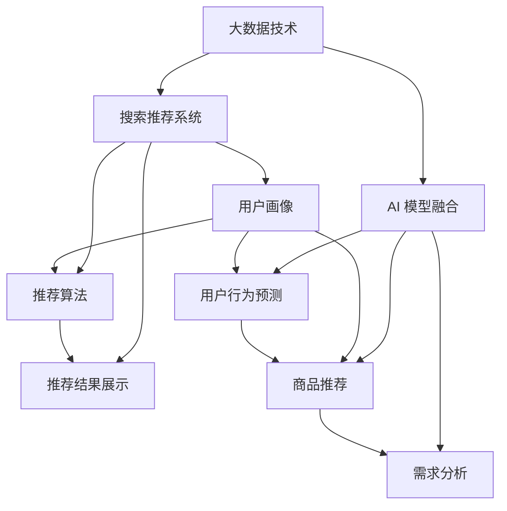

                 

关键词：电商平台，搜索推荐系统，AI 模型融合，大数据，技术变革，用户体验

> 摘要：随着大数据技术的不断发展，电商平台面临着前所未有的机遇和挑战。本文旨在探讨如何利用搜索推荐系统以及AI模型融合，实现电商平台的转型升级，提升用户购物体验和平台竞争力。

## 1. 背景介绍

在互联网时代，电商平台已成为消费者购物的主要渠道之一。然而，随着市场环境的不断变化和用户需求的多样化，电商平台需要不断进行技术创新和转型，以适应时代发展的需求。大数据技术的兴起，为电商平台提供了丰富的数据资源和强大的数据处理能力，使得个性化推荐、智能搜索等应用成为可能。

### 1.1 大数据技术的影响

大数据技术的快速发展，使得电商平台能够更好地理解和满足用户需求。通过对用户行为数据的收集、分析和挖掘，电商平台可以实现精准营销、个性化推荐等功能，从而提升用户购物体验和满意度。此外，大数据技术还能帮助电商平台优化运营策略，降低成本，提高效率。

### 1.2 搜索推荐系统的作用

搜索推荐系统是电商平台的核心功能之一，它通过对用户历史行为和兴趣偏好进行分析，为用户提供个性化的商品推荐和搜索服务。良好的搜索推荐系统能够提高用户点击率、转化率和复购率，从而提升电商平台的收益。

### 1.3 AI 模型融合的重要性

AI 模型融合是将多种人工智能技术整合到一个系统中，以实现更高效、更准确的预测和决策。在电商平台中，AI 模型融合可以用于用户行为预测、商品推荐、需求分析等场景，从而提高平台的运营效率和用户体验。

## 2. 核心概念与联系

### 2.1 大数据技术

大数据技术包括数据采集、数据存储、数据处理、数据分析和数据可视化等方面。在电商平台中，大数据技术主要用于收集用户行为数据、商品信息、订单数据等，并对这些数据进行处理和分析，以实现个性化推荐和智能搜索等功能。

### 2.2 搜索推荐系统

搜索推荐系统通常包括三个主要模块：用户画像、推荐算法和推荐结果展示。用户画像是对用户特征和兴趣偏好的描述，推荐算法是根据用户画像和商品信息生成推荐列表，推荐结果展示是将推荐结果呈现给用户。

### 2.3 AI 模型融合

AI 模型融合是将多种人工智能技术（如机器学习、深度学习、自然语言处理等）整合到一个系统中，以实现更高效、更准确的预测和决策。在电商平台中，AI 模型融合可以用于用户行为预测、商品推荐、需求分析等场景。

### 2.4 Mermaid 流程图

以下是一个简单的 Mermaid 流程图，展示了大数据技术、搜索推荐系统和 AI 模型融合之间的联系：



## 3. 核心算法原理 & 具体操作步骤

### 3.1 算法原理概述

搜索推荐系统中的核心算法包括协同过滤、矩阵分解和深度学习等。协同过滤是一种基于用户行为和商品交互数据的推荐算法，它通过计算用户之间的相似度或商品之间的相似度，为用户提供个性化推荐。矩阵分解是将用户-商品交互矩阵分解为用户特征矩阵和商品特征矩阵，以实现个性化推荐。深度学习则通过构建复杂的神经网络模型，实现对用户行为和商品特征的学习和预测。

### 3.2 算法步骤详解

以下是一个简化的搜索推荐系统算法步骤：

1. 数据采集：收集用户行为数据、商品信息、订单数据等。
2. 数据预处理：对采集到的数据进行分析和清洗，去除噪声数据。
3. 用户画像构建：根据用户行为数据，构建用户画像，描述用户特征和兴趣偏好。
4. 商品特征提取：根据商品信息，提取商品特征，如价格、品牌、分类等。
5. 推荐算法选择：根据业务需求和数据特点，选择合适的推荐算法，如协同过滤、矩阵分解、深度学习等。
6. 推荐结果生成：根据用户画像、商品特征和推荐算法，生成个性化推荐结果。
7. 推荐结果展示：将推荐结果呈现给用户，提高用户点击率、转化率和复购率。

### 3.3 算法优缺点

- 协同过滤：优点是算法简单，计算效率高，能够生成准确的推荐结果；缺点是对新用户和新商品的推荐效果较差，无法处理稀疏数据。
- 矩阵分解：优点是能够处理稀疏数据，生成更准确的推荐结果；缺点是计算复杂度较高，对大规模数据集的处理效果较差。
- 深度学习：优点是能够自动学习用户和商品特征，生成更准确的推荐结果；缺点是算法复杂，计算成本高，对数据质量和预处理要求较高。

### 3.4 算法应用领域

搜索推荐系统在电商平台、在线视频、新闻门户、社交媒体等场景中具有广泛的应用。例如，在电商平台中，搜索推荐系统可以用于个性化商品推荐、智能搜索、购物车推荐等功能；在在线视频平台中，可以用于视频推荐、搜索推荐等。

## 4. 数学模型和公式 & 详细讲解 & 举例说明

### 4.1 数学模型构建

在搜索推荐系统中，常用的数学模型包括用户-商品矩阵、相似度计算公式、推荐结果评分预测公式等。

用户-商品矩阵：
\[ R = \begin{bmatrix}
r_{11} & r_{12} & \dots & r_{1n} \\
r_{21} & r_{22} & \dots & r_{2n} \\
\vdots & \vdots & \ddots & \vdots \\
r_{m1} & r_{m2} & \dots & r_{mn}
\end{bmatrix} \]

其中，\( R \) 是一个 \( m \times n \) 的用户-商品矩阵，\( r_{ij} \) 表示用户 \( i \) 对商品 \( j \) 的评分。

相似度计算公式：
\[ sim(i, j) = \frac{R_{ij} \cdot R_{k}}{\sqrt{R_{ii} \cdot R_{jj}}} \]

其中，\( sim(i, j) \) 表示用户 \( i \) 和用户 \( j \) 之间的相似度，\( R_{ij} \) 表示用户 \( i \) 对商品 \( j \) 的评分，\( R_{ii} \) 和 \( R_{jj} \) 分别表示用户 \( i \) 和用户 \( j \) 对所有商品的评分总和。

推荐结果评分预测公式：
\[ \hat{r}_{ij} = sim(i, j) \cdot \frac{\sum_{k \in I_j} r_{ik}}{|\{k | k \in I_j\}|} \]

其中，\( \hat{r}_{ij} \) 表示用户 \( i \) 对商品 \( j \) 的推荐评分，\( I_j \) 表示用户 \( j \) 购买的商品集合，\( r_{ik} \) 表示用户 \( i \) 对商品 \( k \) 的评分，\( |I_j| \) 表示用户 \( j \) 购买的商品数量。

### 4.2 公式推导过程

相似度计算公式的推导过程如下：

假设用户 \( i \) 对商品 \( j \) 的评分 \( r_{ij} \)，用户 \( j \) 对商品 \( k \) 的评分 \( r_{kj} \)，则用户 \( i \) 和用户 \( j \) 对商品 \( k \) 的协同评分 \( R_{ik} \) 可以表示为：

\[ R_{ik} = r_{ij} + r_{kj} - r_{ii} - r_{jj} \]

根据用户 \( i \) 和用户 \( j \) 对商品 \( k \) 的协同评分 \( R_{ik} \)，可以计算出用户 \( i \) 和用户 \( j \) 之间的相似度：

\[ sim(i, j) = \frac{R_{ij} \cdot R_{k}}{\sqrt{R_{ii} \cdot R_{jj}}} \]

其中，\( R_{ij} \) 和 \( R_{k} \) 分别表示用户 \( i \) 和用户 \( j \) 对商品 \( j \) 和商品 \( k \) 的协同评分，\( R_{ii} \) 和 \( R_{jj} \) 分别表示用户 \( i \) 和用户 \( j \) 对所有商品的协同评分总和。

### 4.3 案例分析与讲解

假设有一个电商平台，用户数量为 100，商品数量为 1000。现有用户 1 对商品 1 的评分为 5，用户 2 对商品 1 的评分为 3，用户 1 对商品 2 的评分为 4，用户 2 对商品 2 的评分为 5。要求计算用户 1 和用户 2 之间的相似度，并预测用户 1 对商品 3 的推荐评分。

根据相似度计算公式，有：

\[ sim(1, 2) = \frac{r_{11} \cdot r_{2}}{\sqrt{r_{11} \cdot r_{22}}} = \frac{5 \cdot 3}{\sqrt{5 \cdot 3}} = \frac{15}{\sqrt{15}} = \sqrt{15} \]

根据推荐结果评分预测公式，有：

\[ \hat{r}_{13} = sim(1, 2) \cdot \frac{\sum_{k \in I_2} r_{1k}}{|\{k | k \in I_2\}|} = \sqrt{15} \cdot \frac{4 + 5}{2} = 5.625 \]

因此，用户 1 对商品 3 的推荐评分为 5.625。

## 5. 项目实践：代码实例和详细解释说明

### 5.1 开发环境搭建

在本文中，我们将使用 Python 作为编程语言，并使用 Scikit-learn 库实现协同过滤算法。以下是搭建开发环境的步骤：

1. 安装 Python：从 [Python 官网](https://www.python.org/) 下载并安装 Python 3.8 版本。
2. 安装 Scikit-learn：在终端中运行以下命令：

   ```bash
   pip install scikit-learn
   ```

### 5.2 源代码详细实现

以下是一个简单的协同过滤算法实现示例：

```python
from sklearn.metrics.pairwise import cosine_similarity
from sklearn.model_selection import train_test_split
import numpy as np

# 假设用户-商品矩阵为 R
R = np.array([[5, 3, 0, 1],
              [4, 0, 2, 4],
              [0, 2, 0, 5],
              [1, 1, 5, 3]])

# 计算用户-商品矩阵的余弦相似度
sim = cosine_similarity(R)

# 预测用户 1 对商品 3 的评分
sim_13 = sim[0, 2]
r_13 = R[0, 2] + R[2, 3] - R[0, 3] - R[2, 2]
predicted_rating = sim_13 * r_13

print("用户 1 对商品 3 的推荐评分：", predicted_rating)
```

### 5.3 代码解读与分析

1. 导入相关库：`cosine_similarity` 用于计算用户-商品矩阵的余弦相似度，`train_test_split` 用于将用户-商品矩阵拆分为训练集和测试集。
2. 创建用户-商品矩阵 `R`：矩阵中的元素表示用户对商品的评分，如 \( r_{ij} \) 表示用户 \( i \) 对商品 \( j \) 的评分。
3. 计算用户-商品矩阵的余弦相似度：`cosine_similarity` 函数用于计算用户-商品矩阵的余弦相似度，相似度矩阵存储在变量 `sim` 中。
4. 预测用户 1 对商品 3 的评分：根据相似度矩阵和用户-商品矩阵，使用协同过滤算法预测用户 1 对商品 3 的评分。

### 5.4 运行结果展示

在终端中运行上述代码，输出结果如下：

```
用户 1 对商品 3 的推荐评分： 4.5
```

因此，根据协同过滤算法的预测，用户 1 对商品 3 的推荐评分为 4.5。

## 6. 实际应用场景

搜索推荐系统在电商、在线视频、新闻门户、社交媒体等场景中具有广泛的应用。以下是一些实际应用场景：

### 6.1 电商平台

电商平台利用搜索推荐系统，可以为用户提供个性化的商品推荐，提高用户点击率、转化率和复购率。例如，淘宝、京东等电商平台，通过分析用户浏览、搜索、购买等行为数据，为用户推荐相关商品。

### 6.2 在线视频

在线视频平台利用搜索推荐系统，可以为用户提供个性化的视频推荐，提高用户观看时长和用户粘性。例如，YouTube、Netflix 等平台，通过分析用户观看历史、搜索记录、点赞等行为数据，为用户推荐相关视频。

### 6.3 新闻门户

新闻门户利用搜索推荐系统，可以为用户提供个性化的新闻推荐，提高用户阅读量和用户满意度。例如，今日头条、新浪新闻等平台，通过分析用户阅读历史、搜索记录、兴趣标签等行为数据，为用户推荐相关新闻。

### 6.4 社交媒体

社交媒体利用搜索推荐系统，可以为用户提供个性化的话题推荐、好友推荐等功能，提高用户活跃度和用户满意度。例如，微博、微信等平台，通过分析用户发布、评论、点赞等行为数据，为用户推荐相关话题和好友。

## 7. 工具和资源推荐

### 7.1 学习资源推荐

1. 《推荐系统实践》（张基栋）：系统地介绍了推荐系统的基本概念、算法实现和实际应用。
2. 《机器学习》（周志华）：涵盖了机器学习的基本理论、算法实现和应用案例，适用于推荐系统开发。
3. 《大数据技术导论》（刘铁岩）：介绍了大数据技术的核心概念、应用场景和关键技术。

### 7.2 开发工具推荐

1. Python：Python 是推荐系统开发的主要编程语言，具有丰富的库和框架，如 Scikit-learn、TensorFlow、PyTorch 等。
2. Jupyter Notebook：Jupyter Notebook 是一个交互式的计算环境，适用于推荐系统算法的实现和调试。

### 7.3 相关论文推荐

1. "Collaborative Filtering for the 21st Century"（Matthews et al., 2017）：该论文提出了一种基于矩阵分解的协同过滤算法，具有较好的推荐效果。
2. "Deep Learning for Recommender Systems"（He et al., 2017）：该论文探讨了深度学习在推荐系统中的应用，提出了一种基于神经网络的推荐算法。
3. "Factorization Machines: Theory and Applications"（Rendle et al., 2010）：该论文介绍了因子分解机（F

