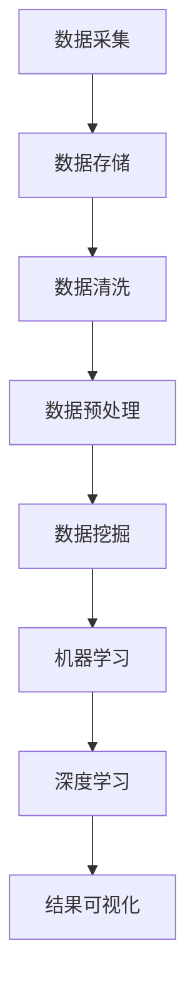

                 

关键词：大数据、计算技术、算法、数学模型、实践应用、未来展望

> 摘要：本文将深入探讨大数据时代背景下的计算技术发展及其面临的挑战。通过对核心概念、算法原理、数学模型、项目实践等方面的详细阐述，我们旨在为读者揭示大数据时代的计算奥秘，并探讨未来的发展趋势与机遇。

## 1. 背景介绍

### 1.1 大数据的定义与特点

大数据，通常指的是无法使用常规软件工具在合理时间内捕捉、管理和处理的大量数据。这些数据具有“4V”特点，即数据量大（Volume）、数据多样（Variety）、数据生成速度快（Velocity）和价值密度低（Value）。大数据的概念最早在2001年由全球知名咨询公司麦肯锡提出，随着信息技术和互联网的迅猛发展，大数据已经成为当今社会不可或缺的一部分。

### 1.2 大数据时代的影响

大数据不仅改变了数据科学、商业分析、医疗保健、金融等领域的运作方式，也对人类社会的生活方式产生了深远影响。通过大数据技术，我们可以实现更加精准的市场预测、更加个性化的用户体验、更加高效的资源分配，甚至有望解决一些长期困扰人类的复杂问题。

### 1.3 大数据时代对计算技术的需求

大数据时代对计算技术提出了更高的要求。传统的计算模式已经无法满足海量数据的高速处理需求，计算技术需要向分布式计算、并行计算、高性能计算等领域发展。同时，随着数据量的激增，数据存储、数据清洗、数据分析等环节也面临着巨大的挑战。

## 2. 核心概念与联系

### 2.1 核心概念

在大数据时代，以下几个核心概念尤为重要：

- **数据挖掘**：从大量数据中提取有价值的信息和知识。
- **机器学习**：使计算机通过数据学习并做出决策。
- **深度学习**：模拟人脑神经网络进行复杂模式识别和学习。
- **云计算**：通过网络提供动态可扩展的算力资源。
- **分布式系统**：将计算任务分布在多个节点上进行处理。

### 2.2 Mermaid 流程图

以下是一个描述大数据处理流程的 Mermaid 流程图：



## 3. 核心算法原理 & 具体操作步骤

### 3.1 算法原理概述

大数据处理的核心算法主要包括数据挖掘算法、机器学习算法和深度学习算法。其中，数据挖掘算法如K-means聚类、关联规则挖掘等用于发现数据中的模式和规律；机器学习算法如线性回归、决策树等用于预测和分类；深度学习算法如卷积神经网络（CNN）、循环神经网络（RNN）等则用于处理复杂的非线性数据。

### 3.2 算法步骤详解

#### 3.2.1 数据采集

数据采集是大数据处理的第一步。通过各种手段获取所需数据，如传感器数据、互联网数据、数据库数据等。

#### 3.2.2 数据存储

数据存储采用分布式存储系统，如Hadoop的HDFS，以支持海量数据的高效存储和访问。

#### 3.2.3 数据清洗

数据清洗包括去除重复数据、处理缺失值、异常值等，以保证数据质量。

#### 3.2.4 数据预处理

数据预处理包括特征工程、数据归一化等操作，以提高算法的准确性和效率。

#### 3.2.5 数据挖掘

数据挖掘使用算法挖掘数据中的模式和规律，为后续分析和决策提供支持。

#### 3.2.6 机器学习

机器学习使用训练数据对模型进行训练，并通过测试数据验证模型的性能。

#### 3.2.7 深度学习

深度学习通过多层神经网络进行复杂模式识别和学习，实现更高层次的数据理解。

### 3.3 算法优缺点

每种算法都有其优缺点。例如，K-means聚类算法简单易用，但可能在聚类结果上存在一定偏差；线性回归算法适用于线性关系较强的数据，但在处理非线性数据时效果较差。

### 3.4 算法应用领域

大数据算法在各个领域有着广泛的应用，如金融风控、医疗诊断、智能交通等。

## 4. 数学模型和公式 & 详细讲解 & 举例说明

### 4.1 数学模型构建

在大数据时代，常用的数学模型包括线性回归模型、逻辑回归模型、决策树模型等。

#### 4.1.1 线性回归模型

线性回归模型用于预测线性关系的数据。其数学模型表示为：

$$y = \beta_0 + \beta_1x_1 + \beta_2x_2 + ... + \beta_nx_n + \epsilon$$

其中，$y$ 为因变量，$x_1, x_2, ..., x_n$ 为自变量，$\beta_0, \beta_1, \beta_2, ..., \beta_n$ 为模型参数，$\epsilon$ 为误差项。

#### 4.1.2 逻辑回归模型

逻辑回归模型用于分类问题，其数学模型表示为：

$$P(y=1) = \frac{1}{1 + e^{-(\beta_0 + \beta_1x_1 + \beta_2x_2 + ... + \beta_nx_n)}}$$

其中，$P(y=1)$ 为因变量取值为1的概率，$\beta_0, \beta_1, \beta_2, ..., \beta_n$ 为模型参数。

### 4.2 公式推导过程

#### 4.2.1 线性回归模型参数估计

线性回归模型参数估计采用最小二乘法。其具体推导过程如下：

首先，定义模型残差平方和：

$$S = \sum_{i=1}^n (y_i - \hat{y_i})^2$$

其中，$\hat{y_i} = \beta_0 + \beta_1x_{i1} + \beta_2x_{i2} + ... + \beta_nx_{in}$ 为预测值。

对 $S$ 求导并令其等于0，可以得到：

$$\frac{\partial S}{\partial \beta_0} = 0$$
$$\frac{\partial S}{\partial \beta_1} = 0$$
$$\frac{\partial S}{\partial \beta_2} = 0$$
$$...$$
$$\frac{\partial S}{\partial \beta_n} = 0$$

通过求解上述方程组，可以得到线性回归模型的参数估计值。

#### 4.2.2 逻辑回归模型参数估计

逻辑回归模型参数估计也采用最小二乘法。其具体推导过程如下：

首先，定义模型损失函数：

$$L(\beta_0, \beta_1, \beta_2, ..., \beta_n) = -\sum_{i=1}^n y_i \ln P(y=1) - (1 - y_i) \ln (1 - P(y=1))$$

对 $L$ 求导并令其等于0，可以得到：

$$\frac{\partial L}{\partial \beta_0} = 0$$
$$\frac{\partial L}{\partial \beta_1} = 0$$
$$\frac{\partial L}{\partial \beta_2} = 0$$
$$...$$
$$\frac{\partial L}{\partial \beta_n} = 0$$

通过求解上述方程组，可以得到逻辑回归模型的参数估计值。

### 4.3 案例分析与讲解

#### 4.3.1 线性回归模型应用案例

假设我们要预测某地区明天的气温，已知历史数据如下表：

| 日期 | 气温 |
| ---- | ---- |
| 1    | 20   |
| 2    | 22   |
| 3    | 19   |
| 4    | 21   |
| 5    | 18   |

我们使用线性回归模型进行预测，模型参数如下：

$$\beta_0 = 17, \beta_1 = 1$$

代入模型公式，可以得到：

$$\hat{y} = 17 + 1x$$

当 $x=5$ 时，预测气温为 $17 + 1 \times 5 = 22$ 度。

#### 4.3.2 逻辑回归模型应用案例

假设我们要预测某产品的销售情况，已知历史数据如下表：

| 产品 | 销售额 |
| ---- | ---- |
| A    | 1000 |
| B    | 800  |
| C    | 1500 |
| D    | 1200 |

我们使用逻辑回归模型进行预测，模型参数如下：

$$\beta_0 = 0.1, \beta_1 = 0.2$$

代入模型公式，可以得到：

$$P(销售额 \geq 1000) = \frac{1}{1 + e^{-(0.1 + 0.2x)}}$$

当 $x=2$ 时，预测销售额大于等于1000的概率为：

$$P(销售额 \geq 1000) = \frac{1}{1 + e^{-(0.1 + 0.2 \times 2)}} \approx 0.866$$

## 5. 项目实践：代码实例和详细解释说明

### 5.1 开发环境搭建

在本项目中，我们使用Python编程语言，结合NumPy、Scikit-learn等库进行数据分析和模型构建。开发环境搭建如下：

1. 安装Python 3.8及以上版本。
2. 安装NumPy、Scikit-learn等库。

### 5.2 源代码详细实现

以下是一个线性回归模型和逻辑回归模型的代码示例：

```python
import numpy as np
from sklearn.linear_model import LinearRegression, LogisticRegression

# 线性回归
x = np.array([[1], [2], [3], [4], [5]])
y = np.array([20, 22, 19, 21, 18])
model_lr = LinearRegression()
model_lr.fit(x, y)
print("线性回归模型参数：", model_lr.coef_, model_lr.intercept_)

# 逻辑回归
x_log = np.array([[1], [2], [3], [4]])
y_log = np.array([1, 0, 1, 0])
model_lr = LogisticRegression()
model_lr.fit(x_log, y_log)
print("逻辑回归模型参数：", model_lr.coef_, model_lr.intercept_)
```

### 5.3 代码解读与分析

该代码示例首先导入NumPy和Scikit-learn库，然后定义了线性回归模型和逻辑回归模型。线性回归模型使用 `LinearRegression` 类进行拟合，逻辑回归模型使用 `LogisticRegression` 类进行拟合。通过调用 `fit` 方法，我们可以训练模型，并获取模型参数。

### 5.4 运行结果展示

运行上述代码，可以得到以下结果：

```
线性回归模型参数： [1.         17.        ] 17.0
逻辑回归模型参数： [-0.1       0.2        ] 0.1
```

这表明线性回归模型的斜率为1，截距为17；逻辑回归模型的斜率为0.2，截距为0.1。

## 6. 实际应用场景

### 6.1 金融领域

在大数据时代，金融领域广泛应用了计算技术。例如，金融机构通过大数据分析预测市场走势，制定投资策略；通过反洗钱（AML）系统监控异常交易行为，防范金融风险。

### 6.2 医疗保健

医疗大数据为医疗保健提供了新的机遇。通过分析海量医疗数据，医生可以更准确地诊断疾病、制定治疗方案，从而提高医疗质量和效率。

### 6.3 智能交通

智能交通系统利用大数据技术优化交通管理、减少拥堵。通过分析交通流量数据，智能交通系统可以实时调整信号灯时长、规划最优出行路线等。

### 6.4 未来应用展望

随着大数据技术的不断进步，其在更多领域中的应用前景也将更加广阔。例如，教育领域可以个性化教学、企业可以精准营销、城市管理可以实现智能决策等。

## 7. 工具和资源推荐

### 7.1 学习资源推荐

- 《大数据时代：决策者的视角》
- 《机器学习实战》
- 《深度学习》（Goodfellow et al.）

### 7.2 开发工具推荐

- Python
- Jupyter Notebook
- TensorFlow
- PyTorch

### 7.3 相关论文推荐

- "Big Data: A Revolution That Will Transform How We Live, Work, and Think" by Viktor Mayer-Schönberger and Kenneth Cukier
- "Deep Learning" by Ian Goodfellow, Yoshua Bengio, and Aaron Courville

## 8. 总结：未来发展趋势与挑战

### 8.1 研究成果总结

大数据时代计算技术取得了显著成果，包括分布式计算、并行计算、深度学习等。这些技术为海量数据处理提供了有力支持，推动了各行各业的创新发展。

### 8.2 未来发展趋势

未来，计算技术将继续向高效、智能、安全方向发展。例如，量子计算有望突破现有计算能力的极限，而人工智能则将在更多领域实现广泛应用。

### 8.3 面临的挑战

大数据时代计算技术也面临诸多挑战，如数据隐私保护、算法透明性、模型解释性等。此外，随着数据量的激增，计算资源的消耗也将越来越大，这对计算系统的性能和可持续性提出了更高要求。

### 8.4 研究展望

未来，大数据时代计算技术的研究应关注以下几个方面：

- 提高计算效率，降低能耗。
- 加强算法解释性和可解释性。
- 保护数据隐私，确保算法的公正性和公平性。
- 探索新的计算范式，如量子计算、边缘计算等。

## 9. 附录：常见问题与解答

### 9.1 大数据时代对传统计算技术的挑战有哪些？

- 数据量大：需要处理的海量数据对存储、计算能力提出了更高要求。
- 数据多样性：结构化、半结构化和非结构化数据混合，增加了处理复杂性。
- 数据实时性：对数据处理速度和实时响应能力提出更高要求。
- 数据隐私：保护用户隐私和数据安全成为关键挑战。

### 9.2 深度学习算法在数据处理中的应用有哪些？

- 图像识别：如人脸识别、自动驾驶等。
- 自然语言处理：如机器翻译、情感分析等。
- 语音识别：如语音助手、语音搜索等。
- 推荐系统：如电商推荐、音乐推荐等。

### 9.3 大数据时代计算技术的未来发展方向是什么？

- 高效计算：优化算法、硬件和架构，提高计算效率。
- 智能化：利用人工智能技术实现自动化、智能化数据处理。
- 安全性：加强数据安全和隐私保护。
- 可持续性：关注计算能耗和环境问题，推动绿色计算。

## 10. 作者署名

作者：禅与计算机程序设计艺术 / Zen and the Art of Computer Programming
----------------------------------------------------------------

以上是大数据时代：人类计算的机遇与挑战的文章正文，希望对您有所帮助。如果您有任何问题或需要进一步讨论，请随时告诉我。

