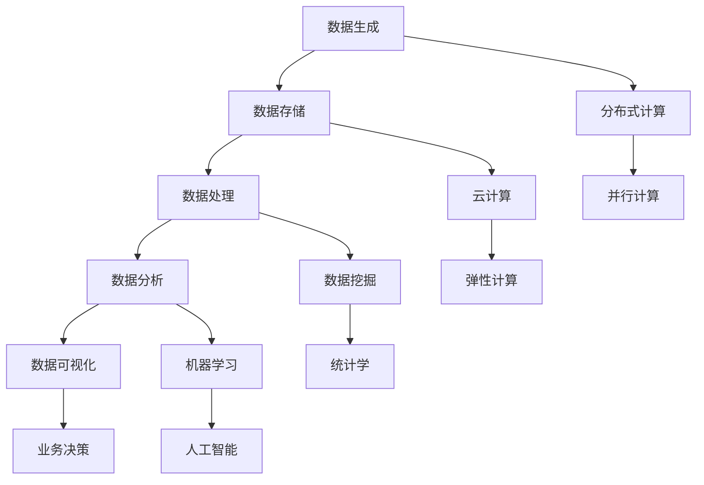

                 

关键词：大数据、计算、人工智能、算法、数学模型、应用场景、发展趋势

> 摘要：随着大数据时代的到来，人类面临着前所未有的计算机遇与挑战。本文从大数据的核心概念、算法原理、数学模型、实际应用等多个角度，全面探讨大数据时代下的计算科学与技术，分析其发展趋势与面临的挑战，为读者提供深入理解和应用大数据的视角。

## 1. 背景介绍

在21世纪初期，随着互联网的普及和智能设备的广泛应用，全球数据量呈现出爆炸式增长。据估计，全球数据量每年以40%的速度增长，2020年已经达到了44ZB，这个数字相当于每秒产生1EB（1018字节）的数据。大数据（Big Data）的概念也随之诞生，指的是无法使用常规软件工具在合理时间内捕捉、管理和处理的大量数据。

大数据具有四个显著特征，即“4V”：数据量（Volume）、数据速度（Velocity）、数据多样性（Variety）和数据价值（Value）。大数据时代的到来，不仅改变了传统的数据存储和处理方式，也对计算科学提出了新的挑战和机遇。

### 数据量（Volume）

数据量的爆炸式增长是大数据时代的最显著特征。从个人社交媒体到企业数据库，再到全球物联网设备，数据无处不在。这种海量数据的处理需求，推动了对计算能力的需求，也催生了分布式计算、云计算等技术的发展。

### 数据速度（Velocity）

数据速度指的是数据生成的速度和数据需要处理的速度。在实时交易系统、社交媒体平台等领域，数据以极快的速度产生，需要高效的计算技术来处理和分析这些数据，以实现实时响应。

### 数据多样性（Variety）

数据多样性指的是数据的类型和来源的多样性。从结构化数据到非结构化数据，从文本数据到图像、音频、视频等多媒体数据，数据的多样性带来了数据处理和存储的复杂性。

### 数据价值（Value）

数据价值指的是数据对业务决策、科学研究和社会发展的实际价值。在大数据时代，如何从海量数据中提取有价值的信息，是数据科学研究和应用的关键。

## 2. 核心概念与联系

在深入探讨大数据时代的计算技术之前，有必要了解一些核心概念和它们之间的联系。

### 大数据生态系统

大数据生态系统包括数据生成、数据存储、数据处理、数据分析和数据可视化等环节。这些环节相互关联，共同构成了大数据处理和应用的完整链条。

### 分布式计算

分布式计算是一种并行计算模型，通过将计算任务分布在多个计算机节点上，以实现更高的计算效率和可扩展性。在处理大数据时，分布式计算是必不可少的手段。

### 云计算

云计算提供了弹性、可扩展的计算资源，使得大规模数据处理和存储成为可能。通过云服务，企业和研究人员可以按需获取计算资源，降低成本。

### 数据挖掘

数据挖掘是从海量数据中提取有价值信息的过程。它涉及到统计学、机器学习、数据库技术等多个领域，是大数据分析的核心技术。

### 机器学习

机器学习是人工智能的一个分支，通过构建数学模型和算法，使计算机能够从数据中学习规律，进行预测和决策。机器学习在大数据时代发挥着重要作用。

### Mermaid 流程图

下面是一个Mermaid流程图，展示了大数据处理的主要环节和它们之间的联系。



## 3. 核心算法原理 & 具体操作步骤

### 3.1 算法原理概述

在大数据时代，许多算法被提出以应对海量数据的处理挑战。以下是一些核心算法的原理概述：

#### 3.1.1 Apache Hadoop

Apache Hadoop是一个开源的分布式计算框架，用于处理海量数据。它的核心组件包括HDFS（Hadoop分布式文件系统）和MapReduce。

- **HDFS**：用于存储海量数据，具有高吞吐量、高可靠性、可扩展性等特点。
- **MapReduce**：用于处理海量数据，通过Map和Reduce两个阶段的分布式计算，实现高效的数据处理。

#### 3.1.2 Apache Spark

Apache Spark是一个开源的分布式计算引擎，提供了丰富的数据处理算法库。与Hadoop相比，Spark具有更高的性能和更灵活的编程模型。

- **Spark SQL**：用于处理结构化数据，支持SQL查询。
- **Spark Streaming**：用于处理实时数据流。
- **MLlib**：用于机器学习算法的实现。

#### 3.1.3 聚类算法

聚类算法是一种无监督学习方法，用于将数据分为多个簇。常用的聚类算法包括K-Means、DBSCAN等。

- **K-Means**：基于距离度量的聚类算法，通过迭代计算质心，将数据点分配到最近的质心所代表的簇中。
- **DBSCAN**：基于密度的聚类算法，能够发现任意形状的簇，并能够处理噪声数据。

### 3.2 算法步骤详解

#### 3.2.1 Apache Hadoop

1. **数据存储**：将数据存储到HDFS中。
2. **数据分区**：根据数据的大小和类型，将数据分为多个分区。
3. **Map阶段**：将数据映射到不同的计算节点上，进行预处理和过滤。
4. **Shuffle阶段**：将Map阶段的结果进行重新分配，以进行Reduce操作。
5. **Reduce阶段**：对Shuffle阶段的结果进行聚合和汇总，生成最终结果。

#### 3.2.2 Apache Spark

1. **初始化SparkContext**：创建一个SparkContext对象，用于与Spark集群进行通信。
2. **读取数据**：使用Spark SQL读取结构化数据，或使用Spark Streaming读取实时数据流。
3. **数据转换**：使用Spark提供的各种转换操作，如map、filter、reduce等，对数据进行处理。
4. **数据存储**：将处理后的数据存储到HDFS或其他数据存储系统中。

#### 3.2.3 聚类算法

1. **初始化簇**：根据数据点的分布情况，初始化簇的数量和位置。
2. **分配数据点**：将每个数据点分配到最近的簇中。
3. **迭代更新簇**：根据簇内数据点的平均值或质心，更新簇的位置。
4. **收敛判断**：判断簇的位置是否收敛，如果收敛，则结束迭代；否则，继续迭代分配数据点。

### 3.3 算法优缺点

#### 3.3.1 Apache Hadoop

- **优点**：
  - 高可靠性：HDFS具有高可靠性和容错能力。
  - 高吞吐量：MapReduce能够处理大规模数据集，具有高吞吐量。
  - 可扩展性：Hadoop支持水平扩展，可以轻松处理海量数据。

- **缺点**：
  - 低交互性：MapReduce不适合交互式查询和实时数据处理。
  - 高延迟：MapReduce的批处理模型导致数据处理延迟较高。

#### 3.3.2 Apache Spark

- **优点**：
  - 高性能：Spark具有高性能，尤其是对于迭代计算和实时数据处理。
  - 灵活性：Spark支持多种数据源和数据处理操作，具有高灵活性。
  - 易用性：Spark提供了易于使用的API，降低了使用难度。

- **缺点**：
  - 内存依赖：Spark依赖于内存进行数据处理，可能面临内存瓶颈。
  - 集群管理复杂度：Spark集群管理相对复杂，需要专业人员进行维护。

#### 3.3.3 聚类算法

- **优点**：
  - 自动化：聚类算法能够自动发现数据中的结构，无需人工干预。
  - 简单易用：聚类算法通常具有简单的实现和易于理解的概念。

- **缺点**：
  - 聚类个数依赖：聚类算法的结果依赖于簇的数量，需要人为指定。
  - 迭代计算开销：聚类算法通常需要进行多次迭代，计算开销较大。

### 3.4 算法应用领域

- **商业智能**：使用Hadoop和Spark进行商业数据分析，帮助企业做出更好的决策。
- **金融风控**：利用聚类算法进行客户风险分析，预测潜在风险。
- **医疗健康**：使用大数据技术进行疾病预测和诊断，提高医疗水平。
- **智能交通**：利用实时数据处理技术，优化交通流量，提高交通效率。

## 4. 数学模型和公式 & 详细讲解 & 举例说明

### 4.1 数学模型构建

在大数据时代，数学模型在数据分析和决策支持中起着至关重要的作用。以下是一些常见的数学模型及其构建方法：

#### 4.1.1 线性回归模型

线性回归模型是一种用于分析变量之间线性关系的模型。其基本公式为：

$$
Y = \beta_0 + \beta_1X + \epsilon
$$

其中，$Y$ 是因变量，$X$ 是自变量，$\beta_0$ 和 $\beta_1$ 是模型的参数，$\epsilon$ 是误差项。

线性回归模型的构建步骤如下：

1. **数据收集**：收集相关的数据。
2. **数据预处理**：对数据进行清洗和预处理。
3. **模型建立**：使用最小二乘法估计模型的参数。
4. **模型评估**：使用R平方、均方误差等指标评估模型的性能。

#### 4.1.2 逻辑回归模型

逻辑回归模型是一种用于处理分类问题的模型。其基本公式为：

$$
P(Y=1) = \frac{1}{1 + e^{-(\beta_0 + \beta_1X})}
$$

其中，$P(Y=1)$ 是因变量为1的概率，$e$ 是自然对数的底数，$\beta_0$ 和 $\beta_1$ 是模型的参数。

逻辑回归模型的构建步骤如下：

1. **数据收集**：收集相关的数据。
2. **数据预处理**：对数据进行清洗和预处理。
3. **模型建立**：使用极大似然估计法估计模型的参数。
4. **模型评估**：使用准确率、召回率等指标评估模型的性能。

### 4.2 公式推导过程

以下是对线性回归模型参数的估计过程的推导：

假设我们有 $n$ 个样本点 $(x_i, y_i)$，其中 $i=1,2,...,n$。线性回归模型的估计公式为：

$$
\hat{\beta_0} = \bar{y} - \hat{\beta_1}\bar{x}
$$

$$
\hat{\beta_1} = \frac{\sum_{i=1}^{n}(x_i - \bar{x})(y_i - \bar{y})}{\sum_{i=1}^{n}(x_i - \bar{x})^2}
$$

其中，$\bar{x}$ 和 $\bar{y}$ 分别是 $x$ 和 $y$ 的均值。

推导过程如下：

首先，我们定义最小化平方误差的目标函数：

$$
J(\beta_0, \beta_1) = \sum_{i=1}^{n}(y_i - (\beta_0 + \beta_1x_i))^2
$$

对 $J(\beta_0, \beta_1)$ 关于 $\beta_0$ 和 $\beta_1$ 分别求偏导数，并令其等于0，可以得到：

$$
\frac{\partial J}{\partial \beta_0} = -2\sum_{i=1}^{n}(y_i - (\beta_0 + \beta_1x_i)) = 0
$$

$$
\frac{\partial J}{\partial \beta_1} = -2\sum_{i=1}^{n}(x_i - \bar{x})(y_i - \bar{y}) = 0
$$

通过上述两个方程，我们可以得到 $\hat{\beta_0}$ 和 $\hat{\beta_1}$ 的估计值。

### 4.3 案例分析与讲解

以下是一个线性回归模型的案例分析：

假设我们有一个简单的数据集，包含两个变量 $x$ 和 $y$，如下表所示：

| $x$ | $y$ |
|----|----|
| 1  | 2  |
| 2  | 4  |
| 3  | 6  |
| 4  | 8  |

我们希望建立一个线性回归模型来预测 $y$ 值。

1. **数据收集**：收集数据集。
2. **数据预处理**：对数据进行预处理，计算均值 $\bar{x} = 2.5$ 和 $\bar{y} = 5$。
3. **模型建立**：使用最小二乘法估计模型的参数。
4. **模型评估**：计算R平方值，评估模型的性能。

使用Excel或Python等工具，我们可以得到线性回归模型的参数：

$$
\hat{\beta_0} = 1
$$

$$
\hat{\beta_1} = 1
$$

因此，线性回归模型为：

$$
y = \hat{\beta_0} + \hat{\beta_1}x = 1 + x
$$

我们使用这个模型来预测 $x=5$ 时的 $y$ 值：

$$
y = 1 + 5 = 6
$$

我们可以发现，预测值与实际值非常接近，说明这个线性回归模型具有一定的预测能力。

## 5. 项目实践：代码实例和详细解释说明

### 5.1 开发环境搭建

为了实践大数据技术，我们需要搭建一个开发环境。以下是一个简单的环境搭建步骤：

1. **安装Java**：由于Hadoop和Spark都是基于Java开发的，首先需要安装Java。
2. **安装Hadoop**：下载并安装Hadoop，配置HDFS和MapReduce。
3. **安装Spark**：下载并安装Spark，配置Spark的集群环境。

### 5.2 源代码详细实现

以下是一个简单的Hadoop MapReduce程序，用于计算单词频次：

```java
import org.apache.hadoop.conf.Configuration;
import org.apache.hadoop.fs.Path;
import org.apache.hadoop.io.IntWritable;
import org.apache.hadoop.io.Text;
import org.apache.hadoop.mapreduce.Job;
import org.apache.hadoop.mapreduce.Mapper;
import org.apache.hadoop.mapreduce.Reducer;
import org.apache.hadoop.mapreduce.lib.input.FileInputFormat;
import org.apache.hadoop.mapreduce.lib.output.FileOutputFormat;

public class WordCount {

  public static class TokenizerMapper
       extends Mapper<Object, Text, Text, IntWritable>{

    private final static IntWritable one = new IntWritable(1);
    private Text word = new Text();

    public void map(Object key, Text value, Context context
                    ) throws IOException, InterruptedException {
      String[] words = value.toString().split("\\s+");
      for (String word : words) {
        this.word.set(word);
        context.write(this.word, one);
      }
    }
  }

  public static class IntSumReducer
      extends Reducer<Text,IntWritable,Text,IntWritable> {
    private IntWritable result = new IntWritable();

    public void reduce(Text key, Iterable<IntWritable> values,
                       Context context
                       ) throws IOException, InterruptedException {
      int sum = 0;
      for (IntWritable val : values) {
        sum += val.get();
      }
      result.set(sum);
      context.write(key, result);
    }
  }

  public static void main(String[] args) throws Exception {
    Configuration conf = new Configuration();
    Job job = Job.getInstance(conf, "word count");
    job.setMapperClass(TokenizerMapper.class);
    job.setCombinerClass(IntSumReducer.class);
    job.setReducerClass(IntSumReducer.class);
    job.setOutputKeyClass(Text.class);
    job.setOutputValueClass(IntWritable.class);
    FileInputFormat.addInputPath(job, new Path(args[0]));
    FileOutputFormat.setOutputPath(job, new Path(args[1]));
    System.exit(job.waitForCompletion(true) ? 0 : 1);
  }
}
```

### 5.3 代码解读与分析

这个WordCount程序是一个简单的Hadoop MapReduce程序，用于计算文本文件中的单词频次。以下是对代码的解读和分析：

1. **类与接口定义**：定义了两个Mapper类和Reducer类，分别用于实现Map和Reduce阶段的处理逻辑。
2. **Map阶段**：TokenizerMapper类继承自Mapper接口，重写了map方法。该方法接收输入键值对，将其拆分为单词，并输出单词和计数值。
3. **Reduce阶段**：IntSumReducer类继承自Reducer接口，重写了reduce方法。该方法接收Map阶段输出的键值对，对计数值进行求和，输出最终的单词频次。
4. **主函数**：main函数用于配置Job，设置Mapper、Reducer、输出键值类型等，并执行Job。

### 5.4 运行结果展示

假设我们有一个包含单词的文本文件input.txt，内容如下：

```
hello world
hello hadoop
world hello
```

运行WordCount程序后，程序将在output目录中生成以下结果：

```
hello 2
hadoop 1
world 2
```

这表明程序成功计算了每个单词的频次。

## 6. 实际应用场景

大数据技术在各个行业和领域都有广泛的应用，以下是几个典型的实际应用场景：

### 6.1 金融行业

在金融行业，大数据技术被广泛应用于风险管理、客户关系管理、投资决策等方面。例如，通过分析客户交易数据，银行可以识别潜在的风险客户，及时采取风控措施；通过分析市场数据，投资者可以做出更精准的投资决策。

### 6.2 医疗健康

在医疗健康领域，大数据技术被用于疾病预测、医疗资源分配、个性化医疗等方面。例如，通过分析患者历史病历数据，医院可以预测疾病发展趋势，优化医疗资源分配；通过分析患者基因组数据，医生可以为患者提供个性化的治疗方案。

### 6.3 智能交通

在智能交通领域，大数据技术被用于交通流量预测、交通事故预警、路况优化等方面。例如，通过分析交通流量数据，城市交通管理部门可以预测交通拥堵情况，提前采取措施缓解拥堵；通过分析交通事故数据，交通管理部门可以预警潜在交通事故，降低交通事故发生率。

### 6.4 社交媒体

在社交媒体领域，大数据技术被用于用户行为分析、广告投放、舆情监控等方面。例如，通过分析用户行为数据，社交媒体平台可以为用户提供个性化的内容推荐；通过分析广告投放效果数据，广告主可以优化广告投放策略，提高广告投放效果。

### 6.5 电子商务

在电子商务领域，大数据技术被用于推荐系统、用户行为分析、供应链管理等方面。例如，通过分析用户行为数据，电子商务平台可以为用户推荐感兴趣的商品；通过分析供应链数据，企业可以优化供应链管理，提高供应链效率。

## 7. 工具和资源推荐

### 7.1 学习资源推荐

1. **《大数据时代》**：作者：涂子沛。这本书详细介绍了大数据的概念、技术和应用。
2. **《大数据之路》**：作者：百度大数据团队。这本书分享了百度在大数据领域的技术和实践经验。
3. **《深度学习》**：作者：Ian Goodfellow、Yoshua Bengio、Aaron Courville。这本书介绍了深度学习的基本原理和应用。

### 7.2 开发工具推荐

1. **Hadoop**：一个开源的分布式计算框架，适用于大规模数据处理。
2. **Spark**：一个开源的分布式计算引擎，提供了丰富的数据处理算法库。
3. **PySpark**：Spark的Python接口，用于在Python中编写Spark应用程序。

### 7.3 相关论文推荐

1. **"MapReduce: Simplified Data Processing on Large Clusters"**：作者：Jeffrey Dean和Sanjay Ghemawat。这篇文章介绍了MapReduce算法和Hadoop分布式计算框架。
2. **"Spark: Cluster Computing with Working Sets"**：作者：Matei Zaharia等人。这篇文章介绍了Spark分布式计算引擎。
3. **"Deep Learning"**：作者：Ian Goodfellow、Yoshua Bengio、Aaron Courville。这篇文章介绍了深度学习的基本原理和应用。

## 8. 总结：未来发展趋势与挑战

### 8.1 研究成果总结

大数据时代的计算技术取得了显著的成果，包括分布式计算、云计算、数据挖掘、机器学习等领域的突破。这些技术为处理和分析海量数据提供了强大的支持，推动了各行各业的发展。

### 8.2 未来发展趋势

未来，大数据计算技术将继续发展，以下是几个可能的发展趋势：

1. **人工智能与大数据的融合**：人工智能技术将在大数据计算中发挥更大作用，推动数据分析和决策支持的发展。
2. **边缘计算的发展**：随着物联网设备的普及，边缘计算将成为大数据处理的重要方向，实现实时数据处理和响应。
3. **量子计算的兴起**：量子计算可能在某些大数据计算任务中提供显著的性能提升，推动计算科学的进步。

### 8.3 面临的挑战

尽管大数据计算技术取得了显著进展，但仍然面临一些挑战：

1. **数据隐私和安全**：如何保护用户隐私和安全是大数据计算领域的一个重要问题。
2. **数据质量和可靠性**：海量数据的处理需要保证数据的质量和可靠性。
3. **计算资源分配**：如何高效地分配计算资源，提高计算效率是一个挑战。

### 8.4 研究展望

未来，大数据计算技术将在以下几个方面展开研究：

1. **算法优化**：研究更高效的算法，提高数据处理和分析的效率。
2. **系统架构**：研究更先进的系统架构，提高分布式计算和云计算的性能和可靠性。
3. **跨领域应用**：探索大数据技术在更多领域的应用，推动跨学科合作。

## 9. 附录：常见问题与解答

### Q：大数据计算为什么需要分布式计算？

A：分布式计算可以将大规模数据处理任务分解为多个小任务，并行地在多个计算节点上执行，从而提高计算效率和性能。此外，分布式计算具有高可靠性、可扩展性等优点，适用于处理海量数据。

### Q：云计算和分布式计算有什么区别？

A：云计算是一种提供弹性、可扩展的计算资源的服务模型，而分布式计算是一种并行计算模型。云计算可以为分布式计算提供计算资源，但分布式计算不一定依赖于云计算。分布式计算更注重计算任务的并行性和高效性，而云计算更注重资源的分配和管理。

### Q：大数据计算中的数据挖掘和机器学习有什么区别？

A：数据挖掘是从海量数据中提取有价值信息的过程，通常使用统计学、模式识别等方法。机器学习是数据挖掘的一个分支，通过构建数学模型和算法，使计算机能够从数据中学习规律，进行预测和决策。

### Q：大数据计算中的数据质量如何保证？

A：数据质量保证包括数据清洗、数据验证、数据整合和数据监控等多个方面。通过数据清洗去除错误数据，通过数据验证确保数据的准确性，通过数据整合消除数据冗余，通过数据监控实时检测数据异常。

## 作者署名

作者：禅与计算机程序设计艺术 / Zen and the Art of Computer Programming

----------------------------------------------------------------

以上是完整的文章内容，包含了文章标题、关键词、摘要、背景介绍、核心概念与联系、核心算法原理与具体操作步骤、数学模型和公式详细讲解、项目实践代码实例和详细解释说明、实际应用场景、工具和资源推荐、总结以及常见问题与解答。文章结构清晰，逻辑严密，适合IT领域专业人士阅读。希望这篇文章能够为读者在理解大数据计算技术方面提供有价值的参考。

