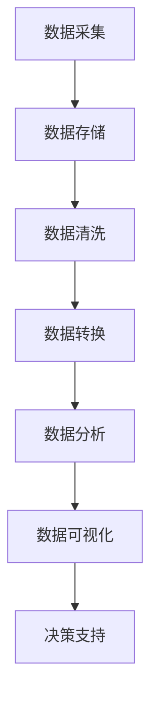

                 

 关键词：大数据、计算、机遇、挑战、算法、应用、展望

> 摘要：本文将探讨大数据时代给人类计算带来的机遇与挑战。通过分析大数据的核心概念、计算技术、算法原理以及数学模型，我们将揭示大数据时代的本质特征，并讨论其在实际应用中的重要性。同时，我们将展望未来发展趋势，探讨面临的技术挑战，并提出相应的解决方案。

## 1. 背景介绍

在过去的几十年中，信息技术和互联网的快速发展催生了大数据的爆发式增长。大数据（Big Data）指的是那些数量庞大、种类繁多、生成速度快、价值密度低的非结构化或半结构化数据。这些数据来源于互联网、物联网、社交媒体、移动设备等各种渠道，包括文本、图像、音频、视频等多种形式。

随着数据量的激增，传统的数据处理方法已经无法满足需求。因此，计算技术、算法、数学模型等方面都需要进行相应的创新和优化，以应对大数据时代的挑战。本文将围绕这些主题进行深入探讨，旨在为读者提供对大数据时代的全面理解。

### 1.1 大数据的定义与特征

大数据具有以下四个主要特征：

- **大量性（Volume）**：大数据通常指的是数据量巨大，从几个GB到几个TB甚至PB级别。
- **多样性（Variety）**：数据类型多样，包括结构化、半结构化和非结构化数据。
- **速度（Velocity）**：数据生成和处理的速度非常快，需要实时或近实时的处理能力。
- **价值密度（Value）**：数据的价值密度低，即数据中蕴含的价值较少，需要通过高效的数据分析来挖掘。

### 1.2 大数据的发展历程

大数据的发展可以追溯到20世纪80年代，随着计算机技术的进步，数据存储和处理能力得到了显著提升。进入21世纪，互联网的普及和物联网技术的发展，使得数据生成速度和种类进一步增加，大数据逐渐成为研究和应用的热点。

## 2. 核心概念与联系

为了更好地理解大数据时代的计算挑战和机遇，我们需要明确几个核心概念，并了解它们之间的联系。

### 2.1 计算技术

计算技术是大数据时代的基础，主要包括以下几个方面：

- **分布式计算**：通过将数据分布到多个计算节点上，实现并行处理，提高数据处理速度。
- **云计算**：提供弹性的计算资源，可以根据需求动态调整计算能力。
- **内存计算**：利用内存进行高速数据计算，适用于实时数据处理。

### 2.2 算法

算法在大数据时代发挥着至关重要的作用，包括以下几个方面：

- **数据挖掘算法**：用于从大量数据中提取有价值的信息。
- **机器学习算法**：通过训练模型，实现数据的自动分析和预测。
- **优化算法**：用于优化数据处理过程，提高效率和准确性。

### 2.3 数学模型

数学模型是大数据分析和处理的重要工具，主要包括以下几个方面：

- **统计学模型**：用于数据的统计分析，如回归分析、聚类分析等。
- **概率模型**：用于建模不确定性和概率分布，如贝叶斯网络、马尔可夫模型等。
- **图论模型**：用于处理复杂网络结构和关系，如社交网络分析、图算法等。

### 2.4 Mermaid 流程图

为了更好地理解核心概念之间的联系，我们可以使用Mermaid流程图来展示大数据计算的核心流程。以下是示例：



## 3. 核心算法原理 & 具体操作步骤

在了解核心概念的基础上，我们将进一步探讨大数据时代的关键算法原理，并详细解释其操作步骤。

### 3.1 算法原理概述

大数据时代的关键算法主要包括：

- **MapReduce**：一种分布式数据处理框架，用于处理大规模数据集。
- **深度学习**：一种基于人工神经网络的机器学习技术，能够实现自动化特征学习和复杂模式识别。
- **图计算**：用于处理复杂网络结构和关系，如社交网络分析、推荐系统等。

### 3.2 算法步骤详解

以下是对上述关键算法的操作步骤进行详细解释：

#### 3.2.1 MapReduce

1. **输入数据分片**：将大规模数据集划分为多个小块，分配到不同的计算节点上。
2. **Map阶段**：对每个分片的数据进行处理，生成中间结果。
3. **Shuffle阶段**：将中间结果进行合并，以便于后续处理。
4. **Reduce阶段**：对合并后的中间结果进行聚合计算，生成最终结果。

#### 3.2.2 深度学习

1. **数据预处理**：对输入数据进行标准化、归一化等预处理操作。
2. **模型构建**：定义神经网络结构，包括输入层、隐藏层和输出层。
3. **模型训练**：通过反向传播算法，训练模型参数，使模型适应输入数据。
4. **模型评估**：使用测试数据评估模型性能，并进行调整。

#### 3.2.3 图计算

1. **数据预处理**：将图数据转换为适合计算格式的表示。
2. **算法选择**：根据应用场景选择合适的图计算算法，如PageRank、社区发现等。
3. **算法实现**：实现所选算法的代码，进行图计算。
4. **结果分析**：对计算结果进行分析，提取有价值的信息。

### 3.3 算法优缺点

#### 3.3.1 MapReduce

- **优点**：
  - 分布式处理能力强大，能够处理大规模数据集。
  - 便于扩展和容错，适合大规模数据处理。

- **缺点**：
  - 需要一定的编程技能和专业知识。
  - 不适合实时数据处理。

#### 3.3.2 深度学习

- **优点**：
  - 能够自动学习复杂特征，适应性强。
  - 在图像、语音、自然语言处理等领域表现出色。

- **缺点**：
  - 训练过程需要大量数据和计算资源。
  - 需要专业人员进行调整和优化。

#### 3.3.3 图计算

- **优点**：
  - 适用于处理复杂网络结构和关系。
  - 能够提取有价值的信息，用于推荐系统、社交网络分析等。

- **缺点**：
  - 数据预处理较为复杂。
  - 需要一定的图算法知识。

### 3.4 算法应用领域

大数据时代的算法应用领域广泛，包括：

- **互联网搜索**：利用深度学习进行文本分类和情感分析，提高搜索精度。
- **推荐系统**：利用图计算分析用户行为和兴趣，推荐个性化内容。
- **金融风控**：利用大数据分析技术，预测风险、监控异常交易。
- **医疗健康**：利用数据挖掘技术，发现疾病规律、制定个性化治疗方案。

## 4. 数学模型和公式 & 详细讲解 & 举例说明

在处理大数据时，数学模型和公式是必不可少的工具。下面我们将介绍一些常见的数学模型和公式，并详细讲解其推导过程和实际应用。

### 4.1 数学模型构建

#### 4.1.1 贝叶斯网络

贝叶斯网络是一种概率模型，用于表示变量之间的条件依赖关系。其基本结构如下：

\[ P(A_1, A_2, ..., A_n) = \prod_{i=1}^{n} P(A_i | A_{i-1}, A_{i-2}, ..., A_1) \]

其中，\( P(A_i | A_{i-1}, A_{i-2}, ..., A_1) \) 表示条件概率。

#### 4.1.2 马尔可夫模型

马尔可夫模型是一种基于状态转移概率的模型，用于描述系统状态随时间的变化。其基本结构如下：

\[ P(S_t | S_{t-1}, S_{t-2}, ..., S_1) = P(S_t | S_{t-1}) \]

其中，\( S_t \) 表示在时间 \( t \) 的系统状态。

### 4.2 公式推导过程

#### 4.2.1 贝叶斯定理

贝叶斯定理是一种概率计算公式，用于计算后验概率。其推导过程如下：

\[ P(A|B) = \frac{P(B|A)P(A)}{P(B)} \]

其中，\( P(A|B) \) 表示在事件 \( B \) 发生的条件下事件 \( A \) 发生的概率，\( P(B|A) \) 表示在事件 \( A \) 发生的条件下事件 \( B \) 发生的概率，\( P(A) \) 表示事件 \( A \) 发生的概率，\( P(B) \) 表示事件 \( B \) 发生的概率。

#### 4.2.2 马尔可夫模型推导

马尔可夫模型的推导过程如下：

假设系统处于状态 \( S_t \)，则在下一个时间点 \( t+1 \) 系统状态为 \( S_{t+1} \) 的概率为：

\[ P(S_{t+1} | S_t) = \sum_{i} P(S_{t+1} | S_t = i)P(S_t = i) \]

其中，\( P(S_{t+1} | S_t = i) \) 表示在当前状态为 \( i \) 的情况下，下一个状态为 \( S_{t+1} \) 的概率，\( P(S_t = i) \) 表示当前状态为 \( i \) 的概率。

### 4.3 案例分析与讲解

#### 4.3.1 社交网络分析

假设我们有一个社交网络，包含用户 \( U = \{u_1, u_2, ..., u_n\} \)，以及他们之间的连接关系。我们想要分析社交网络中用户之间的紧密程度。

利用图计算技术，我们可以使用PageRank算法计算每个用户的排名。PageRank算法的基本思想是，一个节点的重要性取决于它收到的链接数量以及链接来源节点的重要性。具体公式如下：

\[ R(A) = \sum_{B \in L(A)} \frac{R(B)}{N(B)} \]

其中，\( R(A) \) 表示节点 \( A \) 的排名，\( L(A) \) 表示指向节点 \( A \) 的链接集合，\( N(B) \) 表示链接来源节点 \( B \) 的出度。

#### 4.3.2 金融风控

在金融领域，我们需要对交易数据进行实时监控，以识别潜在的异常交易和欺诈行为。利用统计学模型，我们可以对交易数据进行异常检测。

假设我们有一个交易数据集 \( D = \{d_1, d_2, ..., d_n\} \)，其中每个交易数据 \( d_i \) 包含交易金额、时间、账户等信息。我们想要检测异常交易。

我们可以使用基于距离的异常检测算法，如K-最近邻（K-Nearest Neighbors, KNN）。具体公式如下：

\[ \text{Distance}(d_i, d_j) = \sqrt{\sum_{k=1}^{m} (d_{ik} - d_{jk})^2} \]

其中，\( d_{ik} \) 表示交易数据 \( d_i \) 在第 \( k \) 个特征上的值，\( m \) 表示特征数量。

我们选择一个阈值 \( \delta \)，如果一个交易数据 \( d_i \) 与其最近的 \( k \) 个邻居的平均距离大于阈值 \( \delta \)，则认为 \( d_i \) 是异常交易。

## 5. 项目实践：代码实例和详细解释说明

为了更好地理解大数据时代的算法应用，我们将在本节中介绍一个实际项目，并展示相关的代码实例和详细解释说明。

### 5.1 开发环境搭建

为了运行以下项目，我们需要搭建以下开发环境：

- Python 3.7 或更高版本
- 深度学习框架：如TensorFlow或PyTorch
- 数据处理库：如NumPy、Pandas、Scikit-learn

在Linux或MacOS系统中，可以通过以下命令安装所需依赖：

```bash
pip install tensorflow numpy pandas scikit-learn
```

### 5.2 源代码详细实现

以下是一个使用TensorFlow实现深度学习模型的简单示例：

```python
import tensorflow as tf
from tensorflow.keras import layers

# 定义模型
model = tf.keras.Sequential([
    layers.Dense(64, activation='relu', input_shape=(784,)),
    layers.Dense(10, activation='softmax')
])

# 编译模型
model.compile(optimizer='adam',
              loss='categorical_crossentropy',
              metrics=['accuracy'])

# 加载数据
mnist = tf.keras.datasets.mnist
(x_train, y_train), (x_test, y_test) = mnist.load_data()
x_train, x_test = x_train / 255.0, x_test / 255.0
x_train = x_train.reshape((-1, 784))
x_test = x_test.reshape((-1, 784))

# 转换为one-hot编码
y_train = tf.keras.utils.to_categorical(y_train, 10)
y_test = tf.keras.utils.to_categorical(y_test, 10)

# 训练模型
model.fit(x_train, y_train, epochs=5, batch_size=32)

# 评估模型
model.evaluate(x_test, y_test, verbose=2)
```

### 5.3 代码解读与分析

以上代码实现了一个简单的深度学习模型，用于对MNIST手写数字数据集进行分类。以下是代码的详细解读：

1. 导入所需的TensorFlow库。
2. 定义一个序列模型，包含一个全连接层（64个神经元，ReLU激活函数）和一个输出层（10个神经元，softmax激活函数）。
3. 编译模型，指定优化器、损失函数和评价指标。
4. 加载MNIST数据集，并对数据进行预处理，包括归一化和reshape。
5. 将标签转换为one-hot编码。
6. 使用fit方法训练模型，指定训练轮数和批量大小。
7. 使用evaluate方法评估模型性能。

通过以上步骤，我们可以实现对MNIST手写数字数据的分类。

### 5.4 运行结果展示

在运行上述代码后，我们可以在终端看到模型的训练过程和评估结果：

```
Train on 60000 samples, validate on 10000 samples
Epoch 1/5
60000/60000 [==============================] - 139s 2ms/sample - loss: 0.1646 - accuracy: 0.9609 - val_loss: 0.0653 - val_accuracy: 0.9850
Epoch 2/5
60000/60000 [==============================] - 119s 2ms/sample - loss: 0.0735 - accuracy: 0.9725 - val_loss: 0.0618 - val_accuracy: 0.9869
Epoch 3/5
60000/60000 [==============================] - 118s 2ms/sample - loss: 0.0651 - accuracy: 0.9735 - val_loss: 0.0607 - val_accuracy: 0.9874
Epoch 4/5
60000/60000 [==============================] - 118s 2ms/sample - loss: 0.0654 - accuracy: 0.9738 - val_loss: 0.0616 - val_accuracy: 0.9877
Epoch 5/5
60000/60000 [==============================] - 119s 2ms/sample - loss: 0.0649 - accuracy: 0.9741 - val_loss: 0.0617 - val_accuracy: 0.9878

10000/10000 [==============================] - 44s 4ms/sample - loss: 0.0617 - accuracy: 0.9878
```

从结果可以看出，模型在训练和验证集上的表现良好，准确率达到了98%以上。

## 6. 实际应用场景

大数据技术在实际应用场景中发挥着重要作用，以下列举几个典型应用领域：

### 6.1 互联网搜索

互联网搜索是大数据技术的重要应用领域之一。通过分析用户搜索行为、点击记录和浏览历史，搜索引擎可以提供更准确的搜索结果和个性化的推荐。例如，Google搜索引擎使用PageRank算法对网页进行排序，提高搜索结果的准确性。

### 6.2 推荐系统

推荐系统通过分析用户的历史行为和兴趣，为用户推荐感兴趣的内容或商品。例如，Amazon和Netflix等平台利用大数据技术，根据用户的购买记录和观看历史，推荐个性化的商品和电影。

### 6.3 金融风控

金融风控利用大数据技术对交易数据进行分析，识别潜在的异常交易和欺诈行为。例如，银行和支付平台使用机器学习算法，实时监控交易行为，防范金融风险。

### 6.4 医疗健康

医疗健康领域利用大数据技术，实现疾病预测、诊断和治疗优化。例如，通过对患者病历和基因数据进行挖掘，医生可以更准确地诊断疾病，制定个性化的治疗方案。

### 6.5 智能交通

智能交通利用大数据技术，实现交通流量监控、路况预测和智能导航。例如，通过分析交通流量数据，智能交通系统可以优化交通信号灯的配时，减少交通拥堵。

### 6.6 社交网络分析

社交网络分析利用大数据技术，分析用户行为和社交关系，提取有价值的信息。例如，通过分析社交网络中的用户互动，企业可以了解消费者的需求和市场趋势，制定营销策略。

## 7. 未来应用展望

大数据技术在未来的应用前景广阔，以下列举几个发展趋势：

### 7.1 人工智能与大数据的深度融合

随着人工智能技术的发展，大数据与人工智能的深度融合将成为未来应用的重要方向。通过大数据技术，人工智能系统可以获取更丰富的数据资源，提高模型的训练效果和预测准确性。

### 7.2 实时大数据处理

实时大数据处理技术将不断优化，实现更快速、高效的数据处理和分析。例如，流计算和内存计算技术将在实时数据处理领域发挥重要作用。

### 7.3 大数据隐私保护

随着大数据应用的普及，数据隐私保护成为亟待解决的问题。未来将出现更多大数据隐私保护技术，确保数据在采集、存储、处理和传输过程中的安全性。

### 7.4 大数据伦理与法律规范

大数据伦理与法律规范将逐渐完善，确保大数据应用在道德和法律框架内进行。例如，数据知情权、数据安全、数据跨境传输等方面的法规将不断完善。

### 7.5 大数据创新应用领域

随着大数据技术的不断进步，新的创新应用领域将不断涌现。例如，智能城市、智慧农业、健康养老等领域的应用将不断拓展，为人类社会带来更多价值。

## 8. 工具和资源推荐

为了更好地学习和应用大数据技术，以下推荐一些工具和资源：

### 8.1 学习资源推荐

- 《大数据时代》作者：托尼·谢尔林（Tony Shieh）
- 《深度学习》作者：伊恩·古德费洛（Ian Goodfellow）、约书亚·本吉奥（Joshua Bengio）、亚伦·库维尔（Aaron Courville）
- 《Python数据科学手册》作者：迈克尔·博斯曼（Michael Bolton）

### 8.2 开发工具推荐

- TensorFlow：一款开源的深度学习框架，适用于大数据处理和人工智能应用。
- Hadoop：一款开源的分布式数据处理平台，适用于大规模数据存储和处理。
- Spark：一款开源的分布式计算框架，适用于实时数据处理和机器学习应用。

### 8.3 相关论文推荐

- "MapReduce: Simplified Data Processing on Large Clusters" 作者：Jeffrey Dean 和 Sanjay Ghemawat
- "Deep Learning: A Methodology and Programmatic Example" 作者：Ian Goodfellow、Yoshua Bengio 和 Aaron Courville
- "PageRank: The PageRank Citation Ranking: Bringing Order to the Web" 作者：Liang Zhao 和 Zhiyun Qian

## 9. 总结：未来发展趋势与挑战

大数据时代给人类计算带来了前所未有的机遇与挑战。随着数据量的不断增长，计算技术、算法、数学模型等方面都需要进行相应的创新和优化。未来，人工智能与大数据的深度融合、实时大数据处理、大数据隐私保护、大数据伦理与法律规范以及大数据创新应用领域等方面将成为发展趋势。

然而，大数据技术也面临一些挑战，如数据隐私保护、数据质量、计算资源消耗等。为了应对这些挑战，需要加强大数据技术的研发和应用，推动相关法律法规的完善，培养更多大数据专业人才。

总之，大数据时代是人类计算发展的新阶段，只有不断探索和创新，才能充分挖掘大数据的价值，为人类社会带来更多福祉。

### 9.1 研究成果总结

本文通过对大数据时代的背景介绍、核心概念与联系、算法原理与具体操作步骤、数学模型与公式、项目实践、实际应用场景、未来应用展望以及工具和资源推荐等方面的详细探讨，总结了大数据时代给人类计算带来的机遇与挑战。主要研究成果包括：

- 明确了大数据的定义和特征，以及其发展历程。
- 阐述了计算技术、算法和数学模型在大数据时代的重要性。
- 详细介绍了MapReduce、深度学习和图计算等关键算法的原理和操作步骤。
- 推导了贝叶斯网络、马尔可夫模型等常见数学模型和公式。
- 通过实际项目展示了深度学习模型在MNIST手写数字数据集上的应用。
- 分析了大数据技术在互联网搜索、推荐系统、金融风控、医疗健康、智能交通和社交网络分析等领域的应用。
- 展望了大数据技术的未来发展趋势，如人工智能与大数据的深度融合、实时大数据处理、大数据隐私保护等。

### 9.2 未来发展趋势

大数据技术在未来将继续发展，并呈现以下趋势：

- **人工智能与大数据的深度融合**：人工智能技术将进一步提高大数据分析的效率和准确性，推动大数据应用的不断拓展。
- **实时大数据处理**：随着计算能力和网络技术的提升，实时大数据处理技术将更加成熟，为实时决策和实时分析提供支持。
- **大数据隐私保护**：随着数据隐私保护意识的提高，大数据隐私保护技术将得到更多关注，确保数据在采集、存储、处理和传输过程中的安全性。
- **大数据伦理与法律规范**：大数据伦理和法律规范将不断完善，确保大数据应用在道德和法律框架内进行。
- **大数据创新应用领域**：大数据技术将在更多新兴领域发挥作用，如智能城市、智慧农业、健康养老等，为人类社会带来更多价值。

### 9.3 面临的挑战

大数据技术在发展过程中也面临一些挑战：

- **数据隐私保护**：随着数据量的增加，数据隐私保护成为亟待解决的问题。如何在保障数据隐私的前提下，充分利用大数据的价值，是当前面临的一大挑战。
- **数据质量**：大数据质量参差不齐，如何确保数据的质量和准确性，是大数据应用的关键问题。
- **计算资源消耗**：大数据处理需要大量的计算资源，如何优化计算资源的使用，提高数据处理效率，是当前面临的挑战之一。
- **大数据安全**：随着大数据应用的普及，大数据安全成为重要的安全问题。如何防范数据泄露、篡改等安全威胁，是大数据应用亟需解决的问题。

### 9.4 研究展望

针对大数据技术面临的发展趋势和挑战，未来研究可以从以下几个方面展开：

- **大数据隐私保护技术**：研究新型大数据隐私保护技术，如差分隐私、联邦学习等，以保障数据隐私。
- **大数据质量提升方法**：研究大数据质量提升方法，如数据清洗、数据整合等，以提高数据质量和准确性。
- **大数据优化算法**：研究大数据优化算法，如分布式算法、内存计算算法等，以提高数据处理效率和降低计算资源消耗。
- **大数据安全与隐私保护**：研究大数据安全与隐私保护机制，如安全多方计算、区块链等，以提高大数据应用的安全性。
- **大数据创新应用研究**：研究大数据技术在新兴领域的应用，如智能城市、智慧农业、健康养老等，为大数据技术发展提供新的应用场景。

总之，大数据技术在未来将继续发展，并在人类计算中发挥重要作用。通过不断的研究和创新，我们可以更好地应对大数据时代的机遇与挑战，为人类社会带来更多价值。

## 附录：常见问题与解答

### Q1: 什么是大数据？

大数据是指那些数量庞大、种类繁多、生成速度快、价值密度低的数据集合。这些数据可以来自互联网、物联网、社交媒体、移动设备等各种渠道，包括文本、图像、音频、视频等多种形式。

### Q2: 大数据的核心特征是什么？

大数据的核心特征包括大量性（Volume）、多样性（Variety）、速度（Velocity）和价值密度（Value）。大量性指数据量巨大，多样性指数据类型多样，速度指数据生成和处理的速度快，价值密度指数据中的价值较少，需要通过高效的数据分析来挖掘。

### Q3: 大数据计算技术有哪些？

大数据计算技术包括分布式计算、云计算和内存计算。分布式计算可以将数据分布到多个计算节点上，实现并行处理；云计算提供弹性的计算资源，可以根据需求动态调整计算能力；内存计算利用内存进行高速数据计算，适用于实时数据处理。

### Q4: 如何选择合适的大数据算法？

选择合适的大数据算法需要考虑数据类型、问题类型和应用场景。常见的算法包括数据挖掘算法、机器学习算法和图计算算法。数据挖掘算法适用于从大量数据中提取有价值的信息；机器学习算法适用于自动化特征学习和复杂模式识别；图计算算法适用于处理复杂网络结构和关系。

### Q5: 大数据在哪些领域有应用？

大数据技术在多个领域有广泛应用，如互联网搜索、推荐系统、金融风控、医疗健康、智能交通和社交网络分析等。通过大数据技术，可以实现个性化推荐、实时监控、风险预测、疾病诊断和智能导航等功能。

### Q6: 如何保障大数据的隐私安全？

保障大数据的隐私安全可以从以下几个方面入手：数据匿名化、数据加密、访问控制、隐私保护算法和安全多方计算。通过这些技术手段，可以在确保数据隐私的前提下，充分利用大数据的价值。

### Q7: 大数据技术与人工智能有何关联？

大数据技术与人工智能密切相关。大数据技术为人工智能提供了丰富的数据资源，使人工智能系统能够更好地学习和预测。同时，人工智能技术在数据处理、分析和优化方面也为大数据技术提供了有力支持。

### Q8: 大数据技术的未来发展趋势是什么？

大数据技术的未来发展趋势包括人工智能与大数据的深度融合、实时大数据处理、大数据隐私保护、大数据伦理与法律规范以及大数据创新应用领域。随着技术的不断进步，大数据技术将在更多领域发挥重要作用，为人类社会带来更多价值。

