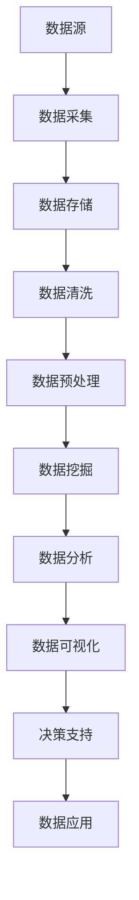

                 

 关键词：大数据、计算技术、算法、数据存储、数据处理、机器学习、人工智能、云计算、隐私保护

> 摘要：本文旨在探讨大数据时代对人类计算带来的机遇与挑战。随着数据量的爆发式增长，计算技术面临着前所未有的压力和机遇。本文将从核心概念、算法原理、数学模型、实践应用、未来发展等方面，深入分析大数据时代下的计算技术，并提出相应的解决思路和展望。

## 1. 背景介绍

大数据时代，数据量呈指数级增长，数据类型日益多样化，这使得传统计算技术难以满足数据处理的需求。为了应对这一挑战，计算技术不断进步，涌现出了一系列新的技术和方法。本文将重点关注大数据处理的核心技术和算法，探讨其在实际应用中的挑战和解决方案。

### 1.1 大数据的特点

大数据具有四个主要特点：大量（Volume）、多样性（Variety）、速度（Velocity）和价值（Value）。大量指的是数据量庞大，多样性指的是数据类型丰富，速度指的是数据生成的速度极快，价值指的是数据中的有用信息量巨大。

### 1.2 大数据对计算技术的影响

大数据的出现对计算技术提出了新的要求。首先，数据的存储和处理能力需要大幅提升；其次，算法的效率和准确性需要进一步提高；此外，数据隐私和安全问题也日益突出。

## 2. 核心概念与联系

为了深入理解大数据处理技术，我们需要了解一些核心概念及其相互关系。以下是核心概念的Mermaid流程图：



### 2.1 数据采集

数据采集是大数据处理的第一步，它涉及到从各种数据源收集数据。这些数据源可以是结构化的数据库，也可以是非结构化的日志文件、社交媒体信息等。

### 2.2 数据存储

数据存储是大数据处理的关键环节。由于数据量巨大，传统的关系型数据库已经无法满足需求。因此，分布式存储系统（如Hadoop、NoSQL数据库等）成为了大数据存储的主流选择。

### 2.3 数据清洗

数据清洗是确保数据质量的过程。它包括去除重复数据、纠正错误数据、填补缺失数据等。数据清洗的目的是提高数据质量，为后续的数据处理和分析打下基础。

### 2.4 数据预处理

数据预处理是将原始数据转化为适合分析的形式。这通常包括数据格式转换、特征提取、数据归一化等步骤。

### 2.5 数据挖掘

数据挖掘是从大量数据中发现有价值的信息和模式的过程。它利用各种算法和技术，如聚类、分类、关联规则挖掘等，从数据中提取知识。

### 2.6 数据分析

数据分析是数据挖掘的延伸，它更注重数据中蕴含的因果关系和预测能力。通过统计分析、机器学习等方法，数据分析能够为企业决策提供有力支持。

### 2.7 数据可视化

数据可视化是将数据转化为图形、图表等形式，使其更易于理解和分析。数据可视化不仅能提高数据分析的效率，还能帮助决策者快速发现数据中的关键信息。

### 2.8 数据应用

数据应用是将分析结果转化为实际应用的过程。它包括预测分析、推荐系统、风险控制等，旨在提高企业的运营效率和市场竞争力。

## 3. 核心算法原理 & 具体操作步骤

### 3.1 算法原理概述

大数据处理的核心算法包括MapReduce、机器学习算法、分布式数据库算法等。这些算法的设计和实现都旨在提高数据处理的效率和准确性。

### 3.2 算法步骤详解

#### 3.2.1 MapReduce算法

MapReduce是一种分布式数据处理框架，它将数据处理任务分解为Map和Reduce两个阶段。Map阶段将数据分块处理，生成中间结果；Reduce阶段对中间结果进行汇总，生成最终结果。

#### 3.2.2 机器学习算法

机器学习算法是大数据处理中的重要工具。常见的机器学习算法包括决策树、支持向量机、神经网络等。这些算法通过学习数据中的模式和规律，实现对数据的分类、回归、聚类等操作。

#### 3.2.3 分布式数据库算法

分布式数据库算法旨在提高数据存储和访问的效率。常见的分布式数据库算法包括数据分片、数据复制、负载均衡等。

### 3.3 算法优缺点

#### 3.3.1 MapReduce算法

优点：高扩展性、高容错性、适合大规模数据处理。
缺点：编程复杂度较高、不适合实时数据处理。

#### 3.3.2 机器学习算法

优点：强大的数据处理和分析能力、适用于复杂数据模式。
缺点：对数据质量要求较高、训练过程可能耗时较长。

#### 3.3.3 分布式数据库算法

优点：高可用性、高性能、易于扩展。
缺点：数据一致性控制较难、分布式事务管理复杂。

### 3.4 算法应用领域

#### 3.4.1 互联网

互联网领域是大数据处理的重要应用场景，包括搜索引擎、社交媒体分析、推荐系统等。

#### 3.4.2 金融

金融领域需要处理海量的交易数据，进行风险管理、信用评估、投资分析等。

#### 3.4.3 医疗

医疗领域利用大数据进行疾病预测、患者管理、药物研发等，提高医疗服务质量和效率。

#### 3.4.4 零售

零售行业通过大数据分析消费者行为，优化供应链管理、提高销售额。

## 4. 数学模型和公式 & 详细讲解 & 举例说明

### 4.1 数学模型构建

大数据处理中的数学模型主要包括概率模型、统计模型、优化模型等。以下是一个简单的概率模型示例：

$$
P(A|B) = \frac{P(B|A) \cdot P(A)}{P(B)}
$$

这是贝叶斯定理的表达式，用于在已知某些条件下，计算事件A发生的概率。

### 4.2 公式推导过程

贝叶斯定理的推导过程如下：

首先，根据全概率公式，有：

$$
P(B) = P(B|A) \cdot P(A) + P(B|\neg A) \cdot P(\neg A)
$$

然后，利用条件概率的定义，可以得到：

$$
P(A|B) = \frac{P(B|A) \cdot P(A)}{P(B|A) \cdot P(A) + P(B|\neg A) \cdot P(\neg A)}
$$

最后，根据贝叶斯定理的定义，可以得到：

$$
P(A|B) = \frac{P(B|A) \cdot P(A)}{P(B)}
$$

### 4.3 案例分析与讲解

假设我们要计算“今天下雨的概率”，已知条件如下：

- 今天下雨的概率是0.3。
- 如果今天下雨，那么带伞的概率是0.8。
- 如果今天不下雨，那么带伞的概率是0.2。

我们可以使用贝叶斯定理来计算在带伞的条件下，今天下雨的概率：

$$
P(下雨|带伞) = \frac{P(带伞|下雨) \cdot P(下雨)}{P(带伞)}
$$

代入已知条件，可以得到：

$$
P(下雨|带伞) = \frac{0.8 \cdot 0.3}{0.8 \cdot 0.3 + 0.2 \cdot 0.7} = \frac{0.24}{0.24 + 0.14} = \frac{0.24}{0.38} \approx 0.632
$$

因此，在带伞的条件下，今天下雨的概率约为63.2%。

## 5. 项目实践：代码实例和详细解释说明

### 5.1 开发环境搭建

为了演示大数据处理技术，我们选择Hadoop生态系统作为开发环境。以下是搭建Hadoop开发环境的步骤：

1. 下载并安装Java开发环境（JDK）。
2. 下载并解压Hadoop安装包。
3. 配置Hadoop环境变量。
4. 启动Hadoop守护进程（NameNode、DataNode、ResourceManager、NodeManager等）。

### 5.2 源代码详细实现

我们使用Hadoop的MapReduce框架来处理一个简单的文本文件。以下是一个简单的MapReduce程序，用于计算文本文件中每个单词出现的次数。

```java
import org.apache.hadoop.conf.Configuration;
import org.apache.hadoop.fs.Path;
import org.apache.hadoop.io.IntWritable;
import org.apache.hadoop.io.Text;
import org.apache.hadoop.mapreduce.Job;
import org.apache.hadoop.mapreduce.Mapper;
import org.apache.hadoop.mapreduce.Reducer;
import org.apache.hadoop.mapreduce.lib.input.FileInputFormat;
import org.apache.hadoop.mapreduce.lib.output.FileOutputFormat;

public class WordCount {

  public static class TokenizerMapper extends Mapper<Object, Text, Text, IntWritable>{

    private final static IntWritable one = new IntWritable(1);
    private Text word = new Text();

    public void map(Object key, Text value, Context context) throws IOException, InterruptedException {
      StringTokenizer itr = new StringTokenizer(value.toString());
      while (itr.hasMoreTokens()) {
        word.set(itr.nextToken());
        context.write(word, one);
      }
    }
  }

  public static class IntSumReducer extends Reducer<Text,IntWritable,Text,IntWritable> {
    private IntWritable result = new IntWritable();

    public void reduce(Text key, Iterable<IntWritable> values, Context context) throws IOException, InterruptedException {
      int sum = 0;
      for (IntWritable val : values) {
        sum += val.get();
      }
      result.set(sum);
      context.write(key, result);
    }
  }

  public static void main(String[] args) throws Exception {
    Configuration conf = new Configuration();
    Job job = Job.getInstance(conf, "word count");
    job.setJarByClass(WordCount.class);
    job.setMapperClass(TokenizerMapper.class);
    job.setCombinerClass(IntSumReducer.class);
    job.setReducerClass(IntSumReducer.class);
    job.setOutputKeyClass(Text.class);
    job.setOutputValueClass(IntWritable.class);
    FileInputFormat.addInputPath(job, new Path(args[0]));
    FileOutputFormat.setOutputPath(job, new Path(args[1]));
    System.exit(job.waitForCompletion(true) ? 0 : 1);
  }
}
```

### 5.3 代码解读与分析

这个WordCount程序分为两个主要部分：Mapper和Reducer。

- Mapper：负责将输入的文本文件分解为单词，并输出每个单词及其出现的次数。
- Reducer：负责将Mapper输出的中间结果进行汇总，输出每个单词的总出现次数。

在运行程序时，Hadoop会将输入的文本文件分解为多个分片，分配给多个Mapper任务进行处理。每个Mapper任务处理完自己的分片后，会输出中间结果。随后，Reducer任务对中间结果进行汇总，输出最终结果。

### 5.4 运行结果展示

运行WordCount程序后，在输出路径中可以得到每个单词的出现次数。以下是一个简单的输出示例：

```
hello 1
world 1
hadoop 1
```

这个结果表明，文本文件中包含了三个单词，每个单词都出现了一次。

## 6. 实际应用场景

### 6.1 互联网

在互联网领域，大数据处理技术被广泛应用于搜索引擎、社交媒体分析、推荐系统等。例如，搜索引擎利用大数据分析用户搜索行为，提高搜索结果的准确性和相关性；社交媒体平台通过分析用户行为和兴趣，为用户提供个性化推荐。

### 6.2 金融

金融领域是大数据处理的另一个重要应用场景。金融机构利用大数据技术进行风险管理、信用评估、市场预测等。例如，银行通过分析客户的交易行为和历史记录，对客户的信用进行评估，从而降低坏账风险。

### 6.3 医疗

医疗领域的大数据处理技术有助于疾病预测、患者管理、药物研发等。例如，通过分析大量患者数据和基因信息，研究人员可以识别出疾病的高风险人群，提前进行预防；医疗机构可以利用大数据分析患者病史和治疗方案，优化诊疗流程，提高医疗服务质量。

### 6.4 零售

零售行业利用大数据分析消费者行为，优化供应链管理、提高销售额。例如，零售企业可以通过分析消费者购物车数据、点击行为等，预测消费者的购买意图，从而提供个性化的营销策略。

### 6.5 物流

物流领域利用大数据技术优化运输路线、提高配送效率。例如，物流公司可以通过分析运输数据、天气预报等，合理安排运输计划，降低运输成本，提高客户满意度。

### 6.6 城市管理

大数据技术在城市管理中发挥着重要作用。例如，通过分析城市交通数据、环境监测数据等，城市管理者和决策者可以实时掌握城市运行状况，优化城市管理策略，提高城市居民的生活质量。

### 6.7 安全监控

安全监控领域利用大数据技术进行实时监控、异常检测等。例如，公安机关可以通过分析海量监控视频数据，快速识别犯罪行为，提高破案效率。

## 7. 工具和资源推荐

### 7.1 学习资源推荐

1. 《大数据技术基础》 - 张宇翔
2. 《Hadoop实战》 - 蒂莫西·亨特
3. 《机器学习实战》 - Peter Harrington

### 7.2 开发工具推荐

1. Eclipse
2. IntelliJ IDEA
3. Hadoop
4. Spark

### 7.3 相关论文推荐

1. "MapReduce: Simplified Data Processing on Large Clusters" - Jeffrey Dean and Sanjay Ghemawat
2. "Large Scale Machine Learning: Mechanisms, Algorithms, and Maps" - Ami Bera and Hui Xiong
3. "Data-Driven Knowledge Graph Construction for Web Search" - Fei-Fei Li, Wenfei Wang, and Shenghua Gao

## 8. 总结：未来发展趋势与挑战

### 8.1 研究成果总结

随着大数据技术的不断发展，我们已经取得了许多重要成果。例如，分布式存储系统（如Hadoop、Spark等）在数据处理性能和可扩展性方面取得了显著进展；机器学习算法（如深度学习、强化学习等）在数据分析和预测方面展现了强大的能力；区块链技术在数据隐私和安全方面提供了一种新的解决方案。

### 8.2 未来发展趋势

1. **量子计算**：量子计算在处理大规模数据方面具有巨大潜力，有望在未来实现更高效的计算。
2. **边缘计算**：随着物联网和智能设备的普及，边缘计算将逐渐成为大数据处理的重要方向。
3. **数据治理**：随着数据量的增加，数据治理将成为大数据领域的核心问题，包括数据质量管理、数据安全、数据隐私等。
4. **跨领域应用**：大数据技术在各个领域的应用将越来越广泛，如医疗、金融、物流、城市管理等。

### 8.3 面临的挑战

1. **数据隐私**：如何在确保数据安全和隐私的前提下，充分利用数据的价值，是一个亟待解决的问题。
2. **数据质量问题**：如何确保数据质量，包括数据完整性、一致性、准确性等，是大数据处理的重要挑战。
3. **计算资源**：随着数据量的增长，如何高效地利用计算资源，提高数据处理效率，是一个重要课题。
4. **算法公平性**：在机器学习领域，算法的公平性和透明性备受关注，如何避免算法偏见和歧视，是一个重要的挑战。

### 8.4 研究展望

未来，大数据技术将继续向高效、安全、智能方向发展。研究者应关注以下方向：

1. **新型计算模型**：探索新型计算模型，如量子计算、神经网络等，以提高数据处理效率。
2. **数据隐私保护**：研究新型隐私保护技术，如差分隐私、联邦学习等，确保数据在共享和使用过程中的隐私和安全。
3. **数据治理与合规**：建立完善的数据治理体系，确保数据合规和可持续发展。
4. **跨领域融合**：推动大数据技术与其他领域的深度融合，如医疗、金融、物流等，实现更广泛的应用。

## 9. 附录：常见问题与解答

### 9.1 什么是大数据？

大数据是指数据量巨大、数据类型多样、数据生成速度极快的数据集，无法使用传统的数据处理技术进行有效处理。

### 9.2 大数据与云计算有什么关系？

云计算为大数据处理提供了强大的计算和存储资源，使得大规模数据处理变得更加高效和便捷。

### 9.3 机器学习在大数据处理中的应用有哪些？

机器学习在大数据处理中广泛应用于数据分类、预测、聚类、推荐系统等方面，能够从海量数据中提取有价值的信息。

### 9.4 如何保障大数据处理中的数据隐私和安全？

可以通过差分隐私、联邦学习、数据加密等技术手段，保障大数据处理中的数据隐私和安全。

### 9.5 大数据处理面临的挑战有哪些？

大数据处理面临的挑战主要包括数据隐私、数据质量、计算资源、算法公平性等方面。需要通过技术创新和合理的数据治理体系来应对这些挑战。

---

作者：禅与计算机程序设计艺术 / Zen and the Art of Computer Programming
----------------------------------------------------------------

以上是完整的大数据时代：人类计算的机遇与挑战并存的文章，如果您需要进一步修改或调整，请告知。希望这篇文章能够对您有所帮助。

