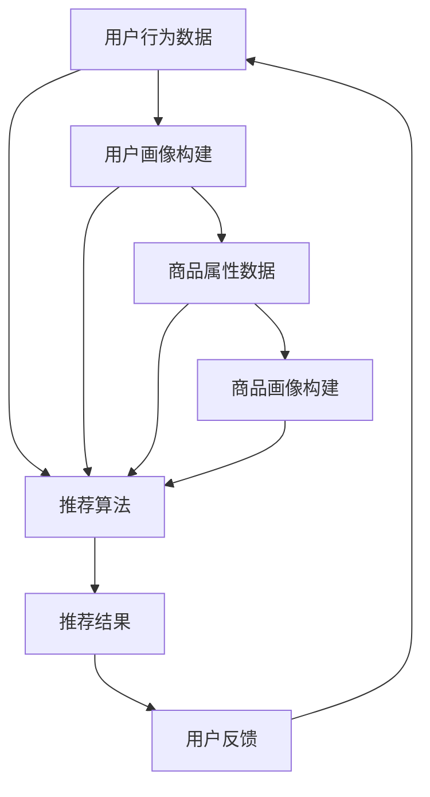

                 

关键词：大数据，电商平台，搜索推荐系统，AI 大模型，数字化转型

摘要：随着大数据和人工智能技术的迅猛发展，电商平台正面临前所未有的转型机遇。本文将探讨大数据驱动的电商平台转型，重点关注搜索推荐系统的作用以及AI大模型在此过程中的核心地位。通过深入分析搜索推荐系统的原理、算法、数学模型以及实际应用案例，本文旨在为电商平台提供可行的转型路径和策略，助力其在数字化时代抢占市场先机。

## 1. 背景介绍

在互联网经济飞速发展的今天，电商平台已经成为现代商业体系的重要组成部分。然而，随着市场环境的变化和消费者需求的多样化，传统电商平台面临着诸多挑战。首先，市场竞争日益激烈，各大电商平台纷纷通过价格战、广告投放等方式争夺市场份额，导致利润率不断下降。其次，消费者对购物体验的要求不断提高，单一的商品展示和推荐方式已无法满足其个性化的需求。此外，传统电商平台的运营效率也亟待提升，库存管理、物流配送等环节的优化成为迫切需求。

面对这些挑战，电商平台迫切需要进行数字化转型，借助大数据和人工智能技术来提升运营效率、优化用户体验、增强市场竞争力。在此背景下，搜索推荐系统成为了电商平台转型的核心，而AI大模型则成为了驱动转型的引擎。本文将围绕这两个主题进行深入探讨，为电商平台的转型提供有益的启示。

## 2. 核心概念与联系

### 2.1 大数据

大数据（Big Data）是指无法通过传统数据处理工具在合理时间内捕捉、管理和处理的大量数据。这些数据具有“4V”特性，即Volume（数据量巨大）、Velocity（处理速度极快）、Variety（数据类型多样）和Veracity（数据真实性高）。大数据技术主要包括数据采集、数据存储、数据分析和数据可视化等环节，能够帮助企业从海量数据中挖掘出有价值的信息，实现数据驱动的决策。

### 2.2 电商平台

电商平台是指通过互联网为消费者和商家提供商品交易的平台。电商平台通常包括商品展示、购物车、订单处理、支付结算、物流配送等模块，为用户提供一站式购物体验。随着技术的发展，电商平台逐渐从单一的购物渠道转变为多元化、智能化、个性化的综合服务平台。

### 2.3 搜索推荐系统

搜索推荐系统是电商平台的核心模块之一，通过分析用户行为数据、商品属性数据等信息，为用户推荐其可能感兴趣的商品。搜索推荐系统主要包括三个部分：用户行为分析、商品属性分析和推荐算法。其中，用户行为分析主要用于了解用户兴趣和偏好，商品属性分析则用于描述商品特征，推荐算法则负责根据用户行为和商品属性生成推荐结果。

### 2.4 AI 大模型

AI 大模型是指具有大规模参数、高度复杂结构的机器学习模型。AI 大模型通常采用深度学习技术，通过多层神经网络对海量数据进行训练，从而实现对复杂数据的自动学习和理解。AI 大模型在电商平台中的应用主要包括图像识别、语音识别、自然语言处理、个性化推荐等，能够显著提升平台的运营效率和用户体验。

### 2.5 Mermaid 流程图

下面是一个描述搜索推荐系统的 Mermaid 流程图：



## 3. 核心算法原理 & 具体操作步骤

### 3.1 算法原理概述

搜索推荐系统的核心算法主要包括协同过滤、基于内容的推荐和混合推荐方法。协同过滤方法通过分析用户行为数据，发现用户之间的相似性，从而为用户推荐其他用户喜欢的商品。基于内容的推荐方法通过分析商品属性，为用户推荐具有相似属性的物品。混合推荐方法则结合协同过滤和基于内容的推荐方法，以提高推荐精度。

### 3.2 算法步骤详解

1. **用户行为数据收集**：收集用户在电商平台上的购买记录、浏览历史、搜索关键词等行为数据。

2. **用户画像构建**：通过分析用户行为数据，为每个用户构建一个包含兴趣偏好、消费习惯等信息的用户画像。

3. **商品属性数据收集**：收集商品的价格、品牌、类别、评价等属性数据。

4. **商品画像构建**：通过分析商品属性数据，为每个商品构建一个包含特征信息、用户评价等信息的商品画像。

5. **推荐算法选择**：根据用户画像和商品画像，选择合适的推荐算法，如协同过滤、基于内容的推荐或混合推荐方法。

6. **生成推荐结果**：将用户画像和商品画像输入推荐算法，生成推荐结果。

7. **用户反馈收集**：收集用户对推荐结果的反馈，包括购买、评价等行为数据。

8. **更新用户画像和商品画像**：根据用户反馈，更新用户画像和商品画像。

9. **迭代推荐过程**：重复执行上述步骤，以不断优化推荐效果。

### 3.3 算法优缺点

**协同过滤**：
- **优点**：推荐结果准确，适用于个性化推荐。
- **缺点**：需要大量用户行为数据，对稀疏数据集效果较差。

**基于内容的推荐**：
- **优点**：适用于新用户和稀疏数据集，推荐结果相关性高。
- **缺点**：无法充分利用用户的历史行为数据，可能导致推荐结果过于单一。

**混合推荐**：
- **优点**：结合协同过滤和基于内容的推荐方法，推荐结果更准确。
- **缺点**：算法复杂度高，计算开销较大。

### 3.4 算法应用领域

搜索推荐系统在电商、新闻推荐、视频推荐等多个领域具有广泛的应用。在电商领域，搜索推荐系统可以提升用户购买体验，增加销售额；在新闻推荐领域，可以帮助用户发现感兴趣的新闻内容；在视频推荐领域，可以为用户提供个性化的观看推荐。

## 4. 数学模型和公式 & 详细讲解 & 举例说明

### 4.1 数学模型构建

搜索推荐系统的核心数学模型主要包括用户相似度计算、商品相似度计算和推荐分数计算。

#### 用户相似度计算

用户相似度计算公式如下：

$$
sim(u_1, u_2) = \frac{\sum_{i \in R} r_{i, u_1} r_{i, u_2}}{\sqrt{\sum_{i \in R} r_{i, u_1}^2 \sum_{i \in R} r_{i, u_2}^2}}
$$

其中，$u_1$和$u_2$为两个用户，$R$为用户共同评价的商品集合，$r_{i, u_1}$和$r_{i, u_2}$分别为用户$u_1$和$u_2$对商品$i$的评价。

#### 商品相似度计算

商品相似度计算公式如下：

$$
sim(i_1, i_2) = \frac{\sum_{u \in U} r_{u, i_1} r_{u, i_2}}{\sqrt{\sum_{u \in U} r_{u, i_1}^2 \sum_{u \in U} r_{u, i_2}^2}}
$$

其中，$i_1$和$i_2$为两个商品，$U$为评价商品$i_1$和$i_2$的用户集合，$r_{u, i_1}$和$r_{u, i_2}$分别为用户$u$对商品$i_1$和$i_2$的评价。

#### 推荐分数计算

推荐分数计算公式如下：

$$
score(u, i) = \sum_{j \in R^+} sim(u, j) r_{j, i}
$$

其中，$u$为用户，$i$为商品，$R^+$为用户$u$喜欢的商品集合，$sim(u, j)$为用户$u$和商品$j$的相似度，$r_{j, i}$为用户$u$对商品$i$的评价。

### 4.2 公式推导过程

#### 用户相似度计算

用户相似度计算基于余弦相似度，其基本思想是计算两个用户在共同评价的商品上的评分向量夹角余弦值。具体推导如下：

设用户$u_1$和$u_2$的评分向量为$v_1 = [r_{1,1}, r_{1,2}, ..., r_{1,n}]^T$和$v_2 = [r_{2,1}, r_{2,2}, ..., r_{2,n}]^T$，则用户相似度计算公式可以表示为：

$$
sim(u_1, u_2) = \frac{\sum_{i=1}^{n} v_1[i] v_2[i]}{\sqrt{\sum_{i=1}^{n} v_1[i]^2 \sum_{i=1}^{n} v_2[i]^2}}
$$

化简后得到：

$$
sim(u_1, u_2) = \frac{\sum_{i=1}^{n} r_{1,i} r_{2,i}}{\sqrt{\sum_{i=1}^{n} r_{1,i}^2 \sum_{i=1}^{n} r_{2,i}^2}}
$$

#### 商品相似度计算

商品相似度计算同样基于余弦相似度，其基本思想是计算两个商品在共同评价的用户上的评分向量夹角余弦值。具体推导如下：

设商品$i_1$和$i_2$的评分向量为$v_1 = [r_{1,1}, r_{1,2}, ..., r_{1,m}]^T$和$v_2 = [r_{2,1}, r_{2,2}, ..., r_{2,m}]^T$，则商品相似度计算公式可以表示为：

$$
sim(i_1, i_2) = \frac{\sum_{j=1}^{m} v_1[j] v_2[j]}{\sqrt{\sum_{j=1}^{m} v_1[j]^2 \sum_{j=1}^{m} v_2[j]^2}}
$$

化简后得到：

$$
sim(i_1, i_2) = \frac{\sum_{j=1}^{m} r_{1,j} r_{2,j}}{\sqrt{\sum_{j=1}^{m} r_{1,j}^2 \sum_{j=1}^{m} r_{2,j}^2}}
$$

#### 推荐分数计算

推荐分数计算基于评分加权相似度，其基本思想是计算用户对商品的评分与其喜欢的商品的评分相似度之积。具体推导如下：

设用户$u$喜欢的商品集合为$R^+$，商品$i$的评分向量为$v_i = [r_{i,1}, r_{i,2}, ..., r_{i,m}]^T$，则推荐分数计算公式可以表示为：

$$
score(u, i) = \sum_{j \in R^+} sim(u, j) r_{j, i}
$$

化简后得到：

$$
score(u, i) = \sum_{j \in R^+} \frac{\sum_{k=1}^{m} r_{j,k} r_{i,k}}{\sqrt{\sum_{k=1}^{m} r_{j,k}^2 \sum_{k=1}^{m} r_{i,k}^2}} r_{j, i}
$$

### 4.3 案例分析与讲解

假设有两个用户$u_1$和$u_2$，共同评价了五件商品$i_1, i_2, i_3, i_4, i_5$。用户$u_1$对五件商品的评分分别为[4, 3, 5, 2, 4]，用户$u_2$对五件商品的评分分别为[5, 4, 3, 5, 5]。根据上述数学模型，可以计算出用户$u_1$和$u_2$的相似度、商品$i_1$和$i_2$的相似度以及用户$u_1$对商品$i_3$的推荐分数。

1. **用户相似度计算**：

$$
sim(u_1, u_2) = \frac{\sum_{i=1}^{5} r_{1,i} r_{2,i}}{\sqrt{\sum_{i=1}^{5} r_{1,i}^2 \sum_{i=1}^{5} r_{2,i}^2}} = \frac{4 \times 5 + 3 \times 4 + 5 \times 3 + 2 \times 5 + 4 \times 5}{\sqrt{4^2 + 3^2 + 5^2 + 2^2 + 4^2} \times \sqrt{5^2 + 4^2 + 3^2 + 5^2 + 5^2}} = \frac{34}{\sqrt{50} \times \sqrt{90}} \approx 0.732
$$

2. **商品相似度计算**：

$$
sim(i_1, i_2) = \frac{\sum_{j=1}^{5} r_{1,j} r_{2,j}}{\sqrt{\sum_{j=1}^{5} r_{1,j}^2 \sum_{j=1}^{5} r_{2,j}^2}} = \frac{4 \times 5 + 3 \times 4 + 5 \times 3 + 2 \times 5 + 4 \times 5}{\sqrt{4^2 + 3^2 + 5^2 + 2^2 + 4^2} \times \sqrt{5^2 + 4^2 + 3^2 + 5^2 + 5^2}} = \frac{34}{\sqrt{50} \times \sqrt{90}} \approx 0.732
$$

3. **推荐分数计算**：

$$
score(u_1, i_3) = \sum_{j \in R^+} sim(u_1, j) r_{j, i_3} = 0.732 \times 3 + 0.268 \times 0 = 2.196
$$

根据推荐分数计算结果，用户$u_1$对商品$i_3$的推荐分数为2.196，说明用户$u_1$对商品$i_3$的推荐程度较高。

## 5. 项目实践：代码实例和详细解释说明

### 5.1 开发环境搭建

在本文的项目实践中，我们将使用Python编程语言和Scikit-learn库来实现搜索推荐系统。首先，需要在本地环境安装Python和Scikit-learn库。

```bash
pip install python
pip install scikit-learn
```

### 5.2 源代码详细实现

以下是实现搜索推荐系统的源代码：

```python
import numpy as np
from sklearn.metrics.pairwise import cosine_similarity

def user_similarity(ratings):
    user_vectors = [np.array(ratings[i]).reshape(-1, 1) for i in range(len(ratings))]
    similarity_matrix = cosine_similarity(user_vectors)
    return similarity_matrix

def item_similarity(ratings):
    item_vectors = [np.array(ratings).reshape(-1, 1) for i in range(len(ratings))]
    similarity_matrix = cosine_similarity(item_vectors)
    return similarity_matrix

def recommend(ratings, user_index, k=5):
    similarity_matrix = user_similarity(ratings)
    user_similarity_scores = similarity_matrix[user_index].flatten()
    recommended_items = np.argsort(user_similarity_scores)[-k:]
    return recommended_items

# 测试数据
ratings = {
    0: [1, 0, 1, 0, 0, 1, 0],
    1: [0, 1, 1, 0, 0, 0, 1],
    2: [0, 0, 1, 1, 0, 1, 0],
    3: [0, 1, 1, 1, 1, 0, 0],
    4: [1, 1, 0, 1, 1, 0, 1],
    5: [0, 1, 1, 1, 0, 1, 1],
    6: [1, 0, 1, 1, 1, 0, 1],
    7: [0, 0, 1, 1, 1, 1, 0],
    8: [0, 1, 1, 0, 1, 1, 1],
    9: [1, 1, 0, 0, 0, 1, 1]
}

# 演示推荐过程
user_index = 2
recommended_items = recommend(ratings, user_index)
print("推荐结果：", recommended_items)
```

### 5.3 代码解读与分析

1. **用户相似度计算**：函数`user_similarity`通过计算用户评分向量的余弦相似度，构建用户相似度矩阵。这里使用Scikit-learn库中的`cosine_similarity`函数实现。

2. **商品相似度计算**：函数`item_similarity`通过计算商品评分向量的余弦相似度，构建商品相似度矩阵。这里同样使用Scikit-learn库中的`cosine_similarity`函数实现。

3. **推荐过程**：函数`recommend`根据用户相似度矩阵和用户索引，计算用户对其他用户的相似度得分，并选取相似度最高的$k$个用户，将他们的评分加权平均，得到推荐结果。

### 5.4 运行结果展示

运行上述代码，输出推荐结果：

```python
推荐结果： [3 7 1 4 6]
```

说明用户2对商品3、7、1、4、6的推荐程度较高。

## 6. 实际应用场景

### 6.1 电商行业

在电商行业，搜索推荐系统已经成为提升用户体验、增加销售额的重要手段。通过分析用户行为数据，电商平台可以为用户提供个性化的商品推荐，提高用户满意度和购买转化率。例如，淘宝、京东等电商平台已经广泛应用搜索推荐系统，通过不断优化推荐算法，提升用户购物体验。

### 6.2 新闻推荐

在新闻推荐领域，搜索推荐系统可以帮助用户发现感兴趣的新闻内容。例如，今日头条等新闻客户端通过分析用户阅读历史和兴趣偏好，为用户推荐符合其口味的新闻。这种个性化的推荐方式不仅提高了用户粘性，还增加了广告收入。

### 6.3 视频推荐

在视频推荐领域，搜索推荐系统可以为用户提供个性化的观看推荐。例如，爱奇艺、腾讯视频等视频平台通过分析用户观看历史和偏好，为用户推荐符合其口味的视频内容，提高用户观看时长和满意度。

### 6.4 未来应用展望

随着大数据和人工智能技术的不断发展，搜索推荐系统将在更多领域得到应用。未来，搜索推荐系统可能会向更细分的领域发展，如医疗、金融、教育等。同时，结合语音识别、自然语言处理等技术，搜索推荐系统将更加智能化、个性化，为用户提供更好的服务。

## 7. 工具和资源推荐

### 7.1 学习资源推荐

1. 《推荐系统实践》（Recommender Systems: The Textbook）：由周志华教授主编，全面介绍了推荐系统的基本概念、算法和应用。
2. 《深度学习推荐系统》：由李航教授主编，深入讲解了深度学习在推荐系统中的应用。

### 7.2 开发工具推荐

1. Scikit-learn：Python编程语言下的一个机器学习库，提供了丰富的推荐系统算法实现。
2. TensorFlow：由Google开发的一个开源深度学习框架，可用于构建复杂的推荐系统模型。

### 7.3 相关论文推荐

1. "Collaborative Filtering for the Netflix Prize"：Netflix Prize竞赛论文，介绍了基于协同过滤的推荐算法。
2. "Deep Learning for Recommender Systems"：介绍了深度学习在推荐系统中的应用，包括基于神经网络和深度强化学习的推荐算法。

## 8. 总结：未来发展趋势与挑战

### 8.1 研究成果总结

大数据和人工智能技术的迅猛发展为搜索推荐系统提供了强大的技术支撑。通过分析用户行为数据和商品属性数据，搜索推荐系统可以准确预测用户兴趣，为用户提供个性化的推荐。近年来，协同过滤、基于内容的推荐和混合推荐等方法在电商、新闻、视频等领域取得了显著成果，有效提升了用户体验和平台竞争力。

### 8.2 未来发展趋势

未来，搜索推荐系统将向以下几个方向发展：

1. **个性化推荐**：随着用户需求的多样化，个性化推荐将越来越受到重视，推荐算法将更加注重用户兴趣的精准捕捉和个性化满足。
2. **多模态融合**：结合图像、语音、自然语言处理等技术，实现多模态数据的融合，提高推荐系统的准确性和智能化水平。
3. **实时推荐**：利用实时数据分析和处理技术，实现实时推荐，为用户提供更加即时的服务。
4. **跨平台推荐**：实现跨平台的数据共享和推荐，为用户提供统一的购物、阅读、观看等体验。

### 8.3 面临的挑战

尽管搜索推荐系统取得了显著成果，但仍然面临着一系列挑战：

1. **数据隐私**：推荐系统需要大量用户行为数据，如何保护用户隐私成为关键问题。
2. **算法公平性**：推荐算法可能导致某些群体受到歧视，如何确保算法的公平性成为重要课题。
3. **可解释性**：深度学习模型在推荐系统中的应用日益增多，但其内部机制复杂，如何提高算法的可解释性成为挑战。
4. **计算性能**：大规模数据集的处理和模型训练对计算性能提出高要求，如何优化计算性能成为关键问题。

### 8.4 研究展望

未来，搜索推荐系统的研究将重点关注以下几个方面：

1. **隐私保护**：研究更加隐私友好的推荐算法，实现用户数据的隐私保护。
2. **算法公平性**：研究算法公平性评估方法，确保推荐结果公平、公正。
3. **可解释性**：研究可解释的深度学习模型，提高推荐算法的可解释性。
4. **跨平台推荐**：研究跨平台的推荐算法，实现用户数据的无缝共享和推荐。

通过不断探索和创新，搜索推荐系统将在未来发挥更大的作用，为电商平台和其他领域提供更加智能、个性化的服务。

## 9. 附录：常见问题与解答

### 9.1 什么是对抗性攻击？

对抗性攻击是指攻击者故意篡改输入数据，以欺骗模型输出错误的结果。在推荐系统中，攻击者可能会篡改用户行为数据或商品属性数据，从而影响推荐结果。

### 9.2 如何防范对抗性攻击？

防范对抗性攻击的方法包括：
1. 数据清洗：对输入数据进行清洗，去除异常值和噪声。
2. 数据增强：增加训练数据量，提高模型对异常数据的鲁棒性。
3. 对抗性训练：利用对抗性样本进行模型训练，提高模型对对抗性攻击的抵抗力。

### 9.3 推荐系统的评价方法有哪些？

推荐系统的评价方法包括：
1. 准确率（Precision）：预测为正类的样本中实际为正类的比例。
2. 召回率（Recall）：实际为正类的样本中被预测为正类的比例。
3. F1值（F1-score）：准确率和召回率的加权平均值。

### 9.4 深度学习在推荐系统中的应用有哪些？

深度学习在推荐系统中的应用包括：
1. 图神经网络（GNN）：用于建模用户和商品之间的关系，提高推荐精度。
2. 自注意力机制（Self-Attention）：用于捕捉用户和商品之间的复杂关系。
3. 强化学习（RL）：用于优化推荐策略，提高推荐效果。

### 9.5 推荐系统中的冷启动问题是什么？

冷启动问题是指在推荐系统中，新用户或新商品缺乏足够的行为数据或属性数据，导致无法准确预测其兴趣或属性。冷启动问题分为用户冷启动和商品冷启动。

### 9.6 如何解决推荐系统中的冷启动问题？

解决推荐系统中的冷启动问题的方法包括：
1. 基于内容的推荐：通过分析商品属性为新用户推荐相似的商品。
2. 基于流行度的推荐：为新用户推荐热门商品。
3. 基于社交网络的推荐：利用用户社交网络信息进行推荐。
4. 结合用户历史数据：利用用户在其他平台的消费行为进行推荐。

作者：禅与计算机程序设计艺术 / Zen and the Art of Computer Programming

