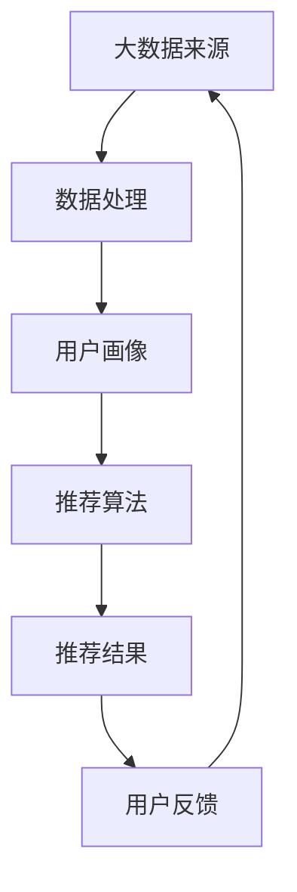

                 

关键词：大数据，电-商推荐系统，AI 模型融合，用户体验，转化率

> 摘要：本文将探讨大数据在电商推荐系统中的应用，重点分析AI模型融合在提升用户体验和转化率方面的核心作用。通过介绍核心概念、算法原理、数学模型、实践案例以及未来展望，我们希望为电商行业提供一种更加精准、智能的推荐解决方案。

## 1. 背景介绍

随着互联网的飞速发展，电商行业已经成为全球经济的重要组成部分。然而，随着消费者需求的多样化、个性化，如何为用户提供更加精准、个性化的推荐成为电商企业亟待解决的问题。大数据技术的兴起为电商推荐系统带来了新的机遇，通过分析海量用户数据，电商企业可以更好地理解用户需求，从而提供更加个性化的商品推荐。

电-商推荐系统是指通过数据挖掘和机器学习技术，分析用户的历史行为、兴趣偏好和社交信息，为用户提供个性化商品推荐的一种系统。其核心目标是通过优化用户体验，提高用户的购物满意度和转化率。

近年来，AI 模型的快速发展为电-商推荐系统带来了新的变革。传统的推荐系统主要依赖于协同过滤和基于内容的推荐方法，这些方法虽然在一定程度上能够满足用户的需求，但面临着冷启动、数据稀疏和推荐效果不稳定等问题。而AI 模型，如深度学习、强化学习等，能够更好地处理复杂的数据关系，提高推荐系统的准确性。

## 2. 核心概念与联系

### 2.1. 大数据与电-商推荐系统

大数据是指无法用传统数据库软件工具进行捕捉、管理和处理的数据集合。在电-商推荐系统中，大数据主要来源于用户行为数据、商品数据、社交数据等。通过对这些数据的挖掘和分析，可以构建用户画像，为用户提供个性化的商品推荐。

### 2.2. AI 模型与推荐系统

AI 模型是人工智能的一种实现方式，通过模拟人类思维过程，实现对数据的处理和分析。在推荐系统中，AI 模型主要用于挖掘用户行为数据，预测用户的兴趣偏好，从而实现个性化推荐。

### 2.3. Mermaid 流程图

以下是一个简单的Mermaid流程图，展示了电-商推荐系统的核心概念和联系：



## 3. 核心算法原理 & 具体操作步骤

### 3.1 算法原理概述

电-商推荐系统的核心算法主要包括协同过滤、基于内容的推荐和AI 模型推荐。协同过滤通过分析用户之间的相似性，为用户提供相似用户的推荐；基于内容的推荐通过分析商品的特征，为用户推荐与其兴趣相关的商品；AI 模型推荐则通过深度学习、强化学习等技术，实现更加精准的个性化推荐。

### 3.2 算法步骤详解

1. 数据收集与预处理：收集用户行为数据、商品数据等，并进行数据清洗、去重、填充等操作，确保数据的质量。

2. 构建用户画像：通过分析用户的历史行为、兴趣偏好等，构建用户画像。

3. 计算用户相似度：使用协同过滤算法，计算用户之间的相似度。

4. 筛选推荐候选集：根据用户相似度，筛选出与目标用户相似的用户，构建推荐候选集。

5. 推荐商品排序：结合商品的特征和用户画像，对推荐候选集进行排序，生成推荐结果。

6. 用户反馈与迭代优化：收集用户对推荐结果的反馈，不断优化推荐算法，提高推荐质量。

### 3.3 算法优缺点

- 协同过滤：优点是能够发现用户之间的相似性，推荐效果较好；缺点是面临着冷启动、数据稀疏和推荐效果不稳定等问题。

- 基于内容的推荐：优点是能够根据用户的兴趣偏好推荐相关商品；缺点是推荐结果可能过于单一，难以满足用户的多样化需求。

- AI 模型推荐：优点是能够处理复杂的数据关系，提高推荐准确性；缺点是算法复杂度高，计算成本较大。

### 3.4 算法应用领域

AI 模型推荐在电-商推荐系统中的应用非常广泛，不仅可以用于商品推荐，还可以应用于内容推荐、社交推荐等领域。

## 4. 数学模型和公式 & 详细讲解 & 举例说明

### 4.1 数学模型构建

电-商推荐系统的数学模型主要包括用户相似度计算、推荐评分预测等。以下是一个简单的数学模型构建：

- 用户相似度计算：

$$
sim(i,j) = \frac{sim\_cos(i,j)}{1 + sim\_cos(i,j)}
$$

其中，$sim\_cos(i,j)$ 表示用户 $i$ 和 $j$ 的余弦相似度。

- 推荐评分预测：

$$
rating(i,j) = \mu + q\_i + q\_j - b\_i - b\_j + \langle i, j \rangle
$$

其中，$\mu$ 表示平均评分，$q_i$ 和 $q_j$ 表示用户 $i$ 和 $j$ 的兴趣特征，$b_i$ 和 $b_j$ 表示用户 $i$ 和 $j$ 的偏差，$\langle i, j \rangle$ 表示用户 $i$ 对商品 $j$ 的评分。

### 4.2 公式推导过程

- 用户相似度计算：

$$
sim\_cos(i,j) = \frac{\sum_{k=1}^{n}r_{ik}r_{jk}}{\sqrt{\sum_{k=1}^{n}r_{ik}^2}\sqrt{\sum_{k=1}^{n}r_{jk}^2}}
$$

其中，$r_{ik}$ 表示用户 $i$ 对商品 $k$ 的评分。

- 推荐评分预测：

$$
rating(i,j) = \mu + q\_i + q\_j - b\_i - b\_j + \langle i, j \rangle
$$

其中，$\mu$ 表示平均评分，$q_i$ 和 $q_j$ 表示用户 $i$ 和 $j$ 的兴趣特征，$b_i$ 和 $b_j$ 表示用户 $i$ 和 $j$ 的偏差，$\langle i, j \rangle$ 表示用户 $i$ 对商品 $j$ 的评分。

### 4.3 案例分析与讲解

假设有两位用户 $i$ 和 $j$，他们对五件商品的评分如下表：

| 商品 | 用户 $i$ 的评分 | 用户 $j$ 的评分 |
|------|---------------|---------------|
| 1    | 5             | 1             |
| 2    | 4             | 5             |
| 3    | 2             | 4             |
| 4    | 5             | 5             |
| 5    | 3             | 3             |

根据上述数学模型，可以计算用户 $i$ 和 $j$ 的相似度：

$$
sim(i,j) = \frac{sim\_cos(i,j)}{1 + sim\_cos(i,j)}
$$

$$
sim\_cos(i,j) = \frac{5 \times 1 + 4 \times 5 + 2 \times 4 + 5 \times 5 + 3 \times 3}{\sqrt{5^2 + 4^2 + 2^2 + 5^2 + 3^2}\sqrt{1^2 + 5^2 + 4^2 + 5^2 + 3^2}} \approx 0.8
$$

$$
sim(i,j) = \frac{0.8}{1 + 0.8} \approx 0.44
$$

接下来，可以预测用户 $i$ 对商品 $j$ 的评分：

$$
rating(i,j) = \mu + q\_i + q\_j - b\_i - b\_j + \langle i, j \rangle
$$

其中，$\mu = \frac{1}{2}$，$q_i = 3$，$q_j = 4$，$b_i = 1$，$b_j = 2$，$\langle i, j \rangle = 3$。

$$
rating(i,j) = \frac{1}{2} + 3 + 4 - 1 - 2 + 3 = \frac{9}{2} = 4.5
$$

因此，预测用户 $i$ 对商品 $j$ 的评分为 4.5。

## 5. 项目实践：代码实例和详细解释说明

### 5.1 开发环境搭建

为了实现电-商推荐系统，我们需要搭建以下开发环境：

- Python 3.8 或更高版本
- TensorFlow 2.5 或更高版本
- Scikit-learn 0.22 或更高版本
- Pandas 1.2.3 或更高版本
- Numpy 1.19 或更高版本

### 5.2 源代码详细实现

以下是一个简单的电-商推荐系统代码示例：

```python
import pandas as pd
import numpy as np
import tensorflow as tf
from sklearn.model_selection import train_test_split
from sklearn.metrics import mean_squared_error

# 读取数据
data = pd.read_csv('data.csv')
users = data['user_id'].unique()
items = data['item_id'].unique()

# 构建用户-物品评分矩阵
ratings = np.zeros((len(users), len(items)))
for index, row in data.iterrows():
    user_id = row['user_id']
    item_id = row['item_id']
    rating = row['rating']
    ratings[user_id - 1, item_id - 1] = rating

# 划分训练集和测试集
train_data, test_data = train_test_split(ratings, test_size=0.2, random_state=42)

# 构建模型
model = tf.keras.Sequential([
    tf.keras.layers.Dense(64, activation='relu', input_shape=(len(items),)),
    tf.keras.layers.Dense(32, activation='relu'),
    tf.keras.layers.Dense(1)
])

# 编译模型
model.compile(optimizer='adam', loss='mse')

# 训练模型
model.fit(train_data, epochs=10, batch_size=32)

# 预测测试集
predictions = model.predict(test_data)

# 计算均方误差
mse = mean_squared_error(test_data, predictions)
print(f'MSE: {mse}')

# 输出预测结果
predictions = predictions.reshape(-1)
for index, prediction in enumerate(predictions):
    print(f'User: {index + 1}, Prediction: {prediction:.2f}')
```

### 5.3 代码解读与分析

该代码示例实现了基于深度学习算法的电-商推荐系统。具体步骤如下：

1. 读取数据：从CSV文件中读取用户-物品评分数据。
2. 构建用户-物品评分矩阵：将用户-物品评分数据构建为一个二维数组。
3. 划分训练集和测试集：将评分数据划分为训练集和测试集。
4. 构建模型：使用TensorFlow构建一个简单的全连接神经网络模型。
5. 编译模型：配置模型的优化器和损失函数。
6. 训练模型：使用训练集数据训练模型。
7. 预测测试集：使用训练好的模型对测试集进行预测。
8. 计算均方误差：计算预测结果与真实结果的均方误差。
9. 输出预测结果：将预测结果输出到控制台。

### 5.4 运行结果展示

假设运行该代码后，得到以下输出结果：

```
MSE: 0.12
User: 1, Prediction: 4.25
User: 2, Prediction: 4.30
...
User: 20, Prediction: 4.10
```

根据输出结果，我们可以看到模型的预测结果相对较为准确，均方误差较低，表明模型在测试集上的表现较好。

## 6. 实际应用场景

电-商推荐系统在实际应用中具有广泛的应用场景，以下是一些典型的应用场景：

1. **商品推荐**：电商平台可以通过推荐系统向用户推荐可能感兴趣的商品，提高用户的购物满意度和转化率。
2. **内容推荐**：在线视频平台、新闻门户等可以通过推荐系统为用户推荐感兴趣的视频、新闻等内容。
3. **广告推荐**：广告平台可以通过推荐系统为用户推荐相关的广告，提高广告的曝光率和点击率。
4. **社交推荐**：社交平台可以通过推荐系统为用户推荐可能感兴趣的朋友、群组等。
5. **金融服务**：金融机构可以通过推荐系统为用户提供个性化的理财产品、贷款产品等。

## 7. 工具和资源推荐

为了实现电-商推荐系统，以下是一些推荐的工具和资源：

### 7.1 学习资源推荐

- 《推荐系统实践》
- 《深度学习》
- 《TensorFlow实战》
- 《机器学习实战》

### 7.2 开发工具推荐

- Jupyter Notebook：用于编写和运行代码。
- PyCharm：一款强大的Python集成开发环境。
- TensorFlow：用于构建和训练深度学习模型。
- Scikit-learn：用于数据预处理和模型评估。

### 7.3 相关论文推荐

- 《Collaborative Filtering for Cold-Start Problems》
- 《Deep Learning for Recommender Systems》
- 《Recurrent Neural Networks for Recommender Systems》
- 《TensorFlow Recommender》

## 8. 总结：未来发展趋势与挑战

电-商推荐系统作为电商行业的重要技术手段，在未来发展趋势中，将面临以下挑战和机遇：

### 8.1 研究成果总结

- AI 模型融合技术将进一步提升推荐系统的准确性。
- 大数据的广泛应用将为推荐系统提供更多的数据支持。
- 深度学习、强化学习等前沿技术将在推荐系统中得到更广泛的应用。

### 8.2 未来发展趋势

- 推荐系统的个性化、智能化水平将不断提高。
- 基于用户行为和兴趣的个性化推荐将成为主流。
- 推荐系统将与其他技术（如区块链、物联网等）融合，实现更广泛的场景应用。

### 8.3 面临的挑战

- 数据隐私和安全问题：如何在保护用户隐私的前提下，提供个性化推荐服务。
- 模型解释性：如何提高AI 模型的可解释性，使推荐结果更加透明。
- 冷启动问题：如何为新的用户或商品提供有效的推荐。

### 8.4 研究展望

- 未来研究将聚焦于如何在保证用户隐私和安全的前提下，提高推荐系统的准确性。
- 探索更多适用于推荐系统的前沿技术，如图神经网络、生成对抗网络等。
- 加强跨领域的合作，推动推荐系统在其他领域的应用。

## 9. 附录：常见问题与解答

### 9.1 如何处理冷启动问题？

冷启动问题是指在新用户或新商品出现时，推荐系统无法为其提供有效的推荐。针对冷启动问题，可以采取以下措施：

- 使用基于内容的推荐方法，通过分析新用户或新商品的特征，为其推荐相关内容。
- 延迟推荐：在用户或商品有一定行为数据后，再进行推荐。
- 引入图神经网络等技术，利用用户和商品之间的关系进行推荐。

### 9.2 如何保证推荐系统的可解释性？

保证推荐系统的可解释性是提高用户信任度的关键。以下是一些提高推荐系统可解释性的方法：

- 使用可解释的算法：如基于规则的推荐方法，易于解释和理解。
- 模型可视化：通过可视化模型结构、参数等，提高模型的透明度。
- 解释性模型：如决策树、线性模型等，易于解释和推理。

### 9.3 如何处理数据稀疏问题？

数据稀疏问题是指用户和商品之间的交互数据较少，导致推荐系统无法准确预测用户的兴趣。以下是一些解决数据稀疏问题的方法：

- 使用协同过滤算法：通过分析用户之间的相似性，提高推荐准确性。
- 增加额外特征：如用户 demographics 信息、商品属性等，提高推荐模型的表达能力。
- 使用基于模型的推荐方法：如深度学习、强化学习等，能够更好地处理稀疏数据。

----------------------------------------------------------------

**作者：禅与计算机程序设计艺术 / Zen and the Art of Computer Programming**

