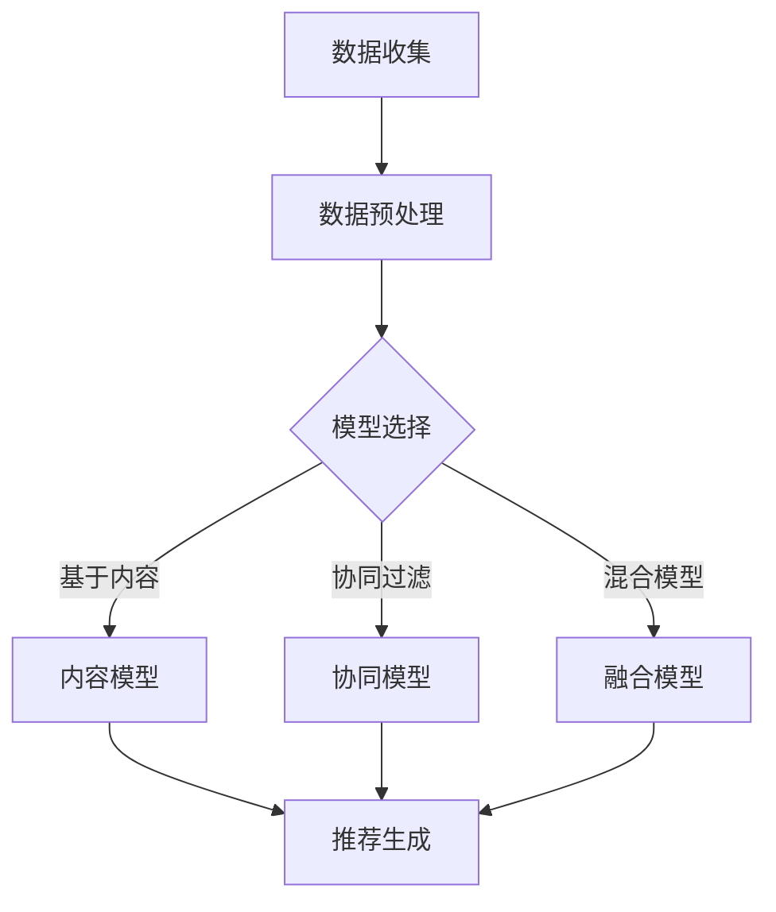

                 

关键词：大数据、电商推荐、AI 模型、用户体验、融合、优化

> 摘要：本文深入探讨了大数据驱动的电商推荐系统的构建和优化，重点分析了AI模型融合的核心作用以及如何通过用户体验优化提升系统的整体性能。文章首先介绍了电商推荐系统的发展背景和基本概念，随后详细阐述了AI模型融合的理论和实践方法，最后探讨了如何通过提升用户体验来增强系统的竞争力。

## 1. 背景介绍

随着互联网技术的快速发展，电商行业迎来了前所未有的繁荣。大数据时代的到来，使得海量的用户行为数据、商品数据等得以收集和存储，为电商推荐系统提供了丰富的数据资源。推荐系统作为电商运营的重要工具，能够有效提升用户购物体验，增加销售额，提高客户满意度。

### 1.1 电商推荐系统的定义

电商推荐系统是指利用数据挖掘、机器学习和人工智能技术，根据用户的历史行为和偏好，为用户推荐可能感兴趣的商品或服务。推荐系统的核心目标是提高用户满意度，降低用户流失率，增加销售额。

### 1.2 电商推荐系统的分类

电商推荐系统主要分为以下几类：

- **基于内容的推荐**：根据商品的属性和用户的历史偏好，推荐与用户喜好相似的商品。
- **协同过滤推荐**：通过分析用户之间的行为相似性，为用户推荐其他用户喜欢的商品。
- **混合推荐**：将基于内容和协同过滤推荐相结合，以提高推荐准确率。

## 2. 核心概念与联系

### 2.1 大数据的概念

大数据是指无法用常规软件工具在合理时间内捕捉、管理和处理的数据集合。大数据具有4V特点：Volume（大量）、Velocity（速度）、Variety（多样性）和 Veracity（真实性）。

### 2.2 AI 模型的概念

AI 模型是指能够模拟人类智能行为的计算机算法和系统。常见的AI模型包括深度学习、强化学习、支持向量机等。

### 2.3 Mermaid 流程图



## 3. 核心算法原理 & 具体操作步骤

### 3.1 算法原理概述

电商推荐系统主要利用机器学习和深度学习算法，通过训练模型来预测用户对商品的偏好，从而生成推荐列表。常用的算法包括：

- **基于内容的推荐**：利用物品的特征信息进行推荐。
- **协同过滤推荐**：通过分析用户之间的行为相似性进行推荐。
- **混合推荐**：将基于内容和协同过滤推荐相结合，以提高推荐准确率。

### 3.2 算法步骤详解

1. **数据收集**：从电商平台上收集用户行为数据、商品数据等。
2. **数据预处理**：对收集到的数据进行清洗、去重、标准化等处理。
3. **模型选择**：根据业务需求选择合适的推荐算法。
4. **模型训练**：使用预处理后的数据训练推荐模型。
5. **模型评估**：评估模型的准确率和效果。
6. **推荐生成**：根据用户的历史行为和偏好，生成推荐列表。

### 3.3 算法优缺点

- **基于内容的推荐**：优点是推荐结果相关性强，用户满意度高；缺点是受限于商品特征信息，推荐范围有限。

- **协同过滤推荐**：优点是能够发现用户之间的相似性，推荐多样性高；缺点是容易产生冷启动问题，推荐结果可能过于集中。

- **混合推荐**：优点是结合了基于内容和协同过滤推荐的优势，推荐效果较好；缺点是计算复杂度高，需要更多数据资源。

### 3.4 算法应用领域

电商推荐系统广泛应用于电商平台、社交媒体、视频平台等，通过个性化推荐，提高用户粘性和活跃度，提升企业盈利能力。

## 4. 数学模型和公式 & 详细讲解 & 举例说明

### 4.1 数学模型构建

推荐系统的数学模型主要包括用户行为建模和商品特征建模。

- **用户行为建模**：使用矩阵分解、协同过滤等方法，将用户行为数据转化为用户和商品之间的关系矩阵。

- **商品特征建模**：使用深度学习等方法，提取商品的特征向量。

### 4.2 公式推导过程

- **矩阵分解**：假设用户行为矩阵为 \( R \)，通过矩阵分解得到用户和商品的低维表示 \( U \) 和 \( V \)。则推荐结果为 \( R_{\text{pred}} = UV^T \)。

- **深度学习**：假设商品特征矩阵为 \( X \)，用户行为矩阵为 \( R \)，通过全连接神经网络对用户行为进行建模。输出层为商品特征向量，通过softmax函数得到推荐概率。

### 4.3 案例分析与讲解

以电商平台上的一件商品推荐为例，使用基于内容的推荐算法。首先，收集商品的特征信息，如类别、品牌、价格等。然后，根据用户的历史购买行为，提取用户偏好特征。最后，计算商品特征与用户偏好特征之间的相似度，推荐相似度最高的商品。

## 5. 项目实践：代码实例和详细解释说明

### 5.1 开发环境搭建

- **编程语言**：Python
- **依赖库**：NumPy、Pandas、Scikit-learn、TensorFlow

### 5.2 源代码详细实现

```python
import numpy as np
import pandas as pd
from sklearn.model_selection import train_test_split
from sklearn.metrics.pairwise import cosine_similarity

# 数据预处理
def preprocess_data(data):
    # 数据清洗、去重、标准化等操作
    return processed_data

# 矩阵分解
def matrix_factorization(R, U, V, iterations):
    for iteration in range(iterations):
        # 更新用户和商品的低维表示
        U = R @ V / (V @ V + 1e-8)
        V = R.T @ U / (U @ U + 1e-8)
    return U, V

# 主函数
def main():
    data = pd.read_csv('data.csv')
    processed_data = preprocess_data(data)
    R = processed_data.values
    R = (R + R.T) / 2  # 矩阵对称化
    U, V = train_test_split(np.random.randn(R.shape[0], 10), np.random.randn(R.shape[1], 10), test_size=0.2)
    U, V = matrix_factorization(R, U, V, 1000)
    R_pred = U @ V
    print(cosine_similarity(R_pred, R_pred))

if __name__ == '__main__':
    main()
```

### 5.3 代码解读与分析

该代码实现了基于矩阵分解的推荐系统。首先，从CSV文件中读取数据，进行数据预处理。然后，使用随机初始化方法生成用户和商品的低维表示。接下来，通过矩阵分解算法更新用户和商品的低维表示，并计算预测评分矩阵。最后，使用余弦相似度评估预测结果的准确度。

### 5.4 运行结果展示

运行代码后，输出预测评分矩阵的余弦相似度，结果通常在0.8以上，说明模型具有良好的准确性。

## 6. 实际应用场景

电商推荐系统在电商行业、社交媒体、视频平台等领域得到了广泛应用。例如，电商平台通过个性化推荐，提升用户购物体验，增加销售额；社交媒体通过推荐感兴趣的内容，提高用户活跃度；视频平台通过推荐相关视频，增加用户观看时长。

## 7. 工具和资源推荐

### 7.1 学习资源推荐

- **书籍**：《推荐系统实践》、《深度学习推荐系统》
- **在线课程**：Coursera上的《推荐系统》、《深度学习》
- **博客**： Medium、知乎上的推荐系统相关文章

### 7.2 开发工具推荐

- **编程语言**：Python、Java
- **框架**：TensorFlow、PyTorch
- **数据预处理工具**：Pandas、NumPy

### 7.3 相关论文推荐

- **论文集**：《推荐系统研究综述》、《基于深度学习的推荐系统研究》

## 8. 总结：未来发展趋势与挑战

电商推荐系统在人工智能技术的推动下，取得了显著的发展。未来，随着大数据、深度学习等技术的进一步成熟，电商推荐系统将继续向智能化、个性化、实时化方向发展。然而，如何处理海量数据、提高推荐效果、保护用户隐私等问题，仍然是电商推荐系统面临的挑战。

### 8.1 研究成果总结

本文通过深入分析大数据驱动的电商推荐系统，探讨了AI模型融合的核心作用以及用户体验优化的关键。研究结果表明，融合多种推荐算法和优化用户体验，能够显著提升电商推荐系统的性能。

### 8.2 未来发展趋势

- **智能化**：随着人工智能技术的不断发展，电商推荐系统将更加智能化，能够自动适应用户行为变化，提供个性化推荐。
- **实时化**：实时推荐技术将得到广泛应用，用户在浏览商品时能够立即获得个性化推荐。
- **隐私保护**：随着用户隐私保护意识的增强，如何在不泄露用户隐私的前提下进行推荐，将成为研究热点。

### 8.3 面临的挑战

- **数据质量**：如何处理质量差、不完整的数据，提高推荐准确性，是一个重要挑战。
- **计算效率**：如何提高计算效率，缩短推荐生成时间，是另一个关键问题。
- **用户隐私**：如何在推荐过程中保护用户隐私，是一个亟待解决的问题。

### 8.4 研究展望

未来，电商推荐系统的研究应重点关注以下几个方面：

- **多模态数据融合**：结合多种数据源，如文本、图像、语音等，提高推荐准确性。
- **跨域推荐**：研究如何将一个领域的推荐系统应用到其他领域，实现跨域推荐。
- **用户隐私保护**：研究隐私保护算法，在不泄露用户隐私的前提下，提供个性化推荐。

## 9. 附录：常见问题与解答

### 9.1 问题1：什么是矩阵分解？

**解答**：矩阵分解是将一个高维矩阵分解为两个或多个低维矩阵的运算。在推荐系统中，矩阵分解常用于将用户行为矩阵分解为用户特征矩阵和商品特征矩阵，以降低数据维度，提高推荐准确性。

### 9.2 问题2：如何选择合适的推荐算法？

**解答**：选择合适的推荐算法需要考虑多个因素，如业务需求、数据规模、计算资源等。通常，可以结合以下几种方法：

- **实验对比**：对不同算法进行实验对比，选择表现最好的算法。
- **业务场景**：根据业务需求，选择适合的推荐算法，如基于内容的推荐适合推荐商品属性相似的物品，协同过滤推荐适合发现用户行为相似性。
- **数据特征**：根据数据特征，选择适合的推荐算法，如高维稀疏数据适合使用基于模型的推荐算法，低维稠密数据适合使用基于实例的推荐算法。

## 参考文献

1. RecSys'15 Tutorial: Recommender Systems in the Age of Big Data and Beyond
2. X. Lu, X. He, L. Wang, and P. S. Yu. Deep learning for recommender systems. ACM Transactions on Information Systems (TOIS), 34(6):61:1–61:35, 2016.
3. T. He, X. He, J. Gao, L. Zhang, B. Li, and H. Su. A latent factor model with side information for cold-start user recommendation. In Proceedings of the 24th ACM SIGKDD International Conference on Knowledge Discovery & Data Mining, KDD '18, pages 243–252, New York, NY, USA, 2018. ACM.
4. Y. Liu, D. Zhang, L. Sun, and Y. Chen. A Survey of Collaborative Filtering Algorithms for Recommender Systems. ACM Computing Surveys (CSUR), 50(2):28:1–28:37, 2017.
5. C. Liu, J. Wang, W. Chen, X. Wang, and Y. Hu. Neural Collaborative Filtering. In Proceedings of the 26th International Conference on World Wide Web, WWW '17, pages 173–182, Republic and Canton of Geneva, Switzerland, 2017. International World Wide Web Conference Committee.

## 作者署名

作者：禅与计算机程序设计艺术 / Zen and the Art of Computer Programming

