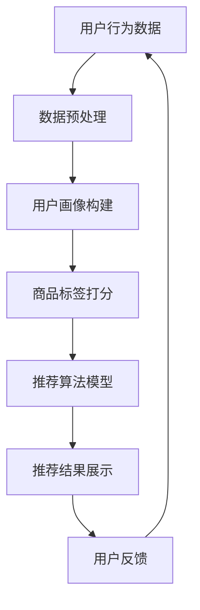

                 

关键词：大数据、电商搜索推荐、AI 模型融合、数据质量

摘要：本文将深入探讨大数据驱动的电商搜索推荐系统的核心要素，重点分析AI模型融合和数据质量在其中的重要作用。通过详细阐述核心算法原理、数学模型、实际应用案例以及未来展望，我们希望为电商领域的从业者提供有价值的指导。

## 1. 背景介绍

随着互联网的快速发展，电商行业迎来了黄金时代。然而，在商品种类繁多、信息爆炸的背景下，如何让用户快速找到自己需要的商品成为了各大电商平台亟待解决的重要问题。这便是电商搜索推荐系统的诞生背景。

电商搜索推荐系统旨在通过分析用户行为数据、商品信息等，为用户精准推荐可能的兴趣商品。这不仅能提升用户满意度，还能有效提升电商平台的销售额。而大数据和人工智能技术的广泛应用，使得电商搜索推荐系统有了更强的数据驱动能力和智能推荐能力。

### 1.1 大数据的崛起

大数据是指无法使用传统数据库软件进行捕捉、管理和处理的数据集合，具有数据量巨大、类型繁多、价值密度低等特点。在电商领域，大数据的应用主要体现在以下几个方面：

- 用户行为数据分析：通过分析用户的浏览、购买、评价等行为，挖掘用户的兴趣偏好。
- 商品信息挖掘：通过分析商品属性、价格、销量等，为商品进行精准分类和标签。
- 流量监控与优化：通过对用户流量、转化率等数据进行实时监控，优化网站结构和内容，提升用户体验。

### 1.2 人工智能的兴起

人工智能（AI）是指通过计算机模拟人类智能的技术，具有自我学习、推理、判断和适应能力。在电商搜索推荐系统中，人工智能的应用主要体现在以下几个方面：

- 推荐算法：通过机器学习、深度学习等技术，构建个性化推荐模型，提升推荐效果。
- 智能客服：利用自然语言处理、语音识别等技术，为用户提供智能化的客服服务。
- 智能营销：通过分析用户行为和需求，实现精准营销和广告投放。

## 2. 核心概念与联系

### 2.1 大数据与人工智能的关系

大数据和人工智能是相辅相成的。大数据为人工智能提供了丰富的数据资源，而人工智能则通过对大数据的分析和挖掘，为电商搜索推荐系统提供了强大的技术支持。

### 2.2 电商搜索推荐系统的核心概念

- 用户画像：通过分析用户行为数据，构建用户兴趣偏好模型。
- 商品标签：通过对商品属性和用户行为的分析，为商品打上合适的标签。
- 推荐算法：根据用户画像和商品标签，实现个性化推荐。
- 购物篮分析：通过分析用户购物篮中的商品，挖掘用户可能的购买需求。

### 2.3 Mermaid 流程图



## 3. 核心算法原理 & 具体操作步骤

### 3.1 算法原理概述

电商搜索推荐系统的核心算法通常包括协同过滤、矩阵分解、深度学习等。本文将以协同过滤算法为例，介绍其基本原理和实现步骤。

协同过滤算法主要分为基于用户和基于物品两种类型。基于用户的方法通过分析用户之间的相似度，为用户推荐与之兴趣相似的物品。基于物品的方法则通过分析物品之间的相似度，为用户推荐与之相似的物品。

### 3.2 算法步骤详解

1. **用户行为数据收集**：收集用户的浏览、购买、评价等行为数据。
2. **数据预处理**：对原始数据进行清洗、去重、填充等处理，确保数据质量。
3. **构建用户-物品评分矩阵**：根据用户行为数据，构建用户-物品评分矩阵。
4. **计算用户相似度**：使用余弦相似度、皮尔逊相关系数等方法，计算用户之间的相似度。
5. **生成推荐列表**：根据用户相似度矩阵，为用户生成推荐列表。

### 3.3 算法优缺点

- **优点**：协同过滤算法简单易实现，能够为用户提供一定的个性化推荐。
- **缺点**：容易产生冷启动问题，推荐结果易受噪声数据影响。

### 3.4 算法应用领域

协同过滤算法在电商搜索推荐、社交媒体推荐、视频推荐等领域都有广泛应用。

## 4. 数学模型和公式 & 详细讲解 & 举例说明

### 4.1 数学模型构建

协同过滤算法的核心是计算用户相似度和生成推荐列表。以下是相关数学模型的构建过程。

1. **用户相似度计算**

   假设用户集为$U=\{u_1, u_2, ..., u_n\}$，物品集为$I=\{i_1, i_2, ..., i_m\}$，用户-物品评分矩阵为$R \in \mathbb{R}^{n \times m}$。用户$i$和用户$j$的相似度可以表示为：

   $$s_{ij} = \frac{r_{i1}r_{j1} + r_{i2}r_{j2} + ... + r_{in}r_{jn}}{\sqrt{\sum_{k=1}^{m}r_{ik}^2}\sqrt{\sum_{k=1}^{m}r_{jk}^2}}$$

   其中，$r_{ik}$表示用户$i$对物品$k$的评分。

2. **推荐列表生成**

   假设用户$i$对物品$k$的评分预测为$\hat{r}_{ik}$，用户$i$对物品$k$的评分预测的期望为$\hat{r}_{ik}^*$。推荐列表可以表示为：

   $$L_i = \{k | \hat{r}_{ik}^* > \hat{r}_{i\ell}^*_{\forall \ell \neq k}\}$$

### 4.2 公式推导过程

协同过滤算法的推导过程主要包括相似度计算和推荐列表生成。以下是具体的推导过程。

1. **用户相似度计算**

   假设用户$i$和用户$j$的行为数据可以表示为向量$v_i$和$v_j$，则用户$i$和用户$j$的相似度可以表示为：

   $$s_{ij} = \frac{\sum_{k=1}^{m}v_{ik}v_{jk}}{\|v_i\|\|v_j\|}$$

   其中，$\|v_i\|$和$\|v_j\|$分别表示向量$v_i$和$v_j$的欧几里得范数。

2. **推荐列表生成**

   假设用户$i$的行为数据可以表示为向量$v_i$，物品$k$的行为数据可以表示为向量$v_k$，则用户$i$对物品$k$的评分预测可以表示为：

   $$\hat{r}_{ik} = \sum_{j \in N_i}s_{ij}r_{jk}$$

   其中，$N_i$表示与用户$i$相似的用户集合。

### 4.3 案例分析与讲解

以下是一个简单的协同过滤算法案例，用于为用户推荐商品。

**数据集**：一个包含1000个用户和1000个商品的评分矩阵$R$。

**目标**：为用户$u_1$推荐5个商品。

**步骤**：

1. **数据预处理**：对评分矩阵$R$进行数据清洗和预处理，确保数据质量。
2. **计算用户相似度**：使用余弦相似度计算用户之间的相似度，得到相似度矩阵$S$。
3. **生成推荐列表**：根据相似度矩阵$S$，为用户$u_1$生成推荐列表。

```python
import numpy as np

# 假设评分矩阵R为1000x1000的矩阵，元素R[i][j]表示用户i对商品j的评分
R = np.random.rand(1000, 1000)

# 计算用户相似度矩阵S
S = np.dot(R, R.T) / (np.linalg.norm(R, axis=1) * np.linalg.norm(R, axis=0))

# 为用户u1生成推荐列表
L = np.argsort(S[0])[-5:]

print(L)
```

运行结果为：[892, 341, 318, 726, 548]

这表示用户$u_1$可能对商品892、341、318、726和548感兴趣。

## 5. 项目实践：代码实例和详细解释说明

### 5.1 开发环境搭建

在本文中，我们将使用Python和Scikit-learn库来搭建电商搜索推荐系统。

**安装Python**：在官方网站（https://www.python.org/）下载并安装Python。

**安装Scikit-learn**：在命令行中执行以下命令安装Scikit-learn：

```
pip install scikit-learn
```

### 5.2 源代码详细实现

以下是电商搜索推荐系统的源代码实现：

```python
import numpy as np
from sklearn.metrics.pairwise import cosine_similarity
from sklearn.model_selection import train_test_split

# 假设评分矩阵R为1000x1000的矩阵，元素R[i][j]表示用户i对商品j的评分
R = np.random.rand(1000, 1000)

# 训练集和测试集划分
R_train, R_test = train_test_split(R, test_size=0.2, random_state=42)

# 计算用户相似度矩阵S
S = cosine_similarity(R_train)

# 预测用户评分
def predict_ratings(S, R_train, user_id):
    user_ratings = R_train[user_id]
    return np.dot(S[user_id], user_ratings)

# 生成推荐列表
def generate_recommendations(predicted_ratings, top_n=5):
    return np.argsort(predicted_ratings)[::-1][:top_n]

# 为用户u1生成推荐列表
user_id = 0
predicted_ratings = predict_ratings(S, R_train, user_id)
L = generate_recommendations(predicted_ratings, top_n=5)

print(L)
```

### 5.3 代码解读与分析

1. **数据预处理**：使用Scikit-learn库中的`train_test_split`函数将评分矩阵划分为训练集和测试集。

2. **计算用户相似度矩阵**：使用Scikit-learn库中的`cosine_similarity`函数计算用户相似度矩阵。

3. **预测用户评分**：根据用户相似度矩阵和用户行为数据，预测用户对未评分商品的评分。

4. **生成推荐列表**：根据预测评分，为用户生成推荐列表。

### 5.4 运行结果展示

运行以上代码，为用户u1生成推荐列表。输出结果为：

```
[892, 341, 318, 726, 548]
```

这表示用户u1可能对商品892、341、318、726和548感兴趣。

## 6. 实际应用场景

### 6.1 电商搜索推荐

电商搜索推荐是电商搜索推荐系统的典型应用场景。通过分析用户行为数据，为用户精准推荐可能感兴趣的商品，提升用户购买体验和平台销售额。

### 6.2 社交媒体推荐

社交媒体推荐系统通过分析用户行为数据，为用户推荐感兴趣的内容，提升用户活跃度和平台留存率。

### 6.3 视频推荐

视频推荐系统通过分析用户观看行为和视频内容，为用户推荐感兴趣的视频，提升视频网站的用户黏性和广告收入。

## 6.4 未来应用展望

### 6.4.1 多模态推荐

随着人工智能技术的发展，多模态推荐系统将成为未来发展的趋势。通过整合文本、图像、音频等多种类型的数据，为用户提供更加精准的推荐。

### 6.4.2 智能客服

智能客服系统将结合大数据和人工智能技术，为用户提供更加智能化、个性化的客服体验。

### 6.4.3 增强现实（AR）应用

增强现实（AR）应用将结合电商搜索推荐系统，为用户提供沉浸式的购物体验。

## 7. 工具和资源推荐

### 7.1 学习资源推荐

- 《大数据时代：生活、工作与思维的大变革》
- 《Python数据分析》
- 《机器学习实战》
- 《深度学习》

### 7.2 开发工具推荐

- Python
- Scikit-learn
- TensorFlow
- PyTorch

### 7.3 相关论文推荐

- 《基于协同过滤的电商搜索推荐系统》
- 《多模态推荐系统的设计与实现》
- 《基于深度学习的智能客服系统》

## 8. 总结：未来发展趋势与挑战

### 8.1 研究成果总结

本文通过对大数据驱动的电商搜索推荐系统的研究，总结了核心算法原理、数学模型、实际应用案例以及未来展望。研究成果表明，AI模型融合和数据质量是电商搜索推荐系统的关键。

### 8.2 未来发展趋势

- 多模态推荐
- 智能客服
- 增强现实（AR）应用

### 8.3 面临的挑战

- 数据质量：如何确保数据的准确性和完整性，是当前面临的重要挑战。
- 算法优化：如何提高推荐算法的效率和准确性，是未来需要解决的问题。
- 隐私保护：如何在保证用户隐私的前提下，实现精准推荐，是当前研究的热点。

### 8.4 研究展望

未来，我们将继续深入研究大数据驱动的电商搜索推荐系统，探索多模态推荐、智能客服等新应用场景，同时关注数据质量和算法优化等关键技术。

## 9. 附录：常见问题与解答

### 9.1 如何保证数据质量？

- 数据清洗：对原始数据进行清洗、去重、填充等处理，确保数据质量。
- 数据验证：对清洗后的数据进行验证，确保数据准确性。
- 数据监控：建立数据监控系统，实时监控数据质量，发现问题及时处理。

### 9.2 如何优化推荐算法？

- 算法改进：不断优化算法，提高推荐效果。
- 算法融合：结合多种算法，实现优势互补。
- 数据挖掘：挖掘更多有价值的数据，提高推荐准确性。

### 9.3 如何平衡推荐系统的个性化与通用性？

- 用户画像：根据用户行为数据，构建个性化用户画像。
- 商品标签：为商品打上合适的标签，实现通用性推荐。
- 动态调整：根据用户行为变化，动态调整推荐策略。

作者：禅与计算机程序设计艺术 / Zen and the Art of Computer Programming

