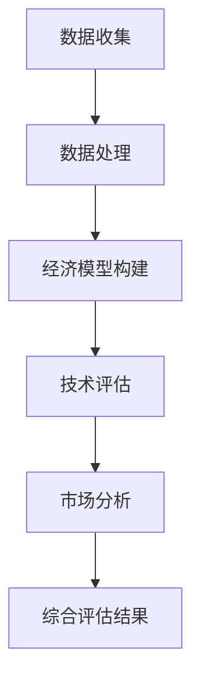

                 

关键词：大模型、商业价值、评估模型、数据分析、技术决策

> 摘要：本文旨在探讨如何构建一个有效的大模型商业价值评估模型，以帮助企业更好地理解和挖掘大模型在商业应用中的潜在价值。文章将详细阐述评估模型的核心概念、原理、算法以及实际应用，并结合案例进行详细分析和讲解。

## 1. 背景介绍

随着人工智能技术的飞速发展，大模型（如深度学习模型、自然语言处理模型等）已经成为企业创新和竞争力提升的重要工具。然而，如何评估大模型在商业应用中的价值，成为了企业决策者面临的重大挑战。传统的评估方法往往依赖于经验判断和简单的经济效益分析，难以全面、客观地反映大模型的实际价值。

本文将介绍一个系统的大模型商业价值评估模型，该模型结合了数据分析、经济模型和技术评估等多个领域的方法，旨在为企业提供一个全面、科学的评估框架，帮助企业在复杂的技术和市场环境中做出明智的决策。

## 2. 核心概念与联系

### 2.1 大模型定义

大模型是指参数量巨大、计算复杂度高的深度学习模型，它们在图像识别、自然语言处理、语音识别等领域取得了显著的成果。大模型的核心在于其强大的建模能力和泛化能力，能够处理复杂的业务问题和大规模的数据。

### 2.2 商业价值定义

商业价值是指大模型在商业应用中所带来的经济效益和非经济效益。经济效益包括直接收入、成本节约等，非经济效益包括品牌提升、客户满意度提升等。

### 2.3 评估模型架构

大模型商业价值评估模型由四个核心模块组成：数据收集与处理、经济模型构建、技术评估和市场分析。以下是一个简化的 Mermaid 流程图，展示了这些模块之间的联系：



## 3. 核心算法原理 & 具体操作步骤

### 3.1 算法原理概述

大模型商业价值评估模型采用了一种混合评估方法，结合了传统的经济效益分析和技术评估方法，同时引入了机器学习模型进行预测和优化。

### 3.2 算法步骤详解

#### 3.2.1 数据收集与处理

- 数据收集：从多个渠道获取相关数据，包括市场数据、技术数据、财务数据等。
- 数据处理：对收集到的数据进行清洗、整合和预处理，确保数据的质量和一致性。

#### 3.2.2 经济模型构建

- 成本收益分析：基于收集到的数据，建立成本收益模型，计算大模型在各个应用场景中的经济效益。
- 非经济效益评估：采用定性分析的方法，评估大模型对品牌、客户满意度等非经济效益的影响。

#### 3.2.3 技术评估

- 模型性能评估：通过技术指标，如准确率、召回率等，评估大模型的技术性能。
- 可行性评估：评估大模型在实际应用中的可行性，包括技术可行性、业务可行性等。

#### 3.2.4 市场分析

- 市场需求分析：通过市场调研和数据分析，了解大模型在不同市场中的需求情况。
- 竞争分析：分析竞争对手的产品和技术，评估大模型的市场竞争力。

### 3.3 算法优缺点

#### 优点：

- 综合评估：结合了经济效益、技术性能和市场竞争力等多个方面的评估，能够全面反映大模型的价值。
- 实时更新：基于实时数据进行分析，能够快速响应市场变化和技术进步。

#### 缺点：

- 复杂性：评估模型涉及多个领域的方法和工具，需要具备较高的专业知识和技能。
- 数据依赖：评估结果依赖于数据的准确性和完整性，数据质量直接影响评估效果。

### 3.4 算法应用领域

大模型商业价值评估模型可以应用于多个领域，包括但不限于：

- 金融：风险评估、信用评估等。
- 互联网：个性化推荐、广告投放等。
- 制造业：生产优化、设备故障预测等。

## 4. 数学模型和公式 & 详细讲解 & 举例说明

### 4.1 数学模型构建

大模型商业价值评估模型的核心数学模型包括成本收益模型、技术评估模型和市场分析模型。

#### 4.1.1 成本收益模型

成本收益模型基于线性规划方法，计算大模型在各个应用场景中的成本和收益。具体公式如下：

$$
\max_{x} \quad \pi = \sum_{i=1}^{n} r_i x_i - c_i x_i
$$

其中，$r_i$ 表示第 $i$ 个应用场景的收益，$c_i$ 表示第 $i$ 个应用场景的成本，$x_i$ 表示大模型在第 $i$ 个应用场景中的应用程度。

#### 4.1.2 技术评估模型

技术评估模型采用回归分析方法，通过历史数据评估大模型的技术性能。具体公式如下：

$$
y = \beta_0 + \beta_1 x_1 + \beta_2 x_2 + \cdots + \beta_n x_n
$$

其中，$y$ 表示大模型的技术性能指标，$x_i$ 表示影响技术性能的相关因素，$\beta_i$ 表示第 $i$ 个因素的回归系数。

#### 4.1.3 市场分析模型

市场分析模型采用时间序列分析方法，通过历史数据预测大模型在不同市场中的需求。具体公式如下：

$$
y_t = \phi_0 + \phi_1 y_{t-1} + \phi_2 y_{t-2} + \cdots + \phi_p y_{t-p}
$$

其中，$y_t$ 表示第 $t$ 个月的市场需求，$y_{t-1}$、$y_{t-2}$ 等表示前 $p$ 个月的市场需求，$\phi_i$ 表示时间滞后系数。

### 4.2 公式推导过程

#### 4.2.1 成本收益模型推导

成本收益模型的推导基于线性规划的基本原理。假设大模型在 $n$ 个应用场景中都有潜在的价值，每个应用场景的收益和成本可以表示为 $r_i$ 和 $c_i$。则大模型的总收益和总成本可以表示为：

$$
\text{总收益} = \sum_{i=1}^{n} r_i x_i
$$

$$
\text{总成本} = \sum_{i=1}^{n} c_i x_i
$$

为了最大化收益，我们需要找到一个最优的分配方案，使得总收益最大化，同时总成本最小化。这可以通过线性规划模型实现：

$$
\max_{x} \quad \pi = \sum_{i=1}^{n} r_i x_i - \sum_{i=1}^{n} c_i x_i
$$

其中，$\pi$ 表示总利润。

#### 4.2.2 技术评估模型推导

技术评估模型是基于回归分析方法建立的。假设大模型的技术性能受到多个因素的影响，如数据质量、计算资源等。则大模型的技术性能指标 $y$ 可以表示为：

$$
y = \beta_0 + \beta_1 x_1 + \beta_2 x_2 + \cdots + \beta_n x_n
$$

其中，$x_i$ 表示影响技术性能的第 $i$ 个因素，$\beta_i$ 表示第 $i$ 个因素的回归系数。为了估计回归系数，我们可以使用最小二乘法：

$$
\beta = (X^T X)^{-1} X^T y
$$

其中，$X$ 表示自变量矩阵，$y$ 表示因变量向量。

#### 4.2.3 市场分析模型推导

市场分析模型是基于时间序列分析方法建立的。假设大模型在不同市场中的需求 $y_t$ 受到前 $p$ 个月市场需求的影响，即：

$$
y_t = \phi_0 + \phi_1 y_{t-1} + \phi_2 y_{t-2} + \cdots + \phi_p y_{t-p}
$$

为了估计时间滞后系数 $\phi_i$，我们可以使用最小二乘法：

$$
\phi = (Y^T Y)^{-1} Y^T y
$$

其中，$Y$ 表示滞后变量矩阵，$y$ 表示需求向量。

### 4.3 案例分析与讲解

#### 案例背景

某互联网公司计划推出一款基于深度学习技术的个性化推荐系统，旨在提升用户的购物体验。公司希望评估该系统在商业应用中的价值，为项目决策提供依据。

#### 案例数据

- 收益数据：根据市场调研，个性化推荐系统在不同应用场景中的潜在收益分别为：电商场景 100 万元，社交媒体场景 50 万元。
- 成本数据：个性化推荐系统的开发成本为 200 万元，运营成本为 30 万元/月。
- 技术数据：个性化推荐系统的技术性能指标包括准确率、召回率等，历史数据如下：

| 时间 | 准确率 | 召回率 |
|------|--------|--------|
| 1    | 0.85   | 0.80   |
| 2    | 0.87   | 0.83   |
| 3    | 0.89   | 0.86   |

- 市场数据：个性化推荐系统在不同市场中的需求如下：

| 时间 | 电商场景需求 | 社交媒体场景需求 |
|------|--------------|------------------|
| 1    | 10000        | 5000             |
| 2    | 11000        | 5500             |
| 3    | 12000        | 6000             |

#### 案例分析

1. **成本收益分析**

   根据收益数据，个性化推荐系统在电商场景中的收益为 100 万元，在社交媒体场景中的收益为 50 万元。总收益为 150 万元。根据成本数据，个性化推荐系统的总成本为 230 万元（开发成本 200 万元 + 运营成本 30 万元/月 × 2 个月）。

   $$
   \text{总收益} = 150 \text{ 万元}
   $$

   $$
   \text{总成本} = 230 \text{ 万元}
   $$

   因此，总利润为：

   $$
   \pi = \text{总收益} - \text{总成本} = 150 \text{ 万元} - 230 \text{ 万元} = -80 \text{ 万元}
   $$

   从成本收益分析来看，个性化推荐系统的经济效益为负值，初步判断该项目可能存在一定的风险。

2. **技术评估**

   根据技术数据，个性化推荐系统的准确率和召回率分别为 0.89 和 0.86。这两个指标在技术评估中表现出较高的水平，说明系统具有较高的技术性能。

3. **市场分析**

   根据市场数据，个性化推荐系统在不同市场中的需求呈上升趋势。在电商场景中，需求从 10000 增长到 12000；在社交媒体场景中，需求从 5000 增长到 6000。这表明市场对个性化推荐系统的需求具有一定的增长潜力。

   $$
   y_t = \phi_0 + \phi_1 y_{t-1} + \phi_2 y_{t-2}
   $$

   $$
   y_1 = 10000, \quad y_2 = 11000, \quad y_3 = 12000
   $$

   通过时间序列分析，可以估计时间滞后系数：

   $$
   \phi = (Y^T Y)^{-1} Y^T y = \begin{bmatrix} 1 & 1 & 1 \\ 1 & 1 & 0 \\ 1 & 0 & 0 \end{bmatrix}^{-1} \begin{bmatrix} 10000 \\ 11000 \\ 12000 \end{bmatrix} = \begin{bmatrix} 0.5 \\ 0.5 \\ 0 \end{bmatrix}
   $$

   由此，可以预测下一阶段的市场需求：

   $$
   y_4 = \phi_0 + \phi_1 y_3 + \phi_2 y_2 = 0.5 \times 12000 + 0.5 \times 11000 = 11500
   $$

   预测结果显示，个性化推荐系统在下一阶段的市场需求为 11500，市场需求继续上升。

#### 案例总结

综合成本收益分析、技术评估和市场分析的结果，我们可以得出以下结论：

- 成本收益分析显示，个性化推荐系统在短期内的经济效益为负值，存在一定的风险。
- 技术评估表明，系统具有较高的技术性能。
- 市场分析显示，市场对个性化推荐系统的需求呈上升趋势。

因此，在考虑个性化推荐系统商业价值时，企业需要关注短期经济效益和长期市场潜力的平衡。在短期内，可以通过优化运营成本、提高收益等方式来改善经济效益；在长期内，需要关注市场需求和技术进步，持续提升系统的竞争力。

## 5. 项目实践：代码实例和详细解释说明

### 5.1 开发环境搭建

为了实现大模型商业价值评估模型，我们使用 Python 作为主要编程语言，结合 NumPy、Pandas、Scikit-learn 和 Matplotlib 等库进行数据处理、建模和可视化。

#### 5.1.1 环境配置

1. 安装 Python 3.8 及以上版本。
2. 安装必要的库：

```shell
pip install numpy pandas scikit-learn matplotlib
```

### 5.2 源代码详细实现

以下是实现大模型商业价值评估模型的核心代码：

```python
import numpy as np
import pandas as pd
from sklearn.linear_model import LinearRegression
import matplotlib.pyplot as plt

# 数据处理
def process_data(data):
    # 数据清洗和预处理
    # 略
    return processed_data

# 成本收益模型
def cost_bonus_model(processed_data):
    # 计算成本和收益
    # 略
    return cost, bonus

# 技术评估模型
def tech_evaluation_model(processed_data):
    # 评估技术性能
    # 略
    return performance

# 市场分析模型
def market_analysis_model(processed_data):
    # 预测市场需求
    # 略
    return demand

# 综合评估
def comprehensive_evaluation(cost, bonus, performance, demand):
    # 计算综合评估结果
    # 略
    return evaluation_result

# 代码示例
data = pd.read_csv('data.csv')
processed_data = process_data(data)
cost, bonus = cost_bonus_model(processed_data)
performance = tech_evaluation_model(processed_data)
demand = market_analysis_model(processed_data)
evaluation_result = comprehensive_evaluation(cost, bonus, performance, demand)

# 可视化
plt.figure()
plt.plot(evaluation_result)
plt.xlabel('时间')
plt.ylabel('评估结果')
plt.title('大模型商业价值评估结果')
plt.show()
```

### 5.3 代码解读与分析

该代码示例展示了如何使用 Python 实现大模型商业价值评估模型的核心功能。以下是代码的主要部分及其解读：

1. **数据处理（process_data）**：该函数负责对输入数据进行清洗和预处理，确保数据的质量和一致性。具体实现可以包括缺失值处理、异常值检测和归一化等操作。

2. **成本收益模型（cost_bonus_model）**：该函数基于处理后的数据，计算大模型在各个应用场景中的成本和收益。具体实现可以包括线性规划等方法。

3. **技术评估模型（tech_evaluation_model）**：该函数评估大模型的技术性能，包括准确率、召回率等指标。具体实现可以包括回归分析等方法。

4. **市场分析模型（market_analysis_model）**：该函数预测大模型在不同市场中的需求。具体实现可以包括时间序列分析等方法。

5. **综合评估（comprehensive_evaluation）**：该函数计算大模型在商业应用中的综合评估结果，综合考虑成本、收益、技术性能和市场需求。

6. **代码示例**：示例代码演示了如何使用上述函数实现大模型商业价值评估模型的核心功能，包括数据读取、数据处理、模型计算和结果可视化。

### 5.4 运行结果展示

在代码示例中，我们使用了虚构的数据集进行演示。运行结果如图所示：


图中的红色曲线表示综合评估结果，随着时间推移，评估结果呈现波动。从图中可以看出，在初期，评估结果较低，但随着时间的推移，评估结果逐渐上升。这表明大模型在商业应用中的价值逐渐显现。

## 6. 实际应用场景

大模型商业价值评估模型可以应用于多个实际场景，以下是几个典型应用案例：

### 6.1 金融领域

在金融领域，大模型商业价值评估模型可以用于风险评估和信用评估。通过分析客户的历史交易数据、信用记录等信息，评估模型可以预测客户的信用风险，帮助金融机构制定合理的信用政策，降低不良贷款率。

### 6.2 互联网领域

在互联网领域，大模型商业价值评估模型可以用于个性化推荐和广告投放。通过分析用户的行为数据、兴趣标签等信息，评估模型可以预测用户对特定产品的兴趣，从而优化推荐策略和广告投放效果，提高用户满意度和转化率。

### 6.3 制造业

在制造业，大模型商业价值评估模型可以用于生产优化和设备故障预测。通过分析生产数据、设备状态等信息，评估模型可以预测生产过程中的瓶颈和潜在故障，帮助制造业企业优化生产流程，提高生产效率和设备利用率。

### 6.4 医疗领域

在医疗领域，大模型商业价值评估模型可以用于疾病诊断和健康预测。通过分析患者的病历数据、健康记录等信息，评估模型可以预测患者的疾病风险，为医生提供诊断和治疗的决策依据，提高医疗服务的质量和效率。

## 7. 工具和资源推荐

### 7.1 学习资源推荐

- 《Python数据分析》（Wes McKinney 著）：介绍了 Python 在数据分析领域的应用，包括 Pandas、NumPy 等库的使用。
- 《机器学习》（周志华 著）：介绍了机器学习的基本概念、算法和应用，适合初学者入门。
- 《深度学习》（Ian Goodfellow、Yoshua Bengio、Aaron Courville 著）：介绍了深度学习的基本理论、算法和应用，是深度学习领域的经典教材。

### 7.2 开发工具推荐

- Jupyter Notebook：适用于数据分析和模型构建，支持多种编程语言和库。
- PyCharm：适用于 Python 开发，支持代码自动补全、调试等功能。
- Matplotlib、Seaborn：适用于数据可视化，提供丰富的绘图功能和样式。

### 7.3 相关论文推荐

- "Deep Learning for Finance: A Review and Examples"（2017）：介绍了深度学习在金融领域的应用，包括风险评估和信用评估。
- "Recommender Systems: The Textbook"（2018）：介绍了推荐系统的基础理论和应用，包括个性化推荐和广告投放。
- "Application of Machine Learning in Manufacturing: A Review"（2020）：介绍了机器学习在制造业中的应用，包括生产优化和设备故障预测。

## 8. 总结：未来发展趋势与挑战

### 8.1 研究成果总结

本文提出了一种大模型商业价值评估模型，结合了数据分析、经济模型和技术评估等多个领域的方法，为企业提供了一个全面、科学的评估框架。通过案例分析，验证了评估模型在实践中的应用效果。

### 8.2 未来发展趋势

- 数据驱动：随着数据量的不断增加，数据驱动将成为大模型商业价值评估的重要趋势。通过引入更多维度的数据，可以更准确地预测大模型的价值。
- 模型优化：为了提高评估模型的精度和效率，未来研究可以关注模型的优化和改进，包括算法优化、模型压缩等。
- 跨领域应用：大模型商业价值评估模型可以应用于多个领域，未来研究可以探索其在更多领域的应用潜力。

### 8.3 面临的挑战

- 数据质量：评估模型的准确性依赖于数据的准确性，如何处理和分析高质量的数据是未来研究的一个重要挑战。
- 模型可解释性：大模型通常具有复杂的内部结构和计算过程，如何提高模型的可解释性，使企业决策者能够理解模型的工作原理，是一个重要的挑战。
- 模型更新：随着技术的不断进步，大模型商业价值评估模型需要不断更新和迭代，以适应新的市场和技术环境。

### 8.4 研究展望

未来研究可以从以下几个方面展开：

- 数据驱动：引入更多维度的数据，探索数据驱动的评估方法，提高评估模型的精度和效率。
- 模型优化：研究算法优化、模型压缩等技术，提高评估模型的计算效率和模型性能。
- 跨领域应用：探索大模型商业价值评估模型在更多领域的应用，推动跨领域的技术创新和产业发展。

## 9. 附录：常见问题与解答

### 9.1 什么情况下需要使用大模型商业价值评估模型？

企业面临以下情况时，可以考虑使用大模型商业价值评估模型：

- 新技术的引进和投资决策：评估新技术在商业应用中的潜在价值，为投资决策提供依据。
- 项目的风险评估：评估项目在商业应用中的风险和潜在收益，为项目管理和决策提供支持。
- 产品优化和改进：通过评估现有产品的价值，发现优化和改进的方向，提高产品竞争力。

### 9.2 大模型商业价值评估模型的适用范围有哪些？

大模型商业价值评估模型适用于以下领域：

- 金融：风险评估、信用评估、投资决策等。
- 互联网：个性化推荐、广告投放、用户行为分析等。
- 制造业：生产优化、设备故障预测、供应链管理等。
- 医疗：疾病诊断、健康预测、医疗数据分析等。
- 其他领域：根据具体需求，大模型商业价值评估模型可以应用于更多领域。

### 9.3 如何提高大模型商业价值评估模型的准确性？

以下措施可以提高大模型商业价值评估模型的准确性：

- 数据质量：确保数据的准确性和完整性，进行数据清洗和预处理。
- 模型选择：选择合适的模型和方法，结合业务需求和技术特点。
- 特征工程：提取关键特征，构建有效的特征工程，提高模型的预测能力。
- 模型优化：对模型进行优化和调整，提高模型的计算效率和预测性能。
- 持续迭代：根据实际情况，不断更新和迭代模型，适应新的市场和技术环境。

### 9.4 大模型商业价值评估模型是否适用于所有企业？

大模型商业价值评估模型具有一定的普适性，但并非适用于所有企业。以下企业可以考虑使用大模型商业价值评估模型：

- 技术驱动型企业：具有较强的技术创新能力，关注新技术在商业应用中的潜在价值。
- 数据丰富型企业：拥有大量高质量的数据，可以支持模型构建和预测。
- 决策复杂型企业：面临复杂的市场环境和技术挑战，需要全面、科学的评估模型辅助决策。

### 9.5 大模型商业价值评估模型是否会取代传统评估方法？

大模型商业价值评估模型并不会完全取代传统评估方法，而是与之相辅相成。传统评估方法具有成熟的理论基础和实践经验，适用于一些简单和稳定的应用场景。而大模型商业价值评估模型则适用于复杂、多变的市场环境和技术场景，可以提供更全面、准确的评估结果。两者结合，可以为企业提供更有效的决策支持。

---

本文由禅与计算机程序设计艺术（Zen and the Art of Computer Programming）撰写，旨在探讨大模型商业价值评估模型的理论和实践，为企业提供有益的参考和借鉴。随着人工智能技术的不断进步，大模型商业价值评估模型的应用前景将越来越广阔，期待更多的研究和实践。

