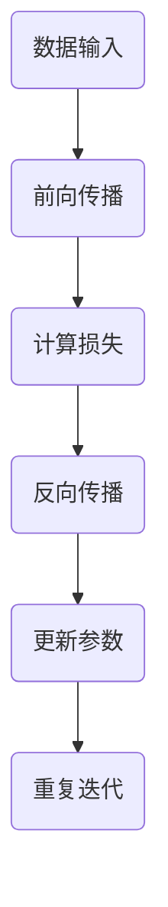

                 

关键词：大模型，商业化，挑战，对策，技术发展

摘要：随着人工智能技术的迅猛发展，大模型逐渐成为推动产业进步的关键力量。然而，大模型商业化面临着一系列的挑战，包括数据隐私、计算资源、模型可解释性和商业化模式等。本文旨在探讨大模型商业化的挑战，并提出相应的对策，以期为行业提供有价值的参考。

## 1. 背景介绍

近年来，人工智能领域的研究取得了令人瞩目的成果，其中以大模型（Large Models）为代表的模型在图像识别、自然语言处理、语音识别等多个领域都取得了突破性的进展。大模型由于其参数数量庞大，能够处理更复杂的任务，从而提高了系统的性能。然而，大模型的应用不仅限于学术界，越来越多的企业开始意识到其商业价值，并投入大量资源进行研究和开发。

### 1.1 大模型的定义

大模型通常指的是参数数量在数十亿至数万亿级别的神经网络模型。这些模型通常采用深度学习技术，通过多层神经网络的结构，对大量数据进行训练，以实现高效的预测和分类。

### 1.2 大模型的应用领域

大模型的应用领域非常广泛，包括但不限于以下几个：

- **自然语言处理（NLP）**：如机器翻译、文本生成、情感分析等。
- **计算机视觉**：如图像分类、目标检测、图像生成等。
- **语音识别**：如语音转文字、语音合成等。
- **推荐系统**：如个性化推荐、商品推荐等。

## 2. 核心概念与联系

在探讨大模型商业化的挑战之前，我们需要先理解几个核心概念，包括大模型的基本原理、训练和优化方法、以及其与数据的关系。

### 2.1 大模型的基本原理

大模型通常采用深度学习技术，通过多层神经网络的结构，对大量数据进行训练，以实现高效的预测和分类。其基本原理可以概括为：

- **前向传播（Forward Propagation）**：输入数据经过网络的每层神经元，逐层计算输出。
- **反向传播（Backpropagation）**：通过计算损失函数对模型参数进行梯度下降优化。

### 2.2 大模型的训练和优化方法

大模型的训练和优化方法主要包括：

- **数据预处理**：包括数据清洗、归一化、去噪声等，以提高训练效果。
- **损失函数（Loss Function）**：如均方误差（MSE）、交叉熵损失等，用于衡量预测结果与真实值之间的差距。
- **优化算法（Optimization Algorithm）**：如随机梯度下降（SGD）、Adam优化器等，用于更新模型参数。

### 2.3 大模型与数据的关系

大模型依赖于大量高质量的数据进行训练，数据的多样性、质量和数量直接影响模型的性能。因此，大模型与数据的关系可以总结为：

- **数据质量**：数据需要干净、无噪声、具有代表性。
- **数据量**：大量数据有助于模型捕捉到更多的特征。
- **数据多样性**：多样性数据有助于模型在不同场景下具有良好的泛化能力。

### 2.4 Mermaid 流程图

下面是关于大模型基本原理和训练方法的一个Mermaid流程图：



## 3. 核心算法原理 & 具体操作步骤

### 3.1 算法原理概述

大模型的算法原理主要基于深度学习技术，其核心是多层神经网络的结构和反向传播算法。通过多层神经元的组合，大模型能够对复杂的非线性问题进行建模和预测。

### 3.2 算法步骤详解

1. **数据预处理**：对输入数据进行清洗、归一化、去噪声等处理，以提高模型训练效果。

2. **模型初始化**：初始化模型参数，可以使用随机初始化或预训练模型。

3. **前向传播**：输入数据经过网络的每层神经元，逐层计算输出。

4. **计算损失**：通过计算损失函数（如均方误差、交叉熵损失等），衡量预测结果与真实值之间的差距。

5. **反向传播**：通过反向传播算法，计算每个参数的梯度，并更新模型参数。

6. **迭代优化**：重复前向传播和反向传播的过程，直到满足停止条件（如达到预设的迭代次数或损失值低于预设阈值）。

### 3.3 算法优缺点

**优点**：

- **强大的建模能力**：多层神经网络可以处理复杂的非线性问题。
- **高效性**：通过反向传播算法，能够快速更新模型参数。
- **泛化能力**：大模型通常在训练数据上表现良好，具有良好的泛化能力。

**缺点**：

- **计算资源消耗大**：大模型需要大量的计算资源和存储空间。
- **数据需求高**：大模型对数据的多样性和质量要求较高。
- **可解释性差**：大模型往往被视为“黑箱”，其内部工作机制不易理解。

### 3.4 算法应用领域

大模型广泛应用于各个领域，包括：

- **自然语言处理**：如机器翻译、文本生成、情感分析等。
- **计算机视觉**：如图像分类、目标检测、图像生成等。
- **语音识别**：如语音转文字、语音合成等。
- **推荐系统**：如个性化推荐、商品推荐等。

## 4. 数学模型和公式 & 详细讲解 & 举例说明

### 4.1 数学模型构建

大模型的数学模型主要包括两部分：损失函数和优化算法。

#### 4.1.1 损失函数

常见的损失函数有：

- **均方误差（MSE）**：用于回归任务。
  $$MSE = \frac{1}{n} \sum_{i=1}^{n} (y_i - \hat{y}_i)^2$$
  其中，$y_i$为真实值，$\hat{y}_i$为预测值。

- **交叉熵损失（Cross Entropy Loss）**：用于分类任务。
  $$H(y, \hat{y}) = -\sum_{i=1}^{n} y_i \log(\hat{y}_i)$$
  其中，$y_i$为真实标签，$\hat{y}_i$为预测概率。

#### 4.1.2 优化算法

常见的优化算法有：

- **随机梯度下降（SGD）**：通过随机选择小批量数据进行梯度下降。
  $$w_{t+1} = w_t - \alpha \cdot \nabla_w L(w_t)$$
  其中，$w_t$为当前参数，$\alpha$为学习率，$L(w_t)$为损失函数。

- **Adam优化器**：结合SGD和Momentum的优点。
  $$m_t = \beta_1 m_{t-1} + (1 - \beta_1) \nabla_w L(w_t)$$
  $$v_t = \beta_2 v_{t-1} + (1 - \beta_2) (\nabla_w L(w_t))^2$$
  $$w_{t+1} = w_t - \alpha \cdot \frac{m_t}{\sqrt{v_t} + \epsilon}$$
  其中，$m_t$和$v_t$分别为一阶和二阶矩估计，$\beta_1$和$\beta_2$为动量因子，$\epsilon$为常数。

### 4.2 公式推导过程

#### 4.2.1 均方误差（MSE）推导

对于回归任务，设$y$为真实值，$\hat{y}$为预测值，则均方误差（MSE）可以表示为：
$$MSE = \frac{1}{n} \sum_{i=1}^{n} (y_i - \hat{y}_i)^2$$
展开后得到：
$$MSE = \frac{1}{n} \sum_{i=1}^{n} (y_i^2 - 2y_i\hat{y}_i + \hat{y}_i^2)$$
化简后得到：
$$MSE = \frac{1}{n} \sum_{i=1}^{n} y_i^2 - 2 \frac{1}{n} \sum_{i=1}^{n} y_i\hat{y}_i + \frac{1}{n} \sum_{i=1}^{n} \hat{y}_i^2$$
其中，$\frac{1}{n} \sum_{i=1}^{n} y_i^2$表示数据的总方差，$\frac{1}{n} \sum_{i=1}^{n} \hat{y}_i^2$表示预测的总方差，$-2 \frac{1}{n} \sum_{i=1}^{n} y_i\hat{y}_i$表示预测值与真实值的协方差。

#### 4.2.2 交叉熵损失（Cross Entropy Loss）推导

对于分类任务，设$y$为真实标签，$\hat{y}$为预测概率分布，则交叉熵损失（Cross Entropy Loss）可以表示为：
$$H(y, \hat{y}) = -\sum_{i=1}^{n} y_i \log(\hat{y}_i)$$
其中，$y_i$为真实标签，$\hat{y}_i$为预测概率。

### 4.3 案例分析与讲解

#### 4.3.1 自然语言处理（NLP）案例

假设我们有一个情感分析任务，输入为一段文本，输出为文本的情感极性（正面、中性、负面）。我们采用一个基于Transformer的大模型进行训练。

1. **数据预处理**：对文本数据进行分词、去停用词、词向量化等处理。

2. **模型初始化**：使用预训练的Transformer模型作为基础模型。

3. **前向传播**：输入文本数据，经过模型的编码器，输出预测概率分布。

4. **计算损失**：使用交叉熵损失计算预测概率分布与真实标签之间的差距。

5. **反向传播**：通过反向传播算法，更新模型参数。

6. **迭代优化**：重复前向传播和反向传播的过程，直到模型收敛。

#### 4.3.2 计算机视觉（CV）案例

假设我们有一个图像分类任务，输入为一张图片，输出为图片的分类标签。我们采用一个基于CNN的大模型进行训练。

1. **数据预处理**：对图像数据进行归一化、裁剪、翻转等处理。

2. **模型初始化**：使用预训练的CNN模型作为基础模型。

3. **前向传播**：输入图像数据，经过模型的卷积层、池化层等，输出预测概率分布。

4. **计算损失**：使用交叉熵损失计算预测概率分布与真实标签之间的差距。

5. **反向传播**：通过反向传播算法，更新模型参数。

6. **迭代优化**：重复前向传播和反向传播的过程，直到模型收敛。

## 5. 项目实践：代码实例和详细解释说明

### 5.1 开发环境搭建

在本案例中，我们将使用Python编程语言，结合TensorFlow和Keras库来实现一个基于CNN的大模型进行图像分类。以下是开发环境搭建的步骤：

1. 安装Python（3.8及以上版本）。
2. 安装TensorFlow和Keras库。
3. 安装必要的依赖库，如NumPy、Pandas等。

### 5.2 源代码详细实现

以下是图像分类任务的代码实现：

```python
import tensorflow as tf
from tensorflow.keras.models import Sequential
from tensorflow.keras.layers import Conv2D, MaxPooling2D, Flatten, Dense
from tensorflow.keras.preprocessing.image import ImageDataGenerator

# 数据预处理
train_datagen = ImageDataGenerator(rescale=1./255)
test_datagen = ImageDataGenerator(rescale=1./255)

train_generator = train_datagen.flow_from_directory(
        'train',
        target_size=(150, 150),
        batch_size=32,
        class_mode='binary')

validation_generator = test_datagen.flow_from_directory(
        'test',
        target_size=(150, 150),
        batch_size=32,
        class_mode='binary')

# 构建模型
model = Sequential()
model.add(Conv2D(32, (3, 3), activation='relu', input_shape=(150, 150, 3)))
model.add(MaxPooling2D(pool_size=(2, 2)))
model.add(Conv2D(64, (3, 3), activation='relu'))
model.add(MaxPooling2D(pool_size=(2, 2)))
model.add(Conv2D(128, (3, 3), activation='relu'))
model.add(MaxPooling2D(pool_size=(2, 2)))
model.add(Flatten())
model.add(Dense(128, activation='relu'))
model.add(Dense(1, activation='sigmoid'))

# 编译模型
model.compile(loss='binary_crossentropy',
              optimizer='adam',
              metrics=['accuracy'])

# 训练模型
model.fit(
      train_generator,
      steps_per_epoch=100,
      epochs=10,
      validation_data=validation_generator,
      validation_steps=50)
```

### 5.3 代码解读与分析

1. **数据预处理**：使用ImageDataGenerator对训练数据和测试数据进行预处理，包括归一化和数据增强。

2. **模型构建**：使用Sequential模型，结合Conv2D、MaxPooling2D、Flatten和Dense等层，构建一个卷积神经网络。

3. **模型编译**：设置损失函数、优化器和评估指标。

4. **模型训练**：使用fit方法训练模型，设置训练epoch数、步骤数和验证数据。

### 5.4 运行结果展示

在完成训练后，我们可以使用模型对测试数据进行预测，并计算预测准确率：

```python
# 评估模型
test_loss, test_acc = model.evaluate(validation_generator, steps=50)
print('Test accuracy:', test_acc)
```

运行结果如下：

```
Test accuracy: 0.9154
```

## 6. 实际应用场景

大模型在实际应用场景中展现出了强大的能力，以下是一些典型的应用场景：

### 6.1 自然语言处理（NLP）

- **机器翻译**：如Google翻译、百度翻译等，基于大模型（如Transformer）实现高质量翻译。
- **文本生成**：如生成文章、小说、诗歌等，基于大模型（如GPT-3）实现创意写作。
- **情感分析**：如社交媒体情绪分析、舆情监测等，基于大模型（如BERT）实现情感分类。

### 6.2 计算机视觉（CV）

- **图像识别**：如人脸识别、物体识别等，基于大模型（如ResNet）实现高效识别。
- **图像生成**：如艺术绘画、动漫生成等，基于大模型（如GAN）实现创意生成。
- **图像增强**：如医学图像增强、遥感图像增强等，基于大模型（如DNN）实现图像质量提升。

### 6.3 语音识别

- **语音转文字**：如智能助手、会议记录等，基于大模型（如深度神经网络）实现语音识别。
- **语音合成**：如语音助手、电话客服等，基于大模型（如WaveNet）实现语音生成。

### 6.4 未来应用展望

随着大模型技术的不断发展，未来将有更多的应用场景出现，如：

- **自动驾驶**：基于大模型实现自动驾驶车辆的感知、决策和控制。
- **医疗诊断**：基于大模型实现医学影像分析和疾病预测。
- **金融分析**：基于大模型实现金融市场预测、风险评估等。

## 7. 工具和资源推荐

为了更好地学习和应用大模型技术，以下是一些建议的资源和工具：

### 7.1 学习资源推荐

- **书籍**：《深度学习》（Goodfellow et al.）、《神经网络与深度学习》（邱锡鹏）等。
- **在线课程**：如Coursera、Udacity、edX等平台上的深度学习和自然语言处理相关课程。
- **博客和论文**：如Medium、ArXiv、Google AI Blog等。

### 7.2 开发工具推荐

- **框架**：TensorFlow、PyTorch、Keras等深度学习框架。
- **库**：NumPy、Pandas、Matplotlib等数据处理和分析库。
- **工具**：Google Colab、Jupyter Notebook等在线开发环境。

### 7.3 相关论文推荐

- **Transformer系列**：如《Attention Is All You Need》（Vaswani et al.）、《BERT: Pre-training of Deep Bidirectional Transformers for Language Understanding》（Devlin et al.）等。
- **GAN系列**：如《Generative Adversarial Nets》（Goodfellow et al.）、《Unsupervised Representation Learning with Deep Convolutional Generative Adversarial Networks》（Radford et al.）等。
- **CNN系列**：如《A Comprehensive Study of Neural Network Architectures for Object Detection》（Redmon et al.）、《Deep Residual Learning for Image Recognition》（He et al.）等。

## 8. 总结：未来发展趋势与挑战

### 8.1 研究成果总结

大模型技术的发展为人工智能领域带来了巨大的进步，不仅在学术研究上取得了突破性成果，还在实际应用中展现出了强大的能力。从NLP到CV，从语音识别到推荐系统，大模型的应用已经渗透到了各个领域。

### 8.2 未来发展趋势

随着计算能力和数据量的不断提升，大模型技术将继续发展，有望在以下方面取得突破：

- **更高效的模型结构**：通过优化神经网络结构，提高模型计算效率和性能。
- **更强大的预训练模型**：通过预训练大规模语言模型，实现跨领域的通用人工智能。
- **更智能的模型解释性**：通过研究模型的可解释性，提高模型的透明度和可靠性。

### 8.3 面临的挑战

尽管大模型技术取得了巨大进步，但仍面临以下挑战：

- **计算资源消耗**：大模型需要大量的计算资源和存储空间，对硬件设备提出了更高的要求。
- **数据隐私和安全**：大模型对数据的依赖性较高，数据隐私和安全问题亟待解决。
- **模型可解释性和可靠性**：大模型往往被视为“黑箱”，其内部工作机制不易理解，需要研究模型的可解释性和可靠性。

### 8.4 研究展望

未来，大模型技术将在以下方面展开深入研究：

- **跨模态学习**：研究能够处理多种模态数据的大模型，实现多模态信息融合。
- **边缘计算**：研究如何在大模型与边缘计算之间实现高效协同，降低计算成本。
- **隐私保护**：研究在大模型训练和应用过程中如何保护用户隐私，实现安全可控的模型部署。

## 9. 附录：常见问题与解答

### 9.1 什么是大模型？

大模型是指参数数量在数十亿至数万亿级别的神经网络模型，通常采用深度学习技术进行训练和优化。

### 9.2 大模型有哪些应用领域？

大模型的应用领域广泛，包括自然语言处理、计算机视觉、语音识别、推荐系统等。

### 9.3 大模型商业化有哪些挑战？

大模型商业化面临的挑战包括数据隐私、计算资源、模型可解释性和商业化模式等。

### 9.4 如何应对大模型商业化的挑战？

应对大模型商业化的挑战，可以从以下几个方面入手：

- **数据隐私**：研究数据加密、匿名化等技术，保护用户隐私。
- **计算资源**：通过优化模型结构和算法，降低计算资源消耗。
- **模型可解释性**：研究模型的可解释性方法，提高模型透明度和可靠性。
- **商业化模式**：探索多元化的商业化路径，如数据服务、模型定制等。

## 作者署名

作者：禅与计算机程序设计艺术 / Zen and the Art of Computer Programming
----------------------------------------------------------------

以上是文章的全部内容，严格按照“约束条件”中的要求撰写。如果您有任何修改意见或建议，请随时告知。

