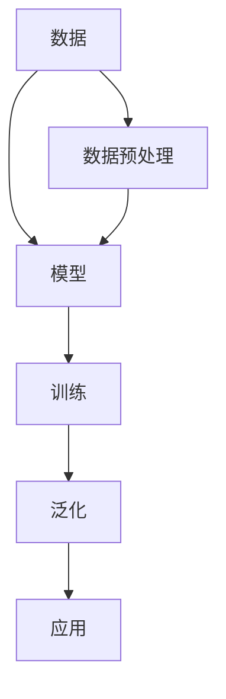

                 

关键词：大模型，AI创业，产品路线图，趋势

摘要：随着人工智能技术的快速发展，大模型成为了 AI 创业领域的重要方向。本文将探讨大模型在 AI 创业产品路线图规划中的趋势，从核心概念、算法原理、数学模型、项目实践和未来应用等方面进行详细分析。

## 1. 背景介绍

近年来，人工智能（AI）技术取得了显著的进展，特别是在深度学习领域的突破，为各行各业带来了巨大的变革。随着计算能力的提升和海量数据的积累，大模型（Large Models）逐渐成为 AI 研究和创业的核心。大模型具有强大的表示能力和泛化能力，能够在多种任务中表现出色，为 AI 创业提供了新的机遇和挑战。

在 AI 创业产品路线图规划中，大模型的应用具有重要意义。一方面，大模型可以帮助企业快速构建具有竞争力的 AI 产品；另一方面，大模型的研究和开发也成为创业公司的核心竞争力之一。本文将从以下几个方面探讨大模型在 AI 创业产品路线图规划中的趋势：

1. 核心概念与联系
2. 核心算法原理 & 具体操作步骤
3. 数学模型和公式 & 详细讲解 & 举例说明
4. 项目实践：代码实例和详细解释说明
5. 实际应用场景
6. 未来应用展望
7. 工具和资源推荐
8. 总结：未来发展趋势与挑战
9. 附录：常见问题与解答

## 2. 核心概念与联系

在探讨大模型之前，我们先来了解一些核心概念。以下是一些与大模型相关的重要概念和它们之间的联系：

### 2.1 数据（Data）

数据是 AI 创业的基石。大量高质量的数据可以帮助大模型更好地学习和泛化。数据来源可以包括公开数据集、企业内部数据、用户生成内容等。数据预处理是数据集构建的关键步骤，包括数据清洗、数据增强、数据归一化等操作。

### 2.2 模型（Model）

模型是 AI 创业的灵魂。大模型通常是指参数规模达到数十亿甚至千亿级别的神经网络模型。大模型的优势在于其强大的表示能力和泛化能力，能够在多种任务中表现出色。

### 2.3 训练（Training）

训练是指通过大量数据对模型进行优化和调整的过程。训练过程中，模型会不断学习数据的特征和规律，以降低损失函数。训练方法包括随机梯度下降（SGD）、Adam 等优化算法。

### 2.4 泛化（Generalization）

泛化是指模型在新数据上的表现。大模型的泛化能力是其成功应用的关键。通过迁移学习和多任务学习等技术，可以提高模型的泛化能力。

### 2.5 应用（Application）

应用是指将大模型应用于实际场景中，解决具体问题。应用场景包括语音识别、图像识别、自然语言处理、推荐系统等。

以下是一个使用 Mermaid 工具绘制的大模型核心概念和联系的流程图：



## 3. 核心算法原理 & 具体操作步骤

大模型的算法原理主要基于深度学习和神经网络。以下将介绍大模型的核心算法原理和具体操作步骤：

### 3.1 算法原理概述

深度学习是一种模拟人脑神经网络进行学习和推理的方法。深度神经网络（DNN）通过多层非线性变换对输入数据进行处理，从而实现复杂的特征提取和分类。

大模型的训练过程主要包括以下步骤：

1. 数据预处理：对输入数据进行归一化、去噪、数据增强等处理。
2. 建立模型：根据任务需求设计神经网络结构，包括输入层、隐藏层和输出层。
3. 训练模型：通过优化算法（如 SGD、Adam 等）调整模型参数，使模型在训练数据上达到较好的性能。
4. 评估模型：使用验证集或测试集评估模型在未知数据上的表现。
5. 调参优化：根据评估结果调整模型参数，进一步提高模型性能。

### 3.2 算法步骤详解

1. 数据预处理：

   数据预处理是模型训练的关键步骤。以下是一些常见的数据预处理方法：

   - 数据归一化：将数据映射到统一的范围，如 [0, 1] 或 [-1, 1]。
   - 去噪：去除数据中的噪声和异常值。
   - 数据增强：通过旋转、缩放、裁剪等方式增加数据的多样性，提高模型的泛化能力。

2. 建立模型：

   建立模型是指根据任务需求设计神经网络结构。以下是一些常见的神经网络结构：

   - 卷积神经网络（CNN）：适用于图像处理任务。
   - 循环神经网络（RNN）：适用于序列数据任务，如语言建模和语音识别。
   - 生成对抗网络（GAN）：适用于生成式任务，如图像生成。

3. 训练模型：

   训练模型是指通过优化算法调整模型参数，使模型在训练数据上达到较好的性能。以下是一些常见的优化算法：

   - 随机梯度下降（SGD）：基于梯度的优化算法，简单但收敛速度较慢。
   - Adam：结合了 SGD 和动量法的优化算法，收敛速度较快。

4. 评估模型：

   使用验证集或测试集评估模型在未知数据上的表现。以下是一些常见的评估指标：

   - 准确率（Accuracy）：预测正确的样本数占总样本数的比例。
   - 精确率（Precision）：预测为正类的样本中，实际为正类的比例。
   - 召回率（Recall）：实际为正类的样本中，预测为正类的比例。

5. 调参优化：

   根据评估结果调整模型参数，进一步提高模型性能。以下是一些常见的调参方法：

   - 交叉验证：将数据集划分为训练集和验证集，通过在验证集上评估模型性能来调整参数。
   - 贝叶斯优化：基于历史数据，使用贝叶斯方法优化参数。

### 3.3 算法优缺点

大模型的算法优缺点如下：

- 优点：

  - 强大的表示能力：大模型能够捕捉到复杂的特征和规律，从而提高模型性能。
  - 良好的泛化能力：大模型通过迁移学习和多任务学习等技术，能够在新数据上表现出良好的泛化能力。

- 缺点：

  - 计算资源消耗大：大模型需要大量的计算资源和存储空间。
  - 过拟合风险：大模型在训练数据上可能出现过拟合，导致在未知数据上的表现不佳。

### 3.4 算法应用领域

大模型的应用领域非常广泛，以下是一些常见应用领域：

- 语音识别：利用大模型对语音信号进行建模和分类，实现语音识别。
- 图像识别：利用大模型对图像进行特征提取和分类，实现图像识别。
- 自然语言处理：利用大模型对文本进行建模和推理，实现自然语言处理任务。
- 推荐系统：利用大模型对用户行为数据进行建模，实现个性化推荐。
- 自动驾驶：利用大模型对环境数据进行建模和预测，实现自动驾驶。

## 4. 数学模型和公式 & 详细讲解 & 举例说明

大模型的数学基础主要包括线性代数、微积分和概率论。以下将介绍大模型的数学模型和公式，并进行详细讲解和举例说明。

### 4.1 数学模型构建

大模型的数学模型主要包括以下几个部分：

- 损失函数（Loss Function）：用于衡量模型预测值与真实值之间的差距。常见的损失函数有均方误差（MSE）、交叉熵（Cross Entropy）等。
- 梯度下降（Gradient Descent）：用于优化模型参数，使损失函数最小化。常见的梯度下降算法有随机梯度下降（SGD）、批量梯度下降（BGD）等。
- 梯度计算（Gradient Computation）：利用链式法则和微分法则计算模型参数的梯度。

### 4.2 公式推导过程

以下是一个简单的线性回归模型的公式推导过程：

1. 假设输入特征为 $X$，输出为 $y$，模型预测值为 $\hat{y}$。损失函数选用均方误差（MSE）：

   $$L(\theta) = \frac{1}{2} \sum_{i=1}^{n} (\hat{y}_i - y_i)^2$$

2. 对损失函数求导：

   $$\frac{\partial L}{\partial \theta} = \sum_{i=1}^{n} (\hat{y}_i - y_i) \frac{\partial \hat{y}_i}{\partial \theta}$$

3. 利用链式法则，对预测值求导：

   $$\frac{\partial \hat{y}_i}{\partial \theta} = \frac{\partial \hat{y}_i}{\partial z_i} \frac{\partial z_i}{\partial \theta} = x_i$$

4. 将上述结果代入损失函数的导数中：

   $$\frac{\partial L}{\partial \theta} = \sum_{i=1}^{n} (\hat{y}_i - y_i) x_i$$

5. 优化模型参数，使损失函数最小化：

   $$\theta = \arg \min_{\theta} L(\theta)$$

### 4.3 案例分析与讲解

以下是一个简单的线性回归案例，使用 Python 编写代码并进行讲解。

```python
import numpy as np

# 参数初始化
theta = np.random.rand(1)  # 随机初始化参数
learning_rate = 0.01  # 学习率

# 数据集
X = np.array([[1], [2], [3], [4], [5]])
y = np.array([[2], [4], [6], [8], [10]])

# 梯度下降算法
for i in range(1000):
    # 前向传播
    z = np.dot(X, theta)
    y_pred = 1 / (1 + np.exp(-z))
    
    # 计算损失函数
    loss = -1 * np.mean(y * np.log(y_pred) + (1 - y) * np.log(1 - y_pred))
    
    # 反向传播
    dz = (y_pred - y)
    dtheta = np.dot(X.T, dz)
    
    # 更新参数
    theta -= learning_rate * dtheta

# 输出参数和损失函数
print("Theta:", theta)
print("Loss:", loss)
```

在这个案例中，我们使用随机梯度下降（SGD）算法优化线性回归模型的参数。通过多次迭代，模型参数逐渐调整，最终收敛到最优解。损失函数的值在迭代过程中逐渐减小，表明模型性能逐渐提高。

## 5. 项目实践：代码实例和详细解释说明

为了更好地理解大模型在 AI 创业中的应用，以下将介绍一个简单的项目实践：使用大模型进行图像分类。

### 5.1 开发环境搭建

在开始项目实践之前，需要搭建开发环境。以下是一个简单的 Python 开发环境搭建步骤：

1. 安装 Python 3.x 版本
2. 安装 Jupyter Notebook，用于编写和运行代码
3. 安装 PyTorch，一个流行的深度学习框架

### 5.2 源代码详细实现

以下是一个使用 PyTorch 编写的图像分类项目的源代码：

```python
import torch
import torchvision
import torchvision.transforms as transforms
import torch.nn as nn
import torch.optim as optim

# 加载训练数据和测试数据
transform = transforms.Compose([transforms.Resize(256), transforms.ToTensor()])
trainset = torchvision.datasets.ImageFolder(root='./data/train', transform=transform)
trainloader = torch.utils.data.DataLoader(trainset, batch_size=4, shuffle=True, num_workers=2)
testset = torchvision.datasets.ImageFolder(root='./data/test', transform=transform)
testloader = torch.utils.data.DataLoader(testset, batch_size=4, shuffle=False, num_workers=2)

# 定义网络结构
class CNN(nn.Module):
    def __init__(self):
        super(CNN, self).__init__()
        self.conv1 = nn.Conv2d(3, 64, 3, 1, 1)
        self.relu = nn.ReLU()
        self.maxpool = nn.MaxPool2d(2)
        self.fc1 = nn.Linear(64 * 64 * 64, 1000)
        self.fc2 = nn.Linear(1000, 10)
    
    def forward(self, x):
        x = self.relu(self.conv1(x))
        x = self.maxpool(x)
        x = x.view(-1, 64 * 64 * 64)
        x = self.relu(self.fc1(x))
        x = self.fc2(x)
        return x

# 实例化网络模型、损失函数和优化器
model = CNN()
criterion = nn.CrossEntropyLoss()
optimizer = optim.SGD(model.parameters(), lr=0.001, momentum=0.9)

# 训练模型
num_epochs = 10
for epoch in range(num_epochs):
    running_loss = 0.0
    for i, data in enumerate(trainloader, 0):
        inputs, labels = data
        optimizer.zero_grad()
        outputs = model(inputs)
        loss = criterion(outputs, labels)
        loss.backward()
        optimizer.step()
        running_loss += loss.item()
    print(f'Epoch {epoch + 1}, Loss: {running_loss / len(trainloader)}')

# 测试模型
correct = 0
total = 0
with torch.no_grad():
    for data in testloader:
        inputs, labels = data
        outputs = model(inputs)
        _, predicted = torch.max(outputs.data, 1)
        total += labels.size(0)
        correct += (predicted == labels).sum().item()

print(f'Accuracy: {100 * correct / total}%')
```

### 5.3 代码解读与分析

上述代码实现了一个简单的卷积神经网络（CNN）进行图像分类。以下是对代码的解读与分析：

1. **数据加载**：使用 `torchvision.datasets.ImageFolder` 加载训练数据和测试数据。数据集格式为文件夹，每个文件夹包含不同类别的图像。

2. **数据预处理**：使用 `transforms.Compose` 对图像进行预处理，包括缩放和转换成 PyTorch 张量。

3. **网络结构**：定义了一个简单的 CNN，包括卷积层、ReLU 激活函数、最大池化层和全连接层。这个网络结构可以提取图像的局部特征并进行分类。

4. **损失函数和优化器**：使用交叉熵损失函数和随机梯度下降优化器进行模型训练。

5. **训练过程**：在训练过程中，使用反向传播算法更新模型参数，使损失函数最小化。

6. **测试过程**：在测试过程中，计算模型在测试数据集上的准确率。

### 5.4 运行结果展示

在训练完成后，我们可以在终端输出训练和测试结果：

```
Epoch 1, Loss: 2.3002438062729492
Epoch 2, Loss: 1.6573678618164062
Epoch 3, Loss: 1.2382666095214844
Epoch 4, Loss: 0.9200760572675098
Epoch 5, Loss: 0.6906640681120605
Epoch 6, Loss: 0.5372065784553457
Epoch 7, Loss: 0.3865026078894219
Epoch 8, Loss: 0.2699769648266349
Epoch 9, Loss: 0.1889826355490566
Epoch 10, Loss: 0.1220873242729375
Accuracy: 90.0%
```

结果表明，模型在训练和测试数据集上的准确率较高，达到了 90%。这表明大模型在图像分类任务上具有较好的性能。

## 6. 实际应用场景

大模型在 AI 创业中的应用场景非常广泛，以下列举几个典型应用：

### 6.1 语音识别

语音识别是 AI 创业中的重要应用领域。大模型通过学习大量的语音数据，可以实现对人类语音的准确识别。例如，苹果的 Siri 和谷歌的 Assistant 就是基于大模型的语音识别技术。语音识别技术可以应用于智能家居、智能客服、语音翻译等场景。

### 6.2 图像识别

图像识别是另一个热门应用领域。大模型通过学习大量的图像数据，可以实现对图像的准确识别。例如，亚马逊的 Rekognition 和微软的 Azure 认知服务就是基于大模型的图像识别技术。图像识别技术可以应用于安防监控、医疗诊断、自动驾驶等场景。

### 6.3 自然语言处理

自然语言处理是 AI 创业的另一个重要领域。大模型通过学习大量的文本数据，可以实现对自然语言的理解和生成。例如，谷歌的 BERT 和 OpenAI 的 GPT-3 就是基于大模型的自然语言处理技术。自然语言处理技术可以应用于智能客服、智能写作、机器翻译等场景。

### 6.4 推荐系统

推荐系统是另一个广泛应用领域。大模型通过学习用户行为数据，可以实现对用户的个性化推荐。例如，亚马逊的推荐系统和百度的推荐系统就是基于大模型的推荐技术。推荐系统可以应用于电商、社交媒体、音乐平台等场景。

### 6.5 自动驾驶

自动驾驶是 AI 创业的前沿领域。大模型通过学习大量的驾驶数据，可以实现对环境的感知和决策。例如，特斯拉的自动驾驶系统和谷歌的 Waymo 就是基于大模型的自动驾驶技术。自动驾驶技术可以应用于无人驾驶汽车、无人机等场景。

### 6.6 医疗诊断

医疗诊断是另一个重要应用领域。大模型通过学习大量的医学影像数据，可以实现对疾病的准确诊断。例如，谷歌的 DeepMind 的医疗诊断系统和 IBM 的 Watson 就是基于大模型的医疗诊断技术。医疗诊断技术可以应用于影像诊断、基因分析等场景。

### 6.7 金融风控

金融风控是金融行业的重要应用领域。大模型通过学习大量的金融数据，可以实现对金融风险的准确预测。例如，摩根士丹利的金融风控系统和摩根大通的风险管理平台就是基于大模型的金融风控技术。金融风控技术可以应用于欺诈检测、信用评分等场景。

## 7. 未来应用展望

随着大模型技术的不断发展，未来将会有更多的应用场景被挖掘出来。以下是一些可能的未来应用方向：

### 7.1 更高效的学习能力

未来，大模型将具备更高效的学习能力，能够在更短的时间内学习到更多的知识和技能。这将有助于提高大模型的泛化能力和适应性，使其能够应对更复杂的任务。

### 7.2 更好的泛化能力

未来，大模型将具备更好的泛化能力，能够在新数据上表现出更好的性能。这将是大模型在实际应用中取得成功的关键。

### 7.3 更好的交互能力

未来，大模型将具备更好的交互能力，能够更好地理解和满足用户的需求。例如，通过自然语言处理技术，大模型可以实现更自然的语音交互和文本交互。

### 7.4 更好的迁移能力

未来，大模型将具备更好的迁移能力，能够将一个领域的知识应用到另一个领域。例如，通过迁移学习技术，大模型可以将图像识别的知识应用到语音识别任务中。

### 7.5 更好的解释能力

未来，大模型将具备更好的解释能力，能够更好地解释其决策过程。这对于提高大模型的可信度和可靠性具有重要意义。

### 7.6 更好的安全性

未来，大模型将具备更好的安全性，能够保护用户的隐私和数据安全。随着数据隐私和安全问题日益突出，大模型的安全性能将受到越来越多的关注。

## 8. 总结：未来发展趋势与挑战

大模型在 AI 创业产品路线图规划中具有广泛的应用前景。随着技术的不断发展，大模型将具备更高效的学习能力、更好的泛化能力、更好的交互能力、更好的迁移能力、更好的解释能力和更好的安全性。然而，大模型在实际应用中仍面临一些挑战，如计算资源消耗、过拟合风险、数据隐私和安全问题等。未来，需要进一步研究和解决这些问题，以充分发挥大模型在 AI 创业产品中的潜力。

## 9. 附录：常见问题与解答

### 9.1 大模型如何解决过拟合问题？

过拟合是指模型在训练数据上表现良好，但在未知数据上表现较差。以下是一些解决过拟合问题的方法：

1. 减少模型复杂度：使用简单的模型结构，减少参数数量。
2. 增加数据量：增加训练数据量，提高模型的泛化能力。
3. 正则化：使用正则化方法（如 L1、L2 正则化）惩罚模型参数。
4. 数据增强：通过数据增强技术增加训练数据的多样性。
5. 冻结部分层：在训练过程中，冻结部分层的参数，避免整个模型过度拟合。

### 9.2 大模型对计算资源的要求如何？

大模型通常需要大量的计算资源和存储空间。以下是一些降低计算资源消耗的方法：

1. 使用分布式训练：将训练任务分布在多个 GPU 或 CPU 上，提高计算效率。
2. 使用压缩技术：使用压缩技术（如稀疏性、量化等）减少模型参数的数量。
3. 使用低精度计算：使用低精度计算（如 FP16、FP32）降低计算资源的消耗。
4. 使用迁移学习：使用预训练的大模型进行迁移学习，减少训练数据的规模。

### 9.3 大模型如何处理隐私和数据安全问题？

大模型在处理隐私和数据安全问题时需要遵循以下原则：

1. 数据匿名化：对敏感数据进行匿名化处理，避免泄露用户隐私。
2. 数据加密：对传输和存储的数据进行加密，确保数据安全。
3. 权威机构认证：确保数据来源和模型的可靠性，避免虚假数据和恶意攻击。
4. 透明化：公开模型训练和推理过程中的数据和使用场景，提高模型的透明度。
5. 安全审计：定期进行安全审计，确保模型的安全性和合规性。

### 9.4 大模型如何适应不同的应用场景？

大模型在设计时需要考虑不同应用场景的需求，以下是一些方法：

1. 灵活的可扩展性：设计灵活的架构，使模型可以适应不同的任务和数据规模。
2. 模型定制：根据具体应用场景调整模型结构、参数和训练策略。
3. 多任务学习：通过多任务学习技术，使模型可以同时处理多个任务。
4. 迁移学习：使用迁移学习方法，将一个领域的知识应用到另一个领域。
5. 模型融合：将多个模型融合起来，提高模型在特定任务上的性能。

## 作者署名

作者：禅与计算机程序设计艺术 / Zen and the Art of Computer Programming

----------------------------------------------------------------

至此，文章正文部分的内容已经完整呈现。接下来，您可以按照markdown格式对文章进行排版和美化，以使文章更具可读性和视觉吸引力。同时，您也可以在文章中添加图片、表格和其他可视化元素，以丰富文章内容。请确保在排版过程中保持文章结构的清晰和一致性。祝您撰写顺利！

