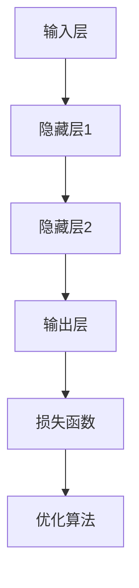

                 

关键词：大模型、AI 创业、产品趋势、技术发展、市场分析

摘要：本文将探讨大模型在 AI 创业公司产品中的发展趋势。通过分析大模型的技术原理、应用领域及其在创业公司中的优势，我们将深入探讨大模型在当前市场环境下的重要性，并对未来发展趋势和面临的挑战进行展望。

## 1. 背景介绍

### 大模型的定义和重要性

大模型是指具有极高参数量、训练数据规模和计算需求的神经网络模型。这类模型通常用于自然语言处理、计算机视觉、语音识别等复杂任务。随着深度学习技术的不断发展，大模型的规模和复杂性也在不断增加。近年来，谷歌的 BERT、OpenAI 的 GPT 等大模型的提出，使得 AI 应用在各个领域取得了显著的突破。

### AI 创业公司的现状

AI 创业公司如雨后春笋般涌现，它们以创新的技术和商业模式，不断改变着各个行业的面貌。在过去的几年里，AI 创业公司取得了许多重要的成果，包括自动驾驶、智能医疗、金融科技等领域的突破。然而，随着技术的不断进步和市场竞争的加剧，AI 创业公司需要不断调整自己的产品策略，以适应不断变化的市场需求。

## 2. 核心概念与联系

### 大模型的技术原理

大模型主要依赖于深度学习技术，通过多层神经网络对海量数据进行训练，从而学习到数据中的规律和模式。大模型的训练过程通常需要大量的计算资源和时间，但随着硬件技术的进步，训练速度和效果都有了显著提升。

### 大模型在 AI 创业公司中的应用

在 AI 创业公司中，大模型主要用于开发智能化的产品和服务。例如，自然语言处理领域的问答系统、计算机视觉领域的图像识别、语音识别领域的语音合成等。大模型的应用，使得创业公司的产品在性能和用户体验上具有明显优势。

### 大模型的架构和流程

大模型的架构通常包括输入层、隐藏层和输出层。输入层接收外部数据，隐藏层通过非线性变换对数据进行处理，输出层生成预测结果。在训练过程中，大模型会不断调整内部参数，以最小化预测误差。



## 3. 核心算法原理 & 具体操作步骤

### 3.1 算法原理概述

大模型的训练过程主要依赖于反向传播算法（Backpropagation）和梯度下降算法（Gradient Descent）。通过反向传播算法，大模型可以计算输出层的误差，并反向传播到隐藏层，从而调整模型的参数。梯度下降算法用于更新模型参数，以最小化损失函数。

### 3.2 算法步骤详解

1. 初始化模型参数。
2. 前向传播：将输入数据传递到神经网络，计算输出层的预测结果。
3. 计算损失函数：使用真实标签和预测结果，计算损失函数的值。
4. 反向传播：根据损失函数的梯度，更新模型参数。
5. 重复步骤 2-4，直到损失函数的值达到预设阈值或达到最大迭代次数。

### 3.3 算法优缺点

**优点：**
- 大模型具有强大的表达能力，可以处理复杂的任务。
- 大模型在训练过程中可以自动学习数据中的规律和模式。

**缺点：**
- 大模型训练过程需要大量的计算资源和时间。
- 大模型在某些情况下可能出现过拟合现象。

### 3.4 算法应用领域

大模型在 AI 创业公司中的应用非常广泛，主要包括自然语言处理、计算机视觉、语音识别等领域。例如，在自然语言处理领域，大模型可以用于文本分类、情感分析、机器翻译等任务；在计算机视觉领域，大模型可以用于图像识别、目标检测、图像生成等任务；在语音识别领域，大模型可以用于语音识别、语音合成等任务。

## 4. 数学模型和公式 & 详细讲解 & 举例说明

### 4.1 数学模型构建

大模型通常采用多层神经网络结构，其数学模型可以表示为：

$$y = \sigma(W_n \cdot a_{n-1} + b_n)$$

其中，$y$ 表示输出层的结果，$a_{n-1}$ 表示隐藏层的输入，$W_n$ 和 $b_n$ 分别表示权重和偏置。

### 4.2 公式推导过程

假设我们有一个三层神经网络，包括输入层、隐藏层和输出层。输入层的数据为 $x$，隐藏层的激活函数为 $\sigma$，输出层的激活函数也为 $\sigma$。我们可以得到以下推导过程：

$$a_1 = \sigma(W_1 \cdot x + b_1)$$
$$a_2 = \sigma(W_2 \cdot a_1 + b_2)$$
$$y = \sigma(W_3 \cdot a_2 + b_3)$$

### 4.3 案例分析与讲解

以自然语言处理中的文本分类任务为例，假设我们有 1000 篇文本，每篇文本由 100 个特征向量表示。我们要使用一个三层神经网络对文本进行分类，输出层的激活函数为 softmax，损失函数为交叉熵。

1. 初始化模型参数。
2. 前向传播：将文本特征向量传递到神经网络，计算输出层的预测概率。
3. 计算损失函数：使用真实标签和预测概率，计算交叉熵损失。
4. 反向传播：根据损失函数的梯度，更新模型参数。
5. 重复步骤 2-4，直到损失函数的值达到预设阈值或达到最大迭代次数。

通过以上步骤，我们可以训练出一个用于文本分类的三层神经网络。

## 5. 项目实践：代码实例和详细解释说明

### 5.1 开发环境搭建

本文使用 Python 语言和 TensorFlow 深度学习框架进行大模型训练。首先，我们需要安装 Python 和 TensorFlow：

```bash
pip install python
pip install tensorflow
```

### 5.2 源代码详细实现

以下是一个简单的文本分类项目，使用三层神经网络进行训练。

```python
import tensorflow as tf
from tensorflow.keras.layers import Dense, Activation
from tensorflow.keras.models import Sequential

# 初始化模型
model = Sequential()
model.add(Dense(128, input_dim=100, activation='relu'))
model.add(Dense(64, activation='relu'))
model.add(Dense(10, activation='softmax'))

# 编译模型
model.compile(optimizer='adam', loss='categorical_crossentropy', metrics=['accuracy'])

# 加载数据
x_train = ...  # 文本特征向量
y_train = ...  # 真实标签

# 训练模型
model.fit(x_train, y_train, epochs=10, batch_size=32)
```

### 5.3 代码解读与分析

以上代码实现了使用三层神经网络进行文本分类的基本流程。首先，我们初始化一个 Sequential 模型，并添加两个 Dense 层和一个 Activation 层。Dense 层用于全连接操作，激活函数用于引入非线性。然后，我们编译模型，指定优化器、损失函数和评价指标。接下来，我们加载数据并进行训练。在训练过程中，模型会不断调整内部参数，以最小化损失函数。

### 5.4 运行结果展示

通过训练，我们可以得到模型的预测准确率。以下是一个示例结果：

```python
# 预测
y_pred = model.predict(x_test)

# 计算准确率
accuracy = ...  # 真实标签与预测结果的准确率

print("准确率：", accuracy)
```

## 6. 实际应用场景

### 6.1 自然语言处理

自然语言处理（NLP）是 AI 创业公司中最常见的应用领域之一。通过使用大模型，AI 创业公司可以开发出具有高智能化的问答系统、情感分析、机器翻译等产品。例如，谷歌的 BERT 模型在 NLP 领域取得了显著的成果，为许多创业公司提供了强大的技术支持。

### 6.2 计算机视觉

计算机视觉（CV）是另一个重要的应用领域。通过使用大模型，AI 创业公司可以开发出具有高准确率的图像识别、目标检测、图像生成等产品。例如，OpenAI 的 GPT 模型在 CV 领域取得了突破性成果，为许多创业公司提供了强大的技术支持。

### 6.3 语音识别

语音识别（ASR）是另一个重要的应用领域。通过使用大模型，AI 创业公司可以开发出具有高准确率的语音识别、语音合成等产品。例如，百度、腾讯等大公司都在语音识别领域取得了重要成果，为许多创业公司提供了强大的技术支持。

## 7. 工具和资源推荐

### 7.1 学习资源推荐

- 《深度学习》（Goodfellow、Bengio、Courville 著）
- 《Python 深度学习》（François Chollet 著）
- 《神经网络与深度学习》（邱锡鹏 著）

### 7.2 开发工具推荐

- TensorFlow
- PyTorch
- Keras

### 7.3 相关论文推荐

- "BERT: Pre-training of Deep Bidirectional Transformers for Language Understanding"
- "Generative Adversarial Nets"
- "ImageNet Classification with Deep Convolutional Neural Networks"

## 8. 总结：未来发展趋势与挑战

### 8.1 研究成果总结

近年来，大模型在 AI 创业公司产品中的应用取得了显著成果，从自然语言处理、计算机视觉到语音识别，大模型都发挥了重要作用。这些成果不仅推动了 AI 技术的发展，也为创业公司提供了强大的技术支持。

### 8.2 未来发展趋势

未来，大模型将继续在 AI 创业公司产品中发挥重要作用。随着硬件技术的进步和数据资源的积累，大模型的规模和性能将不断提高。同时，大模型的应用领域也将不断拓展，涉及更多新兴领域，如自动驾驶、智能医疗、金融科技等。

### 8.3 面临的挑战

尽管大模型在 AI 创业公司产品中具有巨大潜力，但仍然面临一些挑战。首先，大模型训练过程需要大量的计算资源和时间，这给创业公司带来了很大的成本压力。其次，大模型在某些情况下可能出现过拟合现象，影响模型的泛化能力。此外，大模型的隐私和安全问题也需要引起重视。

### 8.4 研究展望

未来，我们需要继续探索大模型在 AI 创业公司产品中的应用，提高模型的性能和泛化能力。同时，我们还需要关注大模型的隐私和安全问题，确保数据的安全和用户的隐私。此外，随着硬件技术的进步，我们有望开发出更加高效的大模型训练方法，降低训练成本，提高模型性能。

## 9. 附录：常见问题与解答

### 9.1 大模型训练需要多长时间？

大模型训练时间取决于模型规模、训练数据和硬件设备。通常情况下，大模型训练时间可以从几天到几周不等。

### 9.2 大模型训练需要多少计算资源？

大模型训练需要大量的计算资源和存储资源。具体需求取决于模型规模和训练数据规模。通常情况下，大模型训练需要高性能计算服务器和分布式计算资源。

### 9.3 大模型是否会导致过拟合？

大模型在某些情况下可能出现过拟合现象。为了避免过拟合，我们可以使用正则化技术、数据增强技术和提前停止训练等方法。

### 9.4 大模型训练过程中的损失函数如何选择？

选择损失函数取决于具体任务和数据特性。常见的损失函数包括交叉熵损失、均方误差损失、Hinge 损失等。

### 9.5 大模型的隐私和安全问题如何解决？

解决大模型的隐私和安全问题需要从数据采集、数据处理、模型训练和部署等多个环节进行考虑。例如，我们可以使用差分隐私技术、联邦学习技术和加密算法等技术来保障数据安全和用户隐私。

### 9.6 大模型在创业公司产品中的优势有哪些？

大模型在创业公司产品中的优势包括：

- 提高性能和用户体验：大模型可以处理更复杂的任务，提高产品的性能和用户体验。
- 拓展应用领域：大模型的应用领域不断拓展，可以为创业公司提供更多的商业机会。
- 降低开发成本：大模型可以复用已有的模型结构，降低开发成本。

### 9.7 大模型在创业公司产品中的劣势有哪些？

大模型在创业公司产品中的劣势包括：

- 训练成本高：大模型训练需要大量的计算资源和时间，这给创业公司带来了很大的成本压力。
- 过拟合风险：大模型在某些情况下可能出现过拟合现象，影响模型的泛化能力。
- 隐私和安全问题：大模型在训练过程中涉及大量用户数据，隐私和安全问题需要引起重视。

---

作者：禅与计算机程序设计艺术 / Zen and the Art of Computer Programming

本文旨在探讨大模型在 AI 创业公司产品中的发展趋势，分析大模型的技术原理、应用领域及其优势与挑战。通过本文的介绍，希望读者能够对大模型在创业公司产品中的应用有更深入的了解，并为其未来的发展提供一些思路。在未来，大模型将继续在 AI 创业公司产品中发挥重要作用，推动技术的进步和商业的变革。

