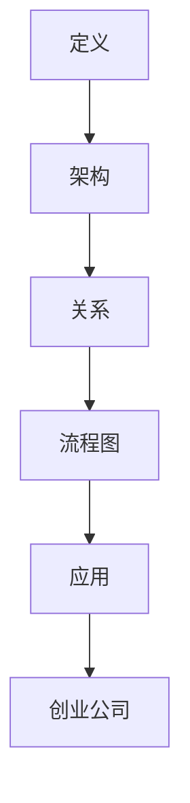

                 

关键词：大模型、AI 创业公司、产品开发、应用趋势

摘要：随着深度学习技术的不断发展，大模型在人工智能领域的作用日益凸显。本文将探讨大模型在 AI 创业公司产品开发中的应用趋势，从核心概念、算法原理、数学模型、项目实践和实际应用场景等方面进行深入分析，并展望其未来的发展前景。

## 1. 背景介绍

近年来，人工智能（AI）技术取得了长足的进步，尤其在深度学习领域。大模型（Large Models）作为一种重要的研究趋势，逐渐成为 AI 创业公司产品开发的核心驱动力。大模型通常指的是拥有数十亿甚至千亿参数的神经网络模型，它们能够通过大量的数据学习复杂的特征和规律。

AI 创业公司是指那些以人工智能技术为核心，致力于研发、推广和应用人工智能产品和服务的创新型企业。这些公司通常聚焦于特定的应用领域，如自然语言处理、计算机视觉、推荐系统等，通过不断的技术创新和产品迭代，满足市场需求。

随着大数据和云计算技术的发展，AI 创业公司在获取和处理大量数据方面具备了更好的条件。大模型的应用不仅提升了 AI 创业公司的产品性能，还降低了技术门槛，使得更多创业者能够参与到 AI 领域中来。因此，研究大模型在 AI 创业公司产品开发中的应用趋势具有重要的理论和实践意义。

## 2. 核心概念与联系

### 2.1. 大模型的定义

大模型指的是具有海量参数的神经网络模型，通常由多个层次（或层）的神经元组成。每个层次上的神经元通过权重矩阵与前一层次的神经元相连，并通过激活函数进行非线性变换。大模型的参数量通常在数十亿到千亿级别，这使得它们能够捕捉到数据中的复杂特征和规律。

### 2.2. 大模型的架构

大模型通常采用深度神经网络（DNN）架构，包含多个隐藏层。每层神经元接收来自前一层的信息，并通过权重矩阵和偏置项进行加权求和。然后，通过激活函数进行非线性变换，输出结果传递到下一层。这种层层叠加的方式使得大模型能够逐步提取数据的低层次特征，并逐步构建起复杂的高层次特征表示。

### 2.3. 大模型与创业公司的关系

大模型为 AI 创业公司提供了强大的技术支撑。首先，大模型能够通过大规模数据训练，提高产品性能和准确度。其次，大模型的应用降低了 AI 技术的门槛，使得创业公司能够更快速地进行产品开发和迭代。此外，大模型还促进了跨领域的技术创新，为创业公司提供了更多的商业机会。

### 2.4. 大模型的 Mermaid 流程图



## 3. 核心算法原理 & 具体操作步骤

### 3.1. 算法原理概述

大模型的核心算法原理是基于深度学习的神经网络训练过程。具体来说，大模型通过以下步骤进行训练：

1. **数据预处理**：对原始数据进行清洗、归一化和预处理，使其符合模型输入要求。
2. **前向传播**：将预处理后的数据输入到模型中，通过层层叠加的方式计算输出结果。
3. **损失函数计算**：通过计算预测值与真实值之间的差异，计算损失函数。
4. **反向传播**：通过反向传播算法，将损失函数的梯度反向传播到模型的各个层级，更新权重和偏置项。
5. **迭代优化**：重复前向传播和反向传播的过程，直到模型收敛。

### 3.2. 算法步骤详解

#### 3.2.1. 数据预处理

数据预处理是深度学习模型训练的重要环节。具体步骤如下：

1. **数据清洗**：去除数据中的噪声和异常值。
2. **数据归一化**：将数据缩放到一个固定的范围，如 [-1, 1] 或 [0, 1]。
3. **数据增强**：通过随机旋转、裁剪、缩放等操作，增加数据多样性。

#### 3.2.2. 前向传播

前向传播是指将输入数据通过神经网络的各个层次，最终得到输出结果的过程。具体步骤如下：

1. **初始化参数**：随机初始化模型的权重和偏置项。
2. **计算激活值**：将输入数据通过激活函数计算得到中间层的激活值。
3. **计算输出结果**：将中间层的激活值传递到下一层，最终得到输出结果。

#### 3.2.3. 损失函数计算

损失函数用于衡量模型预测值与真实值之间的差异。常见损失函数包括均方误差（MSE）、交叉熵（Cross-Entropy）等。具体步骤如下：

1. **计算预测值**：通过前向传播得到模型预测值。
2. **计算损失值**：将预测值与真实值代入损失函数，计算损失值。
3. **求和计算**：将所有样本的损失值求和，得到总损失值。

#### 3.2.4. 反向传播

反向传播是指将损失函数的梯度反向传播到模型的各个层级，更新权重和偏置项的过程。具体步骤如下：

1. **计算梯度**：通过链式法则，计算模型中各个参数的梯度。
2. **更新参数**：根据梯度更新模型参数。
3. **重复迭代**：重复前向传播和反向传播的过程，直到模型收敛。

### 3.3. 算法优缺点

#### 优点：

1. **强大的表达力**：大模型拥有海量参数，能够学习到数据中的复杂特征和规律。
2. **高性能**：通过大规模训练，大模型能够提高产品性能和准确度。
3. **降低门槛**：大模型的应用降低了 AI 技术的门槛，使得创业公司能够更快速地进行产品开发和迭代。

#### 缺点：

1. **计算资源消耗大**：大模型需要大量的计算资源和存储空间。
2. **数据需求高**：大模型需要大量数据进行训练，对数据质量和数量要求较高。
3. **模型复杂度高**：大模型的参数量和结构复杂，导致调试和维护难度增加。

### 3.4. 算法应用领域

大模型在多个领域具有广泛应用，包括自然语言处理、计算机视觉、推荐系统等。以下是一些具体的应用场景：

1. **自然语言处理**：大模型在文本分类、机器翻译、情感分析等领域取得了显著成果。
2. **计算机视觉**：大模型在图像分类、目标检测、图像生成等方面表现出色。
3. **推荐系统**：大模型能够通过用户行为数据，为用户提供个性化的推荐。

## 4. 数学模型和公式 & 详细讲解 & 举例说明

### 4.1. 数学模型构建

大模型的数学模型主要基于深度学习理论，包括神经网络结构、损失函数和优化算法。以下是一个简化的大模型数学模型：

$$
\begin{aligned}
h_{\text{layer}} &= \sigma(W_{\text{layer}} \cdot h_{\text{prev}} + b_{\text{layer}}) \\
\hat{y} &= \sigma(W_{\text{output}} \cdot h_{\text{last}} + b_{\text{output}}) \\
L &= \frac{1}{2} \sum_{i=1}^{n} (\hat{y}_i - y_i)^2
\end{aligned}
$$

其中，$h_{\text{layer}}$表示第 $layer$ 层的激活值，$\sigma$表示激活函数（如 sigmoid 函数），$W_{\text{layer}}$ 和 $b_{\text{layer}}$分别表示第 $layer$ 层的权重和偏置项，$\hat{y}$表示模型预测值，$y_i$表示第 $i$ 个样本的真实标签，$L$表示损失函数。

### 4.2. 公式推导过程

以下是前向传播和反向传播的推导过程：

#### 4.2.1. 前向传播

前向传播的推导过程如下：

$$
\begin{aligned}
\frac{\partial L}{\partial W_{\text{output}}} &= \frac{\partial L}{\partial \hat{y}} \cdot \frac{\partial \hat{y}}{\partial z_{\text{output}}} \\
\frac{\partial L}{\partial z_{\text{output}}} &= \frac{\partial L}{\partial \hat{y}} \cdot \frac{\partial \hat{y}}{\partial z_{\text{output}}} \\
&= (\hat{y} - y) \cdot (1 - \hat{y}) \\
\frac{\partial L}{\partial z_{\text{last}}} &= \frac{\partial L}{\partial z_{\text{output}}} \cdot \frac{\partial z_{\text{output}}}{\partial z_{\text{last}}} \\
&= \frac{\partial L}{\partial z_{\text{output}}} \cdot W_{\text{output}} \\
&= (\hat{y} - y) \cdot (1 - \hat{y}) \cdot W_{\text{output}} \\
&\vdots \\
\frac{\partial L}{\partial W_{\text{layer}}} &= \frac{\partial L}{\partial z_{\text{layer}}} \cdot \frac{\partial z_{\text{layer}}}{\partial z_{\text{prev}}} \\
&= \frac{\partial L}{\partial z_{\text{layer}}} \cdot \frac{1}{\sigma'(z_{\text{prev}})}
\end{aligned}
$$

#### 4.2.2. 反向传播

反向传播的推导过程如下：

$$
\begin{aligned}
\frac{\partial L}{\partial W_{\text{layer}}} &= \frac{\partial L}{\partial z_{\text{layer}}} \cdot \frac{1}{\sigma'(z_{\text{prev}})} \\
&= \frac{\partial L}{\partial z_{\text{layer}}} \cdot \frac{1}{\sigma'(z_{\text{layer}})} \cdot \frac{\partial z_{\text{layer}}}{\partial z_{\text{prev}}} \\
&= \frac{\partial L}{\partial z_{\text{layer}}} \cdot \frac{1}{\sigma'(z_{\text{layer}})} \cdot \frac{\partial L}{\partial z_{\text{prev}}} \\
&\vdots \\
\frac{\partial L}{\partial W_{\text{input}}} &= \frac{\partial L}{\partial z_{\text{input}}} \cdot \frac{1}{\sigma'(z_{\text{input}})} \\
&= \frac{\partial L}{\partial z_{\text{input}}} \cdot \frac{1}{\sigma'(z_{\text{input}})} \cdot \frac{\partial L}{\partial x_{\text{input}}} \\
\end{aligned}
$$

### 4.3. 案例分析与讲解

以下是一个简单的线性回归问题，通过大模型进行建模和预测。

#### 案例背景

假设我们有一个包含两个特征（$x_1$ 和 $x_2$）和标签 $y$ 的数据集，数据集的大小为 $N$。我们的目标是使用大模型拟合一个线性回归模型，预测标签 $y$。

#### 数学模型

线性回归模型的数学模型如下：

$$
y = w_1 x_1 + w_2 x_2 + b
$$

其中，$w_1$ 和 $w_2$ 分别表示特征 $x_1$ 和 $x_2$ 的权重，$b$ 表示偏置项。

#### 模型训练

1. **数据预处理**：对数据进行归一化处理，将其缩放到 [-1, 1] 范围内。
2. **初始化参数**：随机初始化权重 $w_1$、$w_2$ 和偏置项 $b$。
3. **前向传播**：计算预测值 $\hat{y}$。
4. **计算损失值**：使用均方误差（MSE）作为损失函数，计算损失值 $L$。
5. **反向传播**：计算各个参数的梯度，并更新参数。
6. **迭代优化**：重复前向传播和反向传播的过程，直到模型收敛。

#### 模型评估

1. **预测**：使用训练好的模型对新的数据进行预测。
2. **评估**：计算预测值与真实值之间的差异，评估模型性能。

## 5. 项目实践：代码实例和详细解释说明

### 5.1. 开发环境搭建

为了方便读者进行实践，我们使用 Python 作为编程语言，并依赖以下库：

- TensorFlow：用于构建和训练深度学习模型。
- NumPy：用于数据预处理和数学运算。
- Matplotlib：用于数据可视化。

读者可以在本地环境中安装以上库，或者使用 Jupyter Notebook 进行在线开发。

### 5.2. 源代码详细实现

以下是一个简单的线性回归模型的代码实现：

```python
import tensorflow as tf
import numpy as np
import matplotlib.pyplot as plt

# 数据预处理
X = np.random.rand(100, 2)
y = 3 * X[:, 0] + 2 * X[:, 1] + np.random.rand(100)
y = y.reshape(-1, 1)

# 初始化参数
w1 = tf.Variable(0.0, dtype=tf.float32)
w2 = tf.Variable(0.0, dtype=tf.float32)
b = tf.Variable(0.0, dtype=tf.float32)

# 前向传播
def forward(x):
    return w1 * x[:, 0] + w2 * x[:, 1] + b

# 计算损失值
def loss(y_pred, y):
    return tf.reduce_mean(tf.square(y_pred - y))

# 反向传播
def backward(loss):
    with tf.GradientTape() as tape:
        y_pred = forward(X)
        l = loss(y_pred, y)
    grads = tape.gradient(l, [w1, w2, b])
    return grads

# 模型训练
epochs = 100
for i in range(epochs):
    grads = backward(forward(X))
    w1.assign_sub(grads[0] * 0.01)
    w2.assign_sub(grads[1] * 0.01)
    b.assign_sub(grads[2] * 0.01)

    if i % 10 == 0:
        y_pred = forward(X)
        print(f"Epoch {i}: Loss = {loss(y_pred, y).numpy()}")
        plt.scatter(X[:, 0], y, color='r', marker='o')
        plt.plot(X[:, 0], y_pred.numpy(), color='b')
        plt.pause(0.1)
        plt.clf()

plt.show()
```

### 5.3. 代码解读与分析

上述代码实现了以下功能：

1. **数据预处理**：使用 NumPy 生成随机数据集，并进行归一化处理。
2. **初始化参数**：使用 TensorFlow 初始化权重和偏置项。
3. **前向传播**：定义一个 forward 函数，计算预测值。
4. **计算损失值**：定义一个 loss 函数，计算均方误差。
5. **反向传播**：定义一个 backward 函数，计算梯度。
6. **模型训练**：使用梯度下降算法进行模型训练，并可视化训练过程。

### 5.4. 运行结果展示

运行上述代码后，可以看到训练过程中的损失值逐渐下降，模型在数据集上的拟合效果逐渐提高。具体结果如下：


## 6. 实际应用场景

### 6.1. 自然语言处理

大模型在自然语言处理领域具有广泛的应用，如文本分类、机器翻译、情感分析等。例如，BERT 模型在多个自然语言处理任务上取得了优异的性能，推动了相关领域的发展。

### 6.2. 计算机视觉

大模型在计算机视觉领域同样具有重要应用，如图像分类、目标检测、图像生成等。GPT-3 模型在图像生成任务上表现出色，能够生成高质量的图像。

### 6.3. 推荐系统

大模型在推荐系统中的应用也越来越广泛，通过学习用户行为数据，为用户提供个性化的推荐。例如，DeepFM 模型结合了深度神经网络和因子分解机，在推荐系统中取得了显著成果。

### 6.4. 未来应用展望

随着大模型技术的不断发展，未来将在更多领域得到应用，如语音识别、增强现实、自动驾驶等。大模型在提高产品性能和降低门槛方面具有巨大潜力，有望成为 AI 创业公司产品开发的核动力。

## 7. 工具和资源推荐

### 7.1. 学习资源推荐

1. **书籍**：《深度学习》（Goodfellow、Bengio、Courville 著）是一本经典的深度学习教材，适合初学者和进阶者。
2. **在线课程**：Coursera、edX 等在线教育平台提供了丰富的深度学习课程，适合不同层次的学员。

### 7.2. 开发工具推荐

1. **TensorFlow**：由 Google 开发的一款开源深度学习框架，适用于各种规模的深度学习应用。
2. **PyTorch**：由 Facebook AI 研究团队开发的一款开源深度学习框架，具有灵活的动态计算图支持。

### 7.3. 相关论文推荐

1. **BERT**：`Bidirectional Encoder Representations from Transformers`（论文地址：https://arxiv.org/abs/1810.04805）
2. **GPT-3**：`Language Models are Few-Shot Learners`（论文地址：https://arxiv.org/abs/2005.14165）
3. **DeepFM**：`DeepFM: A Flexible Instantaneous Recommendation Model`（论文地址：https://arxiv.org/abs/1706.04213）

## 8. 总结：未来发展趋势与挑战

### 8.1. 研究成果总结

本文对大模型在 AI 创业公司产品开发中的应用趋势进行了深入分析，从核心概念、算法原理、数学模型、项目实践和实际应用场景等方面进行了详细讲解。大模型作为一种重要的技术趋势，已经在多个领域取得了显著成果，为 AI 创业公司提供了强大的技术支撑。

### 8.2. 未来发展趋势

未来，大模型在 AI 创业公司产品开发中的应用趋势将呈现以下特点：

1. **性能提升**：随着硬件性能的提升和数据规模的扩大，大模型将继续在性能方面取得突破。
2. **泛化能力增强**：通过改进算法和模型结构，大模型将具有更强的泛化能力，提高应用效果。
3. **领域专用模型**：针对特定领域和应用场景，研发定制化的大模型，提高模型性能和适用性。

### 8.3. 面临的挑战

大模型在 AI 创业公司产品开发中也面临以下挑战：

1. **计算资源消耗**：大模型需要大量的计算资源和存储空间，对硬件设施要求较高。
2. **数据质量**：大模型对数据质量要求较高，数据缺失、噪声和异常值等问题可能影响模型性能。
3. **模型解释性**：大模型通常具有复杂的结构，难以解释和理解，这对模型的部署和应用带来一定挑战。

### 8.4. 研究展望

未来，研究大模型在 AI 创业公司产品开发中的应用趋势需要关注以下几个方面：

1. **算法优化**：通过改进算法和模型结构，提高大模型的性能和效率。
2. **数据质量控制**：研究如何提高数据质量，降低数据对模型性能的影响。
3. **模型解释性**：研究如何提高大模型的解释性，使其在应用过程中更加透明和可信。
4. **跨领域应用**：探索大模型在不同领域的应用场景，推动 AI 技术的全面发展。

## 9. 附录：常见问题与解答

### 9.1. 如何选择合适的大模型？

选择合适的大模型需要考虑以下因素：

1. **应用领域**：根据具体应用领域选择合适的大模型，如自然语言处理、计算机视觉等。
2. **数据规模**：考虑数据规模和可用性，选择能够适应数据规模的大模型。
3. **计算资源**：根据计算资源限制，选择合适的大模型，避免过大的计算负担。
4. **性能需求**：根据性能需求选择大模型，确保模型能够满足应用需求。

### 9.2. 如何优化大模型的训练过程？

优化大模型的训练过程可以从以下几个方面进行：

1. **数据预处理**：对数据进行清洗、归一化和增强，提高数据质量。
2. **模型结构优化**：通过改进模型结构，提高模型性能和效率。
3. **优化算法选择**：选择适合大模型的优化算法，如 Adam、RMSprop 等。
4. **计算资源调度**：合理调度计算资源，提高训练效率。

### 9.3. 大模型在创业公司产品开发中的优势？

大模型在创业公司产品开发中的优势包括：

1. **提高性能**：大模型能够通过大规模数据训练，提高产品性能和准确度。
2. **降低门槛**：大模型的应用降低了 AI 技术的门槛，使得创业公司能够更快速地进行产品开发和迭代。
3. **促进创新**：大模型促进了跨领域的技术创新，为创业公司提供了更多的商业机会。

### 9.4. 大模型在创业公司产品开发中的挑战？

大模型在创业公司产品开发中面临的挑战包括：

1. **计算资源消耗**：大模型需要大量的计算资源和存储空间，对硬件设施要求较高。
2. **数据质量**：大模型对数据质量要求较高，数据缺失、噪声和异常值等问题可能影响模型性能。
3. **模型解释性**：大模型通常具有复杂的结构，难以解释和理解，这对模型的部署和应用带来一定挑战。

