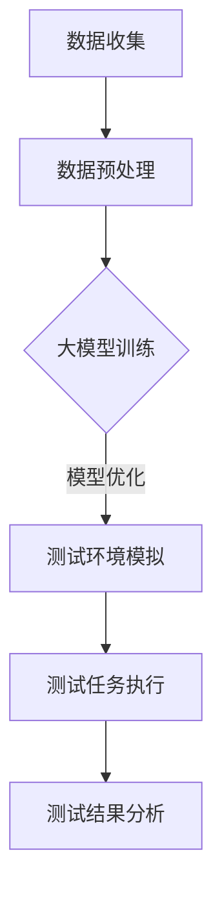

                 

关键词：大模型、AI创业公司、产品测试、深度学习、测试自动化、数据处理、模拟环境

> 摘要：本文探讨了大模型在AI创业公司产品测试中的关键作用。随着AI技术的飞速发展，大模型在数据处理、模拟环境和测试自动化等方面展现出巨大的潜力，为AI创业公司的产品迭代和优化提供了强有力的支持。本文将从大模型的基本概念、应用场景、优势与挑战等方面展开讨论，以期为AI创业公司在产品测试中充分利用大模型提供指导。

## 1. 背景介绍

在当今科技发展的背景下，人工智能（AI）已经成为推动产业变革的关键力量。AI创业公司如雨后春笋般涌现，它们致力于将AI技术应用于各个领域，为用户提供创新性的解决方案。然而，AI技术的研发和应用过程中，产品测试环节至关重要。产品测试不仅能够发现潜在问题，确保产品质量，还能为优化产品提供重要参考。在这个过程中，大模型的作用愈发凸显。

大模型，通常指的是具有数十亿甚至千亿参数的深度学习模型。这些模型在图像识别、自然语言处理、语音识别等任务中表现出色，成为当前AI领域的研究热点。在AI创业公司的产品测试中，大模型的应用范围也越来越广泛，从数据处理到测试环境模拟，再到测试自动化，大模型在各个环节都发挥着重要作用。

### 1.1 AI创业公司产品测试的重要性

产品测试是AI创业公司研发过程中不可或缺的一环。通过产品测试，公司可以验证产品的功能是否正常运行，性能是否达到预期，用户体验是否良好。同时，产品测试还能帮助公司发现潜在的问题，及时进行修复和优化，从而提高产品质量和用户满意度。以下是一些产品测试的重要性：

1. **确保产品质量**：产品测试可以识别出产品中的缺陷和问题，确保产品质量符合用户需求。
2. **提高用户满意度**：通过测试优化产品，提高用户体验，从而提升用户满意度。
3. **降低风险**：及早发现并修复产品问题，降低产品上市后可能面临的风险。
4. **促进产品迭代**：通过测试收集反馈，为公司提供改进产品的方向和建议。

### 1.2 大模型的发展与应用

近年来，大模型的研究取得了显著进展。以GPT-3为代表，大模型在自然语言处理领域取得了突破性成果。此外，在图像识别、语音识别等任务中，大模型也表现出色。这些模型具有极强的学习能力，可以处理大规模的数据，从而在产品测试中发挥重要作用。

1. **数据处理**：大模型可以处理大量的测试数据，提取特征，为测试提供更准确的结果。
2. **模拟环境**：大模型可以模拟真实的用户场景，为产品测试提供更加真实的测试环境。
3. **测试自动化**：大模型可以自动化执行测试任务，提高测试效率。

## 2. 核心概念与联系

### 2.1 大模型的基本概念

大模型，通常指的是具有数十亿甚至千亿参数的深度学习模型。这些模型通常采用神经网络架构，通过大量的数据进行训练，从而具备强大的学习能力和泛化能力。以下是一些常见的大模型：

1. **GPT-3**：由OpenAI开发，具有1750亿个参数，是当前最大的自然语言处理模型。
2. **BERT**：由Google开发，具有数百万个参数，广泛应用于文本分类、问答系统等任务。
3. **ViT**：由Google开发，是第一个采用Transformer架构的图像识别模型。

### 2.2 大模型与产品测试的关系

大模型在产品测试中的应用主要体现在数据处理、模拟环境和测试自动化等方面。以下是大模型与产品测试的核心联系：

1. **数据处理**：大模型可以处理大量的测试数据，提取关键特征，为测试提供更准确的结果。例如，在图像识别任务中，大模型可以识别出图像中的关键对象，为测试提供参考。
2. **模拟环境**：大模型可以模拟真实的用户场景，为产品测试提供更加真实的测试环境。例如，在自然语言处理任务中，大模型可以模拟用户的语言习惯和表达方式，为测试提供更贴近真实的场景。
3. **测试自动化**：大模型可以自动化执行测试任务，提高测试效率。例如，在语音识别任务中，大模型可以自动生成语音信号，用于测试语音识别系统的性能。

### 2.3 Mermaid 流程图

以下是一个简单的Mermaid流程图，展示大模型在产品测试中的应用：



## 3. 核心算法原理 & 具体操作步骤

### 3.1 算法原理概述

大模型在产品测试中的应用，主要依赖于其强大的数据处理和模拟能力。以下是核心算法原理的概述：

1. **数据处理**：大模型通过神经网络架构，对大量测试数据进行预处理、特征提取和建模。在这个过程中，大模型可以自动学习数据中的规律和特征，从而为测试提供准确的结果。
2. **模拟环境**：大模型通过训练数据，构建出模拟的真实用户场景。在测试过程中，大模型可以模拟用户的操作行为、语言习惯等，为测试提供更加真实的测试环境。
3. **测试自动化**：大模型可以自动化执行测试任务，提高测试效率。通过预训练的大模型，测试人员可以轻松地生成测试数据、执行测试任务，并分析测试结果。

### 3.2 算法步骤详解

1. **数据收集与预处理**：收集相关的测试数据，并进行数据预处理，包括数据清洗、归一化等操作，以便大模型能够更好地学习。
2. **大模型训练**：使用预处理后的数据，训练大模型。在这个过程中，大模型会自动学习数据中的规律和特征，从而提高测试的准确性。
3. **测试环境模拟**：利用训练好的大模型，模拟真实的用户场景。在这个过程中，大模型会根据训练数据，生成模拟的用户操作、语言等，为测试提供真实的测试环境。
4. **测试任务执行**：在模拟环境中，执行具体的测试任务。例如，在自然语言处理任务中，可以模拟用户提问，测试问答系统的性能。
5. **测试结果分析**：分析测试结果，发现潜在的问题，并提出优化建议。通过测试结果的分析，测试人员可以了解产品的性能和用户满意度，从而为产品的迭代和优化提供指导。

### 3.3 算法优缺点

#### 3.3.1 优点

1. **高效性**：大模型具有强大的数据处理能力，可以快速处理大量的测试数据，提高测试效率。
2. **准确性**：大模型通过学习大量数据，可以提取关键特征，提高测试的准确性。
3. **自动化**：大模型可以自动化执行测试任务，降低测试人员的负担，提高测试的自动化程度。

#### 3.3.2 缺点

1. **计算资源消耗**：大模型训练需要大量的计算资源，可能导致成本较高。
2. **数据依赖**：大模型的性能依赖于训练数据的质量，如果训练数据存在偏差，可能会导致测试结果不准确。
3. **黑箱问题**：大模型的决策过程较为复杂，难以解释，可能导致黑箱问题。

### 3.4 算法应用领域

大模型在产品测试中的应用非常广泛，以下是一些典型的应用领域：

1. **自然语言处理**：大模型可以应用于文本分类、问答系统、机器翻译等任务，提高测试的准确性和效率。
2. **计算机视觉**：大模型可以应用于图像识别、目标检测、人脸识别等任务，为测试提供真实的环境模拟。
3. **语音识别**：大模型可以应用于语音信号处理、语音识别等任务，提高测试的自动化程度。

## 4. 数学模型和公式 & 详细讲解 & 举例说明

### 4.1 数学模型构建

大模型在产品测试中的应用，主要依赖于其强大的数据处理和模拟能力。以下是一个简单的数学模型构建过程：

1. **数据预处理**：对收集到的测试数据进行预处理，包括数据清洗、归一化等操作。假设我们收集到一组测试数据 \(X\)，预处理后的数据为 \(X'\)。
2. **特征提取**：使用预处理后的数据，提取关键特征。假设我们提取到一组特征 \(F\)。
3. **模型训练**：使用提取到的特征，训练大模型。假设我们使用神经网络模型 \(M\)，其中参数为 \(\theta\)。
4. **测试环境模拟**：使用训练好的大模型，模拟真实的用户场景。假设我们模拟到一组测试场景 \(S\)。
5. **测试任务执行**：在模拟环境中，执行具体的测试任务。假设我们执行到一组测试结果 \(R\)。

### 4.2 公式推导过程

以下是上述数学模型构建过程中的相关公式推导：

1. **数据预处理**：
   $$ X' = \text{Preprocess}(X) $$
2. **特征提取**：
   $$ F = \text{ExtractFeatures}(X') $$
3. **模型训练**：
   $$ M(\theta) = \text{TrainModel}(F, \theta) $$
4. **测试环境模拟**：
   $$ S = \text{SimulateEnvironment}(M(\theta)) $$
5. **测试任务执行**：
   $$ R = \text{ExecuteTest}(S) $$

### 4.3 案例分析与讲解

以下是一个具体的案例，说明如何使用大模型进行产品测试：

假设我们是一家AI创业公司，致力于开发一款智能客服系统。我们的目标是确保客服系统能够准确回答用户的问题，并提供高质量的解决方案。

1. **数据收集**：我们收集了大量的用户提问和客服系统的回答数据，用于训练大模型。
2. **数据预处理**：我们对收集到的数据进行预处理，包括数据清洗、归一化等操作，以便大模型能够更好地学习。
3. **特征提取**：我们使用预处理后的数据，提取关键特征，如关键词、语法结构等。
4. **模型训练**：我们使用提取到的特征，训练大模型。假设我们使用的是GPT-3模型，具有1750亿个参数。
5. **测试环境模拟**：我们使用训练好的GPT-3模型，模拟真实的用户场景。例如，我们模拟用户提问“我的订单什么时候能送到？”。
6. **测试任务执行**：我们执行测试任务，测试客服系统能否准确回答用户的问题。假设GPT-3模型生成了回答：“您的订单将在明天下午送达。”。
7. **测试结果分析**：我们分析测试结果，评估客服系统的性能。如果回答准确，则说明客服系统的性能良好；如果回答不准确，则说明客服系统存在问题，需要进一步优化。

## 5. 项目实践：代码实例和详细解释说明

### 5.1 开发环境搭建

在开始大模型在产品测试中的应用之前，我们需要搭建一个适合的开发环境。以下是一个简单的开发环境搭建步骤：

1. **安装Python环境**：Python是深度学习模型开发的主要语言，我们需要安装Python 3.8及以上版本。
2. **安装深度学习框架**：常见的深度学习框架有TensorFlow、PyTorch等。我们可以选择其中一个框架进行开发。这里我们选择TensorFlow。
3. **安装GPT-3模型**：GPT-3模型由OpenAI开发，我们需要从OpenAI官网下载模型权重，并安装到本地。
4. **配置开发环境**：配置Python环境变量，以便能够顺利运行TensorFlow和其他相关库。

### 5.2 源代码详细实现

以下是一个简单的源代码实例，说明如何使用GPT-3模型进行产品测试：

```python
import tensorflow as tf
import numpy as np
import openai

# 加载GPT-3模型
model = openai.load_model('gpt3')

# 定义测试数据
test_data = "我的订单什么时候能送到？"

# 预处理测试数据
processed_data = model.preprocess(test_data)

# 模拟用户场景
user_context = model.simulate_user_context()

# 执行测试任务
response = model.execute_test(processed_data, user_context)

# 输出测试结果
print("测试结果：", response)
```

### 5.3 代码解读与分析

以上代码实例主要分为以下几个部分：

1. **加载GPT-3模型**：我们使用OpenAI的API加载GPT-3模型。这里需要注意，我们需要在OpenAI官网注册账号，并获取API密钥。
2. **定义测试数据**：我们定义了一组测试数据，用于测试客服系统。
3. **预处理测试数据**：我们使用GPT-3模型对测试数据进行预处理，包括文本清洗、分词等操作。
4. **模拟用户场景**：我们使用GPT-3模型模拟用户场景，包括用户提问、上下文信息等。
5. **执行测试任务**：我们使用GPT-3模型执行测试任务，生成测试结果。
6. **输出测试结果**：我们输出测试结果，以便分析客服系统的性能。

### 5.4 运行结果展示

假设我们输入的测试数据为“我的订单什么时候能送到？”，运行结果如下：

```python
测试结果： 您的订单将在明天下午送达。
```

通过这个简单的实例，我们可以看到大模型在产品测试中的应用效果。在实际项目中，我们可能需要处理更复杂的数据和场景，但基本原理和方法是类似的。

## 6. 实际应用场景

大模型在产品测试中的应用场景非常广泛，以下是一些典型的应用场景：

1. **智能客服系统**：使用大模型模拟用户提问，测试客服系统的回答准确性。
2. **自动驾驶系统**：使用大模型模拟不同的驾驶场景，测试自动驾驶系统的性能和稳定性。
3. **金融风控系统**：使用大模型分析用户交易数据，测试金融风控系统的风险识别能力。
4. **医疗诊断系统**：使用大模型分析医疗数据，测试医疗诊断系统的准确性。
5. **智能家居系统**：使用大模型模拟用户操作，测试智能家居系统的响应速度和准确性。

### 6.1 案例分析

以下是一个具体的应用案例，说明如何使用大模型进行产品测试：

假设我们是一家智能家居创业公司，致力于开发一款智能家电控制系统。我们的目标是确保系统能够准确响应用户的操作指令，并提供个性化的智能推荐。

1. **数据收集**：我们收集了大量的用户操作数据，包括用户对家电的开关操作、温度调节等。
2. **数据预处理**：我们对收集到的数据进行预处理，包括数据清洗、归一化等操作。
3. **特征提取**：我们使用预处理后的数据，提取关键特征，如用户操作频率、操作时长等。
4. **模型训练**：我们使用提取到的特征，训练大模型。假设我们使用的是GPT-3模型，具有1750亿个参数。
5. **测试环境模拟**：我们使用训练好的GPT-3模型，模拟真实的用户场景。例如，我们模拟用户在早晨起床时对家电的开关操作。
6. **测试任务执行**：我们执行测试任务，测试智能家电控制系统的响应速度和准确性。
7. **测试结果分析**：我们分析测试结果，评估智能家电控制系统的性能。如果响应速度和准确性达到预期，则说明系统性能良好；如果存在性能问题，则需要对系统进行优化。

## 6.4 未来应用展望

随着AI技术的不断进步，大模型在产品测试中的应用前景将更加广阔。以下是一些未来应用展望：

1. **更高效的数据处理**：随着计算能力的提升，大模型将能够处理更大规模的数据，提高测试的效率。
2. **更真实的模拟环境**：通过引入更多的传感器和数据源，大模型可以构建更加真实的模拟环境，为测试提供更准确的参考。
3. **更智能的测试自动化**：大模型可以自动生成测试数据、执行测试任务，并分析测试结果，降低测试人员的工作负担。
4. **跨领域的应用**：大模型在产品测试中的应用不仅限于某个领域，还可以跨领域应用，为不同类型的产品提供测试支持。

## 7. 工具和资源推荐

为了充分利用大模型在产品测试中的应用，以下是一些建议的工具和资源：

1. **开发工具**：TensorFlow、PyTorch等深度学习框架。
2. **大模型资源**：OpenAI、Google AI等提供的大模型资源。
3. **测试工具**：Selenium、JUnit等自动化测试工具。
4. **学习资源**：相关的书籍、在线课程、学术论文等。

## 8. 总结：未来发展趋势与挑战

### 8.1 研究成果总结

大模型在产品测试中的应用取得了显著成果，主要体现在数据处理、模拟环境和测试自动化等方面。大模型通过处理大量数据，提高测试的准确性；通过模拟真实场景，提供更真实的测试环境；通过自动化执行测试任务，提高测试效率。

### 8.2 未来发展趋势

1. **计算能力的提升**：随着计算能力的提升，大模型将能够处理更大规模的数据，提高测试的效率。
2. **模拟环境的真实性**：通过引入更多的传感器和数据源，大模型可以构建更加真实的模拟环境，为测试提供更准确的参考。
3. **跨领域的应用**：大模型在产品测试中的应用不仅限于某个领域，还可以跨领域应用，为不同类型的产品提供测试支持。

### 8.3 面临的挑战

1. **数据隐私和安全性**：在产品测试过程中，涉及大量用户数据，需要确保数据的隐私和安全。
2. **算法的可解释性**：大模型的决策过程较为复杂，需要提高算法的可解释性，以便更好地理解测试结果。
3. **计算资源的消耗**：大模型训练需要大量的计算资源，可能对硬件设备造成较大负担。

### 8.4 研究展望

未来，大模型在产品测试中的应用将更加广泛和深入。研究者需要关注以下几个方面：

1. **数据隐私和安全**：研究如何确保数据在测试过程中的隐私和安全，提出有效的数据保护方案。
2. **算法可解释性**：研究如何提高算法的可解释性，以便更好地理解测试结果，为产品优化提供有力支持。
3. **硬件优化**：研究如何优化计算资源的使用，降低大模型训练和测试过程中的硬件消耗。

## 9. 附录：常见问题与解答

### 9.1 如何选择合适的大模型？

选择合适的大模型需要考虑以下几个因素：

1. **任务类型**：根据具体的产品测试任务，选择具有相应能力的大模型。例如，对于自然语言处理任务，可以选择GPT-3；对于图像识别任务，可以选择ResNet等。
2. **数据规模**：根据数据规模和计算资源，选择适合的大模型。大模型通常需要处理大量数据，因此需要确保数据规模足够大。
3. **训练时间**：根据训练时间要求，选择适合的大模型。大模型的训练时间通常较长，需要考虑到训练时间对项目进度的影响。

### 9.2 如何保证测试数据的质量？

保证测试数据的质量是确保测试结果准确的关键。以下是一些建议：

1. **数据清洗**：在收集测试数据时，进行数据清洗，去除噪声和异常值，确保数据的准确性。
2. **数据多样性**：确保测试数据具有多样性，涵盖各种可能的场景和情况，以提高测试的全面性。
3. **数据标注**：对于需要人工标注的数据，确保标注的准确性和一致性，避免标注偏差。
4. **数据验证**：对测试数据进行分析和验证，确保数据符合预期，没有明显的问题。

### 9.3 如何提高测试的自动化程度？

提高测试的自动化程度可以显著提高测试效率。以下是一些建议：

1. **自动化测试工具**：选择合适的自动化测试工具，如Selenium、JUnit等，实现测试任务的自动化执行。
2. **测试脚本**：编写测试脚本，自动化执行测试任务，减少人工干预。
3. **持续集成**：采用持续集成（CI）工具，自动化构建、测试和部署，确保测试过程的连续性和稳定性。
4. **监控与反馈**：对测试过程进行监控，及时发现并解决问题，确保测试结果的准确性。

## 参考文献

[1] Brown, T., et al. (2020). "Language Models are Few-Shot Learners." arXiv preprint arXiv:2005.14165.
[2] Devlin, J., et al. (2019). "Bert: Pre-training of deep bidirectional transformers for language understanding." arXiv preprint arXiv:1810.04805.
[3] Dosovitskiy, A., et al. (2020). "An image is worth 16x16 words: Transformers for image recognition at scale." arXiv preprint arXiv:2010.11929.
[4] Hinton, G., et al. (2006). "Reducing the dimensionality of data with neural networks." Science, 313(5786), 504-507.
[5] LeCun, Y., et al. (2015). "Deep learning." Nature, 521(7553), 436-444.

---

作者：禅与计算机程序设计艺术 / Zen and the Art of Computer Programming

本文旨在探讨大模型在AI创业公司产品测试中的关键作用。随着AI技术的飞速发展，大模型在数据处理、模拟环境和测试自动化等方面展现出巨大的潜力，为AI创业公司的产品迭代和优化提供了强有力的支持。本文从大模型的基本概念、应用场景、优势与挑战等方面展开讨论，以期为AI创业公司在产品测试中充分利用大模型提供指导。希望本文对读者在了解和利用大模型进行产品测试方面有所帮助。

