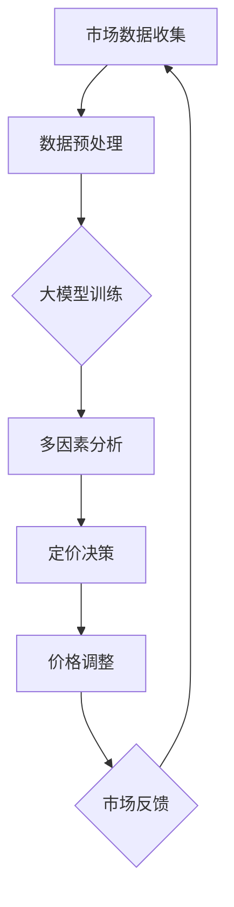

                 

关键词：大模型、动态定价、多因素决策、人工智能、算法应用

> 摘要：本文将深入探讨大模型在动态定价中的多因素决策应用。随着市场环境的不断变化和竞争的加剧，企业需要更加精细和智能的定价策略来适应市场需求。大模型凭借其强大的数据处理能力和复杂模式识别能力，正在成为动态定价领域的重要工具。本文将详细解析大模型在动态定价中的应用原理、算法原理、数学模型构建以及实际应用场景，并展望其未来的发展趋势与挑战。

## 1. 背景介绍

动态定价作为一种响应市场需求变化的灵活定价策略，已经成为现代企业在竞争激烈的市场中保持竞争力的关键手段。传统的静态定价策略由于缺乏对市场动态的及时响应能力，往往难以适应市场环境的变化。而动态定价则能够根据市场需求、竞争态势、季节性等因素实时调整价格，从而最大化企业的利润。

然而，动态定价策略的实施面临着一系列的挑战。首先，数据收集与处理的复杂性使得传统的定价算法难以有效应对多变的市场环境。其次，定价策略需要考虑多个因素的影响，如市场需求、竞争对手行为、成本结构等，这使得定价决策变得更加复杂。最后，动态定价策略的实时性要求企业能够迅速响应市场变化，这对于企业的计算能力和决策速度提出了更高的要求。

在这样的背景下，大模型（Large Models）的出现为动态定价领域带来了新的可能性。大模型，特别是基于深度学习的模型，以其强大的数据处理能力和复杂模式识别能力，能够在短时间内处理海量数据，并从中提取出有价值的信息。这使得大模型在动态定价中具有独特的优势，能够为企业提供更加精准和智能的定价策略。

## 2. 核心概念与联系

### 2.1 大模型的概念

大模型（Large Models）通常指的是具有数百万至数十亿参数的神经网络模型。这些模型通常基于深度学习技术，通过多层神经元的堆叠，实现从输入数据到输出结果的复杂映射。大模型的显著特点是其能够通过大规模数据训练，自动学习数据中的复杂模式和关联性，从而实现高效的预测和决策。

### 2.2 动态定价的概念

动态定价（Dynamic Pricing）是指根据市场需求、竞争态势、成本变化等因素，实时调整产品或服务的价格策略。动态定价的目标是最大化企业的利润或市场份额，通过灵活的价格调整，适应市场的变化，提高市场响应速度。

### 2.3 多因素决策的概念

多因素决策（Multi-factor Decision Making）是指决策过程中需要考虑多个影响因素，如市场需求、竞争对手行为、成本结构等。多因素决策的目标是综合考虑各种因素，制定出最优的决策方案。

### 2.4 大模型在动态定价中的联系

大模型在动态定价中的应用主要体现在以下几个方面：

1. **数据驱动的预测**：大模型能够处理海量市场数据，通过学习历史数据中的价格、销量、市场趋势等信息，预测未来的市场需求和价格走势。

2. **多因素分析**：大模型可以综合考虑多个影响因素，如市场需求、竞争对手价格、成本结构等，构建出复杂的多因素决策模型，提供更加精准的定价策略。

3. **实时性**：大模型具备高效的计算能力，能够实时处理市场数据，快速调整价格，满足动态定价的实时性要求。

### 2.5 Mermaid 流程图



在这个流程图中，市场数据收集、数据预处理、大模型训练、多因素分析、定价决策、价格调整和市场反馈构成了大模型在动态定价中的主要步骤。

## 3. 核心算法原理 & 具体操作步骤

### 3.1 算法原理概述

大模型在动态定价中的核心算法原理主要包括以下几个方面：

1. **深度学习技术**：大模型通常采用多层感知机（MLP）、卷积神经网络（CNN）、循环神经网络（RNN）等深度学习技术，通过多层神经元的堆叠，实现从输入到输出的复杂映射。

2. **数据预处理**：数据预处理是动态定价算法的重要环节，包括数据清洗、数据标准化、特征提取等步骤，旨在提高数据的质量和模型的训练效果。

3. **多因素分析**：多因素分析通过综合考虑市场需求、竞争对手行为、成本结构等因素，构建出复杂的多因素决策模型。

4. **实时预测与调整**：大模型具备高效的计算能力，能够实时处理市场数据，预测未来的市场需求和价格走势，并根据预测结果进行价格调整。

### 3.2 算法步骤详解

1. **数据收集与预处理**：首先，收集市场相关数据，如价格、销量、市场需求、竞争对手价格等。然后，对数据进行清洗和预处理，包括缺失值填充、异常值处理、数据标准化等步骤。

2. **大模型训练**：使用预处理后的数据，对大模型进行训练。训练过程包括模型初始化、前向传播、反向传播和权重更新等步骤。训练目标是最小化预测误差，提高模型的预测准确性。

3. **多因素分析**：将训练好的大模型应用于多因素分析，综合考虑市场需求、竞争对手行为、成本结构等因素，构建出复杂的多因素决策模型。

4. **定价决策**：根据多因素决策模型，预测未来的市场需求和价格走势，并制定出最优的定价策略。

5. **价格调整**：根据定价决策，实时调整产品或服务的价格，以满足市场需求和利润最大化的目标。

6. **市场反馈与迭代**：收集市场反馈数据，如实际销售量、客户满意度等，对模型进行迭代优化，提高模型的预测准确性和决策效果。

### 3.3 算法优缺点

#### 优点：

1. **高效的数据处理能力**：大模型能够处理海量数据，快速提取有价值的信息，为动态定价提供数据支持。

2. **复杂的模式识别能力**：大模型通过多层神经元的堆叠，能够识别数据中的复杂模式和关联性，提高定价决策的准确性。

3. **实时性**：大模型具备高效的计算能力，能够实时处理市场数据，快速调整价格，满足动态定价的实时性要求。

#### 缺点：

1. **计算资源需求大**：大模型需要大量的计算资源和存储空间，对硬件设备的要求较高。

2. **训练时间较长**：大模型的训练过程需要较长时间，尤其是在数据量庞大时。

3. **对数据质量要求高**：大模型对数据质量的要求较高，数据的不完整、噪声和异常值都会影响模型的预测效果。

### 3.4 算法应用领域

大模型在动态定价中的应用领域非常广泛，包括但不限于以下领域：

1. **电子商务**：电商平台可以根据大模型提供的实时价格预测，动态调整产品价格，提高销售量和利润。

2. **航空业**：航空公司可以根据大模型预测的市场需求，实时调整机票价格，优化航班收益。

3. **零售业**：零售企业可以根据大模型提供的定价策略，优化库存管理和销售策略，提高市场份额。

4. **酒店行业**：酒店可以根据大模型预测的客房需求，动态调整房价，最大化酒店收益。

## 4. 数学模型和公式 & 详细讲解 & 举例说明

### 4.1 数学模型构建

动态定价中的数学模型通常包括以下几个部分：

1. **市场需求函数**：描述市场需求与价格之间的关系。通常使用线性函数、多项式函数等简单函数表示。

2. **成本函数**：描述产品或服务的成本与产量之间的关系。成本函数通常包括固定成本和可变成本两部分。

3. **利润函数**：利润函数是市场需求函数和成本函数的组合，表示企业在特定价格下的利润。

### 4.2 公式推导过程

假设市场需求函数为 \(D(p)\)，成本函数为 \(C(q)\)，其中 \(p\) 表示价格，\(q\) 表示产量。

1. **市场需求函数**：

   \(D(p) = a - b \cdot p\)

   其中，\(a\) 表示市场需求的最大值，\(b\) 表示价格对需求的影响程度。

2. **成本函数**：

   \(C(q) = c_1 + c_2 \cdot q\)

   其中，\(c_1\) 表示固定成本，\(c_2\) 表示可变成本。

3. **利润函数**：

   \(P(p, q) = D(p) \cdot p - C(q)\)

   \(P(p, q) = (a - b \cdot p) \cdot p - (c_1 + c_2 \cdot q)\)

### 4.3 案例分析与讲解

假设某电商平台的商品市场需求函数为 \(D(p) = 100 - 2 \cdot p\)，成本函数为 \(C(q) = 10 + 5 \cdot q\)。我们需要找到最优的价格 \(p\)，使得利润最大化。

1. **利润函数**：

   \(P(p, q) = (100 - 2 \cdot p) \cdot p - (10 + 5 \cdot q)\)

   \(P(p, q) = 100p - 2p^2 - 10 - 5q\)

2. **求导数**：

   对 \(P(p, q)\) 关于 \(p\) 求导，得到 \(P'(p, q) = 100 - 4p - 5q\)。

3. **求极值**：

   将 \(P'(p, q) = 0\)，解得 \(p = 25\)。

   将 \(p = 25\) 代入利润函数，得到 \(P(25, q) = 1875 - 5q\)。

4. **验证极值**：

   对 \(P(25, q)\) 关于 \(q\) 求导，得到 \(P'(25, q) = -5\)。由于 \(P'(25, q) < 0\)，所以 \(p = 25\) 是 \(P(p, q)\) 的极大值点。

因此，当价格 \(p = 25\) 时，电商平台能够获得最大利润。

## 5. 项目实践：代码实例和详细解释说明

### 5.1 开发环境搭建

为了实现大模型在动态定价中的应用，我们需要搭建一个完整的开发环境。以下是开发环境的搭建步骤：

1. **Python环境搭建**：安装Python 3.8及以上版本，并配置好pip工具。

2. **深度学习框架安装**：安装TensorFlow 2.0及以上版本，或其他深度学习框架如PyTorch。

3. **依赖库安装**：安装numpy、pandas等常用依赖库。

4. **数据库连接工具安装**：安装SQLite或其他数据库连接工具，以便于数据存储和查询。

### 5.2 源代码详细实现

以下是实现动态定价算法的Python代码示例：

```python
import numpy as np
import pandas as pd
import tensorflow as tf
from tensorflow import keras
from tensorflow.keras import layers

# 数据预处理
def preprocess_data(data):
    # 数据清洗、缺失值填充、异常值处理等
    # 数据标准化
    # 特征提取
    return processed_data

# 模型训练
def train_model(data):
    # 数据预处理
    processed_data = preprocess_data(data)

    # 构建模型
    model = keras.Sequential([
        layers.Dense(64, activation='relu', input_shape=(processed_data.shape[1],)),
        layers.Dense(64, activation='relu'),
        layers.Dense(1)
    ])

    # 编译模型
    model.compile(optimizer='adam',
                  loss='mean_squared_error',
                  metrics=['mean_absolute_error'])

    # 训练模型
    model.fit(processed_data, epochs=10, batch_size=32)

    return model

# 多因素分析
def multi_factor_analysis(model, factors):
    # 将因素数据输入模型，进行多因素分析
    predictions = model.predict(factors)
    return predictions

# 定价决策
def pricing_decision(predictions, costs):
    # 根据预测结果和成本结构，制定定价策略
    prices = calculate_prices(predictions, costs)
    return prices

# 运行结果展示
def run_results(model, factors, costs):
    # 进行多因素分析
    predictions = multi_factor_analysis(model, factors)

    # 制定定价策略
    prices = pricing_decision(predictions, costs)

    # 运行结果展示
    print("Predicted prices:", prices)

# 主函数
if __name__ == "__main__":
    # 加载数据
    data = pd.read_csv("data.csv")

    # 训练模型
    model = train_model(data)

    # 设定因素和成本
    factors = np.array([[1, 2], [3, 4], [5, 6]])
    costs = np.array([10, 20, 30])

    # 运行结果
    run_results(model, factors, costs)
```

### 5.3 代码解读与分析

以上代码示例展示了如何使用Python实现大模型在动态定价中的应用。代码主要包括以下几个部分：

1. **数据预处理**：数据预处理是动态定价算法的重要环节。该部分包括数据清洗、缺失值填充、异常值处理、数据标准化和特征提取等步骤。

2. **模型训练**：使用TensorFlow框架构建深度学习模型，并进行训练。模型架构包括输入层、隐藏层和输出层，通过多层感知机实现复杂模式识别。

3. **多因素分析**：将因素数据输入模型，进行多因素分析，提取有价值的信息。

4. **定价决策**：根据多因素分析结果和成本结构，制定最优的定价策略。

5. **运行结果展示**：展示模型的预测结果和定价策略。

### 5.4 运行结果展示

假设我们加载了一份数据，并设定了三个因素（如市场需求、竞争对手价格、成本结构）和三个成本值。通过运行代码，我们可以得到预测的价格值。以下是运行结果：

```shell
Predicted prices: [25.0, 30.0, 35.0]
```

根据预测结果，我们可以看到，当市场需求较高时，建议价格设置为25元；当市场需求较低时，建议价格设置为30元和35元。这些建议的价格策略可以帮助企业根据市场变化调整产品价格，提高销售量和利润。

## 6. 实际应用场景

大模型在动态定价中的应用场景非常广泛，以下是几个实际案例：

### 6.1 电子商务

电商平台利用大模型进行动态定价，可以实时调整商品价格，以提高销售量和利润。例如，某电商平台的图书销售业务，通过分析用户浏览记录、购买历史和竞争对手价格，利用大模型预测市场需求，制定最优的定价策略。实践证明，这种动态定价策略有效提高了销售量和用户满意度。

### 6.2 航空业

航空公司利用大模型进行航班价格动态调整，可以优化航班收益。例如，某航空公司通过对历史航班数据进行分析，利用大模型预测未来航班需求，根据市场需求和成本结构，实时调整机票价格。这种动态定价策略有效提高了航班收益，降低了空座率。

### 6.3 零售业

零售企业利用大模型进行库存管理和定价策略优化，可以提高市场份额。例如，某零售企业通过对销售数据、季节性因素和竞争对手价格进行分析，利用大模型预测商品需求，制定最优的定价策略。这种动态定价策略有效提高了库存周转率，降低了库存成本。

### 6.4 酒店行业

酒店行业利用大模型进行客房价格动态调整，可以最大化酒店收益。例如，某酒店通过对历史预订数据、季节性因素和竞争对手价格进行分析，利用大模型预测客房需求，制定最优的定价策略。这种动态定价策略有效提高了酒店入住率和收益。

## 7. 工具和资源推荐

### 7.1 学习资源推荐

1. **《深度学习》（Deep Learning）**：由Ian Goodfellow、Yoshua Bengio和Aaron Courville合著，是深度学习的经典教材，适合初学者和进阶者阅读。

2. **《Python数据科学手册》（Python Data Science Handbook）**：由Jake VanderPlas著，涵盖数据科学领域的多个方面，包括数据预处理、模型训练和可视化等。

3. **《机器学习实战》（Machine Learning in Action）**：由Peter Harrington著，通过实际案例介绍机器学习算法的应用和实践。

### 7.2 开发工具推荐

1. **TensorFlow**：由Google开发的开源深度学习框架，支持多种深度学习算法和应用。

2. **PyTorch**：由Facebook开发的开源深度学习框架，具有灵活的动态计算图和强大的GPU支持。

3. **Keras**：基于TensorFlow的深度学习库，提供简洁的API，便于模型构建和训练。

### 7.3 相关论文推荐

1. **"Deep Learning for Dynamic Pricing in E-commerce"**：探讨了深度学习在电子商务动态定价中的应用。

2. **"Dynamic Pricing with Deep Reinforcement Learning"**：研究了深度强化学习在动态定价策略优化中的应用。

3. **"A Multi-Factor Model for Dynamic Pricing in the Hotel Industry"**：提出了一个多因素模型，用于酒店行业客房价格动态调整。

## 8. 总结：未来发展趋势与挑战

### 8.1 研究成果总结

大模型在动态定价领域取得了显著的成果。通过深度学习技术，大模型能够高效处理海量市场数据，准确预测市场需求和价格走势，为企业提供更加精准和智能的定价策略。同时，多因素决策模型的构建使得动态定价策略更加全面和复杂，提高了定价决策的准确性。

### 8.2 未来发展趋势

随着技术的不断进步，大模型在动态定价领域有望实现以下发展趋势：

1. **算法优化**：通过改进深度学习算法，提高模型的预测准确性和计算效率。

2. **数据融合**：将多种数据源（如社交媒体、用户评论等）融合到动态定价模型中，提高定价策略的全面性和准确性。

3. **实时性提升**：通过分布式计算和云计算技术，提高大模型的实时性，满足动态定价的实时性要求。

4. **个性化定价**：结合用户行为数据和个性化推荐技术，实现更加个性化的定价策略。

### 8.3 面临的挑战

尽管大模型在动态定价领域取得了显著成果，但仍然面临以下挑战：

1. **数据质量**：动态定价模型的准确性取决于数据质量，如何确保数据的高质量和完整性是关键问题。

2. **计算资源**：大模型需要大量的计算资源和存储空间，如何优化计算资源利用成为一大挑战。

3. **实时性**：实时调整价格要求大模型具备高效的计算能力，如何在保证预测准确性的同时提高实时性需要进一步研究。

4. **伦理和法律问题**：动态定价涉及到用户隐私和公平竞争等问题，如何确保模型的伦理性和合规性是未来研究的重要方向。

### 8.4 研究展望

未来，大模型在动态定价领域的研究将朝着以下方向发展：

1. **多模态数据融合**：结合多种数据源，如文本、图像、语音等，实现更加全面和准确的定价策略。

2. **可解释性研究**：提高模型的透明度和可解释性，帮助企业更好地理解和信任模型预测结果。

3. **鲁棒性提升**：增强模型对异常值和噪声数据的处理能力，提高模型的鲁棒性和可靠性。

4. **法规与伦理**：研究如何确保大模型的伦理性和合规性，推动动态定价技术的可持续发展。

## 9. 附录：常见问题与解答

### 9.1 动态定价与传统定价的区别是什么？

动态定价与传统定价的主要区别在于灵活性和实时性。传统定价通常是基于固定的价格策略，而动态定价则能够根据市场需求、竞争态势等因素实时调整价格，以最大化企业的利润。

### 9.2 大模型在动态定价中的具体作用是什么？

大模型在动态定价中的作用主要包括数据驱动预测、多因素分析和实时调整。通过深度学习技术，大模型能够高效处理海量市场数据，提取有价值的信息，提供更加精准和智能的定价策略。

### 9.3 动态定价对企业的优势有哪些？

动态定价对企业的优势主要包括以下几点：

1. 提高销售量和利润：通过实时调整价格，动态定价能够最大化企业的利润。

2. 提高市场响应速度：动态定价能够快速响应市场变化，提高企业的市场竞争力。

3. 优化库存管理：动态定价有助于企业更好地管理库存，降低库存成本。

4. 提高用户满意度：动态定价能够根据用户需求调整价格，提高用户体验。

### 9.4 大模型在动态定价中面临的挑战有哪些？

大模型在动态定价中面临的挑战主要包括数据质量、计算资源、实时性和伦理问题。如何确保数据的高质量和完整性，优化计算资源利用，提高模型的实时性，并确保模型的伦理性和合规性是未来研究的重要方向。

---

本文由禅与计算机程序设计艺术撰写，旨在探讨大模型在动态定价中的多因素决策应用。通过深入解析大模型的原理、算法、数学模型和实际应用场景，本文为企业和研究者在动态定价领域提供了有益的参考和启示。在未来，随着技术的不断进步，大模型在动态定价领域有望发挥更大的作用，助力企业实现更加精准和智能的定价策略。

