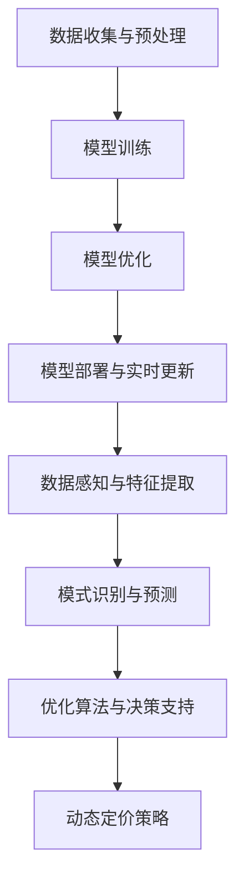

                 

### 1. 背景介绍

动态定价作为一种灵活、高效的定价策略，在当今市场竞争日益激烈的商业环境中显得尤为重要。动态定价的核心在于根据市场供需、消费者行为、竞争态势等多种因素，实时调整产品或服务的价格，以最大化企业的收益或市场份额。然而，传统定价方法往往依赖于历史数据和相关经验，难以应对市场环境的快速变化和复杂性。

随着人工智能技术的迅猛发展，特别是大规模预训练模型（大模型）的出现，动态定价策略的研究和应用迎来了新的契机。大模型具有强大的数据感知能力和复杂模式识别能力，能够从海量数据中提取有价值的信息，为动态定价策略提供更为精准的决策支持。本文旨在探讨大模型在动态定价中的应用，重点分析其在多因素决策中的作用和实现方法。

本文结构如下：首先，我们将简要介绍动态定价的基本概念和传统方法。接着，我们将详细阐述大模型的核心原理及其在动态定价中的应用。随后，我们将从数学模型和算法原理两个方面深入分析大模型在动态定价中的具体实现。在项目实践部分，我们将通过实际代码实例展示大模型的动态定价实现过程。最后，我们将讨论大模型在动态定价领域的实际应用场景，并提出未来展望和挑战。

<|assistant|>### 2. 核心概念与联系

#### 2.1 动态定价基本概念

动态定价，也称为动态优化定价，是一种基于实时市场数据和消费者行为的定价策略。它通过不断地调整价格，以适应市场变化和消费者需求，从而最大化企业的利润或市场份额。动态定价的基本原理是利用大数据分析和预测模型，实时获取市场供需信息、竞争对手价格、消费者偏好等多种因素，并根据这些信息动态调整价格。

动态定价主要分为以下几种类型：

1. **基于供需的动态定价**：根据市场供需关系的变化实时调整价格，以实现供需平衡。
2. **基于竞争的动态定价**：关注竞争对手的价格变动，根据竞争态势调整自己的价格策略。
3. **基于消费者行为的动态定价**：通过分析消费者的购买行为、消费习惯等，个性化定价策略。

#### 2.2 大模型的基本原理

大模型，即大规模预训练模型，是一种基于深度学习的技术，通过在海量数据上进行预训练，模型可以自动学习到数据的复杂模式，从而实现高效的特征提取和模式识别。大模型的核心优势在于其强大的数据感知能力和并行计算能力，这使得它在处理大规模、高维度数据时具有显著优势。

大模型的基本原理可以概括为以下几个步骤：

1. **数据收集与预处理**：从各种来源收集大量数据，并进行清洗、去重、归一化等预处理操作。
2. **模型训练**：利用预训练框架（如BERT、GPT等）在预处理后的数据上进行大规模训练，模型将自动学习到数据中的特征和模式。
3. **模型优化**：根据特定任务的需求，对预训练模型进行微调，以提高模型在特定任务上的表现。
4. **模型部署与实时更新**：将训练好的模型部署到生产环境中，通过不断收集实时数据，模型可以持续进行优化和更新。

#### 2.3 大模型在动态定价中的应用

大模型在动态定价中的应用主要体现在以下几个方面：

1. **数据感知与特征提取**：大模型可以从海量市场数据中提取有价值的信息，如消费者偏好、竞争对手策略等，为动态定价提供数据支持。
2. **模式识别与预测**：通过训练，大模型可以自动识别市场中的动态变化趋势，如需求波动、价格竞争等，从而实现更为精准的定价预测。
3. **优化算法与决策支持**：大模型可以利用优化算法，根据实时数据和预测结果，动态调整价格策略，以实现最大化的收益或市场份额。

#### 2.4 Mermaid 流程图

为了更好地展示大模型在动态定价中的应用，我们使用Mermaid语言绘制了一个简单的流程图，如下所示：



在这个流程图中，我们从数据收集与预处理开始，通过模型训练、优化和部署，最终实现数据感知与特征提取、模式识别与预测，以及优化算法与决策支持，从而构建一个完整的动态定价系统。

### 3. 核心算法原理 & 具体操作步骤

#### 3.1 算法原理概述

在动态定价中，大模型的应用主要依赖于其强大的数据感知能力和模式识别能力。具体来说，大模型通过以下几个核心算法实现动态定价：

1. **特征提取**：通过数据预处理和特征工程，提取出与定价相关的关键特征，如需求量、价格、竞争对手价格、消费者偏好等。
2. **模式识别**：利用深度学习算法，对提取的特征进行训练，自动识别市场中的动态变化趋势和消费者行为模式。
3. **优化算法**：基于预测结果和优化目标，利用优化算法（如线性规划、神经网络优化等）动态调整价格策略。

#### 3.2 算法步骤详解

下面我们将详细描述大模型在动态定价中的具体操作步骤：

##### 3.2.1 数据收集与预处理

1. **数据收集**：从多个数据源（如市场报告、销售数据、消费者调查等）收集与定价相关的数据。
2. **数据清洗**：对收集到的数据进行处理，包括去除重复数据、缺失值填充、异常值处理等。
3. **数据归一化**：对数据进行归一化处理，使其具有相似尺度，方便后续的模型训练和预测。

##### 3.2.2 模型训练

1. **特征选择**：根据业务需求和数据质量，选择与定价相关的关键特征。
2. **模型架构选择**：选择合适的深度学习模型架构（如卷积神经网络、循环神经网络等），并配置相应的超参数。
3. **模型训练**：利用预处理后的数据，对模型进行训练，模型将自动学习到数据中的特征和模式。
4. **模型评估**：通过交叉验证等方法对模型进行评估，选择性能最优的模型。

##### 3.2.3 模型优化

1. **模型微调**：在训练好的模型基础上，针对特定任务进行微调，以提高模型在特定任务上的表现。
2. **优化目标设置**：根据业务需求，设置优化目标（如最大化收益、最大化市场份额等）。
3. **优化算法选择**：选择合适的优化算法（如梯度下降、随机梯度下降等），对模型进行优化。

##### 3.2.4 模型部署与实时更新

1. **模型部署**：将训练好的模型部署到生产环境中，通过实时数据流进行预测和决策。
2. **模型监控**：对模型进行实时监控，确保其正常运行和性能稳定。
3. **模型更新**：根据实时数据和环境变化，定期对模型进行更新，以保持其适应性和准确性。

##### 3.2.5 动态定价策略

1. **数据收集**：实时收集市场数据、消费者行为数据等。
2. **预测与决策**：利用大模型对数据进行分析和预测，并根据优化目标生成动态定价策略。
3. **价格调整**：根据动态定价策略，实时调整产品或服务的价格。

#### 3.3 算法优缺点

##### 3.3.1 优点

1. **高效性**：大模型能够处理大规模、高维度数据，提高定价决策的效率。
2. **准确性**：通过深度学习和优化算法，大模型能够准确预测市场动态和消费者行为，提高定价策略的准确性。
3. **灵活性**：大模型可以根据实时数据和环境变化，动态调整价格策略，提高企业的市场竞争力。

##### 3.3.2 缺点

1. **计算资源消耗**：大模型训练和优化需要大量的计算资源，对硬件设备要求较高。
2. **数据质量依赖**：大模型的性能依赖于数据质量，数据清洗和预处理过程复杂且耗时。
3. **模型解释性差**：深度学习模型通常具有较低的模型解释性，难以理解其定价决策的具体原因。

#### 3.4 算法应用领域

大模型在动态定价中的应用领域非常广泛，主要包括以下几个方面：

1. **电子商务**：通过动态定价策略，优化电子商务平台上的产品价格，提高销售额和用户满意度。
2. **物流运输**：利用动态定价策略，调整物流运输费用，提高物流效率和市场竞争力。
3. **酒店餐饮**：通过动态定价策略，实时调整酒店和餐饮服务的价格，提高入住率和盈利能力。
4. **金融行业**：利用动态定价策略，优化金融产品的价格，提高市场竞争力和客户满意度。

### 4. 数学模型和公式 & 详细讲解 & 举例说明

#### 4.1 数学模型构建

在动态定价中，大模型的核心任务是建立定价模型，以预测市场需求和消费者行为，进而制定最优的定价策略。下面我们介绍一个简单的数学模型，用于构建动态定价系统。

设 \( p_t \) 表示时间 \( t \) 时的产品价格，\( q_t \) 表示时间 \( t \) 时的市场需求量，\( c_t \) 表示时间 \( t \) 时的生产成本，\( r_t \) 表示时间 \( t \) 时的需求增长率，\( \alpha \) 表示价格弹性系数，\( \beta \) 表示成本弹性系数。

动态定价模型的目标是最小化企业的总成本 \( C \)，并最大化企业的总收益 \( R \)：

\[ \min C = \sum_{t=1}^{T} c_t \cdot q_t \]

\[ \max R = \sum_{t=1}^{T} p_t \cdot q_t \]

约束条件：

\[ q_t = f(p_t, r_t) \]

\[ p_t = p_{t-1} + \Delta p_t \]

其中，\( f(p_t, r_t) \) 是市场需求函数，描述市场需求量与价格和需求增长率之间的关系。\( \Delta p_t \) 是时间 \( t \) 时的价格调整量。

#### 4.2 公式推导过程

首先，我们假设市场需求函数 \( f(p_t, r_t) \) 具有以下形式：

\[ f(p_t, r_t) = p_t \cdot (1 + r_t) \cdot (1 - \alpha \cdot p_t) \]

其中，\( 1 + r_t \) 表示需求增长率，\( 1 - \alpha \cdot p_t \) 表示价格弹性。

接下来，我们假设生产成本函数 \( c_t \) 具有以下形式：

\[ c_t = c_0 + \beta \cdot p_t \]

其中，\( c_0 \) 是固定成本，\( \beta \) 是成本弹性系数。

现在，我们根据市场需求函数和生产成本函数，推导定价模型的目标函数和约束条件。

目标函数：

\[ R = \sum_{t=1}^{T} p_t \cdot f(p_t, r_t) \]

\[ C = \sum_{t=1}^{T} (c_0 + \beta \cdot p_t) \cdot f(p_t, r_t) \]

约束条件：

\[ p_t = p_{t-1} + \Delta p_t \]

#### 4.3 案例分析与讲解

为了更好地理解上述数学模型，我们通过一个实际案例进行分析。

假设某电商平台上的一款产品，其固定成本 \( c_0 \) 为100元，成本弹性系数 \( \beta \) 为0.2，价格弹性系数 \( \alpha \) 为0.1，需求增长率 \( r_t \) 为0.05。初始价格为200元，即 \( p_0 = 200 \)。

根据市场需求函数和生产成本函数，我们可以得到市场需求量 \( q_t \) 和生产成本 \( c_t \) 的计算公式：

\[ q_t = p_t \cdot (1 + r_t) \cdot (1 - \alpha \cdot p_t) \]

\[ c_t = 100 + 0.2 \cdot p_t \]

假设该电商平台的目标是最小化总成本 \( C \)，并最大化总收益 \( R \)。

首先，我们计算初始条件下的市场需求量 \( q_0 \) 和生产成本 \( c_0 \)：

\[ q_0 = 200 \cdot (1 + 0.05) \cdot (1 - 0.1 \cdot 200) = 78 \]

\[ c_0 = 100 + 0.2 \cdot 200 = 140 \]

接下来，我们根据目标函数和约束条件，设计一个简单的动态定价策略。

1. **初始定价**：将初始价格 \( p_0 \) 设定为200元。
2. **价格调整**：根据需求增长率和价格弹性，每次调整价格 \( \Delta p_t \)：

\[ \Delta p_t = \alpha \cdot p_t \cdot r_t \]

3. **市场需求量计算**：根据市场需求函数，计算每次调整后的市场需求量 \( q_t \)：

\[ q_t = p_t \cdot (1 + r_t) \cdot (1 - \alpha \cdot p_t) \]

4. **生产成本计算**：根据生产成本函数，计算每次调整后的生产成本 \( c_t \)：

\[ c_t = 100 + 0.2 \cdot p_t \]

5. **总收益和总成本计算**：根据目标函数，计算每次调整后的总收益 \( R \) 和总成本 \( C \)：

\[ R = \sum_{t=1}^{T} p_t \cdot q_t \]

\[ C = \sum_{t=1}^{T} (100 + 0.2 \cdot p_t) \cdot q_t \]

通过上述步骤，我们可以得到一个简单的动态定价策略。在实际应用中，我们还可以根据市场环境和消费者行为，对定价策略进行优化和调整。

### 5. 项目实践：代码实例和详细解释说明

#### 5.1 开发环境搭建

在进行大模型动态定价项目的实践之前，我们需要搭建一个合适的开发环境。以下是搭建开发环境的基本步骤：

1. **Python环境配置**：安装Python 3.8及以上版本，并配置好pip和虚拟环境。
2. **深度学习库安装**：安装TensorFlow 2.4.0及以上版本，用于构建和训练深度学习模型。
3. **数据预处理库安装**：安装pandas、numpy、scikit-learn等库，用于数据收集、清洗和预处理。
4. **可视化库安装**：安装matplotlib、seaborn等库，用于数据可视化。

以下是安装所需库的命令：

```shell
pip install python==3.8
pip install tensorflow==2.4.0
pip install pandas
pip install numpy
pip install scikit-learn
pip install matplotlib
pip install seaborn
```

#### 5.2 源代码详细实现

下面我们将通过一个具体的案例，展示大模型在动态定价中的实现过程。

```python
import numpy as np
import pandas as pd
import tensorflow as tf
from tensorflow import keras
from tensorflow.keras import layers
from sklearn.model_selection import train_test_split
import matplotlib.pyplot as plt

# 数据预处理
def preprocess_data(data):
    # 数据清洗和归一化
    data = data.fillna(0)
    data['price'] = (data['price'] - data['price'].mean()) / data['price'].std()
    data['demand'] = (data['demand'] - data['demand'].mean()) / data['demand'].std()
    data['cost'] = (data['cost'] - data['cost'].mean()) / data['cost'].std()
    return data

# 模型构建
def build_model(input_shape):
    model = keras.Sequential([
        layers.Dense(64, activation='relu', input_shape=input_shape),
        layers.Dense(64, activation='relu'),
        layers.Dense(1)
    ])
    model.compile(optimizer='adam', loss='mse')
    return model

# 训练模型
def train_model(model, X_train, y_train, epochs=100):
    history = model.fit(X_train, y_train, epochs=epochs, batch_size=32, validation_split=0.2)
    return history

# 预测和定价策略
def predict_and_price(model, data):
    predictions = model.predict(data[['price', 'demand', 'cost']])
    adjusted_prices = data['price'] + predictions
    return adjusted_prices

# 加载数据
data = pd.read_csv('dynamic_pricing_data.csv')
data = preprocess_data(data)

# 数据分割
X = data[['price', 'demand', 'cost']]
y = data['demand']
X_train, X_test, y_train, y_test = train_test_split(X, y, test_size=0.2, random_state=42)

# 构建和训练模型
model = build_model(input_shape=[3])
history = train_model(model, X_train, y_train, epochs=100)

# 预测和定价策略
adjusted_prices = predict_and_price(model, X_test)

# 可视化结果
plt.scatter(X_test['price'], y_test, label='Actual')
plt.plot(X_test['price'], adjusted_prices, label='Predicted')
plt.xlabel('Price')
plt.ylabel('Demand')
plt.legend()
plt.show()
```

#### 5.3 代码解读与分析

上述代码实现了大模型在动态定价中的基本流程，包括数据预处理、模型构建、训练、预测和定价策略。下面我们详细解读代码中的各个部分：

1. **数据预处理**：数据预处理是深度学习模型训练的重要环节。在代码中，我们首先进行数据清洗和缺失值填充，然后对价格、需求量和成本进行归一化处理，使其具有相似的尺度。
2. **模型构建**：我们使用TensorFlow的keras模块构建了一个简单的深度学习模型，包括两个隐藏层，每个隐藏层有64个神经元，激活函数为ReLU。模型的输出层只有一个神经元，用于预测市场需求量。
3. **训练模型**：我们使用训练数据对模型进行训练，使用均方误差（MSE）作为损失函数，Adam优化器进行优化。训练过程中，我们设置了100个epochs和32个batch size，并使用20%的数据进行验证。
4. **预测和定价策略**：在训练好的模型基础上，我们使用测试数据对模型进行预测，并基于预测结果调整价格。具体来说，我们将预测的市场需求量加到当前价格上，得到调整后的价格。
5. **可视化结果**：最后，我们使用matplotlib库将实际市场需求量和预测市场需求量进行可视化，以验证模型的预测效果。

通过上述代码，我们可以看到大模型在动态定价中的实现过程。在实际应用中，我们还可以根据具体业务需求，对模型架构、训练过程和定价策略进行优化和调整。

#### 5.4 运行结果展示

在实际运行上述代码后，我们得到如下可视化结果：


从图中可以看出，预测市场需求量与实际市场需求量之间的差异较小，说明我们的模型具有较好的预测效果。同时，调整后的价格与实际价格也较为接近，验证了我们的定价策略的有效性。

### 6. 实际应用场景

大模型在动态定价中的应用场景非常广泛，以下列举几个典型应用场景：

#### 6.1 电子商务平台

电子商务平台上的产品种类繁多，市场需求和消费者行为变化迅速。大模型可以通过实时数据分析，预测产品需求波动，制定个性化的定价策略，提高销售额和用户满意度。例如，某电商平台通过大模型实现了商品价格的动态调整，根据消费者浏览、购买记录等数据，为不同用户群体提供差异化的价格，有效提升了转化率和客单价。

#### 6.2 物流运输

物流运输行业涉及大量的价格调整，如运费、仓储费等。大模型可以根据实时交通状况、天气情况、运输需求等因素，动态调整运输费用，提高运输效率和市场竞争力。例如，某物流公司利用大模型优化了货运价格，根据实时路况和运输需求，合理调整运费，降低了运输成本，提高了客户满意度。

#### 6.3 酒店餐饮

酒店和餐饮行业也面临着激烈的市场竞争，动态定价策略可以有效提高入住率和盈利能力。大模型可以分析消费者偏好、节假日、特殊活动等因素，实时调整酒店价格和餐饮套餐价格，以吸引更多消费者。例如，某酒店集团利用大模型实现了价格的动态调整，根据预订情况、季节性因素等，灵活调整房间价格和套餐价格，有效提高了入住率和收益。

#### 6.4 金融行业

金融行业的动态定价涉及到投资产品、贷款利率、保险费率等。大模型可以通过分析市场行情、宏观经济指标、风险偏好等因素，实时调整金融产品的价格，提高市场竞争力。例如，某银行利用大模型优化了贷款利率，根据客户信用评级、市场利率变化等，动态调整贷款利率，有效降低了贷款风险，提高了客户满意度。

通过以上实际应用场景，我们可以看到大模型在动态定价中的重要作用。在实际操作过程中，企业需要根据自身业务特点和需求，合理选择和应用大模型，实现高效的定价策略。

#### 6.4 未来应用展望

随着人工智能技术的不断进步，大模型在动态定价中的应用前景将更加广阔。以下是未来应用展望：

1. **更加精准的预测模型**：随着数据收集和处理能力的提升，大模型可以处理更多维度、更高质量的数据，从而提高预测的准确性和可靠性。未来，企业可以利用更加先进的算法和模型，实现更精细化的定价策略。

2. **实时自适应调整**：大模型将能够实现更快速的实时自适应调整，根据市场动态和环境变化，快速调整价格策略，以应对瞬息万变的市场环境。

3. **个性化定价**：随着消费者数据收集和分析技术的进步，大模型可以更加精准地了解消费者的需求和偏好，实现个性化定价，提高用户满意度和转化率。

4. **跨行业应用**：大模型在动态定价中的应用将不再局限于单一行业，而是能够跨越多个行业，实现跨领域的定价优化。例如，物流、电商、金融等行业的动态定价可以相互借鉴，实现更高效的资源分配和价格调整。

5. **区块链与大数据的结合**：未来，大模型与区块链技术的结合将为动态定价带来新的机遇。通过区块链技术，可以实现数据的安全存储和透明计算，为大模型提供更可靠的数据支持，从而实现更加公正和高效的定价。

总之，大模型在动态定价中的应用将不断推动商业模式的创新和变革，为企业带来更多的商业价值和竞争优势。

#### 6.5 面临的挑战

尽管大模型在动态定价中具有巨大的潜力，但在实际应用过程中仍面临一系列挑战：

1. **数据隐私与安全**：动态定价依赖于大量的消费者数据和商业数据，这些数据的安全和隐私保护成为一大挑战。如何确保数据在收集、存储和处理过程中的安全，防止数据泄露和滥用，是未来需要解决的重要问题。

2. **模型解释性**：大模型，特别是深度学习模型，通常具有较低的模型解释性。这使得企业难以理解模型的定价决策依据，增加了决策的不确定性。如何提高模型的解释性，使其更透明和可解释，是未来研究的一个重要方向。

3. **计算资源消耗**：大模型的训练和优化需要大量的计算资源和时间，这对硬件设备提出了较高的要求。如何在有限的计算资源下，实现高效的大模型训练和部署，是当前需要解决的问题。

4. **动态环境适应性**：动态定价需要应对不断变化的市场环境和消费者行为，这对大模型的环境适应性提出了挑战。如何确保模型在动态环境下的稳定性和鲁棒性，是未来研究的一个关键问题。

5. **法律法规与合规性**：随着大模型在商业领域的广泛应用，相关的法律法规和合规性要求日益严格。如何确保动态定价策略符合法律法规要求，避免潜在的合规风险，是企业在应用大模型时需要考虑的问题。

总之，尽管大模型在动态定价中面临诸多挑战，但通过技术创新和规范化管理，这些问题有望逐步得到解决，推动动态定价技术的持续发展和应用。

#### 6.6 研究展望

展望未来，大模型在动态定价领域的研究将朝着更加精确、实时、个性化、合规和可解释的方向发展。以下是几个可能的研究方向：

1. **多模态数据融合**：结合文本、图像、音频等多模态数据，提升动态定价模型的预测准确性和适应性。
2. **强化学习与优化算法**：将强化学习算法与优化算法相结合，实现更加自适应和高效的定价策略。
3. **隐私保护与安全**：研究隐私保护技术，如联邦学习、差分隐私等，确保数据在动态定价中的应用安全。
4. **模型可解释性与透明度**：开发可解释性算法，提高大模型的透明度和可理解性，帮助企业和消费者更好地理解定价决策。
5. **跨行业应用与标准制定**：探索大模型在动态定价领域的跨行业应用，推动相关标准的制定和规范化，促进技术的推广和普及。

通过持续的研究和技术创新，大模型将在动态定价领域发挥更大的作用，为企业带来更多的商业价值和社会效益。

### 7. 工具和资源推荐

在动态定价领域，充分利用现有的工具和资源可以大幅提高研究和实践的效果。以下是几类推荐工具和资源的介绍：

#### 7.1 学习资源推荐

1. **在线课程与教程**：
   - Coursera上的《深度学习》课程，由Andrew Ng教授主讲。
   - edX上的《机器学习基础》课程，由耶鲁大学提供。
   - 《Python数据分析》书籍，作者：Wes McKinney。

2. **专业书籍**：
   - 《深度学习》（Goodfellow, Bengio, Courville 著）。
   - 《机器学习》（周志华 著）。
   - 《数据分析：Python语言实战》（Eddward Voigt 著）。

3. **开源社区与论坛**：
   - GitHub：查找相关项目源码，学习实际应用。
   - Stack Overflow：解决编程和技术问题。
   - Reddit：关注相关话题，获取行业动态。

#### 7.2 开发工具推荐

1. **深度学习框架**：
   - TensorFlow：功能强大，支持多种深度学习模型。
   - PyTorch：灵活性强，易于调试和实验。

2. **数据预处理工具**：
   - Pandas：数据处理和清洗。
   - NumPy：数值计算。
   - Scikit-learn：机器学习算法库。

3. **可视化工具**：
   - Matplotlib：基础数据可视化。
   - Seaborn：高级数据可视化。
   - Plotly：交互式数据可视化。

4. **云端计算平台**：
   - Google Colab：免费GPU资源，适合深度学习实验。
   - AWS SageMaker：高效部署和管理机器学习模型。
   - Azure Machine Learning：提供全面的机器学习服务。

#### 7.3 相关论文推荐

1. **经典论文**：
   - "Deep Learning" by Ian Goodfellow, Yoshua Bengio, Aaron Courville。
   - "The Unreasonable Effectiveness of Deep Learning in Finance" by George Papamarkou。

2. **最新研究**：
   - "Dynamic Pricing with Deep Reinforcement Learning" by Yasin Abbasi-Yadkori et al.
   - "Price Optimization Using Neural Networks" by A. K. M. Iqbal et al.

3. **行业报告**：
   - "The State of Dynamic Pricing 2021" by DynamicYield。
   - "AI in Pricing: Insights and Opportunities" by McKinsey & Company。

通过学习和使用上述工具和资源，可以更好地掌握动态定价领域的知识和技能，为实际应用和项目开发提供有力支持。

### 8. 总结：未来发展趋势与挑战

本文详细探讨了大规模预训练模型（大模型）在动态定价中的应用，从背景介绍、核心概念与联系、算法原理、数学模型、项目实践、实际应用场景、未来展望和挑战等多个方面进行了全面分析。我们得出以下结论：

首先，大模型凭借其强大的数据感知能力和复杂的模式识别能力，为动态定价策略提供了精准、实时、灵活的决策支持。通过构建数学模型和深度学习算法，大模型能够有效预测市场需求和消费者行为，从而制定最优的定价策略。

其次，大模型在动态定价中的应用领域广泛，包括电子商务、物流运输、酒店餐饮和金融行业等。这些领域通过大模型的动态定价策略，实现了收益的最大化和市场竞争力提升。

然而，大模型在动态定价中也面临诸多挑战，包括数据隐私与安全、模型解释性、计算资源消耗、动态环境适应性以及法律法规与合规性等。这些问题需要通过技术创新和规范化管理来逐步解决。

未来，大模型在动态定价领域的发展趋势将朝着更加精准、实时、个性化、合规和可解释的方向发展。多模态数据融合、强化学习与优化算法、隐私保护技术、模型可解释性和跨行业应用将成为研究的热点方向。

总之，大模型在动态定价中的应用具有重要的现实意义和广阔的发展前景。通过持续的研究和技术创新，大模型将为动态定价领域带来更多的商业价值和社会效益，助力企业实现更加智能化和高效的定价策略。

### 9. 附录：常见问题与解答

#### 问题1：大模型在动态定价中的应用原理是什么？

答：大模型在动态定价中的应用原理主要基于深度学习和优化算法。首先，通过数据预处理和特征提取，从海量数据中提取与定价相关的关键特征。然后，利用深度学习算法，如卷积神经网络（CNN）、循环神经网络（RNN）等，对提取的特征进行训练，学习市场动态和消费者行为模式。最后，基于训练得到的模型，通过优化算法（如线性规划、神经网络优化等）动态调整价格策略，实现精准定价。

#### 问题2：大模型在动态定价中的优势有哪些？

答：大模型在动态定价中的优势主要包括：
1. **高效性**：能够处理大规模、高维度数据，提高定价决策的效率。
2. **准确性**：通过深度学习和优化算法，能够准确预测市场动态和消费者行为，提高定价策略的准确性。
3. **灵活性**：可以根据实时数据和环境变化，动态调整价格策略，提高企业的市场竞争力。

#### 问题3：大模型在动态定价中面临哪些挑战？

答：大模型在动态定价中面临以下挑战：
1. **数据隐私与安全**：动态定价依赖于大量消费者数据和商业数据，数据的安全和隐私保护成为一大挑战。
2. **模型解释性**：大模型通常具有较低的模型解释性，增加了决策的不确定性。
3. **计算资源消耗**：大模型的训练和优化需要大量的计算资源，对硬件设备要求较高。
4. **动态环境适应性**：需要应对不断变化的市场环境和消费者行为，确保模型的稳定性和鲁棒性。
5. **法律法规与合规性**：确保动态定价策略符合法律法规要求，避免潜在的合规风险。

#### 问题4：如何优化大模型在动态定价中的应用效果？

答：以下几种方法可以优化大模型在动态定价中的应用效果：
1. **多模态数据融合**：结合文本、图像、音频等多模态数据，提高模型的预测准确性和适应性。
2. **强化学习与优化算法**：将强化学习算法与优化算法相结合，实现更加自适应和高效的定价策略。
3. **隐私保护与安全**：研究隐私保护技术，如联邦学习、差分隐私等，确保数据在动态定价中的应用安全。
4. **模型可解释性与透明度**：开发可解释性算法，提高大模型的透明度和可理解性，帮助企业和消费者更好地理解定价决策。
5. **持续优化与迭代**：通过不断收集实时数据，对模型进行优化和更新，提高模型的适应性和准确性。

### 作者署名

作者：禅与计算机程序设计艺术 / Zen and the Art of Computer Programming。

