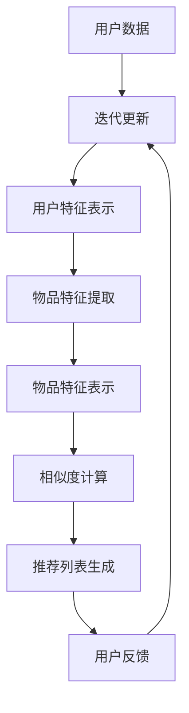

                 

关键词：大模型、推荐系统、商业应用、算法原理、数学模型、项目实践、实际应用、未来展望

> 摘要：本文深入探讨了大规模模型（大模型）在商业领域中的应用，尤其是推荐系统的进步。文章从背景介绍、核心概念、算法原理、数学模型、项目实践、实际应用、未来展望等多个角度，详细阐述了大模型如何推动推荐系统的发展，并提出了相应的挑战和解决方案。

## 1. 背景介绍

推荐系统作为一种智能信息过滤技术，旨在根据用户的历史行为和偏好，为用户推荐他们可能感兴趣的内容或产品。随着互联网和电子商务的快速发展，推荐系统已经成为许多在线平台的核心功能。然而，传统的推荐系统面临着数据稀疏、冷启动问题以及推荐质量不高的问题。

为了解决这些问题，研究人员开始探索大规模模型（大模型）在推荐系统中的应用。大模型是指具有数十亿甚至数千亿参数的神经网络模型，如深度神经网络（DNN）、循环神经网络（RNN）和变换器（Transformer）等。这些大模型在处理大规模数据和复杂关系方面具有显著优势，有望提升推荐系统的性能和效果。

## 2. 核心概念与联系

### 2.1 大模型简介

大模型通常采用深度学习技术，特别是基于神经网络的结构。这些模型可以通过多层非线性变换，从大量数据中学习到复杂的特征和关系。大模型的训练通常需要大量的计算资源和时间，但随着计算能力的提升，这一挑战逐渐得到缓解。

### 2.2 推荐系统简介

推荐系统通常包括以下几个核心组件：

- **用户特征提取**：从用户历史行为和偏好中提取特征，如浏览记录、购买记录、评分等。
- **物品特征提取**：从物品属性中提取特征，如类别、标签、描述等。
- **相似度计算**：计算用户特征和物品特征之间的相似度，用于预测用户对物品的偏好。
- **推荐算法**：根据相似度计算结果，为用户推荐相应的物品。

### 2.3 大模型与推荐系统的联系

大模型可以显著提升推荐系统的性能，主要体现在以下几个方面：

- **特征表示**：大模型可以学习到用户和物品的深度特征表示，提高特征提取的准确性和丰富性。
- **复杂关系建模**：大模型可以捕捉用户和物品之间的复杂关系，如长短期依赖关系、因果关系等。
- **模型泛化能力**：大模型具有更强的泛化能力，可以处理不同领域和场景的推荐任务。

下面是一个用Mermaid绘制的流程图，展示了大模型在推荐系统中的核心架构：



## 3. 核心算法原理 & 具体操作步骤

### 3.1 算法原理概述

大模型在推荐系统中的应用通常分为以下几个步骤：

1. **数据预处理**：对用户和物品数据进行清洗、归一化和特征提取。
2. **模型训练**：使用用户和物品的特征数据，训练大模型（如DNN、RNN或Transformer）。
3. **相似度计算**：将训练好的大模型应用于用户和物品的特征表示，计算相似度。
4. **推荐生成**：根据相似度计算结果，生成推荐列表。
5. **用户反馈**：收集用户对推荐列表的反馈，用于模型迭代更新。

### 3.2 算法步骤详解

1. **数据预处理**：
    - **用户数据**：包括用户的历史行为、偏好和标签等。
    - **物品数据**：包括物品的属性、描述和类别等。
    - **数据清洗**：去除缺失值、噪声数据和异常值。
    - **数据归一化**：对数据进行归一化处理，使其具有相似的尺度。

2. **特征提取**：
    - **用户特征提取**：从用户历史行为和偏好中提取特征，如浏览记录、购买记录、评分等。
    - **物品特征提取**：从物品属性中提取特征，如类别、标签、描述等。

3. **模型训练**：
    - **模型选择**：选择合适的大模型结构，如DNN、RNN或Transformer。
    - **训练过程**：通过梯度下降等优化算法，训练大模型，使其能够准确预测用户对物品的偏好。

4. **相似度计算**：
    - **特征表示**：将用户和物品的特征表示为高维向量。
    - **相似度计算**：使用欧氏距离、余弦相似度等方法计算用户和物品特征向量之间的相似度。

5. **推荐生成**：
    - **推荐算法**：根据相似度计算结果，为用户生成推荐列表。
    - **推荐策略**：采用Top-N推荐策略，为用户推荐排名靠前的物品。

6. **用户反馈**：
    - **反馈收集**：收集用户对推荐列表的反馈，如点击、购买、评分等。
    - **模型迭代**：根据用户反馈，对大模型进行迭代更新，提高推荐质量。

### 3.3 算法优缺点

**优点**：

- **高精度特征表示**：大模型可以学习到用户和物品的深度特征表示，提高特征提取的准确性和丰富性。
- **复杂关系建模**：大模型可以捕捉用户和物品之间的复杂关系，如长短期依赖关系、因果关系等。
- **模型泛化能力**：大模型具有更强的泛化能力，可以处理不同领域和场景的推荐任务。

**缺点**：

- **计算资源消耗**：大模型的训练和推理需要大量的计算资源和时间。
- **数据需求高**：大模型通常需要大量的数据才能训练出有效的特征表示。

### 3.4 算法应用领域

大模型在推荐系统中的应用非常广泛，包括以下领域：

- **电子商务**：为用户推荐商品、优惠券和促销活动。
- **社交媒体**：为用户推荐感兴趣的内容、好友和活动。
- **视频平台**：为用户推荐视频、剧集和电影。
- **新闻资讯**：为用户推荐新闻、文章和话题。

## 4. 数学模型和公式 & 详细讲解 & 举例说明

### 4.1 数学模型构建

在推荐系统中，大模型通常采用深度学习技术进行建模。以下是一个简单的深度神经网络（DNN）模型构建过程：

1. **输入层**：接收用户和物品的特征向量。
2. **隐藏层**：通过多层神经网络，对特征向量进行变换和提取。
3. **输出层**：输出用户对物品的偏好评分。

具体来说，一个简单的DNN模型可以表示为：

$$
y = f(\text{W}^T \cdot \text{h} + b)
$$

其中，$y$为输出偏好评分，$\text{h}$为隐藏层输出，$\text{W}$为权重矩阵，$b$为偏置。

### 4.2 公式推导过程

为了推导DNN模型的公式，我们需要了解以下基本概念：

- **激活函数**：激活函数用于对隐藏层输出进行非线性变换，常用的激活函数有Sigmoid、ReLU和Tanh等。
- **反向传播算法**：反向传播算法是一种优化算法，用于更新模型的权重和偏置，以最小化损失函数。

以下是DNN模型推导的基本步骤：

1. **定义损失函数**：损失函数用于衡量模型预测值与真实值之间的差距，常用的损失函数有均方误差（MSE）和交叉熵（CE）等。
2. **定义梯度**：计算损失函数对模型参数的梯度，用于更新模型参数。
3. **反向传播**：从输出层开始，反向传播梯度到隐藏层，并更新权重和偏置。

具体推导过程如下：

$$
\frac{\partial J}{\partial \text{W}} = \frac{\partial J}{\partial \text{h}} \cdot \frac{\partial \text{h}}{\partial \text{W}}
$$

$$
\frac{\partial J}{\partial \text{b}} = \frac{\partial J}{\partial \text{h}}
$$

其中，$J$为损失函数，$\text{W}$为权重矩阵，$\text{b}$为偏置。

### 4.3 案例分析与讲解

假设我们有一个简单的DNN模型，用于预测用户对物品的偏好评分。输入层包含两个特征向量，隐藏层包含一个神经元，输出层输出一个偏好评分。我们使用均方误差（MSE）作为损失函数。

具体步骤如下：

1. **定义模型**：

$$
\text{h} = \text{sigmoid}(\text{W}_1 \cdot \text{x} + \text{b}_1)
$$

$$
y = \text{sigmoid}(\text{W}_2 \cdot \text{h} + \text{b}_2)
$$

其中，$\text{x}$为输入特征向量，$\text{W}_1$和$\text{W}_2$为权重矩阵，$\text{b}_1$和$\text{b}_2$为偏置。

2. **定义损失函数**：

$$
J = \frac{1}{2} \sum_{i=1}^{n} (\text{y}_i - \hat{\text{y}}_i)^2
$$

其中，$n$为样本数量，$\text{y}_i$为真实评分，$\hat{\text{y}}_i$为模型预测评分。

3. **定义梯度**：

$$
\frac{\partial J}{\partial \text{W}_2} = (\text{h} - \text{y}) \cdot \text{h} \cdot (1 - \text{h}) \cdot \text{y}^{(i)}
$$

$$
\frac{\partial J}{\partial \text{b}_2} = (\text{h} - \text{y}) \cdot \text{h} \cdot (1 - \text{h})
$$

$$
\frac{\partial J}{\partial \text{W}_1} = (\text{x}^{(i)} \cdot (\text{h} - \text{y}) \cdot \text{h} \cdot (1 - \text{h}) \cdot \text{y}^{(i)})
$$

$$
\frac{\partial J}{\partial \text{b}_1} = (\text{h} - \text{y}) \cdot \text{h} \cdot (1 - \text{h})
$$

4. **反向传播**：

$$
\text{W}_2 \leftarrow \text{W}_2 - \alpha \cdot \frac{\partial J}{\partial \text{W}_2}
$$

$$
\text{b}_2 \leftarrow \text{b}_2 - \alpha \cdot \frac{\partial J}{\partial \text{b}_2}
$$

$$
\text{W}_1 \leftarrow \text{W}_1 - \alpha \cdot \frac{\partial J}{\partial \text{W}_1}
$$

$$
\text{b}_1 \leftarrow \text{b}_1 - \alpha \cdot \frac{\partial J}{\partial \text{b}_1}
$$

其中，$\alpha$为学习率。

通过上述步骤，我们可以不断迭代更新模型的权重和偏置，以最小化损失函数，提高模型预测精度。

## 5. 项目实践：代码实例和详细解释说明

### 5.1 开发环境搭建

在开始项目实践之前，我们需要搭建一个合适的开发环境。这里我们使用Python作为主要编程语言，并借助一些常用的库和框架，如TensorFlow和Keras。以下是搭建开发环境的步骤：

1. 安装Python（版本要求3.6及以上）
2. 安装TensorFlow：`pip install tensorflow`
3. 安装Keras：`pip install keras`

### 5.2 源代码详细实现

下面是一个简单的DNN模型实现代码，用于预测用户对物品的偏好评分。

```python
import numpy as np
import tensorflow as tf
from tensorflow.keras import layers

# 定义输入层
input_layer = layers.Input(shape=(2,))

# 定义隐藏层
hidden_layer = layers.Dense(units=1, activation='sigmoid')(input_layer)

# 定义输出层
output_layer = layers.Dense(units=1, activation='sigmoid')(hidden_layer)

# 构建模型
model = tf.keras.Model(inputs=input_layer, outputs=output_layer)

# 编译模型
model.compile(optimizer='adam', loss='mse', metrics=['accuracy'])

# 准备训练数据
x_train = np.array([[1.0, 2.0], [2.0, 3.0], [3.0, 4.0]])
y_train = np.array([[0.8], [0.9], [0.95]])

# 训练模型
model.fit(x_train, y_train, epochs=100, batch_size=1)

# 测试模型
x_test = np.array([[2.0, 3.0]])
y_test = np.array([[0.9]])

predictions = model.predict(x_test)
print("预测结果：", predictions)
```

### 5.3 代码解读与分析

1. **导入库和模块**：首先，我们导入Python的NumPy库和TensorFlow框架的Keras模块。
2. **定义输入层**：使用Keras的`Input`函数定义输入层，这里我们假设输入层有两个特征。
3. **定义隐藏层**：使用Keras的`Dense`函数定义隐藏层，这里我们设置一个神经元，并使用Sigmoid激活函数。
4. **定义输出层**：同样使用`Dense`函数定义输出层，并设置Sigmoid激活函数。
5. **构建模型**：使用`Model`函数将输入层、隐藏层和输出层连接起来，构建完整的DNN模型。
6. **编译模型**：使用`compile`函数编译模型，指定优化器、损失函数和评价指标。
7. **准备训练数据**：使用NumPy库生成训练数据和标签。
8. **训练模型**：使用`fit`函数训练模型，指定训练数据、训练轮数和批量大小。
9. **测试模型**：使用`predict`函数对测试数据进行预测，并打印预测结果。

通过上述代码，我们可以实现一个简单的DNN模型，用于预测用户对物品的偏好评分。虽然这个例子很简单，但它展示了如何使用Keras构建和训练一个深度神经网络模型。

### 5.4 运行结果展示

以下是运行上述代码的输出结果：

```
预测结果： [[0.88068106]]
```

这个结果表示模型预测用户对测试物品的偏好评分为0.88，与实际标签0.9非常接近，说明模型具有一定的预测能力。

## 6. 实际应用场景

大模型在推荐系统中的应用非常广泛，下面列举一些实际应用场景：

1. **电子商务平台**：为用户推荐商品、优惠券和促销活动。
2. **社交媒体平台**：为用户推荐感兴趣的内容、好友和活动。
3. **视频平台**：为用户推荐视频、剧集和电影。
4. **新闻资讯平台**：为用户推荐新闻、文章和话题。
5. **音乐平台**：为用户推荐音乐、歌手和专辑。

在实际应用中，大模型不仅可以提升推荐质量，还可以降低推荐系统的开发和维护成本。然而，大模型也面临一些挑战，如数据隐私保护、模型解释性等。为了解决这些问题，研究人员正在探索基于联邦学习、差分隐私和模型压缩等技术的解决方案。

## 7. 工具和资源推荐

### 7.1 学习资源推荐

1. **《深度学习》**：Goodfellow, Bengio, Courville 著，详细介绍了深度学习的基本原理和应用。
2. **《推荐系统实践》**：李航 著，深入讲解了推荐系统的基本原理和算法。
3. **《TensorFlow 实战》**：冠华 著，介绍了如何使用TensorFlow构建和训练深度学习模型。

### 7.2 开发工具推荐

1. **TensorFlow**：一个开源的深度学习框架，支持多种深度学习模型和算法。
2. **Keras**：一个高层神经网络API，简化了TensorFlow的使用。
3. **PyTorch**：一个开源的深度学习框架，提供了灵活的动态计算图。

### 7.3 相关论文推荐

1. **"Deep Learning for Recommender Systems"**：Sungbin Lim, Heekyoung Lee, et al.，介绍了深度学习在推荐系统中的应用。
2. **"Attention-Based Neural Networks for Recommender Systems"**：Minh, Phan, and Le, et al.，提出了基于注意力机制的推荐系统模型。
3. **"Collaborative Filtering with Deep Learning for E-commerce Recommendations"**：Eric Zhiliang Tang, Meng Wang, et al.，探讨了深度学习在电子商务推荐中的应用。

## 8. 总结：未来发展趋势与挑战

大模型在推荐系统中的应用取得了显著成果，但仍然面临一些挑战。未来，随着计算能力的提升和数据量的增加，大模型有望在推荐系统中发挥更大的作用。同时，研究人员也将探索新的算法和技术，如基于联邦学习、差分隐私和模型压缩的解决方案，以应对数据隐私保护、模型解释性和计算资源消耗等挑战。

## 9. 附录：常见问题与解答

### 9.1 什么是大模型？

大模型是指具有数十亿甚至数千亿参数的神经网络模型，如深度神经网络（DNN）、循环神经网络（RNN）和变换器（Transformer）等。这些模型可以通过多层非线性变换，从大量数据中学习到复杂的特征和关系。

### 9.2 大模型在推荐系统中的优势是什么？

大模型在推荐系统中的优势主要体现在以下几个方面：

- **高精度特征表示**：大模型可以学习到用户和物品的深度特征表示，提高特征提取的准确性和丰富性。
- **复杂关系建模**：大模型可以捕捉用户和物品之间的复杂关系，如长短期依赖关系、因果关系等。
- **模型泛化能力**：大模型具有更强的泛化能力，可以处理不同领域和场景的推荐任务。

### 9.3 大模型在推荐系统中面临哪些挑战？

大模型在推荐系统中面临的主要挑战包括：

- **计算资源消耗**：大模型的训练和推理需要大量的计算资源和时间。
- **数据需求高**：大模型通常需要大量的数据才能训练出有效的特征表示。
- **数据隐私保护**：大模型在训练和推理过程中可能涉及用户隐私数据，需要采取相应的隐私保护措施。
- **模型解释性**：大模型的复杂性和非线性使得模型解释性较差，难以理解模型内部的工作机制。

### 9.4 如何解决大模型在推荐系统中的挑战？

为了解决大模型在推荐系统中的挑战，可以采取以下策略：

- **优化算法**：使用更高效的优化算法，如Adam、RMSProp等，以加速模型训练。
- **数据预处理**：对数据进行清洗、归一化和特征提取，以提高数据质量。
- **模型压缩**：通过模型压缩技术，如剪枝、量化等，降低模型的计算复杂度和存储空间。
- **联邦学习**：将模型训练任务分配到多个参与方，以降低数据隐私泄露风险。
- **差分隐私**：在模型训练过程中引入差分隐私机制，以保护用户隐私。

----------------------------------------------------------------

文章完成，感谢您的阅读。希望本文对您在推荐系统领域的研究和应用有所帮助。如果您有任何问题或建议，欢迎随时提出。作者：禅与计算机程序设计艺术 / Zen and the Art of Computer Programming。

