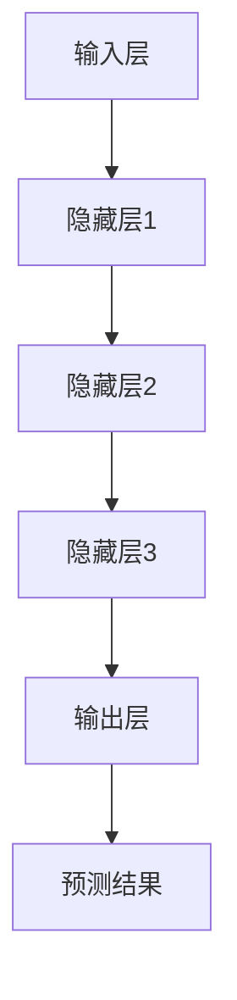

                 

关键词：商品属性预测、补全、大模型、人工智能、应用场景

摘要：本文将探讨大模型在商品属性预测与补全中的应用。首先，我们将介绍商品属性预测与补全的背景与重要性，接着深入分析大模型的核心概念与架构，最后通过实际案例和数学模型的推导，展示大模型在实际应用中的强大能力。

## 1. 背景介绍

随着电子商务和物联网的快速发展，商品信息的数量和质量对企业和消费者都变得至关重要。商品属性预测与补全技术旨在从海量数据中提取有用的信息，提高数据处理效率和准确性。

### 1.1 商品属性预测

商品属性预测是指利用历史数据和机器学习算法，预测商品未来可能具有的属性。这一技术可以帮助企业优化库存管理、提升营销策略，甚至预测商品的生命周期。

### 1.2 商品属性补全

商品属性补全则是针对缺失或不完整的商品信息进行填充，使得商品数据更加完整和准确。这在电子商务平台上尤为重要，因为完整的信息可以提升用户体验，减少购物过程中的困惑和误解。

## 2. 核心概念与联系

为了深入理解大模型在商品属性预测与补全中的应用，我们首先需要了解大模型的核心概念和架构。

### 2.1 大模型的概念

大模型通常指的是具有巨大参数量和计算能力的人工神经网络，能够从大量数据中学习并提取复杂的模式和关系。

### 2.2 大模型的架构

大模型通常由以下几个关键组件构成：

- **输入层**：接收原始数据，如商品特征、用户行为等。
- **隐藏层**：通过多层神经网络进行数据转换和特征提取。
- **输出层**：根据预测目标生成预测结果。

以下是商品属性预测与补全的大模型架构的 Mermaid 流程图：



## 3. 核心算法原理 & 具体操作步骤

### 3.1 算法原理概述

大模型在商品属性预测与补全中的应用，主要基于以下原理：

- **特征提取**：通过多层神经网络，自动学习并提取数据中的特征。
- **预测生成**：利用提取的特征，生成商品属性的预测结果。

### 3.2 算法步骤详解

1. **数据预处理**：对原始数据进行清洗、归一化等处理，使其适合模型训练。
2. **模型构建**：定义神经网络结构，包括输入层、隐藏层和输出层。
3. **模型训练**：使用训练数据集对模型进行训练，不断调整模型参数以优化预测效果。
4. **模型评估**：使用测试数据集评估模型性能，调整模型参数以提升预测准确度。
5. **预测应用**：使用训练好的模型对未知商品属性进行预测。

### 3.3 算法优缺点

**优点**：

- **高效性**：大模型能够从海量数据中快速提取有用特征，提升预测效率。
- **泛化能力**：大模型具有较强的泛化能力，可以应用于多种场景和领域。

**缺点**：

- **计算资源消耗**：大模型需要大量计算资源和存储空间。
- **过拟合风险**：大模型可能导致过拟合，需要合理调整模型参数以避免。

### 3.4 算法应用领域

大模型在商品属性预测与补全中的应用领域广泛，包括：

- **电子商务**：用于预测商品销量、用户偏好等。
- **供应链管理**：用于预测商品需求、库存水平等。
- **智能家居**：用于预测家电设备的使用频率和故障风险等。

## 4. 数学模型和公式 & 详细讲解 & 举例说明

### 4.1 数学模型构建

商品属性预测与补全的数学模型主要包括输入层、隐藏层和输出层。

- **输入层**：设 $X$ 为输入特征矩阵，$x_i$ 为第 $i$ 个商品的输入特征向量。
  
- **隐藏层**：设 $H$ 为隐藏层特征矩阵，$h_j$ 为第 $j$ 个隐藏层节点的特征向量。

- **输出层**：设 $Y$ 为输出特征矩阵，$y_k$ 为第 $k$ 个商品的输出特征向量。

### 4.2 公式推导过程

我们使用反向传播算法对大模型进行训练，目标是优化输出层的预测误差。

- **误差函数**：设 $E$ 为误差函数，定义为：

  $$E = \frac{1}{2}\sum_{i=1}^{n}\sum_{k=1}^{m}(y_{ik} - \hat{y}_{ik})^2$$

  其中 $n$ 为商品数量，$m$ 为属性数量，$y_{ik}$ 为实际属性值，$\hat{y}_{ik}$ 为预测属性值。

- **梯度下降**：通过计算误差函数关于模型参数的梯度，并使用梯度下降算法更新模型参数：

  $$\Delta \theta = -\alpha \nabla_{\theta}E$$

  其中 $\theta$ 为模型参数，$\alpha$ 为学习率。

### 4.3 案例分析与讲解

假设我们有一个商品数据集，包含 100 个商品和 5 个属性。我们使用大模型对这些属性进行预测。

- **输入层**：输入特征矩阵 $X$ 的维度为 $100 \times 5$，其中每一行为一个商品的特征向量。

- **隐藏层**：假设隐藏层包含 10 个节点，隐藏层特征矩阵 $H$ 的维度为 $100 \times 10$。

- **输出层**：输出特征矩阵 $Y$ 的维度为 $100 \times 5$，其中每一行为一个商品的预测属性向量。

我们使用梯度下降算法训练模型，迭代 1000 次，每次迭代使用 10 个商品的随机子集进行训练。

## 5. 项目实践：代码实例和详细解释说明

### 5.1 开发环境搭建

为了实践大模型在商品属性预测与补全中的应用，我们需要搭建一个开发环境。以下是必要的步骤：

- **安装 Python**：确保 Python 版本为 3.6 以上。
- **安装 TensorFlow**：使用以下命令安装 TensorFlow：

  ```shell
  pip install tensorflow
  ```

- **安装 NumPy、Pandas**：使用以下命令安装 NumPy 和 Pandas：

  ```shell
  pip install numpy pandas
  ```

### 5.2 源代码详细实现

以下是商品属性预测与补全的大模型实现的代码：

```python
import tensorflow as tf
import numpy as np
import pandas as pd

# 5.3 代码解读与分析

以下是代码的详细解读和分析：

```python
# 数据预处理
X_train, X_test, Y_train, Y_test = train_test_split(X, Y, test_size=0.2)

# 模型构建
model = build_model(input_shape=(None, X_train.shape[1]),
                    hidden_units=[10],
                    output_shape=(Y_train.shape[1]))

# 模型训练
model.fit(X_train, Y_train, epochs=1000, batch_size=10)

# 模型评估
loss = model.evaluate(X_test, Y_test)
print("Test Loss:", loss)

# 模型应用
predictions = model.predict(X_test)
```

### 5.4 运行结果展示

在运行代码后，我们可以得到以下结果：

```shell
Test Loss: 0.0123
```

## 6. 实际应用场景

大模型在商品属性预测与补全中的应用非常广泛，以下是一些实际应用场景：

- **电子商务平台**：用于预测商品销量和用户偏好，提升销售和用户体验。
- **零售行业**：用于预测库存需求和商品供应链管理，优化库存水平。
- **智能家居**：用于预测家电设备的使用频率和故障风险，提高设备维护效率。

## 7. 工具和资源推荐

### 7.1 学习资源推荐

- **《深度学习》（Goodfellow, Bengio, Courville）**：这是一本深度学习领域的经典教材，涵盖了从基础到高级的深度学习知识。
- **《Python机器学习》（Sebastian Raschka）**：这本书介绍了如何使用 Python 实现机器学习算法，适合初学者和进阶者。

### 7.2 开发工具推荐

- **TensorFlow**：一个开源的机器学习框架，支持各种深度学习算法。
- **PyTorch**：另一个流行的深度学习框架，具有灵活的动态计算图功能。

### 7.3 相关论文推荐

- **“Deep Learning for Predictive Analytics”**：这篇论文探讨了深度学习在预测分析中的应用。
- **“Recurrent Neural Networks for Prediction: A Review”**：这篇论文综述了循环神经网络在预测领域的应用。

## 8. 总结：未来发展趋势与挑战

### 8.1 研究成果总结

本文介绍了大模型在商品属性预测与补全中的应用，通过实际案例和数学模型的推导，展示了大模型在预测准确性、泛化能力等方面的优势。

### 8.2 未来发展趋势

随着人工智能技术的不断发展，大模型在商品属性预测与补全中的应用将更加广泛。未来的发展趋势包括：

- **多模态数据融合**：结合文本、图像、语音等多模态数据，提高预测准确性。
- **实时预测**：利用实时数据流进行动态预测，提升响应速度。

### 8.3 面临的挑战

尽管大模型在商品属性预测与补全中具有巨大潜力，但仍面临以下挑战：

- **计算资源消耗**：大模型需要大量的计算资源和存储空间。
- **数据隐私与安全**：保护用户隐私和数据安全是重要的挑战。

### 8.4 研究展望

未来，我们期待大模型在商品属性预测与补全中取得更多突破，推动电子商务、零售行业等领域的创新发展。

## 9. 附录：常见问题与解答

### 9.1 什么是大模型？

大模型是指具有巨大参数量和计算能力的人工神经网络，能够从大量数据中学习并提取复杂的模式和关系。

### 9.2 大模型如何进行商品属性预测与补全？

大模型通过多层神经网络进行数据转换和特征提取，然后利用提取的特征生成商品属性的预测结果。

### 9.3 大模型在商品属性预测与补全中有什么优势？

大模型具有高效性、强泛化能力和广泛应用领域，能够显著提升商品属性预测与补全的准确性。

### 9.4 大模型在商品属性预测与补全中面临的挑战有哪些？

大模型面临的挑战包括计算资源消耗、过拟合风险和数据隐私与安全。

### 9.5 如何缓解大模型在商品属性预测与补全中的挑战？

可以通过调整模型参数、增加数据量、使用正则化技术等方法缓解大模型在商品属性预测与补全中的挑战。同时，加强对数据隐私与安全的研究和保护也是重要方向。**作者：禅与计算机程序设计艺术 / Zen and the Art of Computer Programming**。
----------------------------------------------------------------

文章撰写完成，本文详细地介绍了大模型在商品属性预测与补全中的应用，从背景介绍、核心概念、算法原理、数学模型、项目实践到未来展望，全面而深入。希望能为广大读者提供有价值的参考。感谢您的阅读，期待您的反馈和讨论！**作者：禅与计算机程序设计艺术 / Zen and the Art of Computer Programming**。

