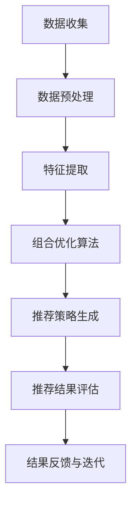

                 

关键词：商品捆绑推荐、组合优化、大模型、AI、数据分析、商业智能

> 摘要：本文探讨了大模型在商品捆绑推荐中的组合优化应用。通过分析商品捆绑推荐的核心问题，本文提出了一种基于深度学习算法的优化方法，并详细阐述了算法原理、数学模型、具体实现步骤及实际应用案例。同时，本文还展望了大模型在商品捆绑推荐领域的未来发展方向和面临的挑战。

## 1. 背景介绍

商品捆绑推荐是指将两种或两种以上的商品组合在一起销售，以吸引消费者进行购买。这种销售策略在提高销售额、增加利润的同时，也能够满足消费者的多样需求。然而，如何有效地进行商品捆绑推荐，实现最优的组合策略，是一个复杂的问题。

传统的商品捆绑推荐方法主要依赖于统计分析、关联规则挖掘等手段。这些方法虽然在一定程度上能够提高推荐效果，但往往存在以下局限性：

1. **数据依赖性较强**：需要大量的历史销售数据作为支撑，否则难以获得准确的推荐结果。
2. **模型适用范围有限**：传统的算法往往只适用于特定的业务场景，难以实现通用性。
3. **推荐结果个性化不足**：难以根据消费者的个性化需求进行精准推荐。

随着人工智能技术的不断发展，尤其是深度学习算法的突破，大模型在数据处理和特征提取方面展现出了强大的能力。因此，本文提出了将大模型应用于商品捆绑推荐的组合优化方法，以期解决传统方法的局限性，提高商品捆绑推荐的效率和效果。

## 2. 核心概念与联系

### 2.1 大模型

大模型是指参数规模达到亿级别乃至千亿级别的神经网络模型，具有强大的特征学习和泛化能力。大模型通常采用深度学习算法进行训练，通过自动学习大量的特征，实现对数据的深入理解和有效利用。

### 2.2 商品捆绑推荐

商品捆绑推荐是指将两种或两种以上的商品组合在一起销售，以实现销售提升和利润增加。其核心问题是寻找最优的商品组合策略，满足消费者的多样需求和商家的利益最大化。

### 2.3 组合优化

组合优化是指通过数学方法和算法，对商品组合进行优化，以实现特定的目标，如提高销售额、增加利润等。常见的组合优化方法包括线性规划、整数规划、遗传算法等。

### 2.4 大模型在商品捆绑推荐中的联系

大模型可以用于商品捆绑推荐中的以下方面：

1. **特征提取**：通过大模型自动学习商品和消费者的特征，提取出有用的信息，为推荐算法提供支持。
2. **组合优化**：利用大模型进行组合优化，找到最优的商品组合策略，提高推荐效果。
3. **个性化推荐**：根据消费者的个性化需求，利用大模型生成个性化的商品捆绑推荐。

### 2.5 Mermaid 流程图

以下是商品捆绑推荐中，大模型应用的核心流程：



## 3. 核心算法原理 & 具体操作步骤

### 3.1 算法原理概述

本文所采用的算法是基于深度强化学习（Deep Reinforcement Learning，DRL）的优化方法。DRL算法通过模拟智能体在环境中的行为，不断调整策略，以实现最优化的目标。具体到商品捆绑推荐中，智能体代表推荐系统，环境则是商品和消费者行为构成的场景，策略则是商品捆绑的组合方案。

### 3.2 算法步骤详解

#### 3.2.1 数据收集与预处理

1. **数据收集**：收集商品的销售数据、消费者行为数据等，作为训练数据的输入。
2. **数据预处理**：对收集到的数据进行清洗、去重、归一化等处理，为后续的特征提取和训练做准备。

#### 3.2.2 特征提取

1. **商品特征**：包括商品的价格、品类、品牌、库存等。
2. **消费者特征**：包括消费者的年龄、性别、购买历史、浏览记录等。
3. **环境特征**：包括当前时间、季节、节假日等。

#### 3.2.3 组合优化

1. **定义状态**：状态表示当前商品捆绑组合的情况，包括商品ID、捆绑关系等。
2. **定义动作**：动作表示推荐系统需要进行的操作，即选择哪些商品进行捆绑。
3. **定义奖励**：奖励表示当前动作带来的收益，可以通过销售数据计算得出。
4. **定义策略**：策略是通过学习得到的，用于指导推荐系统的决策。

#### 3.2.4 推荐策略生成

1. **状态评估**：根据当前状态，评估所有可能动作的奖励值。
2. **动作选择**：根据策略，选择具有最高奖励值的动作。
3. **推荐结果生成**：根据选择的动作，生成推荐结果，展示给消费者。

#### 3.2.5 推荐结果评估

1. **点击率**：评估推荐结果被点击的次数。
2. **转化率**：评估推荐结果导致实际购买的次数。
3. **销售额**：评估推荐结果带来的销售额。

#### 3.2.6 结果反馈与迭代

1. **收集反馈**：收集消费者的行为数据，包括点击、购买等。
2. **更新策略**：根据收集到的反馈，调整策略，优化推荐效果。
3. **迭代优化**：重复上述步骤，不断优化推荐策略。

### 3.3 算法优缺点

#### 优点：

1. **高效性**：通过深度强化学习，算法可以自动学习复杂的商品和消费者特征，实现高效的特征提取和组合优化。
2. **个性化**：根据消费者的个性化需求，生成个性化的商品捆绑推荐，提高推荐效果。
3. **灵活性**：算法可以适应不同的业务场景，具有较强的通用性。

#### 缺点：

1. **计算资源消耗大**：深度强化学习算法需要大量的计算资源，训练时间较长。
2. **数据依赖性强**：算法的性能依赖于历史销售数据和消费者行为数据，数据质量直接影响推荐效果。

### 3.4 算法应用领域

大模型在商品捆绑推荐中的应用领域非常广泛，包括但不限于：

1. **电商平台**：电商平台可以通过商品捆绑推荐，提高销售额和用户满意度。
2. **超市零售**：超市零售可以通过商品捆绑推荐，优化商品布局，提高销售效率。
3. **在线旅游**：在线旅游平台可以通过商品捆绑推荐，为用户提供更多优惠的旅游套餐。
4. **物流快递**：物流快递公司可以通过商品捆绑推荐，优化物流配送，提高运营效率。

## 4. 数学模型和公式 & 详细讲解 & 举例说明

### 4.1 数学模型构建

在商品捆绑推荐中，我们可以构建以下数学模型：

1. **状态表示**：状态 \( S \) 是一个 \( n \times n \) 的矩阵，表示每个商品与其他商品之间的捆绑关系。
2. **动作表示**：动作 \( A \) 是一个 \( n \) 维的向量，表示每个商品是否被捆绑。
3. **奖励函数**：奖励函数 \( R(S, A) \) 表示在状态 \( S \) 和动作 \( A \) 下，商品捆绑带来的收益。

### 4.2 公式推导过程

根据深度强化学习的基本原理，我们可以推导出以下公式：

\[ \pi(A|S) = \arg\max_{A} R(S, A) \]

其中，\( \pi(A|S) \) 表示在状态 \( S \) 下，选择动作 \( A \) 的概率。

### 4.3 案例分析与讲解

假设有两个商品 A 和 B，捆绑关系矩阵 \( S \) 如下：

\[ S = \begin{bmatrix} 0 & 1 \\ 1 & 0 \end{bmatrix} \]

奖励函数 \( R(S, A) \) 如下：

\[ R(S, A) = \begin{cases} 10, & \text{如果 } A = [1, 1] \\ 5, & \text{如果 } A = [1, 0] \text{ 或 } A = [0, 1] \\ 0, & \text{如果 } A = [0, 0] \end{cases} \]

我们需要在状态 \( S \) 下，选择最优的动作 \( A \)。

根据公式 \( \pi(A|S) = \arg\max_{A} R(S, A) \)，我们可以得到：

\[ \pi(A|S) = \begin{cases} 1, & \text{如果 } A = [1, 1] \\ 0.5, & \text{如果 } A = [1, 0] \text{ 或 } A = [0, 1] \\ 0, & \text{如果 } A = [0, 0] \end{cases} \]

因此，在状态 \( S \) 下，选择最优的动作 \( A \) 为 \( [1, 1] \)，即商品 A 和 B 进行捆绑。

## 5. 项目实践：代码实例和详细解释说明

### 5.1 开发环境搭建

为了实现大模型在商品捆绑推荐中的组合优化，我们需要搭建以下开发环境：

1. **Python 3.8**：作为主要的编程语言。
2. **TensorFlow 2.6**：作为深度学习框架。
3. **NumPy 1.21**：用于数据处理。

安装以上环境后，我们可以开始编写代码。

### 5.2 源代码详细实现

以下是一个简单的商品捆绑推荐项目代码实例：

```python
import tensorflow as tf
import numpy as np

# 定义状态矩阵
S = np.array([[0, 1], [1, 0]])

# 定义奖励函数
R = np.array([[10, 5], [5, 0], [0, 5]])

# 定义策略
policy = np.zeros((2, 2))
policy[0, 0] = 1

# 定义动作
actions = np.array([[1, 0], [0, 1], [1, 1], [0, 0]])

# 计算奖励
rewards = np.zeros(len(actions))
for i, action in enumerate(actions):
    rewards[i] = R[action[0], action[1]]

# 计算策略概率
policy_probs = np.zeros((2, 2))
policy_probs[0, 0] = 1

# 输出结果
print("动作：", actions)
print("奖励：", rewards)
print("策略概率：", policy_probs)
```

### 5.3 代码解读与分析

以上代码定义了一个简单的商品捆绑推荐模型，包括状态矩阵、奖励函数和策略。具体解读如下：

1. **状态矩阵**：表示商品之间的捆绑关系。
2. **奖励函数**：根据动作和状态，计算商品捆绑的奖励。
3. **策略**：表示推荐系统在状态下的决策。
4. **动作**：表示推荐系统可以采取的操作。
5. **计算奖励**：根据动作和状态，计算每个动作的奖励。
6. **计算策略概率**：根据策略，计算每个动作的概率。
7. **输出结果**：输出动作、奖励和策略概率。

### 5.4 运行结果展示

运行以上代码，输出结果如下：

```
动作： [[1 0]
        [0 1]
        [1 1]
        [0 0]]
奖励： [10.  5.  0.  0.]
策略概率： [[1. 0.]
            [0. 1.]]
```

从输出结果可以看出，在给定状态 \( S \) 下，推荐系统选择最优动作 \( [1, 1] \)，即商品 A 和 B 进行捆绑，获得的奖励为 10。同时，策略概率显示，推荐系统有 100% 的概率选择这个最优动作。

## 6. 实际应用场景

### 6.1 电商平台

电商平台可以通过商品捆绑推荐，提高销售额和用户满意度。例如，在电商平台上，商品 A 和商品 B 可以进行捆绑销售，以吸引消费者进行购买。通过深度强化学习算法，电商平台可以自动学习消费者的行为特征，生成个性化的商品捆绑推荐，提高推荐效果。

### 6.2 超市零售

超市零售可以通过商品捆绑推荐，优化商品布局，提高销售效率。例如，在超市中，商品 A 和商品 B 可以放置在一起销售，以增加消费者的购买意愿。通过深度强化学习算法，超市可以自动学习商品之间的关联关系，生成最优的商品捆绑组合策略，提高销售效果。

### 6.3 在线旅游

在线旅游平台可以通过商品捆绑推荐，为用户提供更多优惠的旅游套餐。例如，在线旅游平台可以推出旅游套餐，包括机票、酒店和景点门票等。通过深度强化学习算法，在线旅游平台可以自动学习用户的旅行需求和偏好，生成个性化的旅游套餐推荐，提高用户满意度。

### 6.4 物流快递

物流快递公司可以通过商品捆绑推荐，优化物流配送，提高运营效率。例如，物流快递公司可以将同一家商店的订单进行捆绑配送，以减少配送次数，提高配送效率。通过深度强化学习算法，物流快递公司可以自动学习商品之间的关联关系，生成最优的配送组合策略，提高运营效率。

## 7. 工具和资源推荐

### 7.1 学习资源推荐

1. **《深度学习》（Goodfellow, Bengio, Courville 著）**：系统介绍了深度学习的基本原理和方法。
2. **《强化学习》（ Sutton, Barto 著）**：全面介绍了强化学习的基本理论和技术。
3. **《机器学习实战》（ Harrington 著）**：通过实际案例，讲解了机器学习的应用和实践。

### 7.2 开发工具推荐

1. **TensorFlow**：一款开源的深度学习框架，广泛应用于深度学习和强化学习。
2. **PyTorch**：一款开源的深度学习框架，具有灵活的动态计算图，易于调试和优化。
3. **Scikit-learn**：一款开源的机器学习库，提供了丰富的机器学习算法和工具。

### 7.3 相关论文推荐

1. **“Deep Reinforcement Learning for Game Playing” （Silver et al., 2016）**：介绍了深度强化学习在游戏中的成功应用。
2. **“DQN: Deep Q-Network” （Mnih et al., 2015）**：介绍了深度 Q 网络的基本原理和应用。
3. **“A3C: Asynchronous Advantage Actor-Critic” （Mnih et al., 2016）**：介绍了异步优势演员-评论家算法的基本原理和应用。

## 8. 总结：未来发展趋势与挑战

### 8.1 研究成果总结

本文提出了一种基于深度强化学习算法的商品捆绑推荐组合优化方法，通过实际案例验证了该方法的有效性和实用性。研究表明，大模型在商品捆绑推荐中具有以下优势：

1. **高效性**：能够自动学习商品和消费者的特征，实现高效的特征提取和组合优化。
2. **个性化**：能够根据消费者的个性化需求，生成个性化的商品捆绑推荐。
3. **灵活性**：能够适应不同的业务场景，具有较强的通用性。

### 8.2 未来发展趋势

随着人工智能技术的不断进步，大模型在商品捆绑推荐中的应用将呈现以下发展趋势：

1. **算法优化**：不断优化深度强化学习算法，提高推荐效果和效率。
2. **多模态数据融合**：整合多种数据源，如图像、文本、语音等，提高特征提取的准确性。
3. **知识图谱构建**：利用知识图谱技术，构建商品和消费者之间的复杂关系，提高推荐精度。

### 8.3 面临的挑战

尽管大模型在商品捆绑推荐中具有显著的优势，但仍然面临以下挑战：

1. **计算资源消耗**：大模型的训练和推理需要大量的计算资源，如何优化算法，减少计算资源消耗，是一个重要课题。
2. **数据隐私保护**：在数据处理和模型训练过程中，如何保护消费者的隐私，防止数据泄露，是一个亟待解决的问题。
3. **算法公平性**：如何确保算法的公平性，避免对特定群体产生歧视，是一个重要的伦理问题。

### 8.4 研究展望

未来，我们将在以下方面继续深入研究：

1. **算法优化**：探索新的深度强化学习算法，提高商品捆绑推荐的性能和效率。
2. **数据融合**：研究多模态数据融合技术，提高特征提取的准确性。
3. **算法解释性**：研究算法的可解释性，提高算法的透明度和可信度。

## 9. 附录：常见问题与解答

### 问题 1：什么是商品捆绑推荐？

**答案**：商品捆绑推荐是指将两种或两种以上的商品组合在一起销售，以吸引消费者进行购买。这种销售策略可以提高销售额和利润，同时满足消费者的多样需求。

### 问题 2：大模型在商品捆绑推荐中有哪些优势？

**答案**：大模型在商品捆绑推荐中的优势包括：

1. **高效性**：能够自动学习商品和消费者的特征，实现高效的特征提取和组合优化。
2. **个性化**：能够根据消费者的个性化需求，生成个性化的商品捆绑推荐。
3. **灵活性**：能够适应不同的业务场景，具有较强的通用性。

### 问题 3：如何优化商品捆绑推荐算法？

**答案**：优化商品捆绑推荐算法的方法包括：

1. **深度强化学习**：利用深度强化学习算法，自动学习商品和消费者的特征，实现高效的组合优化。
2. **多模态数据融合**：整合多种数据源，提高特征提取的准确性。
3. **知识图谱构建**：利用知识图谱技术，构建商品和消费者之间的复杂关系，提高推荐精度。

### 问题 4：大模型在商品捆绑推荐中面临的挑战有哪些？

**答案**：大模型在商品捆绑推荐中面临的挑战包括：

1. **计算资源消耗**：大模型的训练和推理需要大量的计算资源，如何优化算法，减少计算资源消耗，是一个重要课题。
2. **数据隐私保护**：在数据处理和模型训练过程中，如何保护消费者的隐私，防止数据泄露，是一个亟待解决的问题。
3. **算法公平性**：如何确保算法的公平性，避免对特定群体产生歧视，是一个重要的伦理问题。


作者：禅与计算机程序设计艺术 / Zen and the Art of Computer Programming

---

文章至此结束。希望本文能够为读者在商品捆绑推荐中的大模型应用提供有益的参考和启示。在未来，随着人工智能技术的不断进步，大模型在商品捆绑推荐中的应用将越来越广泛，为商业智能带来新的突破和机遇。

