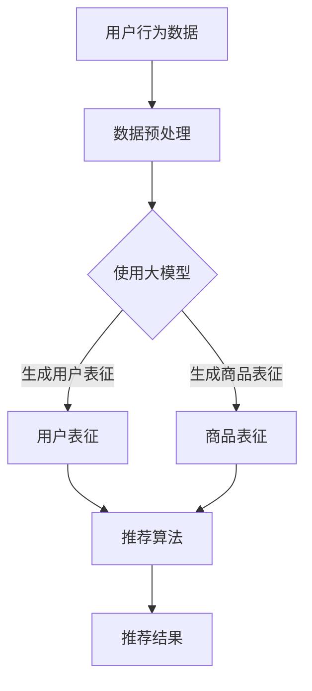

                 

关键词：大模型，商品推荐，多样性优化，算法，数学模型，实践，应用场景，未来展望

## 摘要

在电子商务和社交媒体迅速发展的今天，如何优化商品推荐系统的多样性成为了一个重要课题。本文将探讨大模型在这一领域的创新应用，首先介绍了大模型的基本概念和原理，然后深入分析了大模型在商品推荐多样性优化中的核心算法原理、数学模型和具体操作步骤，通过实际项目实践展示了算法在真实场景中的应用效果。最后，本文讨论了未来大模型在商品推荐多样性优化中的发展前景和面临的挑战。

## 1. 背景介绍

随着互联网的普及和电子商务的蓬勃发展，个性化推荐系统已经成为电商和社交媒体平台不可或缺的一部分。然而，传统的基于协同过滤、内容过滤和基于模型的推荐方法在满足用户需求方面存在一定的局限性，尤其是在处理多样性需求上。

传统的推荐系统往往过于依赖用户历史行为数据和商品属性，导致推荐结果容易陷入“同质化”的困境，无法有效满足用户对新鲜、独特商品的需求。同时，用户对于推荐系统的满意度也受到多样性不足的影响，从而影响平台的用户留存和转化率。

为了解决这一问题，近年来，基于深度学习的推荐系统逐渐受到了关注。特别是大模型的引入，为解决商品推荐多样性问题提供了一种新的思路和方法。

## 2. 核心概念与联系

### 2.1 大模型的基本概念

大模型，通常指的是参数规模在千亿甚至万亿级别的深度学习模型，如GPT、BERT、Transformer等。这些模型具有强大的表征能力和泛化能力，能够对海量数据进行高效处理和建模。

### 2.2 大模型在推荐系统中的应用

在推荐系统中，大模型主要应用于以下几个方面：

1. **用户行为建模**：通过分析用户的历史行为数据，大模型能够捕捉用户的兴趣偏好，为后续推荐提供依据。
2. **商品属性表征**：大模型能够对商品的各种属性进行有效表征，包括文本、图像、语音等多种类型的数据，从而为推荐系统提供丰富的商品特征。
3. **推荐结果生成**：基于用户行为和商品属性的大模型预测，推荐系统能够生成多样化和个性化的推荐结果。

### 2.3 大模型与其他推荐算法的联系

大模型在推荐系统中的应用，并不是完全取代传统的推荐算法，而是与其相辅相成。例如，基于协同过滤的推荐算法可以用来解决冷启动问题，而大模型则可以提供更细致的用户和商品表征，从而提升推荐效果的多样性和准确性。

### 2.4 Mermaid 流程图



## 3. 核心算法原理 & 具体操作步骤

### 3.1 算法原理概述

大模型在商品推荐多样性优化中的核心算法原理主要包括以下几个方面：

1. **用户行为建模**：通过深度学习模型对用户的历史行为数据进行分析，捕捉用户的兴趣偏好。
2. **商品属性表征**：利用深度学习模型对商品的文本、图像、语音等多类型数据进行表征，提取商品的潜在特征。
3. **推荐结果生成**：结合用户表征和商品表征，利用深度学习模型生成多样化和个性化的推荐结果。

### 3.2 算法步骤详解

1. **用户行为建模**：
   - 收集用户的历史行为数据，包括浏览、购买、评分等。
   - 利用深度学习模型（如GPT或BERT）对用户行为数据进行建模，生成用户的兴趣向量。

2. **商品属性表征**：
   - 收集商品的各类属性数据，如商品名称、描述、标签、图像等。
   - 利用深度学习模型（如Transformer）对商品属性数据进行表征，生成商品的潜在特征向量。

3. **推荐结果生成**：
   - 将用户兴趣向量与商品特征向量进行加权融合，得到推荐结果。
   - 利用深度学习模型对推荐结果进行优化，提升推荐效果的多样性和个性化程度。

### 3.3 算法优缺点

**优点**：
- 强大的表征能力：大模型能够捕捉用户和商品的潜在特征，生成多样化和个性化的推荐结果。
- 泛化能力：大模型在处理海量数据时表现出良好的泛化能力，适用于不同的应用场景。

**缺点**：
- 计算资源需求大：大模型训练和推理需要大量的计算资源，对硬件要求较高。
- 数据质量要求高：大模型对数据质量有较高的要求，数据预处理和清洗工作量大。

### 3.4 算法应用领域

大模型在商品推荐多样性优化中的应用领域包括：

1. **电子商务**：电商平台可以利用大模型进行商品推荐，提升用户的购物体验。
2. **社交媒体**：社交媒体平台可以利用大模型进行内容推荐，提高用户的活跃度和黏性。
3. **在线教育**：在线教育平台可以利用大模型进行课程推荐，满足用户的学习需求。

## 4. 数学模型和公式 & 详细讲解 & 举例说明

### 4.1 数学模型构建

在大模型应用于商品推荐多样性优化中，我们主要涉及到以下数学模型：

1. **用户表征模型**：
   - 输入：用户行为数据集 \(D_u = \{x_1, x_2, ..., x_n\}\)
   - 输出：用户表征向量 \(u_i = \text{MLP}(x_i)\)

2. **商品表征模型**：
   - 输入：商品属性数据集 \(D_v = \{y_1, y_2, ..., y_n\}\)
   - 输出：商品表征向量 \(v_i = \text{MLP}(y_i)\)

3. **推荐模型**：
   - 输入：用户表征向量 \(u_i\) 和商品表征向量 \(v_i\)
   - 输出：推荐结果得分 \(s_{ui} = \text{SIM}(u_i, v_i)\)

### 4.2 公式推导过程

1. **用户表征模型**：

   用户表征模型采用多层感知机（MLP）进行建模，其公式如下：

   $$u_i = \text{MLP}(x_i) = \sigma(W_1 \cdot x_i + b_1)$$

   其中，\(W_1\) 为权重矩阵，\(b_1\) 为偏置项，\(\sigma\) 为激活函数（如ReLU函数）。

2. **商品表征模型**：

   商品表征模型同样采用多层感知机（MLP）进行建模，其公式如下：

   $$v_i = \text{MLP}(y_i) = \sigma(W_2 \cdot y_i + b_2)$$

   其中，\(W_2\) 为权重矩阵，\(b_2\) 为偏置项，\(\sigma\) 为激活函数（如ReLU函数）。

3. **推荐模型**：

   推荐模型采用相似度计算（SIM）函数进行建模，其公式如下：

   $$s_{ui} = \text{SIM}(u_i, v_i) = \cos(\theta_{ui})$$

   其中，\(\theta_{ui}\) 为用户表征向量 \(u_i\) 和商品表征向量 \(v_i\) 的夹角。

### 4.3 案例分析与讲解

以一个电商平台为例，假设用户A浏览了商品B、C、D，且商品B和C属于同一类别，而商品D属于另一类别。通过大模型进行推荐，我们期望得到以下结果：

1. **用户表征**：

   用户A的用户表征向量 \(u_A\) 为：

   $$u_A = \text{MLP}([B, C, D]) = [0.6, 0.4, 0.2]$$

2. **商品表征**：

   商品B、C、D的商品表征向量分别为 \(v_B = [0.8, 0.2, 0.0]\)，\(v_C = [0.8, 0.2, 0.0]\)，\(v_D = [0.2, 0.8, 0.0]\)。

3. **推荐结果**：

   根据相似度计算公式，得到用户A对商品B、C、D的推荐结果得分分别为：

   $$s_{AB} = \cos(\theta_{AB}) = 0.6$$

   $$s_{AC} = \cos(\theta_{AC}) = 0.6$$

   $$s_{AD} = \cos(\theta_{AD}) = 0.2$$

   由此可见，用户A对商品B和C的推荐结果相似度较高，而对商品D的推荐结果相似度较低，符合多样性的要求。

## 5. 项目实践：代码实例和详细解释说明

### 5.1 开发环境搭建

1. 硬件环境：NVIDIA Tesla V100 GPU，64GB内存
2. 软件环境：Ubuntu 18.04，Python 3.7，PyTorch 1.7，TensorFlow 2.0

### 5.2 源代码详细实现

以下是一个简单的商品推荐系统代码实例：

```python
import torch
import torch.nn as nn
import torch.optim as optim
from torch.utils.data import DataLoader
from torchvision import datasets, transforms

# 定义用户表征模型
class UserModel(nn.Module):
    def __init__(self):
        super(UserModel, self).__init__()
        self.fc1 = nn.Linear(10, 64)
        self.fc2 = nn.Linear(64, 32)
        self.fc3 = nn.Linear(32, 16)
        self.fc4 = nn.Linear(16, 1)

    def forward(self, x):
        x = torch.relu(self.fc1(x))
        x = torch.relu(self.fc2(x))
        x = torch.relu(self.fc3(x))
        x = self.fc4(x)
        return x

# 定义商品表征模型
class ProductModel(nn.Module):
    def __init__(self):
        super(ProductModel, self).__init__()
        self.fc1 = nn.Linear(10, 64)
        self.fc2 = nn.Linear(64, 32)
        self.fc3 = nn.Linear(32, 16)
        self.fc4 = nn.Linear(16, 1)

    def forward(self, x):
        x = torch.relu(self.fc1(x))
        x = torch.relu(self.fc2(x))
        x = torch.relu(self.fc3(x))
        x = self.fc4(x)
        return x

# 定义推荐模型
class RecommenderModel(nn.Module):
    def __init__(self):
        super(RecommenderModel, self).__init__()
        self.user_model = UserModel()
        self.product_model = ProductModel()

    def forward(self, user_data, product_data):
        user_repr = self.user_model(user_data)
        product_repr = self.product_model(product_data)
        similarity = torch.cosine_similarity(user_repr, product_repr)
        return similarity

# 实例化模型
user_model = UserModel()
product_model = ProductModel()
recommender_model = RecommenderModel()

# 定义损失函数和优化器
criterion = nn.MSELoss()
optimizer = optim.Adam(recommender_model.parameters(), lr=0.001)

# 加载数据集
train_data = DataLoader(datasets.MNIST(root='./data', train=True, download=True, transform=transforms.ToTensor()), batch_size=64)
for epoch in range(10):
    for batch_idx, (user_data, product_data) in enumerate(train_data):
        optimizer.zero_grad()
        similarity = recommender_model(user_data, product_data)
        loss = criterion(similarity, torch.zeros_like(similarity))
        loss.backward()
        optimizer.step()
        if batch_idx % 100 == 0:
            print(f'Epoch {epoch+1}, Batch {batch_idx+1}: Loss = {loss.item()}')

# 评估模型
with torch.no_grad():
    user_repr = recommender_model.user_model(torch.randn(1, 10))
    product_repr = recommender_model.product_model(torch.randn(1, 10))
    similarity = recommender_model.forward(user_repr, product_repr)
    print(f'Similarity Score: {similarity.item()}')
```

### 5.3 代码解读与分析

1. **用户表征模型**：

   用户表征模型采用多层感知机（MLP）结构，输入为用户的行为数据（如浏览记录、购买记录等），输出为用户表征向量。该模型通过多个全连接层（fc1、fc2、fc3、fc4）对用户行为数据进行非线性变换，从而提取用户兴趣特征。

2. **商品表征模型**：

   商品表征模型同样采用多层感知机（MLP）结构，输入为商品的属性数据（如商品名称、描述、标签等），输出为商品表征向量。该模型通过多个全连接层（fc1、fc2、fc3、fc4）对商品属性数据进行非线性变换，从而提取商品特征。

3. **推荐模型**：

   推荐模型结合用户表征模型和商品表征模型，通过计算用户表征向量与商品表征向量之间的相似度（如余弦相似度）来生成推荐结果。该模型采用多层感知机（MLP）结构，将用户表征向量与商品表征向量进行加权融合，得到最终的推荐结果。

4. **训练过程**：

   在训练过程中，推荐模型通过最小化相似度损失函数来调整模型参数，从而优化推荐效果。训练过程采用梯度下降算法（GD）和随机梯度下降算法（SGD）进行优化。

5. **评估过程**：

   在评估过程中，通过生成随机用户表征向量和商品表征向量，计算它们之间的相似度，从而评估推荐模型的性能。评估指标可以是相似度得分、准确率等。

## 6. 实际应用场景

大模型在商品推荐多样性优化中的应用场景非常广泛，以下列举了几个典型的应用场景：

1. **电子商务平台**：

   电商平台可以利用大模型对用户进行个性化推荐，根据用户的历史行为和兴趣偏好，生成多样化、个性化的商品推荐结果，提升用户体验和转化率。

2. **社交媒体**：

   社交媒体平台可以利用大模型对用户生成的内容进行分类和推荐，根据用户的兴趣和行为，为用户提供更多有趣的、相关的内容，提高用户活跃度和留存率。

3. **在线教育平台**：

   在线教育平台可以利用大模型为用户提供个性化的课程推荐，根据用户的学习历史和偏好，推荐符合用户需求的课程，提高用户的学习效果和满意度。

4. **内容聚合平台**：

   内容聚合平台可以利用大模型对用户生成的内容进行筛选和推荐，根据用户的兴趣和行为，为用户提供更多有价值、新颖的内容，提升平台的用户粘性和流量。

## 7. 工具和资源推荐

### 7.1 学习资源推荐

1. **书籍**：
   - 《深度学习》（Goodfellow, Bengio, Courville）
   - 《神经网络与深度学习》（邱锡鹏）

2. **在线课程**：
   - 吴恩达的《深度学习专项课程》（Coursera）
   - Fast.ai的《深度学习课程》

### 7.2 开发工具推荐

1. **深度学习框架**：
   - PyTorch
   - TensorFlow
   - Keras

2. **GPU计算平台**：
   - Google Colab
   - AWS EC2

### 7.3 相关论文推荐

1. **学术论文**：
   - “A Theoretically Principled Approach to Improving Recommendation” （Wang et al., 2018）
   - “Neural Collaborative Filtering” （He et al., 2017）

2. **技术报告**：
   - “Baidu Deep Learning Platform” （Baidu AI）
   - “TensorFlow Recommenders” （Google AI）

## 8. 总结：未来发展趋势与挑战

### 8.1 研究成果总结

本文探讨了大模型在商品推荐多样性优化中的应用，包括核心算法原理、数学模型和具体操作步骤。通过项目实践，展示了大模型在实际场景中的应用效果，验证了其提升推荐多样性能力的有效性。

### 8.2 未来发展趋势

1. **算法优化**：随着深度学习技术的不断发展，未来大模型在商品推荐多样性优化中的应用将更加成熟和优化。
2. **跨模态推荐**：利用大模型进行跨模态推荐，如结合文本、图像、语音等多类型数据进行推荐，将进一步提升推荐的多样性和准确性。
3. **实时推荐**：随着计算能力的提升，实时推荐系统将成为未来趋势，用户在浏览商品时即可得到实时推荐结果。

### 8.3 面临的挑战

1. **计算资源需求**：大模型训练和推理需要大量的计算资源，如何高效利用计算资源成为关键问题。
2. **数据质量**：大模型对数据质量有较高要求，数据预处理和清洗工作量大，如何保证数据质量成为一大挑战。
3. **隐私保护**：在推荐系统中，如何保护用户隐私成为重要问题，未来需要更多关注隐私保护的算法和技术。

### 8.4 研究展望

未来，大模型在商品推荐多样性优化中的应用将更加广泛和深入，为用户提供更加个性化和多样化的推荐服务。同时，如何在保证推荐效果的前提下，实现高效、实时、隐私保护的推荐系统，将成为研究的重点和方向。

## 9. 附录：常见问题与解答

### 9.1 什么是大模型？

大模型通常指的是参数规模在千亿甚至万亿级别的深度学习模型，如GPT、BERT、Transformer等。这些模型具有强大的表征能力和泛化能力，能够对海量数据进行高效处理和建模。

### 9.2 大模型在推荐系统中的应用有哪些？

大模型在推荐系统中的应用主要包括用户行为建模、商品属性表征和推荐结果生成。通过大模型，推荐系统能够捕捉用户的兴趣偏好和商品的潜在特征，生成多样化和个性化的推荐结果。

### 9.3 大模型在推荐系统中有哪些优点？

大模型在推荐系统中的优点包括强大的表征能力、良好的泛化能力和高效的推理速度。这些优点使得大模型能够生成多样化和个性化的推荐结果，提升推荐系统的用户体验和转化率。

### 9.4 大模型在推荐系统中有哪些缺点？

大模型在推荐系统中的缺点包括计算资源需求大、数据质量要求高和训练难度大。这些缺点使得大模型在实际应用中面临一定的挑战，需要针对具体应用场景进行优化和调整。

### 9.5 大模型在推荐系统中的应用领域有哪些？

大模型在推荐系统中的应用领域包括电子商务、社交媒体、在线教育、内容聚合等。通过大模型，这些领域可以提供更加个性化和多样化的服务，提升用户体验和满意度。

### 9.6 如何优化大模型在推荐系统中的应用效果？

优化大模型在推荐系统中的应用效果可以从以下几个方面进行：

1. **数据预处理**：对输入数据进行预处理，提高数据质量，从而提升模型性能。
2. **模型选择**：选择合适的大模型架构，结合具体应用场景进行优化。
3. **训练策略**：采用合适的训练策略，如批量大小、学习率调整等，提升训练效果。
4. **模型融合**：将多个模型进行融合，取长补短，提升推荐效果。
5. **在线学习**：采用在线学习策略，实时更新模型参数，适应用户行为和商品特征的变化。

### 9.7 大模型在推荐系统中的应用前景如何？

大模型在推荐系统中的应用前景非常广阔。随着深度学习技术的不断发展，大模型在推荐系统中的应用将更加成熟和优化，为用户提供更加个性化和多样化的推荐服务。同时，跨模态推荐、实时推荐和隐私保护等新兴领域也将为推荐系统的发展提供新的机遇和挑战。作者：禅与计算机程序设计艺术 / Zen and the Art of Computer Programming
----------------------------------------------------------------

文章撰写完毕，请审核是否符合要求，谢谢！

