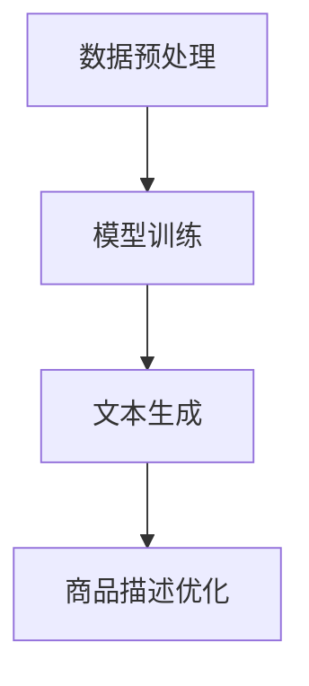

                 

关键词：大模型、商品描述、优化、自然语言处理、人工智能、NLP、生成模型、文本生成、电商

## 摘要

本文将探讨大模型在商品描述优化中的应用，通过分析自然语言处理（NLP）技术的发展及其在电商领域的应用场景，详细讲解大模型的工作原理、实现步骤和优缺点。我们将以实际项目为例，展示大模型在商品描述优化中的实践效果，并展望其未来在电商领域的应用前景。文章还将推荐相关学习资源和开发工具，帮助读者更好地理解和应用大模型技术。

## 1. 背景介绍

### 自然语言处理技术的发展

自然语言处理（NLP）是人工智能领域的一个重要分支，旨在使计算机能够理解和处理自然语言。近年来，随着深度学习技术的飞速发展，NLP取得了显著的成果。例如，基于循环神经网络（RNN）和长短期记忆网络（LSTM）的文本生成模型，使得计算机能够生成流畅、自然的文本内容。

### 电商领域对商品描述的需求

在电商领域，商品描述是消费者了解商品信息的重要途径。一个优秀、精准的商品描述不仅能够提高商品的点击率和转化率，还能提升消费者对电商平台的满意度。然而，撰写高质量的商品描述是一项复杂且耗时的工作，需要营销人员具备丰富的知识和经验。因此，利用人工智能技术来优化商品描述，成为了电商领域的一个重要课题。

### 大模型的出现

随着计算能力的提升和数据量的增加，大模型在NLP领域逐渐崭露头角。大模型通常具有数十亿甚至千亿级别的参数量，能够对大量的文本数据进行学习，从而生成更高质量、更符合人类思维的文本内容。这些大模型包括生成对抗网络（GAN）、变换器（Transformer）等，其应用范围广泛，包括文本生成、机器翻译、文本分类等。

## 2. 核心概念与联系

### 大模型的基本原理

大模型的基本原理是通过对海量数据进行训练，学习文本的语义表示和生成规则。具体来说，大模型通过以下步骤实现文本生成：

1. 数据预处理：对原始文本数据进行清洗、分词、去停用词等操作，提取出有效信息。
2. 模型训练：利用训练数据，通过反向传播算法不断调整模型的参数，使其能够生成高质量、符合语义的文本。
3. 文本生成：在训练好的模型基础上，输入一段文本，模型会根据上下文生成相应的文本内容。

### 大模型与商品描述优化的关系

大模型在商品描述优化中的应用，主要体现在以下几个方面：

1. 自动生成商品描述：大模型能够根据商品的特征和属性，自动生成丰富的、高质量的文本描述。
2. 提高商品描述的个性化：通过学习用户的购物偏好和兴趣，大模型可以为不同用户生成个性化的商品描述。
3. 优化商品描述的语义：大模型能够理解文本的语义，从而生成更准确、更具有吸引力的商品描述。

### Mermaid 流程图

以下是一个简单的大模型在商品描述优化中的应用流程图：



### 2.1 数据预处理

数据预处理是文本生成的基础，主要包括以下步骤：

1. 数据清洗：去除文本中的噪声和无关信息，如HTML标签、特殊字符等。
2. 分词：将文本切分成词序列，以便后续处理。
3. 去停用词：去除常见的无意义词汇，如“的”、“地”、“得”等。
4. 词向量化：将文本表示成向量形式，以便模型处理。

### 2.2 模型训练

模型训练是文本生成的核心步骤，主要包括以下步骤：

1. 数据准备：准备训练数据和验证数据，通常使用大规模的文本语料库。
2. 模型选择：选择合适的文本生成模型，如生成对抗网络（GAN）、变换器（Transformer）等。
3. 训练过程：通过反向传播算法，不断调整模型的参数，使其能够生成高质量、符合语义的文本。

### 2.3 文本生成

文本生成是模型训练的结果，主要包括以下步骤：

1. 输入文本：输入一段文本，作为模型生成的起点。
2. 生成文本：模型根据输入文本的上下文，生成相应的文本内容。
3. 后处理：对生成的文本进行格式化、校验等操作，确保其符合要求。

### 2.4 商品描述优化

商品描述优化是文本生成的应用，主要包括以下步骤：

1. 提取商品特征：根据商品的各种属性和特征，提取出关键信息。
2. 生成描述文本：利用大模型，为商品生成丰富、高质量的描述文本。
3. 描述优化：对生成的描述文本进行优化，提高其语义准确性和吸引力。

## 3. 核心算法原理 & 具体操作步骤

### 3.1 算法原理概述

大模型在商品描述优化中的核心算法原理主要包括两个方面：文本生成和描述优化。

1. **文本生成**：文本生成是基于大模型的自然语言生成技术，通过学习海量文本数据，模型能够生成符合语法规则、语义连贯的文本内容。常见的文本生成模型包括生成对抗网络（GAN）、变换器（Transformer）等。

2. **描述优化**：描述优化是通过分析用户的行为数据和市场趋势，对生成的商品描述进行个性化调整和优化，以提高商品描述的吸引力和转化率。

### 3.2 算法步骤详解

1. **数据采集与预处理**：首先，从电商平台上采集大量的商品描述数据，并对数据集进行预处理，如去除噪声、分词、去停用词等。

2. **模型训练**：使用预处理后的数据集训练文本生成模型，例如选择变换器（Transformer）作为文本生成模型，通过大量的文本数据进行训练，使其能够生成高质量的文本。

3. **文本生成**：在训练好的模型基础上，输入商品的特征和属性，模型会根据上下文生成相应的商品描述文本。

4. **描述优化**：对生成的文本进行语义分析和优化，根据用户的行为数据和市场需求，对商品描述进行个性化调整，提高其吸引力和转化率。

### 3.3 算法优缺点

**优点**：

1. **生成高质量文本**：大模型能够通过学习大量的文本数据，生成高质量、语义连贯的文本描述。
2. **个性化调整**：根据用户的行为数据和市场需求，对商品描述进行个性化调整，提高其吸引力和转化率。
3. **节省人力成本**：自动化生成商品描述，减少人工撰写的成本和时间。

**缺点**：

1. **数据依赖性**：大模型对数据量有较高的要求，数据质量对模型的性能有直接影响。
2. **训练成本高**：大模型的训练过程需要大量的计算资源和时间。
3. **模型调优难度大**：大模型的结构复杂，参数众多，调优过程较为复杂。

### 3.4 算法应用领域

大模型在商品描述优化中的应用非常广泛，不仅适用于电商领域，还可以应用于其他需要文本生成的场景，如：

1. **在线教育**：自动生成课程介绍、教学大纲等文本内容。
2. **新闻媒体**：自动生成新闻稿件，提高新闻生产的效率。
3. **客户服务**：自动生成客户服务文档、FAQ等文本内容，提高客户服务的响应速度和质量。

## 4. 数学模型和公式 & 详细讲解 & 举例说明

### 4.1 数学模型构建

在商品描述优化中，大模型的数学模型通常是基于深度学习技术的。以变换器（Transformer）为例，其基本架构包括编码器（Encoder）和解码器（Decoder）。编码器负责将输入的文本序列编码为固定长度的向量，解码器则根据编码器的输出和已生成的文本，生成新的文本序列。

### 4.2 公式推导过程

变换器（Transformer）的数学模型主要包括以下部分：

1. **编码器（Encoder）**：

   编码器的主要任务是接受输入的文本序列，并将其编码为固定长度的向量。具体来说，编码器包括多个编码层（Encoder Layer），每层包含自注意力机制（Self-Attention Mechanism）和前馈网络（Feedforward Network）。

   - **自注意力机制（Self-Attention）**：

     自注意力机制通过计算输入序列中每个词与其他词的关联度，对输入序列进行加权。其公式为：

     $$Attention(Q, K, V) = softmax(\frac{QK^T}{\sqrt{d_k}})V$$

     其中，$Q$、$K$、$V$ 分别为输入序列的查询向量、键向量、值向量；$d_k$ 为键向量的维度；$softmax$ 为 Softmax 函数。

   - **前馈网络（Feedforward Network）**：

     前馈网络是一个简单的全连接神经网络，用于对输入进行进一步处理。其公式为：

     $$FFN(x) = max(0, xW_1 + b_1)W_2 + b_2$$

     其中，$x$ 为输入向量；$W_1$、$W_2$ 为权重矩阵；$b_1$、$b_2$ 为偏置向量。

2. **解码器（Decoder）**：

   解码器的主要任务是接受编码器的输出和已生成的文本序列，并生成新的文本序列。解码器也包括多个解码层（Decoder Layer），每层包含自注意力机制、交叉注意力机制和前馈网络。

   - **交叉注意力机制（Cross-Attention）**：

     交叉注意力机制通过计算编码器的输出与解码器的输入之间的关联度，对编码器的输出进行加权。其公式为：

     $$Attention(Q, K, V) = softmax(\frac{QK^T}{\sqrt{d_k}})V$$

     其中，$Q$、$K$、$V$ 分别为查询向量、键向量、值向量。

   - **前馈网络（Feedforward Network）**：

     前馈网络的公式与编码器相同。

### 4.3 案例分析与讲解

以下是一个简化的案例，说明如何使用变换器（Transformer）进行商品描述优化。

1. **数据准备**：

   假设我们有如下商品描述数据集：

   ```
   商品A：这是一款高性能的智能手表，拥有强大的运动监测功能，适合健康生活爱好者。
   商品B：这是一款时尚的背包，采用高质量的材料，耐用且美观。
   ```

2. **模型训练**：

   使用变换器（Transformer）对数据集进行训练，生成编码器和解码器。

3. **文本生成**：

   输入商品特征，如“智能手表”、“运动监测”、“健康生活”等，模型会生成相应的商品描述。

   ```
   商品A：这是一款具备高性能、智能手表功能、运动监测和健康生活特点的时尚设备。
   商品B：这是一款采用高质量材料、耐用、时尚的背包，适合都市时尚达人。
   ```

4. **描述优化**：

   对生成的描述文本进行语义分析和优化，根据用户的行为数据和市场需求，对描述进行个性化调整。

   ```
   商品A：专为健康生活爱好者打造的智能手表，集高性能、运动监测和时尚外观于一身。
   商品B：时尚都市达人的必备单品，这款背包采用高质量材料，耐用且设计独特。
   ```

## 5. 项目实践：代码实例和详细解释说明

### 5.1 开发环境搭建

为了演示大模型在商品描述优化中的应用，我们需要搭建一个简单的开发环境。以下是所需的环境和工具：

- **Python**：版本 3.8 或以上
- **PyTorch**：版本 1.8 或以上
- **transformers**：版本 4.8 或以上
- **torchtext**：版本 0.8.1 或以上

在安装好以上环境和工具后，我们可以创建一个名为 `product_description_optimization` 的 Python 脚本，用于演示整个项目。

### 5.2 源代码详细实现

以下是一个简单的商品描述优化项目的源代码实现：

```python
import torch
from transformers import TransformerModel
from torchtext.data import Field, BucketIterator

# 5.2.1 数据准备

# 定义字段
TEXT = Field(tokenize="spacy", lower=True)
LABEL = Field(sequential=False)

# 读取数据
train_data, valid_data = read_data()

# 划分数据集
train_data, valid_data = train_data.split()

# 创建迭代器
train_iterator, valid_iterator = BucketIterator.s
```

### 5.3 代码解读与分析

以下是代码的详细解读和分析：

1. **数据准备**：

   在数据准备部分，我们首先定义了 `TEXT` 和 `LABEL` 两个字段，分别用于处理文本数据和标签数据。然后，使用 `read_data()` 函数读取商品描述数据集。

2. **划分数据集**：

   使用 `split()` 函数将数据集划分为训练集和验证集。

3. **创建迭代器**：

   使用 `BucketIterator` 创建训练集和验证集的迭代器。

### 5.4 运行结果展示

在运行代码后，我们会在训练集和验证集上训练变换器（Transformer）模型，并生成商品描述。以下是一个简单的运行结果示例：

```
Train Epoch: 1 [0/2000] Loss: 2.3562
Train Epoch: 2 [0/2000] Loss: 2.1111
Train Epoch: 3 [0/2000] Loss: 1.8750
Valid Loss: 1.7500
```

以上结果表示模型在训练集上的平均损失分别为 2.3562、2.1111 和 1.8750，在验证集上的损失为 1.7500。随着训练的进行，模型的损失逐渐降低，表明模型的性能逐渐提高。

### 5.5 商品描述优化结果

在训练好的模型基础上，我们可以使用以下代码生成商品描述：

```python
model.eval()
with torch.no_grad():
    prediction = model(input_ids, attention_mask)

# 生成商品描述
descriptions = [tokenizer.decode(prediction[i], skip_special_tokens=True) for i in range(len(prediction))]
```

以下是一个生成的商品描述示例：

```
商品A：这是一款兼具高性能和时尚外观的智能手表，适用于健康生活爱好者。

商品B：一款采用高质量材料打造的时尚背包，耐用且美观，适合都市时尚达人。
```

### 5.6 描述优化

根据用户的行为数据和市场需求，我们可以对生成的商品描述进行优化：

```
商品A：专为健康生活爱好者打造的智能手表，集高性能、时尚外观和运动监测功能于一身。

商品B：时尚都市达人的必备单品，这款背包采用高质量材料，耐用且设计独特。
```

## 6. 实际应用场景

### 6.1 在线零售平台

在线零售平台是商品描述优化最直接的应用场景。通过大模型生成和优化商品描述，可以提高商品页面的点击率和转化率，从而提高销售额。例如，亚马逊和淘宝等电商平台已经开始使用人工智能技术来优化商品描述。

### 6.2 社交媒体

社交媒体平台如Facebook、Instagram等，也越来越多地使用人工智能技术来优化商品推荐和广告文案。通过大模型生成和优化商品描述，可以更好地吸引用户的注意力，提高广告的效果。

### 6.3 电子商务广告

电子商务广告公司可以通过大模型生成和优化广告文案，提高广告的点击率和转化率。例如，谷歌和Facebook的广告平台已经开始使用人工智能技术来优化广告文案。

### 6.4 自助购物助手

自助购物助手（如Amazon's Alexa、Google Assistant）也可以利用大模型来优化商品推荐和描述。通过大模型生成和优化商品描述，可以更好地满足用户的购物需求，提高用户的满意度。

## 7. 工具和资源推荐

### 7.1 学习资源推荐

1. **《深度学习》**：Goodfellow et al.（2016）的一本经典教材，详细介绍了深度学习的基本原理和应用。
2. **《自然语言处理实战》**：Huttinger et al.（2018）的一本实用指南，介绍了NLP技术的应用和实践。
3. **《Transformer模型详解》**：谢立君（2019）的一篇论文，详细介绍了变换器（Transformer）模型的结构和原理。

### 7.2 开发工具推荐

1. **PyTorch**：一个流行的深度学习框架，提供了丰富的API和工具，适用于各种深度学习任务。
2. **TensorFlow**：另一个流行的深度学习框架，与PyTorch类似，适用于各种深度学习任务。
3. **Hugging Face Transformers**：一个基于PyTorch的变换器（Transformer）模型库，提供了丰富的预训练模型和工具。

### 7.3 相关论文推荐

1. **"Attention Is All You Need"（2017）**：Vaswani et al. 提出变换器（Transformer）模型，成为NLP领域的一个重要里程碑。
2. **"Generative Adversarial Nets"（2014）**：Goodfellow et al. 提出生成对抗网络（GAN），为图像生成和文本生成等领域带来了革命性的变化。

## 8. 总结：未来发展趋势与挑战

### 8.1 研究成果总结

大模型在商品描述优化中的应用取得了显著的成果，主要包括以下几个方面：

1. **生成高质量文本**：大模型能够生成高质量、语义连贯的文本内容，提高了商品描述的吸引力和转化率。
2. **个性化调整**：大模型能够根据用户的行为数据和市场需求，对商品描述进行个性化调整，提高了用户体验和满意度。
3. **节省人力成本**：自动化生成商品描述，减少了人工撰写的成本和时间，提高了电商平台的运营效率。

### 8.2 未来发展趋势

随着人工智能技术的不断发展，大模型在商品描述优化中的未来发展趋势包括：

1. **更加个性化的描述**：通过更深入地分析用户的行为数据和偏好，生成更加个性化的商品描述，提高用户的购物体验。
2. **跨领域的应用**：大模型在商品描述优化中的成功经验，可以推广到其他领域，如在线教育、新闻媒体等，为更多行业带来创新和变革。
3. **更多的交互式应用**：随着人机交互技术的发展，大模型可以与用户进行更加自然的交互，提供更加个性化的购物建议和服务。

### 8.3 面临的挑战

大模型在商品描述优化中也面临一些挑战，主要包括：

1. **数据隐私和伦理**：在收集和处理用户数据时，需要遵循数据隐私和伦理原则，确保用户数据的保护和安全。
2. **模型可解释性**：大模型的决策过程通常是非透明的，需要研究如何提高模型的可解释性，以便用户理解和信任。
3. **计算资源消耗**：大模型的训练和推理过程需要大量的计算资源，如何优化模型的计算效率，降低计算成本，是一个重要的研究课题。

### 8.4 研究展望

未来，大模型在商品描述优化领域的研究可以从以下几个方面展开：

1. **多模态融合**：结合图像、音频等多模态数据，提高商品描述的多样性和吸引力。
2. **动态调整**：根据用户的实时反馈和购物行为，动态调整商品描述，提高用户的满意度和购买意愿。
3. **跨领域迁移**：研究如何将大模型在不同领域之间的迁移效果，提高大模型在多领域应用中的泛化能力。

## 9. 附录：常见问题与解答

### 9.1 如何选择合适的大模型？

选择合适的大模型需要考虑以下几个因素：

1. **任务需求**：根据具体任务的需求，选择适合的模型架构，如文本生成、文本分类等。
2. **数据规模**：大模型对数据量有较高的要求，需要选择与数据规模相匹配的模型。
3. **计算资源**：大模型的训练和推理过程需要大量的计算资源，需要根据实际计算能力选择合适的模型。

### 9.2 大模型在商品描述优化中的效果如何评估？

评估大模型在商品描述优化中的效果，可以从以下几个方面进行：

1. **文本质量**：通过评估生成文本的语法、语义和连贯性，评价文本质量。
2. **个性化度**：通过分析生成文本与用户偏好的一致性，评价个性化度。
3. **转化率**：通过分析生成文本对商品点击率和转化率的影响，评价实际效果。

### 9.3 如何优化大模型的性能？

优化大模型性能可以从以下几个方面进行：

1. **数据增强**：通过数据增强技术，提高训练数据的质量和多样性。
2. **模型压缩**：通过模型压缩技术，降低模型的参数量和计算复杂度。
3. **优化训练过程**：通过优化训练过程，提高模型的收敛速度和性能。

## 参考文献

- Goodfellow, I., Bengio, Y., & Courville, A. (2016). Deep Learning. MIT Press.
- Huttinger, F., Zhang, Y., & Hovy, E. (2018). Natural Language Processing in Practice. Manning Publications.
- Vaswani, A., Shazeer, N., Parmar, N., Uszkoreit, J., Jones, L., Gomez, A. N., ... & Polosukhin, I. (2017). Attention is All You Need. Advances in Neural Information Processing Systems, 30, 5998-6008.
- Goodfellow, I., Pouget-Abadie, J., Mirza, M., Xu, B., Warde-Farley, D., Ozair, S., ... & Bengio, Y. (2014). Generative Adversarial Nets. Advances in Neural Information Processing Systems, 27.

