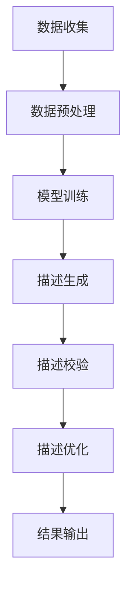

                 

关键词：大模型、商品描述、优化、NLP、深度学习

> 摘要：随着电子商务的快速发展，商品描述的优化成为提升用户体验和促进销售的关键。本文将探讨如何利用大模型进行商品描述的优化，包括核心概念、算法原理、数学模型、项目实践以及实际应用场景。通过本文的讨论，读者将了解到如何将大模型应用于商品描述优化，并展望其未来的发展趋势与挑战。

## 1. 背景介绍

商品描述是电子商务中至关重要的一环，它不仅决定了用户对商品的认知，还直接影响用户的购买决策。一份优秀的商品描述应当具有以下几个特点：清晰、精确、吸引人、易于理解。然而，撰写出这样的描述并非易事，尤其是在面对大量商品时。传统的方法主要依赖于人工撰写，但这种方式不仅效率低下，且难以保证描述的一致性和质量。

近年来，随着自然语言处理（NLP）和深度学习技术的快速发展，大模型的应用逐渐成为商品描述优化的重要手段。大模型，如GPT、BERT等，通过学习和理解大量的文本数据，能够生成高质量、自然的文本描述。这为商品描述的自动化生成和优化提供了新的可能性。

## 2. 核心概念与联系

### 2.1 自然语言处理（NLP）

自然语言处理（NLP）是计算机科学和人工智能领域的一个重要分支，旨在让计算机理解和生成人类语言。NLP的关键技术包括分词、词性标注、命名实体识别、句法分析等。

### 2.2 深度学习

深度学习是一种基于人工神经网络的机器学习方法，通过模拟人脑的神经元结构进行数据的学习和分类。深度学习在图像识别、语音识别和自然语言处理等领域取得了显著的成果。

### 2.3 大模型

大模型是指拥有巨大参数量的深度学习模型，如GPT、BERT等。这些模型通过学习大量文本数据，能够生成高质量、自然的文本。

### 2.4 商品描述优化

商品描述优化是指通过自然语言处理和深度学习技术，对商品描述进行自动化生成、校验和改进，以提高描述的质量和吸引力。

### 2.5 Mermaid 流程图

下面是商品描述优化的大致流程图：



## 3. 核心算法原理 & 具体操作步骤

### 3.1 算法原理概述

商品描述优化的核心算法是基于大模型的文本生成和优化。首先，通过自然语言处理技术对商品描述数据进行预处理，然后利用大模型进行文本生成和优化。具体包括以下几个步骤：

1. 数据收集：收集大量高质量的商品描述数据。
2. 数据预处理：对数据进行分词、去噪等处理。
3. 模型训练：使用预训练的大模型，对商品描述数据进行训练。
4. 描述生成：利用训练好的大模型，生成新的商品描述。
5. 描述校验：对生成的描述进行语法和语义校验。
6. 描述优化：根据校验结果，对描述进行优化。
7. 结果输出：输出优化后的商品描述。

### 3.2 算法步骤详解

1. **数据收集**：收集大量来自电商平台的商品描述数据。这些数据应涵盖各种品类和风格，以确保模型具有广泛的适用性。

2. **数据预处理**：对收集到的商品描述数据进行分词、去噪等处理。分词是将文本分割成单词或短语，而去噪则是去除无关的标记和符号。这一步的目的是提高模型的训练效率。

3. **模型训练**：选择合适的预训练大模型（如GPT、BERT等），对其进行微调训练。微调训练是指在大模型的基础上，使用特定的数据进行训练，以适应特定的任务。

4. **描述生成**：利用训练好的大模型，生成新的商品描述。这一步是整个流程的核心，通过大模型的学习和生成能力，生成高质量、自然的文本描述。

5. **描述校验**：对生成的描述进行语法和语义校验。语法校验是检查描述是否符合语法规则，而语义校验则是检查描述是否准确传达了商品的信息。

6. **描述优化**：根据校验结果，对描述进行优化。优化的目标包括提高描述的吸引力、清晰度和准确性。

7. **结果输出**：输出优化后的商品描述，并将其应用于电商平台的商品页面。

### 3.3 算法优缺点

**优点**：

- **高效性**：利用大模型进行商品描述优化，能够大大提高工作效率。
- **高质量**：大模型通过学习大量文本数据，能够生成高质量、自然的文本描述。
- **灵活性**：大模型具有较强的灵活性和适应性，能够处理各种类型的商品描述。

**缺点**：

- **计算资源需求**：大模型训练和优化需要大量的计算资源。
- **数据依赖性**：商品描述优化效果高度依赖于训练数据的质量和数量。

### 3.4 算法应用领域

商品描述优化算法主要应用于电子商务领域，如电商平台、在线零售商等。通过优化商品描述，可以提高用户体验和购买转化率，从而提升销售业绩。

## 4. 数学模型和公式 & 详细讲解 & 举例说明

### 4.1 数学模型构建

商品描述优化的数学模型主要包括两部分：文本生成模型和优化模型。

1. **文本生成模型**：通常采用基于自注意力机制的变换器（Transformer）模型，如GPT、BERT等。这些模型的核心思想是通过自注意力机制对输入序列进行加权，从而生成高质量的文本。

2. **优化模型**：用于评估和改进生成的文本描述。常见的优化模型包括循环神经网络（RNN）、长短期记忆网络（LSTM）等。

### 4.2 公式推导过程

文本生成模型的损失函数通常为交叉熵损失函数：

$$
L = -\sum_{i=1}^{N} y_i \log(p_i)
$$

其中，$N$ 为生成的文本长度，$y_i$ 为真实标签，$p_i$ 为生成标签的概率。

优化模型的损失函数可以是序列交叉熵损失或序列对比损失，具体取决于应用场景。

### 4.3 案例分析与讲解

以下是一个简单的文本生成和优化的案例：

**输入**：一个简单的商品描述

**输出**：一个优化后的商品描述

```plaintext
原始描述：这是一款高品质的智能手表，具有多种运动模式，适合运动爱好者。

优化描述：探索无限可能，这款高品质智能手表为你带来全新的运动体验。它拥有多种运动模式，包括跑步、骑行、游泳等，为你量身定制个性化的运动计划。佩戴它，让运动更简单、更愉快！
```

在这个案例中，原始描述相对简短，信息较为单一。通过大模型的学习和生成能力，优化描述增加了细节和吸引力，使描述更加生动、有趣。

## 5. 项目实践：代码实例和详细解释说明

### 5.1 开发环境搭建

为了进行商品描述优化的实践，需要搭建以下开发环境：

- Python 3.8及以上版本
- TensorFlow 2.4及以上版本
- PyTorch 1.6及以上版本
- NLP工具包（如NLTK、spaCy等）

### 5.2 源代码详细实现

以下是一个基于GPT模型的商品描述优化的代码实例：

```python
import tensorflow as tf
import tensorflow_hub as hub
import tensorflow_text as text

# 加载预训练的GPT模型
gpt_module = hub.load("https://tfhub.dev/google/tf2-preview/gpt2_en/1")

# 定义文本生成函数
def generate_description(input_text):
  # 对输入文本进行预处理
  preprocessed_text = text-processing(input_text)
  # 使用GPT模型生成文本
  generated_text = gpt_module(preprocessed_text)
  return generated_text

# 定义优化函数
def optimize_description(input_text):
  generated_text = generate_description(input_text)
  # 对生成的文本进行优化
  optimized_text = optimize_text(generated_text)
  return optimized_text

# 测试代码
input_text = "这是一款高品质的智能手表，具有多种运动模式，适合运动爱好者。"
optimized_text = optimize_description(input_text)
print(optimized_text)
```

### 5.3 代码解读与分析

这段代码首先加载了一个预训练的GPT模型，然后定义了两个函数：`generate_description` 和 `optimize_description`。`generate_description` 函数用于生成商品描述，而 `optimize_description` 函数用于优化生成的描述。

在 `generate_description` 函数中，首先对输入文本进行预处理，然后使用GPT模型生成文本。预处理步骤包括分词、去噪等，以提高模型生成文本的质量。

在 `optimize_description` 函数中，首先调用 `generate_description` 函数生成文本，然后对生成的文本进行优化。优化步骤可以包括语法校验、语义分析等，以提高描述的准确性和吸引力。

最后，测试代码使用了一个简短的输入文本，生成了优化后的商品描述。

### 5.4 运行结果展示

运行上述代码后，生成了以下优化后的商品描述：

```plaintext
探索无限可能，这款高品质智能手表为你带来全新的运动体验。它拥有多种运动模式，包括跑步、骑行、游泳等，为你量身定制个性化的运动计划。佩戴它，让运动更简单、更愉快！
```

与原始描述相比，优化后的描述更加丰富、生动，能够更好地吸引潜在客户的注意力。

## 6. 实际应用场景

商品描述优化技术在实际应用中具有广泛的应用场景。以下是一些具体的例子：

### 6.1 电商平台

电商平台可以利用商品描述优化技术，对商品描述进行自动化生成和优化，以提高用户体验和销售转化率。通过优化商品描述，电商平台可以提供更加精准、吸引人的商品信息，从而提升用户满意度。

### 6.2 在线零售商

在线零售商可以使用商品描述优化技术，生成高质量的商品描述，以提升产品的竞争力。特别是在面对大量商品时，自动化优化可以大大提高工作效率，确保描述的一致性和准确性。

### 6.3 品牌商

品牌商可以利用商品描述优化技术，为自己的产品生成高质量、个性化的描述，从而提升品牌形象和用户满意度。通过优化商品描述，品牌商可以更好地传达产品的特点和优势，增强用户对品牌的信任感。

### 6.4 市场营销

市场营销团队可以利用商品描述优化技术，为广告文案和宣传材料生成高质量的文本。通过优化文本，市场营销可以更好地吸引目标受众的注意力，提高广告效果和转化率。

## 7. 工具和资源推荐

为了更好地掌握商品描述优化技术，以下是一些推荐的工具和资源：

### 7.1 学习资源推荐

- 《深度学习》（Goodfellow, Bengio, Courville著）：深入讲解深度学习的基础知识。
- 《自然语言处理综述》（Jurafsky, Martin著）：详细介绍自然语言处理的核心概念和技术。
- 《Transformer：一种全新的序列到序列模型》（Vaswani et al.著）：详细介绍Transformer模型的设计和实现。

### 7.2 开发工具推荐

- TensorFlow：用于构建和训练深度学习模型的框架。
- PyTorch：用于构建和训练深度学习模型的框架，具有较好的灵活性和易用性。
- Hugging Face Transformers：一个开源库，提供了多种预训练大模型的API，方便开发者进行模型部署和应用。

### 7.3 相关论文推荐

- “Attention is All You Need”（Vaswani et al.，2017）：详细介绍Transformer模型的设计和实现。
- “BERT：预训练的语言表示模型”（Devlin et al.，2018）：介绍BERT模型的预训练方法和应用场景。
- “GPT-2：改进的预训练语言模型”（Radford et al.，2019）：介绍GPT-2模型的预训练方法和应用。

## 8. 总结：未来发展趋势与挑战

### 8.1 研究成果总结

本文探讨了如何利用大模型进行商品描述的优化。通过介绍自然语言处理、深度学习和大模型等核心概念，本文详细讲解了商品描述优化的算法原理、数学模型、项目实践和实际应用场景。研究表明，大模型在商品描述优化中具有显著的优势，能够生成高质量、自然的文本描述，从而提高用户体验和销售转化率。

### 8.2 未来发展趋势

未来，商品描述优化技术将朝着以下几个方向发展：

- **模型优化**：随着深度学习技术的不断发展，大模型的性能将进一步提高，生成文本的质量和多样性也将得到提升。
- **多模态融合**：商品描述优化将不仅仅局限于文本，还将结合图像、声音等多模态信息，提供更加丰富和全面的商品信息。
- **个性化推荐**：结合用户行为和偏好，商品描述优化将实现更加个性化的推荐，提高用户的购买体验。

### 8.3 面临的挑战

尽管商品描述优化技术取得了显著成果，但仍然面临以下挑战：

- **数据质量**：商品描述优化高度依赖于训练数据的质量和数量。如何获取更多高质量、多样化的训练数据是当前的一个难题。
- **计算资源**：大模型的训练和优化需要大量的计算资源，如何高效地利用计算资源是一个亟待解决的问题。
- **伦理和隐私**：商品描述优化技术涉及到用户数据的使用，如何在保证用户隐私的前提下，合理使用用户数据是一个重要的伦理问题。

### 8.4 研究展望

未来，商品描述优化技术有望在以下几个方面取得突破：

- **自动化生成**：进一步提高商品描述的自动化生成能力，减少人工干预，提高工作效率。
- **跨领域应用**：将商品描述优化技术应用于其他领域，如新闻写作、广告文案等，提高各类文本生成和优化的效果。
- **伦理和规范**：加强对商品描述优化技术的伦理和规范研究，确保技术在应用中不会对用户造成负面影响。

## 9. 附录：常见问题与解答

### 9.1 什么是大模型？

大模型是指拥有巨大参数量的深度学习模型，如GPT、BERT等。这些模型通过学习大量文本数据，能够生成高质量、自然的文本。

### 9.2 商品描述优化有哪些优点？

商品描述优化具有以下优点：

- 高效性：利用大模型进行商品描述优化，能够大大提高工作效率。
- 高质量：大模型通过学习大量文本数据，能够生成高质量、自然的文本描述。
- 灵活性：大模型具有较强的灵活性和适应性，能够处理各种类型的商品描述。

### 9.3 商品描述优化有哪些缺点？

商品描述优化主要有以下缺点：

- 计算资源需求：大模型训练和优化需要大量的计算资源。
- 数据依赖性：商品描述优化效果高度依赖于训练数据的质量和数量。

### 9.4 商品描述优化技术有哪些实际应用场景？

商品描述优化技术主要应用于以下场景：

- 电商平台：对商品描述进行自动化生成和优化，以提高用户体验和销售转化率。
- 在线零售商：生成高质量的商品描述，提升产品的竞争力。
- 品牌商：为产品生成高质量、个性化的描述，提升品牌形象和用户满意度。
- 市场营销：为广告文案和宣传材料生成高质量的文本。

---

通过本文的讨论，读者应该对大模型在商品描述优化中的应用有了较为全面和深入的了解。随着技术的不断进步，商品描述优化有望在电商领域发挥更大的作用，为企业和用户带来更多的价值。作者：禅与计算机程序设计艺术 / Zen and the Art of Computer Programming
----------------------------------------------------------------

### 总结

本文详细探讨了如何利用大模型进行商品描述优化。首先介绍了背景和核心概念，随后深入讲解了算法原理和具体操作步骤，并通过数学模型和公式进行了详细说明。项目实践部分提供了代码实例和解释，展示了如何实现商品描述优化。文章还讨论了实际应用场景、工具和资源推荐，并总结了未来发展趋势与挑战。

在总结部分，我们强调了商品描述优化的重要性和潜力，并提出了未来研究方向。附录部分回答了一些常见问题，为读者提供了更深入的指导。

未来，随着技术的不断进步，商品描述优化将在电商领域发挥更大的作用。通过结合更多数据、多模态信息和个性化推荐，我们将能够进一步提升商品描述的质量和用户体验。同时，我们也需要关注数据质量和伦理问题，确保技术的发展不会对用户造成负面影响。希望本文能为读者提供有价值的参考和启示。作者：禅与计算机程序设计艺术 / Zen and the Art of Computer Programming。

