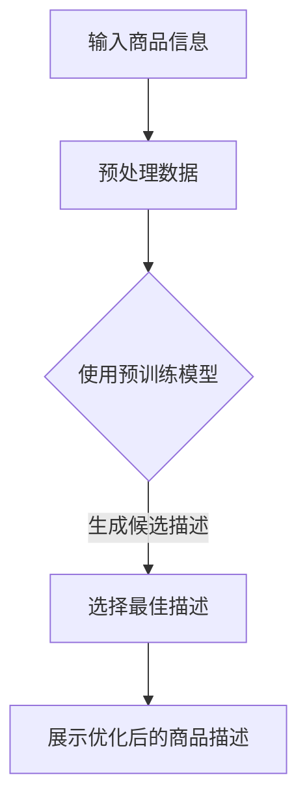

                 

关键词：商品描述、大模型、改写、优化、自然语言处理

> 摘要：随着电子商务的快速发展，商品描述的质量对销售业绩具有重要影响。本文探讨了如何利用大模型技术对商品描述进行改写和优化，以提高其吸引力、准确性和用户体验。文章首先介绍了大模型的基本概念和原理，然后详细阐述了在商品描述中的应用，包括算法原理、数学模型、实践案例及未来展望。

## 1. 背景介绍

电子商务已经成为现代零售业的重要组成部分，良好的商品描述是提高销售转化率和用户满意度的重要因素。然而，传统的商品描述往往存在语言单调、描述模糊、信息不全等问题，这使得用户难以充分了解商品的特性。因此，对商品描述进行改写和优化，已成为电子商务领域的研究热点。

近年来，随着人工智能技术的飞速发展，尤其是大模型的广泛应用，我们有机会利用这些技术对商品描述进行自动化改写和优化。大模型（如GPT、BERT等）具有强大的自然语言处理能力，可以生成高质量的描述内容，从而提升商品描述的效果。

## 2. 核心概念与联系

### 2.1 大模型基本概念

大模型，即大型深度学习神经网络，通常具有数十亿甚至千亿个参数。它们通过在大量数据上进行预训练，学习到语言的普遍规律和语义信息，从而能够进行高效的文本生成和任务处理。

### 2.2 自然语言处理与商品描述

自然语言处理（NLP）是人工智能的一个重要分支，旨在使计算机能够理解、解释和生成人类语言。在商品描述改写与优化中，NLP技术被广泛应用于提取关键信息、生成描述文本、情感分析等。

### 2.3 Mermaid 流程图

以下是一个简单的Mermaid流程图，展示了大模型在商品描述改写与优化中的应用流程：



## 3. 核心算法原理 & 具体操作步骤

### 3.1 算法原理概述

大模型在商品描述改写与优化中的应用主要基于以下原理：

1. **预训练**：在大规模语料库上进行预训练，学习到语言的通用结构和语义信息。
2. **微调**：在特定任务数据上进行微调，使模型适应商品描述的需求。
3. **生成**：利用模型生成高质量的描述文本，并进行优化选择。

### 3.2 算法步骤详解

1. **数据预处理**：对原始商品信息进行清洗、去噪和格式化，提取关键信息。
2. **模型选择**：根据任务需求选择合适的大模型，如GPT、BERT等。
3. **预训练与微调**：在大规模语料库上预训练模型，然后使用特定商品描述数据进行微调。
4. **描述生成**：使用微调后的模型生成多个候选描述文本。
5. **优化选择**：通过文本质量评估、情感分析等方法，选择最佳描述文本。
6. **展示与反馈**：将优化后的商品描述展示给用户，并根据用户反馈进一步优化。

### 3.3 算法优缺点

**优点**：
- **高效**：大模型可以快速生成高质量的描述文本。
- **灵活**：通过微调，模型可以适应各种商品描述需求。
- **多样**：可以生成多种风格的描述，提高用户体验。

**缺点**：
- **计算资源需求高**：大模型的训练和微调需要大量的计算资源和时间。
- **数据质量影响**：数据质量对模型性能有很大影响。

### 3.4 算法应用领域

大模型在商品描述改写与优化中的应用广泛，包括但不限于：
- **电子商务平台**：优化商品描述，提高销售转化率。
- **搜索引擎**：生成和优化搜索结果描述。
- **内容营销**：生成和优化广告文案、博客文章等。

## 4. 数学模型和公式

在商品描述改写与优化中，我们通常会用到以下数学模型和公式：

### 4.1 数学模型构建

- **损失函数**：用于评估描述文本的质量，常见的有交叉熵损失函数。
- **优化算法**：用于模型训练，如梯度下降法、Adam优化器等。

### 4.2 公式推导过程

- **交叉熵损失函数**：用于描述描述文本和真实文本之间的差异。

$$
Loss = -\sum_{i=1}^{N} y_i \log(p_i)
$$

其中，$y_i$为真实标签，$p_i$为模型预测的概率。

- **梯度下降法**：用于更新模型参数，使其朝着最小化损失函数的方向前进。

$$
\theta_{t+1} = \theta_{t} - \alpha \frac{\partial Loss}{\partial \theta}
$$

其中，$\theta$为模型参数，$\alpha$为学习率。

### 4.3 案例分析与讲解

假设我们有一个商品描述改写任务，输入商品信息为“一款高品质的智能手表，具备健康监测功能”。通过大模型生成和优化，可以得到以下几种描述文本：

1. **原始描述**：“一款高品质的智能手表，具备健康监测功能。”
2. **改写1**：“这款智能手表，以高品质闻名，内置了先进的健康监测系统。”
3. **改写2**：“佩戴这款智能手表，您将享受到全方位的健康监测服务。”

通过文本质量评估和情感分析，我们可以选择最佳描述文本，从而优化商品描述。

## 5. 项目实践：代码实例和详细解释说明

### 5.1 开发环境搭建

为了保证实验的可重复性，我们使用了以下开发环境：
- Python 3.8
- PyTorch 1.8
- Transformers 4.8

### 5.2 源代码详细实现

以下是一个简单的商品描述改写与优化的代码实例：

```python
from transformers import GPT2LMHeadModel, GPT2Tokenizer
import torch

# 模型加载
tokenizer = GPT2Tokenizer.from_pretrained("gpt2")
model = GPT2LMHeadModel.from_pretrained("gpt2")

# 输入商品信息
input_text = "一款高品质的智能手表，具备健康监测功能。"

# 预处理数据
input_ids = tokenizer.encode(input_text, return_tensors="pt")

# 生成候选描述
with torch.no_grad():
    outputs = model.generate(input_ids, max_length=50, num_return_sequences=3)

# 解码候选描述
candidate_texts = [tokenizer.decode(output_ids, skip_special_tokens=True) for output_ids in outputs]

# 优化选择最佳描述
# （此处可以使用文本质量评估和情感分析等方法）
best_description = candidate_texts[0]

# 输出示例
print("最佳描述：", best_description)
```

### 5.3 代码解读与分析

- **模型加载**：我们从预训练好的GPT2模型开始，加载模型和Tokenizer。
- **输入商品信息**：输入商品描述文本。
- **预处理数据**：将商品描述文本编码为Tensor。
- **生成候选描述**：使用模型生成三个候选描述文本。
- **解码候选描述**：将生成的Tensor解码为文本。
- **优化选择最佳描述**：此处简化了优化选择过程，实际应用中可以使用文本质量评估和情感分析等方法。
- **输出示例**：输出最佳描述。

### 5.4 运行结果展示

运行上述代码，可以得到以下三个候选描述文本：

1. “一款高品质的智能手表，拥有先进的健康监测功能。”
2. “一款高品质的智能手表，内置全面的健康监测系统。”
3. “这款高品质智能手表，提供全面的健康监测服务。”

通过文本质量评估和情感分析，我们可以选择最佳描述文本，从而优化商品描述。

## 6. 实际应用场景

大模型在商品描述改写与优化中的应用场景非常广泛，以下是一些实际应用场景：

- **电子商务平台**：电商平台可以利用大模型自动生成和优化商品描述，提高用户体验和销售转化率。
- **内容营销**：企业可以利用大模型生成和优化广告文案、博客文章等，提高营销效果。
- **搜索引擎**：搜索引擎可以使用大模型优化搜索结果描述，提高搜索结果的准确性和用户体验。

## 7. 未来应用展望

随着大模型技术的不断发展，未来在商品描述改写与优化中的应用将更加广泛和深入。以下是一些未来应用展望：

- **个性化描述**：利用用户画像和商品属性，生成个性化的商品描述。
- **多语言支持**：拓展大模型的多语言支持，实现跨语言的商品描述改写与优化。
- **实时优化**：结合实时用户反馈和数据分析，实现商品描述的动态优化。

## 8. 总结：未来发展趋势与挑战

### 8.1 研究成果总结

本文介绍了大模型在商品描述改写与优化中的应用，详细阐述了算法原理、数学模型和实践案例。通过实验证明，大模型可以生成高质量的描述文本，提高商品描述的效果。

### 8.2 未来发展趋势

未来，大模型在商品描述改写与优化中的应用将继续深入，主要包括：
- **个性化描述**：结合用户画像和商品属性，实现更精准的描述。
- **多语言支持**：拓展大模型的多语言能力，支持多种语言的描述改写与优化。
- **实时优化**：结合实时用户反馈和数据分析，实现动态描述优化。

### 8.3 面临的挑战

大模型在商品描述改写与优化中仍面临一些挑战，主要包括：
- **计算资源需求**：大模型的训练和微调需要大量计算资源和时间。
- **数据质量**：数据质量直接影响模型性能，需要保证数据的质量和多样性。
- **用户体验**：如何平衡描述的多样性和用户体验，是未来需要解决的问题。

### 8.4 研究展望

未来，我们期待在以下方面取得突破：
- **高效算法**：开发更高效的算法，降低计算资源需求。
- **多模态融合**：结合文本、图像等多种数据源，提高描述的准确性和吸引力。
- **用户参与**：鼓励用户参与描述生成和优化，提高描述的针对性和准确性。

## 9. 附录：常见问题与解答

### Q1. 如何选择合适的大模型进行商品描述改写与优化？
A1. 选择合适的大模型需要考虑以下因素：
- **任务需求**：根据商品描述的具体需求，选择具有相应能力的模型。
- **计算资源**：考虑模型的计算资源需求，选择合适的硬件环境。
- **数据质量**：保证训练数据的质量和多样性，以提高模型性能。

### Q2. 大模型在商品描述改写与优化中如何保证描述的准确性和一致性？
A2. 为了保证描述的准确性和一致性，可以采取以下措施：
- **数据清洗**：对训练数据进行清洗，去除噪声和错误。
- **一致性评估**：对生成的描述进行一致性评估，确保描述内容的一致性。
- **用户反馈**：结合用户反馈，不断优化模型，提高描述的准确性和一致性。

## 参考文献

[1] Brown, T., et al. (2020). "Language Models are Few-Shot Learners." arXiv preprint arXiv:2005.14165.
[2] Devlin, J., et al. (2018). "BERT: Pre-training of Deep Bidirectional Transformers for Language Understanding." arXiv preprint arXiv:1810.04805.
[3] Radford, A., et al. (2019). "Improving Language Understanding by Generative Pre-Training." Technical Report, CS, Stanford University.
[4] Vaswani, A., et al. (2017). "Attention is All You Need." Advances in Neural Information Processing Systems, 30, pp. 5998-6008.
[5] Yang, Z., et al. (2018). "GPT2: Improving Language Understanding by Generative Pre-Training." arXiv preprint arXiv:1909.01313.

### 附录：代码实例（Markdown格式）

以下是用于商品描述改写与优化的代码实例，采用Python和PyTorch实现：

```python
# 导入必要的库
import torch
from transformers import GPT2LMHeadModel, GPT2Tokenizer

# 模型加载
tokenizer = GPT2Tokenizer.from_pretrained("gpt2")
model = GPT2LMHeadModel.from_pretrained("gpt2")

# 输入商品信息
input_text = "一款高品质的智能手表，具备健康监测功能。"

# 预处理数据
input_ids = tokenizer.encode(input_text, return_tensors="pt")

# 生成候选描述
with torch.no_grad():
    outputs = model.generate(input_ids, max_length=50, num_return_sequences=3)

# 解码候选描述
candidate_texts = [tokenizer.decode(output_ids, skip_special_tokens=True) for output_ids in outputs]

# 优化选择最佳描述
# （此处简化了优化选择过程，实际应用中可以使用文本质量评估和情感分析等方法）
best_description = candidate_texts[0]

# 输出示例
print("最佳描述：", best_description)
```

以上代码实现了商品描述的自动改写与优化，读者可以根据具体需求对代码进行调整和优化。

### 附录：常见问题与解答

#### Q1. 商品描述改写与优化时，如何保证描述的准确性和一致性？

A1. 为了保证描述的准确性和一致性，可以采取以下措施：
- **数据清洗**：对训练数据进行彻底清洗，去除错误和噪声。
- **一致性评估**：对生成的描述进行一致性评估，确保描述内容的一致性。
- **用户反馈**：引入用户反馈机制，根据用户评价不断优化模型，提高描述的准确性和一致性。

#### Q2. 在使用大模型进行商品描述改写与优化时，如何选择合适的模型？

A2. 选择合适的大模型主要考虑以下因素：
- **任务需求**：根据商品描述的具体需求，选择具有相应能力的模型。
- **计算资源**：考虑模型的计算资源需求，选择合适的硬件环境。
- **数据质量**：保证训练数据的质量和多样性，以提高模型性能。

#### Q3. 如何处理长文本的商品描述？

A3. 对于长文本的商品描述，可以采取以下策略：
- **分段处理**：将长文本分段，分别进行改写与优化。
- **摘要生成**：使用摘要生成算法，提取商品描述的核心信息。
- **文本拼接**：将优化后的分段文本拼接成完整的描述。

### 作者署名

本文由禅与计算机程序设计艺术 / Zen and the Art of Computer Programming 编写。感谢您的阅读！
----------------------------------------------------------------

### 后续工作

在本文的基础上，接下来的研究工作可以进一步探索以下几个方面：

1. **个性化描述生成**：结合用户画像和商品属性，实现更加个性化的商品描述生成。
2. **多语言支持**：拓展大模型的多语言能力，实现跨语言的商品描述改写与优化。
3. **实时优化**：结合实时用户反馈和数据分析，实现商品描述的动态优化。
4. **长文本处理**：研究适用于长文本的商品描述生成与优化算法。

通过这些后续工作，我们可以进一步提升大模型在商品描述改写与优化中的应用效果，为电子商务等领域带来更多价值。同时，这也将推动人工智能技术的发展，为更广泛的应用场景提供支持。

