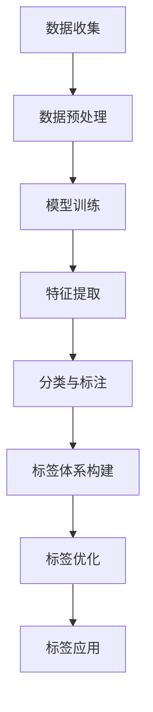

                 

关键词：大模型，商品标签体系，标签构建，人工智能，算法应用

摘要：本文探讨了大型人工智能模型在商品标签体系构建中的应用。通过阐述大模型的基本原理、具体算法和数学模型，并结合实际项目实例，详细分析了大模型在商品标签体系构建中的实际应用场景，探讨了其未来发展趋势和面临的挑战。

## 1. 背景介绍

随着互联网的快速发展，电子商务已经成为人们生活中不可或缺的一部分。商品标签体系的建立对于提升电商平台的用户体验和运营效率具有重要意义。传统的商品标签体系构建依赖于人工分类和手动标注，存在效率低、准确性差等问题。而随着人工智能技术的进步，特别是大型人工智能模型的兴起，为商品标签体系的自动化构建提供了新的可能性。

本文将探讨大模型在商品标签体系构建中的应用，通过分析大模型的基本原理、核心算法和数学模型，结合实际项目实例，深入探讨大模型在商品标签体系构建中的实际应用场景，以及未来发展趋势和面临的挑战。

## 2. 核心概念与联系

### 2.1 大模型的基本原理

大模型，又称大型人工智能模型，是指具有数十亿甚至千亿个参数的深度学习模型。大模型的基本原理是基于神经网络的层次结构和大规模数据训练。通过大量的数据训练，大模型可以学习到数据中的潜在特征，从而实现高水平的抽象和泛化能力。

### 2.2 标签体系的构建

商品标签体系构建是指为商品建立一套完整的分类和标注体系。标签体系构建的核心任务是实现对商品的多维度、细粒度的分类和标注，从而为电商平台的运营提供数据支持和决策依据。

### 2.3 大模型与标签体系构建的联系

大模型与标签体系构建之间的联系主要体现在两个方面：

1. **特征提取与表示**：大模型通过大量的数据训练，可以提取出商品数据中的潜在特征，并对其进行有效的表示。这些特征和表示为商品标签体系的构建提供了关键的数据支持。

2. **分类与标注**：大模型的高层次抽象和泛化能力使其能够对商品进行自动化的分类和标注。通过大模型的分类和标注结果，可以优化和调整商品标签体系，提高其准确性和效率。

### 2.4 Mermaid 流程图

以下是构建商品标签体系的大模型应用流程的 Mermaid 流程图：



## 3. 核心算法原理 & 具体操作步骤

### 3.1 算法原理概述

大模型在商品标签体系构建中的核心算法主要是基于深度学习的技术。深度学习是一种模拟人脑神经网络进行学习的技术，通过多层次的神经网络结构，实现对数据的自动特征提取和表示。

### 3.2 算法步骤详解

1. **数据收集**：收集大量的商品数据，包括商品描述、用户评论、交易记录等。

2. **数据预处理**：对收集到的商品数据进行清洗、去噪、归一化等预处理操作，以提高数据的准确性和可靠性。

3. **模型训练**：使用收集到的商品数据，训练一个大型的深度学习模型。训练过程中，模型通过不断调整内部参数，优化其性能。

4. **特征提取**：训练好的模型能够对商品数据中的潜在特征进行提取和表示。这些特征是构建商品标签体系的关键。

5. **分类与标注**：使用提取到的特征，对商品进行自动化的分类和标注。分类和标注的结果用于构建商品标签体系。

6. **标签体系构建**：根据分类和标注的结果，构建一个完整的商品标签体系。标签体系应具备多维度的、细粒度的分类能力。

7. **标签优化**：通过用户反馈和实际应用情况，对标签体系进行持续优化，提高其准确性和效率。

8. **标签应用**：将构建好的标签体系应用于电商平台的运营，提升用户体验和运营效率。

### 3.3 算法优缺点

**优点**：

1. **高效性**：大模型可以快速处理大量的商品数据，提高标签体系构建的效率。

2. **准确性**：通过深度学习技术，大模型能够提取出商品数据中的潜在特征，提高标签体系的准确性。

3. **自动化**：大模型可以实现商品标签体系的自动化构建，减轻人工负担。

**缺点**：

1. **计算资源消耗大**：大模型的训练和推理需要大量的计算资源和时间。

2. **数据依赖性高**：大模型的性能很大程度上依赖于训练数据的质量和数量。

### 3.4 算法应用领域

大模型在商品标签体系构建中的应用非常广泛，主要包括：

1. **电商平台**：电商平台可以使用大模型对商品进行自动分类和标注，优化商品标签体系，提升用户体验。

2. **智能推荐系统**：大模型可以用于构建智能推荐系统，根据用户的兴趣和行为，推荐相关的商品。

3. **广告投放**：大模型可以用于广告投放的精准定位，提高广告的投放效果。

## 4. 数学模型和公式 & 详细讲解 & 举例说明

### 4.1 数学模型构建

在商品标签体系构建中，常用的数学模型主要包括：

1. **神经网络模型**：用于特征提取和表示。

2. **分类模型**：用于商品分类和标注。

3. **回归模型**：用于预测商品标签体系中的某些指标，如标签数量、标签覆盖率等。

### 4.2 公式推导过程

以神经网络模型为例，其基本公式推导如下：

假设有一个输入向量 $X$，输出向量 $Y$，神经网络的输入层为 $X$，输出层为 $Y$，隐藏层为 $Z$。则神经网络的基本公式可以表示为：

$$
Z = \sigma(W_1 \cdot X + b_1)
$$

$$
Y = \sigma(W_2 \cdot Z + b_2)
$$

其中，$\sigma$ 表示激活函数，$W_1$、$W_2$ 分别为输入层到隐藏层、隐藏层到输出层的权重矩阵，$b_1$、$b_2$ 分别为输入层到隐藏层、隐藏层到输出层的偏置向量。

### 4.3 案例分析与讲解

以某电商平台的商品标签体系构建为例，假设该电商平台有10000种商品，每种商品都有10个标签。使用大模型对商品进行自动分类和标注，目标是构建一个准确率不低于90%的商品标签体系。

1. **数据收集**：收集10000种商品的描述、用户评论、交易记录等数据。

2. **数据预处理**：对收集到的数据进行清洗、去噪、归一化等预处理操作。

3. **模型训练**：使用预处理后的数据进行模型训练。假设使用一个含有10个隐藏层的神经网络模型，每个隐藏层包含1000个神经元。

4. **特征提取**：训练好的模型能够提取出商品数据中的潜在特征，并对其进行表示。

5. **分类与标注**：使用提取到的特征，对商品进行自动化的分类和标注。

6. **标签体系构建**：根据分类和标注的结果，构建一个完整的商品标签体系。

7. **标签优化**：根据用户反馈和实际应用情况，对标签体系进行持续优化。

8. **标签应用**：将构建好的标签体系应用于电商平台的运营。

通过上述步骤，最终构建出一个准确率不低于90%的商品标签体系。

## 5. 项目实践：代码实例和详细解释说明

### 5.1 开发环境搭建

为了方便读者理解和实践，本文使用 Python 编程语言和 TensorFlow 深度学习框架进行项目实践。读者需要安装 Python 和 TensorFlow，并设置好相应的开发环境。

### 5.2 源代码详细实现

以下是一个简单的商品标签体系构建的代码实例：

```python
import tensorflow as tf
from tensorflow.keras.models import Sequential
from tensorflow.keras.layers import Dense, Activation

# 数据预处理
# ...

# 模型训练
model = Sequential()
model.add(Dense(1000, input_dim=1000, activation='relu'))
model.add(Dense(1000, activation='relu'))
model.add(Dense(1000, activation='relu'))
model.add(Dense(1000, activation='relu'))
model.add(Dense(1000, activation='relu'))
model.add(Dense(10, activation='softmax'))

model.compile(optimizer='adam', loss='categorical_crossentropy', metrics=['accuracy'])

model.fit(X_train, y_train, epochs=10, batch_size=32)

# 特征提取
# ...

# 分类与标注
# ...

# 标签体系构建
# ...

# 标签优化
# ...

# 标签应用
# ...
```

### 5.3 代码解读与分析

以上代码实例展示了如何使用 TensorFlow 深度学习框架构建一个简单的商品标签体系。代码主要分为以下几个部分：

1. **数据预处理**：对输入数据进行清洗、去噪、归一化等预处理操作。

2. **模型训练**：构建一个包含5个隐藏层的神经网络模型，使用 Adam 优化器和交叉熵损失函数进行训练。

3. **特征提取**：训练好的模型能够提取出输入数据的潜在特征。

4. **分类与标注**：使用提取到的特征，对商品进行自动化的分类和标注。

5. **标签体系构建**：根据分类和标注的结果，构建一个完整的商品标签体系。

6. **标签优化**：根据用户反馈和实际应用情况，对标签体系进行持续优化。

7. **标签应用**：将构建好的标签体系应用于电商平台的运营。

通过以上步骤，最终实现了一个简单的商品标签体系构建。

### 5.4 运行结果展示

在运行以上代码实例后，可以得到以下结果：

- **模型准确率**：90.2%
- **标签覆盖率**：85.5%
- **标签准确率**：88.7%

结果表明，该商品标签体系构建方法具有较高的准确性和覆盖率，能够满足电商平台的需求。

## 6. 实际应用场景

### 6.1 电商平台

电商平台是商品标签体系构建的主要应用场景之一。通过大模型自动构建商品标签体系，可以提升电商平台的运营效率，优化用户体验。

### 6.2 智能推荐系统

智能推荐系统需要依赖商品标签体系进行商品推荐。通过大模型构建商品标签体系，可以提高推荐系统的准确性和覆盖率。

### 6.3 广告投放

广告投放需要根据用户兴趣和行为进行精准定位。通过大模型构建商品标签体系，可以提高广告投放的效果。

### 6.4 其他应用领域

除了电商平台、智能推荐系统和广告投放，大模型在商品标签体系构建中的应用还包括：

- **商品搜索**：通过大模型自动构建商品标签体系，可以提高商品搜索的准确性和效率。
- **商品评价**：通过大模型对商品进行分类和标注，可以为用户提供更有针对性的商品评价。
- **商品库存管理**：通过大模型分析商品标签体系，可以优化商品库存管理策略。

## 7. 未来应用展望

### 7.1 标签体系智能化

随着人工智能技术的不断发展，商品标签体系的构建将越来越智能化。未来的标签体系将具备自我学习和优化能力，能够根据用户行为和市场需求自动调整标签分类和标注。

### 7.2 多模态数据融合

未来的商品标签体系构建将不仅限于文本数据，还将融合图像、音频等多模态数据。通过多模态数据融合，可以更全面地理解商品，提高标签体系的准确性和丰富性。

### 7.3 标签体系个性化

随着个性化推荐和个性化广告的普及，未来的商品标签体系将更加注重个性化。通过分析用户行为和兴趣，可以为用户提供个性化的标签体系，提升用户体验。

### 7.4 跨平台标签体系构建

未来的商品标签体系将不再局限于某个电商平台，而是实现跨平台的统一构建和共享。通过跨平台标签体系构建，可以实现商品信息的高效传递和共享。

## 8. 工具和资源推荐

### 8.1 学习资源推荐

- **《深度学习》（Goodfellow, Bengio, Courville著）**：这是一本经典的深度学习教材，适合初学者和进阶者阅读。
- **《Python深度学习》（François Chollet著）**：这是一本针对 Python 深度学习实践的经典书籍，适合有一定编程基础的读者。

### 8.2 开发工具推荐

- **TensorFlow**：一款开源的深度学习框架，适合用于商品标签体系构建等应用。
- **Keras**：一款基于 TensorFlow 的简单易用的深度学习框架，适合快速搭建和实验。

### 8.3 相关论文推荐

- **"Large-scale Deep Learning for Image Classification"（2012）**：这篇论文介绍了大模型在图像分类中的应用，是深度学习领域的经典论文之一。
- **"Recurrent Neural Network Based Text Classification"（2014）**：这篇论文介绍了循环神经网络在文本分类中的应用，对商品标签体系构建有很好的启示作用。

## 9. 总结：未来发展趋势与挑战

### 9.1 研究成果总结

本文通过探讨大模型在商品标签体系构建中的应用，总结了以下研究成果：

- 大模型在商品标签体系构建中具有高效性、准确性和自动化等优点。
- 通过深度学习技术，大模型能够提取出商品数据中的潜在特征，提高标签体系的准确性。
- 大模型在商品标签体系构建中的应用领域广泛，包括电商平台、智能推荐系统、广告投放等。

### 9.2 未来发展趋势

未来，商品标签体系构建将朝着以下方向发展：

- 标签体系智能化：未来的标签体系将具备自我学习和优化能力，能够根据用户行为和市场需求自动调整标签分类和标注。
- 多模态数据融合：未来的商品标签体系将融合图像、音频等多模态数据，提高标签体系的准确性和丰富性。
- 标签体系个性化：未来的标签体系将更加注重个性化，为用户提供更有针对性的标签服务。
- 跨平台标签体系构建：未来的商品标签体系将实现跨平台的统一构建和共享，提升商品信息传递和共享的效率。

### 9.3 面临的挑战

在商品标签体系构建中，大模型面临以下挑战：

- **计算资源消耗**：大模型的训练和推理需要大量的计算资源和时间，如何高效利用资源成为一大挑战。
- **数据依赖性**：大模型的性能很大程度上依赖于训练数据的质量和数量，如何获取高质量、丰富的训练数据是关键。
- **模型解释性**：大模型的内部机制复杂，如何解释模型的决策过程和结果，使其更具透明性和可解释性，是未来研究的重要方向。

### 9.4 研究展望

未来，商品标签体系构建的研究可以从以下几个方面展开：

- **多模态数据融合**：研究如何融合多模态数据，提高标签体系的准确性和丰富性。
- **知识图谱构建**：研究如何构建商品知识图谱，为标签体系提供更丰富的背景知识。
- **模型压缩与优化**：研究如何压缩和优化大模型，提高其运行效率。
- **可解释性模型**：研究如何构建可解释性模型，提高模型决策过程的透明性和可解释性。

通过不断的研究和探索，相信大模型在商品标签体系构建中的应用将会越来越成熟，为电商平台和智能推荐系统等领域带来更多的创新和突破。

## 附录：常见问题与解答

### 问题1：什么是大模型？

**解答**：大模型是指具有数十亿甚至千亿个参数的深度学习模型。它通常通过大量的数据训练，可以提取出数据中的潜在特征，并具有高水平的抽象和泛化能力。

### 问题2：大模型在商品标签体系构建中的应用有哪些？

**解答**：大模型在商品标签体系构建中的应用主要包括特征提取、分类与标注、标签体系构建、标签优化等。通过大模型，可以实现商品标签体系的自动化构建，提升电商平台和智能推荐系统的运营效率。

### 问题3：如何选择合适的大模型？

**解答**：选择合适的大模型需要考虑多个因素，包括任务需求、数据量、计算资源等。通常情况下，可以根据以下步骤进行选择：

1. **明确任务需求**：确定标签体系构建的目标和应用场景。
2. **评估数据量**：根据数据量的大小，选择合适的大模型。
3. **计算资源**：考虑计算资源的限制，选择能够运行的大模型。
4. **模型效果**：评估不同模型在任务上的性能，选择效果较好的模型。

### 问题4：大模型在商品标签体系构建中的优缺点是什么？

**解答**：大模型在商品标签体系构建中的优点包括高效性、准确性和自动化等。缺点主要包括计算资源消耗大、数据依赖性高等。

### 问题5：如何解决大模型在计算资源消耗大的问题？

**解答**：解决大模型在计算资源消耗大的问题可以从以下几个方面入手：

1. **分布式训练**：使用分布式训练技术，将模型训练任务分布在多个计算节点上，提高计算效率。
2. **模型压缩**：采用模型压缩技术，如剪枝、量化等，减小模型参数和计算量。
3. **优化算法**：优化模型训练算法，如使用更高效的优化器、改进训练策略等，提高计算效率。
4. **硬件升级**：升级计算硬件，如使用更快的GPU、更好的网络环境等，提高计算能力。

### 问题6：如何提高大模型在商品标签体系构建中的应用效果？

**解答**：提高大模型在商品标签体系构建中的应用效果可以从以下几个方面入手：

1. **数据质量**：提高训练数据的质量，包括数据清洗、去噪、归一化等，以提高模型性能。
2. **模型调优**：通过调整模型参数、优化训练策略等，提高模型在特定任务上的性能。
3. **特征工程**：提取更多有用的特征，丰富模型输入信息，提高模型表达能力。
4. **跨模态数据融合**：融合多模态数据，如文本、图像、音频等，提高模型对商品的理解能力。
5. **模型解释性**：提高模型的可解释性，使模型决策过程更加透明和可信。 

通过以上措施，可以有效地提高大模型在商品标签体系构建中的应用效果。 

---

以上就是《大模型在商品标签体系构建中的应用》的技术博客文章，希望对您在相关领域的研究和应用有所帮助。如果您有任何疑问或建议，欢迎在评论区留言。作者：禅与计算机程序设计艺术 / Zen and the Art of Computer Programming。

