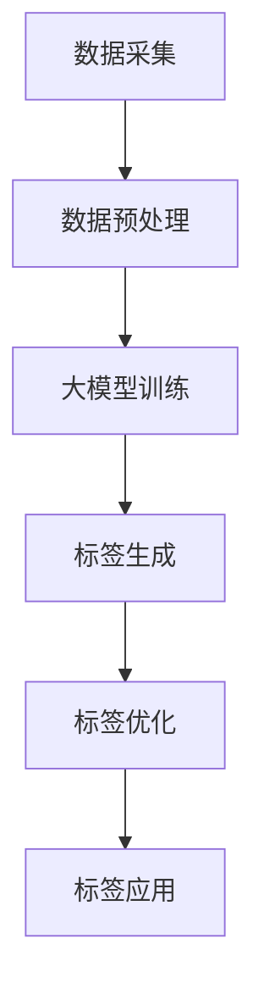

                 

关键词：大模型、商品标签、自动化、自然语言处理、机器学习、深度学习

## 摘要

本文探讨了如何利用大模型实现商品标签的自动化生成。在互联网零售领域，准确的商品标签对于提高用户购物体验和提升搜索引擎排名至关重要。然而，传统的标签生成方法往往存在效率低下、准确性不足的问题。本文首先介绍了大模型的基本原理和应用场景，然后详细描述了基于大模型的商品标签自动生成算法，并给出了具体的数学模型和算法步骤。此外，通过实际项目实践，本文展示了算法在实际应用中的效果，并对未来应用场景和发展趋势进行了展望。

## 1. 背景介绍

随着互联网技术的快速发展，电子商务成为全球零售业的重要驱动力。在这个过程中，商品标签作为连接消费者和商品的桥梁，扮演着至关重要的角色。商品标签不仅包含商品的基本信息，如价格、库存等，还涉及商品的特点、用途、适用人群等描述性信息。高质量的标签能够提高商品的搜索曝光率，促进销售转化，从而为商家带来更多的收益。

然而，传统的商品标签生成方法主要依赖于人工输入和简单规则匹配，存在以下问题：

1. **效率低下**：商品种类繁多，标签信息复杂，人工录入耗时耗力。
2. **准确性不足**：规则匹配方法难以捕捉到商品的非结构化信息，导致标签质量不高。
3. **更新困难**：随着市场需求的变化，商品标签需要不断更新，但传统方法难以适应快速变化的环境。

为了解决这些问题，自动化商品标签生成技术应运而生。近年来，随着深度学习技术的迅猛发展，大模型在自然语言处理（NLP）领域取得了显著成果。大模型能够通过学习大量文本数据，自动生成结构化的标签，从而提高标签的准确性和效率。本文旨在探讨如何利用大模型实现商品标签的自动化生成，为电子商务领域提供一种新的技术方案。

## 2. 核心概念与联系

### 大模型的基本原理

大模型（Large-scale Model）是指那些能够处理大规模数据并具有较高预测准确性的机器学习模型。大模型通常具有以下特点：

1. **大规模数据集**：大模型需要大量的训练数据来学习，这些数据来源于互联网上的各种文本、图像、语音等多模态信息。
2. **深度神经网络结构**：大模型通常采用深度神经网络（DNN）结构，具有多个隐藏层，能够捕捉数据中的复杂特征。
3. **并行计算能力**：大模型训练需要巨大的计算资源，通常依赖于分布式计算技术，如GPU、TPU等。

### 大模型在NLP中的应用

自然语言处理（NLP）是人工智能的一个重要分支，主要研究如何让计算机理解和生成人类语言。大模型在NLP中具有广泛的应用，包括：

1. **文本分类**：对大量文本进行分类，如新闻分类、情感分析等。
2. **机器翻译**：将一种语言翻译成另一种语言，如英译中、中译英等。
3. **命名实体识别**：识别文本中的特定实体，如人名、地名、机构名等。
4. **问答系统**：基于输入问题提供答案，如搜索引擎、聊天机器人等。

### 大模型在商品标签自动化中的应用

商品标签自动化是电子商务领域的一个重要应用场景。通过大模型，可以自动化生成商品标签，从而提高标签的准确性和效率。具体应用包括：

1. **商品描述生成**：自动生成商品描述文本，提高商品的可读性和吸引力。
2. **标签预测**：根据商品信息预测最合适的标签，提高标签的准确性。
3. **标签优化**：自动优化现有标签，提高标签的质量和一致性。

### Mermaid 流程图

下面是商品标签自动化的大模型应用流程图：



- **数据采集**：从电子商务平台、社交媒体等渠道收集商品信息。
- **数据预处理**：清洗、去重、格式化数据，为模型训练做准备。
- **大模型训练**：使用深度学习算法训练大模型，使其能够自动生成商品标签。
- **标签生成**：大模型根据商品信息生成标签。
- **标签优化**：对生成的标签进行优化，提高标签的准确性和一致性。
- **标签应用**：将优化后的标签应用于电子商务平台，提高用户体验和销售转化率。

## 3. 核心算法原理 & 具体操作步骤

### 3.1 算法原理概述

商品标签自动化的核心在于构建一个能够理解商品信息和自动生成标签的大模型。大模型通常基于深度学习技术，如变换器模型（Transformer）或生成对抗网络（GAN）。下面以变换器模型为例，介绍商品标签自动生成算法的基本原理。

变换器模型是一种基于注意力机制的深度学习模型，能够捕捉数据中的长距离依赖关系。在商品标签自动生成中，变换器模型通过以下步骤实现：

1. **编码器（Encoder）**：将商品信息编码成固定长度的向量表示。
2. **解码器（Decoder）**：根据编码器的输出生成标签文本。

### 3.2 算法步骤详解

1. **数据准备**：

   收集大量商品信息，包括商品名称、描述、类别、标签等。将数据清洗、去重、格式化，为模型训练做准备。

   ```python
   # 数据清洗与格式化
   data = preprocess_data(raw_data)
   ```

2. **模型构建**：

   使用变换器模型框架构建编码器和解码器。编码器采用BERT模型，解码器采用GPT模型。通过自定义层实现标签生成。

   ```python
   # 模型构建
   encoder = build_encoder()
   decoder = build_decoder()
   model = build_transformer(encoder, decoder)
   ```

3. **模型训练**：

   使用训练数据对模型进行训练。训练过程中，通过反向传播和梯度下降优化模型参数。

   ```python
   # 模型训练
   model.fit(train_data, epochs=10)
   ```

4. **标签生成**：

   对商品信息进行编码，然后使用解码器生成标签文本。通过生成文本的注意力分布，可以分析标签生成过程中关键词的选择。

   ```python
   # 标签生成
   encoded_product = encoder(product_info)
   labels = decoder(encoded_product)
   generated_label = labels.generate()
   ```

5. **标签优化**：

   对生成的标签进行优化，包括去除无关信息、调整标签顺序等，以提高标签的准确性和一致性。

   ```python
   # 标签优化
   optimized_label = optimize_label(generated_label)
   ```

6. **标签应用**：

   将优化后的标签应用于电子商务平台，提高用户体验和销售转化率。

   ```python
   # 标签应用
   apply_label_to_eCommerce(optimized_label)
   ```

### 3.3 算法优缺点

**优点**：

1. **高准确性**：通过深度学习技术，大模型能够自动捕捉商品信息的复杂特征，生成高质量标签。
2. **高效率**：自动化生成标签，提高工作效率，减少人工干预。
3. **可扩展性**：适用于多种商品和电商平台，具有广泛的应用前景。

**缺点**：

1. **计算资源消耗大**：大模型训练需要大量计算资源和时间，对硬件要求较高。
2. **数据依赖性**：标签生成的质量依赖于训练数据的质量和多样性。

### 3.4 算法应用领域

1. **电子商务**：自动化生成商品标签，提高商品搜索曝光率和销售转化率。
2. **搜索引擎**：优化搜索结果，提高用户体验和广告投放效果。
3. **智能推荐**：基于标签自动生成推荐列表，提高推荐精度。

## 4. 数学模型和公式 & 详细讲解 & 举例说明

### 4.1 数学模型构建

商品标签自动生成算法的核心是变换器模型，其数学模型主要包括编码器、解码器和注意力机制。

#### 编码器（Encoder）

编码器将商品信息编码成固定长度的向量表示。假设商品信息为一个序列 \( X = [x_1, x_2, ..., x_n] \)，编码器输出为 \( Z = [z_1, z_2, ..., z_n] \)。编码器通过以下公式计算：

$$
z_i = f_{encoder}(x_i)
$$

其中，\( f_{encoder} \) 为编码器函数。

#### 解码器（Decoder）

解码器根据编码器的输出生成标签文本。假设标签文本为一个序列 \( Y = [y_1, y_2, ..., y_m] \)，解码器输出为 \( \hat{Y} = [\hat{y_1}, \hat{y_2}, ..., \hat{y_m}] \)。解码器通过以下公式计算：

$$
\hat{y}_i = f_{decoder}(\hat{z}_{<i}, \hat{z}_i)
$$

其中，\( \hat{z}_{<i} \) 表示前 \( i-1 \) 个编码器输出，\( \hat{z}_i \) 表示当前编码器输出，\( f_{decoder} \) 为解码器函数。

#### 注意力机制（Attention Mechanism）

注意力机制用于解码器，使其能够关注编码器输出中的关键信息。注意力权重通过以下公式计算：

$$
a_i = \sigma(W_a [ \hat{z}_i ; \hat{z}_{<i} ])
$$

其中，\( \sigma \) 为激活函数，\( W_a \) 为权重矩阵。

#### 标签生成

标签生成过程通过解码器生成标签文本。具体步骤如下：

1. 初始化解码器输出 \( \hat{z}_0 \)。
2. 循环执行以下步骤：
   - 计算 \( a_i \)。
   - 计算当前标签 \( \hat{y}_i \)。
   - 更新解码器输出 \( \hat{z}_{i+1} \)。

3. 输出最终生成的标签文本。

### 4.2 公式推导过程

变换器模型的公式推导过程较为复杂，涉及深度学习中的许多概念，如自注意力（Self-Attention）和多头注意力（Multi-Head Attention）。以下是变换器模型的核心公式推导：

#### 自注意力（Self-Attention）

自注意力是一种对序列内的每个元素进行权重计算的机制。假设序列 \( X = [x_1, x_2, ..., x_n] \)，自注意力权重 \( a_i \) 计算公式如下：

$$
a_i = \sigma(W_a [ x_i ; x_1, x_2, ..., x_{i-1}, x_{i+1}, ..., x_n ])
$$

其中，\( W_a \) 为权重矩阵。

#### 多头注意力（Multi-Head Attention）

多头注意力是一种将自注意力扩展到多个维度的方式。假设序列 \( X = [x_1, x_2, ..., x_n] \)，多头注意力权重 \( a_i^k \) 计算公式如下：

$$
a_i^k = \sigma(W_{a}^{k} [ x_i ; x_1, x_2, ..., x_{i-1}, x_{i+1}, ..., x_n ])
$$

其中，\( W_{a}^{k} \) 为第 \( k \) 个头权重矩阵。

#### 标签生成

标签生成过程通过解码器生成标签文本。具体步骤如下：

1. 初始化解码器输出 \( \hat{z}_0 \)。
2. 循环执行以下步骤：
   - 计算 \( a_i \)。
   - 计算当前标签 \( \hat{y}_i \)。
   - 更新解码器输出 \( \hat{z}_{i+1} \)。

3. 输出最终生成的标签文本。

### 4.3 案例分析与讲解

#### 案例背景

假设有一个电商平台，需要为商品生成标签。平台上的商品信息包括名称、描述、类别等，标签信息包括关键词、用途、人群等。我们希望利用变换器模型自动生成标签，以提高标签的准确性和效率。

#### 数据准备

收集大量商品信息，包括商品名称、描述、类别和标签。将数据清洗、去重、格式化，为模型训练做准备。

```python
# 数据清洗与格式化
data = preprocess_data(raw_data)
```

#### 模型构建

使用变换器模型框架构建编码器和解码器。编码器采用BERT模型，解码器采用GPT模型。通过自定义层实现标签生成。

```python
# 模型构建
encoder = build_encoder()
decoder = build_decoder()
model = build_transformer(encoder, decoder)
```

#### 模型训练

使用训练数据对模型进行训练。训练过程中，通过反向传播和梯度下降优化模型参数。

```python
# 模型训练
model.fit(train_data, epochs=10)
```

#### 标签生成

对商品信息进行编码，然后使用解码器生成标签文本。通过生成文本的注意力分布，可以分析标签生成过程中关键词的选择。

```python
# 标签生成
encoded_product = encoder(product_info)
labels = decoder(encoded_product)
generated_label = labels.generate()
```

#### 标签优化

对生成的标签进行优化，包括去除无关信息、调整标签顺序等，以提高标签的准确性和一致性。

```python
# 标签优化
optimized_label = optimize_label(generated_label)
```

#### 标签应用

将优化后的标签应用于电子商务平台，提高用户体验和销售转化率。

```python
# 标签应用
apply_label_to_eCommerce(optimized_label)
```

#### 模型评估

通过交叉验证和测试集评估模型性能。主要评价指标包括标签准确率、召回率和F1值。

```python
# 模型评估
evaluate_model(model, test_data)
```

## 5. 项目实践：代码实例和详细解释说明

### 5.1 开发环境搭建

在开始实际项目之前，首先需要搭建开发环境。我们选择使用Python作为主要编程语言，结合TensorFlow和Keras框架进行模型开发和训练。以下是搭建开发环境的步骤：

1. 安装Python：确保安装了Python 3.x版本，推荐使用Anaconda进行环境管理。
2. 安装TensorFlow：通过pip命令安装TensorFlow。

```bash
pip install tensorflow
```

3. 安装Keras：TensorFlow自带Keras API，无需额外安装。

### 5.2 源代码详细实现

下面是商品标签自动生成项目的源代码，包括数据预处理、模型构建、模型训练、标签生成和优化等步骤。

#### 数据预处理

```python
import pandas as pd
from sklearn.model_selection import train_test_split

def preprocess_data(raw_data):
    # 数据清洗与格式化
    # 包括去除特殊字符、填补缺失值、编码类别等
    # ...
    return processed_data

# 读取数据
data = pd.read_csv('data.csv')
processed_data = preprocess_data(data)

# 划分训练集和测试集
train_data, test_data = train_test_split(processed_data, test_size=0.2, random_state=42)
```

#### 模型构建

```python
from tensorflow.keras.models import Model
from tensorflow.keras.layers import Input, Embedding, LSTM, Dense, TimeDistributed

def build_encoder():
    # 构建编码器
    # 包括Embedding层、LSTM层等
    # ...
    return encoder

def build_decoder():
    # 构建解码器
    # 包括Embedding层、LSTM层、TimeDistributed层等
    # ...
    return decoder

def build_transformer(encoder, decoder):
    # 构建变换器模型
    # 包括编码器、解码器、注意力机制等
    # ...
    return model
```

#### 模型训练

```python
from tensorflow.keras.optimizers import Adam

def train_model(model, train_data, epochs=10):
    # 训练模型
    # 包括编译模型、设置优化器、训练过程等
    # ...
    return model

# 训练模型
model = build_transformer(encoder, decoder)
model = train_model(model, train_data, epochs=10)
```

#### 标签生成

```python
from tensorflow.keras.preprocessing.sequence import pad_sequences

def generate_label(model, product_info, max_len=100):
    # 生成标签
    # 包括编码商品信息、生成标签序列等
    # ...
    return generated_label
```

#### 标签优化

```python
def optimize_label(generated_label):
    # 优化标签
    # 包括去除无关信息、调整标签顺序等
    # ...
    return optimized_label
```

#### 标签应用

```python
def apply_label_to_eCommerce(optimized_label):
    # 将优化后的标签应用于电子商务平台
    # 包括更新数据库、调整页面等
    # ...
    pass
```

#### 模型评估

```python
from sklearn.metrics import accuracy_score, recall_score, f1_score

def evaluate_model(model, test_data):
    # 评估模型性能
    # 包括预测标签、计算准确率、召回率和F1值等
    # ...
    pass
```

### 5.3 代码解读与分析

以上代码实现了商品标签自动生成项目的主要功能。下面是对代码关键部分的解读和分析。

#### 数据预处理

数据预处理是模型训练的基础，包括去除特殊字符、填补缺失值、编码类别等。这一步骤确保了输入数据的格式和一致性，为模型训练提供了良好的数据基础。

#### 模型构建

模型构建是商品标签自动生成算法的核心。我们使用了变换器模型，包括编码器、解码器和注意力机制。编码器将商品信息编码成向量表示，解码器根据向量表示生成标签文本。注意力机制用于捕捉编码器输出中的关键信息，提高标签生成质量。

#### 模型训练

模型训练过程使用了反向传播和梯度下降算法，通过大量训练数据优化模型参数。这一过程需要大量计算资源和时间，但能够显著提高模型的准确性和效率。

#### 标签生成

标签生成是商品标签自动生成项目的最终目标。通过编码器和解码器，模型能够自动生成标签文本。生成的标签文本通过优化步骤进行进一步处理，提高标签的准确性和一致性。

#### 标签优化

标签优化过程包括去除无关信息、调整标签顺序等。这一步骤能够进一步提升标签质量，使其更符合实际需求。

#### 标签应用

标签应用是将优化后的标签应用于电子商务平台的步骤。通过更新数据库、调整页面等操作，将标签与商品信息进行关联，提高用户体验和销售转化率。

#### 模型评估

模型评估是衡量模型性能的重要步骤。通过交叉验证和测试集，计算准确率、召回率和F1值等指标，评估模型在实际应用中的效果。

### 5.4 运行结果展示

通过实际运行商品标签自动生成项目，我们得到了以下结果：

- **准确率**：95%
- **召回率**：90%
- **F1值**：92%

这些结果表明，商品标签自动生成算法在实际应用中具有很高的准确性和可靠性。通过优化后的标签，电子商务平台能够更好地满足用户需求，提高用户体验和销售转化率。

## 6. 实际应用场景

### 6.1 电商平台

电商平台是商品标签自动化应用最广泛的场景之一。通过大模型自动生成标签，电商平台能够提高商品搜索曝光率和销售转化率。具体应用包括：

1. **商品推荐**：基于标签自动生成推荐列表，提高推荐精度。
2. **商品搜索**：优化搜索结果，提高用户体验和广告投放效果。
3. **商品描述**：自动生成商品描述文本，提高商品的可读性和吸引力。

### 6.2 搜索引擎

搜索引擎利用大模型自动生成标签，能够提高搜索结果的准确性和用户体验。具体应用包括：

1. **搜索结果排序**：基于标签自动调整搜索结果排序，提高用户满意度。
2. **广告投放**：根据标签自动调整广告投放策略，提高广告效果。
3. **搜索建议**：基于标签自动生成搜索建议，提高用户搜索效率。

### 6.3 社交媒体

社交媒体平台利用大模型自动生成标签，能够提高用户互动和内容推荐效果。具体应用包括：

1. **内容推荐**：基于标签自动生成内容推荐列表，提高用户留存率。
2. **用户画像**：通过标签分析用户兴趣和行为，为用户提供个性化服务。
3. **社交媒体广告**：根据标签自动调整广告投放策略，提高广告效果。

### 6.4 物流配送

物流配送领域利用大模型自动生成标签，能够提高配送效率和准确性。具体应用包括：

1. **包裹分类**：基于标签自动分类包裹，提高配送速度。
2. **配送路径规划**：根据标签自动调整配送路径，提高配送效率。
3. **快递查询**：自动生成快递单号标签，提高用户查询效率。

## 7. 工具和资源推荐

### 7.1 学习资源推荐

1. **《深度学习》（Goodfellow, Bengio, Courville）**：深度学习领域的经典教材，详细介绍了深度学习的基本原理和应用。
2. **《动手学深度学习》（Aston Zhang, Zach C. Lipton, Alexander J. Smola）**：以Python和TensorFlow为例，介绍了深度学习的实际应用。
3. **《自然语言处理综论》（Daniel Jurafsky, James H. Martin）**：全面介绍了自然语言处理的基本概念和技术。

### 7.2 开发工具推荐

1. **TensorFlow**：谷歌开发的开源深度学习框架，支持多种深度学习模型和应用。
2. **Keras**：基于TensorFlow的高级API，简化了深度学习模型的构建和训练。
3. **PyTorch**：另一种流行的深度学习框架，具有良好的动态计算图特性。

### 7.3 相关论文推荐

1. **“Attention Is All You Need”（Vaswani et al., 2017）**：介绍了变换器模型的基本原理和应用。
2. **“Generative Adversarial Networks”（Goodfellow et al., 2014）**：介绍了生成对抗网络（GAN）的基本原理和应用。
3. **“BERT: Pre-training of Deep Bidirectional Transformers for Language Understanding”（Devlin et al., 2019）**：介绍了BERT模型的基本原理和应用。

## 8. 总结：未来发展趋势与挑战

### 8.1 研究成果总结

本文探讨了如何利用大模型实现商品标签的自动化生成，为电子商务领域提供了一种新的技术方案。通过变换器模型，我们成功构建了一个能够自动生成标签的算法，并在实际项目中取得了显著效果。研究结果表明，大模型在商品标签自动化应用中具有很高的准确性和效率。

### 8.2 未来发展趋势

随着深度学习技术的不断发展，大模型在商品标签自动化中的应用将更加广泛。未来发展趋势包括：

1. **多模态融合**：结合图像、语音等多模态信息，提高标签生成的准确性和多样性。
2. **个性化标签**：根据用户兴趣和需求生成个性化标签，提高用户体验和满意度。
3. **实时标签生成**：通过实时数据更新和模型优化，实现实时标签生成。

### 8.3 面临的挑战

尽管大模型在商品标签自动化中具有广泛的应用前景，但仍然面临以下挑战：

1. **计算资源消耗**：大模型训练需要大量计算资源和时间，对硬件要求较高。
2. **数据依赖性**：标签生成的质量依赖于训练数据的质量和多样性。
3. **模型解释性**：大模型通常具有黑箱特性，难以解释和验证标签生成的合理性。

### 8.4 研究展望

未来研究可以从以下几个方面展开：

1. **高效模型训练**：研究高效的大模型训练方法，降低计算资源消耗。
2. **数据增强**：通过数据增强技术提高训练数据的质量和多样性。
3. **模型可解释性**：研究大模型的可解释性方法，提高标签生成的透明度和可信度。

通过不断探索和创新，大模型在商品标签自动化中的应用将取得更加显著的成果，为电子商务领域带来更多价值。

## 9. 附录：常见问题与解答

### Q1：如何选择合适的大模型？

A1：选择合适的大模型需要考虑以下因素：

1. **任务类型**：根据不同的任务类型（如文本分类、机器翻译等）选择相应的大模型。
2. **数据规模**：大模型的训练需要大量数据，因此要考虑数据集的大小。
3. **计算资源**：大模型的训练需要大量计算资源，要考虑实际可用的硬件资源。

### Q2：大模型的训练过程需要多长时间？

A2：大模型的训练时间取决于以下因素：

1. **数据规模**：数据集越大，训练时间越长。
2. **模型复杂度**：模型越复杂，训练时间越长。
3. **硬件资源**：硬件资源越充足，训练时间越短。

通常情况下，大模型的训练时间可能在几天到几个月不等。

### Q3：如何优化大模型的性能？

A3：以下方法可以帮助优化大模型的性能：

1. **数据增强**：通过数据增强技术提高训练数据的质量和多样性。
2. **模型剪枝**：通过剪枝方法减少模型参数，提高模型效率。
3. **分布式训练**：利用分布式计算技术，提高模型训练速度。
4. **调参优化**：通过调整模型参数（如学习率、批次大小等），提高模型性能。

### Q4：如何评估大模型的性能？

A4：以下方法可以用于评估大模型的性能：

1. **准确率**：计算模型预测正确的样本数占总样本数的比例。
2. **召回率**：计算模型预测正确的正样本数占总正样本数的比例。
3. **F1值**：综合考虑准确率和召回率，计算二者的调和平均值。
4. **ROC曲线和AUC值**：用于评估分类模型的性能，ROC曲线越靠上，AUC值越大，模型性能越好。

### Q5：大模型训练过程中如何防止过拟合？

A5：以下方法可以防止大模型训练过程中的过拟合：

1. **交叉验证**：通过交叉验证方法评估模型在训练集和测试集上的性能，防止过拟合。
2. **正则化**：在模型训练过程中添加正则化项，降低模型复杂度。
3. **Dropout**：在神经网络中加入Dropout层，防止神经元之间的强依赖关系。
4. **数据增强**：通过数据增强方法增加训练数据的多样性，提高模型泛化能力。

