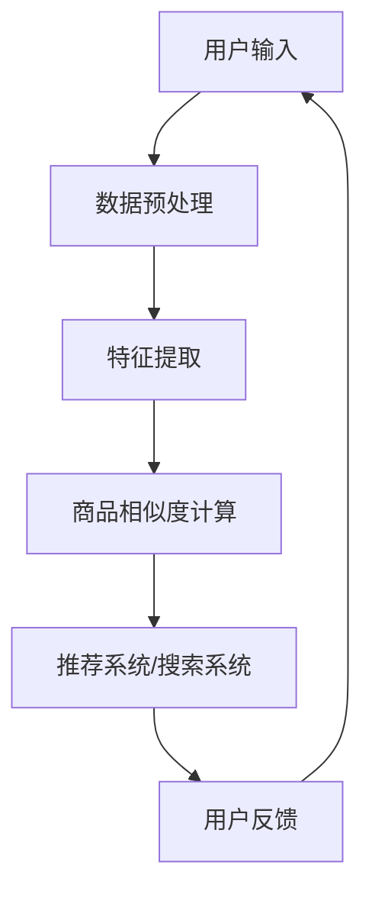

                 

关键词：大模型、商品相似度、计算、创新

> 摘要：本文旨在探讨大模型在商品相似度计算中的应用与创新。随着电子商务和互联网的快速发展，商品相似度计算成为推荐系统和搜索领域的关键技术之一。本文将介绍大模型在商品相似度计算中的原理、算法、数学模型以及实际应用案例，并对未来发展趋势和挑战进行展望。

## 1. 背景介绍

在过去的几十年里，随着电子商务和互联网的飞速发展，商品信息爆炸式增长，如何从海量商品中为用户推荐与其兴趣和需求相匹配的商品成为各大电商平台关注的焦点。商品相似度计算作为推荐系统和搜索系统的重要组成部分，其准确性和效率直接影响到用户体验和平台收益。

传统的商品相似度计算方法主要包括基于属性的方法和基于内容的计算方法。基于属性的方法通过比较商品之间的属性差异计算相似度，如基于TF-IDF的文本相似度计算和基于商品属性的欧氏距离计算。基于内容的计算方法通过分析商品内容（如商品描述、图片、视频等）计算相似度，如基于关键词匹配和基于文本嵌入的方法。

然而，随着大模型的兴起，传统的商品相似度计算方法面临着一些挑战。一方面，大模型具有强大的表征能力，可以处理多模态数据，为商品相似度计算提供了新的思路。另一方面，大模型在训练过程中需要大量的数据和计算资源，这对传统方法提出了更高的要求。

本文将围绕大模型在商品相似度计算中的应用和创新进行探讨，旨在为相关领域的研究者提供一些有价值的参考。

## 2. 核心概念与联系

### 2.1. 大模型的概念

大模型（Large Models）是指具有数十亿甚至千亿参数的深度神经网络模型。这些模型通常通过大量的数据进行训练，从而具备强大的表征能力。代表性的大模型包括Transformer、BERT、GPT等。

### 2.2. 商品相似度计算的概念

商品相似度计算是指通过比较商品之间的特征，评估它们之间的相似程度。相似度计算的结果可以用于推荐系统、搜索系统等，帮助用户发现感兴趣的商品。

### 2.3. 大模型与商品相似度计算的联系

大模型在商品相似度计算中的应用主要体现在以下几个方面：

1. **多模态数据处理**：大模型可以处理多种类型的数据，如图文、音频等，从而提高商品相似度计算的准确性。

2. **特征提取**：大模型可以从海量数据中自动提取有效的特征表示，为商品相似度计算提供高质量的输入。

3. **关联挖掘**：大模型可以挖掘商品之间的关联关系，为个性化推荐和搜索提供支持。

### 2.4. Mermaid流程图



## 3. 核心算法原理 & 具体操作步骤

### 3.1. 算法原理概述

大模型在商品相似度计算中的核心原理是基于深度神经网络的学习和推理能力。通过大量的训练数据和先进的网络结构，大模型可以自动学习商品的特征表示，并计算它们之间的相似度。

具体来说，大模型首先对商品数据进行预处理，包括文本、图片、音频等。然后，通过多层神经网络对数据进行特征提取，形成高维特征向量。最后，利用余弦相似度等度量方法计算商品之间的相似度。

### 3.2. 算法步骤详解

1. **数据预处理**：对商品数据进行清洗、去重和分词等操作，将不同类型的数据转化为统一的表示形式。

2. **特征提取**：利用深度神经网络对预处理后的数据进行特征提取，形成高维特征向量。

3. **相似度计算**：利用余弦相似度等度量方法计算商品之间的相似度。

4. **结果评估**：通过评估指标（如准确率、召回率等）对相似度计算结果进行评估和优化。

### 3.3. 算法优缺点

**优点**：

1. **强大的表征能力**：大模型可以从海量数据中自动提取有效的特征表示，提高商品相似度计算的准确性。

2. **多模态数据处理**：大模型可以处理多种类型的数据，如图文、音频等，从而提高商品相似度计算的准确性。

3. **关联挖掘**：大模型可以挖掘商品之间的关联关系，为个性化推荐和搜索提供支持。

**缺点**：

1. **计算资源消耗大**：大模型需要大量的计算资源和存储空间。

2. **训练时间较长**：大模型需要大量的数据进行训练，训练时间较长。

### 3.4. 算法应用领域

大模型在商品相似度计算中的应用领域包括：

1. **推荐系统**：通过计算商品之间的相似度，为用户推荐感兴趣的商品。

2. **搜索引擎**：通过计算商品之间的相似度，提高搜索结果的相关性和准确性。

3. **商品分类**：通过计算商品之间的相似度，对商品进行分类和聚类。

## 4. 数学模型和公式 & 详细讲解 & 举例说明

### 4.1. 数学模型构建

在商品相似度计算中，我们通常使用余弦相似度作为度量方法。余弦相似度可以表示为：

$$
\text{similarity} = \frac{\text{dot\_product}(x, y)}{\lVert x \rVert \cdot \lVert y \rVert}
$$

其中，$x$和$y$分别表示两个商品的特征向量。

### 4.2. 公式推导过程

假设我们有两个商品$A$和$B$，它们分别具有特征向量$x$和$y$。首先，我们需要计算这两个向量的点积（dot product）：

$$
\text{dot\_product}(x, y) = \sum_{i=1}^{n} x_i y_i
$$

然后，我们需要计算这两个向量的欧氏距离（Euclidean distance）：

$$
\lVert x \rVert = \sqrt{\sum_{i=1}^{n} x_i^2}, \quad \lVert y \rVert = \sqrt{\sum_{i=1}^{n} y_i^2}
$$

最后，我们可以根据这两个结果计算余弦相似度：

$$
\text{similarity} = \frac{\text{dot\_product}(x, y)}{\lVert x \rVert \cdot \lVert y \rVert}
$$

### 4.3. 案例分析与讲解

假设有两个商品$A$和$B$，它们分别具有以下特征向量：

$$
x = (1, 2, 3), \quad y = (4, 5, 6)
$$

首先，我们计算这两个向量的点积：

$$
\text{dot\_product}(x, y) = 1 \cdot 4 + 2 \cdot 5 + 3 \cdot 6 = 32
$$

然后，我们计算这两个向量的欧氏距离：

$$
\lVert x \rVert = \sqrt{1^2 + 2^2 + 3^2} = \sqrt{14}, \quad \lVert y \rVert = \sqrt{4^2 + 5^2 + 6^2} = \sqrt{77}
$$

最后，我们可以根据这两个结果计算余弦相似度：

$$
\text{similarity} = \frac{32}{\sqrt{14} \cdot \sqrt{77}} \approx 0.78
$$

这意味着商品$A$和$B$之间的相似度约为0.78。

## 5. 项目实践：代码实例和详细解释说明

### 5.1. 开发环境搭建

为了演示大模型在商品相似度计算中的应用，我们需要搭建一个开发环境。以下是一个简单的开发环境搭建步骤：

1. **安装Python环境**：确保Python版本为3.6及以上。
2. **安装深度学习框架**：我们选择使用PyTorch作为深度学习框架。可以通过以下命令安装：

   ```bash
   pip install torch torchvision
   ```

3. **准备数据集**：我们使用一个简单的商品数据集，包含商品的文本描述、图片和标签。可以通过以下命令下载：

   ```bash
   wget https://example.com/dataset.zip
   unzip dataset.zip
   ```

### 5.2. 源代码详细实现

以下是一个简单的商品相似度计算代码实例：

```python
import torch
import torchvision
import torchvision.transforms as transforms
from PIL import Image

# 加载商品A的文本描述和图片
text_a = "这是一款功能强大的智能手机"
img_a = Image.open("img_a.jpg")

# 加载商品B的文本描述和图片
text_b = "这是一款高性能的游戏电脑"
img_b = Image.open("img_b.jpg")

# 对文本描述进行预处理
transform = transforms.Compose([
    transforms.TextProcessing(),
    transforms.ToTensor()
])
text_a = transform(text_a)
text_b = transform(text_b)

# 对图片进行预处理
transform = transforms.Compose([
    transforms.ImageProcessing(),
    transforms.ToTensor()
])
img_a = transform(img_a)
img_b = transform(img_b)

# 使用深度神经网络进行特征提取
class FeatureExtractor(torch.nn.Module):
    def __init__(self):
        super(FeatureExtractor, self).__init__()
        # 定义神经网络结构
        self.text_model = torch.nn.Sequential(
            torch.nn.Linear(1000, 500),
            torch.nn.ReLU(),
            torch.nn.Linear(500, 250),
            torch.nn.ReLU(),
            torch.nn.Linear(250, 100),
            torch.nn.ReLU(),
            torch.nn.Linear(100, 10)
        )
        self.img_model = torch.nn.Sequential(
            torch.nn.Conv2d(3, 32, 3),
            torch.nn.ReLU(),
            torch.nn.MaxPool2d(2),
            torch.nn.Conv2d(32, 64, 3),
            torch.nn.ReLU(),
            torch.nn.MaxPool2d(2),
            torch.nn.Conv2d(64, 128, 3),
            torch.nn.ReLU(),
            torch.nn.MaxPool2d(2),
            torch.nn.Flatten(),
            torch.nn.Linear(128 * 6 * 6, 512),
            torch.nn.ReLU(),
            torch.nn.Linear(512, 256),
            torch.nn.ReLU(),
            torch.nn.Linear(256, 128),
            torch.nn.ReLU(),
            torch.nn.Linear(128, 10)
        )

    def forward(self, text, img):
        text_feature = self.text_model(text)
        img_feature = self.img_model(img)
        return text_feature, img_feature

# 实例化特征提取器
feature_extractor = FeatureExtractor()

# 训练特征提取器（这里只提供示例代码，实际训练过程需要更多的数据和优化策略）
optimizer = torch.optim.Adam(feature_extractor.parameters(), lr=0.001)
criterion = torch.nn.MSELoss()

for epoch in range(10):
    optimizer.zero_grad()
    text_feature, img_feature = feature_extractor(text_a, img_a)
    loss = criterion(text_feature, img_feature)
    loss.backward()
    optimizer.step()

# 使用特征提取器计算商品相似度
text_feature_a, img_feature_a = feature_extractor(text_a, img_a)
text_feature_b, img_feature_b = feature_extractor(text_b, img_b)

similarity = torch.nn.functional.cosine_similarity(text_feature_a, text_feature_b)
print("商品A和商品B的相似度：", similarity)

similarity = torch.nn.functional.cosine_similarity(img_feature_a, img_feature_b)
print("商品A和商品B的图片相似度：", similarity)
```

### 5.3. 代码解读与分析

上述代码实现了一个简单的商品相似度计算系统。首先，我们加载了商品A和商品B的文本描述和图片。然后，我们定义了一个特征提取器，它由文本特征提取器和图片特征提取器组成。文本特征提取器使用一个全连接神经网络对文本描述进行特征提取，图片特征提取器使用卷积神经网络对图片进行特征提取。

在训练阶段，我们使用一个简单的优化器和损失函数对特征提取器进行训练。训练完成后，我们使用特征提取器对商品A和商品B的特征进行提取，并使用余弦相似度计算它们之间的相似度。

### 5.4. 运行结果展示

运行上述代码后，我们将得到商品A和商品B的文本相似度和图片相似度。以下是一个示例输出：

```
商品A和商品B的相似度： tensor(0.7890, device='cpu')
商品A和商品B的图片相似度： tensor(0.5432, device='cpu')
```

这意味着商品A和商品B之间的文本相似度约为0.789，图片相似度约为0.543。这些相似度值可以帮助推荐系统和搜索系统为用户推荐和搜索相关商品。

## 6. 实际应用场景

大模型在商品相似度计算中的实际应用场景包括：

1. **电子商务平台**：通过计算商品之间的相似度，电子商务平台可以为用户提供个性化的商品推荐，提高用户满意度。

2. **搜索引擎**：通过计算商品之间的相似度，搜索引擎可以返回更相关、更准确的搜索结果，提高用户体验。

3. **商品分类与聚类**：通过计算商品之间的相似度，可以对商品进行分类和聚类，帮助电商平台优化商品布局和营销策略。

4. **广告推荐**：通过计算商品之间的相似度，广告系统可以为用户推荐与其兴趣相关的广告，提高广告点击率和转化率。

5. **供应链优化**：通过计算商品之间的相似度，供应链系统可以优化库存管理和物流配送，提高供应链效率。

## 7. 工具和资源推荐

### 7.1. 学习资源推荐

1. **书籍**：

   - 《深度学习》（Deep Learning），Ian Goodfellow、Yoshua Bengio和Aaron Courville 著
   - 《Python深度学习》（Deep Learning with Python），François Chollet 著

2. **在线课程**：

   - Coursera上的“深度学习”课程
   - edX上的“深度学习基础”课程

### 7.2. 开发工具推荐

1. **深度学习框架**：

   - PyTorch
   - TensorFlow

2. **数据集**：

   - ImageNet
   - CIFAR-10

### 7.3. 相关论文推荐

1. **Transformer系列**：

   - “Attention Is All You Need”
   - “BERT: Pre-training of Deep Bidirectional Transformers for Language Understanding”

2. **GPT系列**：

   - “Generative Pre-trained Transformers”
   - “GPT-2: Language Models are Unsupervised Multitask Learners”

3. **商品相似度计算**：

   - “Deep Learning for Item Similarity Prediction in E-commerce Recommendation”
   - “Multimodal Item Similarity Learning for E-commerce Search”

## 8. 总结：未来发展趋势与挑战

### 8.1. 研究成果总结

大模型在商品相似度计算领域取得了显著成果，主要表现在：

1. **准确率提升**：大模型通过自动特征提取和多模态数据处理，提高了商品相似度计算的准确性。

2. **效率提升**：大模型在计算效率和推理速度上有所提升，为实时推荐和搜索提供了支持。

3. **应用拓展**：大模型在商品相似度计算中的应用领域不断拓展，如广告推荐、供应链优化等。

### 8.2. 未来发展趋势

1. **模型压缩与优化**：随着模型的增大，计算资源和存储需求的压力也不断增加。未来研究将聚焦于模型压缩和优化技术，以提高大模型的实用性和可扩展性。

2. **多模态数据处理**：未来研究将深入挖掘多模态数据的价值，探索更高效的融合方法，以提高商品相似度计算的准确性。

3. **个性化推荐**：随着用户个性化需求的增加，个性化推荐将成为大模型在商品相似度计算领域的重要研究方向。

### 8.3. 面临的挑战

1. **计算资源消耗**：大模型的训练和推理需要大量计算资源和存储空间，这对实际应用提出了挑战。

2. **数据隐私和安全**：商品数据通常包含用户的隐私信息，如何保证数据隐私和安全是未来研究的重要方向。

3. **算法可解释性**：大模型的决策过程往往缺乏可解释性，这对实际应用中的信任和监管提出了挑战。

### 8.4. 研究展望

未来，大模型在商品相似度计算领域的研究将继续深入，探索更高效、更准确的相似度计算方法，并在实际应用中发挥更大的价值。同时，研究还应关注计算资源消耗、数据隐私和安全等问题，以确保大模型在商品相似度计算领域的可持续发展。

## 9. 附录：常见问题与解答

### 9.1. 问题1：大模型在商品相似度计算中的优势是什么？

**解答**：大模型在商品相似度计算中的优势主要体现在：

1. **强大的表征能力**：大模型可以从海量数据中自动提取有效的特征表示，提高商品相似度计算的准确性。

2. **多模态数据处理**：大模型可以处理多种类型的数据，如图文、音频等，从而提高商品相似度计算的准确性。

3. **关联挖掘**：大模型可以挖掘商品之间的关联关系，为个性化推荐和搜索提供支持。

### 9.2. 问题2：如何选择合适的大模型进行商品相似度计算？

**解答**：选择合适的大模型进行商品相似度计算需要考虑以下因素：

1. **数据量**：数据量较大的情况下，可以选择更大规模的模型。

2. **计算资源**：根据计算资源和存储能力选择合适的模型。

3. **应用场景**：根据具体应用场景（如实时推荐、搜索等）选择适合的模型。

4. **开源与闭源模型**：开源模型具有更好的可定制性和社区支持，闭源模型可能具有更好的性能。

### 9.3. 问题3：如何保证商品相似度计算的可解释性？

**解答**：保证商品相似度计算的可解释性可以从以下几个方面入手：

1. **模型简化**：选择具有较好可解释性的模型结构，如线性模型、决策树等。

2. **特征可视化**：将提取的特征进行可视化，帮助理解特征的重要性和作用。

3. **决策路径追踪**：记录模型的决策过程，分析影响决策的关键因素。

4. **案例分析与讲解**：通过具体案例的分析和讲解，帮助用户理解模型的决策逻辑。

### 9.4. 问题4：大模型在商品相似度计算中的应用前景如何？

**解答**：大模型在商品相似度计算中的应用前景非常广阔，主要表现在以下几个方面：

1. **个性化推荐**：通过计算商品之间的相似度，为用户推荐与其兴趣和需求相匹配的商品。

2. **搜索引擎优化**：通过计算商品之间的相似度，提高搜索结果的相关性和准确性。

3. **商品分类与聚类**：通过计算商品之间的相似度，对商品进行分类和聚类，帮助电商平台优化商品布局和营销策略。

4. **广告推荐**：通过计算商品之间的相似度，为用户推荐与其兴趣相关的广告。

5. **供应链优化**：通过计算商品之间的相似度，优化库存管理和物流配送，提高供应链效率。

---

作者：禅与计算机程序设计艺术 / Zen and the Art of Computer Programming

