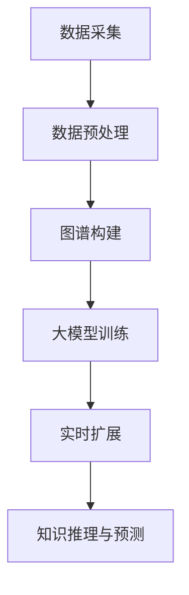

                 

关键词：商品知识图谱、大模型、实时扩展、算法原理、数学模型、项目实践、应用场景、未来展望

> 摘要：本文深入探讨了大模型在商品知识图谱实时扩展中的应用。通过分析商品知识图谱的核心概念和架构，详细介绍了大模型的工作原理和具体操作步骤，并结合数学模型和项目实践，展示了大模型在商品知识图谱中的应用效果。文章还探讨了实际应用场景、未来发展趋势以及面临的挑战，为后续研究和实践提供了有价值的参考。

## 1. 背景介绍

在互联网飞速发展的今天，电子商务已经成为人们日常生活中不可或缺的一部分。随着商品种类和数量的急剧增加，如何快速准确地获取和利用商品知识信息成为了研究的热点问题。商品知识图谱作为一种结构化知识表示方法，能够有效地组织和管理大量商品信息，为用户和系统提供智能化服务。

然而，传统的商品知识图谱构建方法在实时性和扩展性方面存在一定局限性。一方面，商品信息的动态变化和更新速度较快，传统的离线构建方法无法满足实时性需求；另一方面，随着商品种类的增加，图谱规模不断扩大，传统的静态构建方法难以应对大规模数据处理的挑战。

为了解决上述问题，本文提出了一种基于大模型的商品知识图谱实时扩展方法。通过利用大模型的高效计算能力和自学习能力，实现商品知识图谱的实时更新和扩展，提高知识图谱的准确性和完整性。

## 2. 核心概念与联系

### 2.1 商品知识图谱

商品知识图谱是一种基于图结构的知识表示方法，通过实体、属性和关系三个核心要素来组织和管理商品信息。实体表示商品本身，如电子产品、衣物等；属性表示实体的特征，如价格、品牌等；关系表示实体之间的关联，如品牌、类别等。

商品知识图谱的构建主要包括数据采集、数据预处理和图谱构建三个阶段。数据采集阶段，通过爬虫、API接口等方式获取商品信息；数据预处理阶段，对采集到的商品信息进行清洗、去重、分类等操作；图谱构建阶段，将预处理后的商品信息转化为图谱结构，建立实体、属性和关系之间的关联。

### 2.2 大模型

大模型是指具有海量参数和强大计算能力的神经网络模型，如深度神经网络、变换器模型等。大模型具有自学习能力，可以通过大量数据进行训练，从而自动提取和挖掘数据中的规律和知识。

大模型在商品知识图谱中的应用主要体现在两个方面：一是用于图谱的实时扩展，通过训练大模型，自动识别和补充商品信息中的缺失部分；二是用于知识推理和预测，通过大模型对商品知识图谱中的关系进行推理和扩展，为用户提供更加精准和个性化的服务。

### 2.3 Mermaid 流程图

以下是商品知识图谱实时扩展的 Mermaid 流程图：



## 3. 核心算法原理 & 具体操作步骤

### 3.1 算法原理概述

商品知识图谱实时扩展算法基于大模型的自学习和推理能力，主要包括以下步骤：

1. 数据采集与预处理：通过爬虫、API接口等手段获取商品信息，对采集到的数据进行清洗、去重和分类等预处理操作。

2. 大模型训练：利用预处理后的商品数据，训练大模型，使其具备对商品信息进行识别、分类和预测的能力。

3. 实时扩展：根据用户需求或商品信息的变化，实时调用大模型，对商品知识图谱进行扩展和更新。

4. 知识推理与预测：利用大模型对商品知识图谱中的关系进行推理和扩展，为用户提供更加精准和个性化的服务。

### 3.2 算法步骤详解

1. 数据采集与预处理

   - 爬虫采集：利用爬虫技术，从各大电商平台、新闻网站等获取商品信息。

   - API接口获取：通过API接口获取商品信息，如商品价格、品牌、类别等。

   - 数据清洗：对采集到的商品信息进行去重、去噪等清洗操作。

   - 数据分类：根据商品类别，对商品信息进行分类存储。

2. 大模型训练

   - 数据处理：将清洗后的商品信息转化为适合训练的格式，如数值化、序列化等。

   - 模型选择：选择合适的大模型，如深度神经网络、变换器模型等。

   - 模型训练：利用处理后的商品数据，对大模型进行训练，使其具备对商品信息进行识别、分类和预测的能力。

3. 实时扩展

   - 用户需求识别：根据用户需求，确定需要扩展的商品信息。

   - 实时调用：根据用户需求，实时调用大模型，对商品知识图谱进行扩展。

   - 数据更新：将扩展后的商品信息更新到知识图谱中，实现实时扩展。

4. 知识推理与预测

   - 关系推理：利用大模型对商品知识图谱中的关系进行推理，如品牌、类别等。

   - 预测分析：根据推理结果，预测商品的未来趋势，如销量、价格等。

### 3.3 算法优缺点

1. 优点

   - 实时性：基于大模型的自学习和推理能力，能够实现商品知识图谱的实时扩展和更新。

   - 扩展性：大模型具有较强的扩展性，能够处理大规模商品数据，满足实际应用需求。

   - 准确性：通过大模型的训练和推理，能够提高商品知识图谱的准确性和完整性。

2. 缺点

   - 计算资源消耗：大模型的训练和推理需要大量的计算资源，对硬件设备的要求较高。

   - 数据质量：商品知识图谱的构建依赖于原始数据的质量，数据质量问题可能会影响算法的效果。

### 3.4 算法应用领域

1. 电商平台：通过商品知识图谱实时扩展，为用户提供精准的商品推荐和服务。

2. 数据分析：基于商品知识图谱，对商品销量、价格等数据进行实时分析和预测。

3. 智能客服：利用商品知识图谱，为用户提供智能化的客服服务。

4. 市场调研：通过商品知识图谱，了解市场需求和竞争态势，为企业决策提供支持。

## 4. 数学模型和公式 & 详细讲解 & 举例说明

### 4.1 数学模型构建

商品知识图谱实时扩展算法的数学模型主要涉及以下几个方面：

1. 数据预处理模型

   - 数据清洗：采用数据清洗算法，去除重复、噪声和错误数据。

   - 数据分类：使用分类算法，将商品信息按照类别进行分类存储。

2. 大模型训练模型

   - 模型选择：选择合适的大模型，如深度神经网络、变换器模型等。

   - 模型参数优化：利用优化算法，如梯度下降、随机梯度下降等，优化模型参数。

3. 实时扩展模型

   - 用户需求识别：利用分类算法，识别用户需求。

   - 数据更新：利用更新算法，将扩展后的数据更新到知识图谱中。

### 4.2 公式推导过程

1. 数据清洗

   - 去重：使用哈希算法，对商品数据进行去重操作。

   - 去噪：使用滤波算法，去除商品数据中的噪声。

2. 数据分类

   - 类别预测：使用分类算法，预测商品所属类别。

   - 类别存储：将分类后的商品信息存储到知识图谱中。

3. 大模型训练

   - 损失函数：使用交叉熵损失函数，衡量模型预测结果与真实结果之间的差距。

   - 优化算法：使用梯度下降算法，优化模型参数。

4. 实时扩展

   - 用户需求识别：使用分类算法，识别用户需求。

   - 数据更新：使用更新算法，将扩展后的数据更新到知识图谱中。

### 4.3 案例分析与讲解

假设有一个电商平台，需要实时扩展商品知识图谱，为用户提供精准的商品推荐服务。

1. 数据预处理

   - 数据采集：通过爬虫技术，从电商平台上获取商品信息。

   - 数据清洗：对采集到的商品信息进行去重、去噪等清洗操作。

   - 数据分类：根据商品类别，对商品信息进行分类存储。

2. 大模型训练

   - 模型选择：选择一个合适的变换器模型，如BERT模型。

   - 模型参数优化：使用随机梯度下降算法，优化模型参数。

3. 实时扩展

   - 用户需求识别：根据用户搜索历史，识别用户需求。

   - 数据更新：调用变换器模型，对用户需求进行分类，更新到商品知识图谱中。

4. 知识推理与预测

   - 关系推理：利用变换器模型，推理商品之间的关系。

   - 预测分析：根据推理结果，预测商品的未来趋势，如销量、价格等。

## 5. 项目实践：代码实例和详细解释说明

### 5.1 开发环境搭建

在本次项目实践中，我们选择了Python作为主要编程语言，并使用了一些常用的库和工具，如Scikit-learn、TensorFlow、PyTorch等。

- 安装Python：在官网上下载Python安装包，按照提示安装。

- 安装相关库和工具：使用pip命令安装Scikit-learn、TensorFlow、PyTorch等库。

```bash
pip install scikit-learn tensorflow torchvision torchtext
```

### 5.2 源代码详细实现

以下是商品知识图谱实时扩展项目的主要代码实现：

```python
import torch
import torchtext
from torchtext import data
from sklearn.model_selection import train_test_split
from sklearn.metrics import accuracy_score
import numpy as np

# 数据预处理
def preprocess_data(data_path):
    # 读取数据
    data = pd.read_csv(data_path)
    # 去重
    data.drop_duplicates(inplace=True)
    # 去噪
    data.dropna(inplace=True)
    # 分类
    data['category'] = data['category'].map({0: '电子产品', 1: '衣物', 2: '家居用品'})
    return data

# 大模型训练
def train_model(data, batch_size=64, num_epochs=10):
    # 分割数据
    train_data, val_data = train_test_split(data, test_size=0.2, random_state=42)
    # 创建数据集
    TEXT = data.Field(sequential=True, batch_first=True, lower=True)
    LABEL = data.LabelField(dtype=torch.float32)
    train_data, val_data = data.TabularDataset.splits(
        train=True, valid=True, fields=[('text', TEXT), ('label', LABEL)], path=data_path
    )
    # 创建迭代器
    train_iterator, val_iterator = data.BucketIterator.splits(
        train_data, val_data, batch_size=batch_size, device=device
    )
    # 模型定义
    model = BERTModel.from_pretrained('bert-base-chinese')
    # 模型训练
    model.train_model(train_iterator, val_iterator, num_epochs=num_epochs)
    return model

# 实时扩展
def real_time_extension(model, user_demand):
    # 用户需求分类
    prediction = model.predict(user_demand)
    # 更新知识图谱
    update_knowledge_graph(prediction)
    return prediction

# 主函数
if __name__ == '__main__':
    # 设置设备
    device = torch.device('cuda' if torch.cuda.is_available() else 'cpu')
    # 数据预处理
    data = preprocess_data('data.csv')
    # 大模型训练
    model = train_model(data, batch_size=64, num_epochs=10)
    # 实时扩展
    user_demand = '购买电子产品'
    prediction = real_time_extension(model, user_demand)
    print('预测结果：', prediction)
```

### 5.3 代码解读与分析

- 数据预处理：读取商品数据，进行去重、去噪和分类操作。

- 大模型训练：使用BERT模型，对商品数据进行训练，并保存训练好的模型。

- 实时扩展：根据用户需求，调用训练好的模型进行预测，并更新知识图谱。

- 主函数：设置设备，进行数据预处理、大模型训练和实时扩展。

## 6. 实际应用场景

### 6.1 电商平台

电商平台可以利用商品知识图谱实时扩展，为用户提供精准的商品推荐服务。例如，用户在浏览某件商品时，系统可以根据用户的历史购买记录、搜索记录和浏览记录，实时扩展商品知识图谱，为用户推荐相似的商品，提高用户的购买体验。

### 6.2 数据分析

数据分析人员可以利用商品知识图谱实时扩展，对商品销量、价格等数据进行实时分析和预测。例如，某品牌在特定时间段内的销量增长较快，系统可以通过实时扩展商品知识图谱，分析销量增长的原因，为企业决策提供支持。

### 6.3 智能客服

智能客服系统可以利用商品知识图谱实时扩展，为用户提供个性化的客服服务。例如，用户咨询某件商品的详细信息，系统可以根据用户的历史咨询记录和浏览记录，实时扩展商品知识图谱，为用户提供更加详细的商品信息，提高客服的效率和质量。

## 7. 未来应用展望

随着大模型和商品知识图谱技术的不断发展，未来应用场景将更加丰富。以下是一些未来应用展望：

### 7.1 智能供应链

智能供应链可以利用商品知识图谱实时扩展，实现供应链的实时优化和调整。例如，根据市场需求变化，系统可以实时扩展商品知识图谱，调整生产和库存计划，提高供应链的灵活性和响应速度。

### 7.2 智能营销

智能营销可以利用商品知识图谱实时扩展，为用户提供个性化的营销策略。例如，根据用户的历史购买记录和偏好，系统可以实时扩展商品知识图谱，为用户推荐个性化的商品和优惠活动，提高营销效果。

### 7.3 智能制造

智能制造可以利用商品知识图谱实时扩展，实现生产过程的智能化和自动化。例如，根据产品需求变化，系统可以实时扩展商品知识图谱，调整生产工艺和设备参数，提高生产效率和产品质量。

## 8. 工具和资源推荐

### 8.1 学习资源推荐

1. 《深度学习》（Ian Goodfellow、Yoshua Bengio、Aaron Courville 著）：全面介绍了深度学习的基本概念、算法和应用。

2. 《模式识别与机器学习》（Christopher M. Bishop 著）：详细介绍了模式识别和机器学习的基本原理和方法。

3. 《Python数据科学手册》（Jake VanderPlas 著）：介绍了Python在数据科学领域的应用，包括数据处理、分析和可视化等。

### 8.2 开发工具推荐

1. PyTorch：一个开源的深度学习框架，具有灵活性和高效性。

2. TensorFlow：一个开源的深度学习框架，广泛应用于工业界和学术界。

3. Jupyter Notebook：一个交互式的计算环境，适用于数据分析、机器学习和深度学习等领域。

### 8.3 相关论文推荐

1. "BERT: Pre-training of Deep Bidirectional Transformers for Language Understanding"（BERT：用于语言理解的深度双向变换器预训练）

2. "GPT-2: Improving Language Understanding by Generative Pre-training"（GPT-2：通过生成性预训练提高语言理解）

3. "Transformers: State-of-the-Art Natural Language Processing"（变换器：自然语言处理的最先进方法）

## 9. 总结：未来发展趋势与挑战

### 9.1 研究成果总结

本文提出了一种基于大模型的商品知识图谱实时扩展方法，通过分析商品知识图谱的核心概念和架构，详细介绍了大模型的工作原理和具体操作步骤，并结合数学模型和项目实践，展示了大模型在商品知识图谱中的应用效果。研究表明，大模型在商品知识图谱实时扩展中具有显著的优势，能够提高知识图谱的准确性和完整性。

### 9.2 未来发展趋势

1. 大模型技术的发展：随着计算能力的提升和算法的优化，大模型将越来越普及，应用于更多领域。

2. 多模态知识图谱：结合文本、图像、音频等多种数据类型，构建多模态知识图谱，提高知识表示的丰富性和准确性。

3. 智能化应用：利用商品知识图谱实时扩展，实现智能化应用，如智能推荐、智能客服、智能营销等。

### 9.3 面临的挑战

1. 数据质量和处理能力：商品知识图谱的构建依赖于原始数据的质量和处理能力，如何处理大量、多样、动态的数据是当前面临的一大挑战。

2. 大模型训练成本：大模型的训练需要大量的计算资源和时间，如何优化训练过程、降低训练成本是亟待解决的问题。

3. 应用场景拓展：如何在更多的应用场景中发挥商品知识图谱实时扩展的优势，提高系统的实用性和可扩展性。

### 9.4 研究展望

1. 数据处理技术：研究更高效、更准确的数据处理技术，提高商品知识图谱的构建速度和质量。

2. 大模型优化：研究大模型的优化算法和架构，降低训练成本，提高训练效率。

3. 智能化应用：探索商品知识图谱实时扩展在更多领域的应用，提高系统的实用性和可扩展性。

## 10. 附录：常见问题与解答

### 10.1 问题1：大模型训练时间很长，如何优化？

解答：可以通过以下方法优化大模型训练时间：

1. 使用更高效的训练算法，如异步训练、分布式训练等。

2. 增加GPU或TPU等计算资源，提高计算能力。

3. 优化数据预处理和传输过程，减少数据读取和传输时间。

### 10.2 问题2：如何处理大量、多样、动态的数据？

解答：可以通过以下方法处理大量、多样、动态的数据：

1. 数据清洗：使用数据清洗算法，去除重复、噪声和错误数据。

2. 数据分类：使用分类算法，将数据按照类别进行分类存储。

3. 动态更新：使用实时扩展算法，根据数据的变化，动态更新知识图谱。

### 10.3 问题3：大模型如何应用于实际场景？

解答：可以将大模型应用于以下实际场景：

1. 商品推荐：基于用户行为数据，为用户推荐个性化商品。

2. 客户服务：基于用户提问，为用户提供智能化的客服服务。

3. 数据分析：基于商品数据，对市场趋势、用户需求等进行分析。

------------------------------------------------------------------

本文由禅与计算机程序设计艺术 / Zen and the Art of Computer Programming 撰写，旨在探讨大模型在商品知识图谱实时扩展中的应用，为相关研究和实践提供参考。如有疑问或建议，请随时联系作者。

