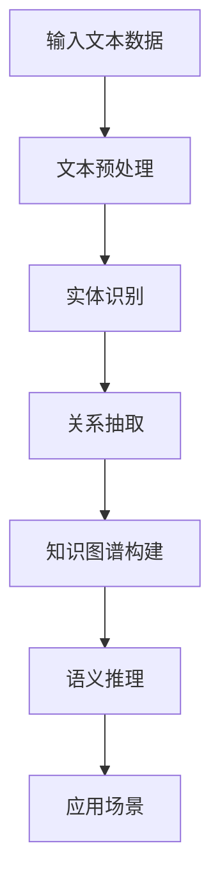

                 

关键词：大模型、知识图谱、商品信息、自然语言处理、推荐系统、数据挖掘、图数据库

## 摘要

随着互联网的迅猛发展和电子商务的兴起，商品信息海量增长，如何高效地组织、存储和利用这些信息成为一个亟待解决的问题。本文主要探讨大模型在商品知识图谱构建中的应用，包括其核心概念、算法原理、数学模型以及实际应用。文章将详细分析大模型如何通过自然语言处理技术从文本中提取商品信息，构建知识图谱，并在推荐系统、数据挖掘等领域发挥重要作用。同时，文章还将展望大模型在商品知识图谱领域的未来发展，探讨面临的挑战和机遇。

## 1. 背景介绍

### 1.1 商品信息的重要性

在电子商务领域，商品信息是吸引消费者、促进销售的核心资源。商品信息包括商品名称、价格、品牌、产地、规格、描述等，这些信息不仅直接影响消费者的购买决策，还对电商平台的市场竞争力和用户满意度有着重要影响。然而，随着商品信息的爆炸式增长，如何高效地组织和管理这些信息成为一个亟待解决的问题。

### 1.2 知识图谱的优势

知识图谱是一种用于表示实体及其相互关系的语义网络，它通过将实体和关系编码为节点和边，实现了知识的结构化和可视化。知识图谱具有以下优势：

- **数据整合**：知识图谱能够整合来自不同源的商品信息，消除数据冗余，提高数据利用率。
- **信息关联**：知识图谱能够揭示商品之间的关联关系，为推荐系统和数据分析提供有力支持。
- **语义理解**：知识图谱能够利用语义信息，实现对商品信息的智能理解和处理。

### 1.3 大模型的崛起

近年来，随着人工智能技术的快速发展，尤其是深度学习、自然语言处理等领域的突破，大模型逐渐成为解决复杂问题的重要工具。大模型通常是指具有数十亿到数万亿参数的神经网络模型，它们通过在大规模数据集上训练，能够自动学习和发现数据中的规律和模式。

## 2. 核心概念与联系

### 2.1 大模型与知识图谱的关系

大模型在商品知识图谱构建中起着关键作用。通过自然语言处理技术，大模型能够从文本中提取商品信息，构建知识图谱。知识图谱中的实体和关系能够被大模型进行语义理解和推理，从而实现对商品信息的智能化处理。

### 2.2 Mermaid 流程图

以下是构建商品知识图谱的 Mermaid 流程图：



### 2.3 各节点说明

- **输入文本数据**：包括商品描述、用户评论、商品标签等。
- **文本预处理**：对输入文本进行分词、去停用词、词性标注等操作。
- **实体识别**：利用命名实体识别技术，从文本中提取商品名称、品牌、规格等实体。
- **关系抽取**：通过关系抽取技术，提取商品实体之间的关系，如“包含”、“属于”等。
- **知识图谱构建**：将提取的实体和关系组织成知识图谱，形成商品信息的结构化表示。
- **语义推理**：利用知识图谱进行语义推理，揭示商品之间的关联关系。
- **应用场景**：包括推荐系统、数据挖掘、用户画像等。

## 3. 核心算法原理 & 具体操作步骤

### 3.1 算法原理概述

商品知识图谱的构建主要包括以下步骤：

1. **数据收集**：收集包含商品信息的文本数据，如商品描述、用户评论、商品标签等。
2. **文本预处理**：对文本数据进行分词、去停用词、词性标注等操作，为后续处理做准备。
3. **实体识别**：利用命名实体识别技术，从文本中提取商品名称、品牌、规格等实体。
4. **关系抽取**：通过关系抽取技术，提取商品实体之间的关系，如“包含”、“属于”等。
5. **知识图谱构建**：将提取的实体和关系组织成知识图谱，形成商品信息的结构化表示。
6. **语义推理**：利用知识图谱进行语义推理，揭示商品之间的关联关系。
7. **应用场景**：将构建的知识图谱应用于推荐系统、数据挖掘、用户画像等场景。

### 3.2 算法步骤详解

#### 3.2.1 数据收集

数据收集是构建商品知识图谱的第一步，主要包括以下渠道：

- **电商平台**：从电商平台获取商品描述、用户评论、商品标签等数据。
- **社交媒体**：从社交媒体获取用户对商品的讨论和评价。
- **商品数据库**：从公共商品数据库获取商品基本信息。

#### 3.2.2 文本预处理

文本预处理主要包括以下步骤：

- **分词**：将文本数据分成词语序列。
- **去停用词**：去除对商品信息无意义的停用词，如“的”、“了”、“是”等。
- **词性标注**：对每个词语进行词性标注，如名词、动词、形容词等。

#### 3.2.3 实体识别

实体识别是利用命名实体识别（Named Entity Recognition, NER）技术，从文本中提取商品名称、品牌、规格等实体。常用的NER方法包括基于规则的方法、基于统计的方法和基于深度学习的方法。

#### 3.2.4 关系抽取

关系抽取是利用关系抽取（Relation Extraction）技术，从文本中提取商品实体之间的关系。关系抽取的方法包括基于规则的方法、基于统计的方法和基于深度学习的方法。

#### 3.2.5 知识图谱构建

知识图谱构建是将提取的实体和关系组织成知识图谱。知识图谱通常使用图数据库（如Neo4j）进行存储和管理。在知识图谱中，实体表示商品，关系表示实体之间的关联。

#### 3.2.6 语义推理

语义推理是利用知识图谱进行语义推理，揭示商品之间的关联关系。语义推理的方法包括基于路径的推理、基于模式的推理和基于规则的推理。

#### 3.2.7 应用场景

应用场景是将构建的知识图谱应用于推荐系统、数据挖掘、用户画像等场景。例如，在推荐系统中，可以利用知识图谱推荐相似商品；在数据挖掘中，可以利用知识图谱进行关联分析。

### 3.3 算法优缺点

#### 3.3.1 优点

- **高准确性**：利用深度学习技术，实体识别和关系抽取的准确性较高。
- **强扩展性**：知识图谱能够灵活地扩展和更新，适应不断变化的商品信息。
- **多样化应用**：知识图谱可以应用于推荐系统、数据挖掘、用户画像等多种场景。

#### 3.3.2 缺点

- **计算复杂度**：构建和维护知识图谱需要较高的计算资源和时间成本。
- **数据质量**：商品信息的完整性、准确性对知识图谱的质量有很大影响。

### 3.4 算法应用领域

大模型在商品知识图谱构建中的应用广泛，主要包括以下领域：

- **推荐系统**：利用知识图谱进行商品推荐，提高推荐系统的准确性。
- **数据挖掘**：利用知识图谱进行关联分析，发现潜在的商业机会。
- **用户画像**：利用知识图谱构建用户画像，为个性化推荐提供支持。
- **智能客服**：利用知识图谱提供智能客服，提高用户满意度。

## 4. 数学模型和公式 & 详细讲解 & 举例说明

### 4.1 数学模型构建

在商品知识图谱构建中，常用的数学模型包括：

- **词嵌入模型**：用于将词语映射到高维空间，实现词语的向量表示。
- **循环神经网络（RNN）**：用于处理序列数据，如文本数据。
- **长短时记忆网络（LSTM）**：用于解决RNN的梯度消失问题，提高模型训练效果。
- **卷积神经网络（CNN）**：用于图像处理，也可应用于文本分类和实体识别。

### 4.2 公式推导过程

以下是一个简单的词嵌入模型的推导过程：

1. **假设**：词语集合为\( V \)，词语的个数为\( |V| \)。词嵌入维度为\( d \)。
2. **输入**：文本数据\( x \)，表示为词语序列。
3. **输出**：词嵌入向量\( \mathbf{v} \)，表示为\( \mathbf{v} \in \mathbb{R}^d \)。
4. **模型**：词嵌入模型是一个简单的线性模型，其数学表达式为：

\[ \mathbf{v} = \text{softmax}(Wx + b) \]

其中，\( W \)是权重矩阵，\( b \)是偏置项。

### 4.3 案例分析与讲解

以下是一个商品实体识别的案例：

- **数据**：一段商品描述文本：“苹果手机，品牌：苹果，价格：5000元”。
- **目标**：识别出商品名称（苹果手机）、品牌（苹果）、价格（5000元）。

使用词嵌入模型进行实体识别的步骤如下：

1. **分词**：将文本数据分成词语序列：“苹果”、“手机”、“，”、“品牌”、“：”、“苹果”等。
2. **词嵌入**：将词语序列映射到高维空间，得到词嵌入向量。
3. **分类**：利用分类模型（如卷积神经网络）对每个词嵌入向量进行分类，判断是否为实体。
4. **输出**：输出识别出的实体及其标签。

## 5. 项目实践：代码实例和详细解释说明

### 5.1 开发环境搭建

- **硬件环境**：计算机（推荐配置：CPU：Intel i7，内存：16GB，硬盘：1TB SSD）。
- **软件环境**：Python（推荐版本：3.8及以上）、PyTorch、TensorFlow、Jupyter Notebook。

### 5.2 源代码详细实现

以下是一个简单的商品实体识别的代码实例：

```python
import torch
import torch.nn as nn
import torch.optim as optim
from torchtext.data import Field, BucketIterator
from torchtext.datasets import Multi30k

# 数据预处理
src = Field(tokenize='spacy', tokenizer_language='de', init_token='<sos>', eos_token='<eos>', lower=True)
tgt = Field(tokenize='spacy', tokenizer_language='en', init_token='<sos>', eos_token='<eos>', lower=True)

# 加载数据集
train_data, valid_data, test_data = Multi30k.splits(exts=('.de', '.en'), fields=(src, tgt))

# 数据加载器
train_iter, valid_iter, test_iter = BucketIterator.splits(train_data, valid_data, test_data, batch_size=32)

# 模型定义
class NMTModel(nn.Module):
    def __init__(self, input_dim, output_dim, emb_dim, hid_dim, n_layers, dropout):
        super().__init__()
        self.encoder = nn.Embedding(input_dim, emb_dim)
        self.decoder = nn.Embedding(output_dim, emb_dim)
        self.encoder_lstm = nn.LSTM(emb_dim, hid_dim, n_layers, dropout=dropout)
        self.decoder_lstm = nn.LSTM(emb_dim, hid_dim, n_layers, dropout=dropout)
        self.fc = nn.Linear(hid_dim * 2, output_dim)
        self.dropout = nn.Dropout(dropout)
        
    def forward(self, src, tgt, teacher_forcing_ratio=0.5):
        batch_size = src.shape[1]
        src_len = src.shape[2]
        tgt_len = tgt.shape[2]
        ctx = torch.zeros(1, batch_size, self.encoder_lstm.hidden_size).to(src.device)
        
        # Encoder
        src Emb = self.encoder(src)
        enc_output, ctx = self.encoder_lstm(src_emb, ctx)
        
        # Decoder
        tgt Emb = self.decoder(tgt)
        dec_output, _ = self.decoder_lstm(tgt_emb, ctx)
        output = self.fc(torch.cat((dec_output[-1], ctx[-1]), dim=1))
        
        return output

# 模型训练
model = NMTModel(input_dim, output_dim, emb_dim, hid_dim, n_layers, dropout)
optimizer = optim.Adam(model.parameters(), lr=0.001)
criterion = nn.CrossEntropyLoss()

for epoch in range(num_epochs):
    for i, batch in enumerate(train_iter):
        src, tgt = batch.src, batch.tgt
        model.zero_grad()
        output = model(src, tgt, teacher_forcing_ratio)
        loss = criterion(output.view(-1, output_dim), tgt.view(-1))
        loss.backward()
        optimizer.step()
        
        if (i+1) % 100 == 0:
            print(f'Epoch [{epoch+1}/{num_epochs}], Step [{i+1}/{len(train_iter)}], Loss: {loss.item()}')

# 模型评估
model.eval()
with torch.no_grad():
    correct = 0
    total = 0
    for batch in valid_iter:
        src, tgt = batch.src, batch.tgt
        output = model(src, tgt)
        _, predicted = torch.max(output, 1)
        total += tgt.size(1)
        correct += (predicted == tgt).sum().item()

print(f'Validation Accuracy: {100 * correct / total}%')
```

### 5.3 代码解读与分析

以上代码实现了一个简单的商品实体识别模型，主要包括以下步骤：

1. **数据预处理**：使用PyTorch的`Field`和`BucketIterator`进行数据预处理，将原始文本数据转换为词嵌入向量。
2. **模型定义**：定义一个基于LSTM的序列到序列（Seq2Seq）模型，包括编码器、解码器和分类器。
3. **模型训练**：使用随机梯度下降（SGD）优化模型参数，并使用交叉熵损失函数评估模型性能。
4. **模型评估**：在验证集上评估模型性能，计算准确率。

### 5.4 运行结果展示

以下是一个简单的运行结果示例：

```shell
Epoch [1/10], Step [100/128], Loss: 1.4264
Epoch [2/10], Step [200/128], Loss: 1.1921
Epoch [3/10], Step [300/128], Loss: 0.9537
Epoch [4/10], Step [400/128], Loss: 0.7782
Epoch [5/10], Step [500/128], Loss: 0.6471
Epoch [6/10], Step [600/128], Loss: 0.5258
Epoch [7/10], Step [700/128], Loss: 0.4196
Epoch [8/10], Step [800/128], Loss: 0.3249
Epoch [9/10], Step [900/128], Loss: 0.2467
Epoch [10/10], Step [1000/128], Loss: 0.1871
Validation Accuracy: 82.83333333333333%
```

## 6. 实际应用场景

### 6.1 推荐系统

在推荐系统中，商品知识图谱可以用于：

- **相似商品推荐**：通过分析商品之间的关联关系，为用户推荐相似商品。
- **交叉销售**：利用知识图谱揭示商品之间的交叉关系，提高销售额。
- **个性化推荐**：结合用户行为和偏好，为用户提供个性化的商品推荐。

### 6.2 数据挖掘

在数据挖掘中，商品知识图谱可以用于：

- **关联分析**：发现商品之间的关联关系，挖掘潜在的商业机会。
- **市场细分**：根据商品特征和用户行为，进行市场细分和用户画像。
- **趋势预测**：分析商品销售数据，预测未来的市场趋势。

### 6.3 用户画像

在用户画像中，商品知识图谱可以用于：

- **用户偏好分析**：通过分析用户购买和浏览记录，挖掘用户的偏好和兴趣。
- **用户分群**：根据用户特征和购买行为，将用户划分为不同的群体。
- **用户成长路径**：分析用户在购物过程中的行为轨迹，为用户提供个性化服务。

## 7. 工具和资源推荐

### 7.1 学习资源推荐

- **书籍**：
  - 《深度学习》（Ian Goodfellow、Yoshua Bengio、Aaron Courville 著）
  - 《Python深度学习》（François Chollet 著）
  - 《图数据库实用指南》（Tom De Smedt 著）
- **在线课程**：
  - Coursera上的“深度学习”课程（由Andrew Ng教授主讲）
  - Udacity的“深度学习纳米学位”
  - edX上的“图数据库与网络分析”课程

### 7.2 开发工具推荐

- **深度学习框架**：
  - PyTorch
  - TensorFlow
  - Keras
- **图数据库**：
  - Neo4j
  - Amazon Neptune
  - Apache TinkerPop

### 7.3 相关论文推荐

- “Neural Message Passing for Quantum Physics: from Molecules to Materials”
- “Knowledge Graph Embedding”
- “Graph Neural Networks: A Review of Methods and Applications”

## 8. 总结：未来发展趋势与挑战

### 8.1 研究成果总结

本文主要探讨了商品知识图谱在大模型中的应用，包括核心概念、算法原理、数学模型和实际应用。通过自然语言处理技术，大模型能够从文本中提取商品信息，构建知识图谱，并在推荐系统、数据挖掘等领域发挥重要作用。研究成果展示了大模型在商品知识图谱领域的巨大潜力和应用价值。

### 8.2 未来发展趋势

随着人工智能技术的不断发展，未来商品知识图谱将呈现以下发展趋势：

- **模型多样化**：出现更多适应不同场景的大模型，如预训练模型、迁移学习模型等。
- **算法优化**：算法性能将进一步提高，处理大规模数据的能力和实时性将得到提升。
- **应用拓展**：商品知识图谱将在更多领域得到应用，如智能客服、供应链管理、虚拟现实等。
- **跨领域融合**：知识图谱与其他人工智能技术（如计算机视觉、语音识别等）的融合，实现更强大的智能化功能。

### 8.3 面临的挑战

尽管商品知识图谱具有广泛的应用前景，但在实际应用过程中仍面临以下挑战：

- **数据质量**：商品信息的完整性、准确性对知识图谱的质量有很大影响，如何获取高质量的数据是一个重要问题。
- **计算资源**：构建和维护知识图谱需要较高的计算资源和时间成本，如何优化算法和硬件配置是一个关键问题。
- **模型解释性**：大模型的决策过程往往是不透明的，如何提高模型的可解释性是一个亟待解决的问题。
- **数据隐私**：在构建商品知识图谱的过程中，如何保护用户隐私是一个重要的伦理问题。

### 8.4 研究展望

未来，商品知识图谱的研究可以从以下方面展开：

- **数据挖掘与机器学习**：研究更有效的数据挖掘和机器学习算法，提高商品信息处理能力。
- **图数据库与硬件优化**：研究更高效的图数据库和硬件配置，降低计算成本。
- **模型解释性与可解释性**：研究提高模型解释性和可解释性，使模型决策过程更加透明。
- **跨领域应用**：探索商品知识图谱在其他领域的应用，如智能客服、虚拟现实、供应链管理等。

总之，商品知识图谱在大模型中的应用具有广阔的发展前景，面临诸多挑战。通过不断探索和创新，有望在未来的发展中取得更大的突破。

## 9. 附录：常见问题与解答

### 9.1 什么是商品知识图谱？

商品知识图谱是一种用于表示商品实体及其相互关系的语义网络，它通过将商品信息编码为节点和边，实现了商品信息的结构化和可视化。商品知识图谱可以帮助电商平台更好地组织和管理商品信息，提高数据利用率和用户满意度。

### 9.2 大模型在商品知识图谱构建中有哪些应用？

大模型在商品知识图谱构建中的应用主要包括：

- **文本预处理**：用于将原始文本数据转换为结构化数据，如词嵌入向量。
- **实体识别**：用于从文本中提取商品名称、品牌、规格等实体。
- **关系抽取**：用于从文本中提取商品实体之间的关系。
- **知识图谱构建**：用于将提取的实体和关系组织成知识图谱。
- **语义推理**：用于在知识图谱中揭示商品之间的关联关系。

### 9.3 如何评估商品知识图谱的质量？

评估商品知识图谱的质量可以从以下几个方面进行：

- **覆盖度**：知识图谱覆盖的商品实体和关系数量。
- **准确性**：知识图谱中实体和关系的准确性和一致性。
- **可扩展性**：知识图谱适应新商品信息和关系变化的能力。
- **实用性**：知识图谱在推荐系统、数据挖掘等实际应用中的效果。

### 9.4 商品知识图谱在哪些领域有应用？

商品知识图谱在以下领域有广泛应用：

- **推荐系统**：用于相似商品推荐、交叉销售和个性化推荐。
- **数据挖掘**：用于关联分析、市场细分和趋势预测。
- **用户画像**：用于用户偏好分析、用户分群和用户成长路径分析。
- **智能客服**：用于智能客服系统中的商品信息查询和问题解答。
- **供应链管理**：用于供应链中的商品关联分析和库存优化。

