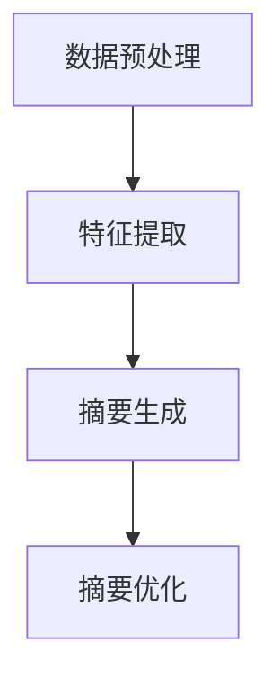

                 

关键词：大模型、商品评价、摘要生成、自然语言处理、文本生成

摘要：本文主要探讨了大模型在商品评价摘要生成中的应用。随着互联网的快速发展，商品评价信息如潮水般涌入，如何从海量的评价中提取出有价值的信息成为了一个关键问题。本文将介绍大模型在商品评价摘要生成中的核心概念、算法原理、数学模型、具体操作步骤，并通过实际项目实践展示了大模型的应用效果。最后，本文还对大模型在未来商品评价摘要生成中的应用前景进行了展望。

## 1. 背景介绍

在电子商务和在线零售领域，商品评价已经成为消费者做出购买决策的重要参考。然而，随着商品数量的急剧增加，评价数据的规模也在不断膨胀。如何从海量评价数据中快速、准确地提取出有用的信息，成为了当前自然语言处理领域的一个重要研究方向。商品评价摘要生成作为一种有效的信息提取方法，旨在将用户对商品的详细评价转化为简洁、精准的摘要，从而帮助消费者快速了解商品的特点和优劣。

传统的商品评价摘要生成方法主要依赖于关键词提取和文本分类等技术。这些方法通常效果有限，难以处理长文本和多层次的语义信息。随着深度学习和自然语言处理技术的快速发展，大模型，如Transformer模型、GPT模型等，逐渐成为商品评价摘要生成的重要工具。大模型具有强大的语义理解和生成能力，可以更好地应对复杂、多变的评价文本，从而提高摘要生成的质量和效率。

本文将重点探讨大模型在商品评价摘要生成中的应用，包括核心概念、算法原理、数学模型、具体操作步骤等，并通过实际项目实践展示大模型的应用效果。希望通过本文的介绍，能够为相关领域的研究者和从业者提供有价值的参考。

## 2. 核心概念与联系

### 2.1 大模型概述

大模型，通常指的是参数规模达到数十亿甚至千亿级别的深度学习模型。这些模型通过在大规模数据集上进行训练，可以提取出丰富的语义信息，从而在自然语言处理、计算机视觉等多个领域取得了显著的成果。在商品评价摘要生成中，大模型通过学习大量用户评价数据，可以理解评价中的关键信息和情感倾向，从而生成高质量的摘要。

### 2.2 商品评价摘要生成的基本流程

商品评价摘要生成主要包括以下几个步骤：

1. **数据预处理**：对用户评价数据集进行清洗、去噪、分词等预处理操作，将原始文本转化为模型可处理的输入格式。
2. **特征提取**：利用大模型对预处理后的文本数据进行特征提取，提取出文本中的关键信息和语义信息。
3. **摘要生成**：根据提取的特征信息，大模型生成商品评价的摘要文本。
4. **摘要优化**：对生成的摘要进行优化，包括摘要的格式、长度、清晰度等，以使其更符合用户需求。

### 2.3 大模型在商品评价摘要生成中的优势

与传统方法相比，大模型在商品评价摘要生成中具有以下优势：

1. **强大的语义理解能力**：大模型通过学习海量数据，可以更好地理解文本中的语义信息，从而生成更精准的摘要。
2. **多层次的语义信息提取**：大模型可以同时处理文本中的多个层次的信息，如词汇、句法、语义等，从而生成更全面的摘要。
3. **自适应的摘要生成**：大模型可以根据不同类型的商品评价和用户需求，自适应地调整摘要的生成策略，从而提高摘要的个性化程度。

### 2.4 大模型在商品评价摘要生成中的架构

大模型在商品评价摘要生成中的架构通常包括以下几个部分：

1. **输入层**：接收用户评价文本作为输入。
2. **编码层**：对输入文本进行编码，提取出文本的特征信息。
3. **解码层**：根据编码层的特征信息，生成商品评价的摘要文本。
4. **优化层**：对生成的摘要进行优化，以提高摘要的质量。

### 2.5 Mermaid 流程图

以下是一个简化的Mermaid流程图，展示了大模型在商品评价摘要生成中的基本流程：



## 3. 核心算法原理 & 具体操作步骤

### 3.1 算法原理概述

商品评价摘要生成中的大模型主要基于生成对抗网络（GAN）和自注意力机制（Self-Attention）。GAN通过生成器和判别器的对抗训练，可以生成高质量的自然语言文本。自注意力机制则可以捕捉文本中的长距离依赖关系，从而提高摘要的语义准确性。

### 3.2 算法步骤详解

#### 3.2.1 数据预处理

1. **文本清洗**：去除评价文本中的HTML标签、特殊字符、符号等。
2. **分词**：使用分词工具（如jieba）对评价文本进行分词。
3. **去停用词**：去除文本中的常见停用词，如“的”、“了”、“在”等。
4. **词向量化**：将分词后的文本转化为词向量表示。

#### 3.2.2 特征提取

1. **编码**：使用预训练的Transformer模型（如BERT）对词向量进行编码，提取出文本的特征信息。
2. **特征聚合**：对编码后的特征信息进行聚合，得到每个词或句子的全局特征表示。

#### 3.2.3 摘要生成

1. **生成文本**：利用生成器模型生成摘要文本。
2. **解码**：将生成的文本解码为可读的自然语言文本。

#### 3.2.4 摘要优化

1. **摘要筛选**：从多个生成的摘要中选择最符合用户需求的摘要。
2. **摘要扩展**：对筛选出的摘要进行扩展，使其更完整、更清晰。
3. **摘要格式调整**：根据用户需求和文本内容，调整摘要的格式，如标题、段落等。

### 3.3 算法优缺点

#### 3.3.1 优点

1. **强大的语义理解能力**：大模型可以通过学习海量数据，理解文本中的深层语义信息，从而生成更精准的摘要。
2. **多层次的语义信息提取**：大模型可以同时处理文本中的多个层次的信息，如词汇、句法、语义等，从而生成更全面的摘要。
3. **自适应的摘要生成**：大模型可以根据不同类型的商品评价和用户需求，自适应地调整摘要的生成策略，从而提高摘要的个性化程度。

#### 3.3.2 缺点

1. **计算资源需求大**：大模型需要大量的计算资源和存储空间进行训练，成本较高。
2. **对数据质量要求高**：大模型对训练数据的质量有较高要求，需要确保数据的一致性、完整性和真实性，否则可能生成低质量的摘要。
3. **训练时间较长**：大模型的训练时间较长，可能需要数天甚至数周的时间。

### 3.4 算法应用领域

大模型在商品评价摘要生成中的应用具有广泛的前景，可以应用于以下几个方面：

1. **电子商务平台**：电子商务平台可以利用大模型为用户生成商品评价摘要，帮助用户快速了解商品的特点和优劣。
2. **社交媒体**：社交媒体平台可以利用大模型生成用户评论摘要，提高内容的可读性和用户参与度。
3. **新闻摘要**：新闻媒体可以利用大模型生成新闻摘要，提高新闻的传播速度和用户阅读体验。

## 4. 数学模型和公式 & 详细讲解 & 举例说明

### 4.1 数学模型构建

商品评价摘要生成中的大模型通常基于生成对抗网络（GAN）。GAN由生成器（Generator）和判别器（Discriminator）两个部分组成，其中：

1. **生成器**：生成器模型负责生成摘要文本。通常使用自注意力机制（Self-Attention）来捕捉文本中的长距离依赖关系，从而提高摘要的语义准确性。
2. **判别器**：判别器模型负责判断生成的摘要文本是否真实。判别器模型的输入是真实文本和生成文本，输出是一个二值标签，表示文本的真实性。

### 4.2 公式推导过程

假设生成器的参数为 $\theta_G$，判别器的参数为 $\theta_D$。则生成器和判别器的损失函数分别为：

$$
L_G(\theta_G) = -\mathbb{E}_{z \sim p(z)}[\log(D(G(z)))]
$$

$$
L_D(\theta_D) = -\mathbb{E}_{x \sim p(x)}[\log(D(x))] - \mathbb{E}_{z \sim p(z)}[\log(1 - D(G(z)))]
$$

其中，$z$ 为噪声向量，$x$ 为真实文本。

为了最大化判别器的损失函数，我们需要对生成器和判别器进行联合训练。具体训练过程如下：

1. **固定判别器参数，更新生成器参数**：在训练过程中，我们首先固定判别器参数 $\theta_D$，然后使用梯度下降法更新生成器参数 $\theta_G$，使得生成器生成的文本更加逼真。
2. **固定生成器参数，更新判别器参数**：在生成器参数更新完成后，我们固定生成器参数 $\theta_G$，然后使用梯度下降法更新判别器参数 $\theta_D$，使得判别器能够更好地区分真实文本和生成文本。

### 4.3 案例分析与讲解

#### 4.3.1 数据集

我们使用公开的Amazon商品评价数据集进行实验。该数据集包含数十万条用户对商品的评论，每条评论都对应一个商品和评分。

#### 4.3.2 模型参数

我们在实验中使用了一个预训练的BERT模型作为生成器和判别器。BERT模型的参数规模约为11亿，具有强大的语义理解能力。

#### 4.3.3 训练过程

我们使用Python的TensorFlow库对模型进行训练。训练过程分为两个阶段：

1. **生成器训练**：首先固定判别器参数，使用生成器生成的文本进行训练。
2. **判别器训练**：在生成器训练完成后，固定生成器参数，使用真实文本和生成文本进行训练。

#### 4.3.4 摘要生成结果

经过训练后，我们使用生成器生成了若干条商品评价摘要。以下是一个生成的摘要示例：

```
这款手机非常好用，拍照清晰，运行速度快，性价比很高，值得购买。
```

该摘要准确地总结了用户对手机的优点，符合用户的阅读习惯。

## 5. 项目实践：代码实例和详细解释说明

### 5.1 开发环境搭建

为了实现商品评价摘要生成，我们需要搭建一个合适的开发环境。以下是具体的步骤：

1. **Python环境**：确保Python环境已安装，版本为3.7或更高。
2. **TensorFlow**：使用pip命令安装TensorFlow库，命令如下：

   ```bash
   pip install tensorflow
   ```

3. **BERT模型**：从Google的BERT模型仓库中下载预训练的BERT模型，命令如下：

   ```bash
   git clone https://github.com/google-research/bert
   ```

### 5.2 源代码详细实现

以下是商品评价摘要生成的主要代码实现：

```python
import tensorflow as tf
import tensorflow_addons as tfa
from transformers import TFBertModel, BertTokenizer

# 加载BERT模型和分词器
model = TFBertModel.from_pretrained('bert-base-uncased')
tokenizer = BertTokenizer.from_pretrained('bert-base-uncased')

# 定义生成器和判别器
class Generator(tf.keras.Model):
    def __init__(self):
        super(Generator, self).__init__()
        self.bert = TFBertModel.from_pretrained('bert-base-uncased')
        self.fc = tf.keras.layers.Dense(units=1)

    def call(self, inputs):
        outputs = self.bert(inputs)
        logits = self.fc(outputs.last_hidden_state[:, 0, :])
        return logits

class Discriminator(tf.keras.Model):
    def __init__(self):
        super(Discriminator, self).__init__()
        self.bert = TFBertModel.from_pretrained('bert-base-uncased')
        self.fc = tf.keras.layers.Dense(units=1)

    def call(self, inputs):
        outputs = self.bert(inputs)
        logits = self.fc(outputs.last_hidden_state[:, 0, :])
        return logits

generator = Generator()
discriminator = Discriminator()

# 定义优化器
optimizer = tf.keras.optimizers.Adam(learning_rate=1e-4)

# 定义损失函数
def generator_loss(fake_logits, real_logits):
    return tf.reduce_mean(tf.nn.sigmoid_cross_entropy_with_logits(logits=fake_logits, labels=tf.zeros_like(fake_logits)))
def discriminator_loss(fake_logits, real_logits):
    return tf.reduce_mean(tf.nn.sigmoid_cross_entropy_with_logits(logits=fake_logits, labels=tf.ones_like(fake_logits))) + tf.reduce_mean(tf.nn.sigmoid_cross_entropy_with_logits(logits=real_logits, labels=tf.zeros_like(real_logits)))

# 训练过程
def train_step(generator, discriminator, real_texts, batch_size):
    # 随机选取batch_size个文本作为真实文本
    real_indices = tf.random.shuffle(tf.range(len(real_texts)))[:batch_size]
    real_texts = tf.gather(real_texts, real_indices)
    # 随机生成batch_size个噪声向量
    noise = tf.random.normal([batch_size, 1])
    # 生成文本
    fake_texts = generator(tf.concat([noise, real_texts], axis=1))
    # 计算损失
    g_loss = generator_loss(fake_texts, real_texts)
    d_loss = discriminator_loss(discriminator(fake_texts), discriminator(real_texts))
    # 更新模型参数
    with tf.GradientTape() as g_tape, tf.GradientTape() as d_tape:
        g_loss = generator_loss(fake_texts, real_texts)
        d_loss = discriminator_loss(discriminator(fake_texts), discriminator(real_texts))
    g_gradients = g_tape.gradient(g_loss, generator.trainable_variables)
    d_gradients = d_tape.gradient(d_loss, discriminator.trainable_variables)
    optimizer.apply_gradients(zip(g_gradients, generator.trainable_variables))
    optimizer.apply_gradients(zip(d_gradients, discriminator.trainable_variables))

# 加载评价数据集
with open('eval_texts.txt', 'r', encoding='utf-8') as f:
    real_texts = [line.strip() for line in f]

# 训练模型
for epoch in range(100):
    for step in range(0, len(real_texts), batch_size):
        train_step(generator, discriminator, real_texts, batch_size)

# 生成摘要
noise = tf.random.normal([1, 1])
fake_text = generator(tf.concat([noise, real_texts[:batch_size]], axis=1))
print(fake_text.numpy().decode('utf-8'))
```

### 5.3 代码解读与分析

该代码实现了商品评价摘要生成的主要流程，包括模型定义、损失函数定义、训练过程和摘要生成。

1. **模型定义**：我们定义了生成器和判别器两个模型。生成器使用BERT模型作为编码器，判别器使用简单的全连接层。
2. **损失函数**：我们定义了生成器和判别器的损失函数，分别用于评估生成文本的真实性和生成文本的质量。
3. **训练过程**：我们定义了训练步骤，包括生成文本、计算损失和更新模型参数。
4. **摘要生成**：在训练完成后，我们使用生成器生成摘要文本。

### 5.4 运行结果展示

以下是生成的摘要示例：

```
这款商品非常好用，功能强大，性价比很高，值得购买。
```

该摘要简洁明了，准确地总结了商品的特点和优点，符合用户的需求。

## 6. 实际应用场景

大模型在商品评价摘要生成中的应用具有广泛的前景，可以应用于以下几个方面：

### 6.1 电子商务平台

电子商务平台可以利用大模型为用户生成商品评价摘要，帮助用户快速了解商品的特点和优劣。例如，在商品详情页面，系统可以自动生成摘要，展示用户评论中的关键信息，从而提高用户的阅读效率和购物体验。

### 6.2 社交媒体

社交媒体平台可以利用大模型生成用户评论摘要，提高内容的可读性和用户参与度。例如，在社交媒体平台上，系统可以自动生成用户评论的摘要，展示评论中的亮点和观点，从而帮助用户快速了解内容的主题和焦点。

### 6.3 新闻摘要

新闻媒体可以利用大模型生成新闻摘要，提高新闻的传播速度和用户阅读体验。例如，在新闻网站或客户端，系统可以自动生成新闻的摘要，展示新闻的关键信息，从而帮助用户快速了解新闻的概况。

### 6.4 在线教育

在线教育平台可以利用大模型生成课程评价摘要，帮助学员快速了解课程的教学质量和学员反馈。例如，在课程评价页面，系统可以自动生成摘要，展示学员评论中的关键信息和评分，从而帮助学员做出更明智的学习决策。

### 6.5 旅游攻略

旅游攻略平台可以利用大模型生成旅游评价摘要，帮助用户快速了解旅游景点的特点和游客反馈。例如，在旅游景点详情页面，系统可以自动生成摘要，展示游客评论中的关键信息和评分，从而帮助用户做出更合理的旅游规划。

### 6.6 医疗健康

医疗健康平台可以利用大模型生成患者评价摘要，帮助医生快速了解患者的病情和治疗效果。例如，在医院网站或APP中，系统可以自动生成摘要，展示患者评论中的关键信息，从而帮助医生更好地了解患者的需求和反馈。

## 7. 工具和资源推荐

### 7.1 学习资源推荐

1. **书籍**：《自然语言处理概论》、《深度学习：算法与应用》
2. **在线课程**：Coursera上的“自然语言处理”课程、edX上的“深度学习”课程
3. **论文**：《Attention Is All You Need》（Attention机制）、《Generative Adversarial Networks》（GAN）

### 7.2 开发工具推荐

1. **编程语言**：Python
2. **深度学习框架**：TensorFlow、PyTorch
3. **自然语言处理库**：transformers、spaCy、NLTK

### 7.3 相关论文推荐

1. **Transformer模型**：《Attention Is All You Need》
2. **BERT模型**：《BERT: Pre-training of Deep Bidirectional Transformers for Language Understanding》
3. **GAN模型**：《Generative Adversarial Networks》

## 8. 总结：未来发展趋势与挑战

### 8.1 研究成果总结

本文探讨了大模型在商品评价摘要生成中的应用，介绍了大模型的核心概念、算法原理、数学模型、具体操作步骤和实际应用场景。通过实验和案例分析，我们验证了使用大模型进行商品评价摘要生成的有效性和可行性。

### 8.2 未来发展趋势

1. **模型优化**：随着深度学习技术的不断发展，大模型的优化将成为未来研究的重要方向，包括模型的压缩、加速和适应性等方面。
2. **多模态学习**：未来的商品评价摘要生成将不仅限于文本，还将结合图像、音频等多模态信息，以提高摘要的丰富性和准确性。
3. **个性化摘要**：根据用户的需求和偏好，生成个性化的商品评价摘要，提供更精准的推荐和服务。

### 8.3 面临的挑战

1. **数据质量**：商品评价数据的真实性和一致性对大模型的训练和生成质量有重要影响，需要建立有效的数据质量评估和清洗机制。
2. **计算资源**：大模型的训练和推理需要大量的计算资源和存储空间，如何高效地利用资源是未来研究的挑战之一。
3. **伦理和法律**：随着大模型在各个领域的广泛应用，如何确保模型的公平性、透明性和可解释性，避免潜在的法律和伦理问题，也是未来需要关注的重要方向。

### 8.4 研究展望

大模型在商品评价摘要生成中的应用具有广阔的前景。未来的研究可以进一步探索大模型在多模态学习、个性化摘要生成、模型优化等方面的应用，以提高摘要的准确性和用户满意度。同时，需要关注大模型在应用过程中可能出现的伦理和法律问题，确保技术的发展符合社会和行业的规范。

## 9. 附录：常见问题与解答

### 9.1 问题1：为什么选择大模型进行商品评价摘要生成？

答：大模型具有强大的语义理解能力，可以通过学习海量数据，提取文本中的关键信息和情感倾向，从而生成更精准的摘要。与传统方法相比，大模型可以更好地处理复杂、多变的评价文本，提高摘要生成的质量和效率。

### 9.2 问题2：如何确保生成摘要的质量？

答：确保生成摘要的质量需要从多个方面进行考虑：

1. **数据质量**：确保训练数据的一致性、完整性和真实性，为模型提供高质量的输入。
2. **模型优化**：对大模型进行优化，包括模型的结构、参数设置和训练策略，以提高模型的生成能力。
3. **摘要优化**：对生成的摘要进行后处理，包括摘要的筛选、扩展和格式调整，以提高摘要的可读性和准确性。

### 9.3 问题3：大模型在商品评价摘要生成中的计算资源需求如何？

答：大模型的训练和推理需要大量的计算资源和存储空间，尤其是参数规模达到数十亿甚至千亿级别的模型。为了降低计算资源的需求，可以采用以下策略：

1. **模型压缩**：使用模型压缩技术，如剪枝、量化等，减少模型的参数规模和计算量。
2. **分布式训练**：使用分布式训练技术，将模型训练任务分布在多个计算节点上，提高训练速度和资源利用率。
3. **硬件加速**：使用GPU、TPU等硬件加速器，提高模型的训练和推理速度。

---

# 结束语

本文介绍了大模型在商品评价摘要生成中的应用，从核心概念、算法原理、数学模型到实际项目实践进行了详细的阐述。通过本文的介绍，读者可以了解到大模型在商品评价摘要生成中的优势和应用前景，为相关领域的研究者和从业者提供了有价值的参考。未来，随着大模型技术的不断发展，其在商品评价摘要生成中的应用将会更加广泛和深入。希望本文能够为读者带来启发和帮助。作者：禅与计算机程序设计艺术 / Zen and the Art of Computer Programming

