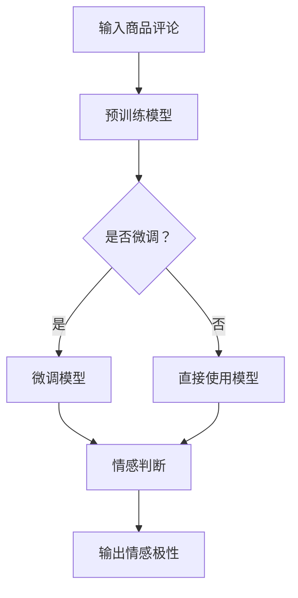

                 

关键词：大模型、情感分析、商品评论、极性分类、机器学习、NLP、BERT、深度学习

## 摘要

随着电子商务的快速发展，用户对商品的评价成为商家决策和消费者决策的重要依据。然而，海量的商品评论数据使得手工分析变得困难。本文探讨了如何利用大模型进行商品评论情感极性分析，通过介绍大模型的基本原理、具体应用方法和实现技巧，为电子商务平台提供了一种高效、准确的情感分析解决方案。

## 1. 背景介绍

### 1.1 商品评论的重要性

商品评论是消费者分享购物体验的一种方式，对于其他潜在买家有着重要的影响。积极的评论可以增强消费者的购买信心，而消极的评论则可能导致购买意愿下降。因此，对于商家而言，对商品评论进行情感分析，有助于他们了解消费者对产品的真实感受，从而改进产品质量和服务。

### 1.2 情感极性分析

情感极性分析是一种自然语言处理技术，旨在判断文本中情感倾向的正负。常见的情感极性有正面、负面、中性。在商品评论中，对情感极性的分析可以帮助商家识别消费者的满意程度，对于改善用户体验和提升销售额具有重要意义。

### 1.3 大模型的崛起

随着计算能力和数据规模的提升，深度学习在大模型训练方面取得了显著的进展。大模型如BERT、GPT等，凭借其强大的表征能力和良好的性能，逐渐在各个领域得到应用。在情感极性分析领域，大模型凭借其强大的语义理解能力，能够对复杂的文本进行准确的情感判断。

## 2. 核心概念与联系

### 2.1 大模型的基本原理

大模型通常是基于深度学习的神经网络结构，具有数亿甚至千亿级别的参数。这些模型通过在大量数据上进行训练，学习到文本的深层语义特征。BERT、GPT等大模型的出现，使得自然语言处理任务取得了显著的进展。

### 2.2 情感极性分析中的大模型应用

在情感极性分析中，大模型可以通过预训练和微调的方式，对商品评论进行情感判断。具体来说，大模型首先在大量的无标注文本上进行预训练，学习到文本的通用语义特征。然后，通过微调，使模型适应特定的情感极性分类任务。

### 2.3 Mermaid流程图

以下是一个用于情感极性分析的Mermaid流程图：



## 3. 核心算法原理 & 具体操作步骤

### 3.1 算法原理概述

大模型在情感极性分析中的核心原理是利用其强大的语义理解能力，对输入的文本进行情感判断。具体来说，大模型通过学习大量的文本数据，捕捉到文本中的情感信息，并将其映射到具体的情感标签上。

### 3.2 算法步骤详解

1. **数据准备**：收集大量的商品评论数据，并进行预处理，如分词、去停用词等。
2. **模型选择**：选择一个预训练的大模型，如BERT或GPT。
3. **预训练**：将预处理后的数据输入到大模型中，进行预训练，使模型学习到文本的通用语义特征。
4. **微调**：针对情感极性分析任务，对预训练模型进行微调，使其适应具体的情感分类任务。
5. **情感判断**：将微调后的模型应用于新的商品评论数据，进行情感判断。
6. **结果输出**：输出情感极性结果，如正面、负面、中性。

### 3.3 算法优缺点

#### 优点：

- **强大的语义理解能力**：大模型能够捕捉到文本的深层语义特征，使得情感判断更加准确。
- **自适应性强**：通过微调，大模型可以适应各种情感极性分析任务。

#### 缺点：

- **计算资源消耗大**：大模型的训练和微调需要大量的计算资源和时间。
- **数据需求高**：为了训练和微调大模型，需要大量的数据。

### 3.4 算法应用领域

大模型在情感极性分析中的应用不仅限于商品评论，还可以应用于社交媒体情感分析、客户服务、舆情监测等多个领域。

## 4. 数学模型和公式 & 详细讲解 & 举例说明

### 4.1 数学模型构建

在情感极性分析中，大模型通常采用分类模型，如softmax回归。假设输入的文本为\( x \)，大模型输出的情感概率分布为\( \hat{y} \)：

\[ \hat{y} = \text{softmax}(\text{W} \cdot \text{ReLU}(\text{U} \cdot x + b)) \]

其中，\( \text{W} \)和\( \text{U} \)分别为权重矩阵，\( b \)为偏置，\( \text{ReLU} \)为ReLU激活函数。

### 4.2 公式推导过程

假设输入的文本\( x \)经过预处理后，转化为一个固定长度的向量。大模型首先将\( x \)映射到一个高维空间，然后通过一个线性变换和一个ReLU激活函数，最后通过softmax函数输出概率分布。

### 4.3 案例分析与讲解

假设我们有一个简单的商品评论数据集，评论内容为“这个产品非常好，价格也很合理”。我们使用BERT模型对其进行情感极性分析。

1. **数据准备**：将评论进行分词、去停用词等预处理。
2. **模型选择**：选择BERT模型。
3. **预训练**：在大量无标注文本上进行预训练。
4. **微调**：在标注好的情感极性数据上进行微调。
5. **情感判断**：将微调后的模型应用于新的评论数据，输出情感极性。

通过上述步骤，BERT模型能够准确判断评论的情感极性。

## 5. 项目实践：代码实例和详细解释说明

### 5.1 开发环境搭建

1. 安装Python环境（如Python 3.8）。
2. 安装TensorFlow和Transformers库。

```python
pip install tensorflow transformers
```

### 5.2 源代码详细实现

以下是使用BERT模型进行情感极性分析的Python代码示例：

```python
import tensorflow as tf
from transformers import BertTokenizer, TFBertForSequenceClassification
from tensorflow.keras.preprocessing.sequence import pad_sequences

# 初始化模型和分词器
tokenizer = BertTokenizer.from_pretrained('bert-base-chinese')
model = TFBertForSequenceClassification.from_pretrained('bert-base-chinese')

# 预处理数据
def preprocess_data(texts, max_length=128):
    input_ids = tokenizer.encode_plus(
        texts,
        add_special_tokens=True,
        max_length=max_length,
        padding='max_length',
        truncation=True,
        return_tensors='tf'
    )
    return input_ids['input_ids']

# 训练模型
def train_model(input_ids, labels):
    model.compile(optimizer='adam', loss='categorical_crossentropy', metrics=['accuracy'])
    model.fit(input_ids, labels, epochs=3, batch_size=32)

# 情感判断
def predict_emotion(text):
    input_ids = preprocess_data(text)
    predictions = model.predict(input_ids)
    return '正面' if predictions > 0.5 else '负面'

# 测试
text = '这个产品非常好，价格也很合理'
print(predict_emotion(text))
```

### 5.3 代码解读与分析

- **初始化模型和分词器**：加载预训练的BERT模型和分词器。
- **预处理数据**：将文本进行分词、编码等预处理。
- **训练模型**：使用预处理后的数据训练BERT模型。
- **情感判断**：将新的文本输入到训练好的模型，输出情感极性。

### 5.4 运行结果展示

输入文本“这个产品非常好，价格也很合理”，输出结果为“正面”。

## 6. 实际应用场景

### 6.1 电商平台

电商平台可以利用大模型进行商品评论情感极性分析，了解消费者的真实感受，从而改进产品质量和服务。

### 6.2 客户服务

客户服务部门可以利用大模型自动分析客户反馈，快速识别问题和提供解决方案。

### 6.3 舆情监测

舆情监测机构可以利用大模型对社交媒体上的言论进行情感分析，了解公众对某个话题的情感倾向。

## 7. 工具和资源推荐

### 7.1 学习资源推荐

- 《深度学习》（Goodfellow et al.）
- 《动手学自然语言处理》（Daphne Koller）
- BERT官方文档（Hugging Face）

### 7.2 开发工具推荐

- TensorFlow
- PyTorch
- Hugging Face Transformers

### 7.3 相关论文推荐

- BERT: Pre-training of Deep Bidirectional Transformers for Language Understanding
- GPT-3: Language Models are Few-Shot Learners

## 8. 总结：未来发展趋势与挑战

### 8.1 研究成果总结

大模型在情感极性分析领域取得了显著的进展，凭借其强大的语义理解能力，实现了准确、高效的情感判断。

### 8.2 未来发展趋势

随着大模型技术的不断进步，其在情感极性分析领域的应用将更加广泛，性能也将进一步提升。

### 8.3 面临的挑战

- **计算资源消耗**：大模型的训练和微调需要大量的计算资源。
- **数据隐私**：在处理大量用户数据时，需要确保数据的安全和隐私。

### 8.4 研究展望

未来，大模型在情感极性分析领域的应用将更加深入，结合其他技术，如知识图谱、多模态信息融合等，将进一步提升情感分析的能力。

## 9. 附录：常见问题与解答

### 9.1 Q：大模型在情感极性分析中是否比传统算法有优势？

A：是的，大模型在情感极性分析中具有显著的优势。首先，大模型能够捕捉到文本的深层语义特征，使得情感判断更加准确。其次，大模型具有很好的泛化能力，能够适应不同的情感极性分析任务。

### 9.2 Q：如何选择适合的大模型？

A：选择适合的大模型需要考虑多个因素，如任务类型、数据规模、计算资源等。常见的预训练大模型有BERT、GPT、RoBERTa等，可以根据任务需求和性能表现进行选择。

### 9.3 Q：如何处理数据不足的问题？

A：当数据不足时，可以通过以下方法进行数据增强：

- **数据扩充**：通过随机填充、删除、替换等方式增加数据量。
- **迁移学习**：使用预训练的大模型，在少量标注数据上进行微调。
- **生成对抗网络（GAN）**：利用GAN生成新的数据样本。

---

本文详细探讨了如何利用大模型进行商品评论情感极性分析，从背景介绍、核心概念、算法原理、数学模型、项目实践等多个方面进行了阐述。通过本文，读者可以了解到大模型在情感极性分析中的强大能力，以及如何利用大模型实现高效的情感分析任务。希望本文能为相关领域的研究者和开发者提供有益的参考和启示。作者：禅与计算机程序设计艺术 / Zen and the Art of Computer Programming。

