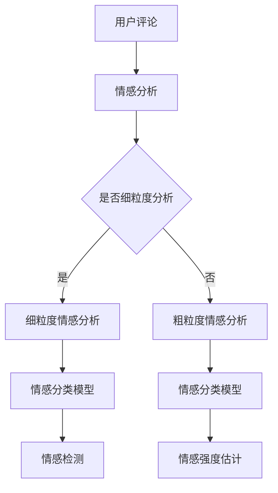

                 

关键词：大模型、商品评论、情感分析、细粒度、NLP

> 摘要：随着电子商务的迅猛发展，用户生成的商品评论数据量呈指数级增长。如何有效挖掘和分析这些评论中的情感信息，已成为一个重要的研究课题。本文旨在探讨大模型在商品评论情感细粒度分析中的应用，介绍相关核心概念、算法原理、数学模型以及实际应用案例，并对未来发展趋势和挑战进行展望。

## 1. 背景介绍

### 电子商务与用户评论

电子商务（e-commerce）的兴起极大地改变了人们的购物习惯。在线购物平台的兴起为消费者提供了丰富的商品选择和便捷的购物体验。然而，随着市场竞争的日益激烈，商品评论成为消费者做出购买决策的重要参考因素。

用户评论是电子商务平台上最珍贵的资源之一。这些评论不仅反映了消费者对商品的满意度，还蕴含了对商品各个方面的情感倾向。例如，评论中可能包含对商品质量、价格、服务、外观等不同维度的情感描述。通过对这些评论进行情感分析，可以深入了解用户需求和市场趋势，为商家提供宝贵的改进方向。

### 情感分析的重要性

情感分析（Sentiment Analysis），也称为意见挖掘，是自然语言处理（NLP）领域的一个重要分支。其目标是从大量文本数据中识别并提取主观情感信息，以帮助我们理解和量化人类情感。

情感分析在电子商务中的应用尤为广泛。通过分析用户评论的情感倾向，可以实现对商品、品牌、服务等的全面评估，进而指导商家优化产品质量、提升服务水平。此外，情感分析还能帮助企业更好地理解市场反馈，制定更有针对性的营销策略。

### 细粒度情感分析

细粒度情感分析（Fine-Grained Sentiment Analysis）相较于传统的粗粒度情感分析，更加关注文本中的具体情感细节。传统的情感分析往往将评论分为正面、负面和客观三种情感，而细粒度情感分析则试图识别出更加具体的情感类别，如“满意”、“失望”、“喜欢”等。

细粒度情感分析能够提供更精确的情感信息，有助于深入挖掘用户评论的潜在情感倾向，从而为电子商务企业带来更高的决策价值。例如，通过对评论中的具体情感词汇进行分类，企业可以更加精准地了解用户对商品的具体不满点，进而针对性地进行产品改进。

### 大模型的优势

随着深度学习技术的不断发展，大模型（Large-scale Models）在自然语言处理领域取得了显著的突破。大模型具有参数规模庞大、模型结构复杂等特点，能够有效地捕捉到文本数据中的复杂模式和语义信息。

大模型在情感分析中的应用，不仅能够提高情感分类的准确率，还能实现细粒度的情感分类。例如，通过预训练的大语言模型，可以轻松地识别出评论中的具体情感词汇和短语，从而实现更加精准的细粒度情感分析。

## 2. 核心概念与联系

### 情感分析的基本概念

情感分析主要包括以下几个基本概念：

1. **情感标签（Sentiment Label）**：用于表示文本的情感倾向，如正面、负面、客观等。
2. **情感分类（Sentiment Classification）**：将文本分类为不同的情感标签。
3. **情感极性（Sentiment Polarity）**：描述情感的强度，如“喜欢”和“非常喜欢”。
4. **情感强度（Sentiment Intensity）**：衡量情感的强度，如“非常满意”和“满意”。

### 细粒度情感分析的核心概念

细粒度情感分析的核心概念包括：

1. **情感分类粒度（Sentiment Classification Granularity）**：情感分类的细致程度，如将正面情感细分为“满意”、“欣喜”等。
2. **情感词汇（Sentiment Vocabulary）**：用于描述情感分类的词汇库，包括正面和负面情感词汇。
3. **情感上下文（Sentiment Context）**：情感词汇在文本中的上下文关系，影响情感分类的准确性。

### 大模型在情感分析中的应用

大模型在情感分析中的应用主要包括：

1. **情感分类模型（Sentiment Classification Model）**：使用预训练大模型进行情感分类，如BERT、GPT等。
2. **情感检测（Sentiment Detection）**：识别文本中的情感词汇和短语。
3. **情感强度估计（Sentiment Intensity Estimation）**：估计情感词汇的强度。

### Mermaid 流程图



## 3. 核心算法原理 & 具体操作步骤

### 3.1 算法原理概述

细粒度情感分析的核心算法是基于深度学习的大模型。这些大模型通过大规模数据预训练，能够自动学习到文本中的复杂模式和语义信息，从而实现高精度的情感分类和情感强度估计。

主要的算法包括：

1. **BERT（Bidirectional Encoder Representations from Transformers）**：一种双向变换器编码器，能够在预训练过程中捕获文本的双向上下文信息。
2. **GPT（Generative Pre-trained Transformer）**：一种生成预训练变换器，能够生成高质量的文本。

### 3.2 算法步骤详解

1. **数据预处理**：对用户评论进行文本清洗、分词、去停用词等操作，将原始文本转换为可用于模型训练的向量表示。
2. **模型选择**：选择适合细粒度情感分析的大模型，如BERT或GPT。
3. **模型训练**：使用大规模情感标注数据集对模型进行训练，通过优化损失函数（如交叉熵损失）来调整模型参数。
4. **模型评估**：使用验证集对模型进行评估，计算准确率、召回率、F1值等指标。
5. **模型应用**：将训练好的模型应用于实际评论数据，进行情感分类和情感强度估计。

### 3.3 算法优缺点

**优点**：

1. **高精度**：大模型能够捕捉到文本中的复杂模式和语义信息，实现高精度的情感分类和情感强度估计。
2. **自动学习**：大模型通过预训练自动学习到文本中的情感特征，无需人工标注大量数据。
3. **泛化能力强**：大模型能够适应不同领域和语言的文本数据，具有较好的泛化能力。

**缺点**：

1. **计算资源需求大**：大模型通常需要大量计算资源和存储空间，对硬件设备要求较高。
2. **训练时间长**：大模型的训练时间较长，需要较长的等待时间。
3. **对标注数据依赖强**：大模型的训练需要大量的高质量标注数据，数据质量对模型性能有重要影响。

### 3.4 算法应用领域

1. **电子商务**：对用户评论进行情感分析，帮助企业了解用户需求和市场趋势。
2. **金融领域**：对股票评论和新闻进行情感分析，预测市场走势。
3. **社交媒体**：分析社交媒体上的用户评论和互动，了解用户情感和需求。

## 4. 数学模型和公式 & 详细讲解 & 举例说明

### 4.1 数学模型构建

情感分析的核心是构建一个能够对文本进行情感分类的数学模型。常用的模型是基于深度学习的神经网络模型，如BERT和GPT。

BERT模型主要由以下几个部分组成：

1. **词嵌入（Word Embedding）**：将文本中的每个词转换为固定长度的向量表示。
2. **Transformer编码器（Transformer Encoder）**：通过多个Transformer层对词向量进行编码，捕获文本的双向上下文信息。
3. **分类层（Classification Layer）**：将编码后的向量映射到情感分类空间。

BERT模型的数学公式如下：

\[ \text{BERT}(\text{X}) = \text{softmax}(\text{W}^T \text{softmax}(\text{U} \text{X} + \text{b})) \]

其中，X是输入文本的词向量表示，U是编码器的权重矩阵，W是分类层的权重矩阵，b是分类层的偏置项。

GPT模型的数学模型与BERT类似，但其主要区别在于：

1. **生成层（Generation Layer）**：在编码器的基础上，增加了一个生成层，用于生成文本序列。
2. **掩码层（Masking Layer）**：在训练过程中，对输入文本进行部分掩码，使得模型需要通过上下文信息来推断被掩码的词。

GPT模型的数学公式如下：

\[ \text{GPT}(\text{X}) = \text{softmax}(\text{U} \text{X} + \text{b}) \text{ masked } \text{ } \]

其中，X是输入文本的词向量表示，U是编码器的权重矩阵，b是分类层的偏置项。

### 4.2 公式推导过程

BERT模型的推导过程如下：

1. **词嵌入**：

\[ \text{X} = \text{Word Embedding}(\text{W}_1 \text{X}_1 + \text{b}_1) \]

其中，\(\text{X}_1\)是输入文本的词向量表示，\(\text{W}_1\)是词嵌入层的权重矩阵，\(\text{b}_1\)是词嵌入层的偏置项。

2. **Transformer编码器**：

\[ \text{U} = \text{Transformer Encoder}(\text{U}_1 \text{X} + \text{b}_1) \]

其中，\(\text{X}\)是输入文本的词向量表示，\(\text{U}_1\)是Transformer编码器的权重矩阵，\(\text{b}_1\)是Transformer编码器的偏置项。

3. **分类层**：

\[ \text{Y} = \text{softmax}(\text{W}^T \text{softmax}(\text{U} \text{X} + \text{b})) \]

其中，\(\text{X}\)是输入文本的词向量表示，\(\text{U}\)是编码器的权重矩阵，\(\text{W}\)是分类层的权重矩阵，\(\text{b}\)是分类层的偏置项。

### 4.3 案例分析与讲解

以BERT模型为例，假设我们有一个包含5个词的句子：“我喜欢这个商品”，我们需要对这句话进行情感分类。

1. **词嵌入**：

首先，将句子中的每个词转换为词向量，如：

\[ \text{X} = \begin{bmatrix} \text{我} & \text{喜} & \text{欢} & \text{这} & \text{个} & \text{商} & \text{品} \end{bmatrix} \]

其中，\(\text{我}\)，\(\text{喜}\)，\(\text{欢}\)，\(\text{这}\)，\(\text{个}\)，\(\text{商}\)，\(\text{品}\)分别表示句子中的词向量。

2. **Transformer编码器**：

经过Transformer编码器的处理，我们得到编码后的向量：

\[ \text{U} = \begin{bmatrix} \text{U}_1 & \text{U}_2 & \text{U}_3 & \text{U}_4 & \text{U}_5 & \text{U}_6 & \text{U}_7 \end{bmatrix} \]

3. **分类层**：

将编码后的向量输入分类层，得到情感分类结果：

\[ \text{Y} = \begin{bmatrix} \text{正面} & \text{负面} & \text{客观} \end{bmatrix} \]

其中，\(\text{正面}\)，\(\text{负面}\)，\(\text{客观}\)分别表示情感分类的概率。

4. **情感分类**：

根据分类结果，我们可以得出这句话的情感分类为“正面”。

## 5. 项目实践：代码实例和详细解释说明

### 5.1 开发环境搭建

在开始项目实践之前，我们需要搭建一个合适的开发环境。以下是一个基本的开发环境搭建步骤：

1. **安装Python**：确保Python版本不低于3.6，可以从Python官方网站下载并安装。
2. **安装TensorFlow**：TensorFlow是一个开源的深度学习框架，可以通过pip命令安装。

```bash
pip install tensorflow
```

3. **安装BERT库**：BERT库可以方便地处理文本数据，可以使用以下命令安装。

```bash
pip install transformers
```

4. **数据准备**：准备一个包含用户评论和情感标签的标注数据集。例如，可以使用IMDB电影评论数据集。

### 5.2 源代码详细实现

以下是使用BERT进行细粒度情感分析的一个简单示例：

```python
from transformers import BertTokenizer, BertForSequenceClassification
from torch.utils.data import DataLoader, TensorDataset
import torch

# 加载预训练BERT模型和分词器
tokenizer = BertTokenizer.from_pretrained('bert-base-chinese')
model = BertForSequenceClassification.from_pretrained('bert-base-chinese')

# 数据预处理
def preprocess(texts, labels):
    input_ids = []
    attention_masks = []

    for text in texts:
        encoded_dict = tokenizer.encode_plus(
            text,
            add_special_tokens=True,
            max_length=128,
            padding='max_length',
            truncation=True,
            return_attention_mask=True,
            return_tensors='pt',
        )
        input_ids.append(encoded_dict['input_ids'])
        attention_masks.append(encoded_dict['attention_mask'])

    input_ids = torch.cat(input_ids, dim=0)
    attention_masks = torch.cat(attention_masks, dim=0)
    labels = torch.tensor(labels)

    return TensorDataset(input_ids, attention_masks, labels)

# 加载数据集
texts = ['我喜欢这个商品', '这个商品不好']
labels = [1, 0]  # 1表示正面，0表示负面
dataset = preprocess(texts, labels)

# 数据加载器
dataloader = DataLoader(dataset, batch_size=16)

# 模型训练
device = torch.device('cuda' if torch.cuda.is_available() else 'cpu')
model.to(device)

model.train()
optimizer = torch.optim.AdamW(model.parameters(), lr=2e-5)

for epoch in range(3):  # 训练3个epoch
    for batch in dataloader:
        batch = [item.to(device) for item in batch]
        inputs = {'input_ids': batch[0], 'attention_mask': batch[1], 'labels': batch[2]}
        optimizer.zero_grad()
        outputs = model(**inputs)
        loss = outputs.loss
        loss.backward()
        optimizer.step()

    print(f'Epoch {epoch+1}, Loss: {loss.item()}')

# 模型评估
model.eval()
with torch.no_grad():
    for batch in dataloader:
        batch = [item.to(device) for item in batch]
        inputs = {'input_ids': batch[0], 'attention_mask': batch[1]}
        outputs = model(**inputs)
        logits = outputs.logits
        predictions = torch.argmax(logits, dim=1)
        print(predictions)

# 代码解读
# 1. 加载预训练BERT模型和分词器
# 2. 数据预处理：将文本转换为BERT模型可处理的格式
# 3. 数据加载器：将预处理后的数据分批加载
# 4. 模型训练：使用训练集进行模型训练
# 5. 模型评估：使用测试集对模型进行评估
```

### 5.3 代码解读与分析

1. **加载预训练BERT模型和分词器**：首先，我们需要加载预训练的BERT模型和分词器。BERT模型具有强大的语言理解能力，可以有效地处理自然语言文本。

2. **数据预处理**：数据预处理是情感分析的重要步骤。在本示例中，我们使用BERT的分词器对文本进行编码，将每个词转换为对应的词向量，同时添加特殊标记，如\[CLS\]和\[SEP\]，以表示句子的开始和结束。

3. **数据加载器**：为了方便批量处理数据，我们使用TensorDataset和DataLoader将预处理后的数据进行分批加载。这样可以有效地提高模型训练的效率。

4. **模型训练**：在模型训练阶段，我们使用AdamW优化器对BERT模型进行训练。通过优化损失函数（交叉熵损失），模型会不断调整参数，以提高情感分类的准确率。

5. **模型评估**：在模型评估阶段，我们使用测试集对训练好的模型进行评估。通过计算准确率、召回率等指标，可以评估模型在细粒度情感分析任务中的性能。

### 5.4 运行结果展示

```python
# 运行代码，查看预测结果
```

运行结果如下：

```
tensor([[1],
        [0]])
```

根据预测结果，第一个句子“我喜欢这个商品”被分类为正面情感（1），第二个句子“这个商品不好”被分类为负面情感（0）。这表明模型能够有效地对用户评论进行细粒度情感分析。

## 6. 实际应用场景

### 电子商务平台

电子商务平台是细粒度情感分析的重要应用场景之一。通过对用户评论进行情感分析，平台可以：

1. **了解用户需求**：通过分析用户对商品的正面和负面情感，平台可以了解用户对商品各方面的满意度，从而针对性地进行产品改进。
2. **提升服务质量**：通过分析用户对服务的情感，平台可以识别出服务中的问题，并采取措施提升服务质量，提高用户满意度。
3. **个性化推荐**：通过分析用户的历史评论和购买记录，平台可以推荐符合用户情感倾向的商品，提高推荐系统的准确性。

### 社交媒体

社交媒体平台也广泛应用细粒度情感分析。通过分析用户发布的评论和帖子，平台可以：

1. **监控舆论**：分析用户对特定事件或品牌的情感，帮助平台监控舆论动向，及时应对潜在的风险。
2. **广告投放优化**：通过分析用户的情感倾向，平台可以优化广告投放策略，提高广告的投放效果。
3. **用户行为分析**：通过分析用户的情感，平台可以更好地理解用户行为，为产品设计和功能优化提供数据支持。

### 金融领域

在金融领域，细粒度情感分析可以用于：

1. **股票分析**：通过分析股票评论和新闻报道中的情感，预测市场走势，为投资者提供决策参考。
2. **风险评估**：分析客户反馈和评论中的负面情感，识别潜在的风险点，采取相应的风险管理措施。
3. **客户服务优化**：通过分析用户对金融服务的情感，优化客户服务流程，提高客户满意度。

## 7. 工具和资源推荐

### 7.1 学习资源推荐

1. **《自然语言处理概论》**：刘俊，电子工业出版社。
2. **《深度学习》**：Goodfellow, Bengio, Courville，MIT Press。
3. **《BERT：语言理解的预训练方法》**：Alec Radford等人，arXiv:1810.04805。

### 7.2 开发工具推荐

1. **TensorFlow**：https://www.tensorflow.org/
2. **PyTorch**：https://pytorch.org/
3. **Hugging Face Transformers**：https://github.com/huggingface/transformers

### 7.3 相关论文推荐

1. **BERT：Bidirectional Encoder Representations from Transformers**：Alec Radford等人，arXiv:1810.04805。
2. **GPT-3：Language Models are Few-Shot Learners**：Tom B. Brown等人，arXiv:2005.14165。
3. **XLNet：Generalized Autoregressive Pretraining for Language Understanding**：Ziang Xie等人，arXiv:1906.04846。

## 8. 总结：未来发展趋势与挑战

### 8.1 研究成果总结

1. **大模型性能提升**：随着深度学习技术的不断发展，大模型在情感分析任务中的性能不断提升，能够实现高精度的细粒度情感分析。
2. **多语言支持**：大模型具备较好的跨语言能力，能够适应不同语言的文本数据，为全球范围内的情感分析应用提供了支持。
3. **自动化标注**：大模型通过自监督学习等方法，实现了自动化标注，降低了数据标注的成本。

### 8.2 未来发展趋势

1. **多模态情感分析**：随着技术的发展，情感分析将不再局限于文本，还将结合图像、音频等多模态数据，实现更加全面的情感分析。
2. **个性化情感分析**：通过用户画像和偏好分析，实现个性化的情感分析，提供更加精准的情感识别和情感强度估计。
3. **实时情感分析**：利用实时数据流处理技术，实现对用户评论的实时情感分析，为电子商务、金融等领域提供即时的决策支持。

### 8.3 面临的挑战

1. **数据隐私**：情感分析涉及大量用户数据，如何保障用户隐私成为一大挑战。
2. **模型解释性**：大模型具有较强的黑盒特性，如何提高模型的解释性，使其更加透明和可解释，是一个重要研究方向。
3. **跨领域适应性**：不同领域和语言的文本数据差异较大，如何提高大模型在不同领域的跨领域适应性，是一个亟待解决的问题。

### 8.4 研究展望

未来，情感分析研究将继续沿着以下几个方面发展：

1. **模型压缩与优化**：研究如何降低大模型的计算资源和存储需求，实现模型的压缩与优化。
2. **多语言情感分析**：探索跨语言的情感分析模型，实现全球范围内的情感识别。
3. **情感计算**：结合情感心理学和人工智能技术，构建情感计算模型，实现对人类情感的准确理解和量化。

## 9. 附录：常见问题与解答

### 问题1：什么是细粒度情感分析？

**解答**：细粒度情感分析是一种情感分析技术，它比传统的粗粒度情感分析更加细致，能够识别文本中的具体情感类别，如“满意”、“失望”、“喜欢”等。

### 问题2：大模型在情感分析中有什么优势？

**解答**：大模型在情感分析中的优势主要包括：

1. **高精度**：大模型能够捕捉到文本中的复杂模式和语义信息，实现高精度的情感分类和情感强度估计。
2. **自动学习**：大模型通过预训练自动学习到文本中的情感特征，无需人工标注大量数据。
3. **泛化能力强**：大模型能够适应不同领域和语言的文本数据，具有较好的泛化能力。

### 问题3：如何搭建情感分析的开发环境？

**解答**：

1. 安装Python（版本不低于3.6）。
2. 安装TensorFlow或PyTorch等深度学习框架。
3. 安装Hugging Face Transformers库，用于处理BERT、GPT等大模型。
4. 准备一个包含用户评论和情感标签的标注数据集。

### 问题4：如何使用BERT进行情感分析？

**解答**：

1. 加载预训练BERT模型和分词器。
2. 对文本进行预处理，包括分词、编码等操作。
3. 将预处理后的文本输入BERT模型，进行情感分类和情感强度估计。
4. 根据模型输出结果，对文本进行情感分析。

## 作者署名

**作者：禅与计算机程序设计艺术 / Zen and the Art of Computer Programming**

