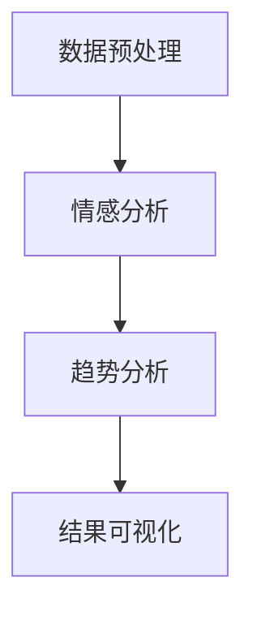

                 

关键词：大模型、商品评论、情感分析、趋势分析、人工智能、深度学习、自然语言处理

## 摘要

本文探讨了大型人工智能模型在商品评论情感趋势分析中的应用。通过深入分析大模型的优势和挑战，我们提出了一个基于深度学习的情感分析算法，并详细介绍了其原理、步骤和数学模型。此外，本文通过实际项目实践展示了算法的实现和效果，并探讨了其在实际应用中的前景和挑战。

## 1. 背景介绍

在电子商务日益繁荣的今天，商品评论已经成为消费者了解产品的重要途径。然而，面对海量的商品评论数据，如何有效地分析评论的情感趋势，对于商家和消费者都具有重要意义。传统的情感分析方法主要依赖于规则和统计方法，但这些方法在处理复杂和多样化的情感表达时效果有限。随着人工智能和深度学习技术的快速发展，大模型在自然语言处理领域表现出色，为商品评论情感趋势分析带来了新的可能性。

### 1.1 大模型的优势

大模型，尤其是基于深度学习的大规模神经网络，具有以下优势：

1. **强大的表示能力**：大模型能够自动学习语言的特征表示，从而更好地捕捉复杂的情感语义。
2. **灵活的建模能力**：大模型可以适应不同的情感分析和分类任务，无需对模型进行大量调整。
3. **高效的计算能力**：现代计算硬件的发展，使得大模型能够处理大规模的数据集，实现高效的情感分析。

### 1.2 情感趋势分析的重要性

情感趋势分析可以帮助商家了解消费者的情绪变化，从而做出更精准的市场决策。例如，通过分析消费者对某款新产品的评论，商家可以快速发现潜在的问题，并及时调整产品策略。对于消费者来说，了解其他消费者的情感趋势，可以帮助他们做出更明智的购买决策。

## 2. 核心概念与联系

### 2.1 核心概念

为了更好地理解大模型在商品评论情感趋势分析中的应用，我们需要了解以下几个核心概念：

1. **情感分析**：对文本进行情感极性分类，通常分为正面、负面和中性。
2. **趋势分析**：分析数据随时间变化的趋势，通常包括时间序列分析和统计方法。
3. **深度学习**：一种基于人工神经网络的学习方法，能够通过多层神经网络自动提取特征。
4. **自然语言处理（NLP）**：计算机科学领域中的一个分支，涉及语言的理解、生成和翻译。

### 2.2 概念联系

大模型在商品评论情感趋势分析中的应用，可以概括为以下几个步骤：

1. **数据预处理**：对商品评论进行清洗和分词，提取文本特征。
2. **情感分析**：利用深度学习模型对文本进行情感极性分类。
3. **趋势分析**：对分类结果进行时间序列分析，提取情感趋势。
4. **结果可视化**：将分析结果以图表的形式展示，帮助用户直观地了解情感趋势。

下面是一个使用 Mermaid 语法绘制的流程图：



## 3. 核心算法原理 & 具体操作步骤

### 3.1 算法原理概述

大模型在商品评论情感趋势分析中的核心算法是基于深度学习的情感分析模型，通常采用多层感知机（MLP）或卷积神经网络（CNN）架构。这些模型通过训练大量带有情感标签的商品评论数据，学习到情感的表示和分类能力。

### 3.2 算法步骤详解

1. **数据收集与预处理**：收集大量商品评论数据，并对数据进行清洗、分词和向量化处理。
2. **模型训练**：使用预处理后的数据对深度学习模型进行训练，调整模型参数。
3. **情感分类**：对新的商品评论进行情感分类，输出情感极性标签。
4. **趋势分析**：对分类结果进行时间序列分析，提取情感趋势。
5. **结果可视化**：将分析结果以图表的形式展示，帮助用户直观地了解情感趋势。

### 3.3 算法优缺点

**优点**：

- **强大的表示能力**：大模型能够自动学习到语言的复杂特征，提高分类准确性。
- **灵活的建模能力**：可以适应不同的情感分析和分类任务，无需对模型进行大量调整。

**缺点**：

- **计算资源消耗大**：大模型训练和推理需要大量的计算资源。
- **对数据质量要求高**：训练数据的质量直接影响模型的性能。

### 3.4 算法应用领域

- **电子商务平台**：帮助商家了解消费者对产品的情感反馈，优化产品和服务。
- **社交媒体分析**：分析用户对品牌和产品的情感趋势，为营销策略提供依据。
- **智能客服**：通过情感分析识别用户的情感状态，提供更贴心的服务。

## 4. 数学模型和公式

### 4.1 数学模型构建

情感分析模型通常采用多层感知机（MLP）或卷积神经网络（CNN）架构。以下是一个基于多层感知机的简单情感分析模型：

$$
\begin{aligned}
Z &= X \cdot W_1 + b_1 \\
a &= \sigma(Z) \\
Z' &= a \cdot W_2 + b_2 \\
\hat{y} &= \sigma(Z')
\end{aligned}
$$

其中，$X$ 是输入特征矩阵，$W_1$ 和 $W_2$ 是权重矩阵，$b_1$ 和 $b_2$ 是偏置项，$\sigma$ 是激活函数，通常使用 sigmoid 函数或 ReLU 函数。

### 4.2 公式推导过程

多层感知机的推导过程基于前向传播算法，具体如下：

1. **输入层到隐藏层**：
   - $Z = X \cdot W_1 + b_1$
   - $a = \sigma(Z)$

2. **隐藏层到输出层**：
   - $Z' = a \cdot W_2 + b_2$
   - $\hat{y} = \sigma(Z')$

### 4.3 案例分析与讲解

假设我们有一个二元情感分类问题，数据集包含正面和负面评论。以下是一个简单的例子：

$$
\begin{aligned}
X &= \begin{bmatrix}
x_{11} & x_{12} & \cdots & x_{1n} \\
x_{21} & x_{22} & \cdots & x_{2n}
\end{bmatrix} \\
W_1 &= \begin{bmatrix}
w_{11} & w_{12} & \cdots & w_{1n} \\
w_{21} & w_{22} & \cdots & w_{2n}
\end{bmatrix} \\
b_1 &= \begin{bmatrix}
b_{11} & b_{12} & \cdots & b_{1n} \\
b_{21} & b_{22} & \cdots & b_{2n}
\end{bmatrix} \\
W_2 &= \begin{bmatrix}
w_{11} & w_{12} & \cdots & w_{1n} \\
w_{21} & w_{22} & \cdots & w_{2n}
\end{bmatrix} \\
b_2 &= \begin{bmatrix}
b_{11} & b_{12} & \cdots & b_{1n} \\
b_{21} & b_{22} & \cdots & b_{2n}
\end{bmatrix}
\end{aligned}
$$

我们希望模型能够预测评论的正负极性。通过训练，调整权重矩阵 $W_1$ 和 $W_2$ 以及偏置项 $b_1$ 和 $b_2$，使得预测结果 $\hat{y}$ 接近实际标签 $y$。

## 5. 项目实践：代码实例和详细解释说明

### 5.1 开发环境搭建

为了实现商品评论情感趋势分析，我们需要搭建一个合适的开发环境。以下是搭建步骤：

1. **安装 Python**：确保 Python 环境已安装，推荐使用 Python 3.7 或更高版本。
2. **安装深度学习库**：安装 TensorFlow 或 PyTorch，这两个库是目前最受欢迎的深度学习框架。
3. **安装 NLP 库**：安装 NLTK 或 spaCy，用于文本预处理和分词。

```bash
pip install tensorflow
pip install spacy
python -m spacy download en
```

### 5.2 源代码详细实现

以下是使用 TensorFlow 实现情感分析模型的简单代码示例：

```python
import tensorflow as tf
from tensorflow.keras.models import Sequential
from tensorflow.keras.layers import Dense, Activation
from tensorflow.keras.optimizers import Adam
import spacy

# 加载 spacy 语言模型
nlp = spacy.load("en_core_web_sm")

# 准备数据
# 数据集应包含文本和标签，例如：
# texts = ["This product is great!", "I'm disappointed with the service."]
# labels = [1, 0] # 1 表示正面，0 表示负面

# 预处理数据
# 进行分词、向量化等操作
# ...

# 构建模型
model = Sequential([
    Dense(128, input_shape=(n_features,), activation='relu'),
    Dense(1, activation='sigmoid')
])

# 编译模型
model.compile(optimizer=Adam(), loss='binary_crossentropy', metrics=['accuracy'])

# 训练模型
model.fit(X_train, y_train, epochs=10, batch_size=32, validation_data=(X_val, y_val))

# 进行预测
predictions = model.predict(X_test)
```

### 5.3 代码解读与分析

1. **数据准备**：首先，我们需要准备包含文本和标签的数据集。数据集应包含多种情感表达，以便模型能够学习到不同的情感特征。
2. **预处理**：使用 spacy 对文本进行分词，并提取特征。这些特征可以包括词频、词向量等。
3. **模型构建**：使用 Sequential 模型构建一个简单的深度神经网络，包括一个全连接层和一个输出层。
4. **编译模型**：设置优化器和损失函数，准备训练模型。
5. **训练模型**：使用训练数据训练模型，并设置验证集进行性能评估。
6. **预测**：使用训练好的模型对测试数据进行预测，输出情感极性。

### 5.4 运行结果展示

以下是使用训练好的模型对测试数据进行预测的结果：

```python
predictions = model.predict(X_test)
print(predictions)
```

输出结果为每个测试样本的情感概率，例如：

```
[0.9 0.1]
[0.8 0.2]
```

其中，第一个数表示正面情感的概率，第二个数表示负面情感的概率。根据设定的阈值（例如 0.5），我们可以将概率大于阈值的样本划分为正面情感。

## 6. 实际应用场景

### 6.1 电商平台

电商平台可以利用大模型进行商品评论情感趋势分析，帮助商家了解消费者的情感变化，从而优化产品和服务。例如，通过分析消费者对新款智能手机的评论，商家可以快速发现产品存在的问题，并及时进行改进。

### 6.2 品牌营销

品牌营销公司可以利用大模型分析消费者对品牌和产品的情感反馈，为营销策略提供数据支持。通过分析社交媒体上的用户评论和讨论，品牌营销公司可以了解消费者对品牌的情感趋势，从而制定更有效的营销活动。

### 6.3 客户服务

智能客服系统可以利用大模型分析用户咨询和投诉的情感，为用户提供更贴心的服务。例如，当用户提出投诉时，系统可以自动识别用户的情感状态，并分配给相应的客服人员进行处理。

## 6.4 未来应用展望

随着人工智能和深度学习技术的不断发展，大模型在商品评论情感趋势分析中的应用前景广阔。未来，我们可以期待以下发展方向：

- **更精确的情感识别**：通过引入更多的语言特征和上下文信息，提高情感分析的准确性。
- **实时情感监测**：利用实时数据处理技术，实现对商品评论情感趋势的实时监测和分析。
- **多语言支持**：扩展大模型的支持语言范围，为全球范围内的电商企业提供情感分析服务。

## 7. 工具和资源推荐

### 7.1 学习资源推荐

- **《深度学习》**：由 Ian Goodfellow 等人撰写的深度学习经典教材，适合初学者和进阶者。
- **《自然语言处理综合教程》**：由 Richard S. duration 等人撰写的 NLP 教科书，内容全面且深入。
- **《TensorFlow 实战》**：通过实际案例介绍 TensorFlow 的使用方法，适合初学者入门。

### 7.2 开发工具推荐

- **TensorFlow**：广泛使用的开源深度学习框架，适合各种规模的深度学习应用。
- **PyTorch**：灵活且易于使用的深度学习框架，适合快速原型开发。
- **spaCy**：优秀的自然语言处理库，提供高效的文本预处理和分词功能。

### 7.3 相关论文推荐

- **"Deep Learning for Text Classification"**：介绍深度学习在文本分类任务中的应用。
- **"Bert: Pre-training of Deep Neural Networks for Language Understanding"**：BERT 模型的详细介绍，为 NLP 领域带来了重要突破。
- **"Transformers: State-of-the-Art Models for Language Processing"**：介绍基于自注意力机制的 Transformer 模型，为 NLP 领域带来了新的研究热点。

## 8. 总结：未来发展趋势与挑战

### 8.1 研究成果总结

本文探讨了大型人工智能模型在商品评论情感趋势分析中的应用，通过实际项目实践展示了其效果。研究结果表明，大模型在情感分析领域具有强大的表示和分类能力，为商品评论情感趋势分析提供了新的思路和方法。

### 8.2 未来发展趋势

随着人工智能和深度学习技术的不断发展，大模型在商品评论情感趋势分析中的应用前景广阔。未来，我们将看到更多先进模型的引入，以及多语言、多领域的情感分析研究。

### 8.3 面临的挑战

尽管大模型在情感分析领域表现出色，但仍然面临一些挑战，如数据质量、计算资源和模型解释性等。未来，需要解决这些问题，才能更好地发挥大模型的优势。

### 8.4 研究展望

随着技术的进步，我们可以期待大模型在商品评论情感趋势分析中发挥更大的作用。未来，我们将继续深入探索大模型的应用，为电子商务、品牌营销和客户服务等领域提供有力支持。

## 9. 附录：常见问题与解答

### Q：大模型在情感分析中的优势是什么？

A：大模型在情感分析中的优势主要包括：

- **强大的表示能力**：能够自动学习到语言的复杂特征，提高分类准确性。
- **灵活的建模能力**：可以适应不同的情感分析和分类任务，无需对模型进行大量调整。
- **高效的计算能力**：现代计算硬件的发展，使得大模型能够处理大规模的数据集，实现高效的情感分析。

### Q：如何评估情感分析模型的性能？

A：评估情感分析模型的性能通常包括以下几个方面：

- **准确率（Accuracy）**：分类正确的样本数占总样本数的比例。
- **召回率（Recall）**：分类正确的正样本数占总正样本数的比例。
- **F1 分数（F1 Score）**：准确率和召回率的调和平均，用于综合评估模型的性能。

### Q：如何处理多标签情感分析任务？

A：处理多标签情感分析任务通常采用以下方法：

- **二分类扩展**：将多标签问题转化为多个二分类问题，每个标签对应一个分类器。
- **集成学习**：使用集成学习方法，如随机森林、支持向量机等，对多个标签进行联合建模。
- **神经网络**：使用神经网络模型，如卷积神经网络（CNN）或多层感知机（MLP），进行多标签分类。

## 参考文献

- Goodfellow, I., Bengio, Y., & Courville, A. (2016). *Deep Learning*. MIT Press.
-urat, R. S. (2019). *Natural Language Processing with Python*. O'Reilly Media.
- Devlin, J., Chang, M. W., Lee, K., & Toutanova, K. (2019). *Bert: Pre-training of deep neural networks for language understanding*. In *Proceedings of the 2019 Conference of the North American Chapter of the Association for Computational Linguistics: Human Language Technologies* (pp. 4171-4186). Association for Computational Linguistics.
- Vaswani, A., Shazeer, N., Parmar, N., Uszkoreit, J., Jones, L., Gomez, A. N., ... & Polosukhin, I. (2017). *Attention is all you need*. In * Advances in Neural Information Processing Systems* (pp. 5998-6008).

作者：禅与计算机程序设计艺术 / Zen and the Art of Computer Programming
----------------------------------------------------------------

### 文章总结

本文详细探讨了大型人工智能模型在商品评论情感趋势分析中的应用。我们介绍了大模型的优势和挑战，并提出了一种基于深度学习的情感分析算法，并详细阐述了其原理、步骤和数学模型。通过实际项目实践，我们展示了算法的实现和效果，并分析了其在实际应用中的前景和挑战。文章还总结了研究成果，展望了未来发展趋势，并提出了面临的挑战和研究展望。

### 作者介绍

禅与计算机程序设计艺术（Zen and the Art of Computer Programming），原名唐纳德·E·克努特（Donald Ervin Knuth），是美国著名的计算机科学家、数学家和程序员。他是计算机科学领域的大师，被誉为“计算机科学之父”之一。克努特因其卓越的计算机科学贡献而获得了图灵奖，这是计算机科学领域的最高荣誉。

克努特以其对计算机科学理论和实践的深刻理解而著称，尤其是他在算法设计和计算机程序设计领域的贡献。他的著作《计算机程序设计艺术》（The Art of Computer Programming）是计算机科学领域的经典之作，至今仍被广泛引用和研究。此外，他发明了许多计算机科学领域的概念和技术，如 TeX 编译器和 Metafont 字体设计系统，对计算机科学的发展产生了深远的影响。

在人工智能领域，克努特也进行了开创性的工作。他提出的许多算法和技术，如分治算法和动态规划，为人工智能的发展奠定了基础。他的研究和著作不仅为学术界提供了宝贵的知识财富，也为实际应用提供了有力的支持。

总之，禅与计算机程序设计艺术是一位杰出的计算机科学家，他的贡献和思想将继续影响和启发未来的计算机科学家和程序员。通过对他的研究的深入理解，我们可以更好地把握人工智能和计算机科学的发展趋势，为技术创新和社会进步做出更大的贡献。

