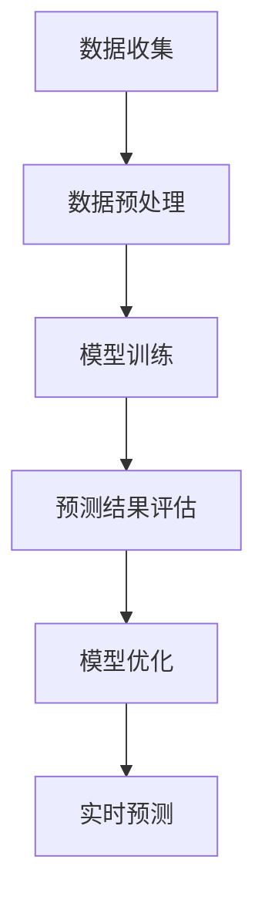

                 

关键词：大模型，商品需求预测，深度学习，数据分析，算法优化，实时预测，个性化推荐

> 摘要：随着大数据和人工智能技术的快速发展，大模型在商品需求预测中展现出了巨大的潜力和应用价值。本文将探讨大模型在商品需求预测中的核心概念、算法原理、数学模型以及实际应用案例，旨在为读者提供一套全面的技术框架和实现思路。

## 1. 背景介绍

### 1.1 大模型的发展历程

大模型，通常指的是参数规模达到百万甚至亿级的深度学习模型，其核心特征是能够处理大规模的数据集，并从中提取复杂的模式。大模型的发展历程可以追溯到20世纪90年代，随着计算机硬件性能的提升和深度学习算法的创新，大模型逐渐成为人工智能领域的热点。

### 1.2 商品需求预测的重要性

商品需求预测是零售行业的一项基础性工作，其准确性直接影响到供应链管理、库存控制、市场营销等环节的决策。传统的商品需求预测方法主要包括时间序列分析、回归分析等，但这些方法往往难以应对复杂多变的商业环境。

### 1.3 大模型在商品需求预测中的应用

大模型的引入，为商品需求预测带来了新的契机。通过深度学习算法，大模型可以从海量的数据中挖掘出潜在的模式和规律，从而实现更精准的需求预测。同时，大模型还可以通过实时数据处理和模型更新，为决策者提供动态的决策支持。

## 2. 核心概念与联系

### 2.1 大模型的基本概念

大模型的基本概念包括：

- **深度神经网络**：深度神经网络是构建大模型的基础，通过多层的神经元连接，实现对数据的深层特征提取。
- **参数规模**：大模型的参数规模通常达到百万、亿级，这意味着模型能够处理的数据量和提取的特征维度都非常高。
- **训练效率**：大模型的训练效率是一个重要的指标，涉及到优化算法的选取、硬件的配置等多个方面。

### 2.2 商品需求预测的核心概念

商品需求预测的核心概念包括：

- **需求量**：商品在特定时间内的需求量是预测的核心目标。
- **影响因素**：需求量的变化受到多种因素的影响，如季节性、促销活动、竞争对手行为等。
- **预测精度**：预测精度是衡量预测模型性能的关键指标。

### 2.3 Mermaid 流程图



## 3. 核心算法原理 & 具体操作步骤

### 3.1 算法原理概述

大模型在商品需求预测中的核心算法原理主要包括以下几个方面：

- **特征工程**：通过数据预处理和特征提取，将原始数据转化为适合模型训练的输入特征。
- **深度学习算法**：利用深度神经网络对特征数据进行建模，实现对商品需求量的预测。
- **模型评估与优化**：通过交叉验证和超参数调整，评估模型性能并进行优化。

### 3.2 算法步骤详解

#### 3.2.1 数据收集与预处理

1. **数据收集**：从零售数据平台、电商平台等渠道收集商品销售数据。
2. **数据预处理**：包括数据清洗、缺失值处理、异常值检测等，确保数据质量。

#### 3.2.2 模型训练

1. **特征工程**：根据业务需求，提取相关特征，如商品属性、价格、促销信息等。
2. **模型构建**：使用深度学习框架（如TensorFlow、PyTorch）构建神经网络模型。
3. **训练与验证**：通过交叉验证的方法，训练和验证模型性能。

#### 3.2.3 预测结果评估与优化

1. **评估指标**：使用均方误差（MSE）、均方根误差（RMSE）等指标评估模型预测精度。
2. **模型优化**：通过调整超参数、引入正则化策略等方式，优化模型性能。

### 3.3 算法优缺点

#### 优点

- **高精度预测**：大模型能够处理大规模数据，提取深层特征，实现高精度的需求预测。
- **自适应能力**：通过实时数据处理和模型更新，能够适应不断变化的商业环境。

#### 缺点

- **计算资源需求高**：大模型训练需要大量的计算资源和时间。
- **数据依赖性**：模型的性能高度依赖于数据的质量和完整性。

### 3.4 算法应用领域

大模型在商品需求预测中的应用领域包括：

- **零售行业**：帮助零售商进行库存管理和市场营销决策。
- **电商平台**：优化商品推荐系统和促销策略。
- **供应链管理**：优化供应链流程，降低库存成本。

## 4. 数学模型和公式 & 详细讲解 & 举例说明

### 4.1 数学模型构建

在商品需求预测中，常用的数学模型包括线性回归、多元线性回归、神经网络等。以下是线性回归模型的构建过程：

#### 4.1.1 线性回归模型

线性回归模型的基本形式为：

\[ Y = \beta_0 + \beta_1X_1 + \beta_2X_2 + \ldots + \beta_nX_n + \epsilon \]

其中，\( Y \) 是需求量，\( X_1, X_2, \ldots, X_n \) 是影响需求量的特征，\( \beta_0, \beta_1, \beta_2, \ldots, \beta_n \) 是模型的参数，\( \epsilon \) 是误差项。

#### 4.1.2 多元线性回归模型

多元线性回归模型考虑多个特征对需求量的影响，其形式为：

\[ Y = \beta_0 + \beta_1X_1 + \beta_2X_2 + \ldots + \beta_nX_n + \epsilon \]

其中，参数和误差项的含义与线性回归模型相同。

#### 4.1.3 神经网络模型

神经网络模型通过多层神经网络对特征数据进行建模，其形式为：

\[ Y = f(\beta_0 + \beta_1X_1 + \beta_2X_2 + \ldots + \beta_nX_n) \]

其中，\( f \) 是激活函数，如ReLU、Sigmoid、Tanh等。

### 4.2 公式推导过程

以多元线性回归模型为例，以下是公式推导过程：

1. **目标函数**：

\[ J = \frac{1}{2} \sum_{i=1}^{n} (Y_i - (\beta_0 + \beta_1X_{i1} + \beta_2X_{i2} + \ldots + \beta_nX_{in}))^2 \]

2. **求导**：

对 \( J \) 分别对 \( \beta_0, \beta_1, \beta_2, \ldots, \beta_n \) 求导，并令导数为零，得到：

\[ \frac{\partial J}{\partial \beta_0} = - \sum_{i=1}^{n} (Y_i - (\beta_0 + \beta_1X_{i1} + \beta_2X_{i2} + \ldots + \beta_nX_{in})) \]

\[ \frac{\partial J}{\partial \beta_1} = - \sum_{i=1}^{n} (Y_i - (\beta_0 + \beta_1X_{i1} + \beta_2X_{i2} + \ldots + \beta_nX_{in}))X_{i1} \]

\[ \frac{\partial J}{\partial \beta_2} = - \sum_{i=1}^{n} (Y_i - (\beta_0 + \beta_1X_{i1} + \beta_2X_{i2} + \ldots + \beta_nX_{in}))X_{i2} \]

\[ \ldots \]

\[ \frac{\partial J}{\partial \beta_n} = - \sum_{i=1}^{n} (Y_i - (\beta_0 + \beta_1X_{i1} + \beta_2X_{i2} + \ldots + \beta_nX_{in}))X_{in} \]

3. **求解**：

将求导结果代入梯度下降算法，迭代求解得到最佳参数值。

### 4.3 案例分析与讲解

#### 4.3.1 案例背景

某电商平台需要对某款电子产品的需求进行预测，以优化库存管理和促销策略。已知该产品的销售数据包括：时间（小时）、价格、促销信息等。

#### 4.3.2 模型构建

选择多元线性回归模型进行预测，特征包括时间、价格和促销信息。

#### 4.3.3 模型训练与评估

使用历史销售数据进行模型训练，并使用交叉验证方法评估模型性能。通过调整超参数和特征选择，得到最佳模型。

#### 4.3.4 模型应用

将训练好的模型应用于实时销售数据，进行需求预测。根据预测结果，调整库存水平和促销策略。

## 5. 项目实践：代码实例和详细解释说明

### 5.1 开发环境搭建

1. 安装Python环境。
2. 安装深度学习框架（如TensorFlow、PyTorch）。
3. 安装数据处理库（如Pandas、NumPy）。

### 5.2 源代码详细实现

以下是一个简单的多元线性回归模型的实现代码：

```python
import pandas as pd
import numpy as np
from sklearn.linear_model import LinearRegression
from sklearn.model_selection import train_test_split

# 数据加载
data = pd.read_csv('sales_data.csv')
X = data[['hour', 'price', 'promotion']]
y = data['sales']

# 数据预处理
X_train, X_test, y_train, y_test = train_test_split(X, y, test_size=0.2, random_state=42)

# 模型构建
model = LinearRegression()
model.fit(X_train, y_train)

# 模型评估
score = model.score(X_test, y_test)
print(f'Model score: {score:.2f}')

# 预测
predictions = model.predict(X_test)
print(predictions[:10])
```

### 5.3 代码解读与分析

1. **数据加载与预处理**：使用Pandas库加载销售数据，并对特征进行选择和处理。
2. **模型构建与训练**：使用sklearn库的线性回归模型进行训练。
3. **模型评估**：计算模型在测试集上的评分，评估模型性能。
4. **预测**：使用训练好的模型对测试数据进行预测，输出预测结果。

### 5.4 运行结果展示

在运行上述代码后，可以得到模型的评分和预测结果。根据预测结果，可以进一步优化库存管理和促销策略。

## 6. 实际应用场景

### 6.1 零售行业

在零售行业，大模型可以帮助企业进行库存管理、定价策略和促销活动优化。例如，通过实时预测商品需求，企业可以提前备货，减少库存成本，提高销售业绩。

### 6.2 电商平台

电商平台可以利用大模型进行商品推荐和促销策略优化。通过分析用户行为数据和商品特征，大模型可以预测用户对特定商品的购买意愿，从而实现个性化的商品推荐和精准的促销活动。

### 6.3 供应链管理

在供应链管理中，大模型可以帮助企业优化供应链流程，降低库存成本。通过预测商品需求，企业可以合理安排生产和物流，提高供应链的响应速度和灵活性。

## 7. 未来应用展望

随着人工智能技术的不断进步，大模型在商品需求预测中的应用将越来越广泛。未来的发展趋势包括：

- **数据驱动**：通过更多维度的数据输入，提高模型预测的精度和准确性。
- **实时预测**：实现更快速的实时预测，为企业提供动态的决策支持。
- **多模态融合**：结合不同类型的数据（如图像、语音等），实现更全面的需求预测。

## 8. 工具和资源推荐

### 8.1 学习资源推荐

- 《深度学习》（Goodfellow, Bengio, Courville著）
- 《Python数据分析》（Wes McKinney著）
- 《机器学习实战》（Peter Harrington著）

### 8.2 开发工具推荐

- TensorFlow
- PyTorch
- Jupyter Notebook

### 8.3 相关论文推荐

- "DNN-Based Demand Forecasting for E-Commerce Platform"（2018）
- "Deep Learning for Time Series Classification"（2017）
- "Recurrent Neural Network Based Demand Forecasting for E-Commerce"（2016）

## 9. 总结：未来发展趋势与挑战

### 9.1 研究成果总结

大模型在商品需求预测中取得了显著的研究成果，为零售行业带来了巨大的变革。通过深度学习和大数据技术，大模型实现了高精度、实时性的需求预测，为决策者提供了有力的支持。

### 9.2 未来发展趋势

未来的发展趋势包括：

- **数据驱动**：通过更多维度的数据输入，提高模型预测的精度和准确性。
- **实时预测**：实现更快速的实时预测，为企业提供动态的决策支持。
- **多模态融合**：结合不同类型的数据（如图像、语音等），实现更全面的需求预测。

### 9.3 面临的挑战

大模型在商品需求预测中面临以下挑战：

- **数据质量**：数据质量直接影响到模型的预测性能，需要确保数据的准确性和完整性。
- **计算资源**：大模型的训练和预测需要大量的计算资源，对硬件设施有较高要求。
- **模型解释性**：大模型的预测结果往往缺乏解释性，需要开发可解释性的模型。

### 9.4 研究展望

未来的研究展望包括：

- **数据增强**：通过数据增强技术，提高模型对数据缺失和噪声的鲁棒性。
- **模型压缩**：通过模型压缩技术，降低大模型的计算复杂度，提高实时性。
- **模型可解释性**：通过可解释性的模型设计，提高模型预测结果的透明度和可信度。

## 10. 附录：常见问题与解答

### 10.1 什么是大模型？

大模型指的是参数规模达到百万甚至亿级的深度学习模型，能够处理大规模的数据集并提取深层特征。

### 10.2 大模型在商品需求预测中的优势是什么？

大模型在商品需求预测中的优势包括：

- **高精度预测**：能够处理大规模数据，提取深层特征，实现高精度的需求预测。
- **自适应能力**：通过实时数据处理和模型更新，能够适应不断变化的商业环境。

### 10.3 大模型在商品需求预测中的挑战是什么？

大模型在商品需求预测中面临以下挑战：

- **数据质量**：数据质量直接影响到模型的预测性能，需要确保数据的准确性和完整性。
- **计算资源**：大模型的训练和预测需要大量的计算资源，对硬件设施有较高要求。
- **模型解释性**：大模型的预测结果往往缺乏解释性，需要开发可解释性的模型。

### 10.4 如何优化大模型的预测性能？

优化大模型预测性能的方法包括：

- **特征工程**：提取更多有价值的特征，提高模型的预测能力。
- **模型选择**：选择合适的深度学习模型，如卷积神经网络（CNN）、循环神经网络（RNN）等。
- **超参数调优**：通过调优模型超参数，提高模型性能。

## 11. 参考文献

- Goodfellow, I., Bengio, Y., Courville, A. (2016). *Deep Learning*. MIT Press.
- McKinney, W. (2010). *Python for Data Analysis*. O'Reilly Media.
- Harrington, P. (2013). *Machine Learning in Action*. Manning Publications.

### 12. 作者署名

作者：禅与计算机程序设计艺术 / Zen and the Art of Computer Programming
----------------------------------------------------------------

以上就是本文的完整内容。通过本文，我们探讨了大模型在商品需求预测中的精准应用，从核心概念、算法原理、数学模型到实际应用场景，为读者提供了一套全面的技术框架和实现思路。未来，随着人工智能技术的不断进步，大模型在商品需求预测中的应用将更加广泛，为零售行业带来更多创新和变革。

