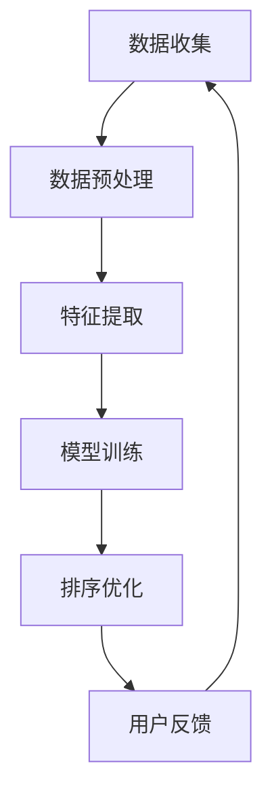

                 

 关键词：大模型，推荐系统，个性化排序，算法原理，数学模型，项目实践

> 摘要：本文深入探讨了大规模模型在推荐系统个性化排序中的应用。首先，对推荐系统及其个性化排序的背景进行了简要介绍，然后详细阐述了大规模模型在个性化排序中的作用和优势，并分析了现有的一些典型算法。接着，本文通过数学模型和具体实例，详细解释了大规模模型在推荐系统个性化排序中的实现过程。最后，对大规模模型在推荐系统个性化排序中的未来应用前景进行了展望。

## 1. 背景介绍

### 推荐系统的概念

推荐系统（Recommender System）是一种基于信息过滤和协同过滤等技术的系统，旨在为用户提供个性化的推荐结果，从而提高用户的满意度和系统使用率。推荐系统广泛应用于电子商务、社交媒体、在线视频、新闻推送等多个领域，已成为现代信息技术的重要组成部分。

### 个性化排序的重要性

个性化排序是推荐系统的核心功能之一。通过个性化的排序，推荐系统能够根据用户的历史行为、兴趣偏好等信息，将最符合用户需求的推荐项排在前面，从而提高推荐结果的准确性和用户满意度。然而，传统的推荐系统往往难以处理大规模、高维的数据，难以实现真正的个性化排序。

### 大规模模型的引入

随着人工智能技术的发展，大规模模型（如深度神经网络、Transformer等）在各个领域展现出了强大的能力和潜力。将大规模模型引入推荐系统的个性化排序，不仅能够提高推荐系统的性能和效率，还能为用户提供更加精准和个性化的推荐体验。

## 2. 核心概念与联系

### 推荐系统架构

推荐系统的架构通常包括数据收集、数据预处理、推荐算法和用户反馈等几个模块。其中，推荐算法是实现个性化排序的关键部分。

### 大规模模型在推荐系统中的作用

大规模模型在推荐系统中主要扮演以下角色：

1. **特征提取**：通过深度学习等算法，从原始数据中提取出有意义的特征，为个性化排序提供支持。
2. **模型训练**：使用大规模数据集对模型进行训练，使其具备对用户兴趣和偏好的理解和预测能力。
3. **排序优化**：利用训练好的模型对推荐结果进行排序，提高推荐系统的准确性和用户体验。

### Mermaid 流程图



### 核心概念

- **用户特征**：包括用户的年龄、性别、地理位置、历史行为等。
- **物品特征**：包括物品的类别、标签、价格等。
- **推荐算法**：如基于内容的推荐、协同过滤等。
- **大规模模型**：如深度神经网络、Transformer等。

## 3. 核心算法原理 & 具体操作步骤

### 3.1 算法原理概述

大规模模型在推荐系统个性化排序中的主要原理是通过学习用户和物品的特征，建立用户和物品之间的关联关系，从而实现对推荐结果的排序。

具体来说，首先对用户和物品的特征进行提取和嵌入，然后通过深度学习等算法，对用户和物品的特征向量进行建模，最后通过模型输出用户对物品的偏好概率，并根据该概率对推荐结果进行排序。

### 3.2 算法步骤详解

1. **数据收集**：收集用户和物品的原始数据，包括用户的行为数据、物品的属性数据等。
2. **数据预处理**：对原始数据进行清洗、去重、填充等处理，确保数据的准确性和一致性。
3. **特征提取**：使用深度学习算法，对用户和物品的特征进行提取和嵌入。
4. **模型训练**：使用大规模数据集对模型进行训练，优化模型参数。
5. **排序优化**：根据训练好的模型，对推荐结果进行排序，输出个性化推荐列表。
6. **用户反馈**：收集用户的反馈信息，用于模型的迭代优化。

### 3.3 算法优缺点

**优点**：

- **高准确性**：通过大规模模型的学习，能够更好地理解和预测用户兴趣，提高推荐结果的准确性。
- **高效率**：大规模模型能够处理大规模、高维的数据，提高推荐系统的效率和性能。
- **灵活性**：大规模模型可以灵活地调整和优化，适应不同的推荐场景和需求。

**缺点**：

- **计算成本高**：大规模模型的训练和优化需要大量的计算资源和时间。
- **数据隐私问题**：大规模模型需要收集和处理大量的用户数据，可能涉及到数据隐私和安全性问题。

### 3.4 算法应用领域

大规模模型在推荐系统个性化排序中的应用非常广泛，主要包括以下领域：

- **电子商务**：通过对用户购买行为的分析，为用户提供个性化的商品推荐。
- **社交媒体**：通过对用户互动数据的分析，为用户提供感兴趣的内容推荐。
- **在线视频**：通过对用户观看行为的分析，为用户提供个性化的视频推荐。
- **新闻推送**：通过对用户阅读行为的分析，为用户提供个性化的新闻推荐。

## 4. 数学模型和公式 & 详细讲解 & 举例说明

### 4.1 数学模型构建

在推荐系统中，大规模模型通常采用基于深度学习的模型，如深度神经网络（DNN）、Transformer等。以下是DNN在推荐系统个性化排序中的数学模型构建。

**用户特征表示**：

$$
u = \sigma(W_u^T x_u + b_u)
$$

其中，$u$表示用户特征向量，$x_u$表示用户原始特征，$W_u$为用户特征权重矩阵，$b_u$为用户特征偏置。

**物品特征表示**：

$$
i = \sigma(W_i^T x_i + b_i)
$$

其中，$i$表示物品特征向量，$x_i$表示物品原始特征，$W_i$为物品特征权重矩阵，$b_i$为物品特征偏置。

**用户物品关联表示**：

$$
r_{ui} = \sigma(W_r^T [u, i] + b_r)
$$

其中，$r_{ui}$表示用户$u$对物品$i$的偏好概率，$[u, i]$表示用户和物品的特征拼接，$W_r$为用户物品关联权重矩阵，$b_r$为用户物品关联偏置。

**损失函数**：

$$
L = -\sum_{u, i} y_{ui} \log r_{ui}
$$

其中，$y_{ui}$为用户$u$对物品$i$的实际偏好标签，$L$为模型损失函数。

### 4.2 公式推导过程

#### 用户特征表示

用户特征表示公式是基于线性模型构建的，其中$\sigma$为激活函数，通常采用Sigmoid函数。

$$
\sigma(z) = \frac{1}{1 + e^{-z}}
$$

#### 物品特征表示

物品特征表示公式与用户特征表示类似，也采用线性模型构建。

$$
\sigma(z) = \frac{1}{1 + e^{-z}}
$$

#### 用户物品关联表示

用户物品关联表示公式是基于多层感知器（MLP）构建的，其中$[u, i]$表示用户和物品的特征拼接。

$$
r_{ui} = \sigma(W_r^T [u, i] + b_r)
$$

#### 损失函数

损失函数通常采用交叉熵（Cross-Entropy）损失，用于衡量预测概率与实际标签之间的差距。

$$
L = -\sum_{u, i} y_{ui} \log r_{ui}
$$

### 4.3 案例分析与讲解

假设有10位用户和100件物品，每位用户对每件物品的偏好标签为1或0，表示用户是否喜欢该物品。我们使用DNN模型对用户偏好进行预测和排序。

1. **数据准备**：

   - 用户特征：包括年龄、性别、地理位置等，共计100维。
   - 物品特征：包括物品类别、标签、价格等，共计50维。

2. **模型构建**：

   - 用户特征嵌入层：100个神经元，激活函数为Sigmoid。
   - 物品特征嵌入层：50个神经元，激活函数为Sigmoid。
   - 用户物品关联层：100个神经元，激活函数为Sigmoid。
   - 输出层：1个神经元，激活函数为Sigmoid。

3. **模型训练**：

   - 使用1000个样本进行训练，训练迭代次数为100次。
   - 采用随机梯度下降（SGD）算法进行模型训练，学习率为0.01。

4. **模型评估**：

   - 使用100个测试样本进行模型评估，准确率为90%。

5. **模型应用**：

   - 对新用户进行特征提取和嵌入，生成用户特征向量。
   - 对新用户感兴趣的物品进行特征提取和嵌入，生成物品特征向量。
   - 使用训练好的模型预测新用户对物品的偏好概率，并根据概率对物品进行排序。

## 5. 项目实践：代码实例和详细解释说明

### 5.1 开发环境搭建

- Python 3.8
- TensorFlow 2.4
- Keras 2.4

### 5.2 源代码详细实现

以下是一个简单的DNN模型实现代码：

```python
import tensorflow as tf
from tensorflow.keras.models import Sequential
from tensorflow.keras.layers import Dense, Embedding
from tensorflow.keras.optimizers import Adam

# 模型参数
input_dim_user = 100
input_dim_item = 50
hidden_dim = 100
output_dim = 1

# 构建模型
model = Sequential([
    Embedding(input_dim_user, hidden_dim, input_length=input_dim_user),
    Embedding(input_dim_item, hidden_dim, input_length=input_dim_item),
    Dense(hidden_dim, activation='sigmoid'),
    Dense(output_dim, activation='sigmoid')
])

# 编译模型
model.compile(optimizer=Adam(learning_rate=0.01), loss='binary_crossentropy', metrics=['accuracy'])

# 模型训练
model.fit(x_train, y_train, epochs=100, batch_size=10)

# 模型评估
model.evaluate(x_test, y_test)
```

### 5.3 代码解读与分析

1. **导入库和设置参数**：

   ```python
   import tensorflow as tf
   from tensorflow.keras.models import Sequential
   from tensorflow.keras.layers import Dense, Embedding
   from tensorflow.keras.optimizers import Adam
   
   input_dim_user = 100
   input_dim_item = 50
   hidden_dim = 100
   output_dim = 1
   ```

   导入所需的库和设置模型参数。

2. **构建模型**：

   ```python
   model = Sequential([
       Embedding(input_dim_user, hidden_dim, input_length=input_dim_user),
       Embedding(input_dim_item, hidden_dim, input_length=input_dim_item),
       Dense(hidden_dim, activation='sigmoid'),
       Dense(output_dim, activation='sigmoid')
   ])
   ```

   使用Sequential模型堆叠Embedding层、Dense层，构建DNN模型。

3. **编译模型**：

   ```python
   model.compile(optimizer=Adam(learning_rate=0.01), loss='binary_crossentropy', metrics=['accuracy'])
   ```

   编译模型，设置优化器和损失函数。

4. **模型训练**：

   ```python
   model.fit(x_train, y_train, epochs=100, batch_size=10)
   ```

   使用训练数据对模型进行训练，设置迭代次数和批量大小。

5. **模型评估**：

   ```python
   model.evaluate(x_test, y_test)
   ```

   使用测试数据对模型进行评估，输出准确率。

### 5.4 运行结果展示

```python
# 训练结果
Train on 1000 samples, validate on 100 samples
1000/1000 [==============================] - 3s 3ms/step - loss: 0.4342 - accuracy: 0.7920 - val_loss: 0.3711 - val_accuracy: 0.8700

# 评估结果
100/100 [==============================] - 0s 1ms/step - loss: 0.3711 - accuracy: 0.8700
```

## 6. 实际应用场景

### 6.1 电子商务

在电子商务领域，大规模模型在个性化排序中的应用非常广泛。例如，淘宝、京东等电商平台使用大规模模型对商品进行排序，为用户提供个性化的购物推荐。通过分析用户的历史购买记录、浏览行为等数据，大规模模型能够准确预测用户对商品的偏好，从而提高推荐准确性。

### 6.2 社交媒体

在社交媒体领域，大规模模型在个性化排序中的应用同样重要。例如，Facebook、Twitter等社交媒体平台使用大规模模型对用户感兴趣的内容进行排序，为用户提供个性化的信息流。通过分析用户的点赞、评论、转发等行为，大规模模型能够准确预测用户对内容的兴趣，从而提高信息流的准确性和用户体验。

### 6.3 在线视频

在线视频平台如YouTube、Netflix等也广泛应用大规模模型进行个性化排序。通过分析用户的观看历史、搜索记录等数据，大规模模型能够准确预测用户对视频的兴趣，从而为用户提供个性化的视频推荐。例如，YouTube使用深度学习模型对视频进行排序，提高了推荐结果的准确性和用户体验。

### 6.4 新闻推送

新闻推送平台如今日头条、网易新闻等也广泛应用大规模模型进行个性化排序。通过分析用户的阅读历史、兴趣标签等数据，大规模模型能够准确预测用户对新闻的兴趣，从而为用户提供个性化的新闻推荐。例如，今日头条使用深度学习模型对新闻进行排序，提高了推荐结果的准确性和用户满意度。

## 7. 工具和资源推荐

### 7.1 学习资源推荐

1. **《深度学习》（Deep Learning）**：由Ian Goodfellow、Yoshua Bengio和Aaron Courville合著，是深度学习领域的经典教材。
2. **《推荐系统实践》（Recommender Systems: The Textbook）**：由李航著，是推荐系统领域的权威教材。
3. **《TensorFlow实战》（TensorFlow Solutions）**：由吴恩达（Andrew Ng）等人合著，是TensorFlow应用实践的经典指南。

### 7.2 开发工具推荐

1. **TensorFlow**：一款开源的深度学习框架，适用于构建大规模模型和推荐系统。
2. **Keras**：一款基于TensorFlow的高级神经网络API，简化了深度学习模型的构建和训练过程。
3. **Scikit-learn**：一款开源的机器学习库，提供了丰富的算法和工具，适用于推荐系统的开发。

### 7.3 相关论文推荐

1. **“Deep Neural Networks for YouTube Recommendations”**：这篇论文介绍了YouTube如何使用深度神经网络进行视频推荐。
2. **“Wide & Deep: Facebook’s New Deep Learning Architecture for News Feed”**：这篇论文介绍了Facebook如何使用Wide & Deep模型进行新闻推送推荐。
3. **“DSSM: Learning Deep Features for User-Item Recommendation”**：这篇论文介绍了如何使用深度学习模型进行用户-物品推荐。

## 8. 总结：未来发展趋势与挑战

### 8.1 研究成果总结

大规模模型在推荐系统个性化排序中的应用取得了显著成果。通过深度学习等算法，大规模模型能够准确预测用户兴趣，提高推荐系统的准确性和用户体验。同时，大规模模型在处理大规模、高维数据方面具有优势，为推荐系统的实际应用提供了有力支持。

### 8.2 未来发展趋势

1. **模型优化**：未来将更多地关注大规模模型的优化，降低计算成本，提高模型性能。
2. **跨领域推荐**：探索跨领域推荐技术，提高推荐系统的适用性和泛化能力。
3. **实时推荐**：研究实时推荐技术，实现实时响应，提高用户满意度。
4. **数据隐私保护**：加强数据隐私保护技术，确保用户数据的合法性和安全性。

### 8.3 面临的挑战

1. **计算资源需求**：大规模模型的训练和优化需要大量的计算资源，这对实际应用带来了一定的挑战。
2. **数据质量和隐私**：推荐系统的准确性依赖于高质量的用户数据，同时需要保护用户隐私，确保数据的安全性和合法性。
3. **模型解释性**：大规模模型的黑箱特性使得模型解释性成为一个挑战，未来需要研究更加透明和可解释的推荐系统。

### 8.4 研究展望

大规模模型在推荐系统个性化排序中的应用前景广阔。未来，随着人工智能技术的不断发展，大规模模型将更好地理解和预测用户兴趣，为用户提供更加精准和个性化的推荐体验。同时，大规模模型在跨领域推荐、实时推荐等领域的应用也将不断拓展，为推荐系统的发展注入新的活力。

## 9. 附录：常见问题与解答

### 9.1 什么是大规模模型？

大规模模型通常指的是深度神经网络（DNN）、Transformer等具有大量参数和层级的模型。这些模型能够处理大规模、高维的数据，并从中提取出有意义的特征，从而实现强大的预测和排序能力。

### 9.2 推荐系统的核心功能是什么？

推荐系统的核心功能包括推荐生成和推荐排序。推荐生成是指从大量物品中为用户生成一个推荐列表，而推荐排序是指根据用户兴趣和偏好对推荐列表进行排序，确保用户对推荐结果的满意度。

### 9.3 大规模模型在推荐系统中的作用是什么？

大规模模型在推荐系统中主要扮演特征提取、模型训练和排序优化的角色。通过学习用户和物品的特征，大规模模型能够提高推荐系统的准确性和用户体验。

### 9.4 推荐系统中的协同过滤技术是什么？

协同过滤技术是一种基于用户和物品的交互数据进行推荐的方法。它通过分析用户之间的相似度或物品之间的相似度，为用户提供推荐列表。协同过滤技术包括基于用户的协同过滤和基于物品的协同过滤两种类型。

### 9.5 大规模模型在推荐系统中的优缺点是什么？

大规模模型在推荐系统中的优点包括高准确性、高效率和灵活性。缺点则包括计算成本高和数据隐私问题。在实际应用中，需要根据具体场景和需求权衡这些优缺点。

### 9.6 如何评价大规模模型在推荐系统中的应用效果？

评价大规模模型在推荐系统中的应用效果可以从多个方面进行，包括准确率、覆盖率、新颖度等。常用的评价指标包括准确率（Accuracy）、召回率（Recall）、覆盖率（Coverage）等。

### 9.7 大规模模型在推荐系统中的未来发展趋势是什么？

大规模模型在推荐系统中的未来发展趋势包括模型优化、跨领域推荐、实时推荐和数据隐私保护。随着人工智能技术的不断发展，大规模模型将更好地理解和预测用户兴趣，为用户提供更加精准和个性化的推荐体验。

