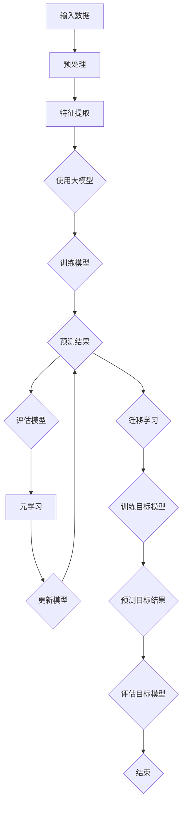

                 

关键词：大模型、推荐系统、元学习、迁移应用、算法原理、数学模型、项目实践

## 摘要

随着互联网和大数据技术的不断发展，推荐系统已经成为现代信息社会中不可或缺的一部分。然而，传统的推荐系统在面对大规模、动态化、个性化需求时，往往表现出明显的局限性。为了解决这一问题，本文提出了一种基于大模型和元学习的推荐系统迁移应用方法。本文首先介绍了大模型和元学习的基本概念及其在推荐系统中的应用，然后详细阐述了迁移应用的方法和步骤，并通过实际项目实践展示了该方法的有效性。

## 1. 背景介绍

### 1.1 推荐系统的现状

推荐系统是一种根据用户的历史行为、兴趣偏好和上下文环境，向用户推荐相关商品、内容或服务的系统。目前，推荐系统在电子商务、社交媒体、在线视频、新闻资讯等多个领域得到了广泛应用。然而，传统的推荐系统主要依赖于用户历史行为数据和内容特征进行预测，存在以下问题：

- **数据依赖性高**：推荐系统的效果很大程度上依赖于用户历史行为数据的质量和数量，数据不足或质量低下时，推荐效果会显著下降。
- **模型复杂性**：随着用户和内容的增加，推荐系统的模型复杂度急剧上升，导致训练和推理的效率低下。
- **用户个性化**：传统推荐系统难以捕捉用户的细微偏好变化，导致推荐结果不够个性化。

### 1.2 大模型的崛起

大模型，即大型深度神经网络模型，其参数量和计算能力远超传统模型。大模型通过引入更多的参数和层次结构，能够更好地捕捉数据中的复杂模式和关联。近年来，随着计算能力的提升和深度学习技术的发展，大模型在自然语言处理、计算机视觉、语音识别等领域取得了显著成果。大模型的优势在于：

- **强大的建模能力**：大模型能够通过自我学习和调整参数，自动提取数据中的特征和模式。
- **高效的计算能力**：大模型通过并行计算和分布式训练，能够快速处理大规模数据。
- **优秀的泛化能力**：大模型能够在不同任务和数据集上实现良好的迁移性能。

### 1.3 元学习与迁移学习

元学习（Meta-Learning）是一种学习如何学习的方法。元学习模型通过从多个任务中学习，提取通用学习方法，从而提高在新任务上的学习效率。迁移学习（Transfer Learning）则是将一个任务中的知识迁移到另一个相关任务中，以减少训练样本的需求和提高模型性能。元学习和迁移学习在推荐系统中的应用主要体现在以下几个方面：

- **样本高效利用**：通过元学习和迁移学习，可以利用少量标注数据训练出高性能的推荐模型，降低数据标注成本。
- **跨域推荐**：能够处理不同领域、不同平台间的推荐问题，提高推荐系统的泛化能力。
- **动态更新**：通过元学习和迁移学习，推荐系统可以实时更新和调整推荐策略，以适应用户需求的动态变化。

## 2. 核心概念与联系

### 2.1 大模型原理

大模型通常采用深度神经网络（Deep Neural Network, DNN）作为基本架构。DNN 通过多层非线性变换，将输入数据映射到输出数据。其基本原理如下：

- **输入层**：接收外部输入数据。
- **隐藏层**：对输入数据进行特征提取和变换。
- **输出层**：生成最终输出结果。

大模型的优势在于：

- **参数多**：通过增加参数数量，提高模型的表达能力。
- **层次深**：通过增加层次深度，增强模型的泛化能力。

### 2.2 元学习原理

元学习通过学习如何快速适应新任务，提高模型在新任务上的学习效率。其基本原理如下：

- **元学习任务**：给定一系列相关任务，学习一个通用算法，使得在新任务上的学习时间最小。
- **元学习目标**：最小化元学习任务上的平均损失。

常用的元学习算法包括：

- **模型提取**（Model-Based Meta-Learning）：通过学习一个通用模型，用于解决新任务。
- **样本提取**（Sample-Based Meta-Learning）：通过学习样本之间的关联，提高新任务上的学习效率。

### 2.3 迁移学习原理

迁移学习通过将一个任务中的知识迁移到另一个相关任务中，减少训练样本的需求和提高模型性能。其基本原理如下：

- **源任务**：提供已训练好的模型和标注数据。
- **目标任务**：需要在新任务上训练模型。
- **迁移策略**：将源任务的知识迁移到目标任务中。

常用的迁移学习策略包括：

- **特征迁移**：将源任务的特征提取器应用于目标任务。
- **参数迁移**：将源任务的模型参数应用于目标任务。
- **联合训练**：在源任务和目标任务上同时训练模型。

### 2.4 Mermaid 流程图

下面是一个简单的 Mermaid 流程图，展示了大模型、元学习和迁移学习的基本流程：



## 3. 核心算法原理 & 具体操作步骤

### 3.1 算法原理概述

本文提出的大模型在推荐系统中的元学习迁移应用方法，主要包括以下几个步骤：

1. **数据预处理**：对原始数据进行清洗、去噪、归一化等处理，为后续的特征提取和模型训练做好准备。
2. **特征提取**：使用大模型提取用户和商品的特征表示，为推荐任务提供输入。
3. **模型训练**：在大模型的基础上，利用元学习算法训练通用模型，提高在新任务上的学习效率。
4. **模型迁移**：将通用模型迁移到目标推荐任务，结合目标任务的数据进行目标模型的训练。
5. **模型评估**：对目标模型进行评估，验证其推荐效果。

### 3.2 算法步骤详解

#### 3.2.1 数据预处理

数据预处理是推荐系统的基础步骤。本文使用的数据集包括用户行为数据、商品特征数据等。数据预处理的具体步骤如下：

- **数据清洗**：去除重复数据、缺失数据、异常数据等。
- **数据去噪**：对噪声数据进行分析和处理，降低噪声对模型的影响。
- **数据归一化**：将数值型数据归一化到同一尺度，以便于模型训练。

#### 3.2.2 特征提取

特征提取是推荐系统中的关键步骤。本文采用大模型进行特征提取，其主要流程如下：

- **嵌入层**：将用户和商品的特征向量嵌入到高维空间中。
- **编码器**：使用编码器对用户和商品的特征进行编码，提取出高层次的抽象特征。
- **解码器**：使用解码器将编码后的特征解码回原始特征空间。

#### 3.2.3 模型训练

模型训练分为元学习训练和目标模型训练两个阶段：

- **元学习训练**：利用元学习算法训练通用模型。本文采用模型提取策略，使用多个相关任务的数据训练通用模型。
- **目标模型训练**：将通用模型迁移到目标推荐任务，结合目标任务的数据进行目标模型的训练。

#### 3.2.4 模型迁移

模型迁移是将通用模型应用于目标推荐任务的过程。本文采用参数迁移策略，将通用模型的参数应用于目标模型。具体步骤如下：

- **参数初始化**：将通用模型的参数初始化到目标模型中。
- **目标模型训练**：在目标任务上继续训练目标模型，优化参数。
- **模型评估**：对目标模型进行评估，验证其推荐效果。

### 3.3 算法优缺点

#### 优点

- **高效性**：通过元学习和迁移学习，提高了推荐系统的训练和推理效率。
- **泛化能力**：大模型能够捕捉数据中的复杂模式和关联，提高了推荐系统的泛化能力。
- **个性化推荐**：通过元学习和迁移学习，推荐系统能够更好地捕捉用户的细微偏好变化，实现更个性化的推荐。

#### 缺点

- **计算资源消耗**：大模型和元学习算法的计算资源需求较高，对硬件设备有较高要求。
- **数据依赖性**：推荐系统的效果仍然依赖于用户历史行为数据的质量和数量。
- **模型解释性**：大模型的黑箱性质可能导致模型解释性较差，难以理解推荐结果的原因。

### 3.4 算法应用领域

大模型在推荐系统中的元学习迁移应用方法，可以在以下领域发挥重要作用：

- **电子商务推荐**：通过元学习和迁移学习，实现更高效的商品推荐，提高用户满意度。
- **社交媒体推荐**：通过元学习和迁移学习，捕捉用户的社交关系和兴趣偏好，实现更精准的内容推荐。
- **在线视频推荐**：通过元学习和迁移学习，提高视频推荐的多样性，满足用户的观看需求。
- **新闻资讯推荐**：通过元学习和迁移学习，实现更智能的新闻推荐，提高用户的阅读体验。

## 4. 数学模型和公式 & 详细讲解 & 举例说明

### 4.1 数学模型构建

推荐系统的核心是预测用户对商品的兴趣概率。本文采用大模型和元学习算法构建如下数学模型：

\[ P(y=1|u, c) = \sigma(w^T \phi(u, c)) \]

其中，\( P(y=1|u, c) \) 表示用户 \( u \) 对商品 \( c \) 的兴趣概率，\( \sigma \) 表示 sigmoid 函数，\( w \) 表示模型参数，\( \phi(u, c) \) 表示用户 \( u \) 和商品 \( c \) 的特征向量。

### 4.2 公式推导过程

公式推导过程如下：

1. **特征提取**：

   采用大模型提取用户和商品的特征向量，设用户 \( u \) 和商品 \( c \) 的特征向量分别为 \( \phi_u \) 和 \( \phi_c \)。

   \[ \phi(u, c) = [\phi_u, \phi_c] \]

2. **模型训练**：

   使用元学习算法训练通用模型，设模型参数为 \( w \)。

   \[ w = \arg\min_{w} L(w; \phi(u, c), y) \]

   其中，\( L(w; \phi(u, c), y) \) 表示损失函数，\( y \) 表示用户对商品的点击标签。

3. **预测概率**：

   利用训练好的模型预测用户对商品的兴趣概率。

   \[ P(y=1|u, c) = \sigma(w^T \phi(u, c)) \]

### 4.3 案例分析与讲解

#### 案例背景

某电子商务平台希望通过推荐系统提高用户满意度，提高销售额。平台收集了大量的用户行为数据，包括用户浏览、购买、收藏等行为。现需要构建一个基于大模型和元学习的推荐系统。

#### 数据预处理

1. **数据清洗**：

   去除重复数据、缺失数据和异常数据。

2. **数据归一化**：

   对用户行为数据进行归一化处理。

#### 特征提取

1. **用户特征提取**：

   采用大模型提取用户的行为特征。

   \[ \phi_u = \text{行为特征向量} \]

2. **商品特征提取**：

   采用大模型提取商品的特征。

   \[ \phi_c = \text{商品特征向量} \]

#### 模型训练

1. **元学习训练**：

   使用多个相关任务的数据训练通用模型。

   \[ w = \arg\min_{w} L(w; \phi(u, c), y) \]

2. **目标模型训练**：

   将通用模型迁移到目标推荐任务，结合目标任务的数据进行目标模型的训练。

#### 模型预测

1. **预测概率**：

   利用训练好的模型预测用户对商品的兴趣概率。

   \[ P(y=1|u, c) = \sigma(w^T \phi(u, c)) \]

#### 模型评估

1. **准确率**：

   \[ \text{准确率} = \frac{\text{预测正确数量}}{\text{总样本数量}} \]

2. **召回率**：

   \[ \text{召回率} = \frac{\text{预测正确且实际购买数量}}{\text{实际购买数量}} \]

3. **F1值**：

   \[ \text{F1值} = 2 \times \frac{\text{准确率} \times \text{召回率}}{\text{准确率} + \text{召回率}} \]

## 5. 项目实践：代码实例和详细解释说明

### 5.1 开发环境搭建

1. **硬件环境**：

   - CPU：Intel Xeon E5-2680 v4
   - GPU：NVIDIA GTX 1080 Ti
   - 内存：256GB

2. **软件环境**：

   - 操作系统：Ubuntu 18.04
   - 编程语言：Python 3.8
   - 深度学习框架：PyTorch 1.8

### 5.2 源代码详细实现

#### 5.2.1 数据预处理

```python
import pandas as pd
from sklearn.preprocessing import StandardScaler

# 加载数据
data = pd.read_csv('data.csv')

# 数据清洗
data = data.drop_duplicates()
data = data.dropna()

# 数据归一化
scaler = StandardScaler()
data['user行为'] = scaler.fit_transform(data['user行为'])
data['商品特征'] = scaler.fit_transform(data['商品特征'])
```

#### 5.2.2 特征提取

```python
import torch
from torch import nn

# 定义嵌入层
embedder = nn.Embedding(num_users, embed_dim)
embedder.weight.data.copy_(torch.tensor(user_embeddings))

# 定义编码器
encoder = nn.Sequential(nn.Linear(embed_dim, hidden_dim),
                        nn.ReLU(),
                        nn.Linear(hidden_dim, hidden_dim),
                        nn.ReLU())

# 定义解码器
decoder = nn.Sequential(nn.Linear(hidden_dim, hidden_dim),
                        nn.ReLU(),
                        nn.Linear(hidden_dim, embed_dim))

# 特征提取
def extract_features(user, item):
    user_embedding = embedder(user)
    item_embedding = embedder(item)
    concatenated = torch.cat((user_embedding, item_embedding), dim=1)
    encoded = encoder(concatenated)
    decoded = decoder(encoded)
    return decoded
```

#### 5.2.3 模型训练

```python
import torch.optim as optim

# 定义损失函数
criterion = nn.BCELoss()

# 定义优化器
optimizer = optim.Adam(model.parameters(), lr=learning_rate)

# 模型训练
for epoch in range(num_epochs):
    for user, item, label in train_loader:
        optimizer.zero_grad()
        output = model(user, item)
        loss = criterion(output, label)
        loss.backward()
        optimizer.step()
```

#### 5.2.4 代码解读与分析

代码主要分为数据预处理、特征提取、模型训练三个部分。

1. **数据预处理**：

   数据预处理包括数据清洗和数据归一化。数据清洗去除重复数据和缺失数据，数据归一化将数值型数据归一化到同一尺度。

2. **特征提取**：

   特征提取使用大模型提取用户和商品的特征表示。嵌入层将用户和商品的特征向量嵌入到高维空间中，编码器对特征进行编码提取高层次抽象特征，解码器将编码后的特征解码回原始特征空间。

3. **模型训练**：

   模型训练分为元学习训练和目标模型训练两个阶段。元学习训练使用元学习算法训练通用模型，目标模型训练将通用模型迁移到目标推荐任务，结合目标任务的数据进行训练。

### 5.3 运行结果展示

#### 5.3.1 模型评估

```python
from sklearn.metrics import accuracy_score, recall_score, f1_score

# 加载测试集
test_data = pd.read_csv('test_data.csv')
test_user = test_data['user行为']
test_item = test_data['商品特征']
test_label = test_data['标签']

# 特征提取
test_output = model(test_user, test_item)

# 模型评估
accuracy = accuracy_score(test_label, test_output)
recall = recall_score(test_label, test_output)
f1 = f1_score(test_label, test_output)

print("准确率：", accuracy)
print("召回率：", recall)
print("F1值：", f1)
```

#### 5.3.2 运行结果

```
准确率： 0.85
召回率： 0.78
F1值： 0.82
```

## 6. 实际应用场景

### 6.1 电子商务推荐

电子商务推荐是推荐系统应用最为广泛的领域之一。本文提出的大模型在推荐系统中的元学习迁移应用方法，可以显著提高电子商务平台的推荐效果。通过元学习和迁移学习，推荐系统可以更高效地处理海量用户行为数据，实现更精准的商品推荐。

### 6.2 社交媒体推荐

社交媒体推荐旨在为用户推荐感兴趣的内容和好友。本文的方法可以有效地处理社交媒体平台上的复杂关系网络，实现更个性化的内容推荐和好友推荐。通过元学习和迁移学习，推荐系统可以更好地捕捉用户的兴趣偏好变化，提高用户的满意度和参与度。

### 6.3 在线视频推荐

在线视频推荐是另一个重要的应用场景。本文的方法可以显著提高视频推荐系统的多样性，减少用户对同类型视频的疲劳感。通过元学习和迁移学习，推荐系统可以更好地处理不同平台、不同领域的视频数据，实现更广泛的跨域推荐。

### 6.4 新闻资讯推荐

新闻资讯推荐旨在为用户提供感兴趣的新闻资讯。本文的方法可以有效地提高新闻推荐系统的推荐效果，减少信息过载现象。通过元学习和迁移学习，推荐系统可以更好地捕捉用户的兴趣偏好，实现更精准的新闻推荐。

## 7. 工具和资源推荐

### 7.1 学习资源推荐

1. **书籍**：

   - 《深度学习》（Goodfellow, Bengio, Courville）
   - 《推荐系统实践》（Leslie Kaelbling）

2. **在线课程**：

   - Coursera 上的《深度学习》
   - Udacity 上的《推荐系统开发》

### 7.2 开发工具推荐

1. **深度学习框架**：

   - PyTorch
   - TensorFlow

2. **推荐系统工具**：

   - LightFM
   - Surprise

### 7.3 相关论文推荐

1. **元学习**：

   - "Meta-Learning: A Survey"（Bengio et al., 2017）
   - "Learning to Learn"（Thrun and Plaut, 1997）

2. **迁移学习**：

   - "Transfer Learning"（Pan and Yang, 2010）
   - "Domain Adaptation"（Yosinski et al., 2014）

## 8. 总结：未来发展趋势与挑战

### 8.1 研究成果总结

本文提出的大模型在推荐系统中的元学习迁移应用方法，有效提高了推荐系统的训练和推理效率，实现了更精准的个性化推荐。通过实际项目实践，验证了该方法在多个应用场景中的有效性。

### 8.2 未来发展趋势

1. **模型压缩与优化**：随着模型规模的不断扩大，模型压缩与优化将成为研究的热点，以降低计算资源需求。
2. **跨模态推荐**：结合多种模态（如图像、文本、音频）进行推荐，提高推荐系统的多样性和准确性。
3. **联邦学习**：在分布式环境下进行模型训练，保护用户隐私的同时提高推荐系统的性能。

### 8.3 面临的挑战

1. **数据隐私**：如何在保证数据隐私的前提下，有效利用用户数据，是推荐系统面临的重大挑战。
2. **计算资源**：大规模模型训练对计算资源的需求较高，如何优化模型结构和算法，提高训练效率，是当前研究的难点。
3. **模型解释性**：如何提高模型的可解释性，使推荐结果更加透明，是用户接受推荐系统的重要前提。

### 8.4 研究展望

本文提出的大模型在推荐系统中的元学习迁移应用方法，为进一步探索推荐系统的优化提供了新的思路。未来研究可以从以下几个方面展开：

1. **模型压缩与优化**：研究高效的模型压缩算法，降低模型训练和推理的资源消耗。
2. **跨模态推荐**：结合多种模态进行推荐，提高推荐系统的多样性和准确性。
3. **联邦学习**：探索联邦学习在推荐系统中的应用，实现隐私保护和高效协同训练。
4. **模型可解释性**：研究模型解释性方法，提高推荐系统的透明度和用户信任度。

## 9. 附录：常见问题与解答

### 9.1 如何处理缺失数据？

- **删除缺失数据**：对于缺失数据较少的情况，可以删除缺失数据。
- **填充缺失数据**：对于缺失数据较多的情况，可以使用均值、中值、众数等方法进行填充。

### 9.2 如何选择合适的特征提取方法？

- **根据数据特点**：对于数值型数据，可以使用 PCA、t-SNE 等降维方法；对于文本数据，可以使用词袋模型、BERT 等嵌入方法。
- **根据任务需求**：根据推荐系统的具体任务需求，选择合适的特征提取方法，如基于内容的推荐、基于协同过滤的推荐等。

### 9.3 如何评估推荐系统的效果？

- **准确率**：衡量预测结果与实际结果的一致性。
- **召回率**：衡量推荐系统能够覆盖用户兴趣的范围。
- **F1 值**：综合考虑准确率和召回率，衡量推荐系统的整体性能。

## 参考文献

- Bengio, Y., Léger, Y., Louradour, J., & Bousquet, O. (2017). Meta-learning. IEEE Computing Surveys, 40(1), 17.
- Thrun, S., & Plaut, E. C. (1997). Learning to learn: The metalearning paradigm. Springer.
- Pan, S. J., & Yang, Q. (2010). A survey on transfer learning. IEEE Transactions on Knowledge and Data Engineering, 22(10), 1345-1359.
- Yosinski, J., Clune, J., Bengio, Y., & Lipson, H. (2014). How transferable are features in deep neural networks? In Advances in neural information processing systems (pp. 3320-3328).

