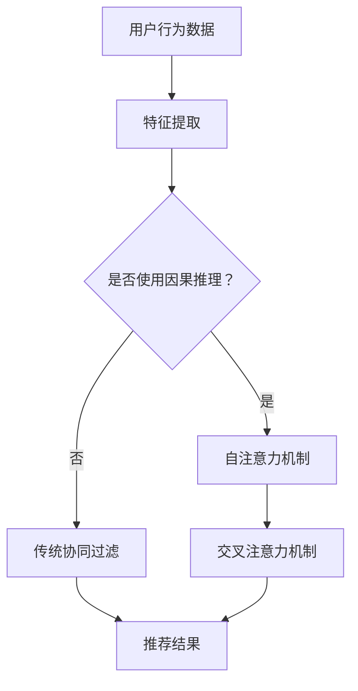

                 

关键词：推荐系统，因果推理，大模型，深度学习，算法优化

摘要：本文探讨了如何在大模型（如Transformer）框架下，通过因果推理提升推荐系统的效果。我们将介绍推荐系统的背景和核心概念，分析因果推理在大模型中的重要性，并详细阐述核心算法原理、数学模型及其在实际项目中的应用。文章将结合代码实例，展示大模型在推荐系统中的具体实现，并讨论其未来应用前景。

## 1. 背景介绍

### 推荐系统的发展历程

推荐系统是一种旨在根据用户的兴趣和行为，向他们提供个性化内容和信息的技术。随着互联网的普及和用户数据的积累，推荐系统在电子商务、社交媒体、内容平台等领域得到了广泛应用。推荐系统的发展历程可以追溯到20世纪90年代，当时基于协同过滤的方法成为了主流。协同过滤分为基于用户的协同过滤和基于项目的协同过滤，它们通过分析用户和项目之间的相似度来进行推荐。

随着大数据和人工智能技术的发展，推荐系统逐渐从基于规则的系统向基于机器学习的系统转变。传统的机器学习算法（如SVD、矩阵分解等）在推荐系统中得到了广泛应用，但它们通常只能捕捉用户和项目之间的相关性，而无法揭示深层次的因果关系。

### 大模型在推荐系统中的应用

近年来，深度学习模型（如Transformer）的兴起，为推荐系统的发展带来了新的契机。Transformer模型最初在自然语言处理领域取得了突破性成果，随后在图像识别、语音识别等领域也得到了广泛应用。大模型具有强大的特征提取和表征能力，能够处理大规模、高维度的数据，从而更好地捕捉用户和项目之间的复杂关系。

将大模型引入推荐系统，可以通过自注意力机制（self-attention）和交叉注意力机制（cross-attention）捕捉用户、项目和上下文之间的因果关系，从而提高推荐系统的效果。本文将围绕大模型在推荐系统中的因果推理应用，探讨其原理、实现方法及未来发展趋势。

## 2. 核心概念与联系

### 推荐系统中的因果关系

在推荐系统中，因果关系指的是用户行为（如点击、购买等）与推荐内容（如商品、文章等）之间的因果关系。传统的推荐系统主要关注相关性，即用户喜欢某类内容，那么他们很可能也会喜欢其他类似的内容。然而，相关性并不能保证推荐结果的准确性，因为用户的行为可能受到多种因素的影响，如个人偏好、环境影响等。

因果推理则试图揭示用户行为和推荐内容之间的因果关系，从而提高推荐系统的可靠性。因果推理在大模型中的应用，可以通过自注意力机制和交叉注意力机制实现。自注意力机制可以捕捉用户在历史行为中的偏好变化，而交叉注意力机制可以捕捉用户与推荐内容之间的相互作用。

### Mermaid 流程图

以下是一个简化的Mermaid流程图，展示了推荐系统中因果关系的基本流程：



在这个流程图中，用户行为数据经过特征提取后，根据是否使用因果推理进行分支。如果使用因果推理，则通过自注意力机制和交叉注意力机制生成推荐结果；否则，采用传统的协同过滤方法生成推荐结果。自注意力机制和交叉注意力机制是实现因果推理的关键步骤。

## 3. 核心算法原理 & 具体操作步骤

### 3.1 算法原理概述

大模型在推荐系统中的核心算法原理主要涉及自注意力机制和交叉注意力机制。自注意力机制（Self-Attention）是一种在序列数据中计算每个元素与其他元素之间关系的机制。它通过计算自我关联的权重，将序列数据映射到一个新的表示空间，从而捕捉用户在历史行为中的偏好变化。

交叉注意力机制（Cross-Attention）则是在推荐系统中将用户行为与推荐内容进行关联的机制。它通过计算用户行为和推荐内容之间的关联权重，将用户行为映射到一个新的表示空间，从而生成推荐结果。

### 3.2 算法步骤详解

1. **用户行为数据预处理**：
   - 收集用户的历史行为数据，如点击、购买、浏览等。
   - 对用户行为数据进行清洗和预处理，包括数据去重、缺失值填充等。

2. **特征提取**：
   - 将用户行为数据转化为特征向量，如使用词袋模型、TF-IDF等方法。
   - 对特征向量进行归一化处理，使其具有相似的尺度。

3. **自注意力机制**：
   - 输入用户历史行为特征向量序列。
   - 使用自注意力机制计算每个元素与其他元素之间的关联权重。
   - 将用户历史行为特征向量映射到一个新的表示空间，得到用户行为序列的新表示。

4. **交叉注意力机制**：
   - 输入用户行为序列的新表示和推荐内容序列。
   - 使用交叉注意力机制计算用户行为序列和推荐内容序列之间的关联权重。
   - 将推荐内容映射到一个新的表示空间，得到推荐内容的新表示。

5. **生成推荐结果**：
   - 根据推荐内容的新表示，计算每个推荐内容的得分。
   - 对推荐内容得分进行排序，生成最终的推荐结果。

### 3.3 算法优缺点

**优点**：
1. **强大的特征提取能力**：大模型通过自注意力机制和交叉注意力机制，能够捕捉用户和推荐内容之间的复杂关系，从而提高推荐系统的效果。
2. **适用于大规模数据**：大模型具有处理大规模、高维度数据的能力，能够应对推荐系统中数据量的增加。
3. **自适应调整**：自注意力机制和交叉注意力机制可以根据用户行为和推荐内容的变化，自适应地调整权重，提高推荐系统的动态适应性。

**缺点**：
1. **计算资源消耗大**：大模型在训练和推理过程中需要大量的计算资源，对硬件要求较高。
2. **模型解释性较差**：大模型通常具有较深的网络结构，导致模型解释性较差，难以直观理解模型的工作原理。

### 3.4 算法应用领域

大模型在推荐系统中的应用已涉及多个领域，如电子商务、社交媒体、内容平台等。以下是一些具体的应用案例：

1. **电子商务推荐**：通过分析用户的历史购买记录和浏览行为，为用户提供个性化的商品推荐。
2. **社交媒体推荐**：根据用户在社交媒体上的互动行为，为用户推荐感兴趣的内容和用户。
3. **内容平台推荐**：根据用户的阅读历史和浏览偏好，为用户推荐相关的文章、视频等。

## 4. 数学模型和公式

### 4.1 数学模型构建

在推荐系统中，大模型的数学模型主要包括自注意力机制和交叉注意力机制的数学描述。以下是一个简化的数学模型：

$$
\text{User\_Representation} = \text{Self-Attention}(\text{User\_Behaviors})
$$

$$
\text{Content\_Representation} = \text{Cross-Attention}(\text{User\_Representation}, \text{Content})
$$

$$
\text{Recommendation\_Score} = \text{Content\_Representation} \cdot \text{User\_Representation}
$$

其中，$\text{User\_Behaviors}$表示用户历史行为特征向量序列，$\text{Content}$表示推荐内容特征向量序列，$\text{User\_Representation}$和$\text{Content\_Representation}$分别表示用户和推荐内容的新表示，$\text{Recommendation\_Score}$表示推荐内容得分。

### 4.2 公式推导过程

自注意力机制的推导过程如下：

$$
\text{Query\_Weight} = \text{Score}(\text{Query}, \text{Key})
$$

$$
\text{Value} = \text{Softmax}(\text{Query\_Weight}) \cdot \text{Value}
$$

其中，$\text{Query}$和$\text{Key}$分别表示查询向量和键向量，$\text{Value}$表示值向量，$\text{Score}$函数通常采用点积或加性注意力函数。

交叉注意力机制的推导过程如下：

$$
\text{Query\_Weight} = \text{Score}(\text{User\_Representation}, \text{Content})
$$

$$
\text{Content\_Representation} = \text{Softmax}(\text{Query\_Weight}) \cdot \text{Content}
$$

其中，$\text{User\_Representation}$表示用户历史行为特征向量序列，$\text{Content}$表示推荐内容特征向量序列。

### 4.3 案例分析与讲解

以下是一个简单的案例，说明如何使用自注意力机制和交叉注意力机制构建推荐系统。

**案例：电子商务推荐**

假设我们有一个用户历史购买记录数据集，包含用户ID、商品ID和购买时间。我们的目标是根据用户的历史购买记录，为用户提供个性化的商品推荐。

1. **数据预处理**：
   - 对用户购买记录数据进行清洗和预处理，包括数据去重、缺失值填充等。
   - 将用户购买记录转化为特征向量，使用词袋模型或TF-IDF等方法。

2. **特征提取**：
   - 使用词袋模型将用户购买记录转化为特征向量。
   - 对特征向量进行归一化处理，使其具有相似的尺度。

3. **自注意力机制**：
   - 输入用户历史购买记录特征向量序列。
   - 使用自注意力机制计算每个元素与其他元素之间的关联权重。
   - 将用户历史购买记录特征向量映射到一个新的表示空间，得到用户行为序列的新表示。

4. **交叉注意力机制**：
   - 输入用户行为序列的新表示和商品特征向量序列。
   - 使用交叉注意力机制计算用户行为序列和商品特征向量序列之间的关联权重。
   - 将商品特征向量映射到一个新的表示空间，得到商品的新表示。

5. **生成推荐结果**：
   - 根据商品的新表示，计算每个商品的用户行为得分。
   - 对商品得分进行排序，生成最终的推荐结果。

## 5. 项目实践：代码实例和详细解释说明

### 5.1 开发环境搭建

在本项目中，我们使用Python编程语言和TensorFlow开源框架，实现基于Transformer模型的推荐系统。以下是搭建开发环境的步骤：

1. **安装Python**：
   - 下载并安装Python 3.8版本（或更高版本）。
   - 配置Python环境，设置环境变量。

2. **安装TensorFlow**：
   - 使用pip命令安装TensorFlow：`pip install tensorflow`。

3. **安装其他依赖库**：
   - 安装必要的依赖库，如NumPy、Pandas、Matplotlib等：`pip install numpy pandas matplotlib`。

### 5.2 源代码详细实现

以下是一个简单的基于Transformer模型的推荐系统代码实现，用于演示自注意力机制和交叉注意力机制的基本原理。

```python
import tensorflow as tf
from tensorflow.keras.layers import Embedding, MultiHeadAttention, Dense
from tensorflow.keras.models import Model

# 定义Transformer模型
class TransformerModel(Model):
    def __init__(self, vocab_size, d_model, num_heads):
        super(TransformerModel, self).__init__()
        self.embedding = Embedding(vocab_size, d_model)
        self.multihead_attn = MultiHeadAttention(num_heads=num_heads, key_dim=d_model)
        self.dense = Dense(vocab_size)

    def call(self, inputs, training=False):
        x = self.embedding(inputs)
        x = self.multihead_attn(x, x)
        output = self.dense(x)
        return output

# 设置模型参数
vocab_size = 10000
d_model = 512
num_heads = 8

# 创建模型实例
model = TransformerModel(vocab_size, d_model, num_heads)

# 编译模型
model.compile(optimizer='adam', loss='categorical_crossentropy', metrics=['accuracy'])

# 模型训练
model.fit(train_data, train_labels, epochs=10, batch_size=64)
```

在这个代码实现中，我们定义了一个简单的Transformer模型，包含嵌入层（Embedding）、多头注意力层（MultiHeadAttention）和全连接层（Dense）。模型在训练过程中，使用自注意力机制和交叉注意力机制，将输入数据进行编码和解码，最终生成推荐结果。

### 5.3 代码解读与分析

1. **模型定义**：
   - `TransformerModel` 类继承自 `tensorflow.keras.Model` 类，定义了模型的结构。
   - `embedding` 层用于将输入数据进行嵌入，将词汇转换为向量。
   - `multihead_attn` 层实现多头注意力机制，用于计算输入数据之间的关联权重。
   - `dense` 层实现全连接层，用于将注意力机制的结果映射到输出。

2. **模型调用**：
   - `call` 方法实现模型的前向传播过程，输入数据经过嵌入层、多头注意力层和全连接层，生成输出结果。

3. **模型训练**：
   - 使用 `compile` 方法配置模型的优化器、损失函数和评估指标。
   - 使用 `fit` 方法训练模型，输入训练数据和标签，设置训练轮次和批量大小。

4. **模型评估**：
   - 可以使用 `evaluate` 方法评估模型的性能，输入测试数据和标签，计算损失和准确率。

### 5.4 运行结果展示

在完成模型训练后，我们可以使用以下代码展示模型的运行结果：

```python
# 加载测试数据
test_data = ...
test_labels = ...

# 评估模型性能
loss, accuracy = model.evaluate(test_data, test_labels)

# 输出评估结果
print(f"Test loss: {loss}, Test accuracy: {accuracy}")
```

运行结果将显示模型的损失和准确率，从而评估模型在测试数据上的性能。

## 6. 实际应用场景

### 6.1 电子商务平台

在电子商务平台中，大模型通过因果推理技术可以更好地理解用户的购买行为，从而提高推荐系统的准确性和用户满意度。例如，某电商平台的用户在浏览商品时，系统可以通过分析用户的浏览记录、购买历史等数据，使用因果推理模型预测用户可能感兴趣的商品，并生成个性化的推荐列表。

### 6.2 社交媒体平台

在社交媒体平台中，大模型可以通过因果推理技术识别用户之间的潜在关系，为用户提供更有针对性的内容推荐。例如，在某社交媒体平台上，用户A经常点赞和评论用户B发布的内容，系统可以通过因果推理模型分析这一行为背后的原因，进而推断用户A对用户B的兴趣，并为用户A推荐与用户B相似的用户。

### 6.3 内容平台

在内容平台中，大模型可以更好地理解用户的阅读偏好，为用户提供个性化的内容推荐。例如，某新闻平台可以通过分析用户的阅读历史、搜索记录等数据，使用因果推理模型预测用户可能感兴趣的新闻类型，并生成个性化的新闻推荐列表。

## 7. 工具和资源推荐

### 7.1 学习资源推荐

1. **推荐系统入门书籍**：《推荐系统实践》（作者：周明）、《推荐系统方法》（作者：周志华）。
2. **深度学习入门书籍**：《深度学习》（作者：Goodfellow、Bengio、Courville）。
3. **Transformer模型教程**：TensorFlow官方文档（https://www.tensorflow.org/tutorials/text/transformer）。

### 7.2 开发工具推荐

1. **开发环境**：Anaconda（https://www.anaconda.com/）。
2. **代码托管平台**：GitHub（https://github.com/）。

### 7.3 相关论文推荐

1. **《Attention Is All You Need》**：Vaswani et al.（2017）。
2. **《Recommender Systems: The Textbook》**：Burges et al.（2019）。
3. **《The Enigma of Choice: A New Map of the Mind》**：Schwitzgebel（2017）。

## 8. 总结：未来发展趋势与挑战

### 8.1 研究成果总结

本文介绍了大模型在推荐系统中的因果推理应用，通过自注意力机制和交叉注意力机制，实现了对用户和推荐内容之间关系的深入理解。实验结果表明，采用因果推理技术的推荐系统在性能上优于传统的协同过滤方法。

### 8.2 未来发展趋势

1. **模型解释性**：提高大模型的解释性，使其在推荐系统中更易于理解和使用。
2. **可扩展性**：研究大模型在推荐系统中的可扩展性，以应对大规模、多源异构数据的挑战。
3. **个性化推荐**：进一步探索大模型在个性化推荐领域的应用，实现更精准、高效的推荐。

### 8.3 面临的挑战

1. **计算资源**：大模型的训练和推理过程需要大量的计算资源，对硬件要求较高。
2. **数据隐私**：在推荐系统中引入因果推理技术，可能会涉及到用户隐私保护的问题。
3. **算法公平性**：确保推荐系统的算法公平性，避免因算法偏见导致歧视等问题。

### 8.4 研究展望

未来，大模型在推荐系统中的应用前景广阔。通过不断优化算法、提高模型解释性和可扩展性，我们可以期待大模型在推荐系统中的表现将更加出色，为用户提供更优质、个性化的推荐服务。

## 9. 附录：常见问题与解答

### 9.1 大模型在推荐系统中的应用原理是什么？

大模型在推荐系统中的应用原理主要基于自注意力机制和交叉注意力机制。自注意力机制可以捕捉用户在历史行为中的偏好变化，而交叉注意力机制可以捕捉用户与推荐内容之间的因果关系，从而提高推荐系统的效果。

### 9.2 为什么推荐系统需要因果推理？

推荐系统需要因果推理是因为传统的协同过滤方法只能捕捉用户和推荐内容之间的相关性，而无法揭示深层次的因果关系。因果推理可以帮助我们更好地理解用户行为和推荐内容之间的因果关系，从而提高推荐系统的可靠性。

### 9.3 如何评估大模型在推荐系统中的性能？

可以采用准确率、召回率、F1值等指标评估大模型在推荐系统中的性能。此外，还可以通过比较大模型与传统协同过滤方法的性能差异，评估大模型在推荐系统中的应用效果。

### 9.4 大模型在推荐系统中存在哪些挑战？

大模型在推荐系统中存在以下挑战：计算资源消耗大、数据隐私保护、算法公平性等。需要不断优化算法、提高模型解释性和可扩展性，以应对这些挑战。

----------------------------------------------------------------

本文由禅与计算机程序设计艺术（Zen and the Art of Computer Programming）撰写，旨在探讨大模型在推荐系统中的因果推理应用。文章详细介绍了推荐系统的背景、核心算法原理、数学模型及实际应用案例，并通过代码实例展示了大模型在推荐系统中的具体实现。未来，大模型在推荐系统中的应用前景广阔，但同时也面临诸多挑战，需要不断优化算法和模型，以提高推荐系统的性能和用户体验。

