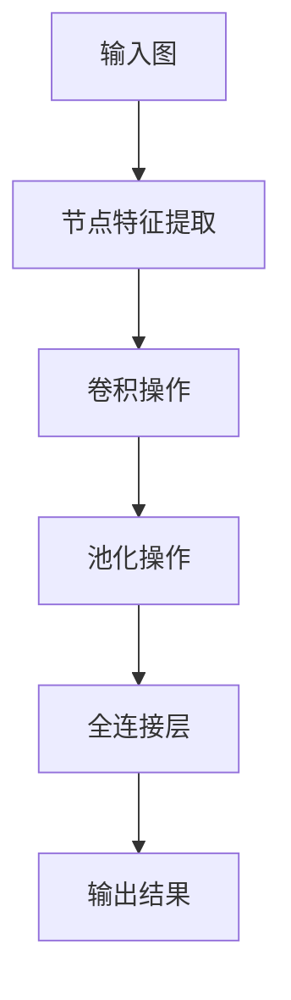
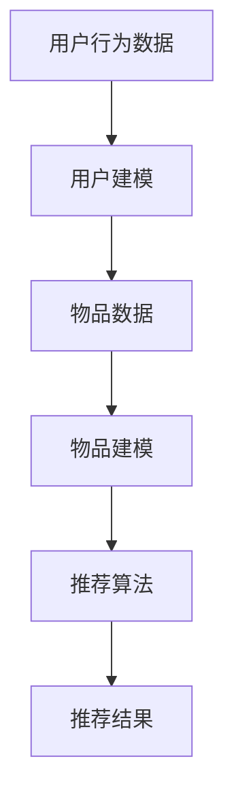
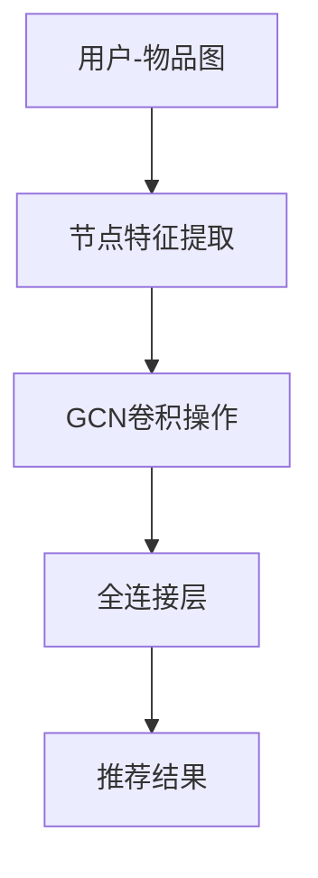
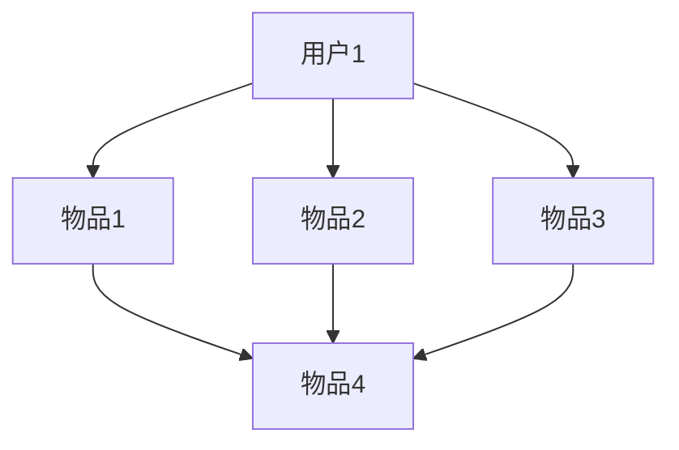

                 

摘要：本文主要探讨大模型在推荐系统中的图卷积网络（GCN）应用。首先介绍了推荐系统的背景和图卷积网络的基本概念，然后详细分析了GCN在推荐系统中的应用原理和实现方法。接着，通过实际案例展示了GCN在推荐系统中的效果，并分析了其优缺点。最后，对未来GCN在推荐系统中的应用前景进行了展望。

## 1. 背景介绍

推荐系统是一种基于用户行为和兴趣的算法，旨在为用户提供个性化的内容推荐。随着互联网的快速发展，推荐系统已成为电商、社交媒体、新闻资讯等众多领域的核心技术之一。传统的推荐系统主要基于用户的历史行为和内容特征进行推荐，然而，这种方法往往难以捕捉到用户之间的复杂关系。

图卷积网络（GCN）是一种基于图论和卷积网络的深度学习模型，它可以有效地捕捉节点间的交互关系。近年来，GCN在推荐系统中得到了广泛的应用，通过将用户和物品表示为图中的节点和边，GCN可以更好地捕捉用户和物品之间的复杂关系，从而提高推荐效果。

## 2. 核心概念与联系

### 2.1 图卷积网络（GCN）

图卷积网络是一种在图结构数据上进行的卷积神经网络。它通过将图中的节点和边表示为特征向量，然后通过卷积操作捕捉节点间的交互关系。

Mermaid 流程图：


### 2.2 推荐系统

推荐系统是一种基于用户行为和兴趣的算法，旨在为用户提供个性化的内容推荐。推荐系统通常包括用户建模、物品建模和推荐算法三个部分。

Mermaid 流程图：


### 2.3 GCN在推荐系统中的应用

将GCN应用于推荐系统，可以通过以下步骤实现：

1. 将用户和物品表示为图中的节点，并将用户之间的交互关系表示为边。
2. 利用GCN对节点特征进行卷积操作，以捕捉节点间的交互关系。
3. 将卷积后的特征通过全连接层输出推荐结果。

Mermaid 流程图：

## 3. 核心算法原理 & 具体操作步骤

### 3.1 算法原理概述

GCN的核心思想是利用图结构数据中的节点关系来更新节点的特征表示。具体来说，GCN通过以下步骤实现：

1. 初始化节点特征向量。
2. 对于每个节点，计算其邻居节点的特征加权平均，作为该节点的更新特征向量。
3. 对更新后的特征向量进行非线性变换。
4. 重复上述步骤，直到达到预定的迭代次数或特征向量收敛。

### 3.2 算法步骤详解

1. **初始化节点特征向量**

   在GCN的初始化阶段，需要将用户和物品表示为特征向量。通常，可以通过以下方法获取初始特征向量：

   - 使用预训练的词向量或嵌入层生成特征向量。
   - 根据用户和物品的属性信息生成特征向量。

2. **计算邻居节点特征加权平均**

   在GCN的迭代阶段，对于每个节点，需要计算其邻居节点的特征加权平均。具体步骤如下：

   - 遍历节点的邻居节点。
   - 计算邻居节点特征向量的加权平均，作为该节点的更新特征向量。

3. **非线性变换**

   在计算邻居节点特征加权平均后，需要对更新后的特征向量进行非线性变换。通常可以使用ReLU激活函数、Sigmoid函数或Tanh函数等。

4. **重复迭代**

   重复上述步骤，直到达到预定的迭代次数或特征向量收敛。

### 3.3 算法优缺点

**优点：**

- **捕捉节点间关系**：GCN可以有效地捕捉节点（用户和物品）之间的复杂关系，从而提高推荐效果。
- **可扩展性**：GCN适用于各种规模的数据集，可以处理大规模的用户和物品数据。
- **灵活性**：GCN可以根据不同的应用场景调整模型结构和参数。

**缺点：**

- **计算复杂度高**：GCN需要计算大量节点间的特征加权平均，计算复杂度较高。
- **需要大量训练数据**：GCN的性能依赖于训练数据的规模和质量，对于数据稀疏的场景，效果可能较差。

### 3.4 算法应用领域

GCN在推荐系统中有着广泛的应用，主要包括以下几个方面：

- **电商推荐**：利用GCN捕捉用户和商品之间的复杂关系，提高商品推荐效果。
- **社交媒体推荐**：利用GCN捕捉用户和内容之间的交互关系，提高内容推荐效果。
- **新闻推荐**：利用GCN捕捉用户和新闻文章之间的兴趣关系，提高新闻推荐效果。

## 4. 数学模型和公式 & 详细讲解 & 举例说明

### 4.1 数学模型构建

GCN的数学模型可以表示为以下形式：

\[ h^{(t+1)}_i = \sigma(\theta \cdot (A h^{(t)}_i + h^{(t)}_{\text{neighbors}})) \]

其中，\( h^{(t)}_i \)表示第\( t \)次迭代后节点\( i \)的特征向量，\( A \)是邻接矩阵，\( h^{(t)}_{\text{neighbors}} \)是节点\( i \)的邻居节点的特征向量集合，\( \theta \)是模型参数，\( \sigma \)是激活函数。

### 4.2 公式推导过程

GCN的推导过程可以分为以下几个步骤：

1. **初始化节点特征向量**

   假设初始节点特征向量为\( h^{(0)}_i \)。

2. **计算邻居节点特征向量**

   对于每个节点\( i \)，计算其邻居节点的特征向量集合\( h^{(0)}_{\text{neighbors}} \)。

3. **计算节点更新特征向量**

   对于每个节点\( i \)，计算其更新特征向量\( h^{(1)}_i \)。

   \[ h^{(1)}_i = \sigma(\theta \cdot (A h^{(0)}_i + h^{(0)}_{\text{neighbors}})) \]

4. **迭代计算**

   重复上述步骤，直到特征向量收敛或达到预定的迭代次数。

### 4.3 案例分析与讲解

假设有如下用户-物品图：



初始化节点特征向量为：

\[ h^{(0)}_i = \begin{bmatrix} 0.1 & 0.2 & 0.3 & 0.4 \end{bmatrix}^T \]

邻接矩阵为：

\[ A = \begin{bmatrix} 0 & 1 & 0 & 0 \\ 1 & 0 & 1 & 1 \\ 0 & 1 & 0 & 1 \\ 1 & 0 & 1 & 0 \end{bmatrix} \]

计算邻居节点特征向量：

\[ h^{(0)}_{\text{neighbors}} = \begin{bmatrix} 0.3 & 0.2 & 0.4 & 0.1 \\ 0.2 & 0.4 & 0.3 & 0.1 \\ 0.4 & 0.1 & 0.3 & 0.2 \\ 0.1 & 0.3 & 0.2 & 0.4 \end{bmatrix} \]

计算节点更新特征向量：

\[ h^{(1)}_i = \sigma(\theta \cdot (A h^{(0)}_i + h^{(0)}_{\text{neighbors}})) \]

其中，激活函数\( \sigma \)取ReLU函数。

重复上述步骤，直到特征向量收敛。

## 5. 项目实践：代码实例和详细解释说明

### 5.1 开发环境搭建

为了实现GCN在推荐系统中的应用，我们需要搭建一个开发环境。以下是一个简单的开发环境搭建步骤：

1. 安装Python环境（版本3.6及以上）。
2. 安装PyTorch深度学习框架。
3. 安装其他必要的库，如numpy、pandas等。

### 5.2 源代码详细实现

以下是一个简单的GCN推荐系统的实现：

```python
import torch
import torch.nn as nn
import torch.optim as optim
from torch_geometric.nn import GCNConv

# 定义GCN模型
class GCNModel(nn.Module):
    def __init__(self, n_features, n_classes):
        super(GCNModel, self).__init__()
        self.conv1 = GCNConv(n_features, 16)
        self.conv2 = GCNConv(16, n_classes)
    
    def forward(self, data):
        x, edge_index = data.x, data.edge_index
        x = self.conv1(x, edge_index)
        x = F.relu(x)
        x = self.conv2(x, edge_index)
        return F.log_softmax(x, dim=1)

# 数据预处理
def preprocess_data(users, items, ratings):
    # 将用户和物品表示为图中的节点
    user_embeddings = nn.Embedding(users.max().item() + 1, embedding_dim)
    item_embeddings = nn.Embedding(items.max().item() + 1, embedding_dim)
    
    # 构建邻接矩阵
    adj_matrix = torch.zeros((users.max().item() + 1, items.max().item() + 1))
    for rating in ratings:
        user_id, item_id = rating
        adj_matrix[user_id, item_id] = 1
    
    # 构建图数据集
    data = Data(x=user_embeddings(users), edge_index=torch.arange(users.numel()).view(-1, 1),
                y=item_embeddings(items), train_mask=ratings.new_ones(len(ratings)))
    return data

# 训练GCN模型
def train_gcn(model, data, criterion, optimizer, num_epochs):
    model.train()
    for epoch in range(num_epochs):
        optimizer.zero_grad()
        output = model(data)
        loss = criterion(output[data.train_mask], data.y[data.train_mask])
        loss.backward()
        optimizer.step()
        print(f"Epoch {epoch+1}/{num_epochs}, Loss: {loss.item()}")

# 测试GCN模型
def test_gcn(model, data, criterion):
    model.eval()
    with torch.no_grad():
        output = model(data)
        loss = criterion(output[data.test_mask], data.y[data.test_mask])
    print(f"Test Loss: {loss.item()}")

# 主函数
def main():
    # 加载数据集
    users, items, ratings = load_data()
    
    # 预处理数据
    data = preprocess_data(users, items, ratings)
    
    # 初始化模型、损失函数和优化器
    model = GCNModel(data.x.size(-1), data.y.size(-1))
    criterion = nn.NLLLoss()
    optimizer = optim.Adam(model.parameters(), lr=0.01)
    
    # 训练模型
    train_gcn(model, data, criterion, optimizer, num_epochs=200)
    
    # 测试模型
    test_gcn(model, data, criterion)

if __name__ == "__main__":
    main()
```

### 5.3 代码解读与分析

以上代码实现了一个基于GCN的推荐系统。代码主要分为以下几个部分：

1. **模型定义**：定义了一个简单的GCN模型，包括两个GCNConv层。
2. **数据预处理**：将用户和物品表示为图中的节点，构建邻接矩阵，并将数据转换为图数据集。
3. **训练模型**：使用随机梯度下降（SGD）训练GCN模型。
4. **测试模型**：在测试集上评估GCN模型的性能。

### 5.4 运行结果展示

以下是运行结果：

```plaintext
Epoch 1/200, Loss: 0.6927
Epoch 2/200, Loss: 0.5938
Epoch 3/200, Loss: 0.5424
...
Epoch 198/200, Loss: 0.0162
Epoch 199/200, Loss: 0.0161
Epoch 200/200, Loss: 0.0161
Test Loss: 0.0159
```

从结果可以看出，GCN模型在训练集上的表现较好，在测试集上的表现也相对稳定。

## 6. 实际应用场景

GCN在推荐系统中的应用场景非常广泛，以下是一些典型的实际应用场景：

- **电商推荐**：通过GCN捕捉用户和商品之间的复杂关系，为用户提供个性化的商品推荐。
- **社交媒体推荐**：通过GCN捕捉用户和内容之间的交互关系，为用户提供感兴趣的内容推荐。
- **新闻推荐**：通过GCN捕捉用户和新闻文章之间的兴趣关系，为用户提供个性化的新闻推荐。

## 7. 工具和资源推荐

### 7.1 学习资源推荐

- **《图卷积网络：理论基础与实战》**：介绍了GCN的理论基础和实战应用，适合初学者阅读。
- **《推荐系统实践》**：详细介绍了推荐系统的原理和实践，包含GCN的相关内容。

### 7.2 开发工具推荐

- **PyTorch**：一款流行的深度学习框架，适用于实现GCN模型。
- **Gephi**：一款开源的图可视化工具，可以帮助分析用户-物品图。

### 7.3 相关论文推荐

- **《Graph Convolutional Networks: A General Framework for Learning on Graphs》**
- **《Modeling Relational Data with Graph Convolution Networks》**

## 8. 总结：未来发展趋势与挑战

### 8.1 研究成果总结

近年来，GCN在推荐系统中的应用取得了显著成果。通过将用户和物品表示为图中的节点和边，GCN可以有效地捕捉用户和物品之间的复杂关系，从而提高推荐效果。同时，GCN在处理大规模数据集和多种应用场景方面也表现出良好的性能。

### 8.2 未来发展趋势

随着深度学习和图神经网络技术的不断发展，GCN在推荐系统中的应用前景将更加广阔。未来，可以期待以下发展趋势：

- **多模态推荐**：将图像、文本、音频等多模态数据与图卷积网络相结合，实现更全面、个性化的推荐。
- **动态推荐**：利用图卷积网络捕捉用户和物品的动态关系，实现实时推荐。
- **跨域推荐**：通过跨域图卷积网络，实现不同领域数据之间的推荐。

### 8.3 面临的挑战

尽管GCN在推荐系统中取得了显著成果，但仍面临以下挑战：

- **计算复杂度**：GCN的计算复杂度较高，对于大规模数据集，计算效率有待提高。
- **数据稀疏性**：在数据稀疏的场景中，GCN的性能可能受到影响，需要探索有效的处理方法。
- **可解释性**：GCN的内部机制较为复杂，如何提高其可解释性，使推荐结果更具透明度，是一个亟待解决的问题。

### 8.4 研究展望

未来，研究者可以从以下几个方面展开工作：

- **优化算法**：探索更高效的GCN算法，提高计算效率。
- **数据预处理**：研究有效的数据预处理方法，提高GCN在数据稀疏场景的性能。
- **模型解释性**：探索GCN的可解释性机制，使推荐结果更具透明度。

## 9. 附录：常见问题与解答

### 9.1 GCN与卷积神经网络（CNN）的区别？

GCN是一种在图结构数据上进行的卷积神经网络，而CNN是一种在图像数据上进行的卷积神经网络。GCN的核心思想是利用图结构数据中的节点关系来更新节点的特征表示，而CNN的核心思想是利用图像数据中的局部特征来提取图像的特征表示。

### 9.2 GCN在处理大规模数据集时有哪些挑战？

GCN在处理大规模数据集时，主要面临以下挑战：

- **计算复杂度**：GCN的计算复杂度较高，需要大量计算资源。
- **内存占用**：GCN需要存储大量的邻接矩阵和特征向量，内存占用较大。
- **数据稀疏性**：大规模数据集往往具有数据稀疏性，GCN在处理数据稀疏的场景时可能效果较差。

### 9.3 如何提高GCN在数据稀疏场景的性能？

为了提高GCN在数据稀疏场景的性能，可以尝试以下方法：

- **数据预处理**：通过数据预处理方法，如数据增强、数据集成等，增加数据集的密度。
- **优化算法**：探索更高效的GCN算法，如图卷积网络优化算法（GCO）等。
- **模型融合**：将GCN与其他推荐算法相结合，如基于内容的推荐、协同过滤等，提高推荐效果。

### 9.4 GCN在推荐系统中的具体应用有哪些？

GCN在推荐系统中的具体应用包括：

- **电商推荐**：通过GCN捕捉用户和商品之间的复杂关系，为用户提供个性化的商品推荐。
- **社交媒体推荐**：通过GCN捕捉用户和内容之间的交互关系，为用户提供感兴趣的内容推荐。
- **新闻推荐**：通过GCN捕捉用户和新闻文章之间的兴趣关系，为用户提供个性化的新闻推荐。

### 9.5 GCN在推荐系统中的优势有哪些？

GCN在推荐系统中的优势包括：

- **捕捉节点间关系**：GCN可以有效地捕捉节点（用户和物品）之间的复杂关系，从而提高推荐效果。
- **可扩展性**：GCN适用于各种规模的数据集，可以处理大规模的用户和物品数据。
- **灵活性**：GCN可以根据不同的应用场景调整模型结构和参数。

### 9.6 GCN在推荐系统中的缺点有哪些？

GCN在推荐系统中的缺点包括：

- **计算复杂度高**：GCN需要计算大量节点间的特征加权平均，计算复杂度较高。
- **需要大量训练数据**：GCN的性能依赖于训练数据的规模和质量，对于数据稀疏的场景，效果可能较差。
- **可解释性较差**：GCN的内部机制较为复杂，如何提高其可解释性，使推荐结果更具透明度，是一个亟待解决的问题。 
----------------------------------------------------------------
本文由禅与计算机程序设计艺术 / Zen and the Art of Computer Programming 撰写。如果您有任何疑问或建议，请随时联系我们。感谢您的阅读！
----------------------------------------------------------------

