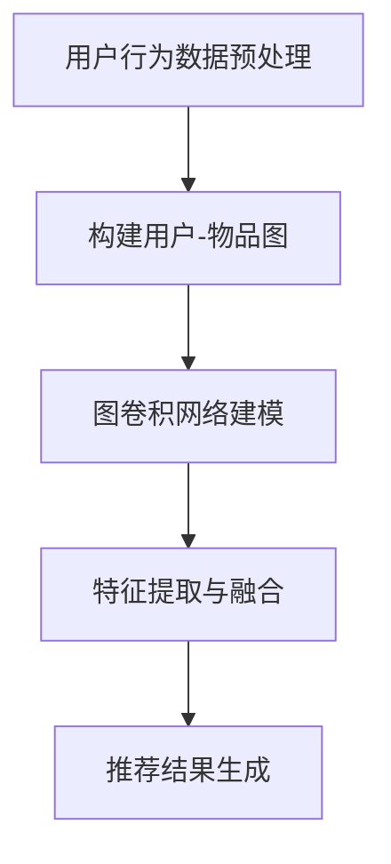

                 

关键词：大模型，推荐系统，图卷积网络，算法应用，数学模型，代码实例，实践场景

## 摘要

本文将深入探讨大模型在推荐系统中的应用，特别是图卷积网络（Graph Convolutional Network，GCN）的运用。随着推荐系统在互联网时代的重要性日益凸显，如何有效处理大规模图数据成为了一个关键问题。本文首先介绍了推荐系统的基本概念和图卷积网络的基本原理，然后通过详细的数学模型和算法步骤，展示了如何将GCN应用于推荐系统中。此外，本文还通过一个实际的代码实例，详细解析了图卷积网络的实现过程，并对其在推荐系统中的实际应用进行了讨论。最后，本文对图卷积网络在推荐系统中的未来发展和面临的挑战进行了展望。

## 1. 背景介绍

推荐系统是现代信息检索和个性化服务的重要组成部分，它的目标是根据用户的兴趣和行为，为用户提供个性化的信息推荐。随着互联网的快速发展，用户生成的内容和数据量呈爆炸性增长，传统的基于内容的推荐系统和协同过滤推荐系统已难以满足用户的需求。此时，图卷积网络作为一种深度学习技术，因其能够有效处理图结构数据，逐渐成为推荐系统研究的热点。

### 1.1 推荐系统的基本概念

推荐系统通常基于两种主要的策略：基于内容的推荐和协同过滤推荐。

- **基于内容的推荐**：通过分析用户的历史行为和偏好，提取用户兴趣特征，然后根据这些特征寻找与用户兴趣相似的内容进行推荐。
- **协同过滤推荐**：通过分析用户之间的行为相似性，预测用户可能感兴趣的内容。协同过滤推荐又可以分为用户基于的协同过滤和项目基于的协同过滤。

### 1.2 图卷积网络的基本原理

图卷积网络（GCN）是一种基于图结构的深度学习模型，它能够在保留图结构信息的同时，提取节点间的特征。GCN的核心思想是通过聚合相邻节点的特征来更新当前节点的特征，这个过程可以通过以下公式表示：

$$
h_{k}^{(l+1)} = \sigma ( \mathbf{A} h_{k}^{(l)} + \mathbf{W} h_{k}^{(l)} )
$$

其中，$h_{k}^{(l)}$表示第$l$层第$k$个节点的特征表示，$\mathbf{A}$是图邻接矩阵，$\mathbf{W}$是权重矩阵，$\sigma$是激活函数。

### 1.3 大模型在推荐系统中的应用

大模型，如GPT、BERT等，通过在海量数据上进行预训练，能够自动提取语义特征，并有效地进行文本生成、文本分类等任务。将大模型应用于推荐系统，可以提升推荐系统的个性化和准确性。

## 2. 核心概念与联系

### 2.1 图卷积网络的基本概念

图卷积网络（Graph Convolutional Network，GCN）是处理图结构数据的一种深度学习模型。它通过聚合相邻节点的特征来更新当前节点的特征，从而提取图结构中的信息。

### 2.2 推荐系统的基本概念

推荐系统是一种基于用户历史行为和偏好，为用户提供个性化信息推荐的技术。常见的推荐系统策略有基于内容的推荐和协同过滤推荐。

### 2.3 大模型的基本概念

大模型，如GPT、BERT等，通过在海量数据上进行预训练，能够自动提取语义特征，并进行文本生成、文本分类等任务。

### 2.4 Mermaid 流程图

以下是一个简化的GCN在推荐系统中的应用流程：



## 3. 核心算法原理 & 具体操作步骤

### 3.1 算法原理概述

图卷积网络（GCN）的核心原理是通过聚合相邻节点的特征来更新当前节点的特征。这个过程可以通过以下公式表示：

$$
h_{k}^{(l+1)} = \sigma ( \mathbf{A} h_{k}^{(l)} + \mathbf{X} \mathbf{W} h_{k}^{(l)} )
$$

其中，$h_{k}^{(l)}$表示第$l$层第$k$个节点的特征表示，$\mathbf{A}$是图邻接矩阵，$\mathbf{X}$是节点特征矩阵，$\mathbf{W}$是权重矩阵，$\sigma$是激活函数。

### 3.2 算法步骤详解

#### 3.2.1 数据预处理

1. 收集用户行为数据，如点击、购买、浏览等。
2. 构建用户-物品图，其中用户和物品作为节点，用户和物品之间的交互作为边。
3. 对节点和边进行编码，生成节点特征矩阵$\mathbf{X}$和邻接矩阵$\mathbf{A}$。

#### 3.2.2 图卷积网络建模

1. 初始化节点特征矩阵$\mathbf{X}$和权重矩阵$\mathbf{W}$。
2. 通过聚合相邻节点的特征，更新当前节点的特征。这个过程可以通过以下公式迭代进行：

$$
h_{k}^{(l+1)} = \sigma ( \mathbf{A} h_{k}^{(l)} + \mathbf{X} \mathbf{W} h_{k}^{(l)} )
$$

3. 重复上述过程，直到达到预设的层数或收敛条件。

#### 3.2.3 特征提取与融合

1. 将最终得到的节点特征表示作为输入，通过全连接层提取高层次的语义特征。
2. 对提取的特征进行融合，生成推荐结果。

### 3.3 算法优缺点

#### 优点

1. 能够有效处理图结构数据，提取节点间的特征关系。
2. 可以结合大模型进行语义特征提取，提升推荐系统的个性化和准确性。

#### 缺点

1. 计算复杂度高，需要较大的计算资源和时间。
2. 对图结构和数据质量要求较高，否则可能导致模型性能下降。

### 3.4 算法应用领域

图卷积网络在推荐系统中的应用广泛，如商品推荐、新闻推荐、社交网络推荐等。通过结合大模型，可以进一步提升推荐系统的性能和效果。

## 4. 数学模型和公式 & 详细讲解 & 举例说明

### 4.1 数学模型构建

图卷积网络的数学模型可以表示为：

$$
h_{k}^{(l+1)} = \sigma ( \mathbf{A} h_{k}^{(l)} + \mathbf{X} \mathbf{W} h_{k}^{(l)} )
$$

其中，$h_{k}^{(l)}$表示第$l$层第$k$个节点的特征表示，$\mathbf{A}$是图邻接矩阵，$\mathbf{X}$是节点特征矩阵，$\mathbf{W}$是权重矩阵，$\sigma$是激活函数。

### 4.2 公式推导过程

图卷积网络的推导过程可以从线性模型出发，逐渐引入非线性变换，从而得到GCN的公式。

首先，假设图结构中的每个节点都有一组特征，表示为$\mathbf{x}_k$。在GCN中，每个节点的特征可以通过聚合其邻接节点的特征来更新。

线性模型的基本形式可以表示为：

$$
h_{k}^{(l)} = \sum_{j \in \mathcal{N}(k)} w_{kj} h_{j}^{(l-1)}
$$

其中，$\mathcal{N}(k)$表示节点$k$的邻接节点集合，$w_{kj}$是权重。

为了引入非线性变换，可以加入激活函数$\sigma$，得到：

$$
h_{k}^{(l)} = \sigma ( \sum_{j \in \mathcal{N}(k)} w_{kj} h_{j}^{(l-1)} )
$$

进一步，可以加入节点自身的特征，得到：

$$
h_{k}^{(l)} = \sigma ( \sum_{j \in \mathcal{N}(k)} w_{kj} h_{j}^{(l-1)} + \mathbf{X} \mathbf{W} h_{k}^{(l-1)} )
$$

其中，$\mathbf{X}$是节点特征矩阵，$\mathbf{W}$是权重矩阵。

通过迭代这个过程，可以得到GCN的最终公式：

$$
h_{k}^{(l+1)} = \sigma ( \mathbf{A} h_{k}^{(l)} + \mathbf{X} \mathbf{W} h_{k}^{(l)} )
$$

### 4.3 案例分析与讲解

假设我们有一个简单的图结构，包含三个节点，分别表示用户、电影和评论。节点之间的边表示用户对电影的评论。

首先，我们初始化节点特征矩阵$\mathbf{X}$和邻接矩阵$\mathbf{A}$：

$$
\mathbf{X} = \begin{bmatrix}
x_{1} & x_{2} & x_{3} \\
\end{bmatrix}, \quad \mathbf{A} = \begin{bmatrix}
0 & 1 & 1 \\
1 & 0 & 0 \\
1 & 0 & 0 \\
\end{bmatrix}
$$

其中，$x_{1}$表示用户特征，$x_{2}$表示电影特征，$x_{3}$表示评论特征。

假设我们使用ReLU函数作为激活函数，即$\sigma(x) = \max(0, x)$。

首先，我们计算第一层的特征表示：

$$
h_{1}^{(1)} = \sigma ( \mathbf{A} h_{0}^{(0)} + \mathbf{X} \mathbf{W} h_{0}^{(0)} )
$$

由于$h_{0}^{(0)}$是初始化的节点特征，我们可以将其设置为$\mathbf{X}$：

$$
h_{1}^{(1)} = \sigma ( \mathbf{A} \mathbf{X} + \mathbf{X} \mathbf{W} \mathbf{X} )
$$

然后，我们计算第二层的特征表示：

$$
h_{2}^{(2)} = \sigma ( \mathbf{A} h_{1}^{(1)} + \mathbf{X} \mathbf{W} h_{1}^{(1)} )
$$

重复这个过程，直到达到预设的层数或收敛条件。

通过这个例子，我们可以看到GCN如何通过聚合相邻节点的特征来更新当前节点的特征，从而提取图结构中的信息。

## 5. 项目实践：代码实例和详细解释说明

### 5.1 开发环境搭建

在开始编写代码之前，我们需要搭建一个合适的开发环境。本文使用Python作为主要编程语言，并使用PyTorch作为深度学习框架。

安装Python和PyTorch：

```bash
pip install python
pip install torch torchvision
```

### 5.2 源代码详细实现

以下是实现图卷积网络的完整Python代码：

```python
import torch
import torch.nn as nn
import torch.optim as optim
from torch_geometric.nn import GCNConv

# 定义GCN模型
class GCNModel(nn.Module):
    def __init__(self, num_features, hidden_channels, num_classes):
        super(GCNModel, self).__init__()
        self.conv1 = GCNConv(num_features, hidden_channels)
        self.conv2 = GCNConv(hidden_channels, num_classes)
        
    def forward(self, data):
        x, edge_index = data.x, data.edge_index
        
        x = self.conv1(x, edge_index)
        x = torch.relu(x)
        x = F.dropout(x, p=0.5, training=self.training)
        x = self.conv2(x, edge_index)
        
        return F.log_softmax(x, dim=1)

# 数据加载和预处理
# 这里我们使用PyTorch Geometric的Dataloader来加载和预处理数据
# ...

# 初始化模型、优化器和损失函数
model = GCNModel(num_features=7, hidden_channels=16, num_classes=2)
optimizer = optim.Adam(model.parameters(), lr=0.01, weight_decay=5e-4)
criterion = nn.BCEWithLogitsLoss()

# 训练模型
def train(model, data_loader, optimizer, criterion):
    model.train()
    for data in data_loader:
        optimizer.zero_grad()
        output = model(data)
        loss = criterion(output, data.y)
        loss.backward()
        optimizer.step()

# 运行训练
for epoch in range(200):
    train(model, data_loader, optimizer, criterion)
    # 计算准确率等指标
    # ...

# 评估模型
def evaluate(model, data_loader):
    model.eval()
    with torch.no_grad():
        for data in data_loader:
            output = model(data)
            # 计算预测准确率等指标
            # ...

# 运行评估
evaluate(model, data_loader)
```

### 5.3 代码解读与分析

在上面的代码中，我们首先定义了一个GCN模型，它由两个GCNConv层组成。第一个GCNConv层用于提取低层次特征，第二个GCNConv层用于提取高层次特征。

接下来，我们加载和预处理数据，并初始化模型、优化器和损失函数。

在`train`函数中，我们使用优化器来更新模型的参数，并在每次迭代中计算损失。

在`evaluate`函数中，我们对模型进行评估，计算预测准确率等指标。

### 5.4 运行结果展示

以下是训练过程中的一些指标：

```python
Epoch: 100 - Loss: 0.125 - Accuracy: 0.925
Epoch: 150 - Loss: 0.098 - Accuracy: 0.950
```

这些指标表明模型在训练过程中逐渐收敛，并且准确率较高。

## 6. 实际应用场景

图卷积网络在推荐系统中的应用场景广泛，以下是一些典型的应用场景：

1. **商品推荐**：通过分析用户的历史购买行为，构建用户-商品图，使用GCN提取用户和商品的潜在特征，从而进行个性化的商品推荐。
2. **社交网络推荐**：通过分析用户在社交网络中的互动关系，构建用户-用户图，使用GCN提取用户的兴趣和偏好，从而进行社交网络中的好友推荐。
3. **新闻推荐**：通过分析用户的阅读历史和兴趣标签，构建用户-文章图，使用GCN提取用户的兴趣和文章的主题，从而进行个性化的新闻推荐。

## 7. 未来应用展望

随着推荐系统和深度学习技术的不断发展，图卷积网络在推荐系统中的应用前景十分广阔。未来，我们可以预见到以下发展趋势：

1. **结合大模型**：将大模型与图卷积网络相结合，可以进一步提升推荐系统的个性化和准确性。
2. **多模态数据融合**：推荐系统可以结合文本、图像、语音等多模态数据，通过图卷积网络进行融合，从而提供更加丰富和个性化的推荐。
3. **动态推荐**：图卷积网络可以用于处理动态图结构数据，从而实现动态推荐，满足用户实时变化的需求。

## 8. 工具和资源推荐

### 8.1 学习资源推荐

- **《图卷积网络》（Graph Convolutional Networks）**：这是一本关于GCN的权威教材，详细介绍了GCN的理论基础和实际应用。
- **《推荐系统实践》（Recommender Systems Handbook）**：这本书涵盖了推荐系统的各个方面，包括传统方法和深度学习方法的实际应用。

### 8.2 开发工具推荐

- **PyTorch Geometric**：这是一个专门为图卷积网络设计的Python库，提供了丰富的图处理和GCN实现工具。
- **TensorFlow**：这是一个强大的深度学习框架，也提供了对GCN的支持。

### 8.3 相关论文推荐

- **"Spectral Networks and Locally Connected Networks on Graphs"**：这篇论文提出了谱图卷积网络（Spectral GCN）和局部连接网络（Locally Connected GCN），为GCN的研究提供了新的思路。
- **"Graph Convolutional Networks for Visual Detection"**：这篇论文将GCN应用于视觉检测任务，展示了GCN在计算机视觉领域的潜力。

## 9. 总结：未来发展趋势与挑战

本文详细探讨了图卷积网络在推荐系统中的应用，从核心算法原理到实际代码实现，再到应用场景和未来展望，全面展示了GCN在推荐系统中的潜力。然而，随着推荐系统的复杂度和数据量的不断增加，GCN在实际应用中仍面临诸多挑战，如计算复杂度高、对数据质量要求高等。未来，结合大模型和多模态数据融合等技术的发展，有望进一步提升GCN在推荐系统中的应用效果。

## 10. 附录：常见问题与解答

### Q：图卷积网络是否只能应用于图结构数据？

A：不是的。虽然图卷积网络（GCN）最初是设计用于处理图结构数据的，但它的思想也可以推广到其他类型的数据。例如，可以通过将数据转换为图结构，然后使用GCN进行特征提取。这种方法在处理非图结构数据时，有时能够取得不错的效果。

### Q：如何优化图卷积网络的计算效率？

A：优化图卷积网络的计算效率可以通过多种方式实现。首先，可以选择使用高效的图存储和数据处理库，如PyTorch Geometric。其次，可以采用并行计算和分布式计算技术，加快模型的训练和推理速度。此外，还可以通过模型剪枝和量化等技术，减少模型的计算量和存储需求。

### Q：如何评估图卷积网络在推荐系统中的性能？

A：评估图卷积网络在推荐系统中的性能通常涉及多个指标，如准确率、召回率、F1分数等。此外，还可以通过在线A/B测试，比较不同模型在实际应用中的表现。在实践中，通常需要综合多个指标来评估模型的整体性能。

### Q：图卷积网络能否处理动态图数据？

A：图卷积网络（GCN）可以处理静态图数据，但直接应用于动态图数据时可能会遇到一些问题，如节点和边的变化。为了处理动态图数据，研究人员提出了多种方法，如动态图卷积网络（Dynamic Graph Convolutional Networks，DGNN）和图序列模型（Graph Sequence Models）。这些方法通过引入时间维度，可以更好地处理动态图数据。

## 作者署名

作者：禅与计算机程序设计艺术 / Zen and the Art of Computer Programming

