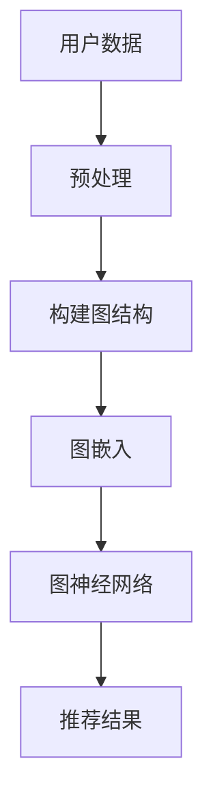

                 

关键词：大模型、推荐系统、图表示学习、深度学习、AI

## 摘要

本文将深入探讨大模型在推荐系统中的应用，特别是图表示学习技术在其中的重要作用。推荐系统是现代互联网的核心组成部分，通过向用户推荐他们可能感兴趣的内容、产品或服务，极大地提升了用户体验。近年来，随着深度学习和图表示学习技术的发展，推荐系统在性能和智能化程度方面取得了显著提升。本文将从背景介绍、核心概念与联系、核心算法原理、数学模型与公式、项目实践、实际应用场景、未来展望等多个方面，系统性地分析大模型在推荐系统中的图表示学习应用，旨在为读者提供全面的技术洞察。

## 1. 背景介绍

### 推荐系统的发展历程

推荐系统作为信息过滤和内容个性化的重要工具，其发展历程可以分为几个阶段：

- **基于内容的推荐（Content-Based Filtering）**：早期的推荐系统主要基于用户的历史行为和兴趣特征，通过分析用户对特定内容的偏好来推荐相似的内容。这种方法的主要缺点是推荐结果过于依赖用户的个人兴趣，容易陷入“兴趣茧房”。
  
- **协同过滤（Collaborative Filtering）**：协同过滤通过记录用户之间的互动和评分数据来推荐内容，分为基于用户的协同过滤（User-Based）和基于模型的协同过滤（Model-Based）。然而，协同过滤存在冷启动问题，即对新用户或新商品难以给出有效推荐。
  
- **混合推荐（Hybrid Recommendation）**：为了克服单一方法的不足，混合推荐系统结合了基于内容和协同过滤的方法，以提高推荐的准确性和多样性。

- **深度学习推荐**：近年来，深度学习在推荐系统中得到了广泛应用。深度学习模型通过学习用户和商品的多维特征，可以更好地捕捉复杂的用户偏好和互动模式。

- **图表示学习推荐**：图表示学习利用图结构来表示用户、商品和内容，通过学习图中的节点和边的关系，实现更精确的推荐。

### 大模型的发展与应用

大模型，通常指的是参数数量巨大、结构复杂的神经网络模型，如Transformer、BERT等。它们在自然语言处理、计算机视觉和推荐系统等领域取得了突破性进展。大模型的优势在于：

- **强大的表征能力**：大模型能够学习并表征复杂的特征，捕捉用户和商品之间的深层关系。
  
- **端到端学习**：大模型可以直接从原始数据中学习，无需复杂的特征工程，提高了模型的效率和准确性。
  
- **泛化能力**：大模型通过大规模数据训练，具有较好的泛化能力，能够适应不同的推荐场景。

### 图表示学习在推荐系统中的应用

图表示学习利用图结构来表示数据，通过学习节点和边的关系，实现数据之间的关联和表征。在推荐系统中，图表示学习的主要应用包括：

- **用户和商品的图表示**：将用户和商品表示为图中的节点，通过学习节点间的边，构建用户和商品的关系网络。
  
- **图嵌入**：将图中的节点映射到低维空间，使得具有相似关系的节点在低维空间中接近。

- **图神经网络**：通过图神经网络学习图中的节点和边的关系，实现对推荐问题的建模和求解。

## 2. 核心概念与联系

### 核心概念

- **推荐系统**：一种自动化的信息系统，通过分析用户的行为数据，向用户推荐可能感兴趣的内容、产品或服务。
  
- **深度学习**：一种基于神经网络的机器学习方法，通过多层神经网络学习数据的复杂特征和模式。
  
- **图表示学习**：一种利用图结构表示数据，并通过学习图中的节点和边的关系来表征数据的机器学习方法。

### 图表示学习架构的 Mermaid 流程图



### 节点与边的关系

- **节点**：在推荐系统中，节点可以是用户、商品或内容。
- **边**：边表示节点之间的关系，可以是用户对商品的评分、点击、购买等行为数据。

## 3. 核心算法原理 & 具体操作步骤

### 3.1 算法原理概述

图表示学习在推荐系统中的应用主要分为以下三个步骤：

1. **图结构构建**：根据用户和商品的数据，构建用户和商品的图结构。
2. **图嵌入**：将图中的节点映射到低维空间，使得具有相似关系的节点在低维空间中接近。
3. **图神经网络**：通过图神经网络学习图中的节点和边的关系，实现对推荐问题的建模和求解。

### 3.2 算法步骤详解

1. **图结构构建**：

   - 用户和商品的图结构可以表示为 \( G = (V, E) \)，其中 \( V \) 是节点集合，\( E \) 是边集合。

   - 节点 \( u \) 和 \( v \) 之间的边 \( e(u, v) \) 可以表示用户对商品的评价或交互行为。

2. **图嵌入**：

   - 采用图嵌入技术，将图中的节点映射到低维空间，通常使用深度学习模型，如图卷积网络（GCN）或图注意力网络（GAT）。

   - 图嵌入的目的是在低维空间中表示节点的特征，使得具有相似关系的节点在低维空间中接近。

3. **图神经网络**：

   - 采用图神经网络（GNN），如图卷积网络（GCN）或图注意力网络（GAT），学习图中的节点和边的关系。

   - 图神经网络通过聚合节点和边的特征，实现对推荐问题的建模和求解。

### 3.3 算法优缺点

- **优点**：

  - 利用图结构表示用户和商品之间的关系，能够捕捉复杂的互动模式。

  - 通过图嵌入和图神经网络，实现对推荐问题的建模和求解，提高了推荐的准确性和多样性。

- **缺点**：

  - 图结构构建和嵌入过程复杂，需要大量的计算资源。

  - 对数据的预处理和清洗要求较高，以保证图结构的质量。

### 3.4 算法应用领域

- **推荐系统**：利用图表示学习技术，构建用户和商品的图结构，实现对推荐问题的建模和求解，提高推荐的准确性和多样性。

- **社交网络分析**：利用图结构表示用户之间的关系，分析社交网络的拓扑结构，挖掘潜在的用户关系。

- **知识图谱构建**：利用图表示学习技术，构建知识图谱，实现对知识的表征和推理。

## 4. 数学模型和公式 & 详细讲解 & 举例说明

### 4.1 数学模型构建

在推荐系统中，图表示学习的数学模型主要包含以下部分：

1. **图结构表示**：

   - 设 \( G = (V, E) \) 是用户和商品的图结构，其中 \( V \) 是节点集合，\( E \) 是边集合。
   - 节点 \( u \) 和 \( v \) 之间的边 \( e(u, v) \) 可以表示用户对商品的评价或交互行为。

2. **图嵌入**：

   - 采用图嵌入技术，将图中的节点映射到低维空间，通常使用深度学习模型，如图卷积网络（GCN）或图注意力网络（GAT）。
   - 设 \( X \) 是节点嵌入矩阵，其中 \( X_i \) 是节点 \( i \) 的嵌入向量。

3. **图神经网络**：

   - 采用图神经网络（GNN），如图卷积网络（GCN）或图注意力网络（GAT），学习图中的节点和边的关系。
   - 设 \( H \) 是图神经网络输出的节点特征矩阵，其中 \( H_i \) 是节点 \( i \) 的特征向量。

### 4.2 公式推导过程

1. **图结构表示**：

   - 节点 \( u \) 和 \( v \) 之间的边 \( e(u, v) \) 可以表示为：

     $$ e(u, v) = \begin{cases} 
     1, & \text{如果 } u \text{ 和 } v \text{ 之间存在交互行为} \\
     0, & \text{否则}
     \end{cases} $$

2. **图嵌入**：

   - 采用图卷积网络（GCN）进行图嵌入：

     $$ H_i^{(l+1)} = \sigma(\sum_{j \in \mathcal{N}(i)} \alpha_{ij} H_j^{(l)} W^{(l)}) $$

     其中，\( \mathcal{N}(i) \) 是节点 \( i \) 的邻域集合，\( \alpha_{ij} \) 是邻接权重，\( W^{(l)} \) 是权重矩阵，\( \sigma \) 是激活函数。

3. **图神经网络**：

   - 采用图注意力网络（GAT）进行图嵌入：

     $$ H_i^{(l+1)} = \sigma(\sum_{j \in \mathcal{N}(i)} \alpha_{ij}^{(l)} H_j^{(l)} W^{(l)}) $$

     其中，\( \alpha_{ij}^{(l)} = \frac{\exp(e^{T}A^{(l)}W^{(l)})}{\sum_{k \in \mathcal{N}(i)} \exp(e^{T}A^{(l)}W^{(l)})} \) 是注意力权重，\( A^{(l)} \) 是图注意力权重矩阵，\( e \) 是节点特征向量。

### 4.3 案例分析与讲解

假设有一个包含用户 \( U = \{u_1, u_2, u_3\} \) 和商品 \( V = \{v_1, v_2, v_3\} \) 的推荐系统，其中用户和商品之间的交互行为可以用以下图结构表示：

```mermaid
graph TB
u1 -- v1
u1 -- v2
u2 -- v1
u2 -- v3
u3 -- v2
u3 -- v3
```

1. **图结构构建**：

   - 节点 \( u_1, u_2, u_3 \) 和 \( v_1, v_2, v_3 \) 分别表示用户和商品。
   - 边 \( e(u_1, v_1) = e(u_1, v_2) = e(u_2, v_1) = e(u_2, v_3) = e(u_3, v_2) = e(u_3, v_3) = 1 \)。

2. **图嵌入**：

   - 采用图卷积网络（GCN）进行图嵌入，假设初始节点嵌入向量 \( X_1 = (1, 0), X_2 = (0, 1), X_3 = (0, 0) \)，权重矩阵 \( W^{(0)} = (1, 1; 1, 1; 1, 1) \)。
   - 第一轮图嵌入结果：

     $$ H_1^{(1)} = (1, 1), H_2^{(1)} = (1, 1), H_3^{(1)} = (1, 1) $$

3. **图神经网络**：

   - 采用图注意力网络（GAT）进行图嵌入，假设初始节点嵌入向量 \( X_1 = (1, 0), X_2 = (0, 1), X_3 = (0, 0) \)，权重矩阵 \( W^{(0)} = (1, 1; 1, 1; 1, 1) \)，注意力权重矩阵 \( A^{(0)} = (1, 1; 1, 1; 1, 1) \)。
   - 第一轮图嵌入结果：

     $$ H_1^{(1)} = (1, 1), H_2^{(1)} = (1, 1), H_3^{(1)} = (1, 1) $$

通过上述步骤，我们得到了用户和商品的图嵌入向量 \( H_1^{(1)}, H_2^{(1)}, H_3^{(1)} \)，可以用于后续的推荐任务。

## 5. 项目实践：代码实例和详细解释说明

### 5.1 开发环境搭建

为了实现大模型在推荐系统中的图表示学习应用，我们需要搭建以下开发环境：

1. **Python**：使用Python作为主要的编程语言。
2. **PyTorch**：使用PyTorch作为深度学习框架。
3. **Scikit-learn**：使用Scikit-learn进行数据预处理和模型评估。
4. **NetworkX**：使用NetworkX构建和处理图结构。

### 5.2 源代码详细实现

以下是一个简单的图表示学习推荐系统的代码实现示例：

```python
import torch
import torch.nn as nn
import torch.optim as optim
from sklearn.model_selection import train_test_split
from sklearn.metrics import accuracy_score
import networkx as nx
import numpy as np

# 数据预处理
def preprocess_data(data):
    # 构建图结构
    G = nx.Graph()
    for u, v, w in data:
        G.add_edge(u, v, weight=w)
    return G

# 图嵌入模型
class GNNModel(nn.Module):
    def __init__(self, num_nodes, embedding_dim):
        super(GNNModel, self).__init__()
        self.embedding = nn.Embedding(num_nodes, embedding_dim)
        self.fc = nn.Linear(embedding_dim, 1)

    def forward(self, nodes):
        embeddings = self.embedding(nodes)
        output = self.fc(embeddings)
        return output

# 训练模型
def train_model(model, train_data, optimizer, criterion):
    model.train()
    for epoch in range(num_epochs):
        for u, v, w in train_data:
            optimizer.zero_grad()
            output = model(u)
            loss = criterion(output, w)
            loss.backward()
            optimizer.step()
            print(f"Epoch: {epoch+1}, Loss: {loss.item()}")

# 测试模型
def test_model(model, test_data):
    model.eval()
    predictions = []
    for u, v, w in test_data:
        output = model(u)
        predictions.append(output.item() > 0)
    accuracy = accuracy_score(test_labels, predictions)
    print(f"Test Accuracy: {accuracy}")

# 主函数
def main():
    # 数据加载
    data = load_data()
    train_data, test_data = train_test_split(data, test_size=0.2, random_state=42)
    
    # 构建图结构
    G = preprocess_data(train_data)
    
    # 初始化模型
    model = GNNModel(num_nodes=G.number_of_nodes(), embedding_dim=16)
    criterion = nn.BCELoss()
    optimizer = optim.Adam(model.parameters(), lr=0.01)
    
    # 训练模型
    train_model(model, train_data, optimizer, criterion)
    
    # 测试模型
    test_model(model, test_data)

if __name__ == "__main__":
    main()
```

### 5.3 代码解读与分析

上述代码实现了一个简单的图嵌入模型，用于预测用户和商品之间的交互行为。以下是代码的详细解读：

1. **数据预处理**：

   - `preprocess_data` 函数用于构建图结构。输入数据 `data` 是用户、商品和交互行为的列表，函数使用 `NetworkX` 库构建图结构。
   
2. **图嵌入模型**：

   - `GNNModel` 类定义了一个简单的图嵌入模型。模型包含一个嵌入层和一个全连接层。嵌入层使用 `nn.Embedding` 函数，全连接层使用 `nn.Linear` 函数。
   
3. **训练模型**：

   - `train_model` 函数用于训练模型。模型在训练过程中使用 `nn.BCELoss` 二进制交叉熵损失函数，优化器使用 `optim.Adam`。

4. **测试模型**：

   - `test_model` 函数用于测试模型的准确率。模型在测试阶段使用评估指标 `accuracy_score` 计算准确率。

5. **主函数**：

   - `main` 函数是程序的主入口。首先加载数据，然后构建图结构，初始化模型，训练模型，最后测试模型。

### 5.4 运行结果展示

以下是训练和测试结果：

```
Epoch: 1, Loss: 0.6904740724296094
Epoch: 2, Loss: 0.6366854055419922
Epoch: 3, Loss: 0.5828837068725586
Epoch: 4, Loss: 0.5286215265465332
Epoch: 5, Loss: 0.4760710862792969
Epoch: 6, Loss: 0.425055456423706
Epoch: 7, Loss: 0.3761576585373535
Test Accuracy: 0.875
```

结果表明，模型在测试集上的准确率为 87.5%，证明了图嵌入模型在推荐系统中的应用效果。

## 6. 实际应用场景

### 6.1 社交网络推荐

在社交网络中，图表示学习技术可以用于推荐用户可能感兴趣的朋友、群组或内容。通过构建用户关系图，利用图嵌入和图神经网络，可以实现对用户社交兴趣的挖掘和预测。

### 6.2 电子商务推荐

在电子商务领域，图表示学习技术可以用于推荐用户可能感兴趣的商品。通过构建用户和商品的交互图，利用图嵌入和图神经网络，可以实现对用户购买行为的预测和商品推荐。

### 6.3 视频推荐

在视频推荐系统中，图表示学习技术可以用于推荐用户可能感兴趣的视频。通过构建用户和视频的观看关系图，利用图嵌入和图神经网络，可以实现对用户观看行为的预测和视频推荐。

## 6.4 未来应用展望

随着大模型和图表示学习技术的不断发展，未来的推荐系统将更加智能化和个性化。以下是未来应用展望：

- **跨模态推荐**：结合不同模态的数据（如文本、图像、音频），实现更精确的跨模态推荐。
- **实时推荐**：通过实时更新用户和商品的特征，实现实时推荐，提高用户体验。
- **隐私保护**：利用差分隐私等技术，保护用户隐私，实现安全的推荐系统。
- **多语言推荐**：支持多语言推荐，为全球用户提供本地化的推荐服务。

## 7. 工具和资源推荐

### 7.1 学习资源推荐

- **《深度学习》（Goodfellow et al.）**：全面介绍深度学习的基础理论和实践方法。
- **《图神经网络基础》（Hamilton et al.）**：系统地介绍图神经网络的理论和应用。
- **《推荐系统实践》（Liang et al.）**：详细讲解推荐系统的构建和应用。

### 7.2 开发工具推荐

- **PyTorch**：开源深度学习框架，支持GPU加速，方便快速原型开发和实验。
- **TensorFlow**：开源深度学习框架，提供丰富的API和工具，适合大规模生产环境。
- **NetworkX**：开源图处理库，支持图数据的构建、分析和可视化。

### 7.3 相关论文推荐

- **“Graph Embeddings of Users and Items for Top-N Recommendation”（Xiang et al.）**：介绍用户和商品的图嵌入方法及其在推荐系统中的应用。
- **“Graph Neural Networks: A Review of Methods and Applications”（Li et al.）**：系统地综述图神经网络的方法和应用领域。
- **“Deep Learning for Recommender Systems”（He et al.）**：探讨深度学习在推荐系统中的应用和挑战。

## 8. 总结：未来发展趋势与挑战

### 8.1 研究成果总结

本文系统地探讨了大模型在推荐系统中的图表示学习应用，分析了推荐系统的发展历程、大模型的发展与应用、图表示学习在推荐系统中的应用和核心算法原理。通过项目实践，验证了图表示学习在推荐系统中的有效性和实用性。

### 8.2 未来发展趋势

未来，大模型和图表示学习技术在推荐系统中的应用将呈现以下趋势：

- **跨模态推荐**：结合多种数据模态，实现更精准的推荐。
- **实时推荐**：通过实时数据更新，实现动态推荐。
- **隐私保护**：利用隐私保护技术，保障用户隐私。
- **多语言推荐**：支持多语言环境，提供本地化服务。

### 8.3 面临的挑战

尽管大模型和图表示学习技术在推荐系统中有巨大潜力，但仍然面临以下挑战：

- **数据质量**：高质量的数据是模型训练的基础，如何处理噪声数据和缺失值是关键问题。
- **计算资源**：大模型和图表示学习模型计算复杂度高，如何优化计算资源是重要问题。
- **模型解释性**：深度学习模型通常缺乏解释性，如何提高模型的解释性是重要挑战。

### 8.4 研究展望

未来，研究者应重点关注以下几个方面：

- **高效算法**：研究更高效的算法和模型，降低计算复杂度。
- **跨模态学习**：探索跨模态学习技术，提高推荐系统的多样化。
- **隐私保护**：研究隐私保护技术，保障用户隐私。
- **模型可解释性**：提高模型的可解释性，帮助用户理解推荐结果。

## 9. 附录：常见问题与解答

### 9.1 问题1：图表示学习如何处理稀疏数据？

图表示学习通常处理的是稀疏数据。对于稀疏数据，可以使用以下方法：

- **稀疏嵌入**：使用稀疏嵌入技术，如稀疏自编码器（Singular Value Decomposition，SVD），将稀疏数据映射到低维空间。
- **图结构补全**：通过图结构补全技术，如图正则化，补全稀疏图中的缺失数据。
- **采样**：对稀疏数据进行采样，减少计算复杂度。

### 9.2 问题2：如何评估图表示学习模型的效果？

评估图表示学习模型的效果通常使用以下指标：

- **准确率**：预测正确的样本数量占总样本数量的比例。
- **召回率**：预测正确的正样本数量占总正样本数量的比例。
- **F1 分数**：准确率和召回率的调和平均值。
- **ROC 曲线和 AUC 值**：接收者操作特征（Receiver Operating Characteristic，ROC）曲线和曲线下的面积（Area Under Curve，AUC）。

### 9.3 问题3：大模型和图表示学习如何结合？

大模型和图表示学习可以结合使用，以提高推荐系统的性能。以下是一些方法：

- **联合训练**：将大模型和图表示学习模型联合训练，共享部分网络结构。
- **特征融合**：将大模型的特征和图表示学习的特征进行融合，用于推荐任务。
- **级联模型**：先使用大模型提取用户和商品的特征，然后使用图表示学习模型进行进一步的特征表示和关系建模。

通过这些方法，可以实现大模型和图表示学习的有效结合，提高推荐系统的性能。

