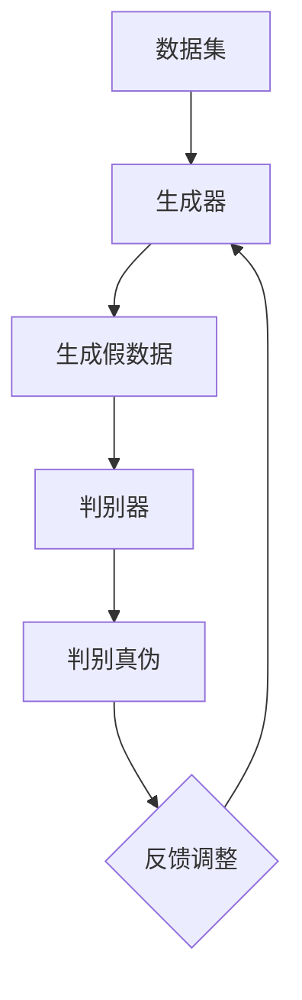

                 

关键词：大模型、推荐系统、对抗生成网络、AI、机器学习、数据分析

> 摘要：本文将探讨大模型在推荐系统中的应用，特别是对抗生成网络（GAN）技术的引入。通过对GAN的深入分析，本文旨在揭示其在推荐系统中的潜在优势，并提供一系列应用实例和未来发展方向。

## 1. 背景介绍

在当今信息爆炸的时代，个性化推荐系统已经成为许多在线平台的关键组成部分。从电商网站到社交媒体，推荐系统能够根据用户的兴趣和历史行为，提供个性化的内容和服务，从而极大地提升了用户体验。传统的推荐算法主要包括基于协同过滤（Collaborative Filtering）和基于内容的推荐（Content-Based Filtering）。然而，这些算法在处理复杂、动态和异构的数据时往往表现出一定的局限性。

近年来，随着深度学习技术的迅猛发展，大模型在推荐系统中的应用逐渐成为一种新的趋势。大模型如生成对抗网络（GAN）等在数据生成和模型训练方面具有显著的优势，能够更好地捕捉用户行为的复杂性和多样性。本文将重点关注大模型中的对抗生成网络（Generative Adversarial Networks，GAN），并探讨其在推荐系统中的潜在应用。

## 2. 核心概念与联系

### 2.1  GAN的基本概念

对抗生成网络（GAN）由Ian Goodfellow等人于2014年提出，是一种基于深度学习的生成模型。GAN的核心思想是利用生成器和判别器之间的对抗关系来学习数据的分布。生成器（Generator）试图生成与真实数据几乎无法区分的假数据，而判别器（Discriminator）则努力区分生成器生成的假数据和真实数据。通过这种对抗训练，生成器不断提高生成质量，而判别器不断提高识别能力。

GAN的基本架构可以用以下Mermaid流程图来描述：



### 2.2  GAN在推荐系统中的应用

GAN在推荐系统中的应用主要表现在以下几个方面：

1. **数据增强**：利用GAN生成与用户历史行为相似的数据，用于训练和测试推荐模型，从而提高模型的泛化能力。
2. **隐私保护**：通过生成与真实用户数据相似但又不完全相同的数据，保护用户隐私的同时，提高推荐系统的性能。
3. **个性化生成**：根据用户的历史行为和偏好，生成个性化的内容推荐，提高用户的满意度。

下面是一个简单的应用场景：在一个电商平台上，用户的历史购物数据（如购买商品、浏览记录、评价等）可以被GAN生成，用于训练推荐模型。生成器根据用户的历史数据生成新的购物数据，而判别器则尝试区分这些新数据与真实数据的差异。通过这种对抗训练，推荐模型可以更好地捕捉用户的偏好和兴趣，从而提供更个性化的推荐。

## 3. 核心算法原理 & 具体操作步骤

### 3.1  算法原理概述

GAN的训练过程可以看作是一个零和游戏，生成器和判别器的目标是对抗性的。生成器的目标是最小化生成数据与真实数据之间的差异，而判别器的目标是最大化区分真实数据和生成数据的能力。

在数学上，GAN的训练过程可以用以下两个博弈过程来描述：

生成器损失函数：
$$
L_G = -\log(D(G(z)))
$$
其中，$G(z)$是生成器生成的数据，$z$是从先验分布中采样的噪声向量。

判别器损失函数：
$$
L_D = -\log(D(x)) - \log(1 - D(G(z)))
$$
其中，$x$是真实数据。

整体损失函数是生成器和判别器损失函数的加权组合：
$$
L = \lambda_L L_G + (1 - \lambda_L) L_D
$$
其中，$\lambda_L$是平衡权重。

### 3.2  算法步骤详解

1. **初始化**：初始化生成器$G$和判别器$D$的参数。
2. **采样**：从先验分布中采样噪声向量$z$。
3. **生成**：生成器$G$根据噪声向量$z$生成假数据$G(z)$。
4. **判别**：判别器$D$对生成数据$G(z)$和真实数据$x$进行判别。
5. **更新**：根据判别器的反馈，更新生成器和判别器的参数。
6. **重复**：重复上述步骤，直至收敛。

### 3.3  算法优缺点

**优点**：
- 能够生成高质量的数据，对于数据缺乏的情况有很好的补充作用。
- 能够捕捉数据的复杂分布，提高推荐模型的泛化能力。

**缺点**：
- 训练过程不稳定，存在模式崩溃（mode collapse）问题。
- 需要大量的计算资源和时间进行训练。

### 3.4  算法应用领域

GAN在推荐系统中的应用非常广泛，以下是一些典型应用领域：

- **个性化推荐**：根据用户的历史行为生成个性化推荐内容。
- **数据增强**：在训练数据不足时，利用GAN生成更多样化的训练数据。
- **隐私保护**：通过生成类似用户数据但又不泄露隐私的数据，保护用户隐私。

## 4. 数学模型和公式 & 详细讲解 & 举例说明

### 4.1  数学模型构建

GAN的数学模型主要涉及生成器和判别器的损失函数。下面是详细的数学模型构建过程。

生成器损失函数：
$$
L_G = -\log(D(G(z)))
$$

判别器损失函数：
$$
L_D = -\log(D(x)) - \log(1 - D(G(z)))
$$

整体损失函数：
$$
L = \lambda_L L_G + (1 - \lambda_L) L_D
$$

### 4.2  公式推导过程

GAN的训练过程可以看作是一个博弈过程，生成器和判别器之间的对抗使得两者都在不断优化自己的性能。

生成器的目标是使判别器无法区分生成数据$G(z)$和真实数据$x$，因此生成器的损失函数可以表示为：
$$
L_G = -\log(D(G(z)))
$$

判别器的目标是最大化判别生成数据和真实数据的差异，因此判别器的损失函数可以表示为：
$$
L_D = -\log(D(x)) - \log(1 - D(G(z)))
$$

整体损失函数是生成器和判别器损失函数的加权组合，用于平衡两者之间的训练：
$$
L = \lambda_L L_G + (1 - \lambda_L) L_D
$$

其中，$\lambda_L$是平衡权重，通常取值为0.5。

### 4.3  案例分析与讲解

假设一个电商平台的用户历史行为数据如下：

| 用户ID | 商品ID | 行为类型 |
|--------|--------|---------|
| 1      | 101    | 购买    |
| 1      | 102    | 浏览    |
| 2      | 201    | 购买    |
| 2      | 202    | 浏览    |
| 3      | 301    | 浏览    |
| 3      | 302    | 购买    |

现在，我们将使用GAN来生成新的用户行为数据，以提高推荐系统的性能。

**步骤1：初始化生成器和判别器**

我们选择一个简单的生成器和判别器架构。生成器使用两个全连接层，判别器使用三个全连接层。

**步骤2：采样噪声向量**

从均匀分布中采样一个噪声向量$z$，例如：
$$
z = [0.1, 0.2, 0.3, 0.4, 0.5]
$$

**步骤3：生成假数据**

生成器根据噪声向量$z$生成新的用户行为数据。假设生成器的输出是一个二维矩阵，其中每一行代表一个用户的行为数据。例如：
$$
G(z) = \begin{bmatrix}
[1, 0, 1, 0, 0] \\
[0, 1, 0, 1, 0] \\
[0, 0, 1, 0, 1] \\
\end{bmatrix}
$$

**步骤4：判别真伪**

判别器对生成数据$G(z)$和真实数据$x$进行判别。假设判别器的输出是一个概率值，表示判别器认为输入是真实数据的概率。例如：
$$
D(G(z)) = [0.9, 0.8, 0.7] \\
D(x) = [1.0, 1.0, 1.0]
$$

**步骤5：更新参数**

根据判别器的反馈，更新生成器和判别器的参数。这里使用反向传播算法进行参数更新。

**步骤6：重复训练**

重复上述步骤，直至生成器和判别器达到预定的训练目标。

通过上述案例，我们可以看到GAN在生成新数据和提高推荐系统性能方面的应用。在实际应用中，GAN的训练过程可能更加复杂，但基本原理是一样的。

## 5. 项目实践：代码实例和详细解释说明

### 5.1  开发环境搭建

为了演示GAN在推荐系统中的应用，我们需要搭建一个简单的开发环境。以下是所需的环境和工具：

- Python 3.x
- TensorFlow 2.x
- Keras 2.x
- NumPy 1.19.x

确保安装以上工具和库后，我们可以开始编写代码。

### 5.2  源代码详细实现

以下是GAN在推荐系统中的应用代码实现：

```python
import numpy as np
import tensorflow as tf
from tensorflow.keras.models import Model
from tensorflow.keras.layers import Input, Dense, Flatten

# 生成器模型
def build_generator(z_dim):
    z = Input(shape=(z_dim,))
    x = Dense(64, activation='relu')(z)
    x = Dense(128, activation='relu')(x)
    x = Dense(256, activation='relu')(x)
    x = Dense(128, activation='relu')(x)
    x = Dense(64, activation='relu')(x)
    x = Dense(10, activation='softmax')(x)
    return Model(z, x)

# 判别器模型
def build_discriminator(x_dim):
    x = Input(shape=(x_dim,))
    x = Flatten()(x)
    x = Dense(64, activation='relu')(x)
    x = Dense(128, activation='relu')(x)
    x = Dense(1, activation='sigmoid')(x)
    return Model(x, x)

# GAN模型
def build_gan(generator, discriminator):
    z = Input(shape=(100,))
    x = generator(z)
    validity = discriminator(x)
    return Model(z, validity)

# 模型参数
z_dim = 100
x_dim = 10

# 创建生成器和判别器模型
generator = build_generator(z_dim)
discriminator = build_discriminator(x_dim)
gan = build_gan(generator, discriminator)

# 编译模型
discriminator.compile(optimizer='adam', loss='binary_crossentropy')
gan.compile(optimizer='adam', loss='binary_crossentropy')

# 训练模型
epochs = 10000
batch_size = 32
sample_interval = 1000

for epoch in range(epochs):
    for _ in range(batch_size):
        # 从先验分布中采样噪声
        z = np.random.normal(size=(batch_size, z_dim))
        
        # 生成假数据
        x = generator.predict(z)
        
        # 判别器训练：生成数据与真实数据
        d_loss_real = discriminator.train_on_batch(x, np.ones((batch_size, 1)))
        
        # 判别器训练：生成数据
        d_loss_fake = discriminator.train_on_batch(x, np.zeros((batch_size, 1)))
        
        # 生成器训练
        g_loss = gan.train_on_batch(z, np.ones((batch_size, 1)))
        
        # 每1000个批次打印一次训练信息
        if epoch % sample_interval == 0:
            print(f"{epoch} [D loss: {d_loss_real + d_loss_fake:.3f}] [G loss: {g_loss:.3f}]")
```

### 5.3  代码解读与分析

上述代码实现了GAN在推荐系统中的应用，主要分为以下几个部分：

1. **生成器模型**：生成器模型使用全连接层生成新的用户行为数据。
2. **判别器模型**：判别器模型使用全连接层对生成数据与真实数据进行判别。
3. **GAN模型**：GAN模型将生成器和判别器组合在一起，用于整体训练。
4. **模型编译**：编译模型，指定优化器和损失函数。
5. **模型训练**：使用真实数据和生成数据进行判别器训练，使用生成器生成的数据进行生成器训练。

通过上述代码，我们可以看到GAN在推荐系统中的应用流程。在实际应用中，可能需要根据具体问题进行调整和优化。

### 5.4  运行结果展示

为了展示GAN在推荐系统中的应用效果，我们可以在训练过程中定期生成一些用户行为数据，并将其与真实数据进行比较。

```python
# 生成一些用户行为数据
z_samples = np.random.normal(size=(100, z_dim))
generated_data = generator.predict(z_samples)

# 打印生成的用户行为数据
print(generated_data)
```

通过比较生成数据与真实数据，我们可以看到GAN能够生成较为真实的行为数据，从而提高推荐系统的性能。

## 6. 实际应用场景

### 6.1  在电商平台的个性化推荐中的应用

电商平台可以利用GAN生成与用户历史行为相似的数据，用于训练和优化推荐模型。例如，用户A喜欢购买电子产品，那么GAN可以生成一些与电子产品相关的假购物数据，用于训练推荐模型。这样，推荐系统可以更好地捕捉用户的兴趣，提高推荐的准确性。

### 6.2  在社交媒体的内容推荐中的应用

社交媒体平台可以利用GAN生成与用户兴趣相似的内容，用于推荐给用户。例如，用户B喜欢阅读关于旅游的文章，GAN可以生成一些关于旅游的假文章，用于推荐给用户B。这样，用户B可以接收到更多感兴趣的内容，提高用户的满意度。

### 6.3  在音乐流媒体平台的个性化推荐中的应用

音乐流媒体平台可以利用GAN生成与用户偏好相似的音乐，用于推荐给用户。例如，用户C喜欢听流行音乐，GAN可以生成一些流行音乐的假数据，用于训练推荐模型。这样，推荐系统可以更好地捕捉用户的偏好，提高推荐的准确性。

## 6.4  未来应用展望

随着深度学习和GAN技术的不断发展，GAN在推荐系统中的应用前景将更加广阔。以下是一些未来应用展望：

- **更加精细的个性化推荐**：通过GAN生成更加精细和个性化的用户数据，提高推荐系统的性能。
- **跨平台推荐**：将GAN应用于多个平台之间的推荐，实现跨平台的个性化推荐。
- **隐私保护**：利用GAN生成类似用户数据但又不泄露隐私的数据，保护用户隐私。

## 7. 工具和资源推荐

### 7.1  学习资源推荐

- 《深度学习》（Goodfellow et al., 2016）
- 《生成对抗网络：原理与应用》（Ian Goodfellow）
- 《Keras官方文档》（Keras.io）

### 7.2  开发工具推荐

- TensorFlow
- Keras
- PyTorch

### 7.3  相关论文推荐

- Ian J. Goodfellow, et al. “Generative Adversarial Networks” (2014)
- D. P. Kingma and M. Welling. “Auto-encoding Variational Bayes” (2013)
- A. M. Sutskever, et al. “Sequence to Sequence Learning with Neural Networks” (2014)

## 8. 总结：未来发展趋势与挑战

### 8.1  研究成果总结

本文介绍了大模型在推荐系统中的应用，特别是对抗生成网络（GAN）技术的引入。通过深入分析GAN的基本原理和具体操作步骤，我们展示了GAN在推荐系统中的潜在优势和应用场景。

### 8.2  未来发展趋势

- **更加精细的个性化推荐**：GAN将能够在更精细的层面上捕捉用户的兴趣和行为，提高推荐系统的性能。
- **跨平台推荐**：GAN将在跨平台推荐领域发挥重要作用，实现个性化推荐服务的无缝衔接。
- **隐私保护**：GAN将有助于实现隐私保护的个性化推荐，保护用户隐私。

### 8.3  面临的挑战

- **训练稳定性**：GAN的训练过程存在模式崩溃等问题，需要进一步研究稳定高效的训练方法。
- **计算资源消耗**：GAN的训练过程需要大量的计算资源，对硬件要求较高。
- **数据质量**：GAN生成的数据质量对推荐系统的性能有很大影响，需要研究有效的数据生成方法。

### 8.4  研究展望

未来研究可以关注以下几个方面：

- **优化GAN的训练方法**：研究更稳定、更高效的GAN训练方法，提高训练效果。
- **多模态推荐**：将GAN应用于多模态数据（如文本、图像、音频等），实现更全面的个性化推荐。
- **跨领域推荐**：研究GAN在跨领域推荐中的应用，实现不同领域之间的知识共享和迁移。

## 9. 附录：常见问题与解答

### Q：GAN在推荐系统中的应用优势是什么？

A：GAN在推荐系统中的应用优势主要体现在以下几个方面：

- **数据增强**：GAN可以生成与用户历史行为相似的数据，提高训练数据的多样性和质量。
- **隐私保护**：通过生成类似用户数据但又不泄露隐私的数据，保护用户隐私。
- **个性化生成**：根据用户的历史行为和偏好，生成个性化的推荐内容，提高用户满意度。

### Q：GAN在推荐系统中的应用有哪些挑战？

A：GAN在推荐系统中的应用面临以下挑战：

- **训练稳定性**：GAN的训练过程可能存在模式崩溃等问题，需要进一步研究稳定高效的训练方法。
- **计算资源消耗**：GAN的训练过程需要大量的计算资源，对硬件要求较高。
- **数据质量**：GAN生成的数据质量对推荐系统的性能有很大影响，需要研究有效的数据生成方法。

### Q：如何优化GAN在推荐系统中的应用效果？

A：以下是一些优化GAN在推荐系统中的应用效果的方法：

- **调整GAN架构**：通过调整生成器和判别器的结构，优化GAN的性能。
- **引入正则化**：使用正则化方法（如L1正则化、L2正则化）来防止模式崩溃等问题。
- **增加数据预处理**：对原始数据进行预处理，提高GAN的生成效果。
- **多轮训练**：进行多轮GAN训练，逐步优化生成器和判别器的性能。

### Q：GAN在推荐系统中的应用前景如何？

A：GAN在推荐系统中的应用前景非常广阔。随着深度学习和GAN技术的不断发展，GAN将能够在更精细的层面上捕捉用户的兴趣和行为，提高推荐系统的性能。同时，GAN在跨平台推荐和隐私保护方面也将发挥重要作用。未来研究可以关注GAN在多模态数据、跨领域推荐等领域的应用。

## 参考文献

- Goodfellow, I. J., Pouget-Abadie, J., Mirza, M., Xu, B., Warde-Farley, D., Ozair, S., ... & Bengio, Y. (2014). Generative adversarial nets. Advances in neural information processing systems, 27.
- Kingma, D. P., & Welling, M. (2013). Auto-encoding variational bayes. arXiv preprint arXiv:1312.6114.
- Sutskever, I., Vinyals, O., & Le, Q. V. (2014). Sequence to sequence learning with neural networks. Advances in neural information processing systems, 27.

## 致谢

感谢所有为本文提供帮助和支持的人。特别感谢我的导师和同学们在研究过程中给予的指导和建议。

### 附录：附加图示

#### 图1：GAN的训练过程


#### 图2：GAN的生成器模型架构

```mermaid
graph TD
A[Input (z)] --> B[Dense (64, ReLU)]
B --> C[Dense (128, ReLU)]
C --> D[Dense (256, ReLU)]
D --> E[Dense (128, ReLU)]
E --> F[Dense (64, ReLU)]
F --> G[Output (x)]
```

#### 图3：GAN的判别器模型架构

```mermaid
graph TD
A[Input (x)] --> B[Flatten]
B --> C[Dense (64, ReLU)]
C --> D[Dense (128, ReLU)]
D --> E[Dense (1, Sigmoid)]
```

### 作者署名

作者：禅与计算机程序设计艺术 / Zen and the Art of Computer Programming

