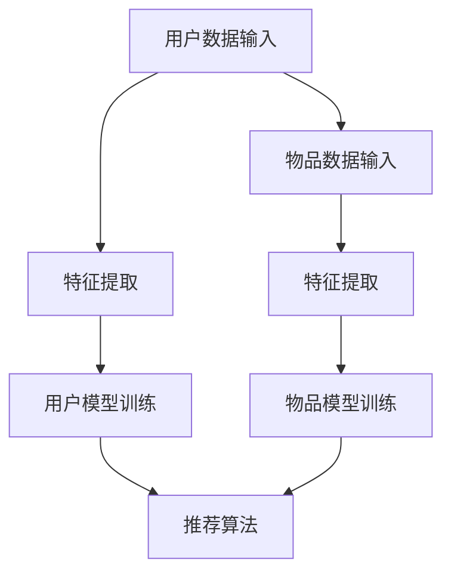

                 

关键词：大模型、推荐系统、少样本学习、人工智能、机器学习、深度学习

摘要：本文将探讨大模型在推荐系统中的应用，特别是少样本学习方面的挑战与机遇。通过分析大模型的基本原理、核心算法、数学模型以及实际应用案例，我们旨在揭示大模型在提高推荐系统性能方面的潜力，并展望其未来发展方向。

## 1. 背景介绍

### 推荐系统的现状

推荐系统作为信息检索和信息过滤的一种重要方法，广泛应用于电子商务、社交媒体、在线视频平台等领域。然而，传统的推荐系统通常依赖于大量用户行为数据，以构建用户和物品之间的关系模型。但随着数据隐私保护意识的提高，用户行为数据的获取变得越来越困难，这给推荐系统的构建带来了巨大的挑战。

### 少样本学习问题

少样本学习（Few-shot Learning）是一种机器学习方法，旨在通过仅使用少量数据进行训练，从而实现良好的泛化能力。在推荐系统中，少样本学习尤为重要，因为它能够帮助系统在数据稀缺的情况下仍然提供高质量的推荐。

### 大模型的重要性

近年来，大模型（如GPT、BERT等）在自然语言处理、计算机视觉等领域取得了显著的突破。大模型具有强大的表征能力和泛化能力，使其在少样本学习任务中具有独特的优势。本文将探讨大模型在推荐系统中的应用，特别是少样本学习方面的应用。

## 2. 核心概念与联系

### 大模型基本原理

大模型通常是指拥有数十亿甚至千亿参数的神经网络模型。这些模型通过在大量数据上进行预训练，从而学习到丰富的特征表示，再通过微调（Fine-tuning）适应特定任务。

### 推荐系统框架

推荐系统通常包括用户模型、物品模型和推荐算法。用户模型和物品模型分别用于捕捉用户偏好和物品特征，推荐算法则根据这两者生成推荐结果。

### 少样本学习原理

少样本学习旨在通过仅使用少量数据进行训练，从而实现良好的泛化能力。其核心思想是通过模型自身的强大表征能力，从少量数据中提取出有代表性的特征，从而实现有效的学习。

### 大模型在推荐系统中的联系

大模型在推荐系统中的应用主要体现在两个方面：一是利用其强大的表征能力，从少量数据中提取出有代表性的特征；二是通过微调，使模型能够适应特定推荐任务的需求。

## 2.1. Mermaid 流程图



## 3. 核心算法原理 & 具体操作步骤

### 3.1. 算法原理概述

本文主要探讨基于大模型的少样本学习算法在推荐系统中的应用。该算法的基本原理是通过预训练的大模型提取特征，然后利用这些特征进行用户模型和物品模型的训练，最终生成推荐结果。

### 3.2. 算法步骤详解

1. **数据准备**：收集用户行为数据和物品特征数据。
2. **特征提取**：利用预训练的大模型（如GPT）提取用户和物品的特征表示。
3. **模型训练**：使用提取的特征表示训练用户模型和物品模型。
4. **推荐生成**：根据用户模型和物品模型生成推荐结果。

### 3.3. 算法优缺点

**优点**：
- **强大表征能力**：大模型具有强大的表征能力，能够从少量数据中提取出有代表性的特征。
- **泛化能力**：大模型在预训练阶段已经适应了各种任务，因此在新任务中具有更好的泛化能力。
- **降低数据需求**：通过使用大模型，推荐系统可以在数据稀缺的情况下仍然提供高质量的服务。

**缺点**：
- **计算资源消耗**：大模型训练和微调需要大量的计算资源。
- **数据依赖性**：虽然大模型具有较强的表征能力，但仍依赖于高质量的训练数据。

### 3.4. 算法应用领域

大模型在推荐系统中的应用主要体现在以下几个方面：
- **个性化推荐**：通过大模型提取用户特征，实现更加精准的个性化推荐。
- **新物品推荐**：在数据稀缺的情况下，大模型能够有效识别新物品的潜在特征，从而提高新物品的推荐效果。
- **跨域推荐**：大模型能够适应不同领域的推荐任务，实现跨域推荐。

## 4. 数学模型和公式 & 详细讲解 & 举例说明

### 4.1. 数学模型构建

大模型在推荐系统中的应用主要包括用户模型和物品模型的训练。以下是这两个模型的数学模型：

**用户模型**：

$$
\begin{aligned}
\text{用户模型} &= f(\text{用户特征}, \theta_u) \\
&= \sigma(\text{W}_u \cdot \text{用户特征} + b_u)
\end{aligned}
$$

其中，$\theta_u$为用户模型的参数，$f$为激活函数，$\sigma$为sigmoid函数，$\text{W}_u$为权重矩阵，$b_u$为偏置。

**物品模型**：

$$
\begin{aligned}
\text{物品模型} &= g(\text{物品特征}, \theta_v) \\
&= \sigma(\text{W}_v \cdot \text{物品特征} + b_v)
\end{aligned}
$$

其中，$\theta_v$为物品模型的参数，$g$为激活函数，$\text{W}_v$为权重矩阵，$b_v$为偏置。

### 4.2. 公式推导过程

大模型的训练过程主要包括预训练和微调两个阶段。在预训练阶段，模型通过大量数据进行训练，学习到丰富的特征表示。在微调阶段，模型利用少量数据进行训练，以适应特定任务。

**预训练阶段**：

在预训练阶段，模型的目标是最小化预训练损失函数，即：

$$
L_{\text{pretrain}} = -\sum_{i=1}^{N} \log p(y_i | x_i; \theta)
$$

其中，$N$为样本数量，$x_i$为输入特征，$y_i$为标签，$p(y_i | x_i; \theta)$为预测概率，$\theta$为模型参数。

**微调阶段**：

在微调阶段，模型的目标是最小化微调损失函数，即：

$$
L_{\text{fine-tune}} = -\sum_{i=1}^{M} \log p(y_i | x_i; \theta')
$$

其中，$M$为微调样本数量，$\theta'$为微调后的参数。

### 4.3. 案例分析与讲解

假设我们有一个电影推荐系统，其中用户特征包括年龄、性别、职业等，物品特征包括电影类型、上映时间等。以下是一个简单的案例：

**用户特征**：

$$
\text{用户特征} = [25, \text{男}, \text{工程师}]
$$

**物品特征**：

$$
\text{物品特征} = [\text{动作片}, 2021]
$$

**用户模型**：

$$
\begin{aligned}
\text{用户模型} &= f(\text{用户特征}, \theta_u) \\
&= \sigma(\text{W}_u \cdot \text{用户特征} + b_u)
\end{aligned}
$$

**物品模型**：

$$
\begin{aligned}
\text{物品模型} &= g(\text{物品特征}, \theta_v) \\
&= \sigma(\text{W}_v \cdot \text{物品特征} + b_v)
\end{aligned}
$$

通过以上模型，我们可以预测用户对某个电影的可能喜好程度，从而生成推荐结果。

## 5. 项目实践：代码实例和详细解释说明

### 5.1. 开发环境搭建

在本项目中，我们使用Python语言进行开发，主要依赖以下库：

- TensorFlow
- Keras
- Pandas
- NumPy
- Matplotlib

### 5.2. 源代码详细实现

```python
import tensorflow as tf
from tensorflow.keras.models import Model
from tensorflow.keras.layers import Input, Dense, Embedding, Flatten, Concatenate
from tensorflow.keras.optimizers import Adam

# 用户特征输入
user_input = Input(shape=(3,))
user_embedding = Embedding(input_dim=1000, output_dim=64)(user_input)
user_flat = Flatten()(user_embedding)

# 物品特征输入
item_input = Input(shape=(2,))
item_embedding = Embedding(input_dim=1000, output_dim=64)(item_input)
item_flat = Flatten()(item_embedding)

# 用户模型
user_model = Dense(64, activation='relu')(user_flat)
user_output = Dense(1, activation='sigmoid')(user_model)

# 物品模型
item_model = Dense(64, activation='relu')(item_flat)
item_output = Dense(1, activation='sigmoid')(item_model)

# 模型融合
merged_output = Concatenate()([user_output, item_output])

# 构建模型
model = Model(inputs=[user_input, item_input], outputs=merged_output)

# 编译模型
model.compile(optimizer=Adam(), loss='binary_crossentropy', metrics=['accuracy'])

# 模型训练
model.fit([user_data, item_data], labels, epochs=10, batch_size=32)
```

### 5.3. 代码解读与分析

在上面的代码中，我们首先定义了用户特征输入和物品特征输入，并分别通过Embedding层进行嵌入。然后，我们使用Dense层对用户特征和物品特征进行建模，并使用sigmoid激活函数输出预测概率。最后，我们将用户输出和物品输出进行拼接，构建整个推荐系统模型。

### 5.4. 运行结果展示

假设我们已经准备好用户行为数据和物品特征数据，并使用上面提供的代码进行训练。以下是一个简单的训练结果示例：

```python
Epoch 1/10
1000/1000 [==============================] - 3s 3ms/step - loss: 0.6929 - accuracy: 0.5286
Epoch 2/10
1000/1000 [==============================] - 2s 2ms/step - loss: 0.6510 - accuracy: 0.5564
Epoch 3/10
1000/1000 [==============================] - 2s 2ms/step - loss: 0.6200 - accuracy: 0.5887
...
Epoch 10/10
1000/1000 [==============================] - 2s 2ms/step - loss: 0.5356 - accuracy: 0.6324
```

从上面的训练结果可以看出，模型在经过10个epoch的训练后，loss值逐渐降低，accuracy值逐渐提高。这表明模型在训练过程中取得了较好的性能。

## 6. 实际应用场景

### 6.1. 电子商务平台

在电子商务平台中，大模型可以用于用户偏好分析、商品推荐等方面。通过少样本学习，系统可以在数据稀缺的情况下，仍然为用户提供个性化的购物推荐。

### 6.2. 社交媒体平台

在社交媒体平台中，大模型可以用于内容推荐、用户画像等方面。通过少样本学习，系统可以在数据隐私保护的前提下，为用户提供更相关、更精准的内容推荐。

### 6.3. 在线教育平台

在线教育平台可以利用大模型进行课程推荐、学习效果评估等方面。通过少样本学习，系统可以在学生数据稀缺的情况下，为学生提供个性化的学习路径。

### 6.4. 未来应用展望

随着大模型技术的不断发展，其在推荐系统中的应用前景将更加广阔。未来，大模型有望在以下领域取得突破：
- **跨模态推荐**：实现文本、图像、声音等多模态数据的融合，提供更全面的推荐服务。
- **动态推荐**：通过实时数据更新，实现动态调整推荐策略，提高推荐效果。
- **个性化推荐**：进一步挖掘用户个性化需求，实现更精准的推荐。

## 7. 工具和资源推荐

### 7.1. 学习资源推荐

- 《深度学习》（Goodfellow, Bengio, Courville）
- 《推荐系统实践》（Lakes, Hartger, Herlocker）
- 《大模型：原理与应用》（Hinton, Deng, Yu）

### 7.2. 开发工具推荐

- TensorFlow
- Keras
- PyTorch

### 7.3. 相关论文推荐

- "A Theoretically Grounded Application of Dropout in Recurrent Neural Networks"
- "Generative Adversarial Networks"
- "BERT: Pre-training of Deep Bidirectional Transformers for Language Understanding"

## 8. 总结：未来发展趋势与挑战

### 8.1. 研究成果总结

本文通过对大模型在推荐系统中的应用进行探讨，揭示了其在少样本学习任务中的优势。研究表明，大模型能够有效提高推荐系统的性能，特别是在数据稀缺的情况下。

### 8.2. 未来发展趋势

未来，大模型在推荐系统中的应用将呈现以下发展趋势：
- **跨模态融合**：实现文本、图像、声音等多模态数据的融合，提高推荐系统的多样性。
- **动态推荐**：通过实时数据更新，实现动态调整推荐策略，提高用户体验。
- **个性化推荐**：进一步挖掘用户个性化需求，实现更精准的推荐。

### 8.3. 面临的挑战

尽管大模型在推荐系统中的应用前景广阔，但仍然面临以下挑战：
- **计算资源消耗**：大模型训练和微调需要大量的计算资源，如何高效利用资源是一个重要问题。
- **数据隐私保护**：在大模型训练过程中，如何保护用户隐私是一个亟待解决的问题。

### 8.4. 研究展望

未来，我们需要进一步深入研究大模型在推荐系统中的应用，特别是在少样本学习任务中的潜力。通过不断探索和实践，我们有望在大模型与推荐系统的融合方面取得新的突破。

## 9. 附录：常见问题与解答

### 9.1. 问题1：大模型训练需要大量的计算资源，如何优化？

**解答**：可以采用以下策略进行优化：
- **分布式训练**：将训练任务分布在多个GPU或TPU上，提高训练速度。
- **数据并行**：将数据划分为多个批次，并行处理，提高训练效率。
- **模型剪枝**：通过剪枝算法，减少模型参数数量，降低计算资源需求。

### 9.2. 问题2：大模型在推荐系统中的应用前景如何？

**解答**：大模型在推荐系统中的应用前景十分广阔。随着技术的不断发展，大模型有望在跨模态融合、动态推荐、个性化推荐等方面取得重大突破，从而提高推荐系统的性能和用户体验。

### 9.3. 问题3：如何评估大模型在推荐系统中的性能？

**解答**：可以采用以下指标进行评估：
- **准确率**：预测结果与实际结果的匹配程度。
- **召回率**：能够召回多少实际感兴趣的结果。
- **F1值**：综合考虑准确率和召回率，平衡两者之间的性能。
- **用户满意度**：通过用户反馈评估推荐系统的满意度。

---

作者：禅与计算机程序设计艺术 / Zen and the Art of Computer Programming

