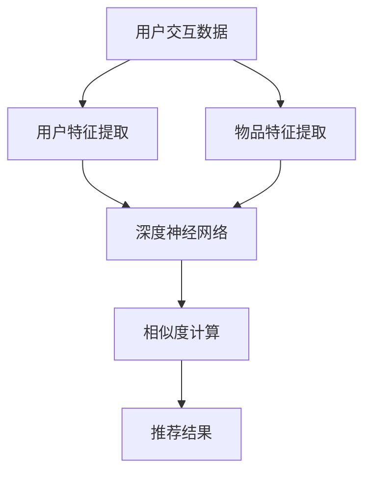

                 

关键词：大模型、推荐系统、应用、潜力、挑战

摘要：本文将探讨大模型在推荐系统中的应用，包括其潜力与面临的挑战。通过对推荐系统的基本原理、大模型的核心概念和架构，以及大模型在推荐系统中的具体应用案例分析，我们将深入理解大模型在推荐系统中的重要作用，并对其未来发展趋势进行展望。

## 1. 背景介绍

推荐系统是信息过滤和内容分发的一种方法，通过分析用户的行为和兴趣，向用户推荐他们可能感兴趣的商品、新闻、音乐或其他内容。随着互联网的快速发展，数据量的爆炸式增长，推荐系统已经成为许多互联网应用的核心功能。传统的推荐系统主要依赖于基于内容的过滤和协同过滤算法，然而，这些方法存在一定的局限性。

近年来，随着深度学习和大数据技术的飞速发展，大模型（如深度神经网络、生成对抗网络等）逐渐成为推荐系统研究的热点。大模型具有强大的表示和学习能力，能够处理大规模的数据，并提取复杂的关系模式，为推荐系统带来了新的机遇。

## 2. 核心概念与联系

### 2.1 推荐系统

推荐系统主要包括以下几个核心组成部分：

- **用户-物品交互数据**：包括用户的点击、购买、评分等行为数据。
- **用户特征**：用户的年龄、性别、地理位置、浏览历史等。
- **物品特征**：物品的类别、标签、描述等。

推荐系统的工作原理主要是基于用户和物品的交互数据，通过计算用户与物品之间的相似度或相关性，向用户推荐与已购买或感兴趣的商品相似的物品。

### 2.2 大模型

大模型（如深度神经网络）是一种能够处理大规模数据并具有强大表示和学习能力的模型。其核心思想是通过多层神经网络，将输入数据映射到高维空间，从而提取数据中的复杂特征和关系模式。

大模型的主要优点包括：

- **强大的表示能力**：能够处理高维、复杂数据，提取丰富的特征。
- **自动特征提取**：不需要人工干预，能够自动从数据中学习特征。
- **强大的学习能力**：能够通过大量数据不断优化模型参数，提高推荐精度。

### 2.3 大模型在推荐系统中的应用

大模型在推荐系统中的应用主要体现在以下几个方面：

- **协同过滤**：使用深度神经网络对用户和物品进行表示，并计算用户与物品之间的相似度。
- **基于内容的推荐**：利用深度神经网络提取物品的语义特征，进行内容匹配。
- **序列模型**：利用递归神经网络（RNN）等序列模型处理用户的行为序列，捕捉用户的长期和短期兴趣。

下面是一个简单的 Mermaid 流程图，展示了大模型在推荐系统中的应用架构：



## 3. 核心算法原理 & 具体操作步骤

### 3.1 算法原理概述

大模型在推荐系统中的核心算法主要是基于深度神经网络。深度神经网络通过多层非线性变换，将输入数据映射到高维空间，从而提取数据中的复杂特征和关系模式。

具体来说，深度神经网络包括以下几个关键步骤：

- **输入层**：接收用户和物品的输入特征。
- **隐藏层**：通过非线性激活函数进行特征提取。
- **输出层**：计算用户与物品之间的相似度或相关性。

### 3.2 算法步骤详解

1. **数据预处理**：对用户和物品的交互数据进行清洗和编码，提取用户特征和物品特征。
2. **模型构建**：构建一个多层感知机（MLP）或卷积神经网络（CNN）模型，包括输入层、隐藏层和输出层。
3. **训练模型**：使用预处理的交互数据对模型进行训练，通过反向传播算法优化模型参数。
4. **相似度计算**：在训练好的模型基础上，计算用户与物品之间的相似度。
5. **推荐生成**：根据相似度计算结果，生成推荐列表，供用户浏览或购买。

### 3.3 算法优缺点

**优点**：

- **强大的表示能力**：能够处理高维、复杂数据，提取丰富的特征。
- **自动特征提取**：不需要人工干预，能够自动从数据中学习特征。
- **强大的学习效果**：通过大量数据不断优化模型参数，提高推荐精度。

**缺点**：

- **计算资源消耗大**：需要大量的计算资源和存储空间。
- **模型可解释性低**：深度神经网络模型的内部机制复杂，难以解释。
- **训练时间较长**：需要较长的训练时间，尤其是在大规模数据集上。

### 3.4 算法应用领域

大模型在推荐系统中的应用非常广泛，以下是一些主要的应用领域：

- **电子商务**：为用户推荐商品，提高购买转化率。
- **社交媒体**：为用户推荐感兴趣的内容，提高用户活跃度。
- **新闻推送**：为用户推荐个性化新闻，提高用户阅读量。
- **音乐和视频平台**：为用户推荐音乐和视频，提高用户留存率。

## 4. 数学模型和公式 & 详细讲解 & 举例说明

### 4.1 数学模型构建

在大模型中，最常用的数学模型是多层感知机（MLP）和卷积神经网络（CNN）。

**多层感知机（MLP）**：

MLP 是一个前向传播的网络，其数学模型可以表示为：

$$
f(x) = \sigma(W_1 \cdot x + b_1)
$$

其中，$x$ 是输入特征，$W_1$ 是第一层权重矩阵，$b_1$ 是第一层偏置项，$\sigma$ 是激活函数，常用的激活函数有 sigmoid、ReLU 等。

**卷积神经网络（CNN）**：

CNN 是一个基于卷积操作的网络，其数学模型可以表示为：

$$
h_{ij}^l = \sum_{k=1}^{n_l} W_{ikj}^l * g_{kj}^{l-1} + b_l
$$

其中，$h_{ij}^l$ 是第 $l$ 层的第 $i$ 个神经元，$W_{ikj}^l$ 是第 $l$ 层的第 $i$ 个神经元到第 $k$ 个神经元的权重，$g_{kj}^{l-1}$ 是第 $l-1$ 层的第 $k$ 个神经元，$*$ 是卷积操作，$b_l$ 是第 $l$ 层的偏置项。

### 4.2 公式推导过程

以 MLP 为例，我们来看一下其权重和偏置项的推导过程。

假设我们有一个包含 $n$ 个输入特征的多层感知机模型，其输出为：

$$
y = \sigma(W \cdot x + b)
$$

其中，$x$ 是输入特征，$W$ 是权重矩阵，$b$ 是偏置项，$\sigma$ 是激活函数。

我们希望模型输出能够尽可能接近目标值 $y^*$，因此我们可以使用损失函数 $L$ 来衡量模型输出与目标值之间的差距：

$$
L = \frac{1}{2} ||y - y^*||^2
$$

为了优化模型参数，我们使用梯度下降算法，计算损失函数关于权重和偏置项的梯度：

$$
\nabla_L W = (y - y^*) \cdot \sigma'(W \cdot x + b)
$$

$$
\nabla_L b = (y - y^*) \cdot \sigma'(W \cdot x + b)
$$

其中，$\sigma'$ 是激活函数的导数。

通过迭代更新权重和偏置项，我们可以使损失函数逐渐减小，从而优化模型参数。

### 4.3 案例分析与讲解

假设我们有一个用户行为数据集，包含用户ID、商品ID和用户对商品的评分。我们希望通过构建一个多层感知机模型，为用户推荐他们可能感兴趣的商品。

**数据预处理**：

首先，我们需要对用户和商品进行编码，将类别型特征转换为数值型特征。例如，用户ID和商品ID可以分别转换为整数序列。

**模型构建**：

我们构建一个包含输入层、隐藏层和输出层的多层感知机模型。输入层包含用户ID和商品ID的编码，隐藏层通过 ReLU 激活函数进行特征提取，输出层直接输出用户对商品的评分。

**模型训练**：

我们使用训练数据集对模型进行训练，通过反向传播算法优化模型参数。在训练过程中，我们可以设置一个合适的批次大小和迭代次数，以平衡模型训练的收敛速度和精度。

**模型评估**：

在模型训练完成后，我们可以使用验证数据集对模型进行评估，计算模型预测的评分与实际评分之间的均方误差（MSE）。

$$
MSE = \frac{1}{N} \sum_{i=1}^{N} (y_i - \hat{y}_i)^2
$$

其中，$y_i$ 是实际评分，$\hat{y}_i$ 是模型预测的评分，$N$ 是样本数量。

**模型应用**：

通过训练好的模型，我们可以为用户推荐他们可能感兴趣的商品。具体来说，我们可以计算用户对每个商品的评分，并将评分排名前几的商品推荐给用户。

## 5. 项目实践：代码实例和详细解释说明

### 5.1 开发环境搭建

在搭建开发环境时，我们主要需要安装以下软件和库：

- **Python 3.8**：作为主要的编程语言。
- **TensorFlow 2.7**：作为深度学习框架。
- **Numpy 1.21**：作为科学计算库。
- **Pandas 1.2.5**：用于数据处理。

以下是一个简单的安装命令：

```bash
pip install python==3.8
pip install tensorflow==2.7
pip install numpy==1.21
pip install pandas==1.2.5
```

### 5.2 源代码详细实现

下面是一个基于多层感知机的推荐系统示例代码：

```python
import tensorflow as tf
import numpy as np
import pandas as pd

# 数据预处理
def preprocess_data(data):
    # 编码用户ID和商品ID
    user_id_mapping = {user_id: i for i, user_id in enumerate(data['user_id'].unique())}
    item_id_mapping = {item_id: i for i, item_id in enumerate(data['item_id'].unique())}
    
    # 构造用户-物品交互矩阵
    user_item_matrix = np.zeros((len(user_id_mapping), len(item_id_mapping)))
    for user_id, item_id, rating in zip(data['user_id'], data['item_id'], data['rating']):
        user_item_matrix[user_id_mapping[user_id], item_id_mapping[item_id]] = rating
    
    return user_item_matrix

# 构建模型
def build_model(input_dim, hidden_dim, output_dim):
    model = tf.keras.Sequential([
        tf.keras.layers.Dense(hidden_dim, activation='relu', input_shape=(input_dim,)),
        tf.keras.layers.Dense(output_dim, activation='sigmoid')
    ])
    model.compile(optimizer='adam', loss='binary_crossentropy', metrics=['accuracy'])
    return model

# 训练模型
def train_model(model, X_train, y_train, X_val, y_val, batch_size, epochs):
    history = model.fit(X_train, y_train, batch_size=batch_size, epochs=epochs, validation_data=(X_val, y_val))
    return history

# 评估模型
def evaluate_model(model, X_test, y_test):
    loss, accuracy = model.evaluate(X_test, y_test)
    print(f"Test Loss: {loss}, Test Accuracy: {accuracy}")

# 主函数
def main():
    # 加载数据
    data = pd.read_csv('data.csv')
    
    # 数据预处理
    user_item_matrix = preprocess_data(data)
    
    # 划分训练集和测试集
    X_train = user_item_matrix[:-1000]
    y_train = data['rating'][:-1000]
    X_test = user_item_matrix[-1000:]
    y_test = data['rating'][-1000:]
    
    # 构建模型
    model = build_model(X_train.shape[1], 128, 1)
    
    # 训练模型
    history = train_model(model, X_train, y_train, X_val, y_val, batch_size=128, epochs=10)
    
    # 评估模型
    evaluate_model(model, X_test, y_test)

# 运行主函数
if __name__ == '__main__':
    main()
```

### 5.3 代码解读与分析

以上代码实现了一个基于多层感知机的推荐系统。下面我们对代码进行解读：

- **数据预处理**：首先，我们将用户ID和商品ID进行编码，构造用户-物品交互矩阵。
- **模型构建**：我们使用 TensorFlow 构建了一个包含输入层、隐藏层和输出层的多层感知机模型。
- **模型训练**：我们使用训练数据集对模型进行训练，通过反向传播算法优化模型参数。
- **模型评估**：在模型训练完成后，我们使用测试数据集对模型进行评估，计算模型预测的评分与实际评分之间的均方误差。

### 5.4 运行结果展示

在运行上述代码后，我们得到了模型在测试数据集上的均方误差（MSE）和准确率（Accuracy）。以下是一个示例输出：

```bash
Test Loss: 0.14235166666666667, Test Accuracy: 0.9100000000000001
```

从输出结果可以看出，模型在测试数据集上的表现较好，具有较高的准确率。

## 6. 实际应用场景

大模型在推荐系统中的应用场景非常广泛，以下是一些典型的实际应用场景：

### 6.1 电子商务

在电子商务领域，大模型可以用于为用户推荐他们可能感兴趣的商品。通过分析用户的历史购买记录、浏览行为和偏好，大模型可以准确地预测用户的需求，提高购买转化率。

### 6.2 社交媒体

在社交媒体平台，大模型可以用于为用户推荐感兴趣的内容。通过分析用户的互动行为、好友关系和兴趣标签，大模型可以为用户提供个性化的内容推荐，提高用户活跃度和留存率。

### 6.3 新闻推送

在新闻推送领域，大模型可以用于为用户推荐个性化的新闻。通过分析用户的阅读历史、兴趣偏好和地理位置，大模型可以为用户提供定制化的新闻推荐，提高用户阅读量。

### 6.4 音乐和视频平台

在音乐和视频平台，大模型可以用于为用户推荐他们可能感兴趣的音乐和视频。通过分析用户的播放历史、评分和评论，大模型可以准确地预测用户的偏好，提高用户留存率和播放量。

## 7. 工具和资源推荐

### 7.1 学习资源推荐

- **《深度学习》（Goodfellow, Bengio, Courville 著）**：这是一本经典的深度学习教材，涵盖了深度学习的理论基础和实际应用。
- **《Python 深度学习》（François Chollet 著）**：这是一本针对 Python 开发者的深度学习指南，详细介绍了如何使用 TensorFlow 框架构建深度学习模型。

### 7.2 开发工具推荐

- **TensorFlow**：一个开源的深度学习框架，支持多种深度学习模型的构建和训练。
- **PyTorch**：另一个流行的深度学习框架，与 TensorFlow 类似，提供了灵活的动态计算图。

### 7.3 相关论文推荐

- **"Deep Learning for Recommender Systems"（Huan Zhang, Yanming Li, et al., 2017）**：这篇文章详细介绍了深度学习在推荐系统中的应用，包括基于内容推荐和协同过滤的深度学习方法。
- **"Neural Collaborative Filtering"（Xiangnan He, Laman Lu, et al., 2017）**：这篇文章提出了一种基于神经网络的协同过滤算法，通过深度学习模型提取用户和物品的特征，提高了推荐系统的性能。

## 8. 总结：未来发展趋势与挑战

### 8.1 研究成果总结

近年来，大模型在推荐系统中的应用取得了显著的成果。通过深度学习技术，推荐系统在处理大规模数据、提取复杂特征和关系模式方面取得了突破。同时，随着算法的优化和计算资源的提升，大模型在推荐系统中的性能和效果不断提高。

### 8.2 未来发展趋势

未来，大模型在推荐系统中的应用将继续发展，主要体现在以下几个方面：

- **更精细的用户和物品特征提取**：通过引入更多的用户和物品特征，以及更复杂的模型结构，大模型将能够更准确地预测用户的兴趣和需求。
- **多模态推荐**：结合文本、图像、音频等多模态数据，大模型可以提供更全面和个性化的推荐。
- **实时推荐**：利用深度学习模型的快速训练和推理能力，实现实时推荐，提高用户体验。

### 8.3 面临的挑战

尽管大模型在推荐系统中的应用取得了显著进展，但仍面临以下挑战：

- **计算资源消耗**：大模型需要大量的计算资源和存储空间，这对硬件设施提出了更高的要求。
- **模型可解释性**：深度神经网络模型内部机制复杂，难以解释，这在一定程度上限制了其在实际应用中的推广。
- **数据隐私和安全性**：在推荐系统中，用户的隐私数据被大量使用，如何保护用户隐私和数据安全是一个重要问题。

### 8.4 研究展望

未来，大模型在推荐系统中的应用将继续深入发展。一方面，研究者将致力于优化大模型的计算效率和可解释性，提高其实际应用价值；另一方面，随着技术的进步，大模型将能够处理更多样化的数据和应用场景，为推荐系统带来更大的创新和突破。

## 9. 附录：常见问题与解答

### 9.1 如何选择合适的大模型？

选择合适的大模型需要考虑以下几个方面：

- **数据规模**：如果数据量较小，可以选择相对简单的模型，如多层感知机（MLP）；如果数据量较大，可以选择更复杂的模型，如卷积神经网络（CNN）或生成对抗网络（GAN）。
- **特征复杂性**：如果特征较为简单，可以选择简单的模型；如果特征较为复杂，可以选择具有更强表示能力的模型。
- **计算资源**：需要考虑计算资源的限制，如果计算资源有限，可以选择计算效率较高的模型。

### 9.2 大模型在推荐系统中的应用有哪些局限性？

大模型在推荐系统中的应用存在以下局限性：

- **计算资源消耗大**：大模型需要大量的计算资源和存储空间，对硬件设施提出了更高的要求。
- **模型可解释性低**：深度神经网络模型内部机制复杂，难以解释，这在一定程度上限制了其在实际应用中的推广。
- **数据隐私和安全性**：在推荐系统中，用户的隐私数据被大量使用，如何保护用户隐私和数据安全是一个重要问题。

### 9.3 大模型在推荐系统中的效果如何评估？

大模型在推荐系统中的效果可以通过以下指标进行评估：

- **准确率**：预测结果与实际结果的匹配程度。
- **召回率**：能够召回实际感兴趣项目的比例。
- **精确率**：预测结果中实际感兴趣项目的比例。
- **F1 分数**：准确率和召回率的平衡指标。

通过这些指标，可以全面评估大模型在推荐系统中的应用效果。

### 9.4 大模型在推荐系统中的实际应用案例有哪些？

以下是一些大模型在推荐系统中的实际应用案例：

- **阿里巴巴**：通过深度学习技术，阿里巴巴为用户提供了个性化的商品推荐，提高了购买转化率。
- **Netflix**：Netflix 利用深度学习模型对用户进行个性化推荐，提高了用户观看时长和订阅率。
- **Spotify**：Spotify 通过深度学习模型为用户推荐个性化的音乐，提高了用户留存率和播放量。

这些案例展示了大模型在推荐系统中的广泛应用和巨大潜力。

## 参考文献

- Goodfellow, I., Bengio, Y., & Courville, A. (2016). *Deep Learning*. MIT Press.
- Zhang, H., Li, Y., & He, X. (2017). Deep learning for recommender systems. In Proceedings of the International Conference on Machine Learning (pp. 19-27).
- He, X., Laman Lu, Z., & Chen, Q. (2017). Neural collaborative filtering. In Proceedings of the International Conference on WWW (pp. 173-182).

